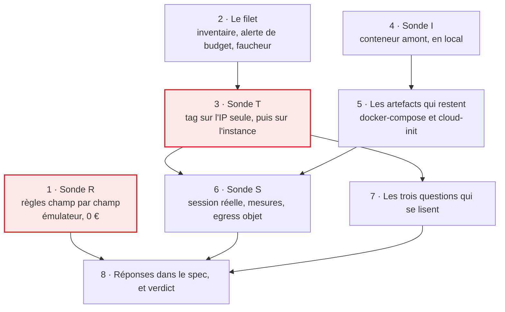

# Tranche 0 — Sonder

> **For agentic workers:** REQUIRED SUB-SKILL: Use superpowers:subagent-driven-development (recommended) or superpowers:executing-plans to implement this plan task-by-task. Steps use checkbox (`- [ ]`) syntax for tracking.

**But :** répondre aux neuf questions ouvertes du §12 du spec par la mesure et non
par la supposition, et livrer au passage un serveur Enshrouded jouable démarré à
la main.

**Approche :** une sonde n'est pas un système, c'est une suite d'expériences dont
seul le résultat écrit compte. Les deux questions qui peuvent déplacer
l'architecture passent en premier, la moins chère d'abord : la restriction champ
par champ des règles Firestore se tranche sur l'émulateur pour 0 €, le tag sur
l'IP flottante coûte une IP de cinq minutes. Rien qui crée une ressource
facturée n'est lancé avant qu'existent une alerte de budget et un faucheur
manuel — la règle du lotissement « le faucheur avant le semeur » vaut aussi à
l'intérieur de cette tranche, où aucun watchdog ne rattrapera l'oubli.

**Pile :** Node 22, TypeScript exécuté par `tsx`, Vitest, l'émulateur Firestore
via `firebase-tools`, `@firebase/rules-unit-testing`, Docker en local, et l'API
Scaleway appelée en `fetch` avec un en-tête `X-Auth-Token`. Aucun workspace Nx :
il naît en tranche 1, avec le premier code qui reste.

> **L'hébergeur a changé en cours de tranche.** Le plan d'origine visait OVH. La
> tâche 3 a mesuré que son API v1 ne porte de tag ni sur l'instance ni sur l'IP
> flottante ; le spec est passé à Scaleway le 2026-09-03, et les tâches 2, 3 et
> 6 ont été réécrites. Les tâches 1, 4, 5 et 7 n'étaient pas concernées.

**Spec :** [`docs/superpowers/specs/2026-09-02-game-hosting-design.md`](../specs/2026-09-02-game-hosting-design.md) —
les questions sondées sont son §12. Le découpage en tranches est au
[lotissement](2026-09-02-lotissement.md).

## Où en est la tranche

Au 2026-09-03. Les cases à cocher des tâches ne sont pas tenues à jour : le
rapport et l'historique git font foi, cette section dit seulement par où
reprendre.

| Tâche | État |
|---|---|
| 1 · Sonde R | **faite**, verdict dans `probe/RESULTS.md` |
| 2 · Le filet | **faite** — client, inventaire, faucheur sur le SDK Scaleway, 13 cas de test |
| 3 · Sonde T | **faite** — tag posé, relu et filtrable sur l'instance comme sur l'IP, filtre exact et non par préfixe |
| 4 · Sonde I | **faite** |
| 5 · Les artefacts | **faits**, `deploy/` est écrit et validé |
| 6 · Sonde S | **faite** — trois sessions, démarrage mesuré, session jouée, sauvegarde restaurée sur une machine neuve |
| 7 · Les trois questions | **faite** — alerte de monitoring, identité fédérée et tarif du catalogue |
| 8 · Le spec | **faite** — le §12 est un relevé, il ne reste que deux réponses différées |

Le §12 du spec est passé de neuf questions ouvertes à deux, et aucune ne bloque
la tranche 1 : l'egress Object Storage avec le prix du stockage, qui se lit sur
la facture du mois, et la charge à quatre joueurs, qui affinera le
dimensionnement sans pouvoir faire choisir moins.

## Contraintes globales

- **Aucune ressource Scaleway n'est créée, modifiée ou détruite par un agent.**
  Tout appel qui écrit chez Scaleway est écrit dans le plan, expliqué, et
  **lancé par un humain**. Un agent peut lancer les appels en lecture seule
  (`GET`).
- **Aucune écriture dans le Firestore de production, aucun `firebase deploy`.**
  L'émulateur est la cible, sur le projet fictif `demo-beacon` : le préfixe
  `demo-` garantit que le SDK ne joint jamais un vrai projet.
- **Toute ressource créée pendant cette tranche porte le préfixe de nom
  `beacon-probe-` *et* le tag `beacon-probe`.** Le préfixe de nom est ce qui
  rend le faucheur fiable avant que le mécanisme de tag soit confirmé en vivo ;
  le tag est ce que la sonde T vérifie. Une IP flottante Scaleway n'a pas de
  nom, seulement des tags — c'est la seule ressource que le faucheur ne sait pas
  reconnaître autrement, et la tâche 2 le dit explicitement.
- **Les images sont référencées par leur digest `sha256:`, jamais par un tag
  mobile** (§10 du spec). Cela vaut dès la tranche 0 pour l'image amont.
- **La clé secrète Scaleway ne quitte pas la machine du développeur** : elle vit
  dans `probe/.env`, déjà couvert par le `.gitignore` du dépôt (`.env`).
- Code, noms de fichiers et commentaires en **anglais** ; documentation, rapport
  de sonde et messages de commit en **français**.
- Commits en Conventional Commits, description française à l'impératif, portée
  parmi `probe`, `deploy`, `spec`, `plan`.
- Budget attendu de la tranche entière : **moins de 0,20 €** — environ 2 h
  d'instance `DEV1-L` à 0,04284 €/h et son IP à 0,005 €/h, plus quelques
  centimes de stockage objet. La sonde T ne coûte presque rien : une IP
  flottante quelques minutes, et la plus petite instance de la gamme.
- **Toute commande de ce plan se lance avec l'outil Bash**, c'est-à-dire Git Bash
  sur cette machine. Rien ne s'exécute par un `npx -e` à guillemets imbriqués :
  chaque script a son entrée dans `probe/package.json` et se lance par
  `npm --prefix probe run <script>`, seule forme qui survit à la fois au shell
  POSIX et à PowerShell.

## L'ordre et ce qui le produit



Les deux cases encadrées de rouge sont celles dont une réponse négative corrige
le spec avant que le plan de la tranche 1 s'écrive. Les tâches 1 et 4 ne
touchent rien de facturé et peuvent tourner pendant qu'une autre attend. La 7
demande le catalogue du projet, donc la clé de la 2 et le script de la 3.

## Ce que la tranche 0 ne construit pas

Une sonde bien faite ressemble à un début de système, et c'est le piège. Ce qui
suit est hors périmètre, non par oubli mais par décision :

- **Pas de workspace Nx.** Il naît en tranche 1, avec le premier code qui reste.
  `probe/` est un dossier Node autonome, et le `nx-generate` obligatoire du
  `CLAUDE.md` s'applique au monorepo, qui n'existe pas encore.
- **Pas de `libs/scaleway-compute`.** Les scripts de `probe/scaleway/`
  connaissent les routes de l'API en clair, chacun pour son compte. En faire un
  adapter aujourd'hui serait le construire contre les hypothèses que la sonde
  est justement chargée de vérifier — l'adapter s'écrit en tranche 1, sur les
  réponses. La bascule d'hébergeur en cours de tranche est la démonstration :
  l'adapter écrit trop tôt aurait été à jeter.
- **Pas de `firestore.rules` de production.** Les règles de la tâche 1 sont un
  banc d'essai du mécanisme, pas la couche d'autorisation : celle-là s'écrit en
  tranche 4, avec `firebase-security-rules-auditor`, et elle est bien plus large.
- **Pas de compagnon, pas de `rclone`, pas de restauration de save.** C'est la
  tranche 3, et son gate ferme : aucun monde auquel on tient ne migre avant.
- **Aucun déploiement, d'aucune sorte.** Le gate de la tranche 4 tient : rien
  n'est exposé publiquement avant elle.

Une tâche de ce plan qui semble en réclamer une est une tâche mal lue.

---

### Task 1: Sonde R — la restriction champ par champ des règles Firestore

Le spec fait reposer toute la propriété des champs de `server/current` sur
`request.resource.data.diff(resource.data).affectedKeys().hasOnly([...])`. Si ce
mécanisme ne restreint pas réellement champ par champ, le document se scinde en
deux — l'un écrit par le navigateur, l'autre par les Functions — et le §5 change.
La question se tranche sur l'émulateur, sans un centime et sans hébergeur : elle passe
donc en premier.

Ces règles ne sont pas les règles du produit. Ce sont les règles minimales qui
mettent le mécanisme sous tension ; les vraies s'écrivent en tranche 4.

**Fichiers :**
- Créer : `probe/package.json`
- Créer : `probe/firebase.json`
- Créer : `probe/rules/firestore.rules`
- Test : `probe/rules/field-ownership.spec.ts`
- Créer : `probe/RESULTS.md`

**Interfaces :**
- Consomme : rien.
- Produit : `probe/package.json`, dont la tâche 2 étend les dépendances et les
  scripts ; `probe/RESULTS.md`, le rapport que toutes les tâches suivantes
  complètent et que la tâche 8 recopie dans le spec.

- [ ] **Step 1: Créer le socle du dossier de sonde**

Prérequis : Node ≥ 22 et un JRE installé — l'émulateur Firestore tourne sur la
JVM. Vérifier avec `node --version` et `java -version` avant de continuer.

`probe/package.json` :

```json
{
  "name": "beacon-probe",
  "private": true,
  "type": "module",
  "scripts": {
    "probe:rules": "firebase emulators:exec --project demo-beacon \"vitest run rules\""
  },
  "devDependencies": {
    "@firebase/rules-unit-testing": "^4.0.1",
    "firebase": "^11.0.0",
    "firebase-tools": "^13.29.1",
    "typescript": "^5.7.2",
    "vitest": "^2.1.8"
  }
}
```

`probe/firebase.json` :

```json
{
  "firestore": {
    "rules": "rules/firestore.rules"
  },
  "emulators": {
    "firestore": { "port": 8080 },
    "ui": { "enabled": false },
    "singleProjectMode": true
  }
}
```

Puis `npm install --prefix probe`.

- [ ] **Step 2: Écrire le test qui met le mécanisme sous tension**

`probe/rules/field-ownership.spec.ts` :

```ts
import { readFileSync } from 'node:fs'
import { fileURLToPath } from 'node:url'
import {
  assertFails,
  assertSucceeds,
  initializeTestEnvironment,
  type RulesTestEnvironment,
} from '@firebase/rules-unit-testing'
import { deleteField, doc, setDoc, updateDoc } from 'firebase/firestore'
import { afterAll, beforeAll, beforeEach, describe, it } from 'vitest'

const RULES_PATH = fileURLToPath(new URL('./firestore.rules', import.meta.url))

const MEMBER_UID = 'alice'
const STRANGER_UID = 'mallory'

// The two halves of server/current, as §5 of the spec splits them.
const REQUESTED_FIELDS = {
  state: 'IDLE',
  sessionId: '',
  startedBy: '',
  startedAt: null,
  deadline: null,
}

const RESERVED_FIELDS = {
  instanceId: 'i-seed',
  ipId: 'f-seed',
  ip: '203.0.113.7',
  provisionClaimedAt: null,
  lastError: '',
}

let env: RulesTestEnvironment

beforeAll(async () => {
  env = await initializeTestEnvironment({
    projectId: 'demo-beacon',
    firestore: {
      rules: readFileSync(RULES_PATH, 'utf8'),
      host: '127.0.0.1',
      port: 8080,
    },
  })
})

afterAll(async () => {
  await env.cleanup()
})

beforeEach(async () => {
  await env.clearFirestore()
  await env.withSecurityRulesDisabled(async (context) => {
    const db = context.firestore()
    await setDoc(doc(db, 'members', MEMBER_UID), { email: 'alice@example.com', role: 'player' })
    await setDoc(doc(db, 'server', 'current'), { ...REQUESTED_FIELDS, ...RESERVED_FIELDS })
  })
})

const asMember = () => env.authenticatedContext(MEMBER_UID).firestore()
const asStranger = () => env.authenticatedContext(STRANGER_UID).firestore()

describe('field ownership on server/current', () => {
  it('lets a member write a requested field', async () => {
    const db = asMember()
    await assertSucceeds(updateDoc(doc(db, 'server', 'current'), { deadline: 'T+4h' }))
  })

  it('rejects a member writing a reserved field alone', async () => {
    const db = asMember()
    await assertFails(updateDoc(doc(db, 'server', 'current'), { ip: '198.51.100.4' }))
  })

  // The crux: one illegitimate field must sink an otherwise legitimate write.
  it('rejects a mixed write as a whole', async () => {
    const db = asMember()
    await assertFails(
      updateDoc(doc(db, 'server', 'current'), { deadline: 'T+5h', ip: '198.51.100.4' }),
    )
  })

  it('rejects a member deleting a reserved field', async () => {
    const db = asMember()
    await assertFails(updateDoc(doc(db, 'server', 'current'), { ip: deleteField() }))
  })

  it('rejects a member asserting a state only a Function can constate', async () => {
    const db = asMember()
    await assertFails(updateDoc(doc(db, 'server', 'current'), { state: 'RUNNING' }))
  })

  it('rejects a non-member entirely', async () => {
    const db = asStranger()
    await assertFails(updateDoc(doc(db, 'server', 'current'), { deadline: 'T+4h' }))
  })

  it('rejects a client creating the document', async () => {
    await env.clearFirestore()
    await env.withSecurityRulesDisabled(async (context) => {
      await setDoc(doc(context.firestore(), 'members', MEMBER_UID), {
        email: 'alice@example.com',
        role: 'player',
      })
    })
    const db = asMember()
    await assertFails(
      setDoc(doc(db, 'server', 'current'), { ...REQUESTED_FIELDS, ...RESERVED_FIELDS }),
    )
  })

  // Observation, not a requirement: diff() reports changed keys, so rewriting a
  // reserved field with its current value may not register as a change at all.
  // Whatever this does, it goes in RESULTS.md — the rules of tranche 4 must know.
  it('records what an identical rewrite of a reserved field does', async () => {
    const db = asMember()
    await assertSucceeds(updateDoc(doc(db, 'server', 'current'), { ip: RESERVED_FIELDS.ip }))
  })
})
```

- [ ] **Step 3: Lancer le test contre des règles qui refusent tout, et le voir échouer**

`probe/rules/firestore.rules`, première version — délibérément fermée, pour
vérifier que le harnais teste bien quelque chose :

```
rules_version = '2';

service cloud.firestore {
  match /databases/{database}/documents {
    match /{document=**} {
      allow read, write: if false;
    }
  }
}
```

Run : `npm --prefix probe run probe:rules`
Attendu : les tests d'écriture légitime échouent (`assertSucceeds` sur un refus),
les tests de refus passent. Le harnais parle à l'émulateur.

- [ ] **Step 4: Écrire les règles minimales qui portent le mécanisme**

`probe/rules/firestore.rules` :

```
rules_version = '2';

service cloud.firestore {
  match /databases/{database}/documents {

    function isMember() {
      return request.auth != null
        && exists(/databases/$(database)/documents/members/$(request.auth.uid));
    }

    function touchesOnlyRequestedFields() {
      return request.resource.data.diff(resource.data).affectedKeys()
        .hasOnly(['state', 'sessionId', 'startedBy', 'startedAt', 'deadline']);
    }

    function assertsNoServerOnlyState() {
      return !('state' in request.resource.data.diff(resource.data).affectedKeys())
        || request.resource.data.state in ['PROVISIONING', 'STOPPING'];
    }

    match /server/current {
      allow read: if isMember();
      allow create, delete: if false;
      allow update: if isMember() && touchesOnlyRequestedFields() && assertsNoServerOnlyState();
    }

    match /members/{uid} {
      allow read: if isMember();
      allow write: if false;
    }
  }
}
```

- [ ] **Step 5: Lancer le test et lire ce qu'il dit**

Run : `npm --prefix probe run probe:rules`
Attendu : les sept premiers cas passent. Le huitième — la réécriture à
l'identique — passe ou échoue, et c'est l'observation.

Si `hasOnly` ne restreint pas, l'échec est spectaculaire : le cas « écriture
mixte » passe alors qu'il devrait échouer. **C'est ce cas-là qui décide** si
`server/current` reste un seul document.

- [ ] **Step 6: Consigner le verdict**

Créer `probe/RESULTS.md`. C'est le rapport de la tranche entière ; chaque tâche y
ajoute sa section, et la tâche 8 les recopie dans le §12 du spec.

```markdown
# Rapport de sonde — tranche 0

Chaque section répond à une question du §12 du spec. Une réponse sans la
commande ou l'observation qui la fonde n'est pas une réponse.

## R · Restriction champ par champ dans les règles Firestore

Question du §12 : `diff(resource.data).affectedKeys().hasOnly([...])`
restreint-il réellement champ par champ ? Sinon, `server/current` se scinde en
deux documents.

Commande : `npm --prefix probe run probe:rules`

| Cas | Attendu | Observé |
|---|---|---|
| écriture d'un champ demandé | accepté | |
| écriture d'un champ réservé seul | refusé | |
| écriture mixte demandé + réservé | refusé | |
| suppression d'un champ réservé | refusé | |
| `state: RUNNING` depuis le navigateur | refusé | |
| écriture par un non-membre | refusé | |
| création du document par un client | refusé | |
| réécriture d'un champ réservé à l'identique | inconnu — c'est l'observation | |

**Verdict :**

**Conséquence pour le spec :**
```

- [ ] **Step 7: Commit**

```bash
git add probe/package.json probe/package-lock.json probe/firebase.json probe/rules probe/RESULTS.md
git commit -m "test(probe): mesure la restriction champ par champ des regles Firestore"
```

---

### Task 2: Le filet — inventaire, alerte de budget, faucheur manuel

> **Cette tâche est faite, et le code ci-dessous est le brouillon d'avant le
> SDK.** La sonde parlait à l'API par un `fetch` maison ; elle s'est trompée
> trois fois sur la forme des requêtes, deux fois après qu'une ressource
> facturée existe, et elle est passée au SDK officiel `@scaleway/sdk`. **Le code
> qui fait foi est dans `probe/scaleway/`**, pas ici. Ce qui suit reste pour le
> raisonnement — pourquoi chaque pièce existe — et ne se recopie pas.

Aucun watchdog n'existe. Ce qui est créé dans les tâches suivantes n'est détruit
que si quelqu'un le détruit, et une instance oubliée un vendredi soir coûte
~3,10 € le temps qu'on s'en aperçoive. Le faucheur passe donc avant le semeur, à
l'échelle de cette tranche comme à celle du projet.

Cette tâche ne crée rien chez Scaleway. Elle lit, et elle se dote du moyen de
détruire.

**La décision de détruire est du code pur, testé.** C'est le seul endroit de la
sonde qui mérite un test : un faucheur trop gourmand efface une ressource qui
n'est pas à nous, un faucheur trop timide laisse filer de l'argent. La règle de
sélection est donc une fonction sans réseau, et le script qui appelle l'API n'en
est que l'enveloppe.

**Fichiers :**
- Modifier : `probe/package.json` — dépendances et scripts
- Modifier : `probe/.env.example`
- Créer : `probe/scaleway/client.ts`
- Créer : `probe/scaleway/reaper-policy.ts`
- Test : `probe/scaleway/reaper-policy.spec.ts`
- Créer : `probe/scaleway/inventory.ts`
- Créer : `probe/scaleway/inventory-report.ts`
- Créer : `probe/scaleway/reap.ts`
- Modifier : `probe/RESULTS.md`
- Supprimer : `probe/ovh/` — sauf `schema.ts`, dont la mesure a fondé la bascule

**Interfaces :**
- Consomme : `probe/package.json` de la tâche 1.
- Produit :
  - `scwConfig(): { secretKey: string; projectId: string; zone: string }`
  - `scwFetch<T>(path: string, init?: { method?: string; body?: unknown }): Promise<T>`
    — `path` est relatif à `https://api.scaleway.com`
  - `runScript(main: () => Promise<void>): void` — le pied de page commun à tous
    les scripts de sonde
  - `selectDoomed(inventory: ProbeInventory, options: { includeOrphanIps: boolean }): Doomed`
  - `npm --prefix probe run scw:inventory` et `npm --prefix probe run scw:reap`,
    utilisés par les tâches 3 et 6.

- [ ] **Step 1: Obtenir une clé API Scaleway — geste humain**

Cette étape se fait à la main dans la console Scaleway, elle ne s'automatise pas.

1. Créer le projet Public Cloud s'il n'existe pas, dans l'organisation.
2. Ouvrir *IAM → Clés API*, créer une clé pour son propre utilisateur.
3. Recopier la `Secret Key` et l'`ID du projet` dans `probe/.env`. L'`Access
   Key` ne sert pas : l'API Instance s'authentifie par la seule clé secrète.

**Une clé ne suffit pas : il faut une politique.** Scaleway ne coche pas les
droits route par route comme OVH, mais il ne donne pas non plus tout par
défaut — le principal porteur de la clé doit avoir une *policy* qui lui attache
un *permission set*, sinon les lectures passent et les écritures rendent
`403 permissions_denied`.

Pour la sonde, dans *IAM → Policies*, attacher au principal :

| Jeu de permissions | Portée | Pourquoi |
|---|---|---|
| `InstancesFullAccess` | le projet | créer et **détruire** serveurs, IP, volumes |
| `ObjectStorageFullAccess` | le projet | la mesure d'egress de la tâche 6, et la tranche 3 |

`InstancesReadOnly` seul suffit à tout ce que la sonde fait en lecture —
inventaire, catalogue, faucheur à vide — mais pas à la sonde T.

C'est une bonne nouvelle pour plus tard : la tranche 2 pourra donner à la
Function une clé qui crée des instances **sans** aucun droit sur le stockage, et
au compagnon une clé Object Storage **sans** aucun droit de calcul. Le §8 du spec
parle d'identifiants restreints ; voilà avec quoi les restreindre.

`probe/.env.example` — versionné, sans valeur :

```dotenv
# Scaleway API key, created in the console under IAM > API keys.
# The real file is probe/.env, which .gitignore already excludes.
SCW_SECRET_KEY=
SCW_PROJECT_ID=
SCW_ZONE=fr-par-1
```

Vérifier avant d'aller plus loin que `git status` ne propose pas `probe/.env`.

- [ ] **Step 2: Écrire le test de la règle de sélection**

`probe/scaleway/reaper-policy.spec.ts` :

```ts
import { describe, expect, it } from 'vitest'
import { PROBE_PREFIX, PROBE_TAG, selectDoomed } from './reaper-policy'

const server = (id: string, name: string, tags: string[] = []) => ({ id, name, tags, state: 'running' })
const ip = (id: string, address: string, tags: string[] = [], serverId: string | null = null) => ({
  id,
  address,
  tags,
  server: serverId ? { id: serverId } : null,
})
const volume = (id: string, serverId: string | null = null) => ({
  id,
  name: `${id}-vol`,
  size: 80_000_000_000,
  server: serverId ? { id: serverId } : null,
})

const inventory = (parts: Partial<{ servers: any[]; ips: any[]; volumes: any[] }>) => ({
  servers: parts.servers ?? [],
  ips: parts.ips ?? [],
  volumes: parts.volumes ?? [],
})

const withoutOrphans = { includeOrphanIps: false }
const withOrphans = { includeOrphanIps: true }

describe('selectDoomed', () => {
  it('claims a server whose name carries the probe prefix', () => {
    const doomed = selectDoomed(inventory({ servers: [server('s1', `${PROBE_PREFIX}0001`)] }), withoutOrphans)
    expect(doomed.servers.map((s) => s.id)).toEqual(['s1'])
  })

  it('leaves a server that is none of ours alone', () => {
    const doomed = selectDoomed(inventory({ servers: [server('s1', 'prod-web')] }), withoutOrphans)
    expect(doomed.servers).toEqual([])
  })

  // The reaper must never guess about a volume: it carries none of our tags,
  // and destroying someone else's disk is not a mistake it gets to make.
  it('reports a detached volume without ever claiming it', () => {
    const doomed = selectDoomed(inventory({ volumes: [volume('v1')] }), withOrphans)
    expect(doomed.strayVolumes.map((v) => v.id)).toEqual(['v1'])
  })

  it('says nothing about a volume still attached to a server', () => {
    const doomed = selectDoomed(
      inventory({ servers: [server('s1', `${PROBE_PREFIX}0001`)], volumes: [volume('v1', 's1')] }),
      withoutOrphans,
    )
    expect(doomed.strayVolumes).toEqual([])
  })

  // Deliberate, and worth a test so that it stays a decision: on a project
  // dedicated to the probe, our tag outranks whose server the ip hangs off.
  it('claims a tagged ip even when it hangs off a server we spare', () => {
    const doomed = selectDoomed(
      inventory({ servers: [server('s1', 'prod-web')], ips: [ip('i1', '51.15.0.1', [PROBE_TAG], 's1')] }),
      withoutOrphans,
    )
    expect(doomed.ips.map((i) => i.id)).toEqual(['i1'])
  })

  // An ip has no name at Scaleway, only tags. Without this the reaper would be
  // blind to exactly the resource that keeps billing after its server dies.
  it('claims an ip by its probe tag alone', () => {
    const doomed = selectDoomed(inventory({ ips: [ip('i1', '51.15.0.1', [PROBE_TAG])] }), withoutOrphans)
    expect(doomed.ips.map((i) => i.id)).toEqual(['i1'])
  })

  it('claims an ip attached to a doomed server even without the tag', () => {
    const doomed = selectDoomed(
      inventory({ servers: [server('s1', `${PROBE_PREFIX}0001`)], ips: [ip('i1', '51.15.0.1', [], 's1')] }),
      withoutOrphans,
    )
    expect(doomed.ips.map((i) => i.id)).toEqual(['i1'])
  })

  it('reports an untagged unattached ip without claiming it', () => {
    const doomed = selectDoomed(inventory({ ips: [ip('i1', '51.15.0.1')] }), withoutOrphans)
    expect(doomed.ips).toEqual([])
    expect(doomed.orphanIps.map((i) => i.id)).toEqual(['i1'])
  })

  it('claims the untagged unattached ip once asked to', () => {
    const doomed = selectDoomed(inventory({ ips: [ip('i1', '51.15.0.1')] }), withOrphans)
    expect(doomed.ips.map((i) => i.id)).toEqual(['i1'])
  })

  it('never lists the same ip twice when tag and attachment both match', () => {
    const doomed = selectDoomed(
      inventory({ servers: [server('s1', `${PROBE_PREFIX}0001`)], ips: [ip('i1', '51.15.0.1', [PROBE_TAG], 's1')] }),
      withOrphans,
    )
    expect(doomed.ips).toHaveLength(1)
  })
})
```

- [ ] **Step 3: Lancer le test et le voir échouer**

Remplacer les scripts et les dépendances de `probe/package.json` :

```json
{
  "scripts": {
    "probe:rules": "firebase emulators:exec --project demo-beacon \"vitest run rules\"",
    "probe:scw": "vitest run scaleway",
    "scw:products": "tsx scaleway/products.ts",
    "ovh:schema": "tsx ovh/schema.ts",
    "scw:inventory": "tsx scaleway/inventory-report.ts",
    "scw:reap": "tsx scaleway/reap.ts",
    "scw:tag": "tsx scaleway/tag-probe.ts",
    "scw:session": "tsx scaleway/session-probe.ts"
  },
  "devDependencies": {
    "@firebase/rules-unit-testing": "^4.0.1",
    "dotenv": "^16.4.7",
    "firebase": "^11.0.0",
    "firebase-tools": "^13.29.1",
    "tsx": "^4.19.2",
    "typescript": "^5.7.2",
    "vitest": "^2.1.8"
  }
}
```

Puis `npm install --prefix probe`.

Run : `npm --prefix probe run probe:scw`
Attendu : FAIL, `Failed to resolve import "./reaper-policy"`.

- [ ] **Step 4: Écrire la règle de sélection**

`probe/scaleway/reaper-policy.ts` :

```ts
export const PROBE_PREFIX = 'beacon-probe-'
export const PROBE_TAG = 'beacon-probe'

export type ProbeServer = { id: string; name: string; state: string; tags: string[] }
export type ProbeIp = { id: string; address: string; tags: string[]; server: { id: string } | null }
export type ProbeVolume = { id: string; name: string; size: number; server: { id: string } | null }

export type ProbeInventory = { servers: ProbeServer[]; ips: ProbeIp[]; volumes: ProbeVolume[] }

export type Doomed = {
  servers: ProbeServer[]
  ips: ProbeIp[]
  /** Untagged and unattached: billed, probably ours, never destroyed on our own. */
  orphanIps: ProbeIp[]
  /** Detached and outliving their server: reported, never destroyed on our own. */
  strayVolumes: ProbeVolume[]
}

export function selectDoomed(
  inventory: ProbeInventory,
  options: { includeOrphanIps: boolean },
): Doomed {
  const servers = inventory.servers.filter((server) => server.name.startsWith(PROBE_PREFIX))
  const doomedServerIds = new Set(servers.map((server) => server.id))

  const isOurs = (ip: ProbeIp) =>
    ip.tags.includes(PROBE_TAG) || (ip.server !== null && doomedServerIds.has(ip.server.id))
  const isOrphan = (ip: ProbeIp) => !isOurs(ip) && ip.server === null

  const orphanIps = inventory.ips.filter(isOrphan)
  const ips = inventory.ips.filter(
    (ip) => isOurs(ip) || (options.includeOrphanIps && isOrphan(ip)),
  )

  // A volume has no tag of ours to carry — it is created by the server, not by
  // us. Detached, it is billed and invisible: reported, never auto-destroyed.
  const strayVolumes = inventory.volumes.filter((volume) => volume.server === null)

  return { servers, ips, orphanIps: options.includeOrphanIps ? [] : orphanIps, strayVolumes }
}
```

- [ ] **Step 5: Lancer le test et le voir passer**

Run : `npm --prefix probe run probe:scw`
Attendu : PASS, dix cas.

- [ ] **Step 6: Écrire le client**

`probe/scaleway/client.ts` :

```ts
import 'dotenv/config'

const API_ROOT = 'https://api.scaleway.com'

export function scwConfig() {
  const required = ['SCW_SECRET_KEY', 'SCW_PROJECT_ID', 'SCW_ZONE'] as const
  const missing = required.filter((key) => !process.env[key])
  if (missing.length > 0) {
    throw new Error(`probe/.env is missing: ${missing.join(', ')}`)
  }
  return {
    secretKey: process.env.SCW_SECRET_KEY!,
    projectId: process.env.SCW_PROJECT_ID!,
    zone: process.env.SCW_ZONE!,
  }
}

// The caller names the shape it expects; nothing here can check it, and pushing
// an `unknown` onto every call site would only spread the cast around.
// `text` exists for the one endpoint that refuses JSON: cloud-init user data.
export async function scwFetch<T>(
  path: string,
  init: { method?: string; body?: unknown; text?: string } = {},
): Promise<T> {
  const { secretKey } = scwConfig()
  const method = init.method ?? 'GET'
  const isText = init.text !== undefined
  const response = await fetch(`${API_ROOT}${path}`, {
    method,
    headers: {
      'Content-Type': isText ? 'text/plain' : 'application/json',
      'X-Auth-Token': secretKey,
    },
    body: isText ? init.text : init.body === undefined ? undefined : JSON.stringify(init.body),
  })

  const text = await response.text()
  if (!response.ok) {
    throw new Error(`${method} ${path} -> ${response.status} ${text}`)
  }
  return (text === '' ? null : JSON.parse(text)) as T
}

// Every probe script ends the same way; without this, six copies of the same
// six lines drift apart and one of them forgets to set a failing exit code.
export function runScript(main: () => Promise<void>): void {
  main().catch((error) => {
    console.error(error)
    process.exitCode = 1
  })
}
```

Il n'y a pas de signature à assembler : Scaleway authentifie par un en-tête. Les
quatre-vingts lignes de sha1 que l'API OVH imposait, et le test qui les gardait,
disparaissent avec elle.

- [ ] **Step 7: Écrire l'inventaire**

Il liste tout ce qui existe dans la zone, pas seulement ce que la sonde croit
avoir créé : une ressource qu'on ne sait pas nommer est exactement celle qui
survit.

`probe/scaleway/inventory.ts` :

```ts
import { scwConfig, scwFetch } from './client'
import type { ProbeInventory, ProbeIp, ProbeServer, ProbeVolume } from './reaper-policy'

// Library only, deliberately: `reap.ts` imports this, and a module-level
// runScript here would run the report every time the reaper starts.
// The human-facing listing lives in inventory-report.ts.
export async function readInventory(): Promise<ProbeInventory> {
  const { zone, projectId } = scwConfig()
  const query = `project=${projectId}&per_page=100`
  const [servers, ips, volumes] = await Promise.all([
    scwFetch<{ servers: ProbeServer[] }>(`/instance/v1/zones/${zone}/servers?${query}`),
    scwFetch<{ ips: ProbeIp[] }>(`/instance/v1/zones/${zone}/ips?${query}`),
    // The quietest resource of the lot: a volume outlives its server if the
    // terminate action does not take it, and appears in neither list above.
    scwFetch<{ volumes: Record<string, ProbeVolume> }>(
      `/instance/v1/zones/${zone}/volumes?${query}`,
    ),
  ])
  return {
    servers: servers.servers,
    ips: ips.ips,
    volumes: Object.values(volumes.volumes),
  }
}
```

`probe/scaleway/inventory-report.ts` :

```ts
import { scwConfig, runScript } from './client'
import { readInventory } from './inventory'

runScript(async () => {
  const { zone } = scwConfig()
  const { servers, ips, volumes } = await readInventory()

  console.log(`\n=== servers in ${zone} (${servers.length}) ===`)
  for (const server of servers) {
    console.log([server.id, server.name, server.state, server.tags.join('|') || '-'].join('  '))
  }

  console.log(`\n=== flexible ips in ${zone} (${ips.length}) ===`)
  for (const ip of ips) {
    console.log(
      [ip.id, ip.address, ip.server?.id ?? 'unattached', ip.tags.join('|') || '-'].join('  '),
    )
  }

  console.log(`\n=== volumes in ${zone} (${volumes.length}) ===`)
  for (const volume of volumes) {
    console.log(
      [volume.id, volume.name, volume.server?.id ?? 'detached', `${volume.size}`].join('  '),
    )
  }
})
```

`inventory.ts` est une bibliothèque et rien d'autre. Le faucheur l'importe, et
un `runScript` au niveau du module y ferait tourner l'inventaire à chaque
lancement du faucheur — c'est arrivé, et c'est le même piège que celui du
résolveur d'image. Le listing pour l'humain vit donc dans `inventory-report.ts`.

`readInventory` est partagé parce que deux lectures divergentes de « ce qui
existe » seraient deux vérités, et que le faucheur détruit sur cette lecture.

- [ ] **Step 8: Lancer l'inventaire et noter l'état initial**

Run : `npm --prefix probe run scw:inventory`
Attendu : la liste, probablement vide, des ressources du projet. Une erreur
`401` signifie une clé fausse ; une `403`, un utilisateur sans droit sur le
projet. **Cette sortie est la ligne de base** : à la fin de la tranche,
l'inventaire doit y être revenu. La coller dans `probe/RESULTS.md`.

- [ ] **Step 9: Écrire le faucheur**

`probe/scaleway/reap.ts` :

```ts
import { scwConfig, scwFetch, runScript } from './client'
import { readInventory } from './inventory'
import { selectDoomed } from './reaper-policy'

runScript(async () => {
  const { zone } = scwConfig()
  const confirmed = process.argv.includes('--yes')
  const includeOrphanIps = process.argv.includes('--include-orphan-ips')

  const doomed = selectDoomed(await readInventory(), { includeOrphanIps })

  for (const server of doomed.servers) {
    console.log(`server ${server.id} ${server.name} ${server.state}`)
  }
  for (const ip of doomed.ips) {
    console.log(`flexible ip ${ip.id} ${ip.address}`)
  }
  if (doomed.orphanIps.length > 0) {
    console.log(
      `\n${doomed.orphanIps.length} unattached, untagged ip(s) left alone and still billed: ` +
        `${doomed.orphanIps.map((ip) => ip.address).join(', ')}\n` +
        'rerun with --include-orphan-ips to destroy them too',
    )
  }
  if (doomed.strayVolumes.length > 0) {
    console.log(
      `\n${doomed.strayVolumes.length} detached volume(s), billed and attached to nothing: ` +
        `${doomed.strayVolumes.map((volume) => volume.id).join(', ')}\n` +
        'they carry no tag of ours — destroy them by hand once identified',
    )
  }

  if (!confirmed) {
    console.log('\ndry run — rerun with --yes to destroy the resources listed above')
    return
  }

  // The ip goes first: an orphaned flexible ip keeps billing after its server dies.
  for (const ip of doomed.ips) {
    await scwFetch(`/instance/v1/zones/${zone}/ips/${ip.id}`, { method: 'DELETE' })
    console.log(`destroyed flexible ip ${ip.id}`)
  }
  for (const server of doomed.servers) {
    // A running server refuses deletion; ask for the poweroff and let it settle.
    await scwFetch(`/instance/v1/zones/${zone}/servers/${server.id}/action`, {
      method: 'POST',
      body: { action: 'terminate' },
    })
    console.log(`terminated server ${server.id}`)
  }
})
```

`terminate` est l'action qui détruit le serveur **et** ses volumes attachés. Un
`DELETE` sur le serveur seul laisserait le volume, facturé et invisible dans la
liste des serveurs — la panne exacte que le faucheur existe pour empêcher. À
vérifier en vivo à la tâche 3 étape 5, et à consigner.

- [ ] **Step 10: Vérifier le faucheur à vide**

Run : `npm --prefix probe run scw:reap`
Attendu : aucune ressource listée, et le message `dry run`. Le faucheur ne
détruit rien sans `--yes` : c'est ce qui permet à un agent de le lancer sans
danger, et à un humain seul de conclure.

- [ ] **Step 11: Poser l'alerte de budget Scaleway — geste humain**

Dans la console Scaleway, *Facturation → Alertes de consommation* : créer une
alerte à **2 €** par mois, destinataire l'adresse de l'administrateur.

Ce n'est pas de la décoration : la tranche 0 démarre des machines sans watchdog,
et le §7 du spec fait de l'alerte de budget le garde-fou humain de dernier
recours. Elle existe avant la première instance, pas après.

**Si Scaleway n'en propose pas**, c'est une réponse à consigner : le §7 doit
alors nommer un autre garde-fou, et la tranche 1 le construire.

- [ ] **Step 12: Commit**

```bash
git rm -r probe/ovh/client.ts probe/ovh/client.spec.ts probe/ovh/me.ts \
  probe/ovh/inventory.ts probe/ovh/reap.ts probe/ovh/price.ts
git add probe/package.json probe/package-lock.json probe/.env.example probe/scaleway probe/RESULTS.md
git commit -m "feat(probe): outille l'API Scaleway et son faucheur avant toute creation"
```

`probe/ovh/schema.ts` reste : c'est la commande qui fonde la section T du
rapport, et une mesure dont on a perdu la commande n'est plus une mesure.

---

### Task 3: Sonde T — le tag sur l'IP flottante, puis sur l'instance

> **Cette tâche est faite, et le code ci-dessous est le brouillon d'avant le
> SDK.** La sonde parlait à l'API par un `fetch` maison ; elle s'est trompée
> trois fois sur la forme des requêtes, deux fois après qu'une ressource
> facturée existe, et elle est passée au SDK officiel `@scaleway/sdk`. **Le code
> qui fait foi est dans `probe/scaleway/`**, pas ici. Ce qui suit reste pour le
> raisonnement — pourquoi chaque pièce existe — et ne se recopie pas.

Deuxième question qui peut déplacer l'architecture. Toute la réconciliation du
watchdog repose sur un tag `beacon:{sessionId}` posé sur l'instance **et** sur
l'IP flottante, et sur la capacité de les lister.

**Cette tâche a déjà changé le projet une fois.** Écrite pour OVH, son étape de
lecture du schéma a montré que l'API v1 ne porte de métadonnée sur aucune des
deux ressources et n'en rend aucune en lecture. Le spec est passé à Scaleway le
2026-09-03 (§2), où `tags` est un champ natif du serveur et de l'IP, filtrable.
Ce qui reste à faire n'est donc plus « trouver un mécanisme » mais **vérifier en
vivo celui que la documentation annonce** — ce n'est pas la même tâche, et ça ne
coûte plus la même chose.

Trois étapes, de la gratuite à la facturée, et on s'arrête dès qu'une échoue :

1. lire le catalogue des gabarits — gratuit, aucune ressource créée ;
2. taguer une **IP flottante seule** — quelques centimes d'heure, pas d'instance ;
3. taguer un serveur, le plus petit de la gamme.

L'ordre n'est pas décoratif : l'IP est la moitié qui décide, et c'est aussi la
moins chère à éprouver. La sonder sans instance est possible chez Scaleway, où
une IP flottante est une ressource autonome. Chez OVH elle ne l'était pas, et le
plan d'origine allumait une machine pour rien.

**Fichiers :**
- Créer : `probe/scaleway/products.ts`
- Créer : `probe/scaleway/images.ts`
- Créer : `probe/scaleway/tag-probe.ts`
- Modifier : `probe/RESULTS.md`

**Interfaces :**
- Consomme : `scwFetch`, `scwConfig`, `readInventory`, `npm run scw:reap` de la
  tâche 2.
- Produit : la section T de `RESULTS.md`, dont dépend le mécanisme de
  réconciliation de la tranche 1 ; et la réponse sur le gabarit, dont dépend le
  §2 du spec.

- [x] **Step 1: Lire le catalogue des gabarits — gratuit, un agent peut le lancer**

**Fait le 2026-09-03**, et le résultat a corrigé le §2 du spec. Le script reste
ici parce qu'il se rejoue, et parce que la suite du plan s'en sert.

Ce qu'il a montré, en deux temps. Le catalogue diffère par zone, et `PRO2` —
que le §2 nommait en repli — n'est commandable dans aucune zone parisienne.
Puis, moins évident et bien plus utile : **un type listé, tarifé et non obsolète
peut refuser d'être créé faute de capacité.** Toute la famille `BASIC1` est en
`shortage`, et `createServer` rend alors un `403 quotas_exceeded` dont le
libellé oriente vers un quota de compte qui n'existe pas.

`DEV1-L` est donc le défaut : le seul gabarit à 8 Gio de la zone qui soit à la
fois `available` et livré avec son disque. Pas par préférence — faute
d'alternative.

C'est aussi ce qui a fait de la zone une décision : `fr-par-1` porte le défaut
et son repli aux meilleurs prix de la région, ce que personne n'avait vérifié
avant de la poser dans `.env.example`.

`probe/scaleway/products.ts` :

```ts
import { scwConfig, scwFetch, runScript } from './client'

type Product = {
  ncpus: number
  ram: number
  volumes_constraint: { min_size: number; max_size: number }
  per_volume_constraint?: { l_ssd?: { min_size: number; max_size: number } }
  network: { sum_internal_bandwidth?: number | null; ipv6_support: boolean }
  arch: string
  hourly_price: number
}

const GIGABYTE = 1000 ** 3

runScript(async () => {
  const { zone } = scwConfig()
  const needle = (process.argv[2] ?? '').toUpperCase()

  const { servers } = await scwFetch<{ servers: Record<string, Product> }>(
    `/instance/v1/zones/${zone}/products/servers`,
  )

  for (const [name, product] of Object.entries(servers)) {
    if (needle && !name.includes(needle)) continue
    const localSsd = product.per_volume_constraint?.l_ssd
    console.log(
      [
        name.padEnd(18),
        `${product.ncpus} vCPU`,
        `${Math.round(product.ram / GIGABYTE)} Go`,
        localSsd ? `local ${Math.round(localSsd.max_size / GIGABYTE)} Go` : 'block only',
        `${product.hourly_price} EUR/h`,
        product.arch,
      ].join('  '),
    )
  }
})
```

Run, une fois par gamme candidate, et sans argument pour voir la zone entière :

```bash
npm --prefix probe run scw:products -- DEV1
npm --prefix probe run scw:products
SCW_ZONE=fr-par-2 npm --prefix probe run scw:products   # le catalogue change par zone
```

Consigner dans `RESULTS.md` le gabarit retenu, son disque local, son prix
horaire réel, et ce que la zone change.

**Si la colonne du disque affiche `block only` pour tout le monde, se méfier
avant de conclure** : c'est aussi ce qu'affiche un nom de champ erroné. Vérifier
sur la réponse brute — `curl` sur la même route — que `per_volume_constraint` et
`l_ssd` existent bien sous ces noms. Un gabarit déclaré sans disque local
pousserait à tort vers un gabarit sans disque et ferait ajouter un `volumeId`
au §5 pour rien.

**Si le gabarit retenu disparaît du catalogue ou perd son disque local, le §2 du
spec se corrige avant la suite**, et le §5 gagne un `volumeId` à réconcilier. Ne
pas enchaîner sans avoir tranché.

- [ ] **Step 2: Résoudre l'image, puis écrire la sonde de tag**

Le champ `image` de l'API Instance attend un **UUID**, propre à la zone et au
gabarit ; `ubuntu_noble` est un label de la place de marché, pas un
identifiant. C'est un module à part et non un bout de `tag-probe.ts`, parce que
la tâche 6 en a besoin aussi et qu'importer un script qui appelle `runScript`
au chargement lancerait la sonde.

`probe/scaleway/images.ts` :

```ts
import { scwFetch } from './client'

type LocalImage = { id: string; zone: string; compatible_commercial_types: string[] }
type MarketplaceImage = { label: string; versions: { local_images: LocalImage[] }[] }

export async function resolveImageId(
  zone: string,
  commercialType: string,
  label = 'ubuntu_noble',
): Promise<string> {
  const { images } = await scwFetch<{ images: MarketplaceImage[] }>(
    '/marketplace/v2/images?page_size=100',
  )

  const image = images.find((candidate) => candidate.label === label)
  if (!image) throw new Error(`no ${label} image in the marketplace`)

  const local = image.versions
    .flatMap((version) => version.local_images)
    .find(
      (candidate) =>
        candidate.zone === zone && candidate.compatible_commercial_types.includes(commercialType),
    )
  if (!local) throw new Error(`no ${label} image for ${commercialType} in ${zone}`)

  return local.id
}
```

Cette route est un `GET` public : **l'inspecter avant de créer quoi que ce
soit.** Si sa forme diffère de celle supposée ici, le corriger coûte une lecture ;
le découvrir après avoir réservé une IP coûte un cycle complet.

Puis la sonde elle-même. Elle crée le strict minimum, observe, et laisse le
faucheur nettoyer.

`probe/scaleway/tag-probe.ts` :

```ts
import { scwConfig, scwFetch, runScript } from './client'
import { resolveImageId } from './images'
import { PROBE_PREFIX, PROBE_TAG, type ProbeIp, type ProbeServer } from './reaper-policy'

const SESSION_ID = 'probe0001'
const SESSION_TAG = `session:${SESSION_ID}`

runScript(async () => {
  const { zone, projectId } = scwConfig()
  const withServer = process.argv.includes('--with-server')

  // The half that decides, and the cheap one: at Scaleway a flexible ip exists
  // on its own, so the tag is measurable without booting anything.
  const created = await scwFetch<{ ip: ProbeIp }>(`/instance/v1/zones/${zone}/ips`, {
    method: 'POST',
    body: { project: projectId, type: 'routed_ipv4', tags: [PROBE_TAG, SESSION_TAG] },
  })
  console.log(`created ip ${created.ip.id} ${created.ip.address}`)
  console.log(`tags returned at creation: ${JSON.stringify(created.ip.tags)}`)

  const reread = await scwFetch<{ ip: ProbeIp }>(`/instance/v1/zones/${zone}/ips/${created.ip.id}`)
  console.log(`tags on re-read:            ${JSON.stringify(reread.ip.tags)}`)

  const filtered = await scwFetch<{ ips: ProbeIp[] }>(
    `/instance/v1/zones/${zone}/ips?project=${projectId}&tags=${encodeURIComponent(SESSION_TAG)}`,
  )
  console.log(`ips returned by tags=${SESSION_TAG}: ${filtered.ips.map((ip) => ip.id).join(', ') || 'none'}`)

  if (!withServer) {
    console.log('\nip half done — rerun with --with-server to also probe the server tag')
    return
  }

  const typeIndex = process.argv.indexOf('--type')
  const commercialType = typeIndex === -1 ? PROBE_TYPE : process.argv[typeIndex + 1]

  const server = await scwFetch<{ server: ProbeServer }>(`/instance/v1/zones/${zone}/servers`, {
    method: 'POST',
    body: {
      project: projectId,
      name: `${PROBE_PREFIX}${SESSION_ID}`,
      commercial_type: commercialType,
      image: await resolveImageId(zone, commercialType),
      tags: [PROBE_TAG, SESSION_TAG],
    },
  })
  console.log(`\ncreated server ${server.server.id}`)
  console.log(`tags returned at creation: ${JSON.stringify(server.server.tags)}`)

  const listed = await scwFetch<{ servers: ProbeServer[] }>(
    `/instance/v1/zones/${zone}/servers?project=${projectId}&tags=${encodeURIComponent(SESSION_TAG)}`,
  )
  console.log(
    `servers returned by tags=${SESSION_TAG}: ${listed.servers.map((s) => s.id).join(', ') || 'none'}`,
  )
})
```

Le serveur est créé **sans être démarré** : l'appel de création ne l'allume pas,
et le tag se lit sur une machine éteinte. C'est le tag qu'on mesure, pas le boot.

Une observation à relever au passage : **`terminate` refuse-t-il un serveur
jamais allumé ?** Celui-ci ne l'est pas, et c'est exactement ce que le faucheur
devra détruire. Si l'action échoue sur un serveur `stopped`, écrire le repli —
`DELETE` du serveur puis de ses volumes — dans `RESULTS.md` et corriger la
tâche 2.

- [ ] **Step 3: Éprouver l'IP seule — geste humain, elle crée une ressource facturée**

Run : `npm --prefix probe run scw:tag`

Répondre à trois questions, et les écrire :

1. l'IP porte-t-elle les tags rendus par l'appel de création ?
2. la relecture unitaire les rend-elle aussi ?
3. **le filtre `tags=` les retrouve-t-il côté serveur ?** C'est celle qui décide
   si le watchdog interroge par tag ou rapatrie tout pour trier.

Trois `oui` et le §5 tient tel qu'il est écrit. Un `non` sur la troisième et il
faut lister sans filtre — c'est plus lent, ce n'est pas grave. Un `non` sur la
première ou la deuxième, et **on est dans la situation d'OVH** : le §5 et le §6
changent de mécanisme, et le spec se corrige avant la tranche 1.

- [ ] **Step 4: Éprouver le serveur — geste humain**

Run : `npm --prefix probe run scw:tag -- --with-server`

Le défaut est `DEV1-L`, à 0,04284 €/h. Ce n'est pas le moins cher de la zone —
c'est le seul à 8 Gio qui soit `available` **et** livré avec son disque, et la
sonde a appris à ses dépens que le reste ne se crée pas.

Deux gabarits sont tombés avant lui. `DEV1-S` n'existe pas : de la gamme `DEV1`,
seul le `L` subsiste ici. `BASIC1-X1C-2G`, à 0,0068 €/h, semblait imbattable —
toute sa famille est en `shortage`, et `createServer` rend alors un
`403 quotas_exceeded` dont le libellé égare. Les deux auraient échoué **après**
la création de l'IP facturée ; l'étape 1 les attrape avant.

Mêmes questions que l'étape 3, et une de plus : **une IP détachée reste-t-elle
listée**, et avec quel `server` ? C'est ce qui rend le repli du faucheur viable,
et la règle de sélection de la tâche 2 en dépend.

- [ ] **Step 5: Détruire et vérifier — geste humain**

```bash
npm --prefix probe run scw:reap          # liste, ne détruit rien
npm --prefix probe run scw:reap -- --yes # détruit
npm --prefix probe run scw:inventory     # doit être revenu à la ligne de base
```

Attendu : l'inventaire est identique à celui de la tâche 2 étape 8. Ne pas
passer à la suite tant que ce n'est pas le cas.

**Vérifier en plus qu'aucun volume ne survit** au serveur détruit :

```bash
npm --prefix probe run scw:inventory
# Le shell n'a jamais source probe/.env : sans ca, l'en-tete part vide et rend 401.
export $(grep -v "^#" probe/.env | xargs)
curl -s -H "X-Auth-Token: $SCW_SECRET_KEY" \
  "https://api.scaleway.com/instance/v1/zones/$SCW_ZONE/volumes?project=$SCW_PROJECT_ID" | head -40
```

La tâche 2 parie que l'action `terminate` emporte les volumes attachés. Si un
volume survit, le faucheur est incomplet et **la tâche 2 se corrige avant la
tâche 6** : un volume orphelin se facture comme une IP orpheline, et ne se voit
dans aucune des deux listes que le faucheur consulte.

- [ ] **Step 6: Consigner le verdict**

Compléter la section T de `probe/RESULTS.md`, qui porte déjà la mesure du schéma
OVH ayant fondé la bascule. Y ajouter :

```markdown
### Vérification en vivo chez Scaleway, le AAAA-MM-JJ

| Ressource | Tag à la création | Rendu à la relecture | Filtrable par `tags=` |
|---|---|---|---|
| IP flottante | | | |
| serveur | | | |

- Gabarits disponibles en `fr-par-1` : relevé le 2026-09-03, voir plus haut.
- Une IP détachée reste-t-elle listée, et avec quel `server` ?
- L'action `terminate` emporte-t-elle les volumes attachés ?

**Mécanisme retenu pour la tranche 1 :**

**Conséquence pour le spec :**
```

- [ ] **Step 7: Commit**

```bash
git add probe/package.json probe/scaleway/products.ts probe/scaleway/images.ts probe/scaleway/tag-probe.ts probe/RESULTS.md
git commit -m "test(probe): verifie en vivo le tag Scaleway sur l'IP et sur le serveur"
```

---

### Task 4: Sonde I — le conteneur amont, en local

`mornedhels/enshrouded-server` est consommée telle quelle, donc son
comportement est une donnée d'entrée du système et non un choix. Ce qu'il faut
savoir avant d'écrire un `docker-compose` : ses variables d'environnement, où et
sous quel format elle dépose ses backups, ses ports, et surtout **comment
désactiver son auto-update** — une mise à jour du jeu déclenchée en pleine
session couperait la soirée.

Tout se fait sur la machine du développeur, sans un centime et sans hébergeur. Le
téléchargement SteamCMD y prend quelques minutes ; c'est le prix d'apprendre
gratuitement.

**Fichiers :**
- Modifier : `probe/RESULTS.md`

**Interfaces :**
- Consomme : rien.
- Produit : le digest immuable de l'image amont, les noms exacts des variables et
  le chemin des backups, tous consommés par la tâche 5.

- [ ] **Step 1: Relever le digest immuable et la configuration figée dans l'image**

```bash
docker pull mornedhels/enshrouded-server:latest
docker image inspect mornedhels/enshrouded-server:latest --format '{{index .RepoDigests 0}}'
docker image inspect mornedhels/enshrouded-server:latest --format '{{json .Config.Env}}'
docker image inspect mornedhels/enshrouded-server:latest --format '{{json .Config.ExposedPorts}}'
docker image inspect mornedhels/enshrouded-server:latest --format '{{json .Config.Volumes}}'
docker image inspect mornedhels/enshrouded-server:latest --format '{{json .Config.Labels}}'
```

Le `RepoDigests` est **la** référence à écrire dans le `docker-compose` de la
tâche 5. `.Config.Env` donne la liste faisant autorité des variables et de leurs
valeurs par défaut — plus fiable qu'un README.

Compléter par la lecture de <https://github.com/mornedhels/enshrouded-server>,
en particulier ce qui concerne l'auto-update et les backups.

- [ ] **Step 2: Démarrer le conteneur en local**

Un volume nommé plutôt qu'un chemin de la machine : les chemins hôte sous Windows
traversent mal la frontière de Docker Desktop, et rien ici n'a besoin d'être lu
depuis l'extérieur du conteneur.

```bash
docker volume create beacon-probe-data
docker run -d --name beacon-probe-upstream \
  -p 15636:15636/udp -p 15637:15637/udp \
  -e SERVER_NAME="Beacon probe" \
  -e SERVER_PASSWORD="probe" \
  -e SERVER_SLOT_COUNT=4 \
  -v beacon-probe-data:/opt/enshrouded \
  mornedhels/enshrouded-server:latest
docker logs -f beacon-probe-upstream
```

Corriger les noms de variables et le point de montage avec ce que l'étape 1 a
montré — ceux ci-dessus sont ce qu'on croit savoir, pas ce qu'on a vérifié.

Attendu : SteamCMD télécharge, puis le serveur démarre sous Wine.

- [ ] **Step 3: Répondre aux quatre questions, conteneur allumé**

```bash
# Les ports réellement en écoute, dans le conteneur
docker exec beacon-probe-upstream sh -c 'ss -lunp || netstat -lunp'

# L'arborescence produite, et où atterrissent les backups
docker exec beacon-probe-upstream sh -c 'ls -R /opt/enshrouded | head -50'

# Les tâches planifiées de l'image : auto-update et backup
docker exec beacon-probe-upstream sh -c 'crontab -l 2>/dev/null; cat /etc/crontabs/* 2>/dev/null; ls /etc/cron.d 2>/dev/null'
docker exec beacon-probe-upstream sh -c 'cat /etc/supervisor/conf.d/*.conf 2>/dev/null'
```

Puis provoquer un backup — par la variable de cron trouvée à l'étape 1, ou en
attendant un cycle — et relever son **chemin exact**, son **format** (archive,
répertoire, extension) et la **rotation** appliquée. La tranche 3 branchera
`rclone` dessus ; un chemin approximatif y coûterait une save.

- [ ] **Step 4: Vérifier que l'auto-update se désactive**

Relancer le conteneur avec la variable identifiée à l'étape 1 mise à vide ou à
`false`, puis vérifier qu'aucune tâche d'update ne subsiste :

```bash
docker rm -f beacon-probe-upstream
docker run -d --name beacon-probe-upstream \
  -e UPDATE_CRON="" \
  ...  # mêmes options qu'à l'étape 2
docker exec beacon-probe-upstream sh -c 'crontab -l 2>/dev/null; ls /etc/cron.d 2>/dev/null'
```

Attendu : plus aucune entrée d'update. Si l'image ne sait pas la désactiver,
c'est un résultat de sonde qui compte — il faudrait alors accepter qu'une mise à
jour puisse tomber en session, ou figer l'image plus agressivement.

- [ ] **Step 5: Nettoyer la machine locale**

```bash
docker rm -f beacon-probe-upstream
docker volume rm beacon-probe-data
```

- [ ] **Step 6: Consigner**

Ajouter à `probe/RESULTS.md` :

```markdown
## I · Le conteneur amont `mornedhels/enshrouded-server`

Questions du §12 : ports UDP, emplacement et format des backups, variables
d'environnement disponibles, désactivation de l'auto-update.

- Digest immuable retenu : `mornedhels/enshrouded-server@sha256:…`
- Ports UDP réellement en écoute :
- Volume et point de montage des données :
- Chemin, format et rotation des backups :
- Variable qui désactive l'auto-update, et vérification :
- Variables d'environnement utiles, avec leurs valeurs par défaut :

**Conséquence pour le spec :**
```

- [ ] **Step 7: Commit**

```bash
git add probe/RESULTS.md
git commit -m "docs(probe): releve le comportement du conteneur Enshrouded amont"
```

---

### Task 5: Les deux artefacts qui restent — `docker-compose` et `cloud-init`

Le lotissement dit que la tranche 0 est jetable « sauf le `cloud-init` et le
`docker-compose`, qui restent ». Ils s'écrivent donc dans `deploy/`, au propre,
avec le digest et les variables relevés à la tâche 4 — pas dans `probe/`.

Le compagnon n'existe pas : il naît en tranche 3. Le `docker-compose` de cette
tranche ne décrit que le conteneur de jeu, et c'est correct — il décrira le
compagnon quand le compagnon existera.

**Fichiers :**
- Créer : `deploy/docker-compose.yml`
- Créer : `deploy/cloud-init/enshrouded.yaml.tmpl`
- Créer : `deploy/render-cloud-init.mjs`
- Créer : `deploy/README.md`

**Interfaces :**
- Consomme : le digest, les noms de variables et le point de montage de la
  tâche 4.
- Produit : `node deploy/render-cloud-init.mjs` sur `stdout`, le `userData`
  passé à Scaleway par la tâche 6. La tranche 2 remplacera ce script par la même
  opération dans une Function ; le gabarit, lui, reste.

- [ ] **Step 1: Écrire le `docker-compose`**

`deploy/docker-compose.yml` — remplacer le digest, les noms de variables et le
point de montage par ceux relevés en tâche 4 :

```yaml
services:
  enshrouded:
    image: mornedhels/enshrouded-server@sha256:REPLACE_WITH_DIGEST_FROM_TASK_4
    container_name: enshrouded
    restart: unless-stopped
    stop_grace_period: 90s
    ports:
      - "15636:15636/udp"
      - "15637:15637/udp"
    environment:
      SERVER_NAME: ${SERVER_NAME}
      SERVER_PASSWORD: ${SERVER_PASSWORD}
      SERVER_SLOT_COUNT: ${SERVER_SLOT_COUNT}
      # Emptied on purpose: a game update must never start mid-session.
      UPDATE_CRON: ""
    volumes:
      - ./data:/opt/enshrouded
```

`stop_grace_period` est long à dessein : le §6 du spec veut que le serveur
s'arrête **avant** que la save parte, et un `SIGKILL` prématuré laisserait une
sauvegarde incohérente. La tranche 3 s'appuiera dessus.

- [ ] **Step 2: Écrire le gabarit de `cloud-init`**

Le `docker-compose` doit finir **à l'intérieur** du `cloud-init`, puisque c'est
lui que Scaleway exécute au boot. Le recopier à la main en ferait deux fichiers à tenir
d'accord, et le jour où ils divergeraient, la version testée en local ne serait
pas celle qui tourne. Le gabarit porte donc un marqueur, et un script de dix
lignes y injecte le fichier unique.

`deploy/cloud-init/enshrouded.yaml.tmpl` :

```yaml
#cloud-config
package_update: true
packages:
  - docker.io
  - docker-compose-v2

write_files:
  - path: /opt/beacon/docker-compose.yml
    permissions: "0644"
    content: |
      __DOCKER_COMPOSE__
  - path: /opt/beacon/.env
    permissions: "0600"
    content: |
      SERVER_NAME=__SERVER_NAME__
      SERVER_PASSWORD=__SERVER_PASSWORD__
      SERVER_SLOT_COUNT=4

runcmd:
  - [ systemctl, enable, --now, docker ]
  - [ mkdir, -p, /opt/beacon/data ]
  - [ docker, compose, -f, /opt/beacon/docker-compose.yml, --env-file, /opt/beacon/.env, up, -d ]
```

`deploy/render-cloud-init.mjs` :

```js
import { readFileSync } from 'node:fs'
import { fileURLToPath } from 'node:url'

const read = (relative) => readFileSync(fileURLToPath(new URL(relative, import.meta.url)), 'utf8')

// The marker already sits six spaces in, so only the following lines get indented.
const compose = read('./docker-compose.yml')
  .trimEnd()
  .split('\n')
  .map((line, index) => (index === 0 || line === '' ? line : `      ${line}`))
  .join('\n')

const serverName = process.env.SERVER_NAME ?? 'Beacon probe'
const serverPassword = process.env.SERVER_PASSWORD
if (!serverPassword) throw new Error('SERVER_PASSWORD is required')

process.stdout.write(
  read('./cloud-init/enshrouded.yaml.tmpl')
    .replace('__DOCKER_COMPOSE__', compose)
    .replace('__SERVER_NAME__', serverName)
    .replace('__SERVER_PASSWORD__', serverPassword),
)
```

Le mot de passe vient de l'environnement et n'est jamais écrit dans le dépôt. En
tranche 2 c'est la Function qui tiendra ce rôle, avec en plus le jeton d'agent et
l'échéance ; le gabarit ne bougera pas, seul l'appelant changera.

- [ ] **Step 3: Vérifier le `cloud-init` sans allumer de machine**

```bash
SERVER_PASSWORD=probe node deploy/render-cloud-init.mjs > deploy/rendered.yaml
MSYS_NO_PATHCONV=1 docker run --rm -v "$(pwd)/deploy:/w" -w /w ubuntu:24.04 \
  sh -c 'apt-get update -qq && apt-get install -y -qq cloud-init >/dev/null && cloud-init schema --config-file rendered.yaml'
rm deploy/rendered.yaml
```

`MSYS_NO_PATHCONV=1` empêche Git Bash de réécrire `/w` en chemin Windows ; sans
lui, la commande échoue avec un message qui n'a rien à voir.

Attendu : `Valid schema`. Une erreur d'indentation YAML découverte ici coûte dix
secondes ; découverte sur une instance qui boote, elle coûte un cycle de
création-destruction complet — et c'est justement l'indentation du bloc injecté
qui est le point fragile de cette mécanique.

- [ ] **Step 4: Écrire le mode d'emploi**

`deploy/README.md` :

```markdown
# deploy

Les deux artefacts que la tranche 0 laisse derrière elle.

- `docker-compose.yml` — le conteneur de jeu, référencé par digest immuable
  (§10 du spec). Le compagnon s'y ajoute en tranche 3.
- `cloud-init/enshrouded.yaml.tmpl` — ce que Scaleway exécute au boot : il installe
  Docker, écrit le `docker-compose.yml` et le démarre.
- `render-cloud-init.mjs` — injecte le `docker-compose.yml` dans le gabarit. Le
  compose n'existe donc qu'une fois, et ce qui tourne sur l'instance est ce qui
  a été testé en local.

```bash
SERVER_PASSWORD=… node deploy/render-cloud-init.mjs
```

En tranche 2, c'est une Function qui rend ce gabarit, avec en plus le jeton
d'agent et l'échéance de la session. Le gabarit ne bouge pas, seul l'appelant
change.

Changer de version d'image est un commit sur ce dossier, jamais un effet de
bord — c'est ce que garantit le digest.
```

- [ ] **Step 5: Commit**

```bash
git add deploy
git commit -m "feat(deploy): pose le docker-compose et le cloud-init du serveur de jeu"
```

---

### Task 6: Sonde S — la session réelle

Le livrable visible de la tranche : un serveur Enshrouded jouable, démarré à la
main. Et les trois mesures qui n'existent nulle part ailleurs — le débit réel de
SteamCMD depuis Scaleway, la durée du clic au serveur jouable, et le
comportement de l'egress Object Storage intra-région.

Toute cette tâche est **conduite par un humain** : elle crée une instance
facturée, y fait jouer des gens, et la détruit.

**Fichiers :**
- Créer : `probe/scaleway/session-probe.ts`
- Modifier : `probe/RESULTS.md`

**Interfaces :**
- Consomme : `scwFetch`/`scwConfig` (tâche 2), le gabarit confirmé et le
  mécanisme de tag (tâche 3), `deploy/render-cloud-init.mjs` (tâche 5).
- Produit : la durée de démarrage annoncée aux utilisateurs, qui fonde la ligne
  « prêt vers 20:18 » du dossier de surface `.impeccable/`.

- [ ] **Step 1: Enregistrer une clé SSH sur le projet — geste humain**

Sans accès SSH, une instance qui ne démarre pas ne se diagnostique pas : on ne
saurait rien d'autre que « elle ne répond pas », et la mesure de la tâche serait
perdue avec l'instance.

Dans la console Scaleway, *IAM → Clés SSH*, ajouter le contenu de
`~/.ssh/id_ed25519.pub`. Scaleway injecte les clés du projet dans les instances
au démarrage ; aucun script n'est nécessaire, contrairement à OVH où la clé
était une ressource du projet à créer par l'API.

**Vérifier que l'injection a bien lieu** à l'étape 4. Si elle n'a pas lieu,
ajouter au gabarit de `deploy/cloud-init/enshrouded.yaml.tmpl` :

```yaml
ssh_authorized_keys:
  - __SSH_PUBLIC_KEY__
```

et le marqueur correspondant dans `deploy/render-cloud-init.mjs`. C'est un
changement du `deploy/`, donc son propre commit, avec le motif.

- [ ] **Step 2: Écrire le lanceur de session**

`probe/scaleway/session-probe.ts` :

```ts
import { execFileSync } from 'node:child_process'
import { fileURLToPath } from 'node:url'
import { instanceApi, scwConfig, runScript } from './client'
import { resolveImageId } from './images'
import { PROBE_PREFIX, PROBE_TAG } from './reaper-policy'

const RENDERER = fileURLToPath(new URL('../../deploy/render-cloud-init.mjs', import.meta.url))
const COMMERCIAL_TYPE = process.env.SCW_COMMERCIAL_TYPE ?? 'DEV1-L'
const BOOT_TIMEOUT_MS = 10 * 60 * 1000

const since = (start: number) => `${Math.round((Date.now() - start) / 1000)}s`

runScript(async () => {
  const { zone, projectId } = scwConfig()
  const api = instanceApi()
  const sessionId = process.argv[2]
  if (!sessionId) throw new Error('usage: scw:session -- <sessionId>')
  if (!process.env.SERVER_PASSWORD) throw new Error('probe/.env is missing SERVER_PASSWORD')

  // Two tags, as §5 of the spec has it: one to enumerate, one to match.
  const sessionTag = `session:${sessionId}`
  const tags = [PROBE_TAG, sessionTag]
  const name = `${PROBE_PREFIX}${sessionId}`

  // Re-runnable by design. A probe that is retried after a boot failure must
  // retry, not seed: the reaper would otherwise chase resources this run forgot.
  const known = await api.listServers({ zone, project: projectId, tags: [sessionTag] })
  if (known.servers.length > 0) {
    throw new Error(
      `server ${known.servers[0].id} already carries ${sessionTag} — reap it or use another sessionId`,
    )
  }

  // The very same renderer the deploy README documents: what boots is what was
  // tested locally in task 4.
  const userData = execFileSync('node', [RENDERER], { encoding: 'utf8' })
  const image = await resolveImageId(zone, COMMERCIAL_TYPE)

  const startedAt = Date.now()

  // The ip first, and attached at creation rather than after: the Function owns
  // the address before the machine exists, which is what lets §6 update DynHost
  // from what it knows instead of from what the agent claims.
  const reusable = await api.listIps({ zone, project: projectId, tags: [sessionTag] })
  const ip = reusable.ips[0] ?? (await api.createIp({ zone, project: projectId, tags })).ip
  if (!ip) throw new Error('createIp returned no ip — nothing to attach, nothing to reap')
  console.log(`${since(startedAt).padEnd(6)} ip ${ip.address}`)

  const { server } = await api.createServer({
    zone,
    project: projectId,
    name,
    commercialType: COMMERCIAL_TYPE,
    image,
    publicIps: [ip.id],
    tags,
    protected: false,
  })
  if (!server) throw new Error('createServer returned no server — run scw:reap before retrying')
  console.log(`${since(startedAt).padEnd(6)} server ${server.id} created, ${server.state}`)

  // cloud-init travels as user data, a call of its own, and it must land before
  // the machine boots — there is no second chance at first boot.
  await api.setServerUserData({ zone, serverId: server.id, key: 'cloud-init', content: userData })
  console.log(`${since(startedAt).padEnd(6)} cloud-init posted (${userData.length} bytes)`)

  const running = await api.serverActionAndWait(
    { zone, serverId: server.id, action: 'poweron' },
    { timeout: BOOT_TIMEOUT_MS },
  )
  console.log(`${since(startedAt).padEnd(6)} ${running.state}`)

  console.log(`
=== à relever, montre en main ===
  création → running          ${since(startedAt)}
  ssh root@${ip.address} 'cloud-init status --wait; docker logs -f enshrouded'

Le compte à rebours du produit continue au-delà de « running » : SteamCMD mange
les minutes suivantes, et c'est cette durée-là qu'annonce l'interface.

détruire :  npm --prefix probe run scw:reap -- --yes`)
})
```

Trois choses que le SDK règle et qu'un `fetch` maison ratait. Le `cloud-init`
part par `setServerUserData`, qui prend une chaîne et pose le bon type de
contenu — sérialisé en JSON il serait arrivé entre guillemets, retours à la
ligne échappés, sur une machine qui aurait booté nue sans que rien ne le
signale. L'attente est `serverActionAndWait` plutôt qu'une boucle de polling
écrite à la main. Et `image` reçoit l'UUID que `resolveImageId` va chercher, là
où le label rendait un 400 après création de l'IP.

Deux choix de séquence qui viennent du spec, pas du SDK. **L'IP est réservée
avant le serveur** et lui est passée à la création : la Function possède
l'adresse avant que la machine existe, ce qui est exactement ce qui permet au §6
de mettre DynHost à jour depuis ce qu'elle sait plutôt que depuis ce que l'agent
déclare. Et la sonde **refuse de démarrer si un serveur porte déjà le tag de
session** : relancée après un échec de boot, elle doit retenter, pas semer.

Le compte à rebours du produit continue au-delà de `running` : c'est SteamCMD qui
mange les minutes suivantes, et il se mesure à l'étape 4, pas ici.

- [ ] **Step 3: Lancer la session — geste humain**

Ajouter `SERVER_PASSWORD` à `probe/.env`, puis :

```bash
npm --prefix probe run scw:session -- s0001
```

Noter l'instant du lancement. Attendu : `running` en une à deux minutes, puis
l'adresse IP.

- [ ] **Step 4: Mesurer le démarrage, depuis la machine**

```bash
ssh root@<ip> 'cloud-init status --wait; docker logs -f enshrouded'
```

L'utilisateur est `root` sur les images Scaleway, non `ubuntu`. Si la connexion
est refusée, l'injection de clé de l'étape 1 n'a pas eu lieu : appliquer le repli
`ssh_authorized_keys` et relancer.

Trois instants à relever à la seconde :

1. l'appel de création (étape 3) ;
2. la fin de `cloud-init` et le démarrage du conteneur ;
3. la ligne des logs où le serveur annonce écouter.

Le débit SteamCMD se lit dans ses propres logs de progression. La différence
entre 1 et 3 est **la durée annoncée aux utilisateurs** — le spec parie sur
environ 4 minutes, dont 2 à 3 pour SteamCMD. La tâche 4 a mesuré 8,9 Go
installés en local ; ce qui transite est moindre, et c'est ici qu'on l'apprend.

- [ ] **Step 5: Vérifier le port UDP depuis l'extérieur**

**Un seul port**, `15637` : la tâche 4 a établi que l'image ne lie jamais 15636.

L'UDP ne se sonde pas de façon concluante à distance ; deux constats valent mieux
qu'un scan :

```bash
# Sur l'instance : le pare-feu local, et ce qui écoute vraiment
ssh root@<ip> 'ufw status; ss -lunp'

# Depuis la machine, si nmap est installé — indicatif seulement
nmap -sU -p 15637 <ip>
```

**Scaleway attache un groupe de sécurité par défaut à toute instance.** C'est la
différence avec OVH, où il n'y en avait aucun. Relever la règle appliquée :

```bash
# Le shell n'a jamais source probe/.env : sans ca, l'en-tete part vide et rend 401.
export $(grep -v "^#" probe/.env | xargs)
curl -s -H "X-Auth-Token: $SCW_SECRET_KEY" \
  "https://api.scaleway.com/instance/v1/zones/$SCW_ZONE/security_groups?project=$SCW_PROJECT_ID"
```

Attendu, à vérifier et non à supposer : le groupe par défaut laisse entrer
l'UDP. S'il ne le laisse pas, **c'est un travail que la tranche 2 devra faire au
provisionnement**, et le §12 du spec doit le dire.

La preuve réelle vient de l'étape suivante : si quatre joueurs se connectent, le
port est ouvert.

- [ ] **Step 6: Jouer — c'est la vérification qui compte**

Se connecter à trois ou quatre depuis les clients Enshrouded, sur `<ip>:15637`.
Jouer vingt minutes. Relever :

- la latence ressentie et toute saccade ;
- `docker stats` et `free -m` sur l'instance. Le gabarit retenu ayant 4 vCPU, le
  doute du §2 sur les 2 vCPU ne se pose plus dans les mêmes termes : la question
  devient **si 2 auraient suffi** — auquel cas `BASIC1-X2C-8G`, à 0,0286 €/h,
  fait tomber la facture d'un tiers ;
- la bande passante sortante, qui fonde l'estimation d'egress du §11.

**Et provoquer une vraie sauvegarde**, maintenant qu'un monde existe :

```bash
ssh root@<ip> 'docker exec enshrouded supervisorctl start enshrouded-backup'
ssh root@<ip> 'docker exec enshrouded ls -la /opt/enshrouded/server/backups'
```

C'est la seule occasion de la tranche de voir le format d'archive en vrai : la
tâche 4 l'a lu dans le script de l'image, faute de save à sauvegarder. La
tranche 3 branchera `rclone` dessus.

- [ ] **Step 7: Mesurer l'egress Object Storage intra-région — geste humain**

Créer un bucket Object Storage en `fr-par` depuis la console Scaleway, **nommé
`beacon-probe-egress`** — le préfixe de la contrainte globale vaut pour lui
aussi, et c'est ce qui permettra de le reconnaître à l'étape 8. Y déposer un
fichier de 2 Go, puis depuis l'instance :

```bash
time curl -o /dev/null <url-du-fichier>
```

Relever le débit. La question de la *facturation* ne se lit pas en direct : noter
la date et le volume transféré, et la vérifier sur la facture du mois suivant.
Le rapport doit dire que c'est une réponse différée, pas une réponse.

Relever aussi le **prix du stockage** pour 2-3 Go, que le §11 porte encore comme
une estimation reprise d'OVH.

- [ ] **Step 8: Détruire, et vérifier — geste humain**

```bash
npm --prefix probe run scw:reap
npm --prefix probe run scw:reap -- --yes
npm --prefix probe run scw:inventory
```

Attendu : inventaire revenu à la ligne de base de la tâche 2 étape 8 — serveurs,
IP flottantes **et volumes**, les trois listes que l'inventaire consulte. Une IP
orpheline continue d'être facturée (§7) ; c'est précisément la panne que le
watchdog de la tranche 1 devra rattraper, et aujourd'hui il n'y a que cette
commande.

**Puis vider et supprimer le bucket `beacon-probe-egress`, depuis la console.**
Le faucheur ne connaît pas l'Object Storage : c'est la seule ressource de la
tranche qu'aucun script ne sait voir, donc la seule qui survivrait en silence.
Deux gigaoctets ne ruinent personne, mais « rien de ce que la sonde a créé ne
survit » doit rester vrai à la lettre — sinon la phrase ne protège plus rien.

Si tu préfères le garder parce que la tranche 3 aura besoin d'un bucket, c'est
défendable : alors **écris-le dans `RESULTS.md`**, avec son nom. Une ressource
conservée sciemment et notée n'est pas une ressource oubliée.

- [ ] **Step 9: Consigner**

Ajouter à `probe/RESULTS.md` :

```markdown
## S · La session réelle

Questions du §12 : port UDP et groupe de sécurité, débit réel de SteamCMD,
egress Object Storage intra-région.

| Mesure | Valeur |
|---|---|
| création → `running` | |
| `running` → fin de `cloud-init` | |
| durée du téléchargement SteamCMD, débit, et volume réellement transféré | |
| **création → serveur jouable** | |
| `15637/udp` joignable sans configuration, et règle du groupe de sécurité par défaut | |
| RAM et CPU à 4 joueurs, et 2 vCPU auraient-ils suffi | |
| format d'une archive de backup réelle | |
| débit Object Storage → instance, même région | |
| prix du stockage pour 2-3 Go | |
| egress facturé — à vérifier sur la facture du mois | |

**Verdict sur le gabarit `DEV1-L` :**

**Durée de démarrage à annoncer dans l'interface :**

**Conséquence pour le spec :**
```

- [ ] **Step 10: Commit**

```bash
git add probe/scaleway/session-probe.ts probe/RESULTS.md
git commit -m "test(probe): mesure le demarrage reel d'une session sur DEV1-L"
```

---

### Task 7: Les trois questions qui se lisent

Trois questions du §12 ne demandent ni machine ni code : le tarif du gabarit, la
capacité de Cloud Monitoring à alerter sur l'absence d'exécution d'un job
Scheduler, et l'acceptation de l'identité fédérée OIDC par le déploiement
Firebase. Elles se répondent par lecture de documentation et de console, sans
rien créer.

Elle demande le catalogue du projet — donc la clé de la tâche 2 et le script de
la tâche 3 — mais rien de facturé, et peut se faire pendant qu'une instance
tourne.

**Fichiers :**
- Modifier : `probe/RESULTS.md`

**Interfaces :**
- Consomme : `npm run scw:products` de la tâche 3, pour le prix réellement
  appliqué au projet.
- Produit : les trois réponses, dont la deuxième conditionne une tâche de la
  tranche 1 et la troisième une tâche de la tranche 4.

- [ ] **Step 1: Le tarif du gabarit**

La bascule vers Scaleway a rendu la question d'origine — le tarif du `b3-8`
après le 1er octobre 2026 — sans objet, mais elle en a créé la même chez le
nouvel hébergeur. Le §11 du spec table désormais sur 0,04284 €/h pour le
`DEV1-L` et 0,005 €/h pour son IP, disque inclus, relevés sur la grille
publique.

Croiser avec le catalogue du projet, qui donne le prix réellement appliqué et
non celui de la page publique — c'est le `hourly_price` que
`npm --prefix probe run scw:products` imprime déjà à la tâche 3 étape 1, qui est
faite : le tarif du catalogue coïncide avec la grille. Reste à relever le prix
du volume bloc, qui départagerait les gabarits si celui retenu perdait son
disque.

Si l'écart avec la grille dépasse quelques centimes, le tableau du §11 se
corrige et le point d'équilibre de 163 h avec lui.

- [ ] **Step 2: L'alerte sur l'absence d'exécution du watchdog**

Dans la console Google Cloud du projet Firebase, **sans créer la politique** —
elle naîtra avec le watchdog en tranche 1 :

- vérifier qu'une politique d'alerte peut se poser sur la métrique
  `cloudscheduler.googleapis.com/job/attempt_count`, avec une condition
  d'**absence** de données sur une fenêtre (l'échec est facile, l'absence est ce
  qui compte — un watchdog qui ne tourne plus n'émet rien) ;
- vérifier qu'un canal de notification par e-mail est disponible ;
- relever le coût : le free tier de Cloud Monitoring doit couvrir une alerte
  unique.

Le §6 du spec est explicite : cette alerte est **le seul** garde-fou du
watchdog, `health/watchdog.lastRunAt` n'en étant qu'une trace de diagnostic. Si
l'alerte sur absence n'est pas possible, la tranche 1 doit trouver autre chose,
et c'est mieux de le savoir maintenant.

- [ ] **Step 3: L'identité fédérée OIDC vers Firebase**

Vérifier dans la documentation Google Cloud, sans rien configurer :

- qu'un pool d'identité de charge de travail accepte le fournisseur OIDC de
  GitHub Actions ;
- quels rôles IAM le compte de service de déploiement doit porter pour publier
  règles, index, Functions et Hosting ;
- que `firebase deploy` sait consommer ces jetons — via `GOOGLE_APPLICATION_CREDENTIALS`
  pointant sur un fichier de configuration d'identifiants externes, sans clé de
  longue durée.

Si un point bloque, le §10 du spec doit le dire plutôt que de promettre une
livraison sans clé entreposée.

- [ ] **Step 4: Consigner**

Ajouter à `probe/RESULTS.md` :

```markdown
## D · Les trois questions documentaires

| Question du §12 | Réponse | Source |
|---|---|---|
| tarif réel du gabarit retenu, IPv4 et stockage compris ou non | | |
| Cloud Monitoring alerte-t-il sur l'**absence** d'exécution d'un job Scheduler, et à quel coût | | |
| le déploiement Firebase accepte-t-il l'identité fédérée OIDC sans clé entreposée | | |

**Conséquence pour le spec :**
```

- [ ] **Step 5: Commit**

```bash
git add probe/RESULTS.md
git commit -m "docs(probe): repond aux questions de tarif, d'alerte et d'identite federee"
```

---

### Task 8: Les réponses dans le spec, et le verdict

Le lotissement pose la sortie de la tranche : « les réponses écrites dans le §12
du spec, qui cesse d'y avoir des trous ». Un rapport de sonde que personne ne
relit ne vaut pas mieux qu'une supposition ; c'est le spec qui fait autorité, donc
c'est lui qui doit porter les réponses.

Et le verdict : le spec validé tient-il, ou une hypothèse est-elle tombée ? Le
`CLAUDE.md` est net — un spec validé n'est pas un spec vérifié, et si la sonde
invalide une hypothèse, le spec se corrige **avant** que le plan de la tranche 1
s'écrive.

**Fichiers :**
- Modifier : `docs/superpowers/specs/2026-09-02-game-hosting-design.md` — §12, et
  les sections que la sonde contredit
- Modifier : `CLAUDE.md` — la section « Où en est le projet »
- Modifier : `docs/superpowers/plans/2026-09-02-lotissement.md` — si l'ordre des
  tranches bouge

**Interfaces :**
- Consomme : `probe/RESULTS.md`, complet.
- Produit : un spec sans question ouverte, sur lequel s'écrit le plan de la
  tranche 1.

- [ ] **Step 1: Relire le rapport et vérifier qu'aucune case n'est vide**

Chaque tableau de `probe/RESULTS.md` doit être rempli, et chaque section porter
son **Verdict** et sa **Conséquence pour le spec**. Une case laissée vide est une
question qui reviendra en tranche 2 sous forme de bug.

Une seule réponse a le droit de rester différée, et doit le dire explicitement :
la facturation réelle de l'egress objet, qui se lit sur la facture du mois
suivant.

- [ ] **Step 2: Achever le §12 du spec**

Le §12 a déjà été refait le 2026-09-03, quand la bascule vers Scaleway a
imposé de reprendre le spec : il porte un tableau **Vérifié** et une liste
**Encore ouvert**. Il ne reste donc pas à le réécrire mais à le finir — déplacer
dans le tableau chaque question que les tâches 3, 6 et 7 ont refermée, avec sa
réponse et sa date de mesure.

Le §12 est complet quand la liste **Encore ouvert** ne contient plus que la
facturation différée de l'egress objet, seule réponse qui a le droit d'attendre
la facture du mois suivant — et qui doit dire qu'elle attend.

- [ ] **Step 3: Corriger le spec là où la sonde le contredit**

Les deux réponses qui pouvaient déplacer l'architecture sont tombées le
2026-09-03, et une seule l'a fait :

- `hasOnly` **restreint** bien champ par champ. `server/current` reste un
  document unique, le §5 et le §4 n'ont pas bougé.
- l'IP flottante d'OVH **ne portait pas** de métadonnée. Le §5 et le §6 n'ont
  pas changé de mécanisme pour autant : c'est l'hébergeur qui a changé, Scaleway
  portant nativement ce que le spec demandait. Le §2 et le §11 sont refaits.

Ce qui reste ouvert peut encore déplacer le spec, et ce n'est alors pas le §12
qu'on corrige mais son corps :

- si le gabarit retenu perd son disque local, le §5 gagne un `volumeId` à
  écrire, réconcilier et détruire — la table des champs réservés et le flux
  d'arrêt changent tous deux ;
- si le tag n'est pas rendu ou pas filtrable en vivo chez Scaleway, on est
  revenu au point de départ et le §5 change de mécanisme — rapprochement par
  l'instance d'attachement, ou par la seule présence dans
  `provisioning/{sessionId}` ;
- si une instance arrêtée n'est **pas** facturée chez Scaleway, la prémisse du
  §3 tombe, et c'est le paragraphe qui fonde toute l'architecture jetable.

**Toute modification du spec passe par les skills `clean-architecture` et
`domain-driven-design`** : c'est la règle du `CLAUDE.md`, sans exception, et
c'est dans le spec que les frontières se décident.

Si aucune hypothèse n'est tombée, le corps du spec ne bouge pas et cette étape se
solde par un constat écrit dans le message de commit.

- [ ] **Step 4: Mettre à jour l'état du projet**

Dans `CLAUDE.md`, section « Où en est le projet » : la tranche 0 est faite, le
spec est vérifié, la prochaine chose à écrire est le plan de la tranche 1. Retirer
la phrase qui annonce la sonde comme à venir — elle a eu lieu.

Le `CLAUDE.md` ne porte que ce qui reste vrai : y écrire des mesures serait une
duplication du spec. Il dit où on en est, pas ce qu'on a trouvé.

- [ ] **Step 5: Commit**

Deux commits, parce que ce sont deux choses :

```bash
git add docs/superpowers/specs/2026-09-02-game-hosting-design.md
git commit -m "docs(spec): remplace les questions ouvertes par ce que la sonde a mesure"

git add CLAUDE.md
git commit -m "docs(agent): acte la fin de la tranche 0"
```

Si l'étape 3 a corrigé le corps du spec, elle fait son propre commit, avant les
deux autres, avec le motif dans le corps du message : la décision, pas la
manœuvre.

---

## Ce que la tranche livre

- Un serveur Enshrouded jouable, démarré à la main, mesuré.
- Les deux artefacts qui restent : `deploy/docker-compose.yml` et
  `deploy/cloud-init/enshrouded.yaml.tmpl` avec son rendu, l'image amont figée
  par digest.
- Les neuf réponses du §12, écrites dans le spec avec les commandes qui les
  fondent.
- Un faucheur manuel et une alerte de budget, qui restent utiles jusqu'à ce que
  le watchdog de la tranche 1 les rende superflus.
- Un inventaire Scaleway revenu à sa ligne de base : rien de ce que la sonde a créé ne
  survit.

`probe/` reste dans le dépôt. Le lotissement le dit jetable au sens où son code
n'est pas repris tel quel, mais l'effacer rendrait le §12 invérifiable : une
réponse dont on a perdu la commande n'est plus une mesure, c'est une affirmation.
La tranche 1 décidera de son sort quand `scaleway-compute` couvrira le même terrain.
