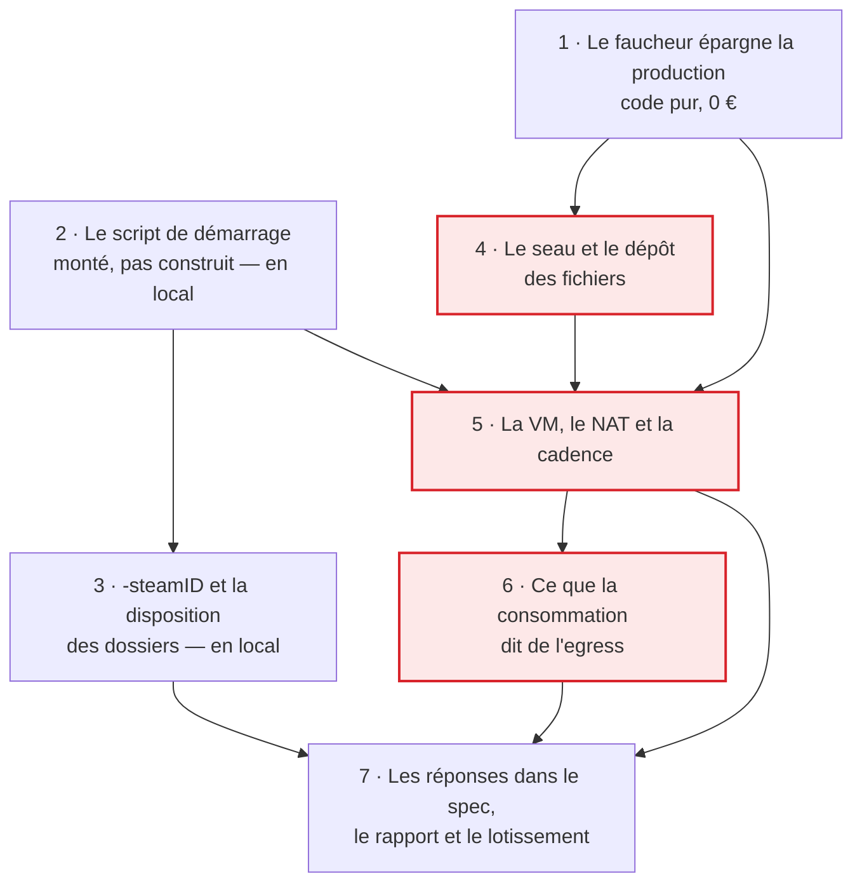

# Tranche 1 bis — Sonder le second jeu

> **For agentic workers:** REQUIRED SUB-SKILL: Use superpowers:subagent-driven-development (recommended) or superpowers:executing-plans to implement this plan task-by-task. Steps use checkbox (`- [ ]`) syntax for tracking.

**But :** répondre par la mesure aux quatre questions que le second jeu a
laissées ouvertes au §12 du spec, et à la question d'egress que la tranche 0
avait différée — pour que le plan de la tranche 2 s'écrive contre des faits et
non contre des suppositions. Au passage, le seau de sauvegardes naît, et c'est
celui dont la tranche 3 hérite.

**Approche :** une sonde n'est pas un système, c'est une suite d'expériences
dont seul le résultat écrit compte. Le local d'abord, gratuitement : le script
de démarrage, les options, la disposition des dossiers. La machine facturée
ensuite, **une seule fois**, avec tout ce qui n'a de sens que derrière un vrai
NAT. Et avant qu'une seule ressource naisse, le faucheur de la sonde apprend à
ne pas toucher la production — parce que depuis la tranche 1, il y en a une.

**Pile :** Node 22 et TypeScript exécuté par `tsx` dans `probe/`, Vitest,
Docker en local, `rclone` pour le stockage objet, l'API Instance de Scaleway par
`@scaleway/sdk`. Aucun projet Nx : rien de cette sonde n'est du code de
production.

**Spec :** [`docs/superpowers/specs/2026-09-02-game-hosting-design.md`](../specs/2026-09-02-game-hosting-design.md) —
les questions sondées sont celles du §12, bloc « second jeu », plus la première
ligne de la liste « encore ouvert ». Les mesures qui les précèdent sont dans
[`probe/RESULTS.md`](../../../probe/RESULTS.md), section J. Le découpage en
tranches est au [lotissement](2026-09-02-lotissement.md), que la tâche 7 met à
jour pour y inscrire cette sonde.

## Pourquoi elle s'intercale

Le lotissement enchaîne la tranche 1 sur la tranche 2. Le second jeu est entré
dans le spec le 2026-09-05, après que la tranche 1 fut écrite, et il a laissé
derrière lui des questions dont deux déplacent l'architecture :

- **`-publicip`, `-publicport`, `-port` ne sont pas testés.** Ils décident si
  l'IP flottante et `DnsUpdater` servent à quelque chose pour ce jeu — donc une
  ligne du §11, une branche de l'adapter, et l'existence ou non d'un
  sous-domaine pour lui. Écrire la tranche 2 sans cette réponse, c'est couler
  une supposition dans le domaine.
- **Qui porte le script de démarrage** — contribution chez `melle2`, image mince
  à nous, ou un fichier monté par le `cloud-init`. Cela se tranche en écrivant
  le script et en l'essayant, pas en pesant les trois formes dans l'abstrait.

Les deux autres — `-steamID` et la cadence à 300 s — ne déplacent rien mais se
mesurent dans la même soirée, donc gratuitement. Et une machine allumée dans la
même région que le seau répond enfin à la question d'egress que la tranche 0
avait laissée à la facture.

C'est la règle du `CLAUDE.md` appliquée telle quelle : si une sonde invalide une
hypothèse, le spec se corrige **avant** que le plan de la tranche suivante
s'écrive. Le projet a déjà changé d'hébergeur pour l'avoir suivie une fois.

## Contraintes globales

- **Aucune ressource facturée n'est créée, modifiée ou détruite par un agent** —
  ni instance, ni IP, ni seau, ni objet déposé. Chaque appel qui écrit chez
  Scaleway est écrit dans le plan, expliqué, et **lancé par un humain**. Les
  appels en lecture (`list*`, `get*`) sont libres.
- **Aucune écriture dans le Firestore de production, aucun `firebase deploy`.**
  Cette sonde ne touche pas au plan de contrôle du tout.
- **Le watchdog tourne en production depuis la tranche 1.** Toute ressource
  créée ici porte le tag `beacon-probe` et le préfixe de nom `beacon-probe-`,
  **jamais le tag `beacon`**. Une machine taguée `beacon` sans
  `provisioning/{sessionId}` ouvert est détruite dans les cinq minutes, au
  milieu d'une mesure et sans que rien ne l'explique.
- **Et symétriquement : le faucheur de la sonde ne touche jamais une ressource
  taguée `beacon`.** C'est la tâche 1, et elle passe avant toute création.
- **Le seau n'est pas jetable.** Il est ce dont la tranche 3 hérite, et son
  contenu est la seule donnée irremplaçable du système (§3). Aucune commande de
  suppression, aucun `rclone sync` — `rclone copy` seulement, qui n'efface
  jamais rien à la destination.
- **Le monde `Beacon's World~4db51c84-24cf-459e-9e9e-88b8c3a7ce3b` est une
  donnée, pas un artefact.** Son GUID est la clé qui relie chaque personnage de
  joueur à son monde (section J) : il se restaure à l'identique, il ne se recrée
  jamais, même pour réparer.
- **Aucun identifiant Steam ne monte sur la VM** (§7). Les 2,3 Go arrivent par le
  stockage objet, jamais par SteamCMD.
- **Le journal du conteneur contient le mot de passe de session en clair**, sur
  la ligne `RPC_ServerValidatePlayer` (section J). Rien de ce journal n'est
  collé tel quel dans `probe/RESULTS.md` ni dans un message de commit.
- **La clé secrète Scaleway ne quitte pas la machine du développeur** : elle vit
  dans `probe/.env`, que le `.gitignore` couvre déjà.
- Code, noms de fichiers et commentaires en **anglais** ; plan, rapport de sonde
  et messages de commit en **français**.
- Commits en Conventional Commits, description française à l'impératif, portée
  parmi `probe`, `spec`, `stack`, `plan`.
- **Budget de la sonde : moins de 0,50 €.** Une `DEV1-L` à 0,04284 €/h, son
  disque à ~0,0067 €/h et son IP à 0,005 €/h, sur trois heures entamées, valent
  ~0,17 € ; le dépôt des 2,3 Go vaut ~0,03 €/mois de stockage. L'heure entamée
  est due sur chaque ressource séparément (§3) : une VM détruite au bout de dix
  minutes coûte une heure sur trois lignes.
- **Toute commande de ce plan se lance depuis la racine du dépôt**, avec l'outil
  Bash — Git Bash sur cette machine. Chaque script a son entrée dans
  `probe/package.json` et se lance par `npm --prefix probe run <script>`, seule
  forme qui survit à la fois au shell POSIX et à PowerShell.

## L'ordre et ce qui le produit



Les trois cases encadrées de rouge ne se lancent pas par un agent : elles créent
des ressources facturées, ou lisent une facture.

Les tâches 2 et 3 ne touchent rien de facturé et avancent pendant que la 4
attend son humain. La 5 est la seule soirée où quelqu'un doit être disponible,
manette en main : elle a besoin du script de la 2, des fichiers déposés par la
4, et du faucheur corrigé par la 1.

## Ce que la sonde ne construit pas

Une sonde bien faite ressemble à un début de système, et c'est le piège. Ce qui
suit est hors périmètre par décision, pas par oubli :

- **Pas de `libs/scaleway-storage`, pas de port `SaveStore`.** C'est la
  tranche 3. Ici, `rclone` est appelé à la main et dans un `cloud-init`, comme
  la tranche 0 appelait l'API Scaleway en clair.
- **Pas de `tools/game-depot`.** Le dépôt des fichiers est une commande
  `rclone copy` écrite dans ce plan. L'outil à trois gestes naît en tranche 3,
  avec la contrainte du §2 qui fait toute sa valeur : il ne connaît pas le
  préfixe des sauvegardes.
- **Pas de synchronisation retour.** Le transfert est à sens unique, du seau
  vers la VM. Rien de cette sonde ne pousse depuis la machine de jeu, donc la
  règle d'or n'a rien à protéger ici — et ses trois défenses restent entières
  pour la tranche 3.
- **Pas de compagnon, pas d'agent, pas d'`agentReport`.** Personne ne rapporte
  rien au plan de contrôle : ce qui se mesure se lit dans un journal, par SSH.
- **Pas de catalogue `deploy/cloud-init/games/`.** Il naît en tranche 2 avec
  `ServerHost.open()` et son entrée Enshrouded ; l'entrée Sunkenland viendra en
  tranche 3, écrite sur ce que cette sonde aura mesuré.
- **Rien dans `libs/`, rien dans `apps/`.** Pas de `Game`, pas de `JoinInfo`,
  pas une ligne de code de production. Tout vit dans `probe/`.
- **Pas de mesure du décalage de version Photon.** Elle demanderait deux
  versions du client, et si la déduction du §2 est fausse, la décision est plus
  confortable qu'écrite, pas moins.

Une tâche de ce plan qui semble en réclamer une est une tâche mal lue.

---

### Task 1: Le faucheur de la sonde épargne la production

Depuis la tranche 1, des ressources taguées `beacon` existent en production, et
`scw:reap` ne le sait pas. Sa règle `isOrphan` — « ni à nous, ni attachée » —
désigne exactement une IP flottante que la Function vient de créer et n'a pas
encore attachée à sa machine. Lancé avec `--include-orphan-ips` pendant qu'une
session démarre, le faucheur de la sonde coupe une soirée.

C'est du code pur, testable sans un centime, et il passe **avant** toute
création : la règle « le faucheur avant le semeur » vaut à l'intérieur d'une
sonde comme à l'échelle du projet.

**Fichiers :**
- Modifier : `probe/scaleway/reaper-policy.ts`
- Modifier : `probe/scaleway/reaper-policy.spec.ts`

**Interfaces :**
- Consomme : `selectDoomed`, `PROBE_PREFIX`, `PROBE_TAG` tels qu'ils existent.
- Produit : `PRODUCTION_TAG` exporté depuis `probe/scaleway/reaper-policy.ts`,
  et un `selectDoomed` qui ne rend jamais une ressource portant ce tag. Les
  tâches 4 et 5 en dépendent pour avoir le droit de créer quoi que ce soit.

- [ ] **Step 1: Écrire les trois tests qui échouent**

Ajouter à `probe/scaleway/reaper-policy.spec.ts`, dans le `describe`
existant :

```ts
// Since tranche 1 a watchdog runs in production and creates ips tagged
// `beacon`. Between createIp and createServer one of them is attached to
// nothing — which is exactly what isOrphan() describes. Reaping it cuts a
// session that is being provisioned right now.
it('never claims an unattached ip carrying the production ownership tag', () => {
  const doomed = selectDoomed(
    inventory({ ips: [ip('i1', '1.2.3.4', [PRODUCTION_TAG])] }),
    withOrphans,
  )
  expect(doomed.ips).toEqual([])
  expect(doomed.orphanIps).toEqual([])
})

it('never claims a server carrying the production ownership tag', () => {
  const doomed = selectDoomed(
    inventory({ servers: [server('s1', `${PROBE_PREFIX}0001`, [PRODUCTION_TAG])] }),
    withOrphans,
  )
  expect(doomed.servers).toEqual([])
})

// The probe tag and the production tag are two different strings, and the
// filter that reads them is exact. A probe resource stays reapable.
it('still claims a probe resource that carries no production tag', () => {
  const doomed = selectDoomed(
    inventory({ servers: [server('s1', `${PROBE_PREFIX}0001`, [PROBE_TAG])] }),
    withoutOrphans,
  )
  expect(doomed.servers.map((s) => s.id)).toEqual(['s1'])
})
```

Compléter l'import en tête de fichier :

```ts
import { PRODUCTION_TAG, PROBE_PREFIX, PROBE_TAG, selectDoomed } from './reaper-policy'
```

L'aide `server()` du fichier accepte déjà un troisième argument `tags`.

- [ ] **Step 2: Lancer les tests et les voir échouer**

```bash
npm --prefix probe run probe:scw
```

Attendu : échec à la compilation, `PRODUCTION_TAG` n'étant exporté par rien.
C'est le bon échec — pas une assertion fausse, une valeur qui n'existe pas.

- [ ] **Step 3: Écrire le minimum qui les fait passer**

Dans `probe/scaleway/reaper-policy.ts`, sous `PROBE_TAG` :

```ts
/**
 * What production wears. Nothing in this probe may destroy a resource carrying
 * it: since tranche 1 a real watchdog creates them, and an ip that is tagged
 * but not yet attached is indistinguishable from an orphan by shape alone.
 * The tag is the only thing that tells them apart, so it is what we read.
 *
 * It deliberately restates `OWNERSHIP_TAG` of `libs/scaleway-compute` rather
 * than importing it: `probe/` is a standalone npm project, kept out of the Nx
 * workspace on purpose, and coupling a throwaway to production code would be
 * the worse trade. **If that constant ever changes, this one changes with it**
 * — out of step, this probe stops recognising production and starts reaping it.
 */
export const PRODUCTION_TAG = 'beacon'
```

Puis, dans `selectDoomed`, filtrer l'inventaire avant tout le reste :

```ts
export function selectDoomed(
  inventory: ProbeInventory,
  options: { includeOrphanIps: boolean },
): Doomed {
  // Before anything else, and on every list: production is not ours to reap,
  // whatever its name looks like.
  const excludingProduction = <T extends { tags?: string[] }>(resources: T[]) =>
    resources.filter((resource) => !(resource.tags ?? []).includes(PRODUCTION_TAG))

  const doomedServers = excludingProduction(inventory.servers).filter((server) =>
    server.name.startsWith(PROBE_PREFIX),
  )
  const doomedServerIds = new Set(doomedServers.map((server) => server.id))
  const candidateIps = excludingProduction(inventory.ips)
```

**`excludingProduction` et non `ours`** : le corps de cette fonction porte déjà
un `isOurs`, qui veut dire « à la sonde ». Deux sens pour un mot dans vingt
lignes, c'est ce qui se relit deux fois pour se comprendre une seule.

Le reste du corps est inchangé, à ceci près que les deux lignes qui lisent
`inventory.ips` lisent désormais `candidateIps` :

```ts
  const orphanIps = candidateIps.filter(isOrphan)
  const ips = candidateIps.filter(
    (ip) => isOurs(ip) || (options.includeOrphanIps && isOrphan(ip)),
  )
```

`inventory.volumes` n'est pas filtré : un volume ne porte aucun tag, et
`strayVolumes` ne fait que signaler — il ne détruit rien, donc il n'a rien à
épargner.

- [ ] **Step 4: Lancer les tests et les voir passer**

```bash
npm --prefix probe run probe:scw && npm --prefix probe run probe:types
```

Attendu : tous verts, y compris les treize cas de la tranche 0.

- [ ] **Step 5: Vérifier en lecture seule qu'aucune ressource ne traîne**

```bash
npm --prefix probe run scw:inventory
```

Appel en lecture, donc libre. Attendu : rien, ou seulement ce que la production
tient légitimement. Une ressource `beacon-probe-` survivante ici est un reste de
la tranche 1 à détruire avant d'en créer d'autres.

- [ ] **Step 6: Commit**

```bash
git add probe/scaleway/reaper-policy.ts probe/scaleway/reaper-policy.spec.ts
git commit -m "fix(probe): interdit au faucheur de la sonde de toucher la production"
```

---

### Task 2: Le script de démarrage, monté et non construit

Le script de l'image amont ne peut pas servir : son `+login anonymous` échoue
sur un jeu qui exige une licence, et il ignore les deux options dont Beacon a
besoin. La question ouverte demande **qui porte le remplaçant** — une
contribution chez `melle2`, une image mince à nous, ou un fichier monté par le
`cloud-init`.

Cette tâche essaie la troisième forme, parce qu'elle est la moins chère à
vérifier et que si elle suffit, les deux autres deviennent sans objet : monter
un fichier dans l'image amont ne demande ni registre, ni workflow, ni artefact
de plus à maintenir. Tout se passe en local, sans un centime.

**Fichiers :**
- Créer : `probe/sunkenland/start.sh`
- Créer : `probe/sunkenland/docker-compose.yml`
- Créer : `probe/sunkenland/.env.example`
- Créer : `probe/sunkenland/README.md`
- Modifier : `probe/RESULTS.md`

**Interfaces :**
- Consomme : rien.
- Produit : `probe/sunkenland/start.sh`, piloté par les variables
  d'environnement `WORLD_GUID`, `GAME_PASSWORD`, `ADMIN_STEAM_IDS`,
  `AUTOSAVE_SECONDS`, `REGION`, `MAX_PLAYERS`, `GAME_PORT`, `PUBLIC_IP`,
  `PUBLIC_PORT`, `STEAM_ID`, `GAME_DIR`, `WORLD_DIR` — toutes consommées telles
  quelles par le `cloud-init` de la tâche 5. Et les chemins réels du jeu et des
  mondes dans l'image, que la tâche 5 monte.

- [ ] **Step 1: Lire ce que l'image amont fait réellement — geste préalable**

Le script ci-dessous est écrit contre ce qu'on croit savoir. Cette étape est ce
qui le rend vrai.

```bash
docker pull melle2/sunkenland-ds@sha256:2b21e6f098c76f8da91a7c5f53e02ceb9af126fa93d05f7958fd189d759873b7
docker image inspect melle2/sunkenland-ds@sha256:2b21e6f098c76f8da91a7c5f53e02ceb9af126fa93d05f7958fd189d759873b7 \
  --format '{{json .Config.Entrypoint}} {{json .Config.Cmd}} {{json .Config.Env}} {{json .Config.WorkingDir}}'
docker run --rm --entrypoint sh \
  melle2/sunkenland-ds@sha256:2b21e6f098c76f8da91a7c5f53e02ceb9af126fa93d05f7958fd189d759873b7 \
  -c 'cat ./startSunkenland.sh; echo ---; ls -la /; ls -la /sunkenland 2>/dev/null'
```

Relever quatre choses, et corriger le script de l'étape 2 avec :

1. **la ligne exacte qui lance le binaire** — `xvfb-run`, `wine`, leurs options,
   et le chemin de l'exécutable ;
2. **où le jeu s'installe** — la valeur à donner à `GAME_DIR` ;
3. **où les mondes se lisent**, et le lien symbolique `Sunkenland/Worlds` que la
   section J a observé — la valeur à donner à `WORLD_DIR` ;
4. **les variables d'environnement** que l'image déclare déjà, pour ne pas en
   redéfinir une sous un autre nom.

- [ ] **Step 2: Écrire le script de démarrage**

`probe/sunkenland/start.sh` :

```bash
#!/usr/bin/env bash
set -euo pipefail

# Never SteamCMD. This game's dedicated server needs an account that owns the
# licence, and §7 keeps every Steam credential off the game machine: the files
# are restored from object storage, exactly like a save.
GAME_DIR=${GAME_DIR:-/sunkenland/game}
WORLD_DIR=${WORLD_DIR:-/sunkenland/Worlds}

# The server cannot create a world — without an existing guid it stops. Failing
# here beats failing three minutes into a boot with an unreadable message.
: "${WORLD_GUID:?WORLD_GUID is required: this server cannot create a world}"

args=(
  -batchmode
  -nographics
  -worldGuid "$WORLD_GUID"
  -region "${REGION:-eu}"
  -maxPlayerCapacity "${MAX_PLAYERS:-4}"
  -autoSaveIntervalInSeconds "${AUTOSAVE_SECONDS:-300}"
)

# The argument form wins over the file form — the binary logs "FromBatScript
# AdminSteamIDs:" — and it is the only one that keeps a restored world pure
# data. Beacon never writes inside a save folder.
if [[ -n "${ADMIN_STEAM_IDS:-}" ]]; then
  args+=(-adminSteamIDs "$ADMIN_STEAM_IDS")
fi

# The three this probe exists to answer, plus the one that decides how a world
# is bootstrapped. All absent by default: the first run has to show what happens
# when nothing is announced.
if [[ -n "${GAME_PORT:-}" ]]; then args+=(-port "$GAME_PORT"); fi
if [[ -n "${PUBLIC_IP:-}" ]]; then args+=(-publicip "$PUBLIC_IP"); fi
if [[ -n "${PUBLIC_PORT:-}" ]]; then args+=(-publicport "$PUBLIC_PORT"); fi
if [[ -n "${STEAM_ID:-}" ]]; then args+=(-steamID "$STEAM_ID"); fi

# Printed so the measurement can be read back from the log without guessing what
# the container was told.
printf 'beacon: launching with %s\n' "${args[*]}"

# Appended after the trace, and that is the whole reason it comes last: this log
# already leaks the password once per joining player (section J), and the launch
# line does not add a second. Only when it holds something — upstream passes it
# unconditionally, and an empty value makes the parser swallow the next option:
# the password becomes literally "-region", with HasPassword true.
if [[ -n "${GAME_PASSWORD:-}" ]]; then
  args+=(-password "$GAME_PASSWORD")
fi

cd "$GAME_DIR"
exec xvfb-run --auto-servernum wine "$GAME_DIR/Sunkenland-DedicatedServer.exe" "${args[@]}"
```

Les `if … then … fi` ne sont pas du style : sous `set -e`, un
`[[ -n "$x" ]] && args+=(…)` dont le test est faux rend 1 et **tue le script**.
La forme longue est la seule correcte ici.

La dernière ligne et `GAME_DIR` viennent de l'étape 1. Si l'image lance
autrement — un `wineserver` en amont, un `DISPLAY` posé à la main —, reprendre sa
ligne telle quelle et n'y remplacer que les arguments.

```bash
chmod +x probe/sunkenland/start.sh
```

- [ ] **Step 3: Écrire le compose local**

`probe/sunkenland/docker-compose.yml` :

```yaml
services:
  sunkenland:
    # Immutable digest, never a moving tag (§10). This one is the image the
    # night of 2026-09-04 measured; anything else is a different experiment.
    image: melle2/sunkenland-ds@sha256:2b21e6f098c76f8da91a7c5f53e02ceb9af126fa93d05f7958fd189d759873b7
    container_name: beacon-probe-sunkenland
    # Our script replaces upstream's, mounted rather than baked. If this holds,
    # neither a fork nor an image of our own has to exist.
    entrypoint: ["/opt/beacon/start.sh"]
    # A probe never restarts a crash: a container that comes back on its own
    # hides the very thing we are here to observe.
    restart: "no"
    ports:
      - "${GAME_PORT:-27015}:${GAME_PORT:-27015}/udp"
    environment:
      WORLD_GUID: ${WORLD_GUID}
      GAME_PASSWORD: ${GAME_PASSWORD:-}
      ADMIN_STEAM_IDS: ${ADMIN_STEAM_IDS:-}
      AUTOSAVE_SECONDS: ${AUTOSAVE_SECONDS:-300}
      REGION: ${REGION:-eu}
      MAX_PLAYERS: ${MAX_PLAYERS:-4}
      GAME_PORT: ${GAME_PORT:-}
      PUBLIC_IP: ${PUBLIC_IP:-}
      PUBLIC_PORT: ${PUBLIC_PORT:-}
      STEAM_ID: ${STEAM_ID:-}
      GAME_DIR: /sunkenland/game
      WORLD_DIR: /sunkenland/Worlds
    volumes:
      - ./start.sh:/opt/beacon/start.sh:ro
      # Read-only on purpose: these 2.3 GB are licensed files deposited once,
      # and nothing on a game machine has any business rewriting them.
      - ${GAME_FILES}:/sunkenland/game:ro
      - ${WORLD_FILES}:/sunkenland/Worlds
```

`probe/sunkenland/.env.example` :

```bash
# The world measured in RESULTS.md section J. The guid is the key that ties every
# player's character to this world: restore it, never recreate it.
WORLD_GUID=4db51c84-24cf-459e-9e9e-88b8c3a7ce3b
GAME_PASSWORD=probe
ADMIN_STEAM_IDS=
AUTOSAVE_SECONDS=300
REGION=eu
MAX_PLAYERS=4

# Absent on the first run. The whole point of the probe is what happens without
# them; they are filled in on the second run, on the VM.
GAME_PORT=
PUBLIC_IP=
PUBLIC_PORT=
STEAM_ID=

# Host paths. The game files come from the administrator's Steam account, the
# world folder from the client that created it.
GAME_FILES=
WORLD_FILES=
```

- [ ] **Step 4: Réunir les fichiers du jeu et le monde — geste humain**

Les 2,3 Go exigent un compte Steam qui possède le jeu ; ils ne peuvent venir que
de la machine de l'administrateur (§2, §7). S'ils sont encore là depuis la nuit
du 2026-09-04, cette étape est déjà faite.

```bash
steamcmd +@sSteamCmdForcePlatformType windows \
  +login <compte> \
  +force_install_dir <chemin>/sunkenland-game \
  +app_update 2667530 validate +quit
```

Le monde est celui de la section J, copié depuis le client :
`Beacon's World~4db51c84-24cf-459e-9e9e-88b8c3a7ce3b`. **Le copier, jamais le
déplacer** — l'original reste chez son client.

Renseigner `GAME_FILES` et `WORLD_FILES` dans `probe/sunkenland/.env`, copié
depuis `.env.example`. Le `.gitignore` du dépôt couvre déjà `.env`.

- [ ] **Step 5: Démarrer, et vérifier que les arguments arrivent**

```bash
MSYS_NO_PATHCONV=1 docker compose -f probe/sunkenland/docker-compose.yml --env-file probe/sunkenland/.env up -d
docker logs -f beacon-probe-sunkenland
```

`MSYS_NO_PATHCONV=1` empêche Git Bash de réécrire les chemins du conteneur en
chemins Windows. Si un montage lié refuse de traverser Docker Desktop, replier
sur un volume nommé peuplé une fois :

```bash
docker volume create beacon-probe-game
MSYS_NO_PATHCONV=1 docker run --rm -v beacon-probe-game:/dest -v "$GAME_FILES:/src:ro" alpine cp -a /src/. /dest/
```

Cinq observations à relever, montre en main :

1. `beacon: launching with …` — les arguments effectivement passés ;
2. `auto save interval: 300` — l'option est bien lue à cette valeur, ce que la
   section J n'a vérifié qu'à 60 ;
3. `FromBatScript AdminSteamIDs:` et non `FromFile` ;
4. `HasPassword` conforme à ce que `GAME_PASSWORD` contient, et **jamais**
   `-region` comme valeur de mot de passe ;
5. `Server Start Complete, Ready for Clients to Join. ServerID is '…'` — dont le
   préfixe doit être le GUID du monde. Noter la durée depuis le démarrage.

- [ ] **Step 6: Vérifier qu'aucun SteamCMD ne tourne**

```bash
docker exec beacon-probe-sunkenland sh -c 'ps aux | grep -i steam | grep -v grep' || echo 'aucun steamcmd — attendu'
docker exec beacon-probe-sunkenland sh -c 'ss -lunp || netstat -lunp'
```

Attendu : aucun processus SteamCMD, et un port UDP en écoute — relever lequel,
puisque c'est celui que le `cloud-init` de la tâche 5 devra publier.

- [ ] **Step 7: Arrêter et nettoyer**

```bash
MSYS_NO_PATHCONV=1 docker compose -f probe/sunkenland/docker-compose.yml --env-file probe/sunkenland/.env down
docker volume rm beacon-probe-game 2>/dev/null || true
```

- [ ] **Step 8: Écrire le README de la sonde**

`probe/sunkenland/README.md` :

```markdown
# Sonde Sunkenland

Ce que la tranche 1 bis mesure sur le second jeu. Jetable, sauf le script de
démarrage si la tranche 3 finit par l'adopter.

- `start.sh` — remplace le script de l'image amont, qui ignore les options dont
  Beacon a besoin et tente un `+login anonymous` sur un jeu sous licence. Il est
  **monté** dans l'image, pas construit dedans : si cette forme suffit, ni fork
  ni image maison n'ont à exister.
- `docker-compose.yml` — le même montage en local que sur la VM, pour que ce qui
  est mesuré ici soit ce qui tourne là-bas.
- `.env.example` — les variables, et lesquelles restent vides au premier essai.

```bash
cp probe/sunkenland/.env.example probe/sunkenland/.env   # puis renseigner les chemins
MSYS_NO_PATHCONV=1 docker compose -f probe/sunkenland/docker-compose.yml \
  --env-file probe/sunkenland/.env up -d
```

Les 2,3 Go du jeu viennent du compte Steam de l'administrateur et ne montent
jamais sur une machine de jeu par SteamCMD (§7 du spec). Le monde se copie
depuis le client : son GUID relie les personnages des joueurs, il ne se recrée
jamais.
```

- [ ] **Step 9: Consigner**

Ajouter à `probe/RESULTS.md`, à la suite de la section J :

```markdown
## V · Sunkenland sur une vraie machine

Ce que la section J n'avait pas pu trancher : les options de publication
d'adresse, la disposition des dossiers, la cadence à sa valeur retenue, et le
comportement du tout derrière un vrai NAT. Mesuré le AAAA-MM-JJ.

### Le script de démarrage, monté plutôt que construit

- Ligne de lancement de l'image amont, relevée :
- Chemin d'installation du jeu (`GAME_DIR`) :
- Chemin des mondes (`WORLD_DIR`), et le lien symbolique observé :
- `-autoSaveIntervalInSeconds 300` accepté et journalisé :
- `-adminSteamIDs` lu `FromBatScript` :
- Mot de passe non corrompu, `HasPassword` :
- Port UDP réellement en écoute :
- Durée du démarrage, jeu et monde déjà présents :

**Verdict sur qui porte le script :**
```

- [ ] **Step 10: Commit**

```bash
git add probe/sunkenland probe/RESULTS.md
git commit -m "test(probe): eprouve un script de demarrage monte dans l'image amont"
```

---

### Task 3: `-steamID` et la disposition des dossiers

Le client écrit ses mondes dans `SteamCloudData/<steamID64>/Worlds`, le serveur
les lit dans `Sunkenland/Worlds` : c'est cette divergence qui oblige, aujourd'hui,
à réarranger un dossier à la main pour amorcer un monde (§2, hors périmètre v1).
Le binaire porte pourtant un indice explicite — *« if the world save file is in
SteamCloudData folder, you need to configure SteamID in command line arguments
correctly »*. Si `-steamID` réconcilie les deux, le geste d'amorçage de la
tranche 3 devient une copie et non un rangement.

Local, un seul démarrage, zéro euro.

**Fichiers :**
- Modifier : `probe/RESULTS.md`

**Interfaces :**
- Consomme : `probe/sunkenland/start.sh` et son compose (tâche 2), qui passent
  déjà `-steamID` quand `STEAM_ID` est renseignée.
- Produit : le verdict sur la disposition acceptée, consommé par la tâche 7 pour
  corriger le §2 du spec.

- [ ] **Step 1: Trouver où l'image attend les mondes**

```bash
docker run --rm --entrypoint sh \
  melle2/sunkenland-ds@sha256:2b21e6f098c76f8da91a7c5f53e02ceb9af126fa93d05f7958fd189d759873b7 \
  -c 'find / -name Worlds -maxdepth 8 2>/dev/null; find / -name "SteamCloudData" -maxdepth 8 2>/dev/null'
```

Relever le dossier parent de `Worlds` : c'est là que `SteamCloudData` doit être
posé pour que l'essai ait un sens.

- [ ] **Step 2: Monter le monde dans la disposition du client**

Préparer, sur la machine, un dossier
`<parent>/SteamCloudData/<steamID64>/Worlds/Beacon's World~4db51c84-…`, copie du
monde. Puis lancer avec la disposition client montée et `STEAM_ID` renseignée :

```bash
STEAM_ID=<steamID64> \
WORLD_FILES=<parent>/SteamCloudData \
MSYS_NO_PATHCONV=1 docker compose -f probe/sunkenland/docker-compose.yml \
  --env-file probe/sunkenland/.env up -d
docker logs -f beacon-probe-sunkenland
```

Le point de montage change : `WORLD_DIR` doit désigner le dossier
`SteamCloudData` et non `Worlds`. Ajuster la variable `WORLD_DIR` du compose
pour cet essai, et **le remettre ensuite** — le compose de la tâche 5 dépend de
la forme d'origine.

- [ ] **Step 3: Lire le verdict dans le journal**

Attendu si l'option fonctionne : le monde est trouvé, `Server Start Complete` et
un ServerID dont le préfixe est le GUID attendu.

Attendu sinon : la `NullReferenceException` de
`SaveManager.get_IsSteamCloudReady()` observée en section J, ou un arrêt faute de
monde. **Un échec est un résultat** : il ferme la question au lieu de la laisser
traîner, et il dit que l'amorçage d'un monde reste le rangement manuel du §13.

- [ ] **Step 4: Nettoyer**

```bash
MSYS_NO_PATHCONV=1 docker compose -f probe/sunkenland/docker-compose.yml \
  --env-file probe/sunkenland/.env down
```

Vérifier que `WORLD_DIR` est revenu à sa valeur du dépôt :

```bash
git diff probe/sunkenland/docker-compose.yml
```

Attendu : aucune différence.

- [ ] **Step 5: Consigner**

Ajouter à la section V de `probe/RESULTS.md` :

```markdown
### `-steamID` et la disposition des dossiers

- Dossier parent où l'image attend `Worlds` :
- Disposition client essayée :
- Le serveur trouve-t-il le monde avec `-steamID` :
- Message d'erreur s'il ne le trouve pas :

**Conséquence pour l'amorçage d'un monde (§2, §13) :**
```

- [ ] **Step 6: Commit**

```bash
git add probe/RESULTS.md
git commit -m "docs(probe): tranche la question de -steamID et des dossiers du client"
```

---

### Task 4: Le seau, et le dépôt des fichiers — **geste humain**

Le seau n'est pas un artefact de sonde : c'est celui dont la tranche 3 hérite,
et son contenu est la seule donnée irremplaçable du système (§3). Il naît ici
parce que sans lui, les 2,3 Go arriveraient sur la VM par un `scp` que rien
n'emploiera jamais, et la question d'egress resterait ouverte alors qu'elle se
mesure gratuitement dans la même soirée.

Toute cette tâche crée des ressources facturées : **elle est conduite par un
humain, de bout en bout.**

**Fichiers :**
- Modifier : `probe/.env.example`
- Modifier : `probe/RESULTS.md`

**Interfaces :**
- Consomme : le faucheur corrigé (tâche 1), les fichiers de jeu et le monde
  réunis à la tâche 2.
- Produit : le seau `beacon-saves` en `fr-par`, ses deux préfixes
  `games/sunkenland/` et `saves/sunkenland/`, et une clé S3 en lecture seule que
  le `cloud-init` de la tâche 5 emporte.

- [ ] **Step 1: Installer `rclone` — geste humain**

```bash
winget install Rclone.Rclone
rclone version
```

- [ ] **Step 2: Créer le seau — geste humain**

Console Scaleway, *Object Storage → Créer un bucket* :

- nom : `beacon-saves`
- région : **`fr-par`**, la même que la zone `fr-par-1` de l'instance — c'est
  toute la raison pour laquelle le stockage a suivi le calcul le 2026-09-03 (§2) ;
- visibilité : **privé** ;
- pas de politique de cycle de vie pour l'instant. L'historique et l'élagage sont
  une décision de la tranche 3 (§8, deuxième défense de la règle d'or), et poser
  une règle d'expiration aujourd'hui sur un seau qui contiendra des sauvegardes
  serait la plus mauvaise façon de la découvrir.

- [ ] **Step 3: Créer une clé S3 en lecture seule — geste humain**

Console Scaleway, *IAM → Applications* : créer une application
`beacon-game-machine`, lui attacher une politique **`ObjectStorageReadOnly`** sur
le projet, puis lui créer une clé d'API.

C'est la forme que le §6 exige déjà pour le `cloud-init` — « des identifiants S3
restreints au seul préfixe des saves » — et la restreindre davantage viendra avec
la tranche 3. Ce qui compte ici : **la machine de jeu ne reçoit jamais la clé qui
sait écrire**, encore moins celle qui sait détruire une instance.

Ajouter à `probe/.env.example`, sans valeur :

```bash
# Object Storage. The write key stays on the administrator's machine; the VM
# only ever gets the read-only one, per §6 of the spec.
SCW_BUCKET=beacon-saves
SCW_S3_ENDPOINT=https://s3.fr-par.scw.cloud
SCW_S3_REGION=fr-par
SCW_S3_ACCESS_KEY=
SCW_S3_SECRET_KEY=
SCW_S3_RO_ACCESS_KEY=
SCW_S3_RO_SECRET_KEY=
```

Renseigner les valeurs dans `probe/.env`, jamais dans l'exemple.

- [ ] **Step 4: Déposer les fichiers — geste humain**

`rclone` se configure par variables d'environnement, ce qui évite d'écrire les
secrets dans un fichier de configuration de plus :

```bash
# Les deux fichiers : les clés vivent dans le premier, les chemins des fichiers
# de jeu et du monde dans le second, renseignés à la tâche 2.
set -a; . probe/.env; . probe/sunkenland/.env; set +a
export RCLONE_CONFIG_SCW_TYPE=s3
export RCLONE_CONFIG_SCW_PROVIDER=Scaleway
export RCLONE_CONFIG_SCW_ENDPOINT="$SCW_S3_ENDPOINT"
export RCLONE_CONFIG_SCW_REGION="$SCW_S3_REGION"
export RCLONE_CONFIG_SCW_ACCESS_KEY_ID="$SCW_S3_ACCESS_KEY"
export RCLONE_CONFIG_SCW_SECRET_ACCESS_KEY="$SCW_S3_SECRET_KEY"
```

Puis les deux dépôts, **`copy` et jamais `sync`** : `sync` propage une
suppression locale vers le seau, et c'est exactement ce que la première défense
de la règle d'or interdit (§8).

```bash
# Les 2,3 Go du jeu, sous leur préfixe. Le cloisonnement par jeu vient du §5 :
# deux jeux qui partageraient un préfixe finiraient par se recouvrir.
time rclone copy "$GAME_FILES" "scw:$SCW_BUCKET/games/sunkenland/" --progress --transfers 8

# Le monde, sous le préfixe des sauvegardes.
time rclone copy "$WORLD_FILES" "scw:$SCW_BUCKET/saves/sunkenland/" --progress
```

Relever la durée et le débit montant : c'est le coût du geste que le §2 appelle
« un quart d'heure de rafraîchissement », et il n'a jamais été chronométré.

- [ ] **Step 5: Vérifier le dépôt, et que la clé de lecture lit**

```bash
rclone size "scw:$SCW_BUCKET/games/sunkenland/"
rclone lsd "scw:$SCW_BUCKET/saves/sunkenland/"

# La même chose avec la clé en lecture seule, celle qui montera sur la VM.
RCLONE_CONFIG_RO_TYPE=s3 RCLONE_CONFIG_RO_PROVIDER=Scaleway \
RCLONE_CONFIG_RO_ENDPOINT="$SCW_S3_ENDPOINT" RCLONE_CONFIG_RO_REGION="$SCW_S3_REGION" \
RCLONE_CONFIG_RO_ACCESS_KEY_ID="$SCW_S3_RO_ACCESS_KEY" \
RCLONE_CONFIG_RO_SECRET_ACCESS_KEY="$SCW_S3_RO_SECRET_KEY" \
  rclone lsd "ro:$SCW_BUCKET/games/"
```

Attendu : la taille déposée correspond à celle de la source, et la clé de lecture
liste. **Vérifier aussi qu'elle ne sait pas écrire** — une clé « en lecture
seule » qui écrit est une découverte qui vaut mieux maintenant que sur une
machine exposée :

```bash
echo probe | RCLONE_CONFIG_RO_TYPE=s3 RCLONE_CONFIG_RO_PROVIDER=Scaleway \
RCLONE_CONFIG_RO_ENDPOINT="$SCW_S3_ENDPOINT" RCLONE_CONFIG_RO_REGION="$SCW_S3_REGION" \
RCLONE_CONFIG_RO_ACCESS_KEY_ID="$SCW_S3_RO_ACCESS_KEY" \
RCLONE_CONFIG_RO_SECRET_ACCESS_KEY="$SCW_S3_RO_SECRET_KEY" \
  rclone rcat "ro:$SCW_BUCKET/probe-write-test.txt" && echo 'ÉCRITURE ACCEPTÉE — la politique est trop large'
```

Attendu : un refus. Si l'écriture passe, reprendre la politique IAM avant la
tâche 5 — et supprimer l'objet créé.

- [ ] **Step 6: Consigner**

Ajouter à la section V de `probe/RESULTS.md` :

```markdown
### Le seau, et le dépôt

- Seau : `beacon-saves`, région `fr-par`, privé, créé le AAAA-MM-JJ
- Préfixes : `games/sunkenland/`, `saves/sunkenland/`
- Volume déposé, jeu :          Go, en       , soit       Mo/s montants
- Volume déposé, monde :
- La clé en lecture seule lit / n'écrit pas :
```

- [ ] **Step 7: Commit**

```bash
git add probe/.env.example probe/RESULTS.md
git commit -m "docs(probe): pose le seau des sauvegardes et y depose les fichiers du second jeu"
```

---

### Task 5: La VM, le NAT et la cadence — **geste humain**

La seule question de cette sonde qui déplace l'architecture : **un client
rejoint-il ce serveur derrière le NAT de Scaleway, et à quelles conditions ?**
La réponse décide si l'IP flottante et `DnsUpdater` servent à quelque chose pour
ce jeu — donc une ligne du §11, une branche de l'adapter, et l'existence d'un
sous-domaine.

Une seule machine, deux essais du conteneur : d'abord sans rien annoncer, puis
avec `-publicip` et `-publicport` si le premier échoue. Le second essai ne
recrée rien — il change deux lignes d'un fichier et relance le conteneur.

Toute cette tâche est **conduite par un humain** : elle crée une instance
facturée, y fait jouer quelqu'un, et la détruit.

**Fichiers :**
- Créer : `probe/sunkenland/cloud-init.yaml.tmpl`
- Créer : `probe/sunkenland/render-cloud-init.mjs`
- Créer : `probe/scaleway/boot-server.ts`
- Créer : `probe/scaleway/sunkenland-probe.ts`
- Modifier : `probe/scaleway/session-probe.ts`
- Modifier : `probe/package.json`
- Modifier : `probe/RESULTS.md`

**Interfaces :**
- Consomme : `instanceApi`, `scwConfig`, `runScript` de
  `probe/scaleway/client.ts` ; `resolveImageId` de `probe/scaleway/images.ts` ;
  `PROBE_PREFIX`, `PROBE_TAG` de `probe/scaleway/reaper-policy.ts` ;
  `probe/sunkenland/start.sh` et les noms de variables de la tâche 2 ; le seau et
  la clé de lecture de la tâche 4.
- Produit : le script npm `scw:sunkenland`, et les mesures que la tâche 7 verse
  au spec.

- [ ] **Step 1: Écrire le gabarit de `cloud-init`**

`probe/sunkenland/cloud-init.yaml.tmpl` :

```yaml
#cloud-config
package_update: true
packages:
  - docker.io
  - docker-compose-v2
  - rclone

write_files:
  - path: /opt/beacon/start.sh
    permissions: "0755"
    content: |
      __START_SH__
  - path: /opt/beacon/docker-compose.yml
    permissions: "0644"
    content: |
      __DOCKER_COMPOSE__
  - path: /opt/beacon/.env
    permissions: "0600"
    content: |
      WORLD_GUID=__WORLD_GUID__
      GAME_PASSWORD=__GAME_PASSWORD__
      ADMIN_STEAM_IDS=__ADMIN_STEAM_IDS__
      AUTOSAVE_SECONDS=300
      REGION=eu
      MAX_PLAYERS=4
      GAME_PORT=
      PUBLIC_IP=
      PUBLIC_PORT=
      STEAM_ID=
      GAME_FILES=/sunkenland/game
      WORLD_FILES=/sunkenland/Worlds
  # Read-only credentials, and read-only on purpose: this machine is the least
  # trusted element of the system (§7). It may restore, never overwrite.
  - path: /opt/beacon/rclone.env
    permissions: "0600"
    content: |
      RCLONE_CONFIG_SCW_TYPE=s3
      RCLONE_CONFIG_SCW_PROVIDER=Scaleway
      RCLONE_CONFIG_SCW_ENDPOINT=__S3_ENDPOINT__
      RCLONE_CONFIG_SCW_REGION=__S3_REGION__
      RCLONE_CONFIG_SCW_ACCESS_KEY_ID=__S3_ACCESS_KEY__
      RCLONE_CONFIG_SCW_SECRET_ACCESS_KEY=__S3_SECRET_KEY__

runcmd:
  - [ systemctl, enable, --now, docker ]
  - [ mkdir, -p, /sunkenland/game, /sunkenland/Worlds ]
  # Bracketed by dates, because the intra-region transfer is one of the
  # measurements: this log answers "how long does restoring 2.3 GB take", and
  # its byte count is what the invoice gets confronted with two days later.
  # `rclone --stats` rather than `/usr/bin/time`, which Ubuntu's minimal image
  # does not carry — a missing binary here would break the boot, not the timing.
  - [ sh, -c, 'echo "game copy start $(date -Is)" > /var/log/beacon-probe.log' ]
  - [ sh, -c, 'set -a; . /opt/beacon/rclone.env; set +a; rclone copy "scw:__BUCKET__/games/sunkenland/" /sunkenland/game --transfers 8 --stats 10s --stats-one-line >> /var/log/beacon-probe.log 2>&1' ]
  - [ sh, -c, 'echo "game copy done $(date -Is)" >> /var/log/beacon-probe.log' ]
  - [ sh, -c, 'set -a; . /opt/beacon/rclone.env; set +a; rclone copy "scw:__BUCKET__/saves/sunkenland/" /sunkenland/Worlds --stats 10s --stats-one-line >> /var/log/beacon-probe.log 2>&1' ]
  - [ sh, -c, 'echo "world copy done $(date -Is)" >> /var/log/beacon-probe.log' ]
  - [ sh, -c, 'cd /opt/beacon && docker compose --env-file /opt/beacon/.env up -d' ]
```

`probe/sunkenland/render-cloud-init.mjs` :

```js
import { readFileSync } from 'node:fs'
import { fileURLToPath } from 'node:url'

const read = (relative) => readFileSync(fileURLToPath(new URL(relative, import.meta.url)), 'utf8')

// The markers sit six spaces in, so only the following lines get indented.
const indent = (text) =>
  text
    .trimEnd()
    .split('\n')
    .map((line, index) => (index === 0 || line === '' ? line : `      ${line}`))
    .join('\n')

const required = (name) => {
  const value = process.env[name]
  if (!value) throw new Error(`${name} is required`)
  return value
}

// A function replacement, and every occurrence: `$&` and `$'` inside a password
// or a secret key would otherwise be read as capture-group syntax and silently
// corrupt it.
const fill = (template, marker, value) => template.replaceAll(marker, () => value)

let rendered = read('./cloud-init.yaml.tmpl')
rendered = fill(rendered, '__START_SH__', indent(read('./start.sh')))
rendered = fill(rendered, '__DOCKER_COMPOSE__', indent(read('./docker-compose.yml')))
rendered = fill(rendered, '__WORLD_GUID__', required('WORLD_GUID'))
rendered = fill(rendered, '__GAME_PASSWORD__', required('GAME_PASSWORD'))
rendered = fill(rendered, '__ADMIN_STEAM_IDS__', process.env.ADMIN_STEAM_IDS ?? '')
rendered = fill(rendered, '__S3_ENDPOINT__', required('SCW_S3_ENDPOINT'))
rendered = fill(rendered, '__S3_REGION__', required('SCW_S3_REGION'))
rendered = fill(rendered, '__S3_ACCESS_KEY__', required('SCW_S3_RO_ACCESS_KEY'))
rendered = fill(rendered, '__S3_SECRET_KEY__', required('SCW_S3_RO_SECRET_KEY'))
rendered = fill(rendered, '__BUCKET__', required('SCW_BUCKET'))

process.stdout.write(rendered)
```

Le compose monté sur la VM lit `${GAME_FILES}` et `${WORLD_FILES}` comme en
local ; le `.env` du `cloud-init` les pointe sur les dossiers que `rclone` vient
de remplir. C'est le même fichier des deux côtés, et c'est le but : ce qui a été
essayé en local est ce qui boote.

**Un second rendeur, et non le partage de celui de `deploy/`.** Les deux se
ressemblent — même indentation à six espaces, même remplacement par fonction —
mais l'un est un artefact que la tranche 0 laisse derrière elle et que la
tranche 2 va reprendre, l'autre est jetable. Les fusionner coupleraient un
keepsake à une sonde, pour économiser huit lignes. Ce qu'ils partagent
réellement, ce sont deux pièges déjà éprouvés, et ceux-là voyagent en commentaire
plutôt qu'en dépendance.

- [ ] **Step 2: Vérifier le rendu sans allumer de machine**

Le rendu **contient les clés S3 en clair** : il est écrit dans `tmp/`, que le
`.gitignore` couvre déjà, et supprimé tout de suite.

```bash
set -a; . probe/.env; set +a
mkdir -p tmp
WORLD_GUID=4db51c84-24cf-459e-9e9e-88b8c3a7ce3b GAME_PASSWORD=probe \
  node probe/sunkenland/render-cloud-init.mjs > tmp/rendered.yaml
MSYS_NO_PATHCONV=1 docker run --rm -v "$(pwd)/tmp:/w" -w /w ubuntu:24.04 \
  sh -c 'apt-get update -qq && apt-get install -y -qq cloud-init >/dev/null && cloud-init schema --config-file rendered.yaml'
rm tmp/rendered.yaml
```

Attendu : `Valid schema`. Ce rendu ne se colle ni dans un rapport, ni dans un
message de commit.

- [ ] **Step 3: Sortir l'allumage d'une instance de sonde de son seul appelant**

Allumer une machine de sonde est la même séquence pour les deux jeux : réserver
l'IP, créer le serveur, poster le `cloud-init`, démarrer. Ce qui diffère est le
gabarit rendu et ce qu'on regarde ensuite. Recopier les cinquante lignes de
`session-probe.ts` les ferait diverger — et c'est le chemin qui crée des
ressources facturées, donc le dernier où deux versions d'une même séquence
doivent exister.

`probe/scaleway/boot-server.ts` :

```ts
import { instanceApi, scwConfig } from './client'
import { resolveImageId } from './images'
import { PROBE_PREFIX, PROBE_TAG } from './reaper-policy'

const COMMERCIAL_TYPE = process.env.SCW_COMMERCIAL_TYPE ?? 'DEV1-L'
const BOOT_TIMEOUT_MS = 10 * 60 * 1000

export const since = (start: number) => `${Math.round((Date.now() - start) / 1000)}s`

export interface BootedServer {
  /** The address to ssh to, and the one a caller may have to announce. */
  readonly address: string
  /** Milliseconds, so each caller times its own report against the same start. */
  readonly startedAt: number
}

/**
 * One probe machine, from nothing to `running`. Every probe that needs a
 * machine goes through here: what varies between them is the cloud-init they
 * hand in and what they watch afterwards, never this sequence.
 */
export async function bootProbeServer(
  sessionId: string,
  userData: string,
): Promise<BootedServer> {
  const { zone, projectId } = scwConfig()
  const api = instanceApi()

  // The probe tag, never the ownership tag. Since tranche 1 a `beacon` machine
  // with no open provisioning intent is destroyed by the production watchdog
  // within five minutes — in the middle of a measurement, and for a reason
  // nothing in this script would explain.
  const sessionTag = `session:${sessionId}`
  const tags = [PROBE_TAG, sessionTag]

  // Re-runnable by design: a probe retried after a boot failure must retry, not
  // seed, or the reaper chases resources this run forgot.
  const known = await api.listServers({ zone, project: projectId, tags: [sessionTag] })
  if (known.servers.length > 0) {
    throw new Error(
      `server ${known.servers[0].id} already carries ${sessionTag} — reap it or use another sessionId`,
    )
  }

  const image = await resolveImageId(zone, COMMERCIAL_TYPE)
  const startedAt = Date.now()

  // The ip first, and attached at creation rather than after: the address is
  // known before the machine exists, which is what lets a caller announce it.
  const reusable = await api.listIps({ zone, project: projectId, tags: [sessionTag] })
  const ip = reusable.ips[0] ?? (await api.createIp({ zone, project: projectId, tags })).ip
  if (!ip) throw new Error('createIp returned no ip — nothing to attach, nothing to reap')
  // Loudly, and before a server exists: an ip with no address is a machine
  // nobody can reach, and the caller would otherwise print `ssh root@`.
  if (!ip.address) throw new Error(`ip ${ip.id} carries no address — reap it and retry`)
  console.log(`${since(startedAt).padEnd(6)} ip ${ip.address}`)

  const { server } = await api.createServer({
    zone,
    project: projectId,
    name: `${PROBE_PREFIX}${sessionId}`,
    commercialType: COMMERCIAL_TYPE,
    image,
    publicIps: [ip.id],
    tags,
    protected: false,
  })
  if (!server) throw new Error('createServer returned no server — run scw:reap before retrying')
  console.log(`${since(startedAt).padEnd(6)} server ${server.id} created, ${server.state}`)

  // cloud-init travels as user data, a call of its own, and it must land before
  // the machine boots — there is no second chance at first boot.
  await api.setServerUserData({ zone, serverId: server.id, key: 'cloud-init', content: userData })
  console.log(`${since(startedAt).padEnd(6)} cloud-init posted (${userData.length} bytes)`)

  const running = await api.serverActionAndWait(
    { zone, serverId: server.id, action: 'poweron' },
    { timeout: BOOT_TIMEOUT_MS },
  )
  console.log(`${since(startedAt).padEnd(6)} ${running.state}`)

  return { address: ip.address, startedAt }
}
```

Puis réduire `probe/scaleway/session-probe.ts` à ce qui lui est propre — son
gabarit et ce qu'il dit à la fin :

```ts
import { execFileSync } from 'node:child_process'
import { fileURLToPath } from 'node:url'
import { runScript } from './client'
import { bootProbeServer, since } from './boot-server'

const RENDERER = fileURLToPath(new URL('../../deploy/render-cloud-init.mjs', import.meta.url))

runScript(async () => {
  const sessionId = process.argv[2]
  if (!sessionId) throw new Error('usage: scw:session -- <sessionId>')
  if (!process.env.SERVER_PASSWORD) throw new Error('probe/.env is missing SERVER_PASSWORD')

  // The very same renderer the deploy README documents: what boots is what was
  // tested locally.
  const userData = execFileSync('node', [RENDERER], { encoding: 'utf8' })
  const { address, startedAt } = await bootProbeServer(sessionId, userData)

  console.log(`
=== à relever, montre en main ===
  création → running          ${since(startedAt)}
  ssh root@${address} 'cloud-init status --wait; docker logs -f enshrouded'

Le compte à rebours du produit continue au-delà de « running » : SteamCMD mange
les minutes suivantes, et c'est cette durée-là qu'annonce l'interface.

détruire :  npm --prefix probe run scw:reap -- --yes`)
})
```

Ce script de la tranche 0 ne sera pas relancé ; c'est son jumeau qui exercera le
chemin partagé, à l'étape 6. C'est une raison de plus de n'en avoir qu'un.

```bash
npm --prefix probe run probe:types
git add probe/scaleway/boot-server.ts probe/scaleway/session-probe.ts
git commit -m "refactor(probe): sort l'allumage d'une instance de sonde de son seul appelant"
```

- [ ] **Step 4: Écrire le lanceur du second jeu**

`probe/scaleway/sunkenland-probe.ts` :

```ts
import { execFileSync } from 'node:child_process'
import { fileURLToPath } from 'node:url'
import { runScript } from './client'
import { bootProbeServer, since } from './boot-server'

const RENDERER = fileURLToPath(new URL('../sunkenland/render-cloud-init.mjs', import.meta.url))

runScript(async () => {
  const sessionId = process.argv[2]
  if (!sessionId) throw new Error('usage: scw:sunkenland -- <sessionId>')

  const userData = execFileSync('node', [RENDERER], { encoding: 'utf8' })
  const { address, startedAt } = await bootProbeServer(sessionId, userData)

  console.log(`
=== à relever, montre en main ===
  création → running          ${since(startedAt)}
  ssh root@${address} 'cloud-init status --wait; cat /var/log/beacon-probe.log'
  ssh root@${address} 'docker logs -f beacon-probe-sunkenland'

  adresse à annoncer au second essai : ${address}

détruire :  npm --prefix probe run scw:reap -- --yes`)
})
```

Le rendu du gabarit lève déjà sur une variable manquante : le lanceur n'a rien à
vérifier de plus, et rien n'est créé avant que `execFileSync` ait rendu la main.

Ajouter à `probe/package.json`, dans `scripts` :

```json
"scw:sunkenland": "tsx scaleway/sunkenland-probe.ts"
```

- [ ] **Step 5: Vérifier que le lanceur compile, sans rien créer**

```bash
npm --prefix probe run probe:types
```

Attendu : aucune erreur. Cette étape est ce qui sépare une faute de frappe
gratuite d'une faute de frappe découverte après la création d'une IP facturée.

- [ ] **Step 6: Allumer la machine — geste humain**

Une clé SSH doit être enregistrée sur le projet — *IAM → Clés SSH* dans la
console —, comme la tranche 0 l'a fait ; Scaleway l'injecte au démarrage.

```bash
set -a; . probe/.env; set +a
WORLD_GUID=4db51c84-24cf-459e-9e9e-88b8c3a7ce3b GAME_PASSWORD=<mot de passe> \
ADMIN_STEAM_IDS=<steamID64 du commanditaire> \
  npm --prefix probe run scw:sunkenland -- sunkenland01
```

**À partir de cet instant, une machine est facturée à l'heure entamée.** La
dernière ligne de la sortie est la commande de destruction : la garder sous les
yeux.

- [ ] **Step 7: Relever ce que la restauration a coûté**

```bash
ssh root@<ip> 'cloud-init status --wait; cat /var/log/beacon-probe.log'
ssh root@<ip> 'du -sh /sunkenland/game /sunkenland/Worlds; ss -lunp'
```

Trois mesures :

1. **la durée du transfert** des 2,3 Go depuis le seau, et le débit qui s'en
   déduit — c'est le temps que la tranche 3 devra ajouter au démarrage de ce
   jeu ;
2. **les octets réellement transférés**, que la tâche 6 confrontera à la
   consommation facturée ;
3. **le port UDP en écoute**, qui dit si le serveur a pris `27015` ou autre chose.

- [ ] **Step 8: Premier essai — sans rien annoncer**

```bash
ssh root@<ip> 'docker logs -f beacon-probe-sunkenland'
```

Attendre `Server Start Complete, Ready for Clients to Join. ServerID is '…'`, et
relever le ServerID **et la durée depuis le boot**.

Puis le geste que personne d'autre ne peut faire : **le commanditaire ouvre son
client, règle sa région sur `eu`, et tente de rejoindre** — par le ServerID
d'abord, par le nom du monde dans la liste ensuite. Les deux chemins comptent :
le second est le recours quand l'identifiant se perd (§4).

Noter, sans interprétation : rejoint / ne rejoint pas, et par quel chemin.

- [ ] **Step 9: Second essai — avec l'adresse annoncée**

À faire **si et seulement si** le premier a échoué. Rien à recréer : deux lignes
d'un fichier et un redémarrage du conteneur.

```bash
ssh root@<ip> "sed -i 's|^PUBLIC_IP=.*|PUBLIC_IP=<ip>|; s|^PUBLIC_PORT=.*|PUBLIC_PORT=27015|; s|^GAME_PORT=.*|GAME_PORT=27015|' /opt/beacon/.env"
ssh root@<ip> 'cd /opt/beacon && docker compose --env-file /opt/beacon/.env up -d --force-recreate'
ssh root@<ip> 'docker logs -f beacon-probe-sunkenland'
```

Vérifier dans la ligne `beacon: launching with …` que les trois options sont
bien passées, puis retenter la connexion.

Si le second essai échoue aussi, **c'est un résultat** : il dit que ce jeu ne se
sert ni de l'IP flottante ni du DNS, et le §11 y gagne une ligne en moins.

- [ ] **Step 10: La cadence à 300 s, joueur connecté**

L'autosave ne tourne **que si un joueur est connecté** (section J) : cette mesure
n'existe que si l'étape 8 ou 9 a réussi. Le commanditaire reste en jeu onze
minutes ; pendant ce temps :

```bash
ssh root@<ip> 'docker logs -f beacon-probe-sunkenland | grep -i save'
```

Attendu : deux sauvegardes espacées d'environ 300 s. Relever les horodatages
exacts. C'est la seule vérification de la valeur que le §2 a retenue ; la
section J ne l'a tenue qu'à 60 s, et rien ne disait qu'il n'existait pas une
borne plus haut.

Relever au passage la charge à un joueur :

```bash
ssh root@<ip> 'docker stats --no-stream'
```

- [ ] **Step 11: Détruire, et vérifier que rien ne survit**

```bash
npm --prefix probe run scw:reap -- --yes
npm --prefix probe run scw:inventory
```

Attendu : plus aucun serveur `beacon-probe-`, plus aucune IP taguée
`beacon-probe`, **et aucun volume détaché**. Un volume survivant est facturé et
ne porte aucun tag : le noter et le supprimer à la main depuis la console, comme
la tranche 0 l'avait prévu.

**Ne jamais lancer `scw:reap --include-orphan-ips`** : c'est le drapeau que la
tâche 1 a rendu inoffensif pour la production, mais qui reste inutile ici.

- [ ] **Step 12: Consigner**

Ajouter à la section V de `probe/RESULTS.md` :

```markdown
### Derrière un vrai NAT

| Essai | Options annoncées | Rejoint par ServerID | Rejoint par la liste |
|---|---|---|---|
| 1 | aucune | | |
| 2 | `-publicip`, `-publicport`, `-port` | | |

- Port UDP en écoute sur la VM :
- ServerID observé, et son préfixe :
- Le groupe de sécurité par défaut laisse-t-il passer ce port :

**Conséquence pour l'IP flottante et `DnsUpdater` :**

### Le transfert depuis le seau

- Volume restauré :        Go, en       , soit       Mo/s
- Démarrage complet, du `poweron` au `Server Start Complete` :

### La cadence à 300 s

| Sauvegarde | Horodatage | Écart |
|---|---|---|

- Charge à un joueur : CPU        , mémoire
```

- [ ] **Step 13: Commit**

```bash
git add probe/sunkenland/cloud-init.yaml.tmpl probe/sunkenland/render-cloud-init.mjs \
  probe/scaleway/sunkenland-probe.ts probe/package.json probe/RESULTS.md
git commit -m "test(probe): eprouve le second jeu sur une vraie machine, derriere le NAT"
```

---

### Task 6: Ce que la consommation dit de l'egress — **geste humain**

La question est ouverte depuis la tranche 0 : **le trafic Object Storage vers une
instance de la même région est-il facturé, et à quel prix ?** Elle n'a jamais pu
être mesurée parce que rien n'avait encore transféré de volume mesurable. La
tâche 5 vient de tirer 2,3 Go du seau vers la VM, dans la même région : c'est
exactement l'expérience.

Elle se lit **au moins deux jours après** la tâche 5 — la consommation Scaleway
n'est pas instantanée — et elle se lit dans une console, donc par un humain.

**Fichiers :**
- Modifier : `probe/RESULTS.md`

**Interfaces :**
- Consomme : le volume transféré et l'instant du transfert, relevés à la tâche 5.
- Produit : le chiffre de l'egress intra-région, consommé par la tâche 7 pour
  fermer la première ligne de « encore ouvert » et corriger le §11.

- [ ] **Step 1: Lire la consommation — geste humain**

Console Scaleway, *Facturation → Consommation*, sur le mois en cours. Relever
ligne par ligne, sans arrondir :

- `Object Storage` — stockage, et **transfert sortant** s'il apparaît ;
- `Instance` — le calcul de la `DEV1-L` ;
- `LocalSSD` — le disque, facturé à part, ce que la première facture de la
  tranche 0 avait démenti au catalogue ;
- `IP` — l'adresse flexible, dont le montant observé en tranche 0 dépassait déjà
  ce que 0,005 €/h expliquerait.

Deux chiffres à confronter : les octets que `rclone` dit avoir transférés
(tâche 5, étape 7) et ce qui apparaît — ou n'apparaît pas — en transfert facturé.

- [ ] **Step 2: Consigner**

Ajouter à la section V de `probe/RESULTS.md` :

```markdown
### La consommation, relevée le AAAA-MM-JJ

| Ligne | Montant | Ce qu'elle dit |
|---|---|---|
| Object Storage — stockage | | |
| Object Storage — transfert sortant | | |
| Instance `DEV1-L` | | |
| `LocalSSD` | | |
| IP flexible | | |

- Octets transférés du seau vers la VM, d'après `rclone` :
- Egress facturé correspondant :

**Réponse à la question ouverte du §12 :**
```

- [ ] **Step 3: Commit**

```bash
git add probe/RESULTS.md
git commit -m "docs(probe): repond a la question de l'egress objet intra-region"
```

---

### Task 7: Les réponses dans le spec, le rapport et le lotissement

Une sonde dont les résultats restent dans son rapport n'a servi à rien : ce qui
compte est que le spec cesse de contenir des suppositions **avant** que le plan
de la tranche 2 s'écrive contre lui.

> **Cette tâche modifie le spec.** `CLAUDE.md` l'impose sans exception :
> invoquer `clean-architecture` **et** `domain-driven-design` avant d'y toucher,
> et les annoncer. Ici elles servent à **vérifier** qu'aucune réponse ne défait
> le §4 — le port `ServerHost` en particulier, dont le §2 dit qu'il est le seul
> endroit que l'arrivée du second jeu n'a pas fait bouger. Une mesure qui
> semblerait exiger qu'il rende un détail de fournisseur au domaine est une
> mesure mal versée.

**Fichiers :**
- Modifier : `docs/superpowers/specs/2026-09-02-game-hosting-design.md`
- Modifier : `docs/superpowers/plans/2026-09-02-lotissement.md`
- Modifier : `STACK.md`
- Modifier : `probe/RESULTS.md`

**Interfaces :**
- Consomme : toutes les mesures des tâches 2 à 6.
- Produit : un §12 sans question ouverte sur le second jeu, et un lotissement qui
  dit où cette sonde s'est intercalée. C'est ce contre quoi le plan de la
  tranche 2 s'écrira.

- [ ] **Step 1: Clore la section V du rapport**

Ajouter, à la fin de la section V de `probe/RESULTS.md`, les deux blocs que toute
section de ce rapport porte :

```markdown
### Conséquences pour le spec

1. **§12** — les quatre questions du second jeu passent de « encore ouvert » à
   « vérifié », avec leurs réponses.
2. **§2** — la ligne « Conteneur du jeu » cesse de dire « la forme reste à
   trancher » : elle dit qui porte le script, et pourquoi.
3. **§2 et §11** — le sort de l'IP flottante et de `DnsUpdater` pour ce jeu.
4. **§11** — l'egress intra-région, chiffré.

### Ce qui reste ouvert

-
```

Ce qui n'a pas été mesuré s'écrit ici, nommément. Une sonde qui rend une liste
vide alors qu'une question est tombée en route est une sonde qui ment.

- [ ] **Step 2: Verser les réponses au §12 du spec**

Déplacer, dans `docs/superpowers/specs/2026-09-02-game-hosting-design.md`, les
lignes correspondantes de « Encore ouvert » vers le tableau « Vérifié », en y
écrivant la réponse et **la date de la mesure**, dans la forme des lignes déjà
présentes :

- `-publicip`, `-publicport` et `-port` ;
- `-steamID` ;
- la cadence à 300 s ;
- le trafic Object Storage intra-région.

La question du décalage de version Photon **reste ouverte** : elle n'a pas été
mesurée, et la déplacer serait une fausse déclaration.

- [ ] **Step 3: Corriger le §2, le §11 et `STACK.md`**

Trois endroits nomment le second jeu et disent aujourd'hui quelque chose que la
sonde a tranché :

1. **§2, ligne « Conteneur du jeu »** — remplacer « **La forme reste à
   trancher** : contribution en amont, ou image mince à nous portant le seul
   script. Question ouverte du §12 » par ce qui a été mesuré, la troisième forme
   comprise si elle a tenu : un script monté dans l'image amont, qui ne demande
   ni fork ni artefact de plus.
2. **§2, ligne « DNS »** et **§11** — si le jeu se rejoint sans adresse annoncée,
   ce que le §2 dit déjà (« `DnsUpdater` n'est pas appelé pour ce jeu ») est
   confirmé par la mesure et non plus déduit ; si l'annonce est nécessaire, c'est
   cette ligne et la branche de l'adapter qui changent, et le changement se dit
   ici.
3. **`STACK.md`, section « Conteneurs »** — `melle2/sunkenland-ds` est consommée
   « sous réserve » d'une question ouverte du §12 qui n'existe plus. Réécrire la
   réserve en fait.

Le §11 gagne le chiffre de l'egress à la place de la remarque qui le renvoyait à
la facture du mois.

- [ ] **Step 4: Inscrire la sonde au lotissement**

Dans `docs/superpowers/plans/2026-09-02-lotissement.md`, sous le tableau des six
tranches, ajouter une section courte :

```markdown
### 1 bis · Sonder le second jeu

Intercalée le 2026-09-05, après que Sunkenland est entré dans le périmètre et
avant que le plan de la tranche 2 s'écrive. Elle mesure ce que la section J de
la sonde n'avait pas pu mesurer sans machine : la connexion derrière un vrai
NAT, la disposition des dossiers, la cadence retenue, et l'egress objet
intra-région. Le seau des sauvegardes naît avec elle.

Elle n'ajoute pas de tranche au découpage : c'est une sonde, du même genre que
la tranche 0, et son plan est
[`2026-09-05-tranche-1-bis-sonder-le-second-jeu.md`](2026-09-05-tranche-1-bis-sonder-le-second-jeu.md).
```

Et corriger la ligne de « Ce qui reste ouvert » qui parle encore de la tranche 0
comme du seul moment où une hypothèse peut tomber : la règle vaut pour toute
sonde, et celle-ci en est la deuxième démonstration.

- [ ] **Step 5: Relire ce qui a bougé**

```bash
git diff docs/superpowers/specs docs/superpowers/plans STACK.md
```

Trois questions à se poser sur ce diff, et elles sont le vrai contrôle :

1. **Une réponse contredit-elle le §4 ?** Si une mesure semble exiger que
   `ServerHost` rende un identifiant de fournisseur, ou que `libs/session`
   connaisse un port, c'est la formulation qui est fausse — pas la frontière.
2. **Le glossaire est-il resté vrai ?** Tout terme visible dans l'interface doit
   y figurer ; si la sonde a fait naître un mot, il s'ajoute.
3. **Reste-t-il une phrase au futur** — « reste à trancher », « à mesurer » — sur
   quelque chose que cette sonde a tranché ?

- [ ] **Step 6: Commit**

Deux commits, parce que ce sont deux sujets : le spec qui enregistre des
mesures, et le lotissement qui enregistre une insertion.

```bash
git add docs/superpowers/specs/2026-09-02-game-hosting-design.md STACK.md probe/RESULTS.md
git commit -m "docs(spec): repond aux questions ouvertes du second jeu par la mesure"

git add docs/superpowers/plans/2026-09-02-lotissement.md
git commit -m "docs(plan): inscrit la sonde du second jeu entre les tranches 1 et 2"
```

---

## Ce que la sonde livre

- **Une réponse mesurée à la question qui déplaçait l'architecture** : ce jeu
  se rejoint-il derrière un NAT, et l'IP flottante avec le DNS lui servent-elles.
  C'est ce qui manquait pour écrire `JoinInfo` et la branche de `DnsUpdater`
  sans supposer.
- **Un verdict sur qui porte le script de démarrage**, obtenu en l'écrivant
  plutôt qu'en pesant trois formes dans l'abstrait.
- **Le seau des sauvegardes**, créé, garni, et avec sa clé de lecture seule
  éprouvée — la tranche 3 en hérite au lieu de le découvrir.
- **La cadence de sauvegarde à sa valeur retenue**, et non à celle qu'il était
  commode de mesurer.
- **Le chiffre de l'egress intra-région**, ouvert depuis la tranche 0.
- **Un faucheur de sonde qui ne peut plus couper une soirée**, ce qui n'était pas
  vrai depuis le déploiement de la tranche 1.

## Ce qu'elle laisse à la tranche 2

- **Le catalogue `deploy/cloud-init/games/` n'existe pas.** Il naît avec
  `ServerHost.open()`, et la tranche 2 n'y met qu'Enshrouded : ce jeu-ci ne peut
  pas démarrer avant que ses fichiers soient restaurés par le compagnon, donc
  avant la tranche 3. Ce que cette sonde produit — le script, les variables, les
  chemins — est ce contre quoi cette entrée-là s'écrira.
- **`JoinInfo` reste à écrire**, et la tranche 2 décide maintenant en
  connaissance de cause si elle porte une forme ou deux.
- **Rien de cette sonde n'est du code de production.** `probe/sunkenland/` est
  jetable ; le jour où le script est adopté, c'est la tranche qui l'adopte qui le
  déplace, et son commit dit pourquoi.
