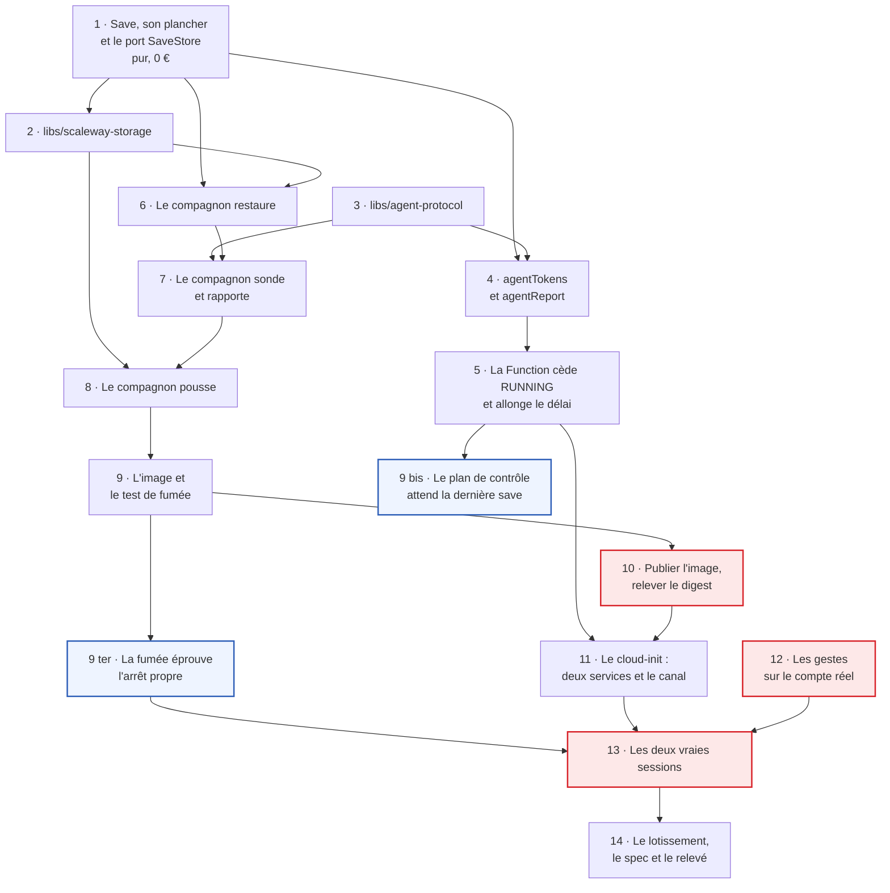

# Tranche 3 — Les saves

> **For agentic workers:** REQUIRED SUB-SKILL: Use superpowers:subagent-driven-development (recommended) or superpowers:executing-plans to implement this plan task-by-task. Steps use checkbox (`- [ ]`) syntax for tracking.

**But :** le monde survit aux sessions. Le compagnon restaure avant que le jeu
démarre, dépose une archive à intervalle régulier et une dernière à l'arrêt,
constate que le serveur répond et le rapporte — et c'est ce rapport, non plus la
Function, qui écrit `RUNNING`. Sur Enshrouded seul : le second jeu est la
tranche 3 bis.

**Approche :** l'objet valeur et son plancher d'abord, en test pur — c'est la
troisième défense de la règle d'or et la seule qui soit du TypeScript. L'adapter
S3 ensuite, contre un double en mémoire. Le format de fil et la Function qui
l'écoute, contre l'émulateur. Le compagnon enfin, dont chaque morceau se teste
sans machine : un serveur UDP bouchonné pour la sonde, un `SaveStore` en mémoire
pour la restauration. La vraie machine ne s'allume qu'à la fin, et deux fois —
c'est le seul moyen de prouver qu'un monde joué revient.

**Pile :** Nx 23.2.0, TypeScript 6.0 en ESM `nodenext`, Vitest 4.1, Firebase
Functions gen2 et l'émulateur Firestore, `@aws-sdk/client-s3` pour
`scaleway-storage`, Node 22 pour l'image du compagnon, `node:dgram` pour la
sonde A2S.

**Spec :** [`docs/superpowers/specs/2026-09-02-game-hosting-design.md`](../specs/2026-09-02-game-hosting-design.md).
Cette tranche implémente le §4 (le port `SaveStore`, le module `saves`,
`agent-protocol`, le compagnon), le §5 (`saves/{id}`, `agentTokens/{sessionId}`,
les deux seaux, les clés neuves), le §6 (étapes 6 et 7 du démarrage, l'arrêt
propre, le délai de provisionnement), le §8 (les trois défenses de la règle d'or)
et le §10 (le workflow du compagnon). Le découpage est au
[lotissement](2026-09-02-lotissement.md), que la tâche 14 met à jour.

## Ce que les tranches précédentes laissent

Le cycle tourne de bout en bout, éprouvé une fois sur une vraie machine le
2026-09-06 — le relevé est dans
[`2026-09-06-tranche-2-le-cycle-session.md`](2026-09-06-tranche-2-le-cycle-session.md).
`libs/session` porte `Session`, `Deadline`, `Game`, `JoinInfo`, les quatre ports
sauf `SaveStore`, et les trois décisions du watchdog. `libs/session-record` a ses
deux faces. `libs/scaleway-compute` ouvre et ferme. `deploy/cloud-init` rend le
`cloud-init` d'Enshrouded. `apps/functions` provisionne, publie et détruit.
`apps/web` est un pilote nu. `firestore.rules` est fermé et une suite garde qu'il
le reste.

Quatre de leurs lignes commandent ce plan :

- **`RUNNING` ment pendant cinq à huit minutes.** La Function conclut dès l'IP
  réservée, décision assumée de la tranche 2 parce qu'aucun joueur ne le voit
  encore. La tâche 5 rend la définition au §6, et c'est le cœur de cette
  tranche.
- **`provisioningTimeoutMs` vaut 15 minutes et n'a jamais rien déclenché**,
  `PROVISIONING` durant vingt-six secondes. Du jour où l'agent conclut, il
  couvre le boot et le téléchargement : la même tâche 5 le passe à 25 minutes,
  et le §6 dit pourquoi allonger ne coûte rien.
- **`enshrouded-backup` sort en `0` sans rien écrire** quand son répertoire
  n'existe pas, mesuré en tranche 0. Le compagnon ne l'appelle pas : il archive
  lui-même le dossier de sauvegarde, qu'il a monté. Le piège disparaît au lieu
  d'être contourné.
- **L'enregistrement A d'`enshrouded.beacon.charlouze.com` n'existe pas dans la
  zone OVH.** DynHost met à jour, il ne crée pas — mesuré à la première vraie
  session. La tâche 12 le pose avant la tâche 13.

## Cinq décisions prises avec le commanditaire, le 2026-09-06

Elles ne se redécouvrent pas en cours d'exécution.

1. **Un jeu par tranche.** Tout ce qui suit s'éprouve sur Enshrouded. L'entrée
   Sunkenland du catalogue, l'adoption de `probe/sunkenland/start.sh`, le
   ServerID lu dans le journal et `SunkenlandJoinInfo` partent en tranche 3 bis.
   Le gate du lotissement se lève jeu par jeu.
2. **Le compagnon est un projet Node du monorepo**, et non deux binaires appelés
   par un script. Il partage `libs/agent-protocol` avec la Function et le
   plancher de `Save` avec `agentReport` : la règle d'or n'existe qu'une fois
   dans le dépôt.
3. **Chaque sauvegarde est une clé neuve.** Écraser n'est pas une chose qui peut
   arriver ; l'élagage est une règle de cycle de vie du seau, et aucun code du
   dépôt ne supprime.
4. **Deux seaux.** `beacon-saves` que la VM écrit, `beacon-games` qu'elle lit.
   La frontière ne dépend d'aucune politique de préfixe à vérifier chez le
   fournisseur.
5. **Le compagnon arrête le jeu par un canal à un seul verbe**, une unité
   systemd posée par le `cloud-init`, et jamais par le socket Docker — qui
   vaudrait root sur l'hôte.

## Contraintes globales

- **Aucune fusion dans `main`, aucun `firebase deploy`, aucune écriture dans le
  Firestore de production.** La cible est **l'émulateur**, toujours.
- **Le trafic change de sens dans cette tranche**, et c'est une contrainte
  d'exécution avant d'être une remarque : jusqu'ici l'émulateur appelait
  l'extérieur, maintenant la machine l'appelle. Une VM sur Internet ne joint pas
  un émulateur derrière un NAT, donc la tâche 13 ouvre un tunnel HTTPS et le
  vérifie **avant** de provisionner quoi que ce soit.
- **Aucune ressource facturée n'est créée, modifiée ou détruite par un agent.**
  Les tâches 10, 12 et 13 sont conduites par un humain de bout en bout. Cela
  couvre la création des seaux, celle de la clé S3, la pose des règles de cycle
  de vie, l'enregistrement DNS, la pose du tag git qui publie l'image, et toute
  session.
- **Aucun identifiant d'API cloud ne monte sur la VM au-delà de la clé S3**
  (§7). Pas de clé Scaleway Instance, pas d'identifiant Steam, pas de socket
  Docker.
- **Le seul geste destructeur du dépôt est celui qui n'existe pas.** `SaveStore`
  n'expose ni suppression ni élagage, et aucune tâche n'en ajoute.
- **`firestore.rules` reste fermé et se déploie fermé.** Les règles réelles sont
  la tranche 4. La suite de `libs/rules` garde le fichier déployé.
- **Ce qui se génère ne s'écrit pas à la main.** Toute lib, app ou configuration
  de projet passe par `nx g`. Si le générateur ne produit pas ce qu'il faut : le
  lancer d'abord, corriger ensuite.
- **Les images sont référencées par digest immuable, jamais `latest`** (§10).
  Cela vaut pour le compagnon comme pour l'image amont.
- **Le jeton d'agent et les clés S3 ne sont jamais journalisés**, ni dans un
  message de commit, ni dans un rapport, ni dans une trace du compagnon.
- Code, noms de fichiers et commentaires en **anglais** ; plan, documentation et
  messages de commit en **français**.
- Commits en Conventional Commits, description française à l'impératif, portée =
  le projet Nx touché — `session`, `scaleway-storage`, `agent-protocol`,
  `companion`, `cloud-init`, `functions`, `rules` — ou l'artefact pour ce qui
  n'est pas du code : `spec`, `plan`, `deploy`, `ci`.
- Node 22 et Temurin 21, pinés par `mise.toml`. Toute commande se lance depuis
  la racine du dépôt.
- **Budget de la tâche 13 : moins de 0,30 €.** Deux sessions courtes, une
  `DEV1-L` à 0,04284 €/h, son disque à ~0,0067 €/h et son IP à 0,005 €/h, une
  heure entamée chacune sur trois lignes séparées.

## L'ordre, et ce qui le produit



Les tâches 10, 12 et 13 sont les seules que personne d'autre qu'un humain ne
lance : elles publient une image, créent des ressources facturées, posent des
règles qui suppriment des objets, et font jouer quelqu'un.

**Les tâches 9 bis et 9 ter, en bleu, ont été ajoutées après coup** — par la
revue de branche du 2026-09-07, qui a constaté que la sauvegarde `pre-shutdown`
ne pouvait jamais avoir lieu. Elles ne dépendent ni de l'image ni du compte réel,
et elles arrivent **avant** la tâche 13 pour une raison qui se chiffre : une
soirée de jeu coûte plus cher que quatre-vingt-dix secondes de script.

**Elles sont indépendantes l'une de l'autre, et c'est le point.** L'arrêt propre
a deux moitiés : le plan de contrôle qui attend, et le compagnon qui pousse.
La 9 bis ferme la première contre l'émulateur, la 9 ter la seconde contre un vrai
conteneur. Aucune des deux ne peut fermer l'autre — la pile de fumée n'a pas de
Function, et l'émulateur n'a pas de conteneur de jeu. **Rien ne les prouve
ensemble avant la tâche 13**, et le plan préfère l'écrire que de laisser croire
la chaîne close.

**La tâche 11 attend la 10, et il faut le lire comme une contrainte et non comme
une maladresse.** Le §10 veut que le `cloud-init` référence l'image par un digest
immuable ; un digest est ce que le registre rend après une poussée, et la
poussée est un geste humain. Écrire le catalogue plus tôt demanderait d'y mettre
un tag mobile, c'est-à-dire exactement ce que le §10 interdit.

## Ce que la tranche ne construit pas

Hors périmètre par décision, pas par oubli. Une tâche qui semble en réclamer une
est une tâche mal lue.

- **Pas d'entrée Sunkenland**, pas de `SunkenlandJoinInfo` produit, pas
  d'adoption de `probe/sunkenland/`, pas de `tools/game-depot`. Décision 1.
- **Pas de `rclone`.** Une sauvegarde est **un objet**, et le compagnon
  l'archive lui-même : `PutObject` et `GetObject` suffisent. Les 2,3 Go de
  fichiers de jeu en 247 objets sont le seul cas qui réclamait un outil de
  transfert parallèle, et ils arrivent en tranche 3 bis avec le jeu qui les
  demande.
- **Pas de `supervisorctl`, pas d'`enshrouded-backup`.** Le compagnon a le
  dossier monté ; le déclencheur amont sort en `0` sans rien écrire, et le
  contourner coûterait plus cher que ne pas s'en servir.
- **Pas de restauration d'une ancienne sauvegarde depuis l'interface.** Le §13
  la met hors périmètre v1 ; `SaveStore.list()` existe et un humain choisit à la
  main.
- **Pas de suppression, pas d'élagage, pas de versionnement d'objet.**
  L'historique est une propriété des clés neuves, l'élagage une règle du seau.
- **Pas de `firestore.rules` de production, pas d'authentification, pas de
  `members`.** C'est la tranche 4, et son gate.
- **Pas de direction visuelle.** `apps/web` ne bouge pas de cette tranche :
  l'écran est la tranche 5, et rien de ce qui suit n'est visible.
- **Pas d'écran des sauvegardes.** `saves/{id}` n'est lisible par personne hors
  Functions (§5), et aucune règle ne l'ouvre ici.
- **Le test de fumée ne démarre pas le vrai serveur de jeu.** Ses 8,8 Go de
  SteamCMD n'ont pas leur place dans un runner ; il éprouve les deux services du
  compagnon contre un MinIO et un conteneur de jeu bouchonné. Que le vrai serveur
  écoute est ce que la tâche 13 prouve, et elle seule. La tâche 14 corrige le §9
  en conséquence.

---

### Task 1: `Save`, son plancher, et le port `SaveStore`

La troisième défense de la règle d'or (§8), et la seule qui soit du TypeScript
testable. Elle arrive en dernier dans l'ordre des défenses et en premier dans
l'ordre des tâches : tout le reste s'appuie sur elle, y compris l'adapter, qui
refusera de téléverser une archive que `Save.of()` rejette.

Le plancher vit sur `Save` et non chez ses appelants. Le compagnon demande
**avant** de pousser — il ne doit pas agir puis rattraper — et `agentReport`
demande **avant** d'enregistrer ; deux questions, une seule réponse, un seul
endroit. C'est ce que le §4 exige de tout calcul, appliqué à la seule donnée
irremplaçable du système.

**Fichiers :**
- Créer : `libs/session/src/lib/saves/save.ts`
- Créer : `libs/session/src/lib/saves/save.spec.ts`
- Modifier : `libs/session/src/lib/ports.ts`
- Modifier : `libs/session/src/index.ts`

**Interfaces :**
- Consomme : `Game` de `libs/session/src/lib/game.js`, `SessionId` de
  `libs/session/src/lib/session.js`.
- Produit : `SAVE_ORIGINS`, `SaveOrigin`, `SAVE_FLOOR_BYTES`,
  `isPlausibleSaveSize(sizeBytes)`, `SaveFields`, la classe `Save` avec
  `Save.of(fields)`, `.createdAt`, `.game`, `.objectKey`, `.sizeBytes`,
  `.origin` ; et dans `ports.ts` : `LocalPath`, `SaveDraft`, `SaveStore` avec
  `list(game)`, `fetch(save, toFile)`, `deposit(fromFile, draft)`. Les tâches 2,
  4, 6 et 8 en dépendent.

- [ ] **Step 1: Écrire les tests qui échouent**

`libs/session/src/lib/saves/save.spec.ts` :

```ts
import { describe, expect, it } from 'vitest';
import { isPlausibleSaveSize, Save, SAVE_FLOOR_BYTES } from './save.js';

const FIELDS = {
  createdAt: new Date('2026-09-07T20:00:00Z'),
  game: 'enshrouded' as const,
  objectKey: 'saves/enshrouded/pre-shutdown/s1/2026-09-07T20-00-00Z.tar.gz',
  sizeBytes: 31_374,
  origin: 'pre-shutdown' as const,
};

describe('Save', () => {
  // 31 374 octets is the smallest real world tranche 0 ever measured. The floor
  // has to sit well under it, or an honest save gets refused on a slow evening.
  it('accepts the smallest world ever measured', () => {
    expect(Save.of(FIELDS).sizeBytes).toBe(31_374);
  });

  // §8: the one invariant whose violation destroys something irreplaceable.
  // An empty zip is 22 bytes, so a floor of one kibibyte sits an order of
  // magnitude above nothing and an order below the smallest real save.
  it('refuses an archive under the floor, and says which floor', () => {
    expect(() => Save.of({ ...FIELDS, sizeBytes: SAVE_FLOOR_BYTES - 1 })).toThrow(
      /1024/,
    );
  });

  it('refuses an archive of nothing at all', () => {
    expect(() => Save.of({ ...FIELDS, sizeBytes: 0 })).toThrow(/1024/);
  });

  // The predicate exists because the companion has to ask *before* pushing:
  // acting and catching would mean the suspect archive already left the
  // machine. Same rule, same constant, two callers (§8, defenses 1 and 3).
  it('answers the same question without throwing', () => {
    expect(isPlausibleSaveSize(SAVE_FLOOR_BYTES)).toBe(true);
    expect(isPlausibleSaveSize(SAVE_FLOOR_BYTES - 1)).toBe(false);
  });

  it('is a value: the instant it carries cannot be moved by its caller', () => {
    const createdAt = new Date('2026-09-07T20:00:00Z');
    const save = Save.of({ ...FIELDS, createdAt });
    createdAt.setFullYear(1999);
    expect(save.createdAt).toEqual(new Date('2026-09-07T20:00:00Z'));
  });
});
```

- [ ] **Step 2: Lancer les tests et les voir échouer**

```bash
npx nx test session
```

Attendu : échec à la compilation, `./save.js` n'existant pas. C'est le bon
échec — un module absent, pas une assertion fausse.

- [ ] **Step 3: Écrire `Save`**

`libs/session/src/lib/saves/save.ts` :

```ts
import type { Game } from '../game.js';

/**
 * How a save came to exist. `auto` is the companion's regular push, `manual` a
 * deposit made by hand, `pre-shutdown` the last one of an evening — and the
 * distinction is not cosmetic: the bucket's lifecycle rules prune them at
 * different ages, so the origin travels in the object key (§5).
 */
export const SAVE_ORIGINS = ['auto', 'manual', 'pre-shutdown'] as const;

export type SaveOrigin = (typeof SAVE_ORIGINS)[number];

/**
 * Under this, an archive is not a world. An empty zip is 22 bytes; the smallest
 * real world tranche 0 measured is 31 374. A kibibyte sits an order of
 * magnitude above the first and an order below the second, which is the widest
 * margin the two measurements allow on both sides.
 */
export const SAVE_FLOOR_BYTES = 1024;

/**
 * §8, and it is asked twice: by the companion before it pushes, and by
 * `agentReport` before it records. A predicate and not only a throwing factory,
 * because the first caller must decide *not to act* — acting and catching would
 * mean the suspect archive already left the machine.
 */
export function isPlausibleSaveSize(sizeBytes: number): boolean {
  return sizeBytes >= SAVE_FLOOR_BYTES;
}

export interface SaveFields {
  readonly createdAt: Date;
  readonly game: Game;
  /** Where it lives in the bucket. Built by the adapter, never by the domain. */
  readonly objectKey: string;
  readonly sizeBytes: number;
  readonly origin: SaveOrigin;
}

/**
 * One state of a game world, deposited in object storage. A value object: it
 * carries metadata and nothing else, and the §4 says why `saves` is a support
 * module of `session` rather than a context of its own — no term changes meaning
 * across the line, and the golden rule is enforced on the machine, not here.
 *
 * Its constructor is the floor. There is no way to hold a `Save` that names an
 * implausible archive, which is what makes the third defense a property rather
 * than a call someone has to remember to make.
 */
export class Save {
  private constructor(private readonly fields: SaveFields) {}

  static of(fields: SaveFields): Save {
    if (!isPlausibleSaveSize(fields.sizeBytes)) {
      throw new Error(
        `refusing a save of ${fields.sizeBytes} bytes: the floor is ${SAVE_FLOOR_BYTES}`,
      );
    }
    // Copied, because a Date is mutable and the caller keeps a reference to the
    // one it passed in. A value object a caller can move is not one.
    return new Save({ ...fields, createdAt: new Date(fields.createdAt.getTime()) });
  }

  get createdAt(): Date {
    return new Date(this.fields.createdAt.getTime());
  }

  get game(): Game {
    return this.fields.game;
  }

  get objectKey(): string {
    return this.fields.objectKey;
  }

  get sizeBytes(): number {
    return this.fields.sizeBytes;
  }

  get origin(): SaveOrigin {
    return this.fields.origin;
  }
}
```

- [ ] **Step 4: Déclarer le port**

Ajouter à la fin de `libs/session/src/lib/ports.ts` :

```ts
/**
 * A path on the machine that runs the game. The domain carries the location and
 * never reads it, exactly as it carries a cloud-init: naming a filesystem here
 * would put an operating system's word inside a model that talks about sessions.
 */
export type LocalPath = string;

/** What a deposit asks for. The key is the adapter's to build, never the caller's. */
export interface SaveDraft {
  readonly game: Game;
  readonly sessionId: SessionId;
  readonly origin: SaveOrigin;
  readonly createdAt: Date;
}

/**
 * List, read and write the saves (§4). Declared here and consumed on the game
 * machine — the functions never touch object storage, which is what keeps the
 * s3 credentials out of their bundle (§7).
 *
 * **It has no delete and no prune, and that is the design.** On the only
 * irreplaceable data of the system, the best line of code is the one that does
 * not exist: every deposit writes a key nothing else will ever carry (§5), so
 * there is no overwrite to guard against, and pruning is a lifecycle rule of the
 * bucket (§8).
 */
export interface SaveStore {
  /** Every save deposited for this game, newest first. */
  list(game: Game): Promise<Save[]>;
  /**
   * Bring one down to a local file. Throws rather than half-writing: a caller
   * that cannot tell a partial restore from a whole one would start a game
   * server on a broken world.
   */
  fetch(save: Save, toFile: LocalPath): Promise<void>;
  /** Deposit a local archive under a new key, and answer what was written. */
  deposit(fromFile: LocalPath, draft: SaveDraft): Promise<Save>;
}
```

Compléter les imports en tête de `ports.ts` :

```ts
import type { Save, SaveOrigin } from './saves/save.js';
```

- [ ] **Step 5: Exporter, et lancer les tests**

Ajouter à `libs/session/src/index.ts`, dans l'ordre alphabétique des chemins,
entre `./lib/ports.js` et `./lib/session-aggregate.js` :

```ts
export * from './lib/saves/save.js';
```

```bash
npx nx test session && npx nx typecheck session && npx nx lint session
```

Attendu : vert, y compris les tests des tranches précédentes.

- [ ] **Step 6: Commit**

```bash
git add libs/session/src/lib/saves libs/session/src/lib/ports.ts libs/session/src/index.ts
git commit -m "feat(session): pose le plancher d'une sauvegarde dans l'objet qui la nomme"
```

---

### Task 2: `libs/scaleway-storage`

L'adapter du port `SaveStore` vers Object Storage. Il suit la forme de
`scaleway-compute`, et pour la même raison : une couture — l'interface étroite de
ce dont il a besoin —, un double en mémoire pour les tests, et un traducteur vers
le SDK qui ne décide rien.

**Pas de cible `test-contract` ici**, à la différence de son voisin. Celle de
`scaleway-compute` existe parce que l'API Instance a des comportements que sa
documentation ne dit pas — un `terminate` refusé sur une machine arrêtée, un
filtre exact et non par préfixe. Ce que cet adapter demande à S3 est
`ListObjectsV2`, `PutObject` et `GetObject` ; ce qui reste à éprouver en vivo
n'est pas leur sémantique mais la frontière entre les deux seaux, et c'est une
mesure que la tâche 12 fait explicitement.

**Une sauvegarde est un objet, et c'est ce qui rend cet adapter petit.** Le
compagnon archive le dossier avant de le confier ; `PutObject` et `GetObject`
suffisent, `rclone` ne sert à rien, et il n'existe aucun appel destructeur à
éviter.

**La clé porte l'origine**, et ce n'est pas du rangement :
`saves/{game}/{origin}/{sessionId}/{instant}.tar.gz`. Les règles de cycle de vie
du seau élaguent par préfixe, et une poussée régulière n'a pas à vivre aussi
longtemps que la dernière d'une soirée (§5, tâche 12).

**Fichiers :**
- Créer : `libs/scaleway-storage/` comme projet Nx `@beacon/scaleway-storage` (généré)
- Créer : `libs/scaleway-storage/src/lib/object-api.ts`
- Créer : `libs/scaleway-storage/src/lib/fake-object-api.ts`
- Créer : `libs/scaleway-storage/src/lib/keys.ts`
- Créer : `libs/scaleway-storage/src/lib/keys.spec.ts`
- Créer : `libs/scaleway-storage/src/lib/scaleway-save-store.ts`
- Créer : `libs/scaleway-storage/src/lib/scaleway-save-store.spec.ts`
- Créer : `libs/scaleway-storage/src/lib/from-sdk.ts`
- Modifier : `libs/scaleway-storage/src/index.ts`
- Modifier : `libs/scaleway-storage/package.json`

**Interfaces :**
- Consomme : `Game`, `Save`, `SaveDraft`, `SaveStore`, `LocalPath` (tâche 1).
- Produit : `@beacon/scaleway-storage` exportant `ObjectApi`, `ObjectSummary`,
  `fakeObjectApi()`, `objectKeyFor(draft)`, `parseObjectKey(key)`,
  `ScalewaySaveStore`, `fromS3(client, bucket)`. Les tâches 6 et 8 en dépendent.

- [ ] **Step 1: Générer le projet, à blanc d'abord**

```bash
npx nx g @nx/js:library libs/scaleway-storage --name=scaleway-storage --importPath=@beacon/scaleway-storage --bundler=none --unitTestRunner=vitest --linter=eslint --dry-run
```

Lire ce qu'il annonce, puis relancer sans `--dry-run`. Vérifier que le projet
est vu par le graphe, et **ne pas corriger à la main** ce que le générateur
n'aurait pas fait — le relancer :

```bash
npx nx show project scaleway-storage
```

- [ ] **Step 2: Poser l'étiquette et la dépendance**

Dans `libs/scaleway-storage/package.json`, sous la clé `nx`, la même étiquette
que `scaleway-compute` — un adapter, qui ne dépend que du domaine :

```json
    "tags": [
      "scope:adapter"
    ]
```

et, à la racine du même fichier :

```json
  "dependencies": {
    "@aws-sdk/client-s3": "^3.700.0"
  }
```

```bash
npm install
```

`@aws-sdk/client-s3` et non un appel signé à la main : SigV4 se recalcule à
chaque requête et une signature fausse rend un `403` qui ressemble à un problème
de droits. C'est la seule dépendance de cette lib.

- [ ] **Step 3: Écrire la couture**

`libs/scaleway-storage/src/lib/object-api.ts` :

```ts
/**
 * The narrow slice of s3 this adapter needs, and nothing more. The same seam as
 * `InstanceApi` next door, for the same two reasons: the tests get a double
 * that is a Map rather than a mocked sdk, and the day the provider changes,
 * what has to be re-read is one file of four methods.
 *
 * There is no delete here, and there never will be (§8).
 */
export interface ObjectSummary {
  readonly key: string;
  readonly sizeBytes: number;
  readonly lastModified: Date;
}

export interface ObjectApi {
  /** Every object under a prefix. Paged through by the implementation. */
  list(prefix: string): Promise<ObjectSummary[]>;
  /** Write a local file under this key. */
  put(key: string, fromFile: string): Promise<void>;
  /** Write this key's content to a local file. */
  get(key: string, toFile: string): Promise<void>;
}
```

- [ ] **Step 4: Écrire les tests des clés, et les voir échouer**

`libs/scaleway-storage/src/lib/keys.spec.ts` :

```ts
import { describe, expect, it } from 'vitest';
import { objectKeyFor, parseObjectKey } from './keys.js';

const DRAFT = {
  game: 'enshrouded' as const,
  sessionId: 'b19af9ed-c4de-49d0-bd7c-1eacd1624c55',
  origin: 'pre-shutdown' as const,
  createdAt: new Date('2026-09-07T20:04:26Z'),
};

describe('the object key', () => {
  // §5: game, then origin, then session, then instant. The order is what the
  // bucket's lifecycle rules prune on — they match a prefix, and origin has to
  // come before anything that varies per session or they could not.
  it('carries game, origin, session and instant, in that order', () => {
    expect(objectKeyFor(DRAFT)).toBe(
      'saves/enshrouded/pre-shutdown/b19af9ed-c4de-49d0-bd7c-1eacd1624c55/2026-09-07T20-04-26Z.tar.gz',
    );
  });

  // A colon is legal in an s3 key and unusable everywhere else — a shell, a
  // path on the machine that downloads it, a url. Replaced once, here.
  it('spells the instant without a colon', () => {
    expect(objectKeyFor(DRAFT)).not.toContain(':');
  });

  // Two deposits inside the same second would collide, and a collision is the
  // one thing immutable keys exist to prevent (§5). The second is the smallest
  // unit the format carries, so the guard is on the caller — and the test says
  // so, rather than pretending the format solves it.
  it('gives two instants two keys', () => {
    const later = { ...DRAFT, createdAt: new Date('2026-09-07T20:04:27Z') };
    expect(objectKeyFor(later)).not.toBe(objectKeyFor(DRAFT));
  });

  it('reads back the game, the origin and the instant it wrote', () => {
    expect(parseObjectKey(objectKeyFor(DRAFT))).toEqual({
      game: 'enshrouded',
      origin: 'pre-shutdown',
      createdAt: new Date('2026-09-07T20:04:26Z'),
    });
  });

  // An object deposited by hand, or left by a version of this code that no
  // longer exists. Null and not a throw: `list()` skips what it cannot read
  // rather than making one stray object break every restoration.
  it('yields nothing for a key it did not write', () => {
    expect(parseObjectKey('games/sunkenland/Sunkenland_Data/level0')).toBeNull();
    expect(parseObjectKey('saves/enshrouded/whatever/s1/2026.tar.gz')).toBeNull();
  });
});
```

- [ ] **Step 5: Lancer les tests et les voir échouer**

```bash
npx nx test scaleway-storage
```

Attendu : `./keys.js` introuvable.

- [ ] **Step 6: Écrire les clés**

`libs/scaleway-storage/src/lib/keys.ts` :

```ts
import { isGame, SAVE_ORIGINS, type Game, type SaveDraft, type SaveOrigin } from '@beacon/session';

/** What the deposit needs of a draft. Narrower than `SaveDraft` on purpose. */
type Addressed = Pick<SaveDraft, 'game' | 'sessionId' | 'origin' | 'createdAt'>;

const PREFIX = 'saves';
const SUFFIX = '.tar.gz';

/**
 * `saves/{game}/{origin}/{sessionId}/{instant}.tar.gz`.
 *
 * The origin sits above the session because the bucket prunes by prefix: a
 * regular push does not have to live as long as the last one of an evening
 * (§5), and a lifecycle rule can only say so if the origin comes first.
 *
 * **Changing this format means re-posing those rules**, which live in a console
 * and not in this repository — they match a literal prefix, and nothing here
 * would fail if they stopped matching. The test below pins the whole string for
 * exactly that reason.
 *
 * A colon is legal in an s3 key and unusable in a path, a shell word or a url,
 * so the instant is spelled with dashes. It is replaced here and nowhere else.
 */
export function objectKeyFor(draft: Addressed): string {
  const instant = draft.createdAt.toISOString().replace(/[:.]/g, '-').replace(/-\d{3}Z$/, 'Z');
  return `${PREFIX}/${draft.game}/${draft.origin}/${draft.sessionId}/${instant}${SUFFIX}`;
}

export interface ParsedKey {
  readonly game: Game;
  readonly origin: SaveOrigin;
  readonly createdAt: Date;
}

/**
 * Null for anything this module did not write. `list()` skips those rather than
 * throwing: one object deposited by hand must not make every restoration fail,
 * and the second bucket already keeps the game files out of this one (§5).
 */
export function parseObjectKey(key: string): ParsedKey | null {
  const parts = key.split('/');
  if (parts.length !== 5 || parts[0] !== PREFIX) return null;

  const [, game, origin, , file] = parts;
  if (!isGame(game)) return null;
  if (!SAVE_ORIGINS.includes(origin as SaveOrigin)) return null;
  if (!file.endsWith(SUFFIX)) return null;

  const stamp = file.slice(0, -SUFFIX.length);
  const iso = stamp.replace(/^(\d{4}-\d{2}-\d{2})T(\d{2})-(\d{2})-(\d{2})Z$/, '$1T$2:$3:$4Z');
  const createdAt = new Date(iso);
  if (Number.isNaN(createdAt.getTime())) return null;

  return { game, origin: origin as SaveOrigin, createdAt };
}
```

- [ ] **Step 7: Lancer les tests des clés**

```bash
npx nx test scaleway-storage
```

Attendu : vert.

- [ ] **Step 8: Écrire le double en mémoire**

`libs/scaleway-storage/src/lib/fake-object-api.ts` :

```ts
import { readFileSync, writeFileSync } from 'node:fs';
import type { ObjectApi, ObjectSummary } from './object-api.js';

export interface FakeObjectApi extends ObjectApi {
  /** What the bucket holds, for an assertion no method of the port exposes. */
  readonly stored: Map<string, Buffer>;
  /** Make the next call of every method reject, to test what a refusal does. */
  breakWith(error: Error): void;
}

/**
 * A Map with an s3 shape. It is the double every test of this lib runs against,
 * and it holds real bytes: the adapter's job is to move a file, so a double that
 * pretended files were strings would prove nothing about the one thing it does.
 */
export function fakeObjectApi(): FakeObjectApi {
  const stored = new Map<string, Buffer>();
  const times = new Map<string, Date>();
  let broken: Error | null = null;

  const check = (): void => {
    if (broken !== null) throw broken;
  };

  return {
    stored,

    breakWith(error: Error): void {
      broken = error;
    },

    async list(prefix: string): Promise<ObjectSummary[]> {
      check();
      return [...stored.entries()]
        .filter(([key]) => key.startsWith(prefix))
        .map(([key, body]) => ({
          key,
          sizeBytes: body.byteLength,
          lastModified: times.get(key) ?? new Date(0),
        }));
    },

    async put(key: string, fromFile: string): Promise<void> {
      check();
      stored.set(key, readFileSync(fromFile));
      times.set(key, new Date());
    },

    async get(key: string, toFile: string): Promise<void> {
      check();
      const body = stored.get(key);
      if (body === undefined) throw new Error(`no such key: ${key}`);
      writeFileSync(toFile, body);
    },
  };
}
```

- [ ] **Step 9: Écrire les tests de l'adapter, et les voir échouer**

`libs/scaleway-storage/src/lib/scaleway-save-store.spec.ts` :

```ts
import { mkdtempSync, readFileSync, writeFileSync } from 'node:fs';
import { tmpdir } from 'node:os';
import { join } from 'node:path';
import { beforeEach, describe, expect, it } from 'vitest';
import { SAVE_FLOOR_BYTES, type SaveDraft } from '@beacon/session';
import { fakeObjectApi, type FakeObjectApi } from './fake-object-api.js';
import { ScalewaySaveStore } from './scaleway-save-store.js';

const DRAFT: SaveDraft = {
  game: 'enshrouded',
  sessionId: 's1',
  origin: 'pre-shutdown',
  createdAt: new Date('2026-09-07T20:04:26Z'),
};

let api: FakeObjectApi;
let store: ScalewaySaveStore;
let folder: string;

const archiveOf = (bytes: number, name = 'world.tar.gz'): string => {
  const path = join(folder, name);
  writeFileSync(path, Buffer.alloc(bytes, 7));
  return path;
};

beforeEach(() => {
  api = fakeObjectApi();
  store = new ScalewaySaveStore(api);
  folder = mkdtempSync(join(tmpdir(), 'beacon-saves-'));
});

describe('ScalewaySaveStore', () => {
  it('deposits under the key the draft describes, and answers what it wrote', async () => {
    const save = await store.deposit(archiveOf(50_000), DRAFT);
    expect(save.objectKey).toBe(
      'saves/enshrouded/pre-shutdown/s1/2026-09-07T20-04-26Z.tar.gz',
    );
    expect(save.sizeBytes).toBe(50_000);
    expect(api.stored.has(save.objectKey)).toBe(true);
  });

  // §8, and it costs nothing: the size is read to build the `Save`, and `Save`
  // is the floor. A suspect archive is refused before a single byte leaves the
  // machine, which is one line of defense more than the spec asks for.
  it('refuses an archive under the floor before uploading anything', async () => {
    await expect(store.deposit(archiveOf(SAVE_FLOOR_BYTES - 1), DRAFT)).rejects.toThrow(
      /1024/,
    );
    expect(api.stored.size).toBe(0);
  });

  it('never writes twice under the same key', async () => {
    await store.deposit(archiveOf(50_000, 'a.tar.gz'), DRAFT);
    await store.deposit(archiveOf(60_000, 'b.tar.gz'), {
      ...DRAFT,
      createdAt: new Date('2026-09-07T20:14:26Z'),
    });
    expect(api.stored.size).toBe(2);
  });

  it('lists this game newest first, and ignores the other one', async () => {
    await store.deposit(archiveOf(50_000, 'a.tar.gz'), {
      ...DRAFT,
      createdAt: new Date('2026-09-07T20:04:26Z'),
    });
    await store.deposit(archiveOf(60_000, 'b.tar.gz'), {
      ...DRAFT,
      createdAt: new Date('2026-09-07T21:04:26Z'),
    });
    await store.deposit(archiveOf(70_000, 'c.tar.gz'), {
      ...DRAFT,
      game: 'sunkenland',
      createdAt: new Date('2026-09-07T22:04:26Z'),
    });

    const listed = await store.list('enshrouded');
    expect(listed.map((save) => save.createdAt.toISOString())).toEqual([
      '2026-09-07T21:04:26.000Z',
      '2026-09-07T20:04:26.000Z',
    ]);
  });

  // One object deposited by hand must not break every restoration of the
  // evening. Skipped, not thrown — and the caller's log is where it surfaces.
  it('skips an object whose key it did not write', async () => {
    api.stored.set('saves/enshrouded/by-hand.tar.gz', Buffer.alloc(50_000));
    expect(await store.list('enshrouded')).toEqual([]);
  });

  // The same rule on the way in: an object of 12 bytes sitting in the bucket is
  // not a world, and handing it to a restore would start a server on nothing.
  it('skips an object under the floor', async () => {
    api.stored.set(
      'saves/enshrouded/auto/s0/2026-09-01T00-00-00Z.tar.gz',
      Buffer.alloc(12),
    );
    expect(await store.list('enshrouded')).toEqual([]);
  });

  it('fetches an object back to a local file, byte for byte', async () => {
    const save = await store.deposit(archiveOf(50_000), DRAFT);
    const destination = join(folder, 'restored.tar.gz');
    await store.fetch(save, destination);
    expect(readFileSync(destination).byteLength).toBe(50_000);
  });

  // The distinction the whole golden rule turns on, one layer up: a store that
  // cannot answer must not look like a store that holds nothing. Task 6 is
  // where it matters — an empty answer there means "generate a fresh world".
  it('refuses rather than answering an empty list when the bucket is unreachable', async () => {
    api.breakWith(new Error('connect ETIMEDOUT'));
    await expect(store.list('enshrouded')).rejects.toThrow(/ETIMEDOUT/);
  });
});
```

- [ ] **Step 10: Lancer les tests et les voir échouer**

```bash
npx nx test scaleway-storage
```

Attendu : `./scaleway-save-store.js` introuvable.

- [ ] **Step 11: Écrire l'adapter**

`libs/scaleway-storage/src/lib/scaleway-save-store.ts` :

```ts
import { statSync } from 'node:fs';
import {
  isPlausibleSaveSize,
  Save,
  type Game,
  type LocalPath,
  type SaveDraft,
  type SaveStore,
} from '@beacon/session';
import { objectKeyFor, parseObjectKey } from './keys.js';
import type { ObjectApi } from './object-api.js';

/**
 * `SaveStore` over Scaleway Object Storage. The s3 vocabulary — bucket, key,
 * prefix — stops here and never enters `session` (§4).
 *
 * It has no delete, because the port has none, because the system has none
 * (§8). What prunes is a lifecycle rule of the bucket, and it is posed by a
 * human once.
 */
export class ScalewaySaveStore implements SaveStore {
  constructor(private readonly api: ObjectApi) {}

  async list(game: Game): Promise<Save[]> {
    // A failure propagates, deliberately. An empty list means "this game has
    // never been saved" and a caller acts on it by generating a fresh world;
    // a bucket that cannot answer must never be able to say that.
    const summaries = await this.api.list(`saves/${game}/`);

    const saves: Save[] = [];
    for (const summary of summaries) {
      const parsed = parseObjectKey(summary.key);
      // Two skips, one reason: what this cannot vouch for, it does not offer.
      // A key it did not write, or an object under the floor, would each hand a
      // restore something that is not a world.
      if (parsed === null) continue;
      if (parsed.game !== game) continue;
      if (!isPlausibleSaveSize(summary.sizeBytes)) continue;
      saves.push(
        Save.of({
          createdAt: parsed.createdAt,
          game: parsed.game,
          objectKey: summary.key,
          sizeBytes: summary.sizeBytes,
          origin: parsed.origin,
        }),
      );
    }

    // Newest first, from the key and not from `lastModified`: the key carries
    // the instant the world was *saved*, the metadata carries the instant it
    // was *uploaded*, and a retry would make the second lie about the first.
    return saves.sort((a, b) => b.createdAt.getTime() - a.createdAt.getTime());
  }

  async fetch(save: Save, toFile: LocalPath): Promise<void> {
    await this.api.get(save.objectKey, toFile);
  }

  async deposit(fromFile: LocalPath, draft: SaveDraft): Promise<Save> {
    // Built before the upload, and that ordering is the point: `Save.of` is the
    // floor, so an implausible archive is refused before a byte leaves the
    // machine rather than after (§8).
    const save = Save.of({
      createdAt: draft.createdAt,
      game: draft.game,
      objectKey: objectKeyFor(draft),
      sizeBytes: statSync(fromFile).size,
      origin: draft.origin,
    });
    await this.api.put(save.objectKey, fromFile);
    return save;
  }
}
```

- [ ] **Step 12: Écrire le traducteur vers le SDK**

`libs/scaleway-storage/src/lib/from-sdk.ts` :

```ts
import { createWriteStream } from 'node:fs';
import { createReadStream, statSync } from 'node:fs';
import { pipeline } from 'node:stream/promises';
import type { Readable } from 'node:stream';
import {
  GetObjectCommand,
  ListObjectsV2Command,
  PutObjectCommand,
  type S3Client,
} from '@aws-sdk/client-s3';
import type { ObjectApi, ObjectSummary } from './object-api.js';

/**
 * The sdk, behind the seam. Everything in this file is translation; there is no
 * decision to test here, which is why the adapter's suite runs against the fake
 * and this one is exercised by the contract test and by task 12.
 */
export function fromS3(client: S3Client, bucket: string): ObjectApi {
  return {
    async list(prefix: string): Promise<ObjectSummary[]> {
      const summaries: ObjectSummary[] = [];
      let token: string | undefined;

      // Paged, because a bucket that has run for a year holds more than a
      // thousand keys and s3 truncates silently at that point — an unpaged list
      // would quietly stop offering the oldest saves.
      do {
        const page = await client.send(
          new ListObjectsV2Command({ Bucket: bucket, Prefix: prefix, ContinuationToken: token }),
        );
        for (const object of page.Contents ?? []) {
          if (object.Key === undefined || object.Size === undefined) continue;
          summaries.push({
            key: object.Key,
            sizeBytes: object.Size,
            lastModified: object.LastModified ?? new Date(0),
          });
        }
        token = page.NextContinuationToken;
      } while (token !== undefined);

      return summaries;
    },

    async put(key: string, fromFile: string): Promise<void> {
      // ContentLength is passed explicitly: a stream has no length, and without
      // it the sdk buffers the whole archive in memory on a machine that is
      // also running a game server.
      await client.send(
        new PutObjectCommand({
          Bucket: bucket,
          Key: key,
          Body: createReadStream(fromFile),
          ContentLength: statSync(fromFile).size,
        }),
      );
    },

    async get(key: string, toFile: string): Promise<void> {
      const response = await client.send(new GetObjectCommand({ Bucket: bucket, Key: key }));
      if (response.Body === undefined) {
        throw new Error(`s3 returned no body for ${key}`);
      }
      // Streamed to disk, and awaited: a save that arrives half-written is the
      // failure mode this whole tranche exists to prevent.
      await pipeline(response.Body as Readable, createWriteStream(toFile));
    },
  };
}
```

- [ ] **Step 13: Exporter, et lancer la suite**

`libs/scaleway-storage/src/index.ts` :

```ts
export * from './lib/fake-object-api.js';
export * from './lib/from-sdk.js';
export * from './lib/keys.js';
export * from './lib/object-api.js';
export * from './lib/scaleway-save-store.js';
```

```bash
npx nx test scaleway-storage && npx nx typecheck scaleway-storage && npx nx lint scaleway-storage
```

Attendu : vert.

- [ ] **Step 14: Commit**

```bash
git add libs/scaleway-storage package.json package-lock.json
git commit -m "feat(scaleway-storage): depose et rapatrie une sauvegarde, sous une cle neuve"
```

---

### Task 3: `libs/agent-protocol`

Ce que la VM et le plan de contrôle se disent, et rien d'autre. Une couche
anticorruption (§4) : elle traduit du JSON qui vient de la machine la moins
fiable du système en valeurs que le domaine reconnaît, et **elle refuse** tout
ce qu'elle ne reconnaît pas.

Elle porte aussi le jeton, des deux côtés de la ligne : le tirer, le hacher, et
le comparer sans fuite de temps. C'est la seule chose qui empêche n'importe qui
sur Internet d'écrire `RUNNING`.

**Fichiers :**
- Créer : `libs/agent-protocol/` comme projet Nx `@beacon/agent-protocol` (généré)
- Créer : `libs/agent-protocol/src/lib/report.ts`
- Créer : `libs/agent-protocol/src/lib/report.spec.ts`
- Créer : `libs/agent-protocol/src/lib/token.ts`
- Créer : `libs/agent-protocol/src/lib/token.spec.ts`
- Modifier : `libs/agent-protocol/src/index.ts`
- Modifier : `libs/agent-protocol/package.json`
- Modifier : `eslint.config.mjs`

**Interfaces :**
- Consomme : `SessionId`, `SessionState` de `@beacon/session`.
- Produit : `AGENT_PHASES`, `AgentPhase`, `AgentReport`, `AgentInstructions`,
  `parseReport(body)`, `newAgentToken()`, `hashAgentToken(token)`,
  `tokenMatches(token, hash)`. Les tâches 4, 5, 7 et 8 en dépendent.

- [ ] **Step 1: Générer le projet**

```bash
npx nx g @nx/js:library libs/agent-protocol --name=agent-protocol --importPath=@beacon/agent-protocol --bundler=none --unitTestRunner=vitest --linter=eslint --dry-run
```

Relancer sans `--dry-run`, puis vérifier :

```bash
npx nx show project agent-protocol
```

- [ ] **Step 2: Poser l'étiquette de portée**

Dans `libs/agent-protocol/package.json`, sous la clé `nx` :

```json
    "tags": [
      "scope:protocol"
    ]
```

Dans `eslint.config.mjs`, ajouter la contrainte après celle de `scope:catalog` :

```js
            // The wire format between the machine and the control plane. It
            // needs the domain to name a session and a state, and nothing else
            // — an adapter it could reach would let a provider's word travel on
            // a wire the least trusted element of the system writes.
            {
              sourceTag: 'scope:protocol',
              onlyDependOnLibsWithTags: ['scope:domain'],
            },
```

et ajouter `'scope:protocol'` à la liste de `scope:app` :

```js
            {
              sourceTag: 'scope:app',
              onlyDependOnLibsWithTags: [
                'scope:domain',
                'scope:record',
                'scope:adapter',
                'scope:catalog',
                'scope:protocol',
              ],
            },
```

- [ ] **Step 3: Écrire les tests du jeton, et les voir échouer**

`libs/agent-protocol/src/lib/token.spec.ts` :

```ts
import { describe, expect, it } from 'vitest';
import { hashAgentToken, newAgentToken, tokenMatches } from './token.js';

describe('the agent token', () => {
  // §6 étape 4: thirty-two random bytes. Sixty-four hex characters is what
  // that looks like, and the test pins the length rather than the encoding so
  // a change of encoding has to be deliberate.
  it('is thirty-two bytes of randomness', () => {
    expect(newAgentToken()).toMatch(/^[0-9a-f]{64}$/);
  });

  it('is never the same twice', () => {
    expect(newAgentToken()).not.toBe(newAgentToken());
  });

  // §5: only the hash is stored, in a document no client reads. The token
  // itself exists in two places and no more — the cloud-init, and the machine.
  it('hashes to something the token cannot be read back from', () => {
    const token = newAgentToken();
    const hash = hashAgentToken(token);
    expect(hash).toMatch(/^[0-9a-f]{64}$/);
    expect(hash).not.toBe(token);
    expect(hashAgentToken(token)).toBe(hash);
  });

  it('recognises its own token and nothing else', () => {
    const token = newAgentToken();
    expect(tokenMatches(token, hashAgentToken(token))).toBe(true);
    expect(tokenMatches(newAgentToken(), hashAgentToken(token))).toBe(false);
  });

  // A caller that passes anything at all must get false, not a throw: this is
  // the frontier, and the value comes from an http request nobody wrote.
  it('answers false rather than throwing on nonsense', () => {
    expect(tokenMatches('', hashAgentToken(newAgentToken()))).toBe(false);
    expect(tokenMatches('not-hex', 'not-hex')).toBe(false);
  });
});
```

- [ ] **Step 4: Lancer les tests et les voir échouer**

```bash
npx nx test agent-protocol
```

Attendu : `./token.js` introuvable.

- [ ] **Step 5: Écrire le jeton**

`libs/agent-protocol/src/lib/token.ts` :

```ts
import { createHash, randomBytes, timingSafeEqual } from 'node:crypto';

/**
 * A session's agent token (§6, étape 4). Thirty-two bytes from the system's
 * random source, and the only credential that ever rides in a cloud-init.
 *
 * It lives exactly twice: in the machine's first-boot data, and in the
 * machine's memory. What the control plane keeps is the hash below — §5 puts it
 * in `agentTokens/{sessionId}` and not in `server/current` precisely because
 * Firestore filters reads by document and not by field, and every member reads
 * `server/current` in real time.
 */
export function newAgentToken(): string {
  return randomBytes(32).toString('hex');
}

export function hashAgentToken(token: string): string {
  return createHash('sha256').update(token, 'utf8').digest('hex');
}

/**
 * Constant time, and it matters here more than it usually does: the comparison
 * runs on a public https endpoint that anyone may call as often as they like,
 * which is the textbook condition for a timing oracle. It answers false rather
 * than throwing on anything malformed — the value comes off the wire.
 */
export function tokenMatches(token: string, hash: string): boolean {
  if (typeof token !== 'string' || typeof hash !== 'string') return false;
  const candidate = Buffer.from(hashAgentToken(token), 'hex');
  const expected = Buffer.from(hash, 'hex');
  if (candidate.length !== expected.length || expected.length === 0) return false;
  return timingSafeEqual(candidate, expected);
}
```

- [ ] **Step 6: Écrire les tests du format de fil, et les voir échouer**

`libs/agent-protocol/src/lib/report.spec.ts` :

```ts
import { describe, expect, it } from 'vitest';
import { parseReport } from './report.js';

describe('parseReport', () => {
  it('reads the heartbeat, which carries nothing but a session', () => {
    expect(parseReport({ sessionId: 's1', phase: 'alive' })).toEqual({
      sessionId: 's1',
      phase: 'alive',
    });
  });

  // §6 étape 7: the ip corroborates and is never followed. It travels because
  // a mismatch is an incident worth filing, not because anything acts on it.
  it('reads the readiness, and the address it merely corroborates', () => {
    expect(parseReport({ sessionId: 's1', phase: 'ready', ip: '51.15.42.7' })).toEqual({
      sessionId: 's1',
      phase: 'ready',
      ip: '51.15.42.7',
    });
  });

  it('reads a deposit, with the key, the size and the origin it claims', () => {
    const save = {
      objectKey: 'saves/enshrouded/pre-shutdown/s1/x.tar.gz',
      sizeBytes: 50_000,
      origin: 'pre-shutdown',
    };
    expect(parseReport({ sessionId: 's1', phase: 'saved', save })).toEqual({
      sessionId: 's1',
      phase: 'saved',
      save,
    });
  });

  // The origin travels rather than being derived on the other side, because the
  // machine already wrote it into the object key — the adapter that deposits
  // builds the key (§5). Deriving it twice is how the record and the key end up
  // disagreeing about the same archive. What a lying machine gains is a
  // pruning window, which is bounded and visible.
  it('refuses an origin the vocabulary does not have', () => {
    expect(
      parseReport({
        sessionId: 's1',
        phase: 'saved',
        save: { objectKey: 'k', sizeBytes: 50_000, origin: 'forever' },
      }),
    ).toBeNull();
  });

  // This is an anti-corruption layer (§4) and the machine on the other side is
  // the least trusted element of the system (§7). Everything it does not
  // recognise, it refuses — it never repairs, and it never passes through.
  it('refuses a phase it does not know', () => {
    expect(parseReport({ sessionId: 's1', phase: 'RUNNING' })).toBeNull();
  });

  it('refuses a report with no session', () => {
    expect(parseReport({ phase: 'alive' })).toBeNull();
    expect(parseReport({ sessionId: 42, phase: 'alive' })).toBeNull();
  });

  it('refuses what is not an object at all', () => {
    expect(parseReport(null)).toBeNull();
    expect(parseReport('alive')).toBeNull();
  });

  // A deposit whose size is not a number would reach `Save.of` as NaN, and NaN
  // passes no comparison — including the floor. Refused at the frontier.
  it('refuses a deposit whose size is not a number', () => {
    expect(
      parseReport({
        sessionId: 's1',
        phase: 'saved',
        save: { objectKey: 'k', sizeBytes: 'big', origin: 'auto' },
      }),
    ).toBeNull();
  });

  // Bounded, like every string a client writes (§5). An unbounded detail on a
  // public endpoint is a way to make somebody else's bill grow.
  it('refuses a detail longer than the bound', () => {
    expect(parseReport({ sessionId: 's1', phase: 'failed', detail: 'x'.repeat(1025) })).toBeNull();
  });
});
```

- [ ] **Step 7: Lancer les tests et les voir échouer**

```bash
npx nx test agent-protocol
```

Attendu : `./report.js` introuvable.

- [ ] **Step 8: Écrire le format de fil**

`libs/agent-protocol/src/lib/report.ts` :

```ts
import { SAVE_ORIGINS, type SaveOrigin, type SessionId, type SessionState } from '@beacon/session';

/**
 * What the machine can say. Four words, and each one is a fact it alone can
 * observe — which is the whole reason the agent exists (§6, étape 7).
 */
export const AGENT_PHASES = ['alive', 'ready', 'saved', 'failed'] as const;

export type AgentPhase = (typeof AGENT_PHASES)[number];

export interface AgentReport {
  readonly sessionId: SessionId;
  readonly phase: AgentPhase;
  /**
   * Corroboration only. §6: the function points dns at the address it reserved
   * itself, never at the one the machine declares — otherwise a compromised vm
   * would aim the record wherever it liked. A mismatch is filed, not followed.
   */
  readonly ip?: string;
  /**
   * On `saved`: what was deposited, as the machine claims it. The origin
   * travels rather than being derived here, because the machine already wrote
   * it into the object key (§5) — deriving it a second time is how a record and
   * a key end up disagreeing about the same archive.
   */
  readonly save?: {
    readonly objectKey: string;
    readonly sizeBytes: number;
    readonly origin: SaveOrigin;
  };
  /** On `failed`: why. Bounded, like every string a client writes (§5). */
  readonly detail?: string;
}

/**
 * One report a minute (§6), and it lives here rather than in a catalogue entry
 * because it is not a per-game value: two measured guarantees of the spec hang
 * on this number — the machine learns an extension or a stop in under a minute,
 * and the watchdog can tell a slow machine from a mute one. A game that could
 * set it would be a game that can break the protocol.
 */
export const REPORT_INTERVAL_MS = 60_000;

/** What the control plane answers, on every report (§6). */
export interface AgentInstructions {
  readonly state: SessionState;
  /**
   * The current closing time, re-read at every report — which is what makes
   * "the agent learns an extension in under a minute" a property of the
   * protocol and not of a notification nobody would receive.
   */
  readonly deadlineIso: string | null;
}

const MAX_STRING = 1024;

const isBoundedString = (value: unknown): value is string =>
  typeof value === 'string' && value.length > 0 && value.length <= MAX_STRING;

/**
 * The anti-corruption layer (§4). It reads a body that came from the least
 * trusted element of the system (§7) and answers a value the domain recognises,
 * or null.
 *
 * It never repairs and never passes an unknown field through. A parser that
 * coerced would make the endpoint's behaviour depend on what the machine felt
 * like sending, which is the opposite of what a frontier is for.
 */
export function parseReport(body: unknown): AgentReport | null {
  if (typeof body !== 'object' || body === null) return null;
  const raw = body as Record<string, unknown>;

  if (!isBoundedString(raw['sessionId'])) return null;
  if (!AGENT_PHASES.includes(raw['phase'] as AgentPhase)) return null;

  const report: {
    sessionId: string;
    phase: AgentPhase;
    ip?: string;
    save?: { objectKey: string; sizeBytes: number; origin: SaveOrigin };
    detail?: string;
  } = { sessionId: raw['sessionId'], phase: raw['phase'] as AgentPhase };

  if (raw['ip'] !== undefined) {
    if (!isBoundedString(raw['ip'])) return null;
    report.ip = raw['ip'];
  }

  if (raw['detail'] !== undefined) {
    if (!isBoundedString(raw['detail'])) return null;
    report.detail = raw['detail'];
  }

  if (raw['save'] !== undefined) {
    const save = raw['save'] as Record<string, unknown> | null;
    if (typeof save !== 'object' || save === null) return null;
    if (!isBoundedString(save['objectKey'])) return null;
    // Finite, not merely a number: NaN passes no comparison, including the
    // floor of `Save`, so it would slip through the one check that matters.
    const sizeBytes = save['sizeBytes'];
    if (typeof sizeBytes !== 'number' || !Number.isFinite(sizeBytes)) return null;
    if (!SAVE_ORIGINS.includes(save['origin'] as SaveOrigin)) return null;
    report.save = {
      objectKey: save['objectKey'],
      sizeBytes,
      origin: save['origin'] as SaveOrigin,
    };
  }

  return report;
}
```

- [ ] **Step 9: Exporter, et lancer la suite**

`libs/agent-protocol/src/index.ts` :

```ts
export * from './lib/report.js';
export * from './lib/token.js';
```

```bash
npx nx test agent-protocol && npx nx typecheck agent-protocol && npx nx lint agent-protocol
```

Attendu : vert. Le lint doit aussi rester vert **partout** — la contrainte
`scope:protocol` vient d'être ajoutée :

```bash
npx nx run-many -t lint
```

- [ ] **Step 10: Commit**

```bash
git add libs/agent-protocol eslint.config.mjs
git commit -m "feat(agent-protocol): pose ce que la machine peut dire, et le jeton qui l'autorise"
```

---

### Task 4: `agentTokens`, `saves/{id}`, et la Function `agentReport`

L'endpoint unique auquel la machine s'adresse (§7), et les deux collections que
personne d'autre que les Functions ne touche (§5). Il suit la forme que la
tranche 1 a posée pour le watchdog et la tranche 2 pour le provisionnement : une
fonction de décision testée sans réseau, et un enveloppement HTTP qui ne décide
rien.

**Trois événements naissent ici**, et deux d'entre eux réparent un défaut de
journal que la revue de la tranche 2 avait signalé et que la vraie session a
confirmé : `announce()` consignait un `ProvisioningFailed` pour une session qui
devenait `RUNNING` dans la seconde. Un échec de DNS n'est pas un échec de
provisionnement, et une contradiction de l'agent non plus.

**Fichiers :**
- Créer : `apps/functions/src/agent-tokens.ts`
- Créer : `apps/functions/src/agent-tokens.spec.ts`
- Créer : `apps/functions/src/save-records.ts`
- Créer : `apps/functions/src/save-records.spec.ts`
- Créer : `apps/functions/src/agent-report.ts`
- Créer : `apps/functions/src/agent-report.spec.ts`
- Modifier : `apps/functions/src/provisioning-ledger.ts`
- Modifier : `libs/session/src/lib/events.ts`
- Modifier : `apps/functions/src/main.ts`
- Modifier : `apps/functions/src/container.ts`
- Modifier : `apps/functions/package.json`

**Interfaces :**
- Consomme : `AgentReport`, `AgentInstructions`, `parseReport`,
  `hashAgentToken`, `tokenMatches` (tâche 3) ; `Save` (tâche 1) ;
  `ServerStateStore`, `SettingsStore`, `ProvisioningLedger`, `DnsUpdater`,
  `catalogFor`.
- Produit : `AgentTokens` avec `issue(sessionId, token, at)` et
  `verify(sessionId, token)` ; `SaveRecords` avec `record(save)` ;
  `RecordedProvisioning` et `ProvisioningLedger.read(sessionId)` ;
  `AgentReportDeps` et `runAgentReport(deps, token, report)` ; les événements
  `DnsUpdateFailed`, `AgentContradicted`, `SaveRefused` ; la Function HTTP
  `agentReport` et `buildAgentReportDeps()`. Les tâches 5, 7 et 8 en dépendent.

- [ ] **Step 1: Étendre le vocabulaire des événements**

Dans `libs/session/src/lib/events.ts`, ajouter à l'union `DomainEvent`, après
`ProvisioningFailed` :

```ts
  /**
   * The dns record could not be pointed. §8: the session is **not**
   * interrupted — the join point already carries the raw address as its
   * fallback, and the first real session proved the fallback works. It is a
   * fact to file, not a reason to destroy a working machine.
   *
   * It exists because `ProvisioningFailed` was doing this job and lying about
   * it: a session that becomes RUNNING one second later did not fail to
   * provision, and a journal that says otherwise is read by a human at the one
   * moment they need it to be true.
   */
  | { type: 'DnsUpdateFailed'; sessionId: SessionId; detail: string }
  /**
   * The machine declared something the control plane can contradict. §6: the
   * address it reports is corroboration and is never followed — the function
   * points dns at the address it reserved itself, or a compromised vm would
   * aim the record wherever it liked. The disagreement is worth a line.
   */
  | { type: 'AgentContradicted'; sessionId: SessionId; detail: string }
  /**
   * §8, third defense: a save whose size falls under the floor is not
   * recorded, and the refusal is journalled. It is the last of the three lines
   * and the only one written in TypeScript — the real protection is on the
   * machine, in the companion that refuses to push it at all.
   */
  | { type: 'SaveRefused'; sessionId: SessionId; detail: string }
```

- [ ] **Step 2: Écrire le test du registre des jetons, et le voir échouer**

`apps/functions/src/agent-tokens.spec.ts` :

```ts
import { beforeEach, describe, expect, it } from 'vitest';
import { getFirestore } from 'firebase-admin/firestore';
import { hashAgentToken, newAgentToken } from '@beacon/agent-protocol';
import { defaultApp } from './firebase-app.js';
import { agentTokens, AGENT_TOKENS } from './agent-tokens.js';

const db = getFirestore(defaultApp());
const tokens = agentTokens(db);
const AT = new Date('2026-09-06T20:00:00Z');

beforeEach(async () => {
  const existing = await db.collection(AGENT_TOKENS).get();
  await Promise.all(existing.docs.map((doc) => doc.ref.delete()));
});

describe('agentTokens', () => {
  it('recognises the token it issued for that session', async () => {
    const token = newAgentToken();
    await tokens.issue('s1', token, AT);
    expect(await tokens.verify('s1', token)).toBe(true);
  });

  it('refuses a token issued for another session', async () => {
    const token = newAgentToken();
    await tokens.issue('s1', token, AT);
    await tokens.issue('s2', newAgentToken(), AT);
    expect(await tokens.verify('s2', token)).toBe(false);
  });

  it('refuses everything for a session it never issued for', async () => {
    expect(await tokens.verify('never', newAgentToken())).toBe(false);
  });

  // §5: only the hash is stored. A document holding the token itself would be
  // a credential at rest for no benefit — nothing ever needs to read it back.
  it('stores the hash and never the token', async () => {
    const token = newAgentToken();
    await tokens.issue('s1', token, AT);
    const stored = (await db.doc(`${AGENT_TOKENS}/s1`).get()).data() ?? {};
    expect(stored['hash']).toBe(hashAgentToken(token));
    expect(JSON.stringify(stored)).not.toContain(token);
  });

  // §5: a strict create. A sessionId drawn by a browser and replayed must not
  // obtain a machine, and this is one of the two documents that close it.
  it('refuses to issue twice for the same session', async () => {
    await tokens.issue('s1', newAgentToken(), AT);
    await expect(tokens.issue('s1', newAgentToken(), AT)).rejects.toThrow();
  });
});
```

- [ ] **Step 3: Lancer le test et le voir échouer**

```bash
npx nx test functions
```

Attendu : `./agent-tokens.js` introuvable. La cible lance l'émulateur Firestore
elle-même, comme les autres suites de ce projet.

- [ ] **Step 4: Écrire le registre des jetons**

`apps/functions/src/agent-tokens.ts` :

```ts
import { hashAgentToken, tokenMatches } from '@beacon/agent-protocol';
import type { SessionId } from '@beacon/session';
import { Timestamp, type Firestore } from 'firebase-admin/firestore';

export const AGENT_TOKENS = 'agentTokens';

export interface AgentTokens {
  /**
   * §6 étape 4, and a strict create: a sessionId already seen fails, which is
   * one of the two documents that close the reuse of an id drawn by a browser
   * (§5).
   */
  issue(sessionId: SessionId, token: string, at: Date): Promise<void>;
  /** False for anything at all — an unknown session, a wrong token, nonsense. */
  verify(sessionId: SessionId, token: string): Promise<boolean>;
}

/**
 * The only credential a game machine ever holds, kept where no client reads it.
 * §5 says why it is not a field of `server/current`: Firestore filters reads by
 * document and not by field, and every member watches that document live.
 */
export function agentTokens(db: Firestore): AgentTokens {
  return {
    async issue(sessionId: SessionId, token: string, at: Date): Promise<void> {
      await db.doc(`${AGENT_TOKENS}/${sessionId}`).create({
        hash: hashAgentToken(token),
        createdAt: Timestamp.fromDate(at),
      });
    },

    async verify(sessionId: SessionId, token: string): Promise<boolean> {
      const snapshot = await db.doc(`${AGENT_TOKENS}/${sessionId}`).get();
      if (!snapshot.exists) return false;
      const hash = (snapshot.data() ?? {})['hash'];
      return typeof hash === 'string' && tokenMatches(token, hash);
    },
  };
}
```

- [ ] **Step 5: Écrire le test du registre des sauvegardes, et le voir échouer**

`apps/functions/src/save-records.spec.ts` :

```ts
import { beforeEach, describe, expect, it } from 'vitest';
import { getFirestore } from 'firebase-admin/firestore';
import { Save } from '@beacon/session';
import { defaultApp } from './firebase-app.js';
import { saveRecords, SAVES } from './save-records.js';

const db = getFirestore(defaultApp());
const records = saveRecords(db);

const SAVE = Save.of({
  createdAt: new Date('2026-09-07T20:04:26Z'),
  game: 'enshrouded',
  objectKey: 'saves/enshrouded/pre-shutdown/s1/2026-09-07T20-04-26Z.tar.gz',
  sizeBytes: 50_000,
  origin: 'pre-shutdown',
});

beforeEach(async () => {
  const existing = await db.collection(SAVES).get();
  await Promise.all(existing.docs.map((doc) => doc.ref.delete()));
});

describe('saveRecords', () => {
  // §5, field for field. It is metadata and nothing else: the bytes live in the
  // bucket, and this collection is what a human reads to choose one by hand.
  it('writes the five fields the spec names', async () => {
    await records.record(SAVE);
    const [doc] = (await db.collection(SAVES).get()).docs;
    const data = doc.data();
    expect(data['game']).toBe('enshrouded');
    expect(data['objectKey']).toBe(SAVE.objectKey);
    expect(data['sizeBytes']).toBe(50_000);
    expect(data['origin']).toBe('pre-shutdown');
    expect(data['createdAt'].toDate()).toEqual(new Date('2026-09-07T20:04:26Z'));
  });

  // One document per object, because there is one object per save (§5). A key
  // recorded twice would make the same archive look like two.
  it('records the same key once, however often it is reported', async () => {
    await records.record(SAVE);
    await records.record(SAVE);
    expect((await db.collection(SAVES).get()).size).toBe(1);
  });
});
```

- [ ] **Step 6: Écrire le registre des sauvegardes**

`apps/functions/src/save-records.ts` :

```ts
import type { Save } from '@beacon/session';
import { createHash } from 'node:crypto';
import { Timestamp, type Firestore } from 'firebase-admin/firestore';

export const SAVES = 'saves';

export interface SaveRecords {
  /** Idempotent: the same object key records once, however often it is told. */
  record(save: Save): Promise<void>;
}

/**
 * The metadata half of a save (§5). The bytes are in the bucket and no code of
 * this project can delete either one — the port has no delete, and this
 * collection outlives the objects it names on purpose: a document pointing at
 * a key the bucket has pruned still says something true, which is that this
 * save existed.
 */
export function saveRecords(db: Firestore): SaveRecords {
  return {
    async record(save: Save): Promise<void> {
      // The document id is the key's own digest, so the same object recorded
      // twice is the same document. A report is delivered by a machine on a
      // network; "twice" is ordinary, not exceptional.
      const id = createHash('sha256').update(save.objectKey).digest('hex').slice(0, 32);
      await db.doc(`${SAVES}/${id}`).set({
        createdAt: Timestamp.fromDate(save.createdAt),
        game: save.game,
        objectKey: save.objectKey,
        sizeBytes: save.sizeBytes,
        origin: save.origin,
      });
    },
  };
}
```

- [ ] **Step 7: Donner au registre des intentions une lecture**

Dans `apps/functions/src/provisioning-ledger.ts`, ajouter le type et la méthode.
Après `ProvisionedFacts` :

```ts
/** What a pass can read back: the facts, plus the size actually provisioned. */
export interface RecordedProvisioning extends ProvisionedFacts {
  readonly instanceSize: string;
}
```

Dans l'interface `ProvisioningLedger`, après `record` :

```ts
  /**
   * What was actually created for this session. §6 étape 7: the function
   * publishes the address **it** reserved, read from here — never the one the
   * machine declares.
   */
  read(sessionId: SessionId): Promise<RecordedProvisioning | null>;
```

Dans l'implémentation, après `record` :

```ts
    async read(sessionId: SessionId): Promise<RecordedProvisioning | null> {
      const snapshot = await db.doc(`${PROVISIONING}/${sessionId}`).get();
      if (!snapshot.exists) return null;
      const data = snapshot.data() ?? {};
      const { instanceId, ipId, ip, instanceSize } = data;
      // All four or nothing. A partial intent means the provider answered and
      // the crash came in between; publishing RUNNING from half of it would put
      // a join point on screen that points at nothing.
      if (
        typeof instanceId !== 'string' ||
        typeof ipId !== 'string' ||
        typeof ip !== 'string' ||
        typeof instanceSize !== 'string'
      ) {
        return null;
      }
      return { instanceId, ipId, ip, instanceSize };
    },
```

- [ ] **Step 8: Écrire les tests de la décision, et les voir échouer**

`apps/functions/src/agent-report.spec.ts` :

```ts
import { beforeEach, describe, expect, it, vi } from 'vitest';
import { Deadline, DEFAULT_SETTINGS, Session } from '@beacon/session';
import { runAgentReport, type AgentReportDeps } from './agent-report.js';

const NOW = new Date('2026-09-06T20:10:00Z');
const TOKEN = 'a'.repeat(64);

const sessionIn = (state: 'PROVISIONING' | 'RUNNING' | 'STOPPING') =>
  Session.from({
    state,
    sessionId: 's1',
    game: 'enshrouded',
    startedBy: 'u1',
    startedAt: new Date('2026-09-06T20:00:00Z'),
    deadline: Deadline.at(new Date('2026-09-07T00:00:00Z')),
    instanceSize: 'DEV1-L',
    hasJoinInfo: false,
  });

let deps: AgentReportDeps;

beforeEach(() => {
  deps = {
    clock: { now: () => NOW },
    tokens: { issue: vi.fn(async () => undefined), verify: vi.fn(async () => true) },
    state: {
      readSession: vi.fn(async () => sessionIn('PROVISIONING')),
      publish: vi.fn(async () => undefined),
      apply: vi.fn(async () => undefined),
      read: vi.fn(async () => null),
      claimProvisioning: vi.fn(async () => false),
    },
    settings: { read: vi.fn(async () => DEFAULT_SETTINGS) },
    ledger: {
      open: vi.fn(async () => undefined),
      record: vi.fn(async () => undefined),
      close: vi.fn(async () => undefined),
      openSessions: vi.fn(async () => []),
      read: vi.fn(async () => ({
        instanceId: 'srv-1',
        ipId: 'ip-1',
        ip: '51.15.42.7',
        instanceSize: 'DEV1-L',
      })),
    },
    saves: { record: vi.fn(async () => undefined) },
    dns: { point: vi.fn(async () => undefined) },
  };
});

describe('agentReport', () => {
  // The whole barrier. Without it, anyone on the internet writes RUNNING.
  it('answers nothing at all when the token does not verify', async () => {
    deps.tokens.verify = vi.fn(async () => false);
    const answer = await runAgentReport(deps, TOKEN, { sessionId: 's1', phase: 'ready' });
    expect(answer).toBeNull();
    expect(deps.state.publish).not.toHaveBeenCalled();
  });

  // §6 étape 7: the join point is published, and *this* is what RUNNING means.
  it('publishes the join point from what the ledger reserved', async () => {
    await runAgentReport(deps, TOKEN, { sessionId: 's1', phase: 'ready' });
    expect(deps.state.publish).toHaveBeenCalledWith(
      {
        ip: '51.15.42.7',
        joinInfo: {
          game: 'enshrouded',
          hostname: 'enshrouded.beacon.charlouze.com',
          address: '51.15.42.7',
          port: 15637,
        },
        instanceSize: 'DEV1-L',
        references: { instanceId: 'srv-1', ipId: 'ip-1' },
      },
      NOW,
    );
  });

  it('points the dns record before it publishes', async () => {
    const order: string[] = [];
    deps.dns.point = vi.fn(async () => void order.push('dns'));
    deps.state.publish = vi.fn(async () => void order.push('publish'));
    await runAgentReport(deps, TOKEN, { sessionId: 's1', phase: 'ready' });
    expect(order).toEqual(['dns', 'publish']);
  });

  // §8: a dns failure does not interrupt the session — the join point already
  // carries the raw address, and the first real session was played through it.
  it('publishes anyway when dns refuses, and files the right event', async () => {
    deps.dns.point = vi.fn(async () => {
      throw new Error('http 404');
    });
    await runAgentReport(deps, TOKEN, { sessionId: 's1', phase: 'ready' });
    expect(deps.state.publish).toHaveBeenCalled();
    const correction = (deps.state.apply as ReturnType<typeof vi.fn>).mock.calls[0][0];
    expect(correction.events[0].type).toBe('DnsUpdateFailed');
    expect(correction.state).toBeNull();
  });

  // §6, §7: the machine is the least trusted element of the system. Its address
  // corroborates and is never followed — otherwise a compromised vm aims the
  // dns record wherever it likes.
  it('follows the reserved address and not the reported one, and says so', async () => {
    await runAgentReport(deps, TOKEN, { sessionId: 's1', phase: 'ready', ip: '10.0.0.1' });
    expect(deps.dns.point).toHaveBeenCalledWith(
      'enshrouded.beacon.charlouze.com',
      '51.15.42.7',
    );
    const correction = (deps.state.apply as ReturnType<typeof vi.fn>).mock.calls[0][0];
    expect(correction.events[0].type).toBe('AgentContradicted');
  });

  // A ready that arrives after the world moved on. Publishing here would put a
  // join point on a session that is not the one running.
  it('publishes nothing when the current session is another one', async () => {
    deps.state.readSession = vi.fn(async () =>
      Session.from({ ...fieldsOf(sessionIn('RUNNING')), sessionId: 's2' }),
    );
    const answer = await runAgentReport(deps, TOKEN, { sessionId: 's1', phase: 'ready' });
    expect(deps.state.publish).not.toHaveBeenCalled();
    // And it is told to stop, rather than being left to run: a machine whose
    // session is over has nothing left to do.
    expect(answer).toEqual({ state: 'IDLE', deadlineIso: null });
  });

  it('records a deposit the machine reports', async () => {
    await runAgentReport(deps, TOKEN, {
      sessionId: 's1',
      phase: 'saved',
      save: {
        objectKey: 'saves/enshrouded/auto/s1/2026-09-06T20-10-00Z.tar.gz',
        sizeBytes: 50_000,
        origin: 'auto',
      },
    });
    const recorded = (deps.saves.record as ReturnType<typeof vi.fn>).mock.calls[0][0];
    expect(recorded.objectKey).toBe('saves/enshrouded/auto/s1/2026-09-06T20-10-00Z.tar.gz');
    expect(recorded.sizeBytes).toBe(50_000);
  });

  // §8, third defense, and the last of the three. The real protection is on the
  // machine; this one exists so that a companion that lost its own guard cannot
  // put an implausible save on the list a human restores from.
  it('refuses a deposit under the floor, and journals the refusal', async () => {
    await runAgentReport(deps, TOKEN, {
      sessionId: 's1',
      phase: 'saved',
      save: { objectKey: 'saves/enshrouded/auto/s1/x.tar.gz', sizeBytes: 12, origin: 'auto' },
    });
    expect(deps.saves.record).not.toHaveBeenCalled();
    const correction = (deps.state.apply as ReturnType<typeof vi.fn>).mock.calls[0][0];
    expect(correction.events[0].type).toBe('SaveRefused');
  });

  // §6: the deadline rides on every answer, which is what makes "the agent
  // learns an extension in under a minute" a property of the protocol.
  it('answers the state and the closing time on a plain heartbeat', async () => {
    deps.state.readSession = vi.fn(async () => sessionIn('RUNNING'));
    const answer = await runAgentReport(deps, TOKEN, { sessionId: 's1', phase: 'alive' });
    expect(answer).toEqual({ state: 'RUNNING', deadlineIso: '2026-09-07T00:00:00.000Z' });
  });

  // §4: the bound is applied on read, the same way the screen applies it. The
  // agent must not be told a closing time the watchdog is about to pull back.
  it('answers a forged closing time already brought back to the bound', async () => {
    deps.state.readSession = vi.fn(async () =>
      Session.from({
        ...fieldsOf(sessionIn('RUNNING')),
        deadline: Deadline.at(new Date('2026-09-08T00:00:00Z')),
      }),
    );
    const answer = await runAgentReport(deps, TOKEN, { sessionId: 's1', phase: 'alive' });
    expect(answer?.deadlineIso).toBe('2026-09-07T00:10:00.000Z');
  });

  it('tells a machine to stop as soon as the state says STOPPING', async () => {
    deps.state.readSession = vi.fn(async () => sessionIn('STOPPING'));
    const answer = await runAgentReport(deps, TOKEN, { sessionId: 's1', phase: 'alive' });
    expect(answer?.state).toBe('STOPPING');
  });

  it('files what the machine says went wrong', async () => {
    await runAgentReport(deps, TOKEN, {
      sessionId: 's1',
      phase: 'failed',
      detail: 'restore refused: the bucket did not answer',
    });
    const correction = (deps.state.apply as ReturnType<typeof vi.fn>).mock.calls[0][0];
    expect(correction.events[0]).toEqual({
      type: 'ProvisioningFailed',
      sessionId: 's1',
      detail: 'restore refused: the bucket did not answer',
    });
    // Not FAILED, and not IDLE. §5 keeps FAILED for a cleanup that could not be
    // guaranteed; here nothing has been destroyed and nothing has been tried.
    // The provisioning delay of §6 is what ends this session, and it destroys.
    expect(correction.state).toBeNull();
  });
});

/** The aggregate exposes no field bag; this rebuilds one for the variants above. */
function fieldsOf(session: Session) {
  return {
    state: session.state,
    sessionId: session.sessionId as string,
    game: session.game as 'enshrouded',
    startedBy: session.startedBy,
    startedAt: new Date('2026-09-06T20:00:00Z'),
    deadline: session.deadline,
    instanceSize: session.instanceSize,
    hasJoinInfo: false,
  };
}
```

- [ ] **Step 9: Lancer les tests et les voir échouer**

```bash
npx nx test functions
```

Attendu : `./agent-report.js` introuvable.

- [ ] **Step 10: Écrire la décision**

`apps/functions/src/agent-report.ts` :

```ts
import { catalogFor } from '@beacon/cloud-init';
import type { AgentInstructions, AgentReport } from '@beacon/agent-protocol';
import {
  Save,
  type Clock,
  type DnsUpdater,
  type DomainEvent,
  type Session,
} from '@beacon/session';
import type { ServerStateStore, SettingsStore } from '@beacon/session-record';
import type { AgentTokens } from './agent-tokens.js';
import type { ProvisioningLedger } from './provisioning-ledger.js';
import type { SaveRecords } from './save-records.js';

export interface AgentReportDeps {
  readonly clock: Clock;
  readonly tokens: AgentTokens;
  readonly state: ServerStateStore;
  readonly settings: SettingsStore;
  readonly ledger: ProvisioningLedger;
  readonly saves: SaveRecords;
  readonly dns: DnsUpdater;
}

/** Nothing to do, and nothing to keep doing. What a stale machine is told. */
const STAND_DOWN: AgentInstructions = { state: 'IDLE', deadlineIso: null };

/**
 * The single endpoint the game machine talks to (§7). Null means the token did
 * not verify, and the caller answers 401 — every other outcome answers
 * instructions, because a machine that is told nothing keeps running.
 *
 * It decides and never transports: the http wrapper next door holds nothing,
 * which is what lets every rule below be tested without a network.
 */
export async function runAgentReport(
  deps: AgentReportDeps,
  token: string,
  report: AgentReport,
): Promise<AgentInstructions | null> {
  if (!(await deps.tokens.verify(report.sessionId, token))) return null;

  const session = await deps.state.readSession();
  // A report about a session that is no longer the current one. The machine is
  // told to stand down rather than being handed the running session's state —
  // which would tell an orphan to keep going, on a world that is not its own.
  if (session === null || session.sessionId !== report.sessionId) return STAND_DOWN;

  const now = deps.clock.now();
  if (report.phase === 'ready') await becomeRunning(deps, session, report, now);
  if (report.phase === 'saved') await recordSave(deps, session, report, now);
  if (report.phase === 'failed') await fileFailure(deps, report, now);

  // From the session as it was read, not as this call may have just left it: a
  // `ready` that published RUNNING answers PROVISIONING, and the machine learns
  // RUNNING one report later. That costs nothing — the agent acts on STOPPING
  // and on IDLE, and on nothing else — and it saves a second read of the
  // document on every heartbeat of every session.
  return await instructionsFor(deps, session);
}

async function instructionsFor(
  deps: AgentReportDeps,
  session: Session,
): Promise<AgentInstructions> {
  if (session.state === 'IDLE') return STAND_DOWN;
  const settings = await deps.settings.read();
  return {
    state: session.state,
    // The bound applied on read (§4), exactly as the screen applies it. Telling
    // the agent a closing time the watchdog is about to pull back would make it
    // plan a shutdown for an hour that never comes.
    deadlineIso: session.displayedDeadline(deps.clock, settings).at.toISOString(),
  };
}

/**
 * §6 étape 7. `RUNNING` means the join point is published, and this is the one
 * place that publishes it — the address comes from what the function reserved,
 * never from what the machine declares (§7).
 */
async function becomeRunning(
  deps: AgentReportDeps,
  session: Session,
  report: AgentReport,
  now: Date,
): Promise<void> {
  const sessionId = report.sessionId;
  // Only from PROVISIONING. A second `ready` on a running session would rewrite
  // stateSince, and the delays of §6 are measured on it.
  if (session.state !== 'PROVISIONING') return;

  const facts = await deps.ledger.read(sessionId);
  // Nothing was recorded as created, so there is nothing to publish. The
  // provisioning delay reaps this session; announcing a join point built on
  // half an intent would put an address on screen that answers nothing.
  if (facts === null || session.game === null) return;

  if (report.ip !== undefined && report.ip !== facts.ip) {
    await fileEvent(deps, now, {
      type: 'AgentContradicted',
      sessionId,
      detail: `reported ip ${report.ip}, reserved ${facts.ip}`,
    });
  }

  const entry = catalogFor(session.game);
  const joinInfo = entry.joinInfo(facts.ip);

  if (entry.hostname !== null) {
    try {
      await deps.dns.point(entry.hostname, facts.ip);
    } catch (error) {
      // §8: the session is not interrupted. The join point already carries the
      // raw address as its fallback, and the evening of 2026-09-06 was played
      // through it.
      await fileEvent(deps, now, {
        type: 'DnsUpdateFailed',
        sessionId,
        detail: String(error),
      });
    }
  }

  await deps.state.publish(
    {
      ip: facts.ip,
      joinInfo,
      instanceSize: facts.instanceSize,
      references: { instanceId: facts.instanceId, ipId: facts.ipId },
    },
    now,
  );
}

/**
 * §8, third defense. `Save.of` is the floor; a refusal is journalled and the
 * document is not written, so a suspect archive never appears on the list a
 * human would restore from.
 */
async function recordSave(
  deps: AgentReportDeps,
  session: Session,
  report: AgentReport,
  now: Date,
): Promise<void> {
  const sessionId = report.sessionId;
  if (report.save === undefined || session.game === null) return;

  let save: Save;
  try {
    save = Save.of({
      // The instant this control plane recorded it, not one the machine chose:
      // the key already carries the machine's, and two clocks that disagree
      // must not both be authoritative.
      createdAt: now,
      game: session.game,
      objectKey: report.save.objectKey,
      sizeBytes: report.save.sizeBytes,
      origin: report.save.origin,
    });
  } catch (error) {
    await fileEvent(deps, now, { type: 'SaveRefused', sessionId, detail: String(error) });
    return;
  }

  await deps.saves.record(save);
}

async function fileFailure(
  deps: AgentReportDeps,
  report: AgentReport,
  now: Date,
): Promise<void> {
  await fileEvent(deps, now, {
    type: 'ProvisioningFailed',
    sessionId: report.sessionId,
    detail: report.detail ?? 'the machine reported a failure without saying which',
  });
}

/**
 * One audit line, and nothing else touched. `state: null` is what keeps
 * `stateSince` where it is — the delays of §6 are measured on it, and a fact
 * filed about a session must not reset the clock that decides its fate.
 */
async function fileEvent(deps: AgentReportDeps, now: Date, event: DomainEvent): Promise<void> {
  await deps.state.apply(
    {
      state: null,
      lastError: null,
      clearFacts: false,
      deadline: null,
      closeIntents: [],
      events: [event],
    },
    now,
  );
}
```

- [ ] **Step 11: Câbler la Function HTTP**

Dans `apps/functions/src/container.ts`, ajouter l'import et la fabrique. En tête :

```ts
import { agentTokens } from './agent-tokens.js';
import { saveRecords } from './save-records.js';
import type { AgentReportDeps } from './agent-report.js';
```

et à la fin du fichier :

```ts
export function buildAgentReportDeps(): AgentReportDeps {
  const shared = buildShared();
  const db = getFirestore(defaultApp());
  return {
    clock: shared.clock,
    tokens: agentTokens(db),
    state: shared.state,
    settings: shared.settings,
    ledger: shared.ledger,
    saves: saveRecords(db),
    dns: dynHostUpdater({
      user: DYNHOST_USER.value(),
      password: DYNHOST_PASSWORD.value(),
    }),
  };
}
```

Dans `apps/functions/src/main.ts`, ajouter l'import :

```ts
import { onRequest } from 'firebase-functions/v2/https';
import { parseReport } from '@beacon/agent-protocol';
import { buildAgentReportDeps } from './container.js';
import { runAgentReport } from './agent-report.js';
```

et la Function, à la fin du fichier :

```ts
/**
 * The one endpoint a game machine talks to (§7). It is public because the
 * caller has no Google identity and never will — what authorises it is the
 * session token, and nothing else. This wrapper holds no decision: everything
 * it does is tested next door, without a network.
 */
export const agentReport = onRequest(
  {
    region: 'europe-west1',
    secrets: [DYNHOST_USER, DYNHOST_PASSWORD],
    // Without this, gen2 requires a Google identity on every call and the
    // machine — which holds none, by §7 — would get 403 forever.
    invoker: 'public',
    timeoutSeconds: 60,
    // A minute apart per machine, one machine at a time. The cap is there so a
    // flood cannot turn a public endpoint into a bill.
    maxInstances: 4,
    cors: false,
  },
  async (request, response) => {
    if (request.method !== 'POST') {
      response.status(405).send();
      return;
    }

    const header = request.get('authorization') ?? '';
    const token = header.startsWith('Bearer ') ? header.slice('Bearer '.length) : null;
    const report = parseReport(request.body);
    if (token === null || report === null) {
      response.status(400).send();
      return;
    }

    const instructions = await runAgentReport(buildAgentReportDeps(), token, report);
    if (instructions === null) {
      // No body, and no reason. A 401 that explained itself would tell whoever
      // is probing which half of the credential they got right.
      response.status(401).send();
      return;
    }
    response.json(instructions);
  },
);
```

- [ ] **Step 12: Lancer la suite**

```bash
npx nx test functions && npx nx typecheck functions && npx nx lint functions
```

Attendu : vert, y compris les suites du watchdog et du provisionnement.

- [ ] **Step 13: Commit**

```bash
git add libs/session/src/lib/events.ts apps/functions/src
git commit -m "feat(functions): ecoute la machine sur un endpoint que son jeton seul ouvre"
```

---

### Task 5: La Function cède `RUNNING`, sème le jeton, et allonge le délai

Le cœur de la tranche. `onServerStateChange` cesse de conclure : elle provisionne
et s'arrête là, `PROVISIONING` durant désormais jusqu'à ce que la machine réponde.
Le jeton part dans le `cloud-init`, et le délai de `PROVISIONING` passe à
25 minutes parce qu'il couvre maintenant un téléchargement de 8,8 Go.

**Trois choses partent d'ici et arrivent en tâche 4**, et il faut le lire comme
un seul geste : la publication de `RUNNING`, l'appel à DynHost, et l'événement
que l'échec de DynHost écrivait. Ce qui reste dans `provision()` est ce qui
demande un secret d'hébergeur.

**Fichiers :**
- Modifier : `apps/functions/src/provisioning.ts`
- Modifier : `apps/functions/src/provisioning.spec.ts`
- Modifier : `apps/functions/src/container.ts`
- Modifier : `libs/session/src/lib/watchdog/view.ts`
- Modifier : `libs/session/src/lib/watchdog/reclamations.spec.ts`
- Modifier : `deploy/cloud-init/src/lib/catalog.ts`
- Modifier : `deploy/cloud-init/src/lib/enshrouded.ts`
- Modifier : `deploy/cloud-init/src/lib/enshrouded.spec.ts`
- Modifier : `deploy/cloud-init/src/render.ts`

**Interfaces :**
- Consomme : `AgentTokens` (tâche 4), `newAgentToken` (tâche 3).
- Produit : `BootRequest` étendu de `sessionId`, `agentToken`, `endpoint` et
  `saves` ; `ProvisionDeps` étendu de `tokens`, `agentEndpoint` et `saveKeys` ;
  `DEFAULT_LIMITS.provisioningTimeoutMs` à 25 minutes. La tâche 9 en dépend.

- [ ] **Step 1: Étendre ce que le catalogue reçoit**

Dans `deploy/cloud-init/src/lib/catalog.ts`, remplacer `BootRequest` :

```ts
/** The s3 side of what a machine is told, and the only credential it holds. */
export interface SaveAccess {
  readonly endpoint: string;
  readonly region: string;
  /** Written by the machine. */
  readonly savesBucket: string;
  /** Read by the machine, never written — §5 keeps them in a bucket of their own. */
  readonly gamesBucket: string;
  readonly accessKey: string;
  readonly secretKey: string;
}

export interface BootRequest {
  readonly serverName: string;
  readonly serverPassword: string;
  readonly slotCount: number;
  readonly sessionId: string;
  /**
   * Thirty-two bytes that die with the session (§7). It rides here because
   * first-boot data is the only channel to a machine that holds nothing yet,
   * and it is the reason this whole payload is treated as a secret.
   */
  readonly agentToken: string;
  /** Where the companion reports. Deployed value, never compiled in. */
  readonly endpoint: string;
  readonly saves: SaveAccess;
}
```

- [ ] **Step 2: Écrire les tests du `cloud-init` étendu, et les voir échouer**

Dans `deploy/cloud-init/src/lib/enshrouded.spec.ts`, remplacer la constante
`REQUEST` et ajouter les tests :

```ts
const REQUEST = {
  serverName: 'Beacon',
  serverPassword: 'hunter2',
  slotCount: 4,
  sessionId: 's1',
  agentToken: 'a'.repeat(64),
  endpoint: 'https://europe-west1-beacon.cloudfunctions.net/agentReport',
  saves: {
    endpoint: 'https://s3.fr-par.scw.cloud',
    region: 'fr-par',
    savesBucket: 'beacon-saves',
    gamesBucket: 'beacon-games',
    accessKey: 'SCWXXXXXXXXXXXXXXXXX',
    secretKey: 'a-secret-with-a$&-in-it',
  },
};
```

```ts
  it('hands the machine its session, its token and where to report', () => {
    const rendered = renderCloudInit('enshrouded', REQUEST);
    expect(rendered).toContain('BEACON_SESSION_ID=s1');
    expect(rendered).toContain(`BEACON_TOKEN=${'a'.repeat(64)}`);
    expect(rendered).toContain(
      'BEACON_ENDPOINT=https://europe-west1-beacon.cloudfunctions.net/agentReport',
    );
  });

  // Every value that reaches the machine goes through the same replacement, and
  // a `$&` in an s3 secret is capture-group syntax to String.replace exactly as
  // it is in a password. A silently corrupted key restores nothing, on a
  // machine that looks healthy.
  it('carries an s3 secret full of replacement syntax through untouched', () => {
    expect(renderCloudInit('enshrouded', REQUEST)).toContain(
      'BEACON_S3_SECRET_KEY=a-secret-with-a$&-in-it',
    );
  });

  // §7: the two buckets, and only these two. A machine that could write the
  // game files would be a machine that can destroy licensed data it did not
  // deposit.
  it('names the bucket it writes and the bucket it reads', () => {
    const rendered = renderCloudInit('enshrouded', REQUEST);
    expect(rendered).toContain('BEACON_SAVES_BUCKET=beacon-saves');
    expect(rendered).toContain('BEACON_GAMES_BUCKET=beacon-games');
  });

  // §7: the credentials the machine holds are the s3 pair and the token. A
  // Scaleway Instance key here would let a compromised vm create machines.
  it('carries no provider api credential at all', () => {
    const rendered = renderCloudInit('enshrouded', REQUEST);
    expect(rendered).not.toContain('SCW_SECRET_KEY');
    expect(rendered).not.toContain('X-Auth-Token');
  });

  // The companion's env file holds a token and an s3 pair; the game's holds a
  // server password. Neither is readable by anything but root.
  it('writes both credential files where only root can read them', () => {
    const rendered = renderCloudInit('enshrouded', REQUEST);
    expect(rendered).toMatch(/path: \/opt\/beacon\/\.env\n {4}permissions: "0600"/);
    expect(rendered).toMatch(/path: \/opt\/beacon\/companion\.env\n {4}permissions: "0600"/);
  });
```

- [ ] **Step 3: Lancer les tests et les voir échouer**

```bash
npx nx test cloud-init
```

Attendu : rouge sur les cinq nouveaux tests, `BEACON_SESSION_ID` n'étant écrit
nulle part. Les tests de la tranche 2 — le digest, le mot de passe par le rôle,
les trois droits, le port UDP — restent verts : rien de ce qu'ils gardent ne
bouge ici.

- [ ] **Step 4: Écrire le fichier d'environnement du compagnon**

Dans `deploy/cloud-init/src/lib/enshrouded.ts`, ajouter au `CLOUD_INIT`, dans
`write_files`, après le bloc `/opt/beacon/.env` :

```
  # The machine's only credentials (§7): an s3 pair scoped to two buckets, and
  # a token that dies with the session. Nothing here can create a resource.
  - path: /opt/beacon/companion.env
    permissions: "0600"
    content: |
      BEACON_SESSION_ID=__SESSION_ID__
      BEACON_GAME=enshrouded
      BEACON_TOKEN=__AGENT_TOKEN__
      BEACON_ENDPOINT=__ENDPOINT__
      BEACON_S3_ENDPOINT=__S3_ENDPOINT__
      BEACON_S3_REGION=__S3_REGION__
      BEACON_S3_ACCESS_KEY=__S3_ACCESS_KEY__
      BEACON_S3_SECRET_KEY=__S3_SECRET_KEY__
      BEACON_SAVES_BUCKET=__SAVES_BUCKET__
      BEACON_GAMES_BUCKET=__GAMES_BUCKET__
      BEACON_SAVE_DIR=/opt/enshrouded/savegame
      BEACON_SAVE_OWNER=4711:4711
      BEACON_READY_PROBE=a2s://enshrouded:15637
      BEACON_STOP_FLAG=/opt/beacon/control/stop
      BEACON_PUSH_INTERVAL_MS=600000
```

et compléter `render` :

```ts
  render(request: BootRequest): string {
    let rendered = fill(CLOUD_INIT, '__DOCKER_COMPOSE__', indent(COMPOSE));
    rendered = fill(rendered, '__SERVER_NAME__', request.serverName);
    rendered = fill(rendered, '__SERVER_PASSWORD__', request.serverPassword);
    rendered = fill(rendered, '__SLOT_COUNT__', String(request.slotCount));
    rendered = fill(rendered, '__SESSION_ID__', request.sessionId);
    rendered = fill(rendered, '__AGENT_TOKEN__', request.agentToken);
    rendered = fill(rendered, '__ENDPOINT__', request.endpoint);
    rendered = fill(rendered, '__S3_ENDPOINT__', request.saves.endpoint);
    rendered = fill(rendered, '__S3_REGION__', request.saves.region);
    rendered = fill(rendered, '__S3_ACCESS_KEY__', request.saves.accessKey);
    rendered = fill(rendered, '__S3_SECRET_KEY__', request.saves.secretKey);
    rendered = fill(rendered, '__SAVES_BUCKET__', request.saves.savesBucket);
    return fill(rendered, '__GAMES_BUCKET__', request.saves.gamesBucket);
  },
```

`BEACON_SAVE_DIR`, `BEACON_SAVE_OWNER` et `BEACON_READY_PROBE` sont ce qui garde
le compagnon ignorant du jeu. §4 fait du catalogue le seul endroit du dépôt qui
sait qu'un serveur Enshrouded écoute en `15637/udp` et que son monde vit dans
`savegame/` sous l'`uid 4711` ; le compagnon reçoit ces trois valeurs et n'en
déduit rien. La tranche 3 bis ajoute une entrée de catalogue, pas une branche
dans le compagnon.

- [ ] **Step 5: Réparer la cible `render`**

`deploy/cloud-init/src/render.ts` rend le gabarit pour qu'on le relise, et sa
charge d'exemple vient de perdre des champs. Remplacer l'appel à
`renderCloudInit` par :

```ts
  process.stdout.write(
    renderCloudInit(game, {
      serverName: process.env['SERVER_NAME'] ?? 'Beacon',
      serverPassword,
      slotCount: Number(process.env['SLOT_COUNT'] ?? 4),
      // Rendering values, never real credentials: this target exists so a human
      // can read the cloud-init, and it must not be a way to print a token.
      sessionId: 'render',
      agentToken: '0'.repeat(64),
      endpoint: 'https://example.invalid/agentReport',
      saves: {
        endpoint: 'https://s3.fr-par.scw.cloud',
        region: 'fr-par',
        savesBucket: 'beacon-saves',
        gamesBucket: 'beacon-games',
        accessKey: 'RENDER-ONLY',
        secretKey: 'RENDER-ONLY',
      },
    }),
  );
```

```bash
npx nx test cloud-init && npx nx typecheck cloud-init && npx nx run cloud-init:render
```

Attendu : vert, et un `cloud-init` sur la sortie standard.

- [ ] **Step 6: Écrire les tests du provisionnement amputé, et les voir échouer**

Dans `apps/functions/src/provisioning.spec.ts`, ajouter au `beforeEach` :

```ts
    tokens: { issue: vi.fn(async () => undefined), verify: vi.fn(async () => false) },
    agentEndpoint: 'https://europe-west1-beacon.cloudfunctions.net/agentReport',
    saveKeys: () => ({
      endpoint: 'https://s3.fr-par.scw.cloud',
      region: 'fr-par',
      savesBucket: 'beacon-saves',
      gamesBucket: 'beacon-games',
      accessKey: 'SCWXXXXXXXXXXXXXXXXX',
      secretKey: 's3cr3t',
    }),
```

Remplacer le test `points the record at the address, then publishes the join
point` par ceux-ci :

```ts
  // The heart of this tranche. RUNNING means the join point is published, and
  // §6 makes the agent the one who knows it — the function knew only that an ip
  // had been reserved, which is why RUNNING lied for five to eight minutes.
  it('leaves the state in PROVISIONING, and publishes nothing', async () => {
    await runStateChange(deps, provisioning());
    expect(deps.state.publish).not.toHaveBeenCalled();
  });

  // It moved to agentReport, where the machine's readiness is what triggers it.
  it('points no dns record: that is the agent's report, now', async () => {
    await runStateChange(deps, provisioning());
    expect(deps.dns.point).not.toHaveBeenCalled();
  });

  // §6 étape 4: the token is issued in the same breath as the intent, before
  // anything is created. A machine that booted before its token existed would
  // report into a 401 and never be able to say it is ready.
  it('issues the session token before it calls the provider', async () => {
    const order: string[] = [];
    deps.tokens.issue = vi.fn(async () => void order.push('token'));
    deps.ledger.open = vi.fn(async () => void order.push('intent'));
    deps.host.open = vi.fn(async () => {
      order.push('provider');
      return {
        address: '51.15.42.7',
        size: 'DEV1-L',
        references: { instanceId: 'srv-1', ipId: 'ip-1' },
      };
    });
    await runStateChange(deps, provisioning());
    expect(order).toEqual(['token', 'intent', 'provider']);
  });

  it('hands the machine a token, and never the same one twice', async () => {
    await runStateChange(deps, provisioning());
    const first = (deps.host.open as ReturnType<typeof vi.fn>).mock.calls[0][0].bootstrap;
    expect(first).toMatch(/BEACON_TOKEN=[0-9a-f]{64}/);

    await runStateChange(deps, provisioning());
    const second = (deps.host.open as ReturnType<typeof vi.fn>).mock.calls[1][0].bootstrap;
    expect(tokenIn(second)).not.toBe(tokenIn(first));
  });

  // The intent still carries what the provider answered — the watchdog compares
  // against it, and agentReport publishes from it.
  it('records what the provider answered, address included', async () => {
    await runStateChange(deps, provisioning());
    expect(deps.ledger.record).toHaveBeenCalledWith('s1', {
      instanceId: 'srv-1',
      ipId: 'ip-1',
      ip: '51.15.42.7',
    });
  });
```

et, en bas du fichier :

```ts
const tokenIn = (bootstrap: string): string =>
  /BEACON_TOKEN=([0-9a-f]{64})/.exec(bootstrap)?.[1] ?? '';
```

- [ ] **Step 7: Lancer les tests et les voir échouer**

```bash
npx nx test functions
```

Attendu : rouge — `publish` est encore appelé, et `tokens` n'existe pas sur
`ProvisionDeps`.

- [ ] **Step 8: Amputer `provision()`**

Dans `apps/functions/src/provisioning.ts` : supprimer la fonction `announce()`
en entier, supprimer l'import de `publishedAddressOf` et de `JoinInfo`, et
remplacer la fin de `provision()` — depuis `const entry = catalogFor(game);`
jusqu'au `return true;` — par un simple `return true;`. Ajouter à
`ProvisionDeps` :

```ts
  readonly tokens: AgentTokens;
  /** Where the machine reports. A deployed value, never compiled in. */
  readonly agentEndpoint: string;
  /** From Secret Manager. It never leaves this process except in a cloud-init. */
  readonly saveKeys: () => SaveAccess;
```

et, dans `provision()`, juste après la réclamation et avant l'ouverture du
registre :

```ts
  // §6 étape 4: both documents in strict create, before the provider. A
  // sessionId already seen fails here, which is what closes the reuse of an id
  // a browser drew (§5).
  const agentToken = newAgentToken();
  await deps.tokens.issue(sessionId, agentToken, now);
```

et compléter l'appel à `renderCloudInit` :

```ts
      bootstrap: renderCloudInit(game, {
        serverName: 'Beacon',
        serverPassword: deps.serverPassword(),
        slotCount: 4,
        sessionId,
        agentToken,
        endpoint: deps.agentEndpoint,
        saves: deps.saveKeys(),
      }),
```

Le commentaire au-dessus de `deps.state.publish` — « RUNNING means the join
point is published… the agent that watches the server actually answer arrives
with the companion, in tranche 3 » — part avec le code qu'il expliquait. C'est
la tranche 3.

- [ ] **Step 9: Allonger le délai de provisionnement**

Dans `libs/session/src/lib/watchdog/view.ts` :

```ts
  provisioningTimeoutMs: 25 * 60_000,
```

et compléter le commentaire de `WatchdogLimits.provisioningTimeoutMs` — il n'en
a pas encore — par ce que le §6 vient d'écrire :

```ts
  /**
   * §6, and twenty-five minutes rather than fifteen since the agent publishes
   * RUNNING: this delay now covers the boot, the restore and an 8.8 GB
   * download. Two identical probe sessions took 4 min 49 and 7 min 58, the
   * first real one at most 11 min 48 — fifteen would have reaped a healthy
   * machine on a slow evening.
   *
   * Allowing more costs nothing: §12 measured billing at the started hour, so
   * fifteen and twenty-five fall inside the same hour due on each of the three
   * resources. It bounds a wait, not a spend.
   */
  readonly provisioningTimeoutMs: number;
```

Dans `libs/session/src/lib/watchdog/reclamations.spec.ts`, quatre assertions
datent une session `PROVISIONING` par rapport à l'ancienne borne :

| Test | Aujourd'hui | Devient |
|---|---|---|
| `reclaims a session stuck in PROVISIONING past the limit` | `minutesAgo(16)` | `minutesAgo(26)` |
| `leaves a PROVISIONING session that is still within the limit` | `minutesAgo(14)` | `minutesAgo(24)` |
| celui qui rattrape « une `PROVISIONING` que personne ne peut défaire » | `minutesAgo(16)` | `minutesAgo(26)` |
| celui qui pose `openSessions` et attend quand même la réclamation | `minutesAgo(20)` | `minutesAgo(26)` |

Les deux premières valeurs gardent la même chose qu'avant — une minute au-delà
de la borne, une minute en deçà —, et c'est ce qui compte : le test doit rester
serré autour de la borne, sinon il cesse de garder l'endroit où elle est.

- [ ] **Step 10: Câbler la Function**

Dans `apps/functions/src/container.ts`, ajouter les paramètres après
`DYNHOST_PASSWORD` :

```ts
export const AGENT_ENDPOINT: ReturnType<typeof defineString> = defineString('AGENT_ENDPOINT');
export const S3_ENDPOINT: ReturnType<typeof defineString> = defineString('S3_ENDPOINT');
export const S3_ACCESS_KEY: ReturnType<typeof defineString> = defineString('S3_ACCESS_KEY');
export const S3_SECRET_KEY: ReturnType<typeof defineSecret> = defineSecret('S3_SECRET_KEY');
export const SAVES_BUCKET: ReturnType<typeof defineString> = defineString('SAVES_BUCKET');
export const GAMES_BUCKET: ReturnType<typeof defineString> = defineString('GAMES_BUCKET');
```

et compléter `buildProvisionDeps()` :

```ts
    tokens: agentTokens(getFirestore(defaultApp())),
    agentEndpoint: AGENT_ENDPOINT.value(),
    saveKeys: () => ({
      endpoint: S3_ENDPOINT.value(),
      // The bucket's region, derived from the zone the instances live in — §2
      // makes them the same region on purpose, and an intra-region transfer is
      // what the restore depends on.
      region: SCW_ZONE.value().slice(0, SCW_ZONE.value().lastIndexOf('-')),
      savesBucket: SAVES_BUCKET.value(),
      gamesBucket: GAMES_BUCKET.value(),
      accessKey: S3_ACCESS_KEY.value(),
      secretKey: S3_SECRET_KEY.value(),
    }),
```

Dans `apps/functions/src/main.ts`, ajouter `S3_SECRET_KEY` à la liste des
secrets d'`onServerStateChange`, et l'importer.

Compléter enfin `apps/functions/.env.example` — le vrai `.env` n'est pas
versionné, et c'est un humain qui l'écrit à la tâche 12 :

```
# Where the game machine reports, and what it may reach in object storage.
# The s3 secret key is not here: it lives in Secret Manager like the others.
AGENT_ENDPOINT=
S3_ENDPOINT=https://s3.fr-par.scw.cloud
S3_ACCESS_KEY=
SAVES_BUCKET=beacon-saves
GAMES_BUCKET=beacon-games
```

et la dernière ligne de commentaire du fichier, qui énumère les secrets, gagne
`S3_SECRET_KEY`.

- [ ] **Step 11: Lancer tout**

```bash
npx nx run-many -t lint test typecheck build
```

Attendu : vert partout. `apps/web` reste inchangé : le pilote n'affiche que ce
que `server/current` dit, et il dira `PROVISIONING` plus longtemps.

- [ ] **Step 12: Commit**

```bash
git add apps/functions/src deploy/cloud-init/src libs/session/src/lib/watchdog
git commit -m "feat(functions): rend a l'agent le droit de declarer le serveur en service"
```

---

### Task 6: `deploy/companion` — le projet, et la restauration

Le projet naît, et son premier service est celui qui a le droit de faire échouer
un démarrage. **C'est la première des trois défenses de la règle d'or (§8), et
l'ordre compte : la protection réelle est ici, pas dans les deux autres.**

Elle tient dans une distinction que ce service est le seul à savoir faire :
*« ce jeu n'a jamais été sauvegardé »* et *« le seau n'a pas répondu »* ne sont
pas la même réponse. La première autorise un monde vierge. La seconde, prise pour
la première, ferait générer un monde neuf, que la poussée suivante déposerait
comme la sauvegarde la plus récente — et la session d'après restaurerait
**celle-là**. Aucune ligne de code n'aurait écrasé quoi que ce soit ; le monde
serait perdu quand même.

**Fichiers :**
- Créer : `deploy/companion/` comme projet Nx `@beacon/companion` (généré)
- Créer : `deploy/companion/src/lib/config.ts`
- Créer : `deploy/companion/src/lib/config.spec.ts`
- Créer : `deploy/companion/src/lib/archive.ts`
- Créer : `deploy/companion/src/lib/archive.spec.ts`
- Créer : `deploy/companion/src/lib/reporter.ts`
- Créer : `deploy/companion/src/lib/restore.ts`
- Créer : `deploy/companion/src/lib/restore.spec.ts`
- Créer : `deploy/companion/src/restore.ts`
- Créer : `deploy/companion/src/lib/container.ts`
- Créer : `deploy/companion/Dockerfile`
- Modifier : `deploy/companion/package.json`

**Interfaces :**
- Consomme : `SaveStore`, `Save`, `Game` (tâche 1) ; `ScalewaySaveStore`,
  `fromS3` (tâche 2) ; `AgentReport`, `AgentInstructions` (tâche 3).
- Produit : `CompanionConfig`, `readConfig(env)` ; `packDirectory(dir, toFile)`,
  `unpackInto(file, dir)`, `takeOwnership(dir, owner)` ; `Reporter`,
  `httpReporter(config)` ; `RestoreDeps`, `runRestore(deps)` ;
  `buildSaveStore(config)`. Les tâches 7, 8 et 9 en dépendent.

- [ ] **Step 1: Générer le projet**

```bash
npx nx g @nx/node:application deploy/companion --name=companion --framework=none --unitTestRunner=vitest --linter=eslint --e2eTestRunner=none --dry-run
```

Relancer sans `--dry-run`, puis vérifier :

```bash
npx nx show project companion
```

- [ ] **Step 2: Poser l'étiquette et les dépendances**

Dans `deploy/companion/package.json`, sous la clé `nx` :

```json
    "tags": [
      "scope:app"
    ]
```

et à la racine du même fichier :

```json
  "dependencies": {
    "@aws-sdk/client-s3": "^3.700.0",
    "tar": "^7.4.3"
  }
```

```bash
npm install
```

`tar` en bibliothèque et non l'exécutable du système : le même code doit tourner
dans l'image, dans la CI et sur le poste du développeur, et un `tar` de plus
n'est pas la même commande partout. Un test qui ne tourne pas chez celui qui
écrit ne garde rien.

Le projet est `scope:app` — c'est un déployable, il consomme le domaine, un
adapter et le protocole, exactement comme `apps/functions`.

- [ ] **Step 3: Écrire les tests de la configuration, et les voir échouer**

`deploy/companion/src/lib/config.spec.ts` :

```ts
import { describe, expect, it } from 'vitest';
import { readConfig } from './config.js';

const ENV = {
  BEACON_SESSION_ID: 's1',
  BEACON_GAME: 'enshrouded',
  BEACON_TOKEN: 'a'.repeat(64),
  BEACON_ENDPOINT: 'https://europe-west1-beacon.cloudfunctions.net/agentReport',
  BEACON_S3_ENDPOINT: 'https://s3.fr-par.scw.cloud',
  BEACON_S3_REGION: 'fr-par',
  BEACON_S3_ACCESS_KEY: 'SCWXXXXXXXXXXXXXXXXX',
  BEACON_S3_SECRET_KEY: 's3cr3t',
  BEACON_SAVES_BUCKET: 'beacon-saves',
  BEACON_GAMES_BUCKET: 'beacon-games',
  BEACON_SAVE_DIR: '/opt/enshrouded/savegame',
  BEACON_SAVE_OWNER: '4711:4711',
  BEACON_READY_PROBE: 'a2s://enshrouded:15637',
  BEACON_STOP_FLAG: '/opt/beacon/control/stop',
  BEACON_PUSH_INTERVAL_MS: '600000',
};

describe('readConfig', () => {
  it('reads what the cloud-init wrote', () => {
    const config = readConfig(ENV);
    expect(config.sessionId).toBe('s1');
    expect(config.game).toBe('enshrouded');
    expect(config.saveDir).toBe('/opt/enshrouded/savegame');
    expect(config.pushIntervalMs).toBe(600_000);
  });

  // Failing here beats failing three minutes into a boot with an unreadable
  // message — the lesson of the probe's own start script, which refuses
  // outright rather than launching a server that cannot find its world.
  it('names the variable that is missing', () => {
    const { BEACON_TOKEN, ...without } = ENV;
    expect(() => readConfig(without)).toThrow(/BEACON_TOKEN/);
  });

  // §4: the companion knows no game. It is told which folder to move and which
  // port answers; a value it did not receive is not one it may invent.
  it('refuses a game the domain does not name', () => {
    expect(() => readConfig({ ...ENV, BEACON_GAME: 'minecraft' })).toThrow(/minecraft/);
  });

  it('refuses an interval that is not a number', () => {
    expect(() => readConfig({ ...ENV, BEACON_PUSH_INTERVAL_MS: 'often' })).toThrow(
      /BEACON_PUSH_INTERVAL_MS/,
    );
  });
});
```

- [ ] **Step 4: Lancer les tests et les voir échouer**

```bash
npx nx test companion
```

Attendu : `./config.js` introuvable.

- [ ] **Step 5: Écrire la configuration**

`deploy/companion/src/lib/config.ts` :

```ts
import { isGame, type Game } from '@beacon/session';

/**
 * Everything the machine was told at first boot. **The companion knows no
 * game** — §4 makes `deploy/cloud-init/games/` the only place in the repository
 * that knows a server listens on `15637/udp` or that its world lives under
 * `savegame/`. Which folder to move, which owner it needs and which port
 * answers all arrive here as values, so the second game costs a catalogue entry
 * and not a branch in this file.
 */
export interface CompanionConfig {
  readonly sessionId: string;
  readonly game: Game;
  readonly token: string;
  readonly endpoint: string;
  readonly s3: {
    readonly endpoint: string;
    readonly region: string;
    readonly accessKey: string;
    readonly secretKey: string;
  };
  readonly savesBucket: string;
  readonly gamesBucket: string;
  readonly saveDir: string;
  /** `uid:gid`, because the game server does not run as root and the restore does. */
  readonly saveOwner: string;
  /** How readiness is observed for this game. `a2s://host:port` for now. */
  readonly readyProbe: string;
  readonly stopFlag: string;
  /**
   * How often the world is pushed. Per game, unlike the report cadence: it
   * tracks what the game itself writes — ten minutes for one, five for the
   * other — so it is the catalogue that knows it (§4).
   */
  readonly pushIntervalMs: number;
  /** Where archives are built. Not the save folder: never write inside a world. */
  readonly workDir: string;
}

type Env = Record<string, string | undefined>;

function required(env: Env, name: string): string {
  const value = env[name];
  // Named, and it fails now. The probe's start script taught this: refusing at
  // launch beats failing three minutes into a boot with an unreadable message.
  if (value === undefined || value === '') {
    throw new Error(`${name} is required and the cloud-init did not write it`);
  }
  return value;
}

function requiredNumber(env: Env, name: string): number {
  const value = Number(required(env, name));
  if (!Number.isFinite(value) || value <= 0) {
    throw new Error(`${name} must be a positive number of milliseconds`);
  }
  return value;
}

export function readConfig(env: Env): CompanionConfig {
  const game = required(env, 'BEACON_GAME');
  if (!isGame(game)) {
    throw new Error(`BEACON_GAME names no game this system knows: ${game}`);
  }

  return {
    sessionId: required(env, 'BEACON_SESSION_ID'),
    game,
    token: required(env, 'BEACON_TOKEN'),
    endpoint: required(env, 'BEACON_ENDPOINT'),
    s3: {
      endpoint: required(env, 'BEACON_S3_ENDPOINT'),
      region: required(env, 'BEACON_S3_REGION'),
      accessKey: required(env, 'BEACON_S3_ACCESS_KEY'),
      secretKey: required(env, 'BEACON_S3_SECRET_KEY'),
    },
    savesBucket: required(env, 'BEACON_SAVES_BUCKET'),
    gamesBucket: required(env, 'BEACON_GAMES_BUCKET'),
    saveDir: required(env, 'BEACON_SAVE_DIR'),
    saveOwner: required(env, 'BEACON_SAVE_OWNER'),
    readyProbe: required(env, 'BEACON_READY_PROBE'),
    stopFlag: required(env, 'BEACON_STOP_FLAG'),
    pushIntervalMs: requiredNumber(env, 'BEACON_PUSH_INTERVAL_MS'),
    workDir: env['BEACON_WORK_DIR'] ?? '/tmp/beacon',
  };
}
```

- [ ] **Step 6: Écrire les tests de l'archive, et les voir échouer**

`deploy/companion/src/lib/archive.spec.ts` :

```ts
import { mkdirSync, mkdtempSync, readFileSync, statSync, writeFileSync } from 'node:fs';
import { tmpdir } from 'node:os';
import { join } from 'node:path';
import { beforeEach, describe, expect, it } from 'vitest';
import { packDirectory, unpackInto } from './archive.js';

let root: string;

beforeEach(() => {
  root = mkdtempSync(join(tmpdir(), 'beacon-archive-'));
});

describe('the save archive', () => {
  it('packs a folder and lays it back down, file for file', async () => {
    const world = join(root, 'savegame');
    mkdirSync(world);
    writeFileSync(join(world, '3ad85aea'), Buffer.alloc(20_000, 3));
    writeFileSync(join(world, '3ad85aea-index'), Buffer.alloc(512, 4));

    const archive = join(root, 'world.tar.gz');
    await packDirectory(world, archive);

    const restored = join(root, 'restored');
    mkdirSync(restored);
    await unpackInto(archive, restored);

    expect(readFileSync(join(restored, '3ad85aea')).byteLength).toBe(20_000);
    expect(readFileSync(join(restored, '3ad85aea-index')).byteLength).toBe(512);
  });

  // Not an optimisation: an archive of a folder that holds nothing is what a
  // world looks like before the game has written once, and the floor of `Save`
  // is what stops it from being deposited. This test pins that such an archive
  // really does come out small enough for the floor to catch it (§8).
  it('packs an empty folder into something under the floor', async () => {
    const world = join(root, 'empty');
    mkdirSync(world);
    const archive = join(root, 'empty.tar.gz');
    await packDirectory(world, archive);
    expect(statSync(archive).size).toBeLessThan(1024);
  });

  it('refuses to pack a folder that is not there', async () => {
    await expect(packDirectory(join(root, 'absent'), join(root, 'x.tar.gz'))).rejects.toThrow();
  });
});
```

- [ ] **Step 7: Écrire l'archive**

`deploy/companion/src/lib/archive.ts` :

```ts
import { execFile } from 'node:child_process';
import { readdirSync, statSync } from 'node:fs';
import { promisify } from 'node:util';
import { create, extract } from 'tar';

const run = promisify(execFile);

/**
 * One save is one object (§5), so one folder becomes one archive. That is what
 * lets `SaveStore` be three methods and lets a deposit be a single `PutObject`
 * under a key nothing else will ever carry.
 *
 * The library and not the system's `tar`: the same code runs in the image, in
 * the runner and on the machine of whoever wrote it, and `tar` is not the same
 * command on all three. A test that does not run where it is written guards
 * nothing.
 */
export async function packDirectory(directory: string, toFile: string): Promise<void> {
  // Read first, so an absent folder fails here rather than producing a valid
  // archive of nothing — which the floor would then have to catch downstream.
  if (!statSync(directory).isDirectory()) {
    throw new Error(`${directory} is not a directory`);
  }
  await create({ gzip: true, file: toFile, cwd: directory }, readdirSync(directory));
}

export async function unpackInto(archive: string, directory: string): Promise<void> {
  await extract({ file: archive, cwd: directory });
}

/**
 * The game server does not run as root and this process does. Measured on
 * 2026-09-05: without it the autosave writes nothing at all, and the failure is
 * silent — the server looks healthy and the evening is lost at the end.
 *
 * Shelled out because Node's `chown` takes numeric ids and walks nothing: what
 * is wanted here is one recursive call, and the image is ours.
 */
export async function takeOwnership(directory: string, owner: string): Promise<void> {
  await run('chown', ['-R', owner, directory]);
}
```

- [ ] **Step 8: Écrire le rapporteur**

`deploy/companion/src/lib/reporter.ts` :

```ts
import type { AgentInstructions, AgentReport } from '@beacon/agent-protocol';
import type { CompanionConfig } from './config.js';

/** What the machine says, and what it is told back. Nothing else crosses. */
export interface Reporter {
  send(report: Omit<AgentReport, 'sessionId'>): Promise<AgentInstructions>;
}

/**
 * The one channel out of this machine (§7). It carries the session token and
 * nothing else that authorises anything — a compromised vm gains the ability to
 * lie to this endpoint, and no ability at all to create a resource.
 */
export function httpReporter(config: CompanionConfig): Reporter {
  return {
    async send(report: Omit<AgentReport, 'sessionId'>): Promise<AgentInstructions> {
      const response = await fetch(config.endpoint, {
        method: 'POST',
        headers: {
          'content-type': 'application/json',
          authorization: `Bearer ${config.token}`,
        },
        body: JSON.stringify({ ...report, sessionId: config.sessionId }),
      });

      if (!response.ok) {
        // The status and never the body: a 401 says nothing on purpose, and a
        // 500 could carry anything. The token is never printed either — this
        // log is the one thing that leaves the machine in a readable form.
        throw new Error(`agentReport answered ${response.status}`);
      }
      return (await response.json()) as AgentInstructions;
    },
  };
}
```

- [ ] **Step 9: Écrire les tests de la restauration, et les voir échouer**

`deploy/companion/src/lib/restore.spec.ts` :

```ts
import { mkdirSync, mkdtempSync, readFileSync, writeFileSync } from 'node:fs';
import { tmpdir } from 'node:os';
import { join } from 'node:path';
import { beforeEach, describe, expect, it, vi } from 'vitest';
import { Save, type SaveStore } from '@beacon/session';
import { packDirectory } from './archive.js';
import { runRestore, type RestoreDeps } from './restore.js';

const NOW = new Date('2026-09-06T20:00:00Z');

let root: string;
let deps: RestoreDeps;
let deposited: string;

const saveOf = (createdAt: string, sizeBytes = 20_000) =>
  Save.of({
    createdAt: new Date(createdAt),
    game: 'enshrouded',
    objectKey: `saves/enshrouded/auto/s0/${createdAt.replace(/[:.]/g, '-')}.tar.gz`,
    sizeBytes,
    origin: 'auto',
  });

beforeEach(async () => {
  root = mkdtempSync(join(tmpdir(), 'beacon-restore-'));

  // A real archive, so what is asserted is that the world lands on disk — not
  // that a double was called.
  const world = join(root, 'source');
  mkdirSync(world);
  writeFileSync(join(world, '3ad85aea'), Buffer.alloc(20_000, 9));
  deposited = join(root, 'deposited.tar.gz');
  await packDirectory(world, deposited);

  const saveDir = join(root, 'savegame');
  mkdirSync(saveDir);

  const store: SaveStore = {
    list: vi.fn(async () => [saveOf('2026-09-05T20:00:00Z'), saveOf('2026-09-06T19:00:00Z')]),
    fetch: vi.fn(async (_save, toFile) => {
      writeFileSync(toFile, readFileSync(deposited));
    }),
    deposit: vi.fn(async () => saveOf('2026-09-06T20:00:00Z')),
  };

  deps = {
    store,
    report: vi.fn(async () => ({ state: 'PROVISIONING' as const, deadlineIso: null })),
    takeOwnership: vi.fn(async () => undefined),
    log: vi.fn(),
    config: {
      game: 'enshrouded',
      saveDir,
      saveOwner: '4711:4711',
      workDir: join(root, 'work'),
    } as RestoreDeps['config'],
    clock: { now: () => NOW },
  };
});

describe('runRestore', () => {
  it('lays the newest save down in the folder the game reads', async () => {
    await runRestore(deps);
    expect(readFileSync(join(root, 'savegame', '3ad85aea')).byteLength).toBe(20_000);
    const fetched = (deps.store.fetch as ReturnType<typeof vi.fn>).mock.calls[0][0];
    expect(fetched.createdAt).toEqual(new Date('2026-09-06T19:00:00Z'));
  });

  // Measured 2026-09-05: `rclone` fills the folder as root and the server writes
  // as 7000. Without this the autosave writes nothing, silently, and the evening
  // is lost at the end rather than at the start.
  it('gives the folder to the user the game server runs as', async () => {
    await runRestore(deps);
    expect(deps.takeOwnership).toHaveBeenCalledWith(join(root, 'savegame'), '4711:4711');
  });

  // The first session of a world, and it is legitimate. The game generates one.
  it('succeeds without restoring when this game has never been saved', async () => {
    deps.store.list = vi.fn(async () => []);
    await expect(runRestore(deps)).resolves.toBeUndefined();
    expect(deps.store.fetch).not.toHaveBeenCalled();
  });

  // **The one that matters.** An unreachable bucket must not look like an empty
  // one. Taken for "never saved", it would let the game generate a fresh world;
  // the next push would deposit that world as the newest save, and the session
  // after would restore it. Nothing would have been overwritten and the world
  // would be gone all the same (§8, first defense).
  it('refuses to start when the bucket could not answer', async () => {
    deps.store.list = vi.fn(async () => {
      throw new Error('connect ETIMEDOUT');
    });
    await expect(runRestore(deps)).rejects.toThrow(/ETIMEDOUT/);
    expect(deps.takeOwnership).not.toHaveBeenCalled();
  });

  it('tells the control plane why it refused, before it gives up', async () => {
    deps.store.list = vi.fn(async () => {
      throw new Error('connect ETIMEDOUT');
    });
    await expect(runRestore(deps)).rejects.toThrow();
    expect(deps.report).toHaveBeenCalledWith(
      expect.objectContaining({ phase: 'failed', detail: expect.stringContaining('ETIMEDOUT') }),
    );
  });

  // A half-written world is worse than none: the game would load it, the player
  // would build on it, and the push at the end would make it the newest save.
  it('refuses when the download fails halfway', async () => {
    deps.store.fetch = vi.fn(async () => {
      throw new Error('unexpected end of stream');
    });
    await expect(runRestore(deps)).rejects.toThrow(/unexpected end of stream/);
  });
});
```

- [ ] **Step 10: Lancer les tests et les voir échouer**

```bash
npx nx test companion
```

Attendu : `./restore.js` introuvable.

- [ ] **Step 11: Écrire la restauration**

`deploy/companion/src/lib/restore.ts` :

```ts
import { mkdirSync } from 'node:fs';
import { join } from 'node:path';
import type { Clock, SaveStore } from '@beacon/session';
import { unpackInto } from './archive.js';
import type { CompanionConfig } from './config.js';
import type { Reporter } from './reporter.js';

export interface RestoreDeps {
  readonly store: SaveStore;
  readonly report: Reporter['send'];
  readonly takeOwnership: (directory: string, owner: string) => Promise<void>;
  readonly log: (message: string) => void;
  readonly config: Pick<CompanionConfig, 'game' | 'saveDir' | 'saveOwner' | 'workDir'>;
  readonly clock: Clock;
}

/**
 * The first of the three defenses of the golden rule (§8), and the one that
 * actually protects: §6 puts the ordering in the compose rather than in a
 * convention, so as long as this exits non-zero the game container never
 * starts, and nobody can join a world that is not the right one.
 *
 * What it must get right is one distinction: "this game has never been saved"
 * and "the bucket did not answer" are different answers. Taking the second for
 * the first would let the game generate a fresh world, which the next push
 * would deposit as the newest save, which the session after would restore. No
 * line of code would have overwritten anything, and the world would be gone.
 */
export async function runRestore(deps: RestoreDeps): Promise<void> {
  const { config } = deps;
  mkdirSync(config.workDir, { recursive: true });

  let newest;
  try {
    // A throw propagates. It is the whole point of this function.
    const saves = await deps.store.list(config.game);
    newest = saves[0];
  } catch (error) {
    await tell(deps, `restore refused: the bucket did not answer — ${String(error)}`);
    throw error;
  }

  if (newest === undefined) {
    // Legitimate, and only for the first evening of a world: the game generates
    // one. It is a *listed* absence, which is what makes it safe to act on.
    deps.log(`no save for ${config.game} yet: the game will generate a world`);
    return;
  }

  const archive = join(config.workDir, 'restore.tar.gz');
  try {
    await deps.store.fetch(newest, archive);
    await unpackInto(archive, config.saveDir);
  } catch (error) {
    // A half-written world is worse than none: the game would load it, someone
    // would play on it, and the push at the end would make it the newest save.
    await tell(deps, `restore refused: ${newest.objectKey} — ${String(error)}`);
    throw error;
  }

  await deps.takeOwnership(config.saveDir, config.saveOwner);
  deps.log(`restored ${newest.objectKey} (${newest.sizeBytes} bytes)`);
}

/**
 * Best effort, and deliberately swallowed: the control plane not hearing why is
 * bad, and this process staying alive to say so would be worse. What ends the
 * session either way is the provisioning delay of §6.
 */
async function tell(deps: RestoreDeps, detail: string): Promise<void> {
  try {
    await deps.report({ phase: 'failed', detail: detail.slice(0, 1024) });
  } catch (error) {
    deps.log(`could not report the failure: ${String(error)}`);
  }
}
```

- [ ] **Step 12: Écrire la composition et le point d'entrée**

`deploy/companion/src/lib/container.ts` :

```ts
import { S3Client } from '@aws-sdk/client-s3';
import { fromS3, ScalewaySaveStore } from '@beacon/scaleway-storage';
import type { SaveStore } from '@beacon/session';
import type { CompanionConfig } from './config.js';

/** The composition root of this machine. The only place that names a client. */
export function buildSaveStore(config: CompanionConfig): SaveStore {
  const client = new S3Client({
    endpoint: config.s3.endpoint,
    region: config.s3.region,
    credentials: {
      accessKeyId: config.s3.accessKey,
      secretAccessKey: config.s3.secretKey,
    },
    // Scaleway serves the bucket as a subdomain of the endpoint, which is the
    // path style the sdk defaults away from. Without this every call goes to
    // the endpoint's root and answers a 404 that reads like a missing object.
    forcePathStyle: false,
  });
  return new ScalewaySaveStore(fromS3(client, config.savesBucket));
}
```

`deploy/companion/src/restore.ts` :

```ts
import { takeOwnership } from './lib/archive.js';
import { readConfig } from './lib/config.js';
import { buildSaveStore } from './lib/container.js';
import { httpReporter } from './lib/reporter.js';
import { runRestore } from './lib/restore.js';

/**
 * The one-shot service. The game container waits on it with
 * `condition: service_completed_successfully`, so a non-zero exit here is what
 * keeps a player out of a world that is not theirs (§6, étape 7).
 */
const config = readConfig(process.env);

try {
  await runRestore({
    store: buildSaveStore(config),
    report: httpReporter(config).send,
    takeOwnership,
    log: (message: string) => console.log(`beacon: ${message}`),
    config,
    clock: { now: () => new Date() },
  });
} catch (error) {
  console.error(`beacon: ${String(error)}`);
  process.exitCode = 1;
}
```

- [ ] **Step 13: Écrire l'image**

`deploy/companion/Dockerfile` :

```dockerfile
# Alpine, and the digest is pinned by the workflow that builds this — §10
# forbids a moving tag on any image this system runs, ours included.
FROM node:22-alpine

WORKDIR /app

# The esbuild bundle, and nothing else: no node_modules, no source, no manifest.
# What is not in the image cannot be a version this machine runs by surprise.
# `.mjs`, because the bundle is ESM and `restore.ts` ends on a top-level await.
# A `.js` here would be read as CommonJS — there is no manifest in this image to
# say otherwise — and the container would die on the first `import`.
COPY dist/ /app/

# The one thing this image does that a library cannot: give a restored folder to
# the uid the game server runs as. `chown` is in busybox; nothing else is needed.
USER root

ENTRYPOINT ["node"]
CMD ["/app/restore.mjs"]
```

- [ ] **Step 14: Poser la cible de build**

Dans `deploy/companion/package.json`, sous `nx.targets`, deux entrées de bundle
— une par service, parce que le `docker-compose` lance deux commandes dans la
même image :

```json
      "build": {
        "executor": "@nx/esbuild:esbuild",
        "outputs": ["{options.outputPath}"],
        "options": {
          "platform": "node",
          "outputPath": "deploy/companion/dist",
          "format": ["esm"],
          "bundle": true,
          "main": "deploy/companion/src/restore.ts",
          "additionalEntryPoints": ["deploy/companion/src/agent.ts"],
          "tsConfig": "deploy/companion/tsconfig.app.json",
          "assets": [],
          "esbuildOptions": { "sourcemap": false, "outExtension": { ".js": ".mjs" } }
        }
      }
```

`deploy/companion/src/agent.ts` n'existe pas encore : la tâche 8 l'écrit. En
attendant, créer le fichier avec une seule ligne — `export {};` — pour que le
build passe, et la tâche 8 le remplace.

- [ ] **Step 15: Lancer la suite**

```bash
npx nx test companion && npx nx typecheck companion && npx nx lint companion && npx nx build companion
```

Attendu : vert, et `restore.mjs` et `agent.mjs` dans `deploy/companion/dist`.

- [ ] **Step 16: Commit**

```bash
git add deploy/companion package.json package-lock.json
git commit -m "feat(companion): restaure le monde avant que le jeu puisse demarrer"
```

---

### Task 7: Le compagnon sonde et rapporte

Le second service, long-vivant. Il fait deux choses que personne d'autre ne peut
faire : constater que le serveur **répond** — en A2S, le protocole que le client
d'un joueur emploie, donc en testant ce qui compte plutôt qu'un intermédiaire —
et tenir la cadence d'une minute dont le §6 tire deux garanties chiffrées.

**Fichiers :**
- Créer : `deploy/companion/src/lib/a2s.ts`
- Créer : `deploy/companion/src/lib/a2s.spec.ts`
- Créer : `deploy/companion/src/lib/agent-loop.ts`
- Créer : `deploy/companion/src/lib/agent-loop.spec.ts`
- Modifier : `deploy/companion/src/agent.ts`

**Interfaces :**
- Consomme : `CompanionConfig`, `Reporter` (tâche 6) ; `AgentInstructions`
  (tâche 3).
- Produit : `a2sInfo(host, port, timeoutMs)`, `probeFor(url)` ; `AgentLoopDeps`,
  `runAgentLoop(deps)`. La tâche 8 en dépend.

- [ ] **Step 1: Écrire les tests de la sonde, et les voir échouer**

`deploy/companion/src/lib/a2s.spec.ts` :

```ts
import { createSocket, type Socket } from 'node:dgram';
import { afterEach, describe, expect, it } from 'vitest';
import { a2sInfo, probeFor } from './a2s.js';

let server: Socket | null = null;

const listening = async (respond: (query: Buffer) => Buffer | null): Promise<number> => {
  server = createSocket('udp4');
  server.on('message', (message, from) => {
    const answer = respond(message);
    if (answer !== null) server?.send(answer, from.port, from.address);
  });
  await new Promise<void>((resolve) => server?.bind(0, '127.0.0.1', resolve));
  return (server?.address() as { port: number }).port;
};

afterEach(() => {
  server?.close();
  server = null;
});

const HEADER = Buffer.from([0xff, 0xff, 0xff, 0xff]);
const info = () => Buffer.concat([HEADER, Buffer.from([0x49]), Buffer.from('beacon\0')]);
const challenge = () =>
  Buffer.concat([HEADER, Buffer.from([0x41]), Buffer.from([1, 2, 3, 4])]);

describe('a2sInfo', () => {
  it('is true when the server answers with its info', async () => {
    const port = await listening(() => info());
    expect(await a2sInfo('127.0.0.1', port, 500)).toBe(true);
  });

  // Valve's servers answer the first query with a challenge and the second with
  // the info. A probe that gave up on the challenge would call every healthy
  // server dead, and RUNNING would never be written.
  it('answers the challenge and reads the info that follows', async () => {
    let seen = 0;
    const port = await listening(() => (++seen === 1 ? challenge() : info()));
    expect(await a2sInfo('127.0.0.1', port, 500)).toBe(true);
    expect(seen).toBe(2);
  });

  // The ordinary case for the first five to eight minutes of every session:
  // the server is downloading and nothing is listening. It is not an error.
  it('is false when nothing answers before the timeout', async () => {
    const port = await listening(() => null);
    expect(await a2sInfo('127.0.0.1', port, 200)).toBe(false);
  });

  it('is false rather than throwing when the host does not resolve', async () => {
    expect(await a2sInfo('nothing.invalid', 15637, 200)).toBe(false);
  });

  it('reads the probe the catalogue wrote', () => {
    expect(probeFor('a2s://enshrouded:15637')).toEqual({
      host: 'enshrouded',
      port: 15637,
    });
  });

  // §4: the companion knows no game, so it does not guess. A probe it cannot
  // read is a catalogue entry that is wrong, and it says so at launch.
  it('refuses a probe it cannot read', () => {
    expect(() => probeFor('log://stdout')).toThrow(/log:\/\/stdout/);
  });
});
```

- [ ] **Step 2: Lancer les tests et les voir échouer**

```bash
npx nx test companion
```

Attendu : `./a2s.js` introuvable.

- [ ] **Step 3: Écrire la sonde**

`deploy/companion/src/lib/a2s.ts` :

```ts
import { createSocket } from 'node:dgram';

const HEADER = Buffer.from([0xff, 0xff, 0xff, 0xff]);
const A2S_INFO = Buffer.concat([
  HEADER,
  Buffer.from([0x54]),
  Buffer.from('Source Engine Query\0', 'ascii'),
]);
const CHALLENGE = 0x41;
const INFO = 0x49;

export interface Probe {
  readonly host: string;
  readonly port: number;
}

/**
 * `a2s://host:port`, as the catalogue writes it. §4 keeps every game detail in
 * `deploy/cloud-init/games/`, so this reads a value and never guesses one — and
 * a form it cannot read is a catalogue entry to fix, said at launch.
 */
export function probeFor(url: string): Probe {
  const match = /^a2s:\/\/([^:/]+):(\d+)$/.exec(url);
  if (match === null) {
    throw new Error(`BEACON_READY_PROBE is not a probe this companion can run: ${url}`);
  }
  return { host: match[1], port: Number(match[2]) };
}

/**
 * Whether the game server answers a player's own question. §6 chose this over
 * the presence of a process or an open port on purpose: those are proxies, and
 * "can somebody connect" is the thing itself.
 *
 * False for every failure — a timeout, a name that does not resolve, a socket
 * that refuses. For the first five to eight minutes of a session the server is
 * downloading and nothing is listening; that is the ordinary case, not an
 * incident, and a throw would make the loop treat it as one.
 */
export async function a2sInfo(host: string, port: number, timeoutMs: number): Promise<boolean> {
  return new Promise<boolean>((resolve) => {
    const socket = createSocket('udp4');
    let settled = false;

    const finish = (answer: boolean): void => {
      if (settled) return;
      settled = true;
      clearTimeout(timer);
      socket.close();
      resolve(answer);
    };

    const timer = setTimeout(() => finish(false), timeoutMs);

    socket.on('error', () => finish(false));

    socket.on('message', (message) => {
      if (message.length < 5 || !message.subarray(0, 4).equals(HEADER)) return;
      if (message[4] === INFO) {
        finish(true);
        return;
      }
      // Valve answers the first query with a four-byte challenge and the info
      // only to a query that echoes it back. A probe that stopped here would
      // report every healthy server as dead.
      if (message[4] === CHALLENGE && message.length >= 9) {
        socket.send(
          Buffer.concat([A2S_INFO, message.subarray(5, 9)]),
          port,
          host,
          (error) => {
            if (error) finish(false);
          },
        );
      }
    });

    socket.send(A2S_INFO, port, host, (error) => {
      if (error) finish(false);
    });
  });
}
```

- [ ] **Step 4: Écrire les tests de la boucle, et les voir échouer**

`deploy/companion/src/lib/agent-loop.spec.ts` :

```ts
import { beforeEach, describe, expect, it, vi } from 'vitest';
import { REPORT_INTERVAL_MS } from '@beacon/agent-protocol';
import { runAgentLoop, type AgentLoopDeps } from './agent-loop.js';

let deps: AgentLoopDeps;

beforeEach(() => {
  // One minute per turn, so the push cadence is reached by counting turns and
  // never by waiting: a test that slept for real would be the slowest in the
  // repository and would prove nothing more.
  let tick = 0;
  deps = {
    probeReady: vi.fn(async () => true),
    report: vi.fn(async () => ({ state: 'RUNNING' as const, deadlineIso: null })),
    onStopping: vi.fn(async () => undefined),
    onPushDue: vi.fn(async () => undefined),
    sleep: vi.fn(async () => undefined),
    log: vi.fn(),
    clock: { now: () => new Date(1_757_000_000_000 + tick++ * 60_000) },
    reportIntervalMs: REPORT_INTERVAL_MS,
    pushIntervalMs: 600_000,
  };
});

describe('runAgentLoop', () => {
  // §6 étape 7: the first thing the control plane hears is that the server
  // answers, and that write is what RUNNING means.
  it('reports ready the first time the server answers, and only once', async () => {
    let turns = 0;
    deps.probeReady = vi.fn(async () => ++turns > 1);
    await runAgentLoop({ ...deps, until: () => turns >= 4 });

    const phases = (deps.report as ReturnType<typeof vi.fn>).mock.calls.map((c) => c[0].phase);
    expect(phases[0]).toBe('alive');
    expect(phases.filter((phase: string) => phase === 'ready')).toHaveLength(1);
  });

  // Every minute, whatever the server is doing. §6 hangs two guarantees on this
  // cadence: an extension is learned in under a minute, and the watchdog can
  // tell a slow machine from a mute one.
  it('reports on every turn, ready or not', async () => {
    deps.probeReady = vi.fn(async () => false);
    let turns = 0;
    await runAgentLoop({ ...deps, until: () => ++turns >= 3 });
    expect(deps.report).toHaveBeenCalledTimes(3);
  });

  // The state comes back on every answer, so the machine learns a stop within
  // one report — no notification to miss, no channel to keep open.
  it('hands the shutdown over as soon as the answer says STOPPING', async () => {
    deps.report = vi.fn(async () => ({ state: 'STOPPING' as const, deadlineIso: null }));
    await runAgentLoop({ ...deps, until: () => false });
    expect(deps.onStopping).toHaveBeenCalledTimes(1);
  });

  // A machine whose session is over has nothing left to do. The endpoint
  // answers IDLE to a stale token holder for exactly this reason.
  it('stops when it is told its session is over', async () => {
    deps.report = vi.fn(async () => ({ state: 'IDLE' as const, deadlineIso: null }));
    await runAgentLoop({ ...deps, until: () => false });
    expect(deps.onStopping).not.toHaveBeenCalled();
    expect(deps.report).toHaveBeenCalledTimes(1);
  });

  // The endpoint is on the other side of a network and the session is not over
  // because one call failed. A loop that died here would stop pushing saves.
  it('survives a report that fails, and reports again', async () => {
    let turns = 0;
    deps.report = vi.fn(async () => {
      if (++turns === 1) throw new Error('ECONNRESET');
      return { state: 'RUNNING' as const, deadlineIso: null };
    });
    await runAgentLoop({ ...deps, until: () => turns >= 3 });
    expect(deps.report).toHaveBeenCalledTimes(3);
  });
});
```

- [ ] **Step 5: Lancer les tests et les voir échouer**

```bash
npx nx test companion
```

Attendu : `./agent-loop.js` introuvable.

- [ ] **Step 6: Écrire la boucle**

`deploy/companion/src/lib/agent-loop.ts` :

```ts
import type { AgentInstructions, AgentReport } from '@beacon/agent-protocol';
import type { Clock } from '@beacon/session';

export interface AgentLoopDeps {
  /** Whether the game server answers a player's own question. */
  readonly probeReady: () => Promise<boolean>;
  readonly report: (report: Omit<AgentReport, 'sessionId'>) => Promise<AgentInstructions>;
  /** Stop the game and push the last save. Written in task 8. */
  readonly onStopping: () => Promise<void>;
  /** Push a save, on the regular cadence. Written in task 8. */
  readonly onPushDue: () => Promise<void>;
  readonly sleep: (ms: number) => Promise<void>;
  readonly log: (message: string) => void;
  /** The domain's port, and not a `now` of its own: one word per concept. */
  readonly clock: Clock;
  readonly reportIntervalMs: number;
  readonly pushIntervalMs: number;
  /** Ends the loop. In production it is never true; the tests bound it. */
  readonly until?: () => boolean;
}

/**
 * One report a minute (§6). The cadence is not an implementation detail: two
 * measured guarantees hang on it — the machine learns an extension or a stop in
 * under a minute, and the watchdog can tell a slow machine from a mute one.
 *
 * Everything the control plane decides comes back in the answer, so there is no
 * channel to keep open and no notification to miss.
 */
export async function runAgentLoop(deps: AgentLoopDeps): Promise<void> {
  const until = deps.until ?? (() => false);
  let announced = false;
  let lastPush = deps.clock.now().getTime();

  while (!until()) {
    const ready = await probe(deps);

    let instructions: AgentInstructions;
    try {
      instructions = await deps.report(
        // `ready` once and only once. A second one would rewrite `stateSince`,
        // and the delays of §6 are measured on it.
        !announced && ready ? { phase: 'ready' } : { phase: 'alive' },
      );
      if (!announced && ready) announced = true;
    } catch (error) {
      // The endpoint is across a network and the session is not over because
      // one call failed. A loop that died here would stop pushing saves — which
      // is the one thing this machine holds that nothing else can rebuild.
      deps.log(`report failed, trying again next turn: ${String(error)}`);
      await deps.sleep(deps.reportIntervalMs);
      continue;
    }

    if (instructions.state === 'IDLE') {
      // Whatever ran here is not the current session. Nothing left to do, and
      // nothing worth pushing: the world on this disk belongs to nobody.
      deps.log('the control plane says this session is over');
      return;
    }

    if (instructions.state === 'STOPPING') {
      await deps.onStopping();
      return;
    }

    const now = deps.clock.now().getTime();
    if (announced && now - lastPush >= deps.pushIntervalMs) {
      lastPush = now;
      await deps.onPushDue();
    }

    await deps.sleep(deps.reportIntervalMs);
  }
}

/** False on any failure: for the first minutes nothing is listening, and that is normal. */
async function probe(deps: AgentLoopDeps): Promise<boolean> {
  try {
    return await deps.probeReady();
  } catch (error) {
    deps.log(`probe failed: ${String(error)}`);
    return false;
  }
}
```

- [ ] **Step 7: Lancer la suite**

```bash
npx nx test companion && npx nx typecheck companion && npx nx lint companion
```

Attendu : vert. `src/agent.ts` reste le fichier d'une ligne de la tâche 6 : la
tâche 8 l'écrit, quand `onStopping` et `onPushDue` auront un corps.

- [ ] **Step 8: Commit**

```bash
git add deploy/companion/src/lib/a2s.ts deploy/companion/src/lib/a2s.spec.ts deploy/companion/src/lib/agent-loop.ts deploy/companion/src/lib/agent-loop.spec.ts
git commit -m "feat(companion): demande au serveur ce qu'un joueur lui demanderait"
```

---

### Task 8: Le compagnon pousse, à la cadence et à l'arrêt

Ce que la machine fait de son monde. Deux gestes : la poussée régulière, qui
borne ce qu'un crash coûte, et celle de l'arrêt, qui suit le canal à un seul
verbe du §6 — arrêter le serveur **puis** archiver, dans cet ordre, pour que la
sauvegarde soit cohérente.

**Le plancher est demandé avant d'agir**, jamais rattrapé après : c'est la
différence entre refuser de pousser une archive suspecte et l'avoir déjà
envoyée. C'est la première défense du §8, dans le seul endroit où elle protège
vraiment.

**Fichiers :**
- Créer : `deploy/companion/src/lib/push.ts`
- Créer : `deploy/companion/src/lib/push.spec.ts`
- Modifier : `deploy/companion/src/agent.ts`

**Interfaces :**
- Consomme : `SaveStore`, `isPlausibleSaveSize`, `SaveOrigin` (tâche 1) ;
  `packDirectory` (tâche 6) ; `a2sInfo`, `probeFor`, `runAgentLoop` (tâche 7).
- Produit : `PushDeps`, `pushSave(deps, origin)`, `stopAndPush(deps)`, et le
  point d'entrée que le build rend en `agent.mjs`. La tâche 11 en dépend.

- [ ] **Step 1: Écrire les tests, et les voir échouer**

`deploy/companion/src/lib/push.spec.ts` :

```ts
import { mkdirSync, mkdtempSync, writeFileSync } from 'node:fs';
import { tmpdir } from 'node:os';
import { join } from 'node:path';
import { beforeEach, describe, expect, it, vi } from 'vitest';
import { Save, type SaveStore } from '@beacon/session';
import { pushSave, stopAndPush, type PushDeps } from './push.js';

const NOW = new Date('2026-09-06T20:10:00Z');

let root: string;
let deps: PushDeps;

const deposited = () =>
  Save.of({
    createdAt: NOW,
    game: 'enshrouded',
    objectKey: 'saves/enshrouded/auto/s1/2026-09-06T20-10-00Z.tar.gz',
    sizeBytes: 20_000,
    origin: 'auto',
  });

const worldOf = (bytes: number): string => {
  const saveDir = join(root, 'savegame');
  mkdirSync(saveDir, { recursive: true });
  if (bytes > 0) writeFileSync(join(saveDir, '3ad85aea'), Buffer.alloc(bytes, 5));
  return saveDir;
};

beforeEach(() => {
  root = mkdtempSync(join(tmpdir(), 'beacon-push-'));
  const store: SaveStore = {
    list: vi.fn(async () => []),
    fetch: vi.fn(async () => undefined),
    deposit: vi.fn(async () => deposited()),
  };

  deps = {
    store,
    report: vi.fn(async () => ({ state: 'RUNNING' as const, deadlineIso: null })),
    probeReady: vi.fn(async () => false),
    touch: vi.fn(async () => undefined),
    sleep: vi.fn(async () => undefined),
    log: vi.fn(),
    clock: { now: () => NOW },
    config: {
      game: 'enshrouded',
      sessionId: 's1',
      saveDir: worldOf(20_000),
      workDir: join(root, 'work'),
      stopFlag: join(root, 'control', 'stop'),
    } as PushDeps['config'],
    shutdownGraceMs: 120_000,
  };
});

describe('pushSave', () => {
  it('archives the world and deposits it under the origin it was given', async () => {
    await pushSave(deps, 'auto');
    const [, draft] = (deps.store.deposit as ReturnType<typeof vi.fn>).mock.calls[0];
    expect(draft).toEqual({
      game: 'enshrouded',
      sessionId: 's1',
      origin: 'auto',
      createdAt: NOW,
    });
  });

  it('tells the control plane what it deposited', async () => {
    await pushSave(deps, 'auto');
    expect(deps.report).toHaveBeenCalledWith({
      phase: 'saved',
      save: {
        objectKey: 'saves/enshrouded/auto/s1/2026-09-06T20-10-00Z.tar.gz',
        sizeBytes: 20_000,
        origin: 'auto',
      },
    });
  });

  // §8, first defense, and the whole point of asking before acting: a suspect
  // archive that gets refused downstream has already left the machine. This one
  // never does.
  it('refuses to deposit an archive under the floor, and deposits nothing', async () => {
    deps.config = { ...deps.config, saveDir: worldOf(0) };
    await pushSave(deps, 'auto');
    expect(deps.store.deposit).not.toHaveBeenCalled();
    expect(deps.report).not.toHaveBeenCalled();
    expect(deps.log).toHaveBeenCalledWith(expect.stringContaining('floor'));
  });

  // A push that fails is a push that fails. The evening continues, the world is
  // still on the disk, and the next push is ten minutes away — killing the loop
  // here would give up every save that follows.
  it('survives a deposit that refuses', async () => {
    deps.store.deposit = vi.fn(async () => {
      throw new Error('503 SlowDown');
    });
    await expect(pushSave(deps, 'auto')).resolves.toBeUndefined();
    expect(deps.log).toHaveBeenCalledWith(expect.stringContaining('503 SlowDown'));
  });
});

describe('stopAndPush', () => {
  // §6, and the order is the reason it exists: a folder archived while the game
  // writes into it can be torn. The channel has one verb — this touches a file,
  // and a systemd unit on the host runs `docker stop`. No socket, no api.
  it('asks for the stop before it archives anything', async () => {
    const order: string[] = [];
    deps.touch = vi.fn(async () => void order.push('stop'));
    deps.store.deposit = vi.fn(async () => {
      order.push('deposit');
      return deposited();
    });
    await stopAndPush(deps);
    expect(order).toEqual(['stop', 'deposit']);
  });

  it('waits for the server to stop answering before it archives', async () => {
    let turns = 0;
    deps.probeReady = vi.fn(async () => ++turns < 3);
    await stopAndPush(deps);
    expect(deps.probeReady).toHaveBeenCalledTimes(3);
    expect(deps.store.deposit).toHaveBeenCalled();
  });

  // A container that will not die must not cost the evening's last save. The
  // wait is bounded and the push happens anyway — a torn archive is a risk, and
  // the previous key is untouched whatever happens (§5).
  it('pushes anyway when the server never goes quiet', async () => {
    deps.probeReady = vi.fn(async () => true);
    deps.sleep = vi.fn(async () => undefined);
    await stopAndPush(deps);
    expect(deps.store.deposit).toHaveBeenCalled();
    expect(deps.log).toHaveBeenCalledWith(expect.stringContaining('still answering'));
  });

  it('deposits the last one as pre-shutdown', async () => {
    await stopAndPush(deps);
    const [, draft] = (deps.store.deposit as ReturnType<typeof vi.fn>).mock.calls[0];
    expect(draft.origin).toBe('pre-shutdown');
  });
});
```

- [ ] **Step 2: Lancer les tests et les voir échouer**

```bash
npx nx test companion
```

Attendu : `./push.js` introuvable.

- [ ] **Step 3: Écrire la poussée**

`deploy/companion/src/lib/push.ts` :

```ts
import { mkdirSync, statSync } from 'node:fs';
import { dirname, join } from 'node:path';
import type { AgentInstructions, AgentReport } from '@beacon/agent-protocol';
import { isPlausibleSaveSize, type Clock, type SaveOrigin, type SaveStore } from '@beacon/session';
import { packDirectory } from './archive.js';
import type { CompanionConfig } from './config.js';

export interface PushDeps {
  readonly store: SaveStore;
  readonly report: (report: Omit<AgentReport, 'sessionId'>) => Promise<AgentInstructions>;
  readonly probeReady: () => Promise<boolean>;
  /** Create the file the host's one-verb unit watches. */
  readonly touch: (path: string) => Promise<void>;
  readonly sleep: (ms: number) => Promise<void>;
  readonly log: (message: string) => void;
  readonly clock: Clock;
  readonly config: Pick<
    CompanionConfig,
    'game' | 'sessionId' | 'saveDir' | 'workDir' | 'stopFlag'
  >;
  readonly shutdownGraceMs: number;
}

/** How often the shutdown wait re-asks whether the server has gone quiet. */
const QUIET_POLL_MS = 5_000;

/**
 * Archive the world and deposit it (§8, first defense).
 *
 * It never throws. A push that fails is a push that fails: the world is still on
 * the disk, the previous key is untouched, and the next push is one interval
 * away. Letting this kill the loop would give up every save that follows, which
 * is the opposite of what it is for.
 */
export async function pushSave(deps: PushDeps, origin: SaveOrigin): Promise<void> {
  const { config } = deps;
  const now = deps.clock.now();
  const archive = join(config.workDir, `save-${now.getTime()}.tar.gz`);

  try {
    mkdirSync(config.workDir, { recursive: true });
    await packDirectory(config.saveDir, archive);

    // Asked before acting, and that is the difference between this defense and
    // the third one: an archive refused downstream has already left the
    // machine. This one never does.
    const sizeBytes = statSync(archive).size;
    if (!isPlausibleSaveSize(sizeBytes)) {
      deps.log(`not pushing ${sizeBytes} bytes: it is under the floor of a save`);
      return;
    }

    const save = await deps.store.deposit(archive, {
      game: config.game,
      sessionId: config.sessionId,
      origin,
      createdAt: now,
    });

    await deps.report({
      phase: 'saved',
      save: { objectKey: save.objectKey, sizeBytes: save.sizeBytes, origin: save.origin },
    });
    deps.log(`pushed ${save.objectKey} (${save.sizeBytes} bytes)`);
  } catch (error) {
    deps.log(`push failed, the world is still on disk: ${String(error)}`);
  }
}

/**
 * §6, arrêt propre, étape 2: stop the game server **then** push the last save,
 * in that order, so the archive is coherent.
 *
 * The stop travels through a channel with one verb — this touches a file, and a
 * systemd unit on the host, written by the cloud-init, does nothing but
 * `docker stop`. The docker socket would have given the same result and root on
 * the machine with it (§7).
 */
export async function stopAndPush(deps: PushDeps): Promise<void> {
  mkdirSync(dirname(deps.config.stopFlag), { recursive: true });
  await deps.touch(deps.config.stopFlag);
  deps.log('asked the host to stop the game server');

  const deadline = deps.clock.now().getTime() + deps.shutdownGraceMs;
  let quiet = false;
  while (deps.clock.now().getTime() < deadline) {
    if (!(await deps.probeReady())) {
      quiet = true;
      break;
    }
    await deps.sleep(QUIET_POLL_MS);
  }

  if (!quiet) {
    // Bounded, and it pushes anyway. A container that will not die must not
    // cost the evening's last save: a torn archive is a risk, an absent one is
    // a loss, and the previous key is untouched either way (§5).
    deps.log('the server is still answering after the grace period, archiving regardless');
  }

  await pushSave(deps, 'pre-shutdown');
}
```

- [ ] **Step 4: Écrire le point d'entrée de l'agent**

Remplacer `deploy/companion/src/agent.ts` — le fichier d'une ligne de la tâche 6
— par :

```ts
import { writeFile } from 'node:fs/promises';
import { setTimeout as delay } from 'node:timers/promises';
import { REPORT_INTERVAL_MS } from '@beacon/agent-protocol';
import { a2sInfo, probeFor } from './lib/a2s.js';
import { runAgentLoop } from './lib/agent-loop.js';
import { readConfig } from './lib/config.js';
import { buildSaveStore } from './lib/container.js';
import { pushSave, stopAndPush, type PushDeps } from './lib/push.js';
import { httpReporter } from './lib/reporter.js';

const config = readConfig(process.env);
const probe = probeFor(config.readyProbe);
const log = (message: string) => console.log(`beacon: ${message}`);

/** Half the report interval: a probe must never be what makes a report late. */
const PROBE_TIMEOUT_MS = Math.floor(REPORT_INTERVAL_MS / 2);

const probeReady = () => a2sInfo(probe.host, probe.port, PROBE_TIMEOUT_MS);

const pushDeps: PushDeps = {
  store: buildSaveStore(config),
  report: httpReporter(config).send,
  probeReady,
  touch: (path: string) => writeFile(path, ''),
  sleep: (ms: number) => delay(ms),
  log,
  clock: { now: () => new Date() },
  config,
  // Twice the compose's stop_grace_period, so a server using all ninety seconds
  // of its own shutdown is not archived while it is still writing.
  shutdownGraceMs: 180_000,
};

await runAgentLoop({
  probeReady,
  report: httpReporter(config).send,
  onStopping: () => stopAndPush(pushDeps),
  onPushDue: () => pushSave(pushDeps, 'auto'),
  sleep: (ms: number) => delay(ms),
  log,
  clock: { now: () => new Date() },
  reportIntervalMs: REPORT_INTERVAL_MS,
  pushIntervalMs: config.pushIntervalMs,
});
```

- [ ] **Step 5: Lancer la suite**

```bash
npx nx test companion && npx nx typecheck companion && npx nx lint companion && npx nx build companion
```

Attendu : vert, et `restore.mjs` et `agent.mjs` dans `deploy/companion/dist`.

- [ ] **Step 6: Commit**

```bash
git add deploy/companion/src
git commit -m "feat(companion): archive le monde a la cadence, et une derniere fois a l'arret"
```

---

### Task 9: L'image, et le test de fumée qui la garde

Le §10 fait du test de fumée la barrière du compagnon : l'image ne part sur
ghcr.io que s'il est vert. C'est le seul endroit du système où un bug détruit des
données irremplaçables, et le §9 veut qu'il vérifie qu'une sauvegarde survit à un
aller-retour et que le refus d'une archive vide y soit testé nommément.

**Il n'y démarre pas le vrai serveur de jeu**, et c'est délibéré : ses 8,8 Go de
SteamCMD n'ont pas leur place dans un runner, et rien de ce qu'ils prouveraient
n'est ce que ce test garde. Il monte les deux services du compagnon contre un
MinIO et un conteneur de jeu bouchonné qui écrit un monde et répond en A2S. Que
le vrai serveur écoute est ce que la tâche 13 prouve, et elle seule. La tâche 14
corrige le §9 en conséquence.

**Fichiers :**
- Créer : `deploy/companion/smoke/docker-compose.yml`
- Créer : `deploy/companion/smoke/stub-game.mjs`
- Créer : `deploy/companion/smoke/run.sh`
- Créer : `.github/workflows/companion.yml`
- Modifier : `deploy/companion/package.json`

**Interfaces :**
- Consomme : l'image construite depuis `deploy/companion/Dockerfile` (tâche 6),
  et les deux points d'entrée (tâches 6 et 8).
- Produit : la cible `nx run companion:smoke`, et une image publiée à un digest
  immuable sur `ghcr.io/charlouze/beacon-companion`. Les tâches 10 et 11 en
  dépendent.

- [ ] **Step 1: Écrire le conteneur de jeu bouchonné**

`deploy/companion/smoke/stub-game.mjs` — du Node sans dépendance, exécuté par la
même image `node:22-alpine` :

```js
// Everything the companion asks of a game server, and nothing a game does. It
// answers A2S, it writes a world, and it dies on SIGTERM — which is what a
// `docker stop` sends, and what the one-verb channel triggers.
import { createSocket } from 'node:dgram';
import { mkdirSync, writeFileSync } from 'node:fs';
import { join } from 'node:path';

const dir = process.env.SAVE_DIR ?? '/opt/enshrouded/savegame';
mkdirSync(dir, { recursive: true });

// Twenty kilobytes, so the archive lands well above the floor of a save. A
// stub that wrote nothing would make the smoke test pass for the wrong reason.
writeFileSync(join(dir, '3ad85aea'), Buffer.alloc(20_000, 3));
writeFileSync(join(dir, '3ad85aea-index'), Buffer.alloc(512, 4));

const HEADER = Buffer.from([0xff, 0xff, 0xff, 0xff]);
const socket = createSocket('udp4');
socket.on('message', (_message, from) => {
  socket.send(
    Buffer.concat([HEADER, Buffer.from([0x49]), Buffer.from('beacon-stub\0')]),
    from.port,
    from.address,
  );
});
socket.bind(Number(process.env.PORT ?? 15637));

process.on('SIGTERM', () => {
  socket.close();
  process.exit(0);
});
```

- [ ] **Step 2: Écrire le compose du test de fumée**

`deploy/companion/smoke/docker-compose.yml` :

```yaml
# The companion's own compose, not the one the catalogue renders. It exercises
# the two services against a bucket and a stub — what the real one adds is a
# game that takes five to eight minutes to boot, which task 13 covers.
services:
  bucket:
    image: minio/minio@sha256:6d770d7ecd0bbb5f0c8b8ac70b0a1d4e33b6ee1e4b0b52e6e6e60be3e6d3a2f9
    command: ["server", "/data"]
    environment:
      MINIO_ROOT_USER: smoke
      MINIO_ROOT_PASSWORD: smokesmoke
    healthcheck:
      test: ["CMD", "mc", "ready", "local"]
      interval: 2s
      retries: 30

  restore:
    image: beacon-companion:smoke
    command: ["/app/restore.mjs"]
    restart: "no"
    depends_on:
      bucket: { condition: service_healthy }
    env_file: [./smoke.env]
    # The fake endpoint runs on the host, and a Linux runner does not resolve
    # this name on its own — unlike Docker Desktop, which is what makes it work
    # on the machine of whoever wrote the test and not in CI.
    extra_hosts:
      - "host.docker.internal:host-gateway"
    volumes:
      - world:/opt/enshrouded/savegame

  game:
    image: node:22-alpine
    command: ["node", "/opt/stub-game.mjs"]
    depends_on:
      restore: { condition: service_completed_successfully }
    environment:
      SAVE_DIR: /opt/enshrouded/savegame
    volumes:
      - ./stub-game.mjs:/opt/stub-game.mjs:ro
      - world:/opt/enshrouded/savegame

  agent:
    image: beacon-companion:smoke
    command: ["/app/agent.mjs"]
    depends_on:
      game: { condition: service_started }
    env_file: [./smoke.env]
    extra_hosts:
      - "host.docker.internal:host-gateway"
    volumes:
      - world:/opt/enshrouded/savegame
      - control:/opt/beacon/control

volumes:
  world:
  control:
```

- [ ] **Step 3: Écrire le scénario**

`deploy/companion/smoke/run.sh` — quatre assertions, et la troisième est celle
que le §9 nomme :

```bash
#!/usr/bin/env bash
set -euo pipefail

cd "$(dirname "$0")"

# The endpoint the companion reports to. A one-file server, because what is
# under test is the companion and not the Function — which has its own suite
# against the emulator.
node ./fake-endpoint.mjs & endpoint=$!
trap 'kill $endpoint 2>/dev/null || true; docker compose down -v' EXIT

docker build -t beacon-companion:smoke -f ../Dockerfile ..
docker compose up -d bucket
docker compose exec -T bucket mc alias set local http://localhost:9000 smoke smokesmoke
docker compose exec -T bucket mc mb local/beacon-saves

# 1 — a first boot with an empty bucket restores nothing, and succeeds. This is
# the legitimate case the whole first defense turns on: a *listed* absence.
docker compose up --exit-code-from restore restore
docker compose up -d game agent

# 2 — the round trip. The stub wrote a world, the agent archives and deposits
# it, and what comes back has to be the same bytes.
timeout 180 bash -c 'until docker compose exec -T bucket mc ls local/beacon-saves/saves/enshrouded/ | grep -q tar.gz; do sleep 2; done'
docker compose exec -T bucket mc cat "local/beacon-saves/$(docker compose exec -T bucket mc find local/beacon-saves --name '*.tar.gz' | head -1)" > /tmp/roundtrip.tar.gz
test "$(stat -c%s /tmp/roundtrip.tar.gz)" -gt 1024

# 3 — the one the spec names. An empty world produces an archive under the
# floor, and nothing is deposited.
before=$(docker compose exec -T bucket mc ls -r local/beacon-saves | wc -l)
docker compose exec -T agent sh -c 'rm -f /opt/enshrouded/savegame/*'
sleep 90
after=$(docker compose exec -T bucket mc ls -r local/beacon-saves | wc -l)
test "$before" -eq "$after"

echo "smoke: the round trip holds and the empty archive was refused"
```

- [ ] **Step 4: Écrire l'endpoint bouchonné**

`deploy/companion/smoke/fake-endpoint.mjs` — ce qui est sous test est le
compagnon, pas la Function, qui a sa propre suite contre l'émulateur :

```js
// The control plane, reduced to what the companion reads from it. It says
// RUNNING until a file says otherwise, which is how the shutdown path gets
// exercised without a Firestore.
import { createServer } from 'node:http';
import { existsSync } from 'node:fs';

createServer((request, response) => {
  if (request.method !== 'POST' || !(request.headers.authorization ?? '').startsWith('Bearer ')) {
    response.writeHead(401).end();
    return;
  }
  // Drained, or the companion's fetch never resolves and the loop stalls.
  request.resume();
  request.on('end', () => {
    const state = existsSync('/tmp/beacon-smoke-stop') ? 'STOPPING' : 'RUNNING';
    response.writeHead(200, { 'content-type': 'application/json' });
    response.end(JSON.stringify({ state, deadlineIso: null }));
  });
}).listen(8787, '0.0.0.0');
```

- [ ] **Step 5: Écrire l'environnement du test de fumée**

`deploy/companion/smoke/smoke.env` — les seize variables de `readConfig`, aux
valeurs du MinIO. `host.docker.internal` fait joindre l'endpoint depuis les
conteneurs ; sur un runner Linux, `run.sh` ajoute
`--add-host host.docker.internal:host-gateway`.

```
BEACON_SESSION_ID=smoke
BEACON_GAME=enshrouded
BEACON_TOKEN=0000000000000000000000000000000000000000000000000000000000000000
BEACON_ENDPOINT=http://host.docker.internal:8787/
BEACON_S3_ENDPOINT=http://bucket:9000
BEACON_S3_REGION=fr-par
BEACON_S3_ACCESS_KEY=smoke
BEACON_S3_SECRET_KEY=smokesmoke
BEACON_SAVES_BUCKET=beacon-saves
BEACON_GAMES_BUCKET=beacon-games
BEACON_SAVE_DIR=/opt/enshrouded/savegame
BEACON_SAVE_OWNER=0:0
BEACON_READY_PROBE=a2s://game:15637
BEACON_STOP_FLAG=/opt/beacon/control/stop
BEACON_PUSH_INTERVAL_MS=30000
```

La cadence de poussée est volontairement courte : le test doit voir une poussée
en deux minutes, pas en dix. Celle des rapports ne s'y règle pas — c'est
`REPORT_INTERVAL_MS`, une constante du protocole (§6).

`BEACON_SAVE_OWNER` vaut `0:0` parce que le conteneur bouchonné tourne en root —
ce que la vraie machine ne fait pas, et c'est la tâche 13 qui l'éprouve.

- [ ] **Step 6: Poser la cible**

Dans `deploy/companion/package.json`, sous `nx.targets` :

```json
      "smoke": {
        "executor": "nx:run-commands",
        "options": {
          "command": "bash deploy/companion/smoke/run.sh"
        }
      }
```

- [ ] **Step 7: Lancer le test de fumée en local**

```bash
npx nx run companion:smoke
```

Attendu : la ligne finale, et rien qui survive — le `trap` défait tout.

- [ ] **Step 8: Écrire le workflow**

`.github/workflows/companion.yml` :

```yaml
name: companion

# A git tag, and nothing else. §10: publishing an image is one of the two paths
# that has no review, so it is deliberately a gesture and never a side effect of
# a merge.
on:
  push:
    tags: ['companion-v*']

concurrency:
  group: ${{ github.workflow }}-${{ github.ref }}
  cancel-in-progress: false

permissions:
  contents: read
  packages: write

jobs:
  publish:
    runs-on: ubuntu-latest
    steps:
      - uses: actions/checkout@v4
      - uses: actions/setup-node@v4
        with:
          node-version: 22
          cache: npm
      - run: npm ci
      - run: npx nx build companion

      # The barrier (§10). The image does not leave the runner if the round trip
      # or the refusal of an empty archive does not hold.
      - run: npx nx run companion:smoke

      - uses: docker/login-action@v3
        with:
          registry: ghcr.io
          username: ${{ github.actor }}
          password: ${{ secrets.GITHUB_TOKEN }}

      - uses: docker/build-push-action@v6
        id: push
        with:
          context: deploy/companion
          push: true
          tags: ghcr.io/charlouze/beacon-companion:${{ github.ref_name }}

      # The digest is what the cloud-init references, never the tag. Printed
      # here because a human copies it into the catalogue by hand, in a commit.
      - run: echo "digest ${{ steps.push.outputs.digest }}" >> "$GITHUB_STEP_SUMMARY"
```

- [ ] **Step 9: Commit**

```bash
git add deploy/companion/smoke deploy/companion/package.json .github/workflows/companion.yml
git commit -m "ci(companion): fait du test de fumee la barriere de publication de l'image"
```

---

### Task 9 bis: Le plan de contrôle attend la dernière sauvegarde

**Écrite après coup, et il faut lire pourquoi.** La revue de branche de la
tranche 3 a constaté que la sauvegarde `pre-shutdown` ne pouvait jamais avoir
lieu : les deux chemins d'arrêt détruisaient la machine avant que l'agent
apprenne qu'on l'arrêtait. Le §6 nommait l'ordre sans dire ce qui déclenchait sa
troisième étape ; aucune des quatorze tâches ne touchait `tearDown` ni la
réclamation d'échéance. Le spec est corrigé — commits `17167ad` et `068c4ba` —
et cette tâche construit ce qu'il décrit désormais.

Sans elle, `stopAndPush`, `shutdownGraceMs`, le canal à un seul verbe, l'origine
`pre-shutdown` et la règle de cycle de vie à 365 jours de la tâche 12 sont du
code mort et une règle pour un préfixe que personne n'écrit — et l'étape 4 de la
tâche 13 échouerait en brûlant une vraie session pour le dire.

**Deux décisions, prises avec le commanditaire le 2026-09-07 :**

1. **C'est le rapport `saved` qui déclenche la destruction**, et non une Function
   qui attend. Une Function qui boucle jusqu'à voir le dépôt ferait d'un
   mécanisme de livraison le gardien d'une règle du domaine, et facturerait dix
   minutes de veille pour ne rien faire.
2. **L'échéance cesse d'être une réclamation.** Une échéance finit une session ;
   elle ne saisit pas ses ressources. Elle écrit `STOPPING` et laisse l'arrêt
   propre suivre son cours. `stopping-timeout` reste la réclamation qui détruit
   sans attendre, et redevient ce que le §6 en dit : le filet, pas le chemin.

**Sur la forme de cette tâche.** Les neuf premières ont écrit leur code
d'implémentation dans le plan, et l'exécution y a trouvé **onze contradictions
entre ce code et les tests qui l'accompagnaient** — dont un `tar.create()` sur
une liste vide, une fixture qui compressait sous le plancher, et un digest
inventé. Le code du plan n'a jamais tourné ; les tests, eux, sont le contrat.
Cette tâche fixe donc **les tests exactement, et la forme de l'implémentation par
ses contraintes**, sans coller de code jamais exécuté.

**Fichiers :**
- Modifier : `libs/session/src/lib/watchdog/reclamations.ts`
- Modifier : `libs/session/src/lib/watchdog/reclamations.spec.ts`
- Modifier : `libs/session/src/lib/events.ts` si une décision d'arrêt réclame sa
  variante
- Modifier : `apps/functions/src/agent-report.ts`
- Modifier : `apps/functions/src/agent-report.spec.ts`
- Modifier : `apps/functions/src/provisioning.ts`
- Modifier : `apps/functions/src/provisioning.spec.ts`
- Modifier : `apps/functions/src/watchdog.ts` et sa suite, selon ce que la
  bascule de l'échéance y déplace

**Interfaces :**
- Consomme : `AgentReport`, `parseReport` (tâche 3) ; `SessionState`,
  `WatchdogView`, `Reclamation` (tranches 1 et 2).
- Produit : une décision de watchdog qui demande un arrêt au lieu de le forcer,
  et un `agentReport` qui détruit sur `saved`. La tâche 9 ter et la tâche 13 en
  dépendent.

- [ ] **Step 1: Écrire les tests du watchdog, et les voir échouer**

Dans `reclamations.spec.ts`, l'échéance dépassée ne doit plus produire de
réclamation. Trois cas à épingler, chacun capable d'échouer sur le code actuel :

- une session `RUNNING` dont l'échéance est dépassée de plus de la grâce **ne
  rend aucune réclamation** — c'est le test qui rougit aujourd'hui, puisque le
  code rend `deadline-exceeded` ;
- elle produit à la place une **demande d'arrêt** portant le `sessionId`, que le
  watchdog applique en écrivant `STOPPING` ;
- une session déjà en `STOPPING` depuis plus de `stoppingTimeoutMs` rend
  **toujours** `stopping-timeout` : le filet ne bouge pas, et le test existant
  qui le prouve ne doit pas être affaibli pour faire passer les deux premiers.

Garder les bornes actuelles à la minute près : un test qui déplace une limite en
même temps qu'il change une décision cache laquelle des deux a cassé.

- [ ] **Step 2: Séparer les deux sortes de décision**

`reclamations()` rend aujourd'hui une seule liste, et son nom dit ce qu'elle
fait : ce qu'il faut **détruire**. Une demande d'arrêt n'est pas une
destruction, et la faire voyager dans la même liste demanderait à l'appelant de
lire un champ pour savoir s'il doit saisir ou demander — exactement le genre de
drapeau que le §4 refuse.

**Un seul parcours, un seul retour, deux listes nommées.** Pas deux fonctions :
elles reliraient la même vue deux fois et pourraient en tirer des conclusions
qui se contredisent, ce qui est un cas d'incohérence qu'aucun test n'irait
chercher. L'appelant reçoit ce qu'il faut détruire et ce qu'il faut demander,
sans avoir à interpréter quoi que ce soit.

Le nom de la seconde liste se choisit dans le vocabulaire du §4, pas dans celui
de l'infrastructure : ce qu'elle exprime est « cette session est finie », et
l'écriture de `STOPPING` en est la conséquence, pas la définition.

**`deadline-exceeded` doit être tranché, pas laissé en place.** C'est
aujourd'hui une `ReclaimReason`, c'est-à-dire un motif de destruction. Après
cette tâche, plus rien ne détruit pour cette raison. Soit la variante déménage
dans le vocabulaire de la nouvelle décision, soit elle disparaît — une variante
d'union que plus aucun chemin ne produit est du code mort qui se lit comme une
capacité.

Contraintes : la fonction reste **pure** — elle décide de ce que le fournisseur
déclare et de ce que le plan de contrôle a enregistré, jamais d'un identifiant
qu'elle aurait gardé. Et une session ne peut pas être dans les deux listes.

- [ ] **Step 3: Lancer les tests du domaine**

```bash
npx nx test session && npx nx typecheck session && npx nx lint session
```

- [ ] **Step 4: Écrire les tests de la Function, et les voir échouer**

Dans `agent-report.spec.ts` :

- un rapport `saved` reçu alors que la session est en `STOPPING` **détruit
  l'instance et l'IP**, puis repasse l'état à `IDLE` avec ses champs réservés
  vides ;
- le même rapport reçu en `RUNNING` **ne détruit rien** — c'est la poussée de
  cadence, et la confondre avec la dernière tuerait la machine en pleine partie.
  Ce test est le plus important de la tâche ;
- un rapport `saved` dont le `sessionId` n'est pas celui de la session courante
  ne détruit rien, comme tout autre rapport périmé ;
- la sauvegarde est **enregistrée dans les deux cas** : la destruction est une
  conséquence de plus, jamais un remplacement de l'enregistrement.

Dans `provisioning.spec.ts` : `onServerStateChange` sur `STOPPING` **ne détruit
plus**. Le test existant qui prouve le contraire est réécrit, et le corps du
commit dit pourquoi — un test supprimé sans raison consignée est un constat de
revue.

- [ ] **Step 5: Déplacer le déclencheur**

La destruction quitte `onServerStateChange` et rejoint le chemin du rapport.
Contraintes :

- **la destruction reste idempotente** : le filet du watchdog peut la lancer sur
  la même session, et deux destructions ne doivent pas produire deux `IDLE`
  contradictoires ;
- **rien n'attend** dans une Function — pas de boucle, pas de sondage ;
- ce qui journalise et ce qui détruit ne se dédoublent pas : la tranche 3 a déjà
  eu à réparer un journal qui mentait sur l'état d'où venait une panne.

**Dire ce que `STOPPING` déclenche désormais, et l'écrire.** Si la réponse est
« rien », c'est une réponse — l'agent apprend l'arrêt à son rapport suivant, par
le canal qu'il possède déjà, et il n'y a rien à pousser vers lui. Mais alors un
déclencheur qui ne fait rien doit porter la phrase qui dit pourquoi il existe
encore, sinon le prochain lecteur le supprimera ou lui rajoutera du travail.

- [ ] **Step 6: Lancer la suite complète**

```bash
npx nx run-many -t test typecheck lint
```

- [ ] **Step 7: Commit**

Deux sujets, donc deux commits — la décision du domaine, puis le déplacement du
déclencheur.

---

### Task 9 ter: La barrière de fumée éprouve l'arrêt propre

La barrière de la tâche 9 prouve qu'un monde revient. Elle ne prouve pas qu'il
part une dernière fois. Elle a déjà tout ce qu'il faut pour le prouver : un faux
plan de contrôle, un serveur bouchonné, un MinIO.

**Ce qu'elle prouve, et ce qu'elle ne prouvera pas — à écrire ici parce que la
tentation est de croire l'inverse.** Le défaut trouvé par la revue est du côté du
**plan de contrôle** : la Function détruisait la machine trop tôt. Or la pile de
fumée n'a pas de Function et ne détruit rien, donc **cette barrière ne peut pas
reproduire ce défaut-là**. Ce qu'elle éprouve est l'autre moitié, que rien
n'éprouve non plus aujourd'hui : que le compagnon, **à qui l'on dit `STOPPING`**,
arrête bien le jeu par son canal à un seul verbe, pousse bien une archive
`pre-shutdown`, et rapporte bien `saved` — dans cet ordre.

Les deux moitiés se ferment donc séparément : celle-ci contre un vrai conteneur,
celle de la tâche 9 bis contre l'émulateur. **Rien ne les prouve ensemble avant
la tâche 13**, et c'est une limite à dire plutôt qu'à laisser croire fermée.

**Le calcul reste favorable.** Quatre-vingt-dix secondes de script contre une
soirée de jeu et un aller-retour de correction : la tâche 13 ne doit pas être le
premier endroit où l'on découvre que le compagnon ne sait pas s'arrêter.

**Fichiers :**
- Modifier : `deploy/companion/smoke/run.sh`
- Modifier : `deploy/companion/smoke/fake-endpoint.mjs`
- Modifier : `deploy/companion/smoke/docker-compose.yml` si le canal d'arrêt
  réclame un volume partagé

**Interfaces :**
- Consomme : les deux points d'entrée du compagnon (tâches 6 et 8), le faux
  point d'entrée de la tâche 9.
- Produit : une assertion d'arrêt propre dans `nx run companion:smoke`.

- [ ] **Step 1: Faire répondre le faux plan de contrôle**

Il enregistre déjà les phases reçues ; il doit maintenant **répondre** des
instructions, comme le vrai. Lui donner de quoi passer la session à `STOPPING`
au moment où le script le décide — un fichier que le script touche et que le
point d'entrée relit, dans l'esprit du canal à un seul verbe.

La tâche 9 avait retiré une branche d'arrêt morte parce que rien ne créait son
déclencheur. C'est ici qu'elle reprend un sens : cette fois, le script le crée.

- [ ] **Step 2: Écrire l'assertion, et la voir échouer**

Après l'assertion du refus sous le plancher, le script :

1. fait passer les instructions à `STOPPING` ;
2. attend qu'un objet apparaisse sous `saves/enshrouded/pre-shutdown/`, borné
   par un délai qui rougit plutôt que de pendre ;
3. exige que l'agent ait rapporté la phase `saved` — le dépôt sans le rapport ne
   déclenche rien côté plan de contrôle, donc constater le seul objet
   prouverait la moitié de la chaîne ;
4. exige que le conteneur du jeu se soit **arrêté**, ce qui prouve que le canal
   à un seul verbe a fonctionné et non que l'agent a poussé sans rien arrêter.

**Chaque assertion doit pouvoir échouer, et la revue le vérifiera.** Un `grep`
sur un journal vide dans les deux cas, un compte d'objets qui passe à zéro, un
contrôle de vie qui passe sur un conteneur déjà mort : ce sont les trois formes
qu'a prises ce défaut dans cette tranche.

**Comment obtenir un rouge honnête**, puisque le compagnon est censé déjà bien
se comporter et que la barrière passerait donc du premier coup — ce qui ne
prouverait rien. Avant d'écrire l'implémentation de l'étape 1, lancer les
assertions de l'étape 2 seules : sans le faux plan de contrôle capable de dire
`STOPPING`, aucun objet n'apparaît sous `pre-shutdown/` et l'assertion rougit
pour la bonne raison. **Coller ce rouge au rapport** ; une barrière verte du
premier coup, sans preuve qu'elle savait rougir, est une décoration.

- [ ] **Step 3: Lancer la barrière**

```bash
npx nx run companion:smoke
```

Attendu : vert une fois la tâche 9 bis livrée. Coller la sortie entière au
rapport ; cette suite ouvre des sockets et des conteneurs, et le bruit d'après
fermeture ne se voit qu'ainsi.

- [ ] **Step 4: Commit**

---

### Task 10: **[humain]** Publier l'image, et relever son digest

Le §10 range la pose d'un tag git parmi les deux chemins qui n'ont pas de revue,
et le `CLAUDE.md` l'interdit nommément à un agent. Un humain la pose, et rapporte
le digest — sans lui, la tâche 11 n'a pas de valeur à écrire, et le §10 interdit
un tag mobile.

**Fichiers :** aucun dans le dépôt. Le résultat est une valeur, à reporter dans
la tâche 11.

- [ ] **Step 1: Vérifier que la branche est prête**

```bash
npx nx run-many -t lint test typecheck build
npx nx run companion:smoke
```

Attendu : vert. Le tag ne se pose pas sur un travail rouge.

- [ ] **Step 2: Pousser la branche, sans quoi le tag ne porte sur rien**

La branche n'a pas d'upstream tant que personne ne l'a poussée, et `main` ne
connaît pas `companion.yml`. Le workflow n'a pas besoin d'être sur la branche par
défaut — pour un événement `push`, Actions lit les workflows **du ref poussé** —
mais il faut que le commit existe sur le distant.

**Pousser la branche n'est pas une mise en production** : le `CLAUDE.md` réserve
ce mot à la fusion dans `main`, qui reste interdite ici tant que la tâche 11
n'est pas faite.

```bash
git push -u origin tranche-3-les-saves
```

- [ ] **Step 3: Poser le tag**

À lancer par un humain, depuis la branche :

```bash
git tag companion-v1
git push origin companion-v1
```

Deux échecs ne se voient qu'au premier passage, et aucun des deux n'est un défaut
du workflow :

- **Le paquet `ghcr.io/charlouze/beacon-companion` n'existe pas encore.** Le
  `GITHUB_TOKEN` peut le créer, mais un paquet neuf n'est pas automatiquement lié
  au dépôt : un `403` à l'étape de poussée se règle dans les réglages du paquet,
  pas dans le YAML.
- **La barrière tourne avant la publication** (§10), soit quelques minutes de
  conteneurs. Un rouge là ne dit rien de la publication elle-même.

- [ ] **Step 4: Relever le digest**

Le workflow l'écrit dans son résumé d'exécution. Le relire, ou le redemander au
registre — **le tag d'image n'est pas celui du tag git** : `companion-v1` dit
quel artefact du dépôt est publié, l'image s'appelle déjà `beacon-companion`, et
le workflow retire donc le préfixe.

```bash
docker buildx imagetools inspect ghcr.io/charlouze/beacon-companion:1
```

Noter la ligne `Digest: sha256:…`. C'est ce que la tâche 11 écrit dans le
catalogue.

---

### Task 11: Le `cloud-init` gagne ses deux services et son canal

Le `docker-compose` du §6, en entier : le compagnon restaure **avant** que le
jeu démarre, l'ordre tenant dans l'outil et non dans une convention, et l'unité
systemd qui sait faire une chose et une seule.

**Fichiers :**
- Modifier : `deploy/cloud-init/src/lib/enshrouded.ts`
- Modifier : `deploy/cloud-init/src/lib/enshrouded.spec.ts`

**Interfaces :**
- Consomme : le digest de la tâche 10, les deux points d'entrée des tâches 6 et 8.
- Produit : un `cloud-init` complet. La tâche 13 en dépend.

**Un dernier pas, décidé le 2026-09-07 :** la barrière de fumée cesse d'éprouver
un `docker-compose` écrit à la main et éprouve **celui que ce fichier rend**. La
revue de branche a montré que le compose de fumée et le compose réel pouvaient
diverger sans que rien ne le dise — c'est exactement la forme du défaut qui a
fait que `RUNNING` était confié à un agent qu'aucun compose ne démarrait. Deux
descriptions d'une même chose dont une seule est testée valent une seule
description non testée. Voir l'étape 5.

- [ ] **Step 1: Écrire les tests, et les voir échouer**

Ajouter à `deploy/cloud-init/src/lib/enshrouded.spec.ts` :

```ts
  // §10, on our image exactly as on the one we borrow: with a moving tag,
  // tonight's session could pull a companion nobody tested, on the one
  // component that writes to the bucket.
  it('pins the companion by digest and never by tag', () => {
    const compose = renderCompose('enshrouded');
    expect(compose).toContain('ghcr.io/charlouze/beacon-companion@sha256:');
    expect(compose).not.toMatch(/beacon-companion:[^@]/);
  });

  // §6, étape 7, and the reason the golden rule holds: the ordering is in the
  // tool, not in a convention. Until `restore` exits zero there is no game
  // container at all, so nobody can join a world that is not the right one and
  // have that evening saved over the real one.
  it('makes the game wait for a restore that succeeded', () => {
    const compose = renderCompose('enshrouded');
    expect(compose).toMatch(
      /enshrouded:[\s\S]*depends_on:[\s\S]*restore:[\s\S]*condition: service_completed_successfully/,
    );
  });

  it('runs the two services from one image, on two commands', () => {
    const compose = renderCompose('enshrouded');
    expect(compose).toContain('command: ["/app/restore.mjs"]');
    expect(compose).toContain('command: ["/app/agent.mjs"]');
  });

  // The one-verb channel (§6, arrêt propre). The companion touches a file; a
  // unit on the host runs `docker stop` and nothing else. A socket mounted in
  // the companion would have been root on the machine.
  it('gives the host a unit that can only stop the game', () => {
    const rendered = renderCloudInit('enshrouded', REQUEST);
    expect(rendered).toContain('ExecStart=/usr/bin/docker stop enshrouded');
    expect(rendered).toContain('PathExists=/opt/beacon/control/stop');
  });

  // §7: what a compromised companion can obtain is what its s3 key allows, and
  // nothing more. The socket is the one mount that would change that answer.
  it('mounts no docker socket anywhere', () => {
    expect(renderCloudInit('enshrouded', REQUEST)).not.toContain('docker.sock');
  });

  it('gives both companion services the world, and the agent the control folder', () => {
    const compose = renderCompose('enshrouded');
    expect(compose).toMatch(/restore:[\s\S]*\.\/data:\/opt\/enshrouded/);
    expect(compose).toMatch(/agent:[\s\S]*\.\/control:\/opt\/beacon\/control/);
  });
```

- [ ] **Step 2: Lancer les tests et les voir échouer**

```bash
npx nx test cloud-init
```

Attendu : rouge sur les six nouveaux.

- [ ] **Step 3: Écrire le compose complet**

Dans `deploy/cloud-init/src/lib/enshrouded.ts`, remplacer la constante `COMPOSE`.
`__DIGEST__` ci-dessous est la valeur relevée à la tâche 10 — la coller
littéralement, l'image ne se référence jamais par un tag (§10) :

```ts
const COMPANION = 'ghcr.io/charlouze/beacon-companion@sha256:__DIGEST__';

const COMPOSE = `services:
  # First, and the game waits on it. §6 étape 7: until this exits zero there is
  # no game container, so nobody can join a world that is not the right one —
  # and that evening cannot be saved over the real one.
  restore:
    image: ${COMPANION}
    container_name: beacon-restore
    command: ["/app/restore.mjs"]
    restart: "no"
    env_file:
      - /opt/beacon/companion.env
    volumes:
      - ./data:/opt/enshrouded

  enshrouded:
    image: mornedhels/enshrouded-server@sha256:85978a10f88a85ab0a0aa92e9821d30424895d38bf81fe543532451219c42d0d
    container_name: enshrouded
    restart: unless-stopped
    stop_grace_period: 90s
    depends_on:
      restore:
        condition: service_completed_successfully
    ports:
      # Only the Steam query port is ever bound. The image still carries a
      # SERVER_PORT default, but nothing reads it, so no other port opens.
      - "15637:15637/udp"
    environment:
      SERVER_NAME: \${SERVER_NAME}
      SERVER_SLOT_COUNT: \${SERVER_SLOT_COUNT}
      # Never SERVER_PASSWORD. Upstream ignores it, and its fallback path fails
      # a jq call that truncates the config file — the game then regenerates it
      # with a random password nobody knows, on a server that looks healthy.
      SERVER_ROLE_0_NAME: Default
      SERVER_ROLE_0_PASSWORD: \${SERVER_PASSWORD}
      # The image's role template grants nothing but world editing, so these
      # three are what let players open chests and build.
      SERVER_ROLE_0_CAN_ACCESS_INVENTORIES: "true"
      SERVER_ROLE_0_CAN_EDIT_BASE: "true"
      SERVER_ROLE_0_CAN_EXTEND_BASE: "true"
      # Already the image default. Stated so that no update is a decision.
      UPDATE_CRON: ""
    volumes:
      - ./data:/opt/enshrouded

  agent:
    image: ${COMPANION}
    container_name: beacon-agent
    command: ["/app/agent.mjs"]
    restart: unless-stopped
    depends_on:
      enshrouded:
        condition: service_started
    env_file:
      - /opt/beacon/companion.env
    volumes:
      - ./data:/opt/enshrouded
      # The one channel to the host, and it carries one verb. A docker socket
      # here would have been root on the machine (§7).
      - ./control:/opt/beacon/control
`;
```

- [ ] **Step 4: Écrire le canal à un verbe**

Ajouter au `CLOUD_INIT`, dans `write_files` :

```
  # What the companion can ask of the host, and the whole of it. A path unit
  # watches one file; the service it starts runs one command. §7: a compromised
  # companion obtains a stopped container, not the docker api.
  - path: /etc/systemd/system/beacon-stop.path
    permissions: "0644"
    content: |
      [Unit]
      Description=Watch for the companion's stop request
      [Path]
      PathExists=/opt/beacon/control/stop
      [Install]
      WantedBy=multi-user.target
  - path: /etc/systemd/system/beacon-stop.service
    permissions: "0644"
    content: |
      [Unit]
      Description=Stop the game server
      [Service]
      Type=oneshot
      ExecStart=/usr/bin/docker stop enshrouded
```

et à `runcmd`, avant le `docker compose up` :

```
  - [ mkdir, -p, /opt/beacon/control ]
  - [ systemctl, enable, --now, beacon-stop.path ]
```

- [ ] **Step 5: Lancer la suite**

```bash
npx nx test cloud-init && npx nx typecheck cloud-init && npx nx run cloud-init:render
```

Attendu : vert, et un `cloud-init` complet sur la sortie standard. **Le relire
en entier** — c'est le seul artefact de cette tranche qu'aucun test ne peut
juger dans son ensemble, et la tranche 2 y a trouvé trois défauts que seule une
lecture montrait.

- [ ] **Step 6: Faire éprouver ce compose par la barrière de fumée**

`deploy/companion/smoke/docker-compose.yml` décrit à la main la pile que ce
fichier rend. Deux descriptions d'une même chose dont une seule est testée
valent une seule description non testée, et la revue de branche a montré ce que
cela coûte.

Faire extraire au `run.sh` le compose **rendu** — le service du jeu remplacé par
le bouchon, les points de montage et l'ordre gardés tels quels — et le lancer.
Ce qui doit rester du compose de fumée est ce qui n'existe que pour le test : le
MinIO, le faux plan de contrôle, le bouchon. Ce qui doit venir du rendu est tout
ce qui décrit la pile réelle : les images et leurs digests, les volumes,
`depends_on` et sa condition, les variables passées au compagnon.

Le critère se vérifie en une phrase : **ajouter un service au `cloud-init` sans
toucher à la fumée doit changer ce que la fumée lance.** Si ce n'est pas le cas,
les deux descriptions ont recommencé à diverger.

Attendu : vert. Coller la sortie entière au rapport.

- [ ] **Step 7: Commit**

```bash
git add deploy/cloud-init/src
git commit -m "feat(cloud-init): fait attendre le jeu que le monde soit revenu"
```

---

### Task 12: **[humain]** Les gestes sur le compte de production

Six gestes qu'aucun agent ne fait : ils créent des ressources facturées, posent
des règles qui suppriment des objets, et écrivent des identifiants. Le
`CLAUDE.md` les interdit nommément.

**L'un d'eux n'est pas une pose mais une mesure**, et il conditionne les autres :
que la clé de la machine ne puisse pas écrire dans le seau des fichiers de jeu.
Deux seaux ont été choisis pour ne dépendre d'aucune politique de préfixe, mais
une frontière qu'on n'a pas vérifiée n'est pas une frontière — c'est la leçon du
tag OVH, et elle a coûté un hébergeur.

**Fichiers :** aucun dans le dépôt, sauf `apps/functions/.env`, qui n'est pas
versionné.

- [ ] **Step 1: Créer le seau des fichiers de jeu**

Depuis la console Scaleway ou la CLI, dans la région `fr-par` — la même que la
zone des instances, sans quoi le transfert cesse d'être intra-régional (§2) :

```bash
scw object bucket create name=beacon-games region=fr-par
```

- [ ] **Step 2: Y déplacer les 2,3 Go, sans rien supprimer d'abord**

```bash
rclone copy scw:beacon-saves/games/ scw:beacon-games/ --transfers 8 --stats 10s
rclone size scw:beacon-saves/games/
rclone size scw:beacon-games/
```

Les deux tailles et les deux comptes d'objets doivent être identiques —
2 396 304 007 octets et 247 objets pour Sunkenland, mesurés le 2026-09-05.
**Ne supprimer la source qu'après cette vérification**, et c'est la décision de
l'administrateur, pas une étape que ce plan impose : ce sont des fichiers sous
licence, redéposables seulement depuis une machine qui possède le jeu.

- [ ] **Step 3: Créer la clé de la machine**

Une application IAM dédiée, sa clé d'API, et les droits les plus étroits qui
laissent écrire dans `beacon-saves` et lire `beacon-games`. Le mécanisme exact —
politique IAM au projet, politique de seau, ou deux projets — se choisit à ce
moment-là : ce qui compte est ce que l'étape suivante mesure.

- [ ] **Step 4: Mesurer que la frontière tient**

Avec la clé de la machine, et **seulement avec elle** :

```bash
# Doit réussir : c'est le seau qu'elle écrit.
echo probe | rclone rcat scw-machine:beacon-saves/contract/probe.txt

# Doit échouer, en 403. C'est toute la raison d'être du second seau.
echo probe | rclone rcat scw-machine:beacon-games/contract/probe.txt

# Doit réussir : elle lit les fichiers de jeu.
rclone lsf scw-machine:beacon-games/ | head
```

**Si la seconde commande réussit, la frontière n'existe pas** et la tâche 13 ne
part pas. Le repli est nommé : deux projets Scaleway, un par seau, et la
politique IAM au projet suffit alors sans dépendre d'aucune politique de seau.
Reporter le résultat — quel qu'il soit — dans le §12 du spec à la tâche 14 :
c'est une mesure, et le spec en vit.

- [ ] **Step 5: Poser les règles de cycle de vie**

Deux règles sur `beacon-saves`, par préfixe. C'est la seule chose du système qui
supprime une sauvegarde, et elle est côté fournisseur (§8) :

| Préfixe | Expiration | Pourquoi |
|---|---|---|
| `saves/enshrouded/auto/` | **7 jours** | Ces poussées bornent ce qu'un crash coûte à dix minutes ; passé quelques jours, la seule qu'on veuille est celle de fin de soirée |
| `saves/enshrouded/pre-shutdown/` | **365 jours** | Celle vers laquelle on remonterait. Un an couvre « le monde de l'hiver dernier », et le §13 promet des sauvegardes récupérables à la main |

`saves/enshrouded/manual/` n'a **pas** de règle : ce qu'un humain a déposé
exprès, rien n'expire.

À 24 poussées automatiques par soirée d'environ 20 Mo, la fenêtre de sept jours
tient quelques gigaoctets et l'année de fins de soirée deux de plus : autour de
0,06 €/mois, ce que le §11 annonce déjà.

- [ ] **Step 6: Poser l'enregistrement DNS que DynHost ne crée pas**

Mesuré à la première vraie session : `ovh.com/nic/update` rend `http 404` tant
que l'enregistrement A n'existe pas dans la zone. Dans la zone OVH de
`charlouze.com` : créer l'enregistrement A `enshrouded.beacon` — n'importe
quelle adresse fait l'affaire, DynHost la remplacera — puis lui attacher un
identifiant DynHost. Vérifier :

```bash
nslookup enshrouded.beacon.charlouze.com
```

Attendu : une réponse, et non *Non-existent domain*.

- [ ] **Step 7: Renseigner les paramètres et le secret des Functions**

Dans `apps/functions/.env`, les cinq valeurs de `.env.example` que la tâche 5 y a
ajoutées : `AGENT_ENDPOINT` — l'URL que le déploiement donne à la Function
`agentReport` —, `S3_ENDPOINT`, `S3_ACCESS_KEY`, `SAVES_BUCKET`, `GAMES_BUCKET`.

Le secret, jamais dans un fichier :

```bash
firebase functions:secrets:set S3_SECRET_KEY
```

Et pour l'émulateur, dans `apps/functions/.secret.local` — que chaque build
efface, comme la tranche 2 l'a découvert le soir de sa session.

---

### Task 13: **[humain]** Les deux vraies sessions

Une seule ne prouve rien. Ce que cette tranche promet est qu'un monde **revient**,
et cela demande de le quitter puis de le retrouver sur une machine qui n'existait
pas quand on l'a quitté. La tranche 0 l'a vérifié à la main sur des fichiers
copiés ; ici c'est le système entier qui doit le faire seul.

**Budget : moins de 0,30 €.** Deux sessions courtes, une `DEV1-L` à 0,04284 €/h,
son disque à ~0,0067 €/h, son IP à 0,005 €/h — une heure entamée chacune, sur
trois lignes séparées (§12).

**Le monde est jetable.** Le gate du lotissement interdit d'engager un monde
auquel on tient avant que cette tranche soit finie et ses tests verts : celui de
ce soir est créé pour l'occasion.

- [ ] **Step 1: Mettre le watchdog de production en pause**

Comme à la tranche 2, et pour la même raison : le watchdog déployé ne connaît pas
cette branche. Le relever à la fin, et vérifier qu'il est `ENABLED`.

- [ ] **Step 2: Lancer l'émulateur avec le pilote**

```bash
firebase emulators:exec --config firebase.dev.json --only firestore,functions "npx nx serve web"
```

- [ ] **Step 3: Ouvrir un chemin de la machine vers l'émulateur**

**C'est nouveau, et sans cela la soirée ne peut pas avoir lieu.** Jusqu'ici tout
le trafic allait de l'émulateur vers l'extérieur : la Function appelait Scaleway,
et un poste derrière un NAT suffisait. Cette tranche inverse le sens — la
machine appelle `agentReport` — et une VM sur Internet ne joint pas un émulateur
qui tourne sur un portable.

C'est exactement le genre de découverte qui a failli coûter la session de la
tranche 2, et elle est écrite ici plutôt que trouvée à 14 h 04.

Ouvrir un tunnel HTTPS vers le port des Functions de l'émulateur — `cloudflared
tunnel --url`, `ngrok http`, ou l'équivalent — et **renseigner `AGENT_ENDPOINT`
avec l'URL publique qu'il rend**, dans `apps/functions/.env`, avant de
provisionner. Le compagnon parle en HTTPS et vérifie le certificat : un tunnel en
rend un valide, un port ouvert à la main n'en rend pas.

Vérifier depuis une autre machine que le poste :

```bash
curl -i -X POST "$AGENT_ENDPOINT" -H 'authorization: Bearer nope' \
  -H 'content-type: application/json' -d '{"sessionId":"x","phase":"alive"}'
```

Attendu : **`401`**. C'est la bonne réponse — elle prouve à la fois que le
tunnel porte et que le jeton est vérifié. Un `404` dit que l'URL est fausse, un
délai d'attente que le tunnel ne porte pas.

- [ ] **Step 4: La première session — jouer, et laisser une trace reconnaissable**

Ouvrir une session depuis le pilote, puis relever, dans l'ordre :

- l'instant du clic, et celui où `SessionStarted` est écrit ;
- **l'instant où `RUNNING` apparaît**, et l'instant où le serveur est réellement
  joignable. C'est la mesure de la tranche : l'écart doit être proche de zéro,
  là où la session du 2026-09-06 en mesurait au plus 11 min 48 ;
- que le journal ne porte **ni** `ProvisioningFailed` **ni** `AgentContradicted` ;
- que `provisioning/{sessionId}` porte les deux identifiants et l'adresse ;
- que l'instance et l'IP portent bien les deux tags.

Se connecter, et **construire quelque chose qui ne peut pas apparaître seul** —
un autel de flamme, comme à la tranche 0. Noter quoi et où.

Attendre une poussée automatique — dix minutes — et vérifier dans le seau
qu'un objet est apparu sous `saves/enshrouded/auto/`, et dans Firestore qu'un
document `saves/{id}` le nomme.

Arrêter depuis le pilote, puis relever :

- que le journal porte un `SessionStopped` **avec son `costEuros`** ;
- qu'un objet est apparu sous `saves/enshrouded/pre-shutdown/`, et sa taille ;
- **l'inventaire du compte, en lecture seule** : zéro serveur, zéro IP, zéro
  volume détaché.

- [ ] **Step 5: La seconde session — retrouver le monde**

Rouvrir une session. Relever :

- la durée de la restauration, lisible dans le journal du conteneur `restore` ;
- l'instant où `RUNNING` apparaît, à comparer au premier ;
- **et se connecter.** L'autel de flamme de la première session est là, ou il ne
  l'est pas. Un monde généré à neuf ne contient aucune structure de joueur : la
  preuve ne dépend d'aucune interprétation.

Puis arrêter, et refaire l'inventaire.

- [ ] **Step 6: Éprouver le refus, une fois**

Ce que le test de fumée prouve contre un MinIO mérite d'être vu une fois en
vrai, parce que c'est l'invariant dont la violation détruit une donnée
irremplaçable. Pendant la seconde session, avant l'arrêt : vider le dossier de
sauvegarde depuis la machine, attendre une poussée, et vérifier que **rien** n'a
été déposé et que le journal porte le refus.

Cette manipulation est sans risque : les clés sont neuves, la sauvegarde de la
première session est intacte dans le seau quoi qu'il arrive.

- [ ] **Step 7: Relancer le watchdog de production, et le vérifier**

Vérifier qu'il est `ENABLED`, et qu'un passage a bien eu lieu — `health/watchdog`
porte un `lastRunAt` récent.

- [ ] **Step 8: Relever le coût, deux jours plus tard**

Comme à la tranche 2. Et par la même occasion, la ligne qui manque au §12 depuis
la tranche 0 : **la consommation d'egress objet intra-région**, dont la
restauration de la seconde session est une mesure de plus.

---

### Task 14: Le lotissement, le spec, et le relevé

Ce que la tranche a changé, et ce que les sessions ont appris. Le `CLAUDE.md`
pose la règle : un spec validé n'est pas un spec vérifié, et ce qu'une mise en
production invalide se corrige **avant** que le plan suivant s'écrive.

**Fichiers :**
- Créer : `docs/superpowers/plans/2026-09-XX-tranche-3-les-saves-session.md`
- Modifier : `docs/superpowers/specs/2026-09-02-game-hosting-design.md`
- Modifier : `docs/superpowers/plans/2026-09-02-lotissement.md`
- Modifier : `probe/RESULTS.md` si une mesure de la tâche 13 y appartient

**Ce que l'exécution a déjà mis de côté pour cette tâche**, et qu'elle ne
redécouvrira pas seule — le détail et le coût de chaque décision sont au ledger
de la tranche, sous `.superpowers/sdd/` :

- **Le §6 est déjà corrigé** (commits `17167ad` et `068c4ba`), et sa correction
  reste **non observée** : la ligne ajoutée au §12 attend le verdict de la
  tâche 13.
- **Le format de clé d'objet vit en deux endroits**, dans l'adapter et dans les
  Functions. Les trois autres emplacements sont fermés par le §4 et le §7 ; la
  réponse permanente est un préfixe exporté d'un module sans SDK, et c'est une
  décision de spec.
- **Onze contradictions entre le code du plan et ses propres tests** ont été
  trouvées à l'exécution — dont un `tar.create()` sur une liste vide, deux
  fixtures qui compressaient sous le plancher, une boucle qui tournait à
  l'infini sous horloge figée, et un digest inventé. Ce n'est pas une série
  d'accidents mais un motif : **du code jamais exécuté, écrit dans un plan, se
  périme entre son écriture et sa lecture.** La tâche 9 bis a commencé à écrire
  autrement ; le lotissement doit dire si c'est la règle.
- **Le graphe de cette tranche omettait l'arête 1 → 3** : `agent-protocol`
  consomme `SAVE_ORIGINS` du domaine.
- **Le §9 promet un test de fumée qui démarre le vrai serveur** ; il ne le fait
  pas, et c'est délibéré.
- **La leçon de méthode**, si une seule doit rester : neuf tâches de tests
  unitaires contre des doubles ont prouvé la logique, et **rien ne prouvait que
  l'artefact démarrait** — le test de fumée, écrit en dernier, a trouvé quatre
  défauts qui rendaient l'image inutilisable. Puis la revue de branche a trouvé
  l'ordre suivant du même défaut : la fumée prouvait que le conteneur démarre,
  rien ne prouvait que le plan de contrôle et la machine s'accordent.

- [ ] **Step 1: Écrire le relevé des deux sessions**

Sur le modèle de
[`2026-09-06-tranche-2-le-cycle-session.md`](2026-09-06-tranche-2-le-cycle-session.md) :
ce qui a été mesuré, ce que la séquence a confirmé, ce que les soirées ont
contredit, et ce qui a failli les coûter. Les chiffres relevés à la tâche 13,
avec leurs instants, et **le verdict sur l'autel de flamme** — c'est la seule
ligne qui dit si le gate se lève.

- [ ] **Step 2: Corriger le §9 du spec sur ce que le test de fumée couvre**

Il écrit aujourd'hui que le test de fumée « démarre les deux conteneurs, vérifie
que le serveur écoute, et contrôle qu'une sauvegarde survit à un aller-retour ».
Le second membre n'est pas ce qui a été construit et ne pouvait pas l'être : 8,8
Go de SteamCMD dans un runner. Écrire ce que la barrière garde réellement — les
deux services du compagnon, l'aller-retour, et le refus nommé de l'archive vide —
et **où le reste est prouvé** : la tâche 13, sur une vraie machine.

- [ ] **Step 3: Verser les mesures au §12**

Trois lignes au moins, et chacune répond à une question ouverte ou en ferme une
nouvelle :

- **l'écart entre `RUNNING` et un serveur joignable**, qui doit être devenu nul ;
- **le résultat de la mesure de frontière de la tâche 12, étape 4** — la clé de
  la machine peut-elle écrire dans le seau des fichiers de jeu, et par quel
  mécanisme la réponse est-elle négative ;
- **l'egress objet intra-région**, ouvert depuis la tranche 0 et que deux
  restaurations de plus auront chargé.

- [ ] **Step 4: Mettre le lotissement à jour**

Marquer la tranche 3 livrée, et ajouter à la section **3 bis** ce que cette
tranche lui laisse, nommément :

- l'entrée Sunkenland du catalogue et l'adoption de `probe/sunkenland/start.sh` ;
- le ServerID lu dans la sortie du conteneur, et vérifié par son préfixe de GUID ;
- `SunkenlandJoinInfo` produit, et son composant d'affichage ;
- `tools/game-depot` ;
- **et les deux règles de cycle de vie de ce jeu**, à poser sur
  `saves/sunkenland/auto/` et `saves/sunkenland/pre-shutdown/`. C'est un geste de
  console qu'aucun test ne réclame : sans cette ligne, il s'oublie, et les
  poussées automatiques d'un second jeu s'accumulent sans fin.

- [ ] **Step 5: Relire ce qui a bougé**

```bash
git diff main -- docs/superpowers/specs docs/superpowers/plans STACK.md
```

Trois questions sur ce diff, et elles sont le vrai contrôle :

1. **Une mesure contredit-elle le §4 ?** Si quelque chose semble exiger que
   `SaveStore` expose une suppression, ou que `libs/session` connaisse un seau,
   c'est la formulation qui est fausse — pas la frontière.
2. **Le glossaire est-il resté vrai ?** Trois événements sont nés dans cette
   tranche — `DnsUpdateFailed`, `AgentContradicted`, `SaveRefused` — et le §4
   énumère les événements du domaine. Ils doivent y figurer.
3. **Reste-t-il une phrase au futur** — « reste à trancher », « à mesurer » — sur
   quelque chose que cette tranche a tranché ?

- [ ] **Step 6: Commit**

Trois commits, parce que ce sont trois sujets :

```bash
git add docs/superpowers/plans/2026-09-XX-tranche-3-les-saves-session.md
git commit -m "docs(plan): releve les deux sessions qui prouvent qu'un monde revient"

git add docs/superpowers/specs/2026-09-02-game-hosting-design.md probe/RESULTS.md
git commit -m "docs(spec): repond par la mesure a ce que les deux sessions ont ouvert"

git add docs/superpowers/plans/2026-09-02-lotissement.md
git commit -m "docs(plan): marque la tranche 3 livree, et charge la 3 bis de ce qu'elle laisse"
```

---

## Ce que la tranche livre

- **Un monde qui survit aux sessions**, prouvé par le retour d'une structure que
  personne n'a recopiée à la main.
- **`RUNNING` qui dit la vérité** : le serveur répond, et c'est le bon monde.
  L'écart de cinq à huit minutes que la tranche 2 assumait disparaît, et le
  délai de provisionnement se met à servir pour la première fois.
- **Les trois défenses de la règle d'or**, dans l'ordre où le §8 les range et
  avec la protection réelle en premier — un service qui refuse de laisser
  démarrer le jeu quand le seau n'a pas répondu.
- **Un compagnon qui ne connaît aucun jeu.** Ce qu'il déplace, à qui il le donne
  et ce qu'il interroge sont des valeurs du catalogue : la tranche 3 bis ajoute
  une entrée, pas une branche.
- **Une image publiée derrière une barrière**, et référencée par un digest.
- **Deux seaux dont la frontière a été mesurée**, pas supposée.

## Ce qu'elle laisse à la tranche 3 bis

- **Le catalogue n'a qu'une entrée.** `catalogFor('sunkenland')` lève toujours,
  et son message nomme toujours la tranche 3 — à corriger en 3 bis, il désignera
  la tranche qui l'implémente.
- **`SunkenlandJoinInfo` est déclaré et jamais produit.** Le type est écrit
  depuis la tranche 2 pour que ce jeu coûte une entrée de catalogue.
- **La sonde de disponibilité ne connaît que `a2s://`.** `probeFor` refuse tout
  le reste, en nommant ce qu'elle a reçu : la 3 bis ajoute la forme qui lit la
  sortie du conteneur, et le §6 dit déjà pourquoi ce n'est pas un pis-aller.
- **Le compagnon ne restaure pas de fichiers de jeu.** `beacon-games` existe et
  la clé le lit ; rien ne s'en sert encore.
- **Les règles de cycle de vie de ce jeu ne sont pas posées.**

