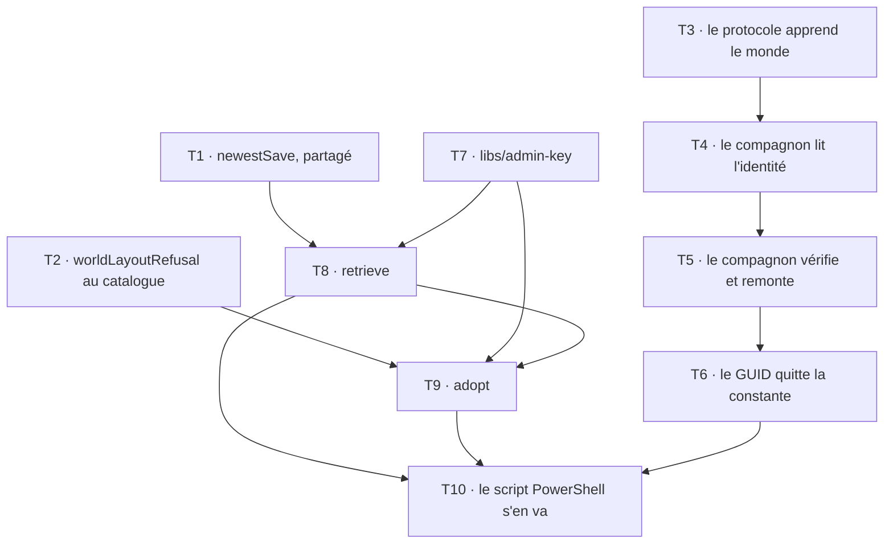

# Tranche 7 — Les mondes vont et viennent

> **Pour les exécutants agentiques :** SOUS-SKILL REQUISE — `superpowers:subagent-driven-development`
> (recommandée) ou `superpowers:executing-plans`. Les étapes sont en cases à cocher (`- [ ]`).

**But :** un monde entre dans le système et en ressort, par un geste d'administrateur testé, et
l'identité d'un monde cesse d'être une constante compilée pour devenir ce que le disque porte.

**Architecture :** trois volets, dans cet ordre. **A** pose ce que les deux côtés partagent — le
choix de la sauvegarde à restaurer, et la marque qui prouve qu'une archive commence au bon niveau.
**B** fait descendre l'identité du monde du catalogue vers le disque, ce qui déplace la
vérification du préfixe du `ServerID` de la Function vers le compagnon. **C** livre
`tools/world-depot` et retire le script PowerShell qu'il remplace.

**Stack :** TypeScript, Nx, vitest, `@aws-sdk/client-s3` via `libs/scaleway-storage`, `tar`.

**Spec :** [`../specs/2026-09-02-game-hosting-design.md`](../specs/2026-09-02-game-hosting-design.md)
— §2 (décision « Adoption et restitution d'un monde »), §4 (glossaire `World`/`adopt`/`retrieve`,
structure du monorepo), §6 étape 7 (la descente de la vérification), §8 (section « L'adoption, la
seule opération qui recouvre »), §13.

**Lotissement :** [`2026-09-02-lotissement.md`](2026-09-02-lotissement.md) — tranche 7, acceptée le
2026-09-11 et placée avant la 6.

## La forme de ce plan, et pourquoi elle n'est pas celle des autres

**Les tâches portent leurs tests et leurs contraintes, jamais le code d'implémentation.** Ce n'est
pas un oubli. Le plan de la tranche 3 embarquait son implémentation, et la revue y a trouvé **onze
contradictions entre ce code et ses propres tests** : du code jamais exécuté se périme entre le
moment où il est écrit et celui où il est lu, et l'exécutant qui le recopie hérite d'un bug que le
plan lui a donné. Le lotissement en tire la règle explicitement — « les tâches ajoutées en cours de
route ont été écrites avec leurs tests et leurs contraintes, sans code d'implémentation, et c'est la
forme à reprendre ».

Les tests, eux, sont écrits en entier : ils sont exécutés dès l'étape suivante, donc ils ne peuvent
pas se périmer en silence.

## Contraintes globales

- **Code et interface en anglais ; spec, docs et commits en français.** Tout terme visible dans
  l'interface doit figurer au glossaire du §4 — aucun de cette tranche ne l'est, elle n'a pas
  d'écran.
- **Aucune trace de l'outil qui a tapé le code** : pas de `Co-Authored-By`, pas de signature.
- **Commits en Conventional Commits**, portée = le projet Nx touché (`session`, `cloud-init`,
  `companion`, `agent-protocol`, `world-depot`, `admin-key`, `spec`, `plan`).
- **La production ne se touche pas.** Aucun `firebase deploy`, aucune écriture Firestore de
  production, **aucun appel qui crée, modifie ou détruit une ressource facturée chez Scaleway ou
  OVH**. La cible est l'émulateur et les doubles. Deux tâches de ce plan manipulent un seau : elles
  tournent contre un MinIO local ou le `FakeObjectApi` existant, jamais contre `beacon-saves`.
- **Ce qui se génère ne s'écrit pas à la main** : toute création de lib ou de projet passe par
  `nx`, via la skill `nx-generate`. Si le générateur ne produit pas ce qu'il faut, on le lance
  d'abord et on corrige ensuite.
- **Tests par `npx nx test <projet>`**, via la skill `nx-run-tasks`.
- **TDD** : le test échoue d'abord, pour la bonne raison, et on le voit échouer.

## Structure des fichiers

| Fichier | Responsabilité | Volet |
|---|---|---|
| `libs/session/src/lib/saves/newest.ts` | **créé** — quelle sauvegarde la prochaine session restaurerait. Le seul calcul, partagé | A |
| `deploy/companion/src/lib/restore.ts` | **modifié** — appelle `newestSave` au lieu de recalculer le maximum | A |
| `deploy/cloud-init/src/lib/catalog.ts` | **modifié** — `GameCatalogEntry` gagne `worldLayoutRefusal`, `JoinFacts` gagne le monde | A, B |
| `deploy/cloud-init/src/lib/enshrouded.ts` | **modifié** — sa marque de disposition | A |
| `deploy/cloud-init/src/lib/sunkenland.ts` | **modifié** — sa marque, puis le GUID qui quitte la constante | A, B |
| `libs/agent-protocol/src/lib/report.ts` | **modifié** — le rapport transporte le monde restauré | B |
| `deploy/companion/src/lib/world-identity.ts` | **créé** — lit `<nom>~<GUID>` dans le dossier restauré | B |
| `deploy/companion/src/lib/agent-loop.ts` | **modifié** — remonte le monde, refuse un `ServerID` qui ne le nomme pas | B |
| `libs/admin-key/` | **créé** — la clé d'administration lue dans rclone, partagée par les deux outils | C |
| `tools/world-depot/src/lib/world-archive.ts` | **créé** — construire et vérifier une archive de monde | C |
| `tools/world-depot/src/lib/choose.ts` | **créé** — lister l'historique, désigner une sauvegarde | C |
| `tools/world-depot/src/retrieve.ts` | **créé** — câblage du geste `retrieve` | C |
| `tools/world-depot/src/adopt.ts` | **créé** — câblage du geste `adopt` | C |
| `deploy/scaleway/bootstrap-world.ps1` | **supprimé** — remplacé par `world-depot adopt` | C |

## Graphe de dépendances entre tâches



**T1, T2, T3 et T7 n'ont aucune dépendance** et peuvent partir en parallèle. **T9 dépend de T8** non
pour du code mais pour le projet Nx que T8 génère. **T6 est la seule tâche qui rende le dépôt
temporairement plus strict qu'avant** — elle supprime un repli — et elle vient donc après T5,
jamais avant.

---

## Volet A — ce que les deux côtés partagent

### Task 1 : `newestSave`, le seul calcul

Le §8 exige que `retrieve` rende par défaut **exactement** ce que la prochaine session
restaurerait. Aujourd'hui ce choix vit en toutes lettres dans `runRestore`. S'il était réécrit dans
l'outil, l'administrateur croirait tenir le monde du serveur et en tiendrait un autre, **sans que
rien n'échoue** — c'est la forme exacte du défaut que `objectKeyFor` a déjà coûté au projet.

**Fichiers :**
- Créer : `libs/session/src/lib/saves/newest.ts`
- Modifier : `libs/session/src/index.ts` (exporter le nouveau module)
- Modifier : `deploy/companion/src/lib/restore.ts` (le `reduce` cède la place à l'appel)
- Test : `libs/session/src/lib/saves/newest.spec.ts`

**Interfaces :**
- Produit : `newestSave(saves: readonly Save[]): Save | undefined`
- Consommé par : T8 (`retrieve`), et `runRestore` dès cette tâche

**Contraintes :**
- **Par `createdAt`, jamais par la position.** Le commentaire actuel de `runRestore` dit pourquoi et
  doit survivre au déplacement : le port promet « newest first », mais une restauration ne doit pas
  dépendre d'un invariant qu'elle ne peut pas vérifier.
- **Toutes origines confondues.** `pre-shutdown`, `auto` et `manual` concourent sur le seul
  `createdAt` — mesuré en tranche 3 : la session 2 a bien repris la `pre-shutdown` parce qu'elle
  était la plus récente, pas parce qu'elle était une `pre-shutdown`.
- **Une liste vide rend `undefined`**, et c'est une réponse légitime : premier soir d'un monde.
- Fonction pure, aucune dépendance, aucun `Clock`.

- [ ] **Étape 1 : écrire le test qui échoue**

```typescript
import { describe, expect, it } from 'vitest';
import { Save } from './save.js';
import { newestSave } from './newest.js';

const save = (iso: string, origin: 'auto' | 'manual' | 'pre-shutdown' = 'auto'): Save =>
  Save.of({
    createdAt: new Date(iso),
    game: 'enshrouded',
    objectKey: `saves/enshrouded/${origin}/s1/${iso}.tar.gz`,
    sizeBytes: 50_000,
    origin,
  });

describe('newestSave', () => {
  it('rend celle que la prochaine session restaurerait', () => {
    const chosen = newestSave([save('2026-09-07T20:00:00Z'), save('2026-09-07T22:31:16Z')]);
    expect(chosen?.createdAt).toEqual(new Date('2026-09-07T22:31:16Z'));
  });

  // Le port promet « newest first ». On ne s'y fie pas : une restauration qui
  // dependrait d'un invariant qu'elle ne peut pas verifier est une restauration
  // qui se trompe de monde le jour ou l'adapter change d'ordre.
  it('ne fait pas confiance a l ordre de la liste', () => {
    const chosen = newestSave([save('2026-09-07T20:00:00Z'), save('2026-09-08T09:00:00Z'), save('2026-09-07T21:00:00Z')]);
    expect(chosen?.createdAt).toEqual(new Date('2026-09-08T09:00:00Z'));
  });

  // Mesure de la tranche 3 : la session 2 a repris la pre-shutdown parce
  // qu'elle etait la plus recente, et pour aucune autre raison.
  it('ne prefere aucune origine, seulement l instant', () => {
    const chosen = newestSave([save('2026-09-08T09:00:00Z', 'pre-shutdown'), save('2026-09-08T10:00:00Z', 'auto')]);
    expect(chosen?.origin).toBe('auto');
  });

  it('rend undefined sur une liste vide, ce qui est le premier soir d un monde', () => {
    expect(newestSave([])).toBeUndefined();
  });
});
```

- [ ] **Étape 2 : le voir échouer pour la bonne raison**

Lancer : `npx nx test session`
Attendu : ÉCHEC — `Cannot find module './newest.js'`. Un échec sur autre chose veut dire que le test
lui-même est faux.

- [ ] **Étape 3 : implémenter le minimum, et exporter**

Écrire `newest.ts`, ajouter `export * from './lib/saves/newest.js';` à `libs/session/src/index.ts`.

- [ ] **Étape 4 : les tests passent**

Lancer : `npx nx test session` → SUCCÈS

- [ ] **Étape 5 : faire appeler `runRestore`**

Remplacer le `reduce` de `restore.ts` par `newestSave(saves)`. **Déplacer le commentaire avec lui** —
c'est lui qui porte la raison de ne pas prendre `saves[0]`, et il n'a plus rien à expliquer à
l'endroit qu'il quitte.

- [ ] **Étape 6 : la suite du compagnon passe sans avoir été touchée**

Lancer : `npx nx test companion`
Attendu : SUCCÈS, **sans qu'aucun test ait été modifié**. C'est ce qui prouve que le calcul extrait
est bien le même — un test à réécrire ici voudrait dire qu'il ne l'était pas.

- [ ] **Étape 7 : commit**

```bash
git add libs/session/src/lib/saves/newest.ts libs/session/src/lib/saves/newest.spec.ts libs/session/src/index.ts deploy/companion/src/lib/restore.ts
git commit -m "refactor(session): sort du compagnon le choix de la sauvegarde a restaurer"
```

---

### Task 2 : la marque qui prouve qu'une archive commence au bon niveau

Le piège est mesuré et il est sournois : une archive construite depuis le dossier parent donne
`Worlds/Worlds/<monde>`, **et le serveur ne s'en plaint pas** — il génère un monde vierge, quelqu'un
y joue, et la poussée du soir devient la sauvegarde la plus récente. La règle d'or tombe sur un `-C`
mal placé, sans qu'aucune ligne n'ait rien effacé.

**Fichiers :**
- Modifier : `deploy/cloud-init/src/lib/catalog.ts` (`GameCatalogEntry` gagne `worldLayoutRefusal`)
- Modifier : `deploy/cloud-init/src/lib/enshrouded.ts`
- Modifier : `deploy/cloud-init/src/lib/sunkenland.ts`
- Test : `deploy/cloud-init/src/lib/catalog.spec.ts`, `enshrouded.spec.ts`, `sunkenland.spec.ts`

**Interfaces :**
- Produit : sur `GameCatalogEntry`, `worldLayoutRefusal(entries: readonly string[]): string | null` — `null`
  si la disposition est bonne, sinon **la phrase à afficher à l'administrateur**.
- Produit : dans `catalog.ts`, `refuseWorldLayout(game: Game, entries: readonly string[]): string | null`
  — normalise puis délègue à l'entrée.
- Consommé par : T9 (`adopt`)

**Contraintes :**
- **Elle vit dans le catalogue, pas dans l'outil.** Le §4 : pas un `if` sur un nom de jeu, une
  entrée de catalogue. `catalogFor` est total, donc le compilateur nommera cette ligne le jour d'un
  troisième jeu.
- **La normalisation est commune et vit dans `catalog.ts`, pas dans l'outil ni dans chaque entrée.**
  `tar tzf` liste avec un `./` de tête que le catalogue n'a pas à connaître trois fois. `catalog.ts`
  porte déjà ce motif exact — `renderCloudInit` tient les refus communs à tous les jeux, puis
  délègue à `catalogFor(game).render()`. `refuseWorldLayout` est son jumeau, et le mettre dans
  l'outil en aurait fait une fonction qui ne transmet que ses arguments.
- **Les entrées reçoivent donc des chemins déjà normalisés**, sans `./`, et n'ont pas à s'en
  occuper.
- **Elle juge la disposition, jamais la complétude.** Le §8 vient d'écrire pourquoi la seconde est
  hors de portée : mesurer si un monde est entier demanderait de le comprendre.
- **Sunkenland : exactement un dossier `<nom>~<GUID>` à la racine, contenant un `World~*.json`.** Le
  `World~*.json` n'est pas du zèle — **les dossiers de personnages portent la même forme
  `<nom>~<GUID>`** (mesuré, `probe/RESULTS.md`), et c'est le seul discriminant. Sans lui, adopter un
  dossier de personnages produit une archive qui restaure quelque chose que personne ne peut jouer.
- **Enshrouded : un fichier d'index `<hex>-index`, et le fichier que son `.latest` désigne, présent
  à côté.** Mesuré en tranche 0 : la save vit sous les noms `3ad85aea` et `3ad85aea-index`, ce
  dernier étant un JSON dont `.latest` nomme le fichier courant.
- **Le message de refus nomme ce qui a été trouvé**, pas seulement ce qui manque : un administrateur
  qui lit « aucun `World~*.json` » sans savoir ce que l'archive portait relance la même commande.

- [ ] **Étape 1 : écrire les tests qui échouent**

```typescript
// deploy/cloud-init/src/lib/sunkenland.spec.ts — a ajouter
describe('worldLayoutRefusal', () => {
  it('accepte un monde a la racine', () => {
    expect(
      sunkenland.worldLayoutRefusal([
        "Beacon's World~4db51c84-24cf-459e-9e9e-88b8c3a7ce3b/World~0.json",
        "Beacon's World~4db51c84-24cf-459e-9e9e-88b8c3a7ce3b/World~1.json",
      ]),
    ).toBeNull();
  });

  // Le piege mesure, et celui qui coute un monde : le serveur ne refuse pas
  // cette archive, il genere un monde vierge par-dessus.
  it('refuse une archive construite depuis le dossier parent', () => {
    const refusal = sunkenland.worldLayoutRefusal([
      "Worlds/Beacon's World~4db51c84-24cf-459e-9e9e-88b8c3a7ce3b/World~0.json",
    ]);
    expect(refusal).toMatch(/Worlds/);
  });

  // Characters/ porte exactement la meme forme <nom>~<GUID>. Sans le
  // World~*.json, on adopte un personnage en croyant adopter un monde.
  it('refuse un dossier de personnages, qui a la meme forme', () => {
    const refusal = sunkenland.worldLayoutRefusal([
      'Charlouze~4db51c84-24cf-459e-9e9e-88b8c3a7ce3b/Character~0.json',
    ]);
    expect(refusal).toMatch(/World~/);
  });

  it('refuse deux mondes, faute de savoir lequel adopter', () => {
    const refusal = sunkenland.worldLayoutRefusal([
      'A~4db51c84-24cf-459e-9e9e-88b8c3a7ce3b/World~0.json',
      'B~5eb62c95-35df-56af-af9f-99c4d8b4cd4c/World~0.json',
    ]);
    expect(refusal).toMatch(/2|deux|two/i);
  });

  it('refuse une archive vide', () => {
    expect(sunkenland.worldLayoutRefusal([])).not.toBeNull();
  });

  it('refuse un guid qui n en est pas un', () => {
    expect(sunkenland.worldLayoutRefusal(['A~pas-un-guid/World~0.json'])).not.toBeNull();
  });
});
```

```typescript
// deploy/cloud-init/src/lib/enshrouded.spec.ts — a ajouter
describe('worldLayoutRefusal', () => {
  it('accepte un index et le fichier qu il designe', () => {
    expect(enshrouded.worldLayoutRefusal(['3ad85aea', '3ad85aea-index'])).toBeNull();
  });

  it('refuse un index dont le fichier courant est absent', () => {
    expect(enshrouded.worldLayoutRefusal(['3ad85aea-index'])).not.toBeNull();
  });

  it('refuse une archive sans index', () => {
    expect(enshrouded.worldLayoutRefusal(['3ad85aea'])).not.toBeNull();
  });

  it('refuse une archive construite depuis le dossier parent', () => {
    const refusal = enshrouded.worldLayoutRefusal(['savegame/3ad85aea', 'savegame/3ad85aea-index']);
    expect(refusal).not.toBeNull();
  });

  it('refuse une archive vide', () => {
    expect(enshrouded.worldLayoutRefusal([])).not.toBeNull();
  });
});
```

```typescript
// deploy/cloud-init/src/lib/catalog.spec.ts — a ajouter
describe('refuseWorldLayout', () => {
  const world = "Beacon's World~4db51c84-24cf-459e-9e9e-88b8c3a7ce3b";

  // tar liste avec un ./ de tete, le catalogue juge sans. La normalisation est
  // commune aux deux jeux, donc elle est ici et pas dans chaque entree.
  it('normalise le ./ que tar met en tete avant de juger', () => {
    expect(refuseWorldLayout('sunkenland', [`./${world}/World~0.json`])).toBeNull();
    expect(refuseWorldLayout('sunkenland', [`${world}/World~0.json`])).toBeNull();
  });

  it('juge chaque jeu par sa propre entree', () => {
    expect(refuseWorldLayout('enshrouded', ['./3ad85aea', './3ad85aea-index'])).toBeNull();
    expect(refuseWorldLayout('enshrouded', [`./${world}/World~0.json`])).not.toBeNull();
  });

  it('refuse l archive vide, quel que soit le jeu', () => {
    expect(refuseWorldLayout('sunkenland', [])).not.toBeNull();
    expect(refuseWorldLayout('enshrouded', [])).not.toBeNull();
  });
});
```

**Note pour l'exécutant :** `enshrouded.worldLayoutRefusal` doit lire le `.latest` de l'index pour savoir
quel fichier exiger. Les tests ci-dessus passent des noms seuls : l'entrée n'a donc pas le contenu
du JSON. **Deux lectures sont possibles et une seule est bonne** — soit la signature prend aussi le
contenu de l'index, soit elle se contente d'exiger qu'un `<hex>` et son `<hex>-index` coexistent.
Prendre la seconde : elle attrape les quatre cas des tests, elle ne demande pas à décompresser
l'archive pour la juger, et elle reste une vérification de disposition. Si l'implémentation demande
plus, c'est le signe qu'elle glisse vers la complétude, que le §8 met hors de portée.

- [ ] **Étape 2 : les voir échouer**

Lancer : `npx nx test cloud-init`
Attendu : ÉCHEC — `worldLayoutRefusal is not a function` sur les deux entrées.

- [ ] **Étape 3 : implémenter**

Déclarer `worldLayoutRefusal` sur `GameCatalogEntry` dans `catalog.ts` avec le commentaire qui dit
**pourquoi elle existe** — le piège du `-C`, pas « vérifie l'archive » —, puis l'implémenter dans
les deux entrées.

- [ ] **Étape 4 : les tests passent**

Lancer : `npx nx test cloud-init` → SUCCÈS

- [ ] **Étape 5 : commit**

```bash
git add deploy/cloud-init/src/lib/
git commit -m "feat(cloud-init): fait dire a chaque jeu comment on reconnait son monde"
```

---

## Volet B — l'identité du monde descend sur le disque

### Task 3 : le rapport de l'agent apprend le monde restauré

Additive, et rien ne la consomme encore. C'est voulu : elle laisse le dépôt vert et permet à T4 et
T5 de s'appuyer sur un protocole qui existe déjà.

**Fichiers :**
- Modifier : `libs/agent-protocol/src/lib/report.ts`
- Test : `libs/agent-protocol/src/lib/report.spec.ts`

**Interfaces :**
- Produit : sur `AgentReport`, `readonly world?: { readonly name: string; readonly guid: string }`
- Consommé par : T5 (le compagnon l'émet), T6 (`joinInfo` le lit)

**Contraintes :**
- **`parseReport` est une couche anticorruption (§4) et la VM est l'élément le moins fiable du
  système (§7).** Elle ne répare jamais, ne laisse passer aucun champ inconnu, et refuse tout
  l'objet plutôt que d'en garder une moitié.
- **Les deux membres sont requis ensemble** : un monde qui a un nom sans GUID, ou l'inverse, est
  refusé. Un GUID sans nom publierait un point de jonction sans le recours que le §2 garantit aux
  joueurs — le nom dans la liste quand l'identifiant se perd.
- **Bornés comme toute chaîne que la VM écrit (§5)**, par le `isBoundedString` existant.
- Ce champ ne voyage **que** sur `ready`. Comme `serverId`, le parseur ne l'impose pas : c'est
  l'appelant qui n'en met pas ailleurs.

- [ ] **Étape 1 : écrire les tests qui échouent**

```typescript
// libs/agent-protocol/src/lib/report.spec.ts — a ajouter
it('lit le monde que la machine declare avoir restaure', () => {
  const world = { name: "Beacon's World", guid: '4db51c84-24cf-459e-9e9e-88b8c3a7ce3b' };
  expect(parseReport({ sessionId: 's1', phase: 'ready', serverId: `${world.guid}~12h`, world })).toEqual({
    sessionId: 's1',
    phase: 'ready',
    serverId: `${world.guid}~12h`,
    world,
  });
});

// Un guid sans nom publierait un point de jonction sans le recours du §2 :
// le nom dans la liste est ce qui reste quand l'identifiant se perd.
it('refuse un monde a moitie declare', () => {
  expect(parseReport({ sessionId: 's1', phase: 'ready', world: { guid: 'g' } })).toBeNull();
  expect(parseReport({ sessionId: 's1', phase: 'ready', world: { name: 'n' } })).toBeNull();
});

it('refuse un monde qui n est pas un objet', () => {
  expect(parseReport({ sessionId: 's1', phase: 'ready', world: 'Beacon' })).toBeNull();
  expect(parseReport({ sessionId: 's1', phase: 'ready', world: null })).toBeNull();
});

it('refuse un nom de monde sans borne', () => {
  expect(
    parseReport({ sessionId: 's1', phase: 'ready', world: { name: 'x'.repeat(1025), guid: 'g' } }),
  ).toBeNull();
});
```

- [ ] **Étape 2 : les voir échouer**

Lancer : `npx nx test agent-protocol`
Attendu : ÉCHEC — le champ `world` est ignoré, donc le premier test compare un objet sans lui.

- [ ] **Étape 3 : implémenter**

- [ ] **Étape 4 : les tests passent**

Lancer : `npx nx test agent-protocol` → SUCCÈS

- [ ] **Étape 5 : commit**

```bash
git add libs/agent-protocol/
git commit -m "feat(agent-protocol): fait voyager le monde que la machine a restaure"
```

---

### Task 4 : le compagnon lit l'identité du monde qu'il vient de poser

**Fichiers :**
- Créer : `deploy/companion/src/lib/world-identity.ts`
- Test : `deploy/companion/src/lib/world-identity.spec.ts`

**Interfaces :**
- Produit : `readWorldIdentity(saveDir: string): { name: string; guid: string } | null`
- Consommé par : T5

**Contraintes :**
- **Le compagnon ne connaît aucun jeu (§4).** Cette fonction ne nomme pas Sunkenland : elle cherche
  un dossier de la forme `<nom>~<GUID>` et rend `null` quand il n'y en a pas — ce qui est le cas
  ordinaire d'Enshrouded, dont le monde ne porte aucune identité. **`null` n'est donc pas une
  erreur.** Ce que T5 en fait dépend du jeu, et cette décision-là vit dans la configuration.
- **Elle lit le disque, pas une archive**, et après restauration : c'est le dossier réellement posé
  qui fait foi, jamais ce qu'une clé d'objet laisse croire.
- **Deux dossiers candidats rendent `null`**, comme zéro : le compagnon n'arbitre pas entre deux
  mondes. T5 le traduit en refus.
- **Le GUID est validé comme un GUID.** Un dossier `Mon~monde` n'en est pas un, et le laisser passer
  ferait échouer la comparaison de T5 avec un message incompréhensible.
- Aucune écriture. Aucun `Clock`. Testable sur un dossier temporaire.

- [ ] **Étape 1 : écrire les tests qui échouent**

```typescript
import { mkdtempSync, mkdirSync, writeFileSync } from 'node:fs';
import { tmpdir } from 'node:os';
import { join } from 'node:path';
import { describe, expect, it } from 'vitest';
import { readWorldIdentity } from './world-identity.js';

const dirWith = (...folders: string[]): string => {
  const root = mkdtempSync(join(tmpdir(), 'beacon-world-'));
  for (const folder of folders) mkdirSync(join(root, folder), { recursive: true });
  return root;
};

describe('readWorldIdentity', () => {
  it('lit le nom et le guid du monde pose sur le disque', () => {
    const root = dirWith("Beacon's World~4db51c84-24cf-459e-9e9e-88b8c3a7ce3b");
    expect(readWorldIdentity(root)).toEqual({
      name: "Beacon's World",
      guid: '4db51c84-24cf-459e-9e9e-88b8c3a7ce3b',
    });
  });

  // Le cas ordinaire de l'autre jeu : son monde ne porte aucune identite.
  // Ce n'est pas une panne, et le compagnon ne nomme aucun jeu (§4).
  it('rend null quand le monde ne porte pas d identite', () => {
    const root = dirWith();
    writeFileSync(join(root, '3ad85aea-index'), '{"latest":"3ad85aea"}');
    expect(readWorldIdentity(root)).toBeNull();
  });

  it('rend null sur deux mondes, parce qu il n arbitre pas', () => {
    const root = dirWith('A~4db51c84-24cf-459e-9e9e-88b8c3a7ce3b', 'B~5eb62c95-35df-56af-af9f-99c4d8b4cd4c');
    expect(readWorldIdentity(root)).toBeNull();
  });

  it('rend null quand ce qui suit le tilde n est pas un guid', () => {
    expect(readWorldIdentity(dirWith('Mon~monde'))).toBeNull();
  });

  it('rend null sur un dossier qui n existe pas, sans lever', () => {
    expect(readWorldIdentity(join(tmpdir(), 'beacon-absent-' + String(process.pid)))).toBeNull();
  });
});
```

- [ ] **Étape 2 : les voir échouer**

Lancer : `npx nx test companion`
Attendu : ÉCHEC — `Cannot find module './world-identity.js'`

- [ ] **Étape 3 : implémenter**

- [ ] **Étape 4 : les tests passent**

Lancer : `npx nx test companion` → SUCCÈS

- [ ] **Étape 5 : commit**

```bash
git add deploy/companion/src/lib/world-identity.ts deploy/companion/src/lib/world-identity.spec.ts
git commit -m "feat(companion): lit sur le disque l identite du monde restaure"
```

---

### Task 5 : le compagnon vérifie, puis remonte

C'est la descente que le §6 décrit. Le compagnon compare le `ServerID` annoncé au monde **qu'il a
lui-même restauré**, là où la Function le comparait à une constante du catalogue.

**Fichiers :**
- Modifier : `deploy/companion/src/lib/agent-loop.ts`
- Modifier : `deploy/companion/src/lib/config.ts` (le jeu dit-il si son monde doit porter une
  identité)
- Test : `deploy/companion/src/lib/agent-loop.spec.ts`

**Interfaces :**
- Consomme : `readWorldIdentity` (T4), `AgentReport.world` (T3)
- Produit : un `ready` qui porte `world` quand le monde en a une

**Contraintes :**
- **Le refus est un `failed`, pas un `ready` muet.** Un `ServerID` qui ne nomme pas le monde
  restauré veut dire que le serveur a démarré sur autre chose — le cas « monde vierge » que toute
  cette défense existe pour attraper. La session doit mourir du délai de provisionnement (§6) avec
  une raison lisible, pas publier un point de jonction.
- **Rien ne change pour le jeu sans identité.** Quand `readWorldIdentity` rend `null` et que le jeu
  n'annonce pas de `ServerID`, le `ready` part comme aujourd'hui. Le compagnon ne nomme toujours
  aucun jeu : ce qui décide est la présence d'un `serverId` dans la sonde, pas un nom.
- **La comparaison est `serverId.startsWith(`${guid}~`)`** — la même forme qu'aujourd'hui dans
  `sunkenland.ts:479`, déplacée et non réinventée.
- **Un `ServerID` annoncé alors qu'aucune identité n'a été lue est un refus.** C'est exactement le
  cas du dossier absent après restauration : il ne doit pas se traduire par « on publie quand même ».

- [ ] **Étape 1 : écrire les tests qui échouent**

`AgentLoopDeps` gagne un membre, et un seul :
`readonly readWorld: () => { readonly name: string; readonly guid: string } | null`.
Le `beforeEach` existant le bouchonne à `() => null`, ce qui est le comportement du jeu sans
identité — les tests déjà écrits restent donc verts sans être touchés.

```typescript
// deploy/companion/src/lib/agent-loop.spec.ts — a ajouter.
// Les doubles sont ceux du beforeEach existant : ne pas en introduire d'autres.

const WORLD = { name: "Beacon's World", guid: '4db51c84-24cf-459e-9e9e-88b8c3a7ce3b' };
const phasesOf = (report: AgentLoopDeps['report']): string[] =>
  (report as ReturnType<typeof vi.fn>).mock.calls.map((call) => call[0].phase);

it('remonte le monde restaure avec la disponibilite', async () => {
  let turns = 0;
  const probeReady = vi.fn(async () => {
    turns++;
    return { ready: true, serverId: `${WORLD.guid}~2026-09-14T20-00-00Z` };
  });
  await runAgentLoop({ ...deps, probeReady, readWorld: () => WORLD, until: () => turns >= 2 });

  const ready = (deps.report as ReturnType<typeof vi.fn>).mock.calls
    .map((call) => call[0])
    .find((report) => report.phase === 'ready');
  expect(ready?.world).toEqual(WORLD);
  expect(ready?.serverId).toBe(`${WORLD.guid}~2026-09-14T20-00-00Z`);
});

// Le cas que toute cette defense existe pour attraper : le serveur a genere un
// monde vierge, donc il annonce un guid qui n'est pas celui qu'on a pose.
it('refuse un identifiant qui ne nomme pas le monde restaure', async () => {
  let turns = 0;
  const probeReady = vi.fn(async () => {
    turns++;
    return { ready: true, serverId: '00000000-0000-0000-0000-000000000000~2026-09-14T20-00-00Z' };
  });
  await runAgentLoop({ ...deps, probeReady, readWorld: () => WORLD, until: () => turns >= 2 });

  const phases = phasesOf(deps.report);
  expect(phases).toContain('failed');
  expect(phases).not.toContain('ready');
});

// Le dossier absent apres restauration. Il ne doit pas se traduire par « on
// publie quand meme » : c'est le meme monde vierge par un autre chemin.
it('refuse un identifiant quand aucune identite n a ete lue', async () => {
  let turns = 0;
  const probeReady = vi.fn(async () => {
    turns++;
    return { ready: true, serverId: 'peu-importe~2026-09-14T20-00-00Z' };
  });
  await runAgentLoop({ ...deps, probeReady, readWorld: () => null, until: () => turns >= 2 });

  const phases = phasesOf(deps.report);
  expect(phases).toContain('failed');
  expect(phases).not.toContain('ready');
});

// L'autre jeu : pas d'identifiant, pas d'identite, et rien ne change.
it('laisse passer la disponibilite du jeu qui n annonce pas d identifiant', async () => {
  let turns = 0;
  const probeReady = vi.fn(async () => {
    turns++;
    return { ready: true };
  });
  await runAgentLoop({ ...deps, probeReady, readWorld: () => null, until: () => turns >= 2 });

  const ready = (deps.report as ReturnType<typeof vi.fn>).mock.calls
    .map((call) => call[0])
    .find((report) => report.phase === 'ready');
  expect(ready).toBeDefined();
  expect(ready?.world).toBeUndefined();
  expect(ready?.serverId).toBeUndefined();
});
```

**Note pour l'exécutant :** le compteur de tours vit dans `probeReady` et jamais dans `until` — le
fichier existant explique pourquoi : un prédicat d'arrêt qui modifierait le compte sur lequel il est
asserté ferait répondre la forme de la boucle au test.

- [ ] **Étape 2 : les voir échouer**

Lancer : `npx nx test companion`
Attendu : ÉCHEC sur les trois premiers ; le quatrième doit **passer d'emblée** — c'est le
comportement actuel, et s'il échoue, la tâche a cassé le jeu sans identité.

- [ ] **Étape 3 : implémenter**

- [ ] **Étape 4 : les tests passent**

Lancer : `npx nx test companion` → SUCCÈS

- [ ] **Étape 5 : commit**

```bash
git add deploy/companion/src/lib/
git commit -m "feat(companion): compare l identifiant annonce au monde qu il a pose"
```

---

### Task 6 : le GUID quitte la constante

La tâche qui ferme le volet. Elle supprime `WORLD_GUID` et `WORLD_NAME` de
`deploy/cloud-init/src/lib/sunkenland.ts`, fait dériver le monde du disque par le point d'entrée, et
transforme un avertissement en refus.

**Fichiers :**
- Modifier : `deploy/cloud-init/src/lib/sunkenland.ts` (constantes, script de démarrage, compose,
  `joinInfo`)
- Modifier : `deploy/cloud-init/src/lib/catalog.ts` (`JoinFacts`)
- Test : `deploy/cloud-init/src/lib/sunkenland.spec.ts`

**Interfaces :**
- Consomme : `AgentReport.world` (T3), remonté par le compagnon (T5)
- Produit : `JoinFacts` gagne `readonly world?: { readonly name: string; readonly guid: string }`

**Contraintes :**
- **`WORLD_GUID` et `WORLD_NAME` disparaissent**, ainsi que la variable `WORLD_GUID` du compose et
  le `: "${WORLD_GUID:?…}"` du script. Le serveur reçoit `-worldGuid` dérivé du dossier restauré.
- **L'avertissement de la ligne 208 devient un refus.** Aujourd'hui le point d'entrée imprime
  `beacon: no folder matching …` et lance le serveur quand même — c'est-à-dire exactement le chemin
  vers le monde vierge. Sans dossier `<nom>~<GUID>`, il sort non nul.
- **Deux dossiers sont aussi un refus**, et pour la même raison : le point d'entrée n'arbitre pas.
- **`joinInfo` garde une vérification**, et c'est délibéré. Elle ne compare plus à une constante
  mais aux **deux valeurs que le rapport porte** : `serverId` doit commencer par `world.guid`. Ça ne
  remplace pas la défense du compagnon, ça attrape un compagnon bogué — la Function ne doit pas
  publier un point de jonction incohérent avec lui-même. Sans `world`, `joinInfo` rend `null`.
- **`worldName` vient de `facts.world.name`**, plus d'une constante.
- Le test qui épingle `WORLD_GUID: 4db51c84-…` dans le compose (`sunkenland.spec.ts:214`)
  **disparaît** : il épingle la chose que cette tâche supprime.

- [ ] **Étape 1 : écrire les tests qui échouent**

```typescript
// deploy/cloud-init/src/lib/sunkenland.spec.ts

describe('joinInfo', () => {
  const world = { name: "Beacon's World", guid: '4db51c84-24cf-459e-9e9e-88b8c3a7ce3b' };

  it('publie le point de jonction avec le nom que la machine a lu', () => {
    const info = sunkenland.joinInfo({
      address: '51.15.42.7',
      serverId: `${world.guid}~2026-09-14T20-00-00Z`,
      world,
    });
    expect(info).toEqual({
      game: 'sunkenland',
      serverId: `${world.guid}~2026-09-14T20-00-00Z`,
      region: 'eu',
      worldName: "Beacon's World",
    });
  });

  // La defense n'a pas disparu : elle compare desormais les deux valeurs du
  // rapport entre elles. Ce qu'elle attrape ici est un compagnon bogue, pas une
  // vm malveillante — celle-la est arretee plus tot, sur le disque.
  it('refuse un identifiant qui ne nomme pas le monde annonce', () => {
    expect(
      sunkenland.joinInfo({ address: '51.15.42.7', serverId: '00000000-0000-0000-0000-000000000000~x', world }),
    ).toBeNull();
  });

  it('refuse quand aucun monde n est annonce', () => {
    expect(sunkenland.joinInfo({ address: '51.15.42.7', serverId: `${world.guid}~x` })).toBeNull();
  });

  it('refuse quand aucun identifiant n est annonce', () => {
    expect(sunkenland.joinInfo({ address: '51.15.42.7', world })).toBeNull();
  });
});

describe('le script de demarrage', () => {
  it('ne compile plus aucun guid', () => {
    expect(sunkenland.compose()).not.toMatch(/4db51c84/);
    expect(sunkenland.render(aBootRequest())).not.toMatch(/4db51c84/);
  });

  // La ligne 208 imprimait un avertissement et lançait le serveur : c'est le
  // chemin vers le monde vierge que le §8 existe pour fermer.
  it('sort non nul quand aucun monde n a ete restaure', () => {
    const script = sunkenland.render(aBootRequest());
    expect(script).toMatch(/exit 1/);
  });
});
```

**Note pour l'exécutant :** `aBootRequest()` n'existe peut-être pas sous ce nom. `sunkenland.spec.ts`
et `catalogue-fixtures.spec-helper.ts` portent déjà de quoi construire une `BootRequest` — **s'en
servir, ne pas en écrire une seconde.**

**Le dernier test est faible et le sait** : il vérifie qu'un `exit 1` figure dans un script bash que
ce test n'exécute pas. C'est tout ce qu'un test unitaire peut dire d'un script. **Ce qui le couvre
vraiment est le test de fumée** — la leçon de la tranche 3 est que neuf tests unitaires contre des
doubles n'ont rien vu de ce qui rendait l'image inutilisable, et que le test de fumée écrit en
dernier a trouvé quatre défauts. Voir la section « Ce que les tests unitaires ne couvrent pas » en
fin de plan.

- [ ] **Étape 2 : les voir échouer**

Lancer : `npx nx test cloud-init`
Attendu : ÉCHEC sur `joinInfo` (la signature ignore `world`) et sur les deux derniers.

- [ ] **Étape 3 : supprimer le test devenu faux**

Retirer l'assertion `'WORLD_GUID: 4db51c84-24cf-459e-9e9e-88b8c3a7ce3b'` de `sunkenland.spec.ts`.
Elle épingle exactement ce que la tâche supprime — la garder « au cas où » ferait échouer la suite
pour une raison qui n'est pas un défaut.

- [ ] **Étape 4 : implémenter**

Supprimer les deux constantes, faire dériver le monde dans le script de démarrage, transformer
l'avertissement en refus, réécrire `joinInfo`, étendre `JoinFacts`.

- [ ] **Étape 5 : les tests passent**

Lancer : `npx nx test cloud-init` → SUCCÈS

- [ ] **Étape 6 : le consommateur de `joinInfo` suit**

Lancer : `npx nx test functions`
La Function qui construit le point de jonction doit passer `world` depuis le rapport. **Si cette
suite était déjà verte sans modification, c'est un signal, pas un soulagement** : ça voudrait dire
que rien ne vérifie que le point de jonction est construit à partir du rapport.

- [ ] **Étape 7 : commit**

```bash
git add deploy/cloud-init/src/lib/ apps/functions/src/
git commit -m "feat(cloud-init): fait lire au serveur le monde qu on lui a pose, au lieu d un guid compile"
```

---

## Volet C — l'outil

### Task 7 : `libs/admin-key`, la clé partagée par les deux outils

`adminCredentialsFrom` vit dans `tools/game-depot/src/lib/admin-credentials.ts` et
`world-depot` en a besoin à l'identique. Le faire dépendre de `game-depot` accrocherait l'outil des
mondes à l'outil des fichiers de jeu pour lire une clé ; le recopier créerait la deuxième
définition que ce projet a déjà payée une fois.

**Fichiers :**
- Créer : `libs/admin-key/` (par `nx`, jamais à la main)
- Déplacer : `tools/game-depot/src/lib/admin-credentials.ts` et sa `.spec.ts`
- Modifier : `tools/game-depot/src/` (les importeurs)

**Interfaces :**
- Produit : `adminCredentialsFrom(configDump: string, remote: string): AdminCredentials`,
  `describeRemote(remote: string, credentials: AdminCredentials): string`, `ADMIN_REMOTE`
- Consommé par : `game-depot` (déjà), T8 et T9

**Contraintes :**
- **Le code est déplacé, pas réécrit.** Les tests existants partent avec lui et **ne sont pas
  modifiés** : c'est ce qui prouve que le déplacement n'a rien changé.
- **La lib est générée** : invoquer la skill `nx-generate`. Un fichier écrit à la main n'entre pas
  dans le graphe de projets, et la panne arrive plus tard, ailleurs, et ne se lit plus.
- **Elle ne connaît aucun préfixe**, ni saves ni games. Elle lit une clé, c'est tout — ce qui est
  précisément ce qui la rend partageable entre un outil qui ne doit pas connaître le préfixe des
  saves et un outil qui le connaît.

- [ ] **Étape 1 : générer la lib**

Invoquer `nx-generate`. Annoncer « Using nx-generate to scaffold libs/admin-key », puis suivre la
skill.

- [ ] **Étape 2 : déplacer le code et ses tests, sans les toucher**

- [ ] **Étape 3 : recâbler `game-depot` sur `@beacon/admin-key`**

- [ ] **Étape 4 : les deux suites passent**

Lancer : `npx nx test admin-key && npx nx test game-depot`
Attendu : SUCCÈS des deux, **sans qu'aucune assertion ait été réécrite**.

- [ ] **Étape 5 : commit**

```bash
git add libs/admin-key/ tools/game-depot/
git commit -m "refactor(admin-key): sort de game-depot la lecture de la cle d administration"
```

---

### Task 8 : `world-depot retrieve` — rendre un monde

**Fichiers :**
- Créer : `tools/world-depot/` (par `nx`)
- Créer : `tools/world-depot/src/lib/choose.ts`, sa `.spec.ts`
- Créer : `tools/world-depot/src/retrieve.ts`
- Créer : `tools/world-depot/README.md`

**Interfaces :**
- Consomme : `newestSave` (T1), `adminCredentialsFrom` (T7), `ScalewaySaveStore` et `objectKeyFor`
  de `@beacon/scaleway-storage`
- Produit : `chooseSave(saves: readonly Save[], wanted?: string): Save | undefined` — sans `wanted`,
  délègue à `newestSave` ; avec, rend la sauvegarde dont l'`objectKey` correspond
- Cible Nx : `retrieve`

**Contraintes :**
- **Le défaut est `newestSave`, appelé et non réimplémenté** (§8). C'est la contrainte centrale de
  cette tâche : si `chooseSave` recalculait le maximum, l'administrateur croirait tenir le monde du
  serveur et en tiendrait un autre, sans que rien n'échoue.
- **Il sait lister**, sinon la réparation que le §8 promet n'existe pas : réparer un recouvrement
  demande la clé *précédente*, pas la dernière.
- **Il n'écrit rien dans le seau, et ne peut pas :** il passe par `SaveStore`, dont le §8 dit qu'il
  n'a ni suppression ni élagage. C'est la propriété qui fait de cet outil autre chose qu'un script
  avec une clé d'administration.
- **Il dit ce qu'il a pris** : clé, taille, date, et pour un monde avec identité son nom et son GUID.
- **Aucune ressource facturée n'est touchée pendant le développement.** Les tests tournent contre le
  `FakeObjectApi` de `libs/scaleway-storage`.

- [ ] **Étape 1 : générer le projet**

Invoquer `nx-generate`. Reprendre la forme de `tools/game-depot/package.json` pour les cibles
`nx:run-commands` sur `npx tsx`.

- [ ] **Étape 2 : écrire le test qui échoue**

```typescript
import { describe, expect, it } from 'vitest';
import { Save } from '@beacon/session';
import { chooseSave } from './choose.js';

const save = (iso: string): Save =>
  Save.of({
    createdAt: new Date(iso),
    game: 'sunkenland',
    objectKey: `saves/sunkenland/auto/s1/${iso.replace(/[:.]/g, '-')}.tar.gz`,
    sizeBytes: 50_000,
    origin: 'auto',
  });

describe('chooseSave', () => {
  const history = [save('2026-09-07T20:00:00Z'), save('2026-09-08T09:00:00Z')];

  // Le defaut est ce que la prochaine session restaurerait, et c'est le meme
  // calcul que le compagnon appelle — pas un second qui lui ressemble (§8).
  it('rend par defaut ce que la prochaine session restaurerait', () => {
    expect(chooseSave(history)?.createdAt).toEqual(new Date('2026-09-08T09:00:00Z'));
  });

  // Sans ca, reparer un recouvrement est impossible : ce qu'il faut reprendre
  // est la cle precedente, justement pas la derniere.
  it('rend celle qu on designe, meme si elle n est pas la derniere', () => {
    const wanted = history[0].objectKey;
    expect(chooseSave(history, wanted)?.objectKey).toBe(wanted);
  });

  it('rend undefined pour une cle que l historique ne porte pas', () => {
    expect(chooseSave(history, 'saves/sunkenland/auto/s1/jamais.tar.gz')).toBeUndefined();
  });

  it('rend undefined sur un historique vide', () => {
    expect(chooseSave([])).toBeUndefined();
  });
});
```

- [ ] **Étape 3 : le voir échouer**

Lancer : `npx nx test world-depot`
Attendu : ÉCHEC — `Cannot find module './choose.js'`

- [ ] **Étape 4 : implémenter `chooseSave`, puis câbler `retrieve.ts`**

- [ ] **Étape 5 : les tests passent**

Lancer : `npx nx test world-depot` → SUCCÈS

- [ ] **Étape 6 : l'éprouver contre un seau local**

Déposer une archive de test dans un MinIO local, puis :

```bash
npx nx run world-depot:retrieve -- --game=sunkenland --to=./tmp-monde.tar.gz
```

**Jamais contre `beacon-saves`.** Ce que cette étape vérifie et qu'aucun test unitaire ne peut dire :
que les identifiants se lisent, que le transfert aboutit, et que le fichier écrit s'ouvre.

- [ ] **Étape 7 : commit**

```bash
git add tools/world-depot/
git commit -m "feat(world-depot): rend le monde qui vit dans le seau"
```

---

### Task 9 : `world-depot adopt` — adopter un monde

**Fichiers :**
- Créer : `tools/world-depot/src/lib/world-archive.ts`, sa `.spec.ts`
- Créer : `tools/world-depot/src/adopt.ts`
- Modifier : `tools/world-depot/README.md`

**Interfaces :**
- Consomme : `refuseWorldLayout` (T2), `chooseSave` (T8), `Save.of`, `ScalewaySaveStore.deposit`
- Produit : `buildWorldArchive(fromDir: string, toFile: string): Promise<readonly string[]>` —
  construit l'archive et rend ce qu'elle contient, pour que l'appelant le soumette au catalogue
- Cible Nx : `adopt`

**Note de conception :** ce module **n'enveloppe pas** `refuseWorldLayout`. La vérification est
appelée directement par `adopt.ts` sur ce que `buildWorldArchive` rend. Une fonction locale qui
n'aurait fait que transmettre ses arguments au catalogue aurait ajouté une interface sans ajouter
de fonctionnalité — et aurait mis dans l'outil une connaissance que le §4 garde au catalogue.

**Contraintes :**
- **L'ordre des trois gardes est celui du §8, et il n'est pas interchangeable.** La disposition est
  vérifiée **avant** que quoi que ce soit quitte la machine — « une archive refusée plus loin a déjà
  quitté la machine ». Puis le plancher. Puis la confirmation.
- **Il annonce ce qu'il recouvre avant de demander** : la sauvegarde actuellement la plus récente —
  sa date, sa taille, et pour un monde avec identité son nom et son GUID. C'est la troisième
  propriété du §8, et elle suppose un `chooseSave(history)` avant le dépôt.
- **Il demande toujours.** Un outil qui dépose sans le dire est un outil qu'on lance deux fois par
  accident — c'est ce que `bootstrap-world.ps1` avait déjà compris.
- **Le dépôt est un `deposit` avec `origin: 'manual'` et `sessionId: 'bootstrap'`**, ce qui donne
  `saves/{game}/manual/bootstrap/{instant}.tar.gz`. **La clé est construite par `objectKeyFor`, pas
  écrite à la main** : le script PowerShell l'épelait et signalait lui-même que rien ne casserait
  quand les deux définitions divergeraient.
- **Il dit que l'adoption est invisible à l'audit.** Aucun document `saves/{id}` n'est écrit — seules
  les Functions en écrivent —, donc le monde peut changer sans que l'historique en porte une ligne
  (§8). L'administrateur doit le lire, pas le découvrir.
- **`adopt` prend un dossier explicite** (`--from=<dossier>`). La découverte automatique sous
  `LocalLow` que portait le script PowerShell ne survit pas : elle ne valait que pour un jeu et
  produisait déjà une ambiguïté que le script traitait par un refus.

- [ ] **Étape 1 : écrire les tests qui échouent**

```typescript
import { mkdtempSync, mkdirSync, writeFileSync } from 'node:fs';
import { tmpdir } from 'node:os';
import { join } from 'node:path';
import { describe, expect, it } from 'vitest';
import { refuseWorldLayout } from '@beacon/cloud-init';
import { buildWorldArchive } from './world-archive.js';

const WORLD = "Beacon's World~4db51c84-24cf-459e-9e9e-88b8c3a7ce3b";

const worldDir = (): string => {
  const root = mkdtempSync(join(tmpdir(), 'beacon-adopt-'));
  mkdirSync(join(root, WORLD), { recursive: true });
  // Une apostrophe et une espace dans le nom : c'est le monde reel, et c'est
  // ce qui casse un script shell ecrit sans guillemets.
  writeFileSync(join(root, WORLD, 'World~0.json'), '{}');
  return root;
};

describe('buildWorldArchive', () => {
  it('archive a partir du dossier donne, et rend ce qu elle contient', async () => {
    const archive = join(mkdtempSync(join(tmpdir(), 'beacon-out-')), 'world.tar.gz');
    const entries = await buildWorldArchive(worldDir(), archive);
    expect(entries.some((entry) => entry.includes(`${WORLD}/World~0.json`))).toBe(true);
  });

  // Le piege mesure : construire depuis le parent donne Worlds/Worlds/<monde>,
  // le serveur ne s'en plaint pas, et il genere un monde vierge par-dessus.
  // Ce test est la preuve que l'archive commence bien au bon niveau.
  it('ne coiffe pas le contenu d un dossier de plus', async () => {
    const archive = join(mkdtempSync(join(tmpdir(), 'beacon-out-')), 'world.tar.gz');
    const entries = await buildWorldArchive(worldDir(), archive);
    expect(refuseWorldLayout('sunkenland', entries)).toBeNull();
  });
});
```

**Note pour l'exécutant :** le second test est le seul du plan qui relie les deux moitiés — il
construit une vraie archive et la soumet au vrai juge. **Ne pas le remplacer par un double.** Un
`refuseWorldLayout` bouchonné ici testerait que l'outil appelle une fonction, alors que ce qu'on
veut savoir est ce que `tar` a réellement écrit.

- [ ] **Étape 2 : les voir échouer**

Lancer : `npx nx test world-depot`
Attendu : ÉCHEC — `Cannot find module './world-archive.js'`

- [ ] **Étape 3 : implémenter, puis câbler `adopt.ts`**

- [ ] **Étape 4 : les tests passent**

Lancer : `npx nx test world-depot` → SUCCÈS

- [ ] **Étape 5 : l'éprouver contre un seau local, aller et retour**

```bash
npx nx run world-depot:adopt -- --game=sunkenland --from=<dossier contenant le monde>
npx nx run world-depot:retrieve -- --game=sunkenland --to=./verif.tar.gz
```

Vérifier que ce qui revient est ce qui est parti, **à l'octet près** — c'est le critère que les
tranches 3 et 3 bis ont utilisé pour lever leurs gates, et c'est le seul qui prouve la symétrie que
le §8 réclame. **Contre MinIO, jamais contre `beacon-saves`.**

- [ ] **Étape 6 : commit**

```bash
git add tools/world-depot/
git commit -m "feat(world-depot): adopte un monde venu d ailleurs"
```

---

### Task 10 : le script PowerShell s'en va

**Fichiers :**
- Supprimer : `deploy/scaleway/bootstrap-world.ps1`
- Modifier : `deploy/scaleway/README.md`, `tools/game-depot/README.md` (le renvoi au script)
- Modifier : `docs/superpowers/plans/2026-09-02-lotissement.md` (la tranche 7 passe à « livrée »)

**Contraintes :**
- **Chercher les renvois avant de supprimer.** `grep -rn "bootstrap-world"` sur tout le dépôt : un
  fichier supprimé dont trois documents parlent encore est pire que celui qu'on a gardé.
- **Le README de `world-depot` doit reprendre ce que le script savait et que le code ne dit pas** :
  pourquoi un monde ne se retélécharge pas, pourquoi le GUID et le nom de dossier se figent à la
  création, et que l'adoption est invisible à l'audit. Ce sont les commentaires les plus précieux du
  script, et ils ne sont nulle part ailleurs.
- **Ne pas fusionner dans `main`.** La fusion est la mise en production, et c'est la décision d'un
  humain.

- [ ] **Étape 1 : relever les renvois**

```bash
grep -rn "bootstrap-world" --exclude-dir=node_modules --exclude-dir=dist .
```

- [ ] **Étape 2 : verser dans le README de `world-depot` ce qui mérite de survivre**

- [ ] **Étape 3 : supprimer le script et corriger les renvois**

- [ ] **Étape 4 : la suite complète passe**

Lancer : `npx nx run-many -t test lint`
Attendu : SUCCÈS partout.

- [ ] **Étape 5 : commit**

```bash
git add -A
git commit -m "refactor(world-depot): retire le script d amorcage que l outil remplace"
```

---

## Ce que les tests unitaires ne couvrent pas

**C'est la leçon de la tranche 3, et elle est chère.** Neuf tâches de tests unitaires contre des
doubles avaient prouvé la logique, et rien ne prouvait que l'artefact démarrait : le test de fumée,
écrit en dernier, a trouvé **quatre défauts qui rendaient l'image inutilisable**, puis la revue de
branche a trouvé l'ordre suivant du même défaut, et la première vraie session l'ordre d'après.
Chaque niveau ne voit que ce que le précédent ne pouvait pas voir.

Cette tranche a exactement la même forme de risque, et à un endroit précis : **T6 modifie un script
bash que tous ses tests traitent comme une chaîne de caractères.** Aucun test de ce plan n'exécute
le point d'entrée Sunkenland.

Trois choses ne se sauront donc qu'en les exerçant pour de vrai, et elles sont à faire **avant** de
proposer la fusion :

1. **Le point d'entrée dérive-t-il vraiment le GUID du dossier restauré ?** Le test vérifie qu'aucun
   `4db51c84` ne subsiste dans le script. Il ne vérifie pas que le `compgen`/`find` qui le remplace
   rend le bon dossier — un monde dont le nom contient une espace, ce qui est le cas du monde réel
   (`Beacon's World`), et une apostrophe, ce qui l'est aussi.
2. **Le refus sort-il vraiment non nul ?** Un `exit 1` présent dans une chaîne n'est pas un `exit 1`
   atteint.
3. **La chaîne complète tient-elle ?** `adopt` → session → le serveur démarre sur le monde adopté →
   `retrieve` rend ce qu'on a déposé. C'est le seul essai qui exerce la descente de la vérification
   de bout en bout.

Le test de fumée du compagnon existe déjà (§10, tranche 3) et c'est le bon endroit pour 1 et 2.
**Pour 3, il faut une vraie session, qui crée une vraie machine facturée : c'est un geste humain,
pas un geste d'agent.** Écrire la commande, dire ce qu'elle va faire, et laisser le commanditaire la
lancer.

## Couverture du spec

| Exigence | Tâche |
|---|---|
| §2 — `tools/world-depot`, deux gestes symétriques, hors interface | T8, T9 |
| §2 — l'identité du monde n'est plus une constante du catalogue | T6 |
| §4 — glossaire `World`, `adopt`, `retrieve` | *aucune* — le §4 est écrit, et rien de cette tranche n'est visible dans l'interface |
| §4 — `world-depot` n'atteint le seau qu'à travers `SaveStore` | T8, T9 |
| §6 — la comparaison descend au compagnon | T4, T5 |
| §6 — le nom du monde devient un fait de la machine | T3, T6 |
| §6 — l'absence de dossier devient un refus de démarrer | T6 |
| §8 — `retrieve` rend par défaut ce que la prochaine session restaurerait | T1, T8 |
| §8 — `retrieve` sait en nommer une autre | T8 |
| §8 — `SaveStore` n'acquiert aucun verbe | T8, T9 (contrainte, vérifiée par revue) |
| §8 — le plancher garde l'adoption | T9 (par `Save.of`, sans code propre) |
| §8 — l'outil nomme ce qu'il recouvre | T9 |
| §8 — l'archive est vérifiée avant de partir, par le catalogue | T2, T9 |
| §8 — l'adoption est invisible à l'audit, et le dit | T9 |
| §13 — les deux gestes restent hors interface | *tout le plan* : aucune tâche ne touche `apps/web` |
