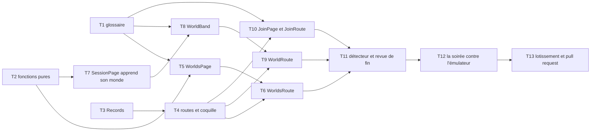

# Tranche 9 bis — L'écran des mondes

> **Pour les exécutants agentiques :** SOUS-SKILL REQUISE — `superpowers:subagent-driven-development`
> (recommandée) ou `superpowers:executing-plans`. Les étapes sont en cases à cocher (`- [ ]`).

**But :** un membre ouvre `beacon.charlouze.com`, lit la liste de ses mondes et lequel tourne, entre
dans un monde par son lien, et retrouve sur `/worlds/{worldId}` l'écran de la tranche 5 augmenté de
ce que le monde possède hors de toute session — son nom, son lien, ses joueurs. À la fin, la branche
de la tranche 9 est fusionnable : l'écran lit `server/current` là où la 9 l'a mis.

**Architecture :** `apps/web` gagne des routes, ce qu'il n'a jamais eu, et rien d'autre ne bouge dans
`libs/*`. Trois routes, trois conteneurs humbles qui tiennent un abonnement chacun, et des pages
pures qui ne connaissent aucun `*-record`. La coquille `App` cède ses connexions à un service
injectable, `Records`, qui devient la racine de composition côté navigateur. Les fonctions
d'affichage restent pures dans `format.ts` et `worlds/overview.ts`, testées sans Angular.

**Stack :** Angular 22 en composants autonomes et signaux, `@angular/router` déjà installé et
jamais utilisé, Vitest via `@angular/build:unit-test`, `firebase` 11 derrière `libs/*-record`,
émulateurs Firestore et Auth. Aucune dépendance nouvelle.

**Spec :** [`../specs/2026-09-02-game-hosting-design.md`](../specs/2026-09-02-game-hosting-design.md)
— révision du 2026-09-15 : §4 (le glossaire, `World`, `session-record` face client), §5 (qui a le
droit de lire), §7 (le code d'invitation), §8 (lien périmé, dernier joueur qui part), §13.

**Lotissement :** [`2026-09-02-lotissement.md`](2026-09-02-lotissement.md) — tranche 9 bis, et le gate
qui la lie à la 9 : les deux partent dans une seule fusion.

**Maquettes :** [`.impeccable/mocks/worlds/`](../../../.impeccable/mocks/worlds/README.md), tour du
2026-09-15. Le contrat de direction de la liste est dans
[`.impeccable/surfaces/apps-web-src-app-worlds-worlds-page-html.md`](../../../.impeccable/surfaces/apps-web-src-app-worlds-worlds-page-html.md),
celui du monde dans
[`.impeccable/surfaces/apps-web-src-app-session-session-page-html.md`](../../../.impeccable/surfaces/apps-web-src-app-session-session-page-html.md).

## La forme de ce plan

**Les tâches portent leurs tests et leurs contraintes, jamais le code d'implémentation.** C'est la
forme des tranches 5, 7 et 9 : du code jamais exécuté se périme entre le moment où il est écrit et
celui où il est lu. Un bloc de code ci-dessous est **un test, une valeur littérale à écrire, ou une
commande à lancer** — jamais une implémentation à recopier.

**Les interfaces sont posées une fois, en tête.** Une signature de cette section fait autorité sur
toute phrase d'une tâche qui la contredirait.

## Ce que la tranche 9 laisse prêt

- **`ClientSessionRecord`** avec ses onze opérations, testé contre l'émulateur et les règles :
  `watchMyWorlds`, `watchWorld`, `watchSettings`, `watchVersionDrift`, `join`, `leave`, `rename`,
  `regenerateInvite`, `open`, `extend`, `requestStop`. **Ce plan n'en ajoute aucune.**
- **`WorldSummary`** : un monde et sa vue de session, publiés ensemble ; `server` est `null` quand
  `server/current` est illisible.
- **Un monde de développement**, `dev-world`, semé par `mise run personas` avec ses joueurs et un
  code d'invitation, `DEV_WORLD_INVITE_CODE` dans `apps/functions/src/personas.ts` ; `mise run
  screen <état>` met son `server/current` dans l'état demandé.
- **Un rewrite Hosting** `**` → `/index.html`, déjà dans `firebase.json` : un lien profond vers
  `/worlds/dev-world` ou `/join/…` sert l'application.

**Et ce qu'elle laisse rouge, à dessein.** `apps/web` ne compile plus sur la branche : `App`
appelle `watch`, `open({ game })`, `extend()` et `requestStop()` sous leur ancienne forme, et cinq
fichiers de test construisent une `Session` sans `worldId`, que `SessionFields` exige désormais.
C'est le gate du lotissement rendu visible par le compilateur. **La tâche 3 s'exécute en premier**
et rend `web` vert ; les tâches 1 et 2 peuvent la précéder, mais rien ne se vérifie avant elle.

## Les décisions du tour du 2026-09-15

Prises avec le commanditaire, tracées dans le README des maquettes. Elles ne se rediscutent pas ici.

1. **La liste est l'index des noms** — une bande par monde, le nom à l'échelle d'affichage, l'état
   et l'heure à droite. Le bandeau dit l'état de l'ensemble avant qu'on lise une ligne.
2. **Pas de cumul du mois.** La face client ne lit pas `events` ; il arrive avec la tranche 8.
3. **`/join` entre tout de suite, puis redirige.** Un premier entrant ne peut rien lire du monde
   avant d'y être (§5) ; la page ne le nomme pas, et n'a que deux visages.
4. **`regenerateInvite` est exposé**, geste discret à côté du lien, confirmé sur place.
5. **Le jeu se lit, il ne se choisit plus.** Le sélecteur de la tranche 5 disparaît.
6. **La bande du monde** — nom, lien, joueurs — sous les actions, dans les trois colonnes du point
   de jonction. Renommer se fait sur place ; nouveau lien et quitter se confirment sur place, jamais
   dans une fenêtre.
7. **Les joueurs se comptent, ils ne se nomment pas** : un document joueur ne porte que l'uid, et
   le §5 interdit de lire le profil d'un autre membre.

## Contraintes globales

Les exigences de cette section sont implicitement celles de **chaque** tâche. Celles de la tranche 5
restent en vigueur sur tout `apps/web` ; ne sont redites ici que celles qui changent ou s'ajoutent.

### Ce qui change depuis la tranche 5

- **Des routes, désormais.** `@angular/router` entre dans `apps/web`, avec `provideRouter` et
  `withComponentInputBinding()` : un conteneur routé reçoit `worldId` et `code` comme `input()`, ce
  qui le rend testable sans `ActivatedRoute`. Trois routes et une redirection, rien d'autre.
- **Le jeu ne se choisit plus** : aucun sélecteur, aucun `output<Game>`. `opened` est `output<void>`.
- **L'écran affiche ce qui se lit** dans `worlds/{worldId}`, ses `players/{uid}`, son
  `server/current`, `config/settings`, `members/{uid}` ou le profil Google. Le nom du monde vient de
  `World.name` ; le nombre de joueurs de `World.players.length` ; le lien de `World.inviteCode` et
  de l'origine de la page. **Aucun nom d'un autre joueur, nulle part.**
- **Les petits contrôles sont à 11 px**, `Copy` compris : 10 px est sous le plancher de lisibilité
  du texte fonctionnel, et le détecteur l'a dit au tour de maquettes.

### Ce qui s'ajoute

- **Les pages sont pures, les conteneurs sont humbles.** Une page (`*.page.ts`, `*.component.ts`)
  n'importe aucun `*-record` et ne connaît ni `Records` ni le routeur, hors `RouterLink` ; ses
  actions sortent en événements. Un conteneur (`*.route.ts`) tient un abonnement, le ferme à sa
  destruction, traduit les événements en appels au record, et navigue. Un test de page se joue
  avec `setInput` ; un test de conteneur avec un double de `Records`.
- **`Records` est la seule chose qui parle aux records**, et la seule qui connaisse
  `FIREBASE_CONNECTION`. C'est la racine de composition du navigateur ; `App` ne fait plus que
  choisir entre la porte, le visiteur et la sortie de routeur.
- **Un abonnement vit exactement le temps de ce qui l'affiche.** Le conteneur d'un monde ferme
  `watchWorld` dans `ngOnDestroy` ; la liste ferme `watchMyWorlds` de même. Les abonnements
  globaux — `watchSettings`, `watchVersionDrift` — vivent le temps de l'appartenance, comme
  aujourd'hui dans `App`.
- **Chaque composant naît par le générateur** — `nx g @nx/angular:component`, sous la skill
  `nx-generate`, qui décide des options — puis se renomme et s'aligne sur la convention du dossier
  (`*.page.ts`, `*.component.ts`, `*.route.ts`, `ChangeDetectionStrategy.OnPush`, gabarit en ligne
  sauf pour les pages). Lancer d'abord, corriger ensuite, jamais l'inverse.
- **Tout terme visible figure au glossaire du §4**, et la tâche 1 l'y met avant qu'une seule chaîne
  soit écrite. Les termes de ce plan : `Your worlds`, `No world yet`, `Nothing running`,
  `1 in service`, `Next session`, `once opened`, `Rename`, `Save`, `Cancel`, `New link`,
  `Keep this one`, `Leave`, `Stay`, `Joining`, `Taking you in.`, `Link not valid`, `Not yours`.
- **Les crochets de test** : `data-action` pour ce qui s'actionne, `data-field` pour ce qui
  s'affiche, `data-tone` pour l'état d'un bandeau. Jamais une classe de style.
- **Aucun test ne dépend de l'horloge murale** : `CLOCK` injecté, `FIXED_CLOCK` dans les tests.
- **Production** : aucune fusion dans `main` par un agent, aucun `firebase deploy`, aucune écriture
  dans le Firestore de production. La cible est l'émulateur. Les tâches 13 et 14 sont conduites par
  un humain.
- **Toute vérification qui précède une fusion se fait en `--skip-nx-cache`.**

## Structure des fichiers

| Fichier | Responsabilité |
|---|---|
| `docs/superpowers/specs/2026-09-02-game-hosting-design.md` | **modifié** — le glossaire du §4 accueille les libellés du tour |
| `apps/web/src/app/format.ts`, `format.spec.ts` | **modifiés** — `stateLabel`, `inviteLink` |
| `apps/web/src/app/worlds/overview.ts`, `overview.spec.ts` | **créés** — `overview`, `byUrgency` : ce que le bandeau et l'ordre de la liste disent d'un lot de mondes |
| `apps/web/src/app/records.ts`, `records.spec.ts` | **créés** — la racine de composition : les deux connexions, le viewer, les réglages, la dérive, la bande d'erreur |
| `apps/web/src/app/app.ts`, `app.spec.ts`, `app.config.ts`, `app.routes.ts` | **modifiés / créé** — la coquille n'a plus que trois branches ; les routes |
| `apps/web/src/app/worlds/worlds.page.ts`, `.html`, `.css`, `.spec.ts` | **créés** — la liste, l'index des noms, la liste vide |
| `apps/web/src/app/worlds/worlds.route.ts`, `.spec.ts` | **créés** — le conteneur de la liste |
| `apps/web/src/app/worlds/world.route.ts`, `.spec.ts` | **créés** — le conteneur d'un monde, et l'écran « pas le vôtre » |
| `apps/web/src/app/session/world-band.component.ts`, `.css`, `.spec.ts` | **créés** — nom, lien, joueurs ; renommer, nouveau lien, quitter |
| `apps/web/src/app/session/session.page.ts`, `.html`, `.spec.ts` | **modifiés** — le monde dans le bandeau, la bande sous les actions, `Beacon` ramène à la liste |
| `apps/web/src/app/session/out-of-service.component.ts`, `.css`, `.spec.ts` | **modifiés** — le sélecteur de jeu disparaît |
| `apps/web/src/app/join/join.page.ts`, `.spec.ts`, `join.route.ts`, `join.route.spec.ts` | **créés** — l'entrée par un lien, ses deux visages |
| `apps/web/src/app/join/copy-button.component.ts` | **modifié** — 11 px, sur la classe partagée |
| `libs/session-record/src/lib/client-session.ts`, `client-session.spec.ts` | **modifiés** — `join` sans effet pour un joueur déjà là ; le seul geste hors `apps/web` |
| `apps/web/src/styles.css` | **modifié** — `.small`, le petit contrôle bordé ; `.quiet a` ; les bandes de l'index |
| `docs/superpowers/plans/2026-09-02-lotissement.md` | **modifié** — la 9 bis pointe vers ce plan |

## Interfaces partagées

Ce que les tâches produisent et consomment, avec les noms exacts. Un exécutant qui a besoin d'un nom
le prend ici.

```typescript
// apps/web/src/app/format.ts — tâche 2
export type Tone = 'live' | 'off' | 'warn';
export type Announced = { readonly label: string; readonly tone: Tone };
/** Le mot du tableau pour un état, et le ton où il s'annonce. `'unreadable'` pour une vue nulle. */
export function stateLabel(state: SessionState | 'unreadable'): Announced;
/** `${origin}/join/${worldId}/${inviteCode}` — ce qu'un joueur colle sur Discord (§4). */
export function inviteLink(origin: string, world: World): string;

// apps/web/src/app/worlds/overview.ts — tâche 2
/** Ce que le bandeau dit du lot : 'No world yet' | 'Nothing running' | '1 in service' | 'N in service'. */
export function overview(worlds: readonly WorldSummary[]): Announced;
/** RUNNING d'abord, puis PROVISIONING, STOPPING, FAILED, puis IDLE, puis illisible ; à égalité, le nom. */
export function byUrgency(worlds: readonly WorldSummary[]): readonly WorldSummary[];

// apps/web/src/app/records.ts — tâche 3
export const ORIGIN: InjectionToken<string>;   // factory : location.origin
@Injectable({ providedIn: 'root' })
export class Records {
  readonly viewer: Signal<Viewer>;
  readonly member: Signal<Member | null>;
  readonly visitor: Signal<string | null>;    // le nom d'un visiteur, sinon null
  readonly settings: Signal<SessionSettings>;
  readonly error: Signal<string | null>;      // la bande rouge en bas de page
  /** Le record de session, ouvert à la première appartenance, rejeté à la fin de celle-ci. */
  session(): ClientSessionRecord;
  /** Le membre en `Actor` ; lève si personne n'est membre. */
  actor(): Actor;
  /** Joue l'action, montre le refus dans `error`, et dit si elle a abouti. */
  run(action: () => Promise<void>): Promise<boolean>;
  signIn(): void;
  signOut(): void;
  declareSteamId(steamId: string): void;
}

// apps/web/src/app/app.routes.ts — tâche 4
export const routes: Routes;  // '' → WorldsRoute ; 'worlds/:worldId' → WorldRoute ;
                              // 'join/:worldId/:code' → JoinRoute ; '**' → redirectTo ''

// apps/web/src/app/worlds/worlds.page.ts — tâche 5 · selector 'beacon-worlds-page'
worlds = input.required<readonly WorldSummary[]>();
settings = input.required<SessionSettings>();
signedOut = output<void>();
// data-field : wordmark, overview (data-tone), world (un par bande, data-world-id), world-name,
//              world-state, time-left, closes-at, ready-window, next-session, empty

// apps/web/src/app/worlds/worlds.route.ts — tâche 6 · selector 'beacon-worlds-route'
// aucun input ; s'abonne à watchMyWorlds(records.member().uid) ; rend <beacon-worlds-page>

// apps/web/src/app/session/world-band.component.ts — tâche 8 · selector 'beacon-world-band'
world = input.required<World>();
// le lien est inviteLink(inject(ORIGIN), world) — calculé ici, personne ne le fait transiter
renamed = output<string>();
reinvited = output<void>();
left = output<void>();
// data-field : world-name, world-game, invite-link, players-count, name-hint, link-hint, leave-hint
// data-action : rename, save-name, cancel-name, new-link, confirm-new-link, keep-link,
//               leave, confirm-leave, stay

// apps/web/src/app/session/session.page.ts — tâche 7 · selector 'beacon-session-page'
view = input.required<ServerView | null>();
world = input.required<World>();          // nouveau
settings = input.required<SessionSettings>();
member = input.required<Member>();
opened = output<void>();                  // était output<Game>
extended = output<void>(); closed = output<void>(); declared = output<string>();
signedOut = output<void>();
renamed = output<string>(); reinvited = output<void>(); left = output<void>();   // nouveaux
// data-field : wordmark (contient un <a data-action="home"> vers '/'), world-name (dans le bandeau)

// apps/web/src/app/worlds/world.route.ts — tâche 9 · selector 'beacon-world-route'
worldId = input.required<string>();       // lié par le routeur
// s'abonne à watchWorld(worldId) ; rend <beacon-session-page> ou data-field="not-yours"

// apps/web/src/app/join/join.page.ts — tâche 10 · selector 'beacon-join-page'
outcome = input.required<'joining' | 'refused'>();
// data-field : join-outcome (data-tone) ; data-action : home

// apps/web/src/app/join/join.route.ts — tâche 10 · selector 'beacon-join-route'
worldId = input.required<string>(); code = input.required<string>();
// appelle session().join(worldId, code, actor()) à l'initialisation ; navigue vers
// /worlds/${worldId} si elle aboutit ; rend <beacon-join-page outcome="refused"> sinon

// libs/session-record/src/lib/client-session.ts — tâche 10, le seul geste hors apps/web
join(worldId: WorldId, code: string, actor: Actor): Promise<void>;
// devient sans effet pour un joueur déjà là : il lit le monde, et s'il s'y trouve, n'écrit rien
```

## Graphe de dépendances entre tâches



T1, T2 et T3 sont indépendantes, mais **T3 se joue en premier** : c'est elle qui rend `web` vert.
T5 et T7 sont indépendantes entre elles.

---

## Tâche 1 : Le glossaire du §4 accueille les libellés du tour

**Fichiers :**
- Modifier : `docs/superpowers/specs/2026-09-02-game-hosting-design.md` — le glossaire du §4

**Contraintes :**
- **Aucune chaîne visible n'est écrite avant que son terme figure au glossaire.** C'est la règle du
  `CLAUDE.md`, et la tranche 5 l'a apprise en refaisant sa copie.
- **Le glossaire se complète, il ne se réécrit pas.** Les lignes `Your worlds`, `Name`, `Players`,
  `Invite link`, `Join`, `Leave this world` existent ; elles ne bougent pas.
- **Une ligne par terme, dans le tableau, dans sa forme** : terme français, identifiant ou libellé
  en code, définition.

- [ ] **Étape 1 : ajouter les lignes** — après la ligne `quitter un monde`

```markdown
| état de l'ensemble | libellés `No world yet`, `Nothing running`, `1 in service`, `N in service` | ce que le bandeau de la liste dit d'un lot de mondes, avant qu'on en lise un |
| prochaine session | libellé `Next session` · `4 h once opened` | sur un monde qui dort : ce qu'ouvrir donnera, depuis `sessionDurationMs` |
| renommer | libellés `Rename`, `Save`, `Cancel` | changer le nom du monde, sur place, dans la bande du monde |
| nouveau lien | libellés `New link`, `Keep this one` | régénérer le code d'invitation, et y renoncer ; l'ancien lien cesse de marcher |
| confirmation de sortie | libellés `Leave`, `Stay` | la confirmation de `Leave this world`, sur place |
| entrée en cours | libellés `Joining`, `Taking you in.` | `/join` pendant que la règle décide ; la page ne nomme pas le monde, qu'elle ne peut pas lire |
| lien refusé | libellé `Link not valid` | `/join` quand la règle refuse ; un code remplacé et un code faux se lisent pareil |
| pas le vôtre | libellé `Not yours` | `/worlds/{worldId}` d'un monde dont on n'est pas joueur : rien ne se lit, et l'écran le dit |
```

- [ ] **Étape 2 : relire la table** — chaque libellé de ce plan y figure désormais, `Beacon` et
  `Sign out` compris, qui y étaient.

- [ ] **Étape 3 : commit**

```bash
git add docs/superpowers/specs/2026-09-02-game-hosting-design.md
git commit -m "docs(spec): fait entrer au glossaire les libellés de la liste, de la bande du monde et de l'entrée"
```

---

## Tâche 2 : Les fonctions pures de l'affichage

**Fichiers :**
- Modifier : `apps/web/src/app/format.ts`, `format.spec.ts`
- Créer : `apps/web/src/app/worlds/overview.ts`, `overview.spec.ts`
- Modifier : `apps/web/src/app/session/session.page.ts` — `STATES` déménage dans `stateLabel`

**Interfaces :** `stateLabel`, `inviteLink`, `overview`, `byUrgency` — voir « Interfaces partagées ».

**Contraintes :**
- **Pure, sans Angular, sans horloge** : chaque fonction rend ce qu'on lui donne. `inviteLink` reçoit
  l'origine, elle ne lit pas `location`.
- **`STATES` de `session.page.ts` devient `stateLabel`** dans `format.ts`, et la page l'appelle : la
  liste et le monde annoncent un état avec les mêmes mots, écrits une fois.
- **`overview` compte les `RUNNING`**, et rien d'autre : un monde qui démarre n'est pas en service.
  Zéro monde → `No world yet`, ton `off` ; aucun `RUNNING` → `Nothing running`, ton `off` ; un ou
  plus → `1 in service` / `2 in service`, ton `live`.
- **`byUrgency` ne trie pas en place** : le tableau reçu ne bouge pas.
- **Aucune chaîne hors glossaire** : les libellés sont ceux de la tâche 1.

- [ ] **Étape 1 : écrire les tests qui échouent** — dans `format.spec.ts`

```typescript
import { World } from '@beacon/session';
import { inviteLink, stateLabel } from './format';

describe('stateLabel', () => {
  it.each([
    ['IDLE', 'Out of service', 'off'],
    ['PROVISIONING', 'Preparing', 'off'],
    ['RUNNING', 'In service', 'live'],
    ['STOPPING', 'Closing', 'off'],
    ['FAILED', 'Not cleared', 'warn'],
    ['unreadable', 'Unknown', 'warn'],
  ] as const)('announces %s as "%s", tone %s', (state, label, tone) => {
    expect(stateLabel(state)).toEqual({ label, tone });
  });
});

describe('inviteLink', () => {
  it('is the origin, the world id and the code, and nothing else', () => {
    const world = World.from({
      worldId: 'les-copains',
      game: 'enshrouded',
      name: 'Les copains',
      inviteCode: '7f3a9c2e',
      players: ['u1'],
    });
    expect(inviteLink('https://beacon.charlouze.com', world)).toBe(
      'https://beacon.charlouze.com/join/les-copains/7f3a9c2e',
    );
  });
});
```

- [ ] **Étape 2 : écrire les tests qui échouent** — dans `worlds/overview.spec.ts`

```typescript
import { Deadline, Session, World } from '@beacon/session';
import type { WorldSummary } from '@beacon/session-record/client';
import { byUrgency, overview } from './overview';

const NO_FACTS = { ip: null, joinInfo: null, lastError: null };

const world = (worldId: string, name: string) =>
  World.from({ worldId, game: 'enshrouded', name, inviteCode: 'c0de', players: ['u1'] });

const summary = (
  worldId: string,
  name: string,
  state: 'IDLE' | 'PROVISIONING' | 'RUNNING' | 'STOPPING' | 'FAILED' | null,
): WorldSummary => ({
  world: world(worldId, name),
  server:
    state === null
      ? null
      : {
          session:
            state === 'IDLE'
              ? Session.idle()
              : Session.from({
                  state,
                  worldId,
                  sessionId: `s-${worldId}`,
                  game: 'enshrouded',
                  startedBy: 'u1',
                  startedAt: new Date('2026-09-12T20:14:00'),
                  deadline: Deadline.at(new Date('2026-09-13T00:14:00')),
                  instanceSize: 'DEV1-L',
                  hasJoinInfo: state === 'RUNNING',
                }),
          facts: NO_FACTS,
          stateSince: new Date('2026-09-12T20:14:00'),
        },
});

describe('overview', () => {
  it('says there is no world yet, quietly', () => {
    expect(overview([])).toEqual({ label: 'No world yet', tone: 'off' });
  });

  it('says nothing is running when no world is in service', () => {
    expect(overview([summary('a', 'A', 'IDLE'), summary('b', 'B', 'PROVISIONING')])).toEqual({
      label: 'Nothing running',
      tone: 'off',
    });
  });

  it('counts the worlds in service, and only those', () => {
    expect(overview([summary('a', 'A', 'RUNNING'), summary('b', 'B', 'PROVISIONING')])).toEqual({
      label: '1 in service',
      tone: 'live',
    });
    expect(
      overview([summary('a', 'A', 'RUNNING'), summary('b', 'B', 'RUNNING'), summary('c', 'C', null)]),
    ).toEqual({ label: '2 in service', tone: 'live' });
  });
});

describe('byUrgency', () => {
  it('puts what runs first, what moves next, what sleeps after, and the unreadable last', () => {
    const ordered = byUrgency([
      summary('d', 'Dormant', 'IDLE'),
      summary('u', 'Unknown', null),
      summary('p', 'Preparing', 'PROVISIONING'),
      summary('r', 'Running', 'RUNNING'),
    ]);
    expect(ordered.map((s) => s.world.worldId)).toEqual(['r', 'p', 'd', 'u']);
  });

  it('breaks ties on the name, and leaves the given array alone', () => {
    const given = [summary('b', 'Beta', 'IDLE'), summary('a', 'Alpha', 'IDLE')];
    const ordered = byUrgency(given);
    expect(ordered.map((s) => s.world.name)).toEqual(['Alpha', 'Beta']);
    expect(given.map((s) => s.world.name)).toEqual(['Beta', 'Alpha']);
  });
});
```

- [ ] **Étape 3 : `npx nx test web` → les nouveaux tests échouent** sur `stateLabel`, `inviteLink`,
  `overview`, `byUrgency` non exportés.

- [ ] **Étape 4 : implémenter**, faire déménager `STATES` dans `stateLabel`, et remplacer son usage
  dans `session.page.ts` — `announced = computed(() => stateLabel(this.state()))`.

- [ ] **Étape 5 : `npx nx test web` → SUCCÈS, toute la suite** — `session.page.spec.ts` compris, qui
  ne change pas.

- [ ] **Étape 6 : commit**

```bash
git add apps/web/src/app/format.ts apps/web/src/app/format.spec.ts apps/web/src/app/worlds/ apps/web/src/app/session/session.page.ts
git commit -m "feat(web): dit d'un lot de mondes ce que le bandeau annonce, et écrit le lien d'invitation"
```

---

## Tâche 3 : `Records`, la racine de composition

**Fichiers :**
- Créer : `apps/web/src/app/records.ts`, `records.spec.ts`
- Modifier : `apps/web/src/app/app.ts`, `app.spec.ts`
- Modifier : `apps/web/src/app/session/session.page.spec.ts`, `closing.component.spec.ts`,
  `in-service.component.spec.ts`, `not-cleared.component.spec.ts`, `preparing.component.spec.ts`
  — chaque `Session.from({...})` gagne `worldId: 'les-bras-casses'`

**Interfaces :** `Records`, `ORIGIN` — voir « Interfaces partagées ».

**Contraintes :**
- **Cette tâche rend `web` vert**, et c'est sa première raison d'être : `npx tsc -p
  apps/web/tsconfig.spec.json --noEmit` liste aujourd'hui cinq fixtures sans `worldId` et quatre
  appels de `App` sous l'ancienne forme. Les fixtures gagnent leur monde à l'étape 0 ; les appels
  disparaissent avec le déménagement.
- **Tout ce que `App` fait aujourd'hui hors rendu déménage dans `Records`** : les deux connexions,
  `watchViewer`, `watchSettings`, `watchVersionDrift` et le rechargement, `follow`/`unfollow`, le
  record de session ouvert à la première appartenance et rejeté à la fin, `run` et la bande
  d'erreur. Les commentaires de décision suivent le code qu'ils expliquent.
- **`watch` sur un `server/current` n'y est plus** : c'est l'affaire du conteneur d'un monde (T9).
  `open`, `extend`, `requestStop` ne sont plus des méthodes de la coquille ; les conteneurs
  appellent `session()` avec `actor()`.
- **`run` rend `Promise<boolean>`** : `true` si l'action a abouti, `false` si elle a été refusée —
  auquel cas `error` porte le message. Un conteneur qui doit naviguer après une action attend ce
  booléen.
- **`ORIGIN` est un jeton**, comme `RELOAD` et `CLOCK` : `location.origin` est la seule chose qu'un
  test ne peut pas remplacer autrement.
- **`App` n'a plus que trois branches** — porte, visiteur, membre — et la bande d'erreur, sur
  `records.viewer()` et `records.error()`. Elle n'importe plus `@beacon/*-record`. Cette tâche
  laisse encore `<beacon-session-page>` dans la branche membre, avec un `view` nul ; la tâche 4 y
  met la sortie de routeur. **Entre les deux, la branche membre affiche « The board cannot be
  read »**, et c'est accepté : deux tâches, deux commits, et le second suit le premier.
- **Les tests de `app.spec.ts` qui parlent des abonnements déménagent dans `records.spec.ts`**,
  avec leurs doubles de module. Ceux qui parlent des trois écrans restent, sur un double de
  `Records`.

- [ ] **Étape 0 : donner un monde aux fixtures** — `worldId: 'les-bras-casses'` dans chaque
  `Session.from` des cinq fichiers de test listés. `npx tsc -p apps/web/tsconfig.spec.json --noEmit`
  ne cite plus que `app.ts`.

- [ ] **Étape 1 : écrire les tests qui échouent** — `records.spec.ts`, repris de `app.spec.ts`

```typescript
import { TestBed } from '@angular/core/testing';
import type { Viewer } from '@beacon/membership-record/client';
import { FIREBASE_CONNECTION, RELOAD } from './app';
import { Records } from './records';

vi.mock('@beacon/session-record/client', () => ({ connectSessionRecord: () => sessionRecord }));
vi.mock('@beacon/membership-record/client', () => ({
  connectMembershipRecord: () => membershipRecord,
}));

let sessionRecord: Record<string, ReturnType<typeof vi.fn>>;
let membershipRecord: Record<string, ReturnType<typeof vi.fn>>;
let stopSettings: ReturnType<typeof vi.fn>;
let stopDrift: ReturnType<typeof vi.fn>;
let publishViewer: (viewer: Viewer) => void;
let publishDrift: () => void;

const MEMBER: Viewer = {
  kind: 'member',
  member: { uid: 'u1', name: 'Charlouze', role: 'player', steamId: null },
};

describe('Records', () => {
  let reload: ReturnType<typeof vi.fn>;

  beforeEach(() => {
    TestBed.resetTestingModule();
    stopSettings = vi.fn();
    stopDrift = vi.fn();
    reload = vi.fn();
    sessionRecord = {
      watchSettings: vi.fn(() => stopSettings),
      watchVersionDrift: vi.fn((_compiled: string, onDrift: () => void) => {
        publishDrift = onDrift;
        return stopDrift;
      }),
      extend: vi.fn(async () => undefined),
    };
    membershipRecord = {
      watchViewer: vi.fn((on: (viewer: Viewer) => void) => {
        publishViewer = on;
        return () => undefined;
      }),
      signIn: vi.fn(async () => undefined),
      signOut: vi.fn(async () => undefined),
      declareSteamId: vi.fn(async () => undefined),
    };
    TestBed.configureTestingModule({
      providers: [
        { provide: FIREBASE_CONNECTION, useValue: { app: {} as never } },
        { provide: RELOAD, useValue: reload },
      ],
    });
  });

  const records = () => TestBed.inject(Records);

  it('exposes the member, and nobody else, once a membership is published', () => {
    const r = records();
    publishViewer(MEMBER);
    expect(r.member()?.uid).toBe('u1');
    expect(r.visitor()).toBeNull();
    publishViewer({ kind: 'visitor', identity: { uid: 'u2', name: 'Alex' } });
    expect(r.member()).toBeNull();
    expect(r.visitor()).toBe('Alex');
  });

  it('opens the global subscriptions on membership, and drops them the moment it ends', () => {
    records();
    publishViewer(MEMBER);
    expect(sessionRecord['watchSettings']).toHaveBeenCalledOnce();
    expect(sessionRecord['watchVersionDrift']).toHaveBeenCalledOnce();
    publishViewer({ kind: 'signed-out' });
    expect(stopSettings).toHaveBeenCalledOnce();
    expect(stopDrift).toHaveBeenCalledOnce();
  });

  it('opens no second set when the member document changes', () => {
    records();
    publishViewer(MEMBER);
    publishViewer({ ...MEMBER, member: { ...MEMBER.member, steamId: '76561198000000000' } });
    expect(sessionRecord['watchSettings']).toHaveBeenCalledOnce();
  });

  it('reloads the tab on version drift', () => {
    records();
    publishViewer(MEMBER);
    publishDrift();
    expect(reload).toHaveBeenCalledOnce();
  });

  it('hands the session record out only to a member, as an actor with a name', () => {
    const r = records();
    expect(() => r.actor()).toThrow();
    publishViewer(MEMBER);
    expect(r.actor()).toEqual({ uid: 'u1', name: 'Charlouze' });
    expect(r.session()).toBe(sessionRecord);
  });

  it('shows a refused write rather than swallowing it, and says the action failed', async () => {
    const r = records();
    publishViewer(MEMBER);
    expect(await r.run(async () => undefined)).toBe(true);
    expect(r.error()).toBeNull();
    expect(await r.run(async () => Promise.reject(new Error('permission-denied')))).toBe(false);
    expect(r.error()).toContain('permission-denied');
  });
});
```

- [ ] **Étape 2 : réduire `app.spec.ts`** aux trois écrans, sur un double de `Records`

```typescript
import { signal } from '@angular/core';
import { TestBed } from '@angular/core/testing';
import type { Viewer } from '@beacon/membership-record/client';
import { App } from './app';
import { Records } from './records';

const MEMBER: Viewer = {
  kind: 'member',
  member: { uid: 'u1', name: 'Charlouze', role: 'player', steamId: null },
};

describe('App', () => {
  const viewer = signal<Viewer>({ kind: 'signed-out' });
  const error = signal<string | null>(null);

  const records = {
    viewer,
    member: () => (viewer().kind === 'member' ? (viewer() as { member: unknown }).member : null),
    visitor: () => (viewer().kind === 'visitor' ? 'Alex Durand' : null),
    error,
    signIn: vi.fn(),
    signOut: vi.fn(),
  };

  const show = async (next: Viewer) => {
    TestBed.resetTestingModule();
    TestBed.configureTestingModule({ providers: [{ provide: Records, useValue: records }] });
    viewer.set(next);
    const fixture = TestBed.createComponent(App);
    await fixture.whenStable();
    return fixture.nativeElement as HTMLElement;
  };

  it('shows the one door to somebody who is signed out', async () => {
    const dom = await show({ kind: 'signed-out' });
    expect(dom.querySelector('beacon-signed-out')).not.toBeNull();
  });

  it('shows the visitor screen to an account that is not a member', async () => {
    const dom = await show({ kind: 'visitor', identity: { uid: 'u2', name: 'Alex Durand' } });
    expect(dom.querySelector('beacon-visitor')).not.toBeNull();
    expect(dom.textContent).toContain('Alex Durand');
  });

  it('shows neither access screen to a member', async () => {
    const dom = await show(MEMBER);
    expect(dom.querySelector('beacon-signed-out')).toBeNull();
    expect(dom.querySelector('beacon-visitor')).toBeNull();
  });

  it('shows a refused write as a band, never swallowed', async () => {
    error.set('permission-denied');
    const dom = await show(MEMBER);
    expect(dom.querySelector('[role="alert"]')?.textContent).toContain('permission-denied');
  });
});
```

- [ ] **Étape 3 : `npx nx test web` → `records.spec.ts` échoue** sur `Records` absent ; `app.spec.ts`
  échoue sur le double non consommé.

- [ ] **Étape 4 : implémenter** — `records.ts` reprend le corps de `App` ; `App` ne garde que le
  gabarit et `inject(Records)`. Les tests de T3 passent avec `<beacon-session-page>` encore dans la
  branche membre.

- [ ] **Étape 5 : `npx nx test web` → SUCCÈS, toute la suite**

- [ ] **Étape 6 : commit**

```bash
git add apps/web/src/app/records.ts apps/web/src/app/records.spec.ts apps/web/src/app/app.ts apps/web/src/app/app.spec.ts apps/web/src/app/session/*.spec.ts
git commit -m "refactor(web): sort les connexions de la coquille dans une racine de composition injectable" -m "Rend web compilable sur la branche de la tranche 9 : la coquille n'appelle plus le record sous sa forme d'avant les mondes, et les fixtures de session portent leur worldId."
```

---

## Tâche 4 : Les routes, et la coquille qui les sert

**Fichiers :**
- Créer : `apps/web/src/app/app.routes.ts`
- Modifier : `apps/web/src/app/app.config.ts`, `app.ts`, `app.spec.ts`
- Créer, **vides pour l'instant** : `worlds/worlds.route.ts`, `worlds/world.route.ts`,
  `join/join.route.ts` — trois conteneurs au gabarit réduit à leur sélecteur, que T6, T9 et T10
  remplissent. Chacun naît par le générateur.

**Interfaces :** `routes` — voir « Interfaces partagées ».

**Contraintes :**
- **`provideRouter(routes, withComponentInputBinding())`** dans `app.config.ts`. Rien d'autre du
  routeur n'est configuré : pas de `withHashLocation`, pas de préchargement.
- **Quatre entrées et pas une de plus** : `''`, `worlds/:worldId`, `join/:worldId/:code`, `**` en
  redirection vers `''`. Un chemin que personne ne connaît ramène à la liste, sans page 404 : il n'y
  a rien à y dire.
- **La sortie de routeur n'existe que pour un membre.** Ni porte ni garde de route : `App` rend
  `<router-outlet>` dans la branche membre, et rien d'autre ne change. Un déconnecté qui ouvre un
  lien `/join/…` voit la porte ; après connexion, l'adresse n'a pas bougé et le conteneur d'entrée
  se rend. C'est ce qui rend le lien collé sur Discord utilisable par quelqu'un qui n'a pas d'onglet
  ouvert.
- **Le test lit l'adresse** : `provideRouter(routes)` et `Router.navigateByUrl`, jamais un stub
  d'`ActivatedRoute` ni un second `RouterOutlet` à côté de celui d'`App`.
- **Le double de `Records` de ces tests doit survivre aux conteneurs de T6, T9 et T10**, qui
  s'y brancheront : il porte `settings`, `actor`, et un `session()` dont `watchMyWorlds` et
  `watchWorld` rendent une fermeture sans rien publier, et dont `join` refuse — pour que
  `/join/…` reste sur sa page au lieu de naviguer.

- [ ] **Étape 1 : écrire les tests qui échouent** — ajoutés à `app.spec.ts`

```typescript
import { Router, provideRouter } from '@angular/router';
import { DEFAULT_SETTINGS } from '@beacon/session';
import { routes } from './app.routes';

describe('App routes', () => {
  // `viewer` et `error` sont ceux du describe précédent, partagés par le fichier.
  const records = {
    viewer,
    member: () => (viewer().kind === 'member' ? (viewer() as { member: unknown }).member : null),
    visitor: () => (viewer().kind === 'visitor' ? 'Alex Durand' : null),
    settings: signal(DEFAULT_SETTINGS),
    error,
    actor: () => ({ uid: 'u1', name: 'Charlouze' }),
    session: () => ({
      watchMyWorlds: () => () => undefined,
      watchWorld: () => () => undefined,
      join: async () => {
        throw new Error('wrong invite code');
      },
    }),
    run: async () => true,
    signIn: vi.fn(),
    signOut: vi.fn(),
    declareSteamId: vi.fn(),
  };

  const open = async (url: string, next: Viewer) => {
    TestBed.resetTestingModule();
    TestBed.configureTestingModule({
      providers: [provideRouter(routes), { provide: Records, useValue: records }],
    });
    viewer.set(next);
    const fixture = TestBed.createComponent(App);
    await TestBed.inject(Router).navigateByUrl(url);
    await fixture.whenStable();
    return fixture.nativeElement as HTMLElement;
  };

  it('routes a member to the list at the root', async () => {
    const dom = await open('/', MEMBER);
    expect(dom.querySelector('beacon-worlds-route')).not.toBeNull();
  });

  it('routes a member to a world by its id', async () => {
    const dom = await open('/worlds/dev-world', MEMBER);
    expect(dom.querySelector('beacon-world-route')).not.toBeNull();
  });

  it('routes a member to the join page by world and code', async () => {
    const dom = await open('/join/dev-world/c0de', MEMBER);
    expect(dom.querySelector('beacon-join-route')).not.toBeNull();
  });

  it('brings an unknown address back to the list', async () => {
    const dom = await open('/nowhere', MEMBER);
    expect(dom.querySelector('beacon-worlds-route')).not.toBeNull();
    expect(TestBed.inject(Router).url).toBe('/');
  });

  it('keeps the address while somebody signed out is at the door', async () => {
    const dom = await open('/join/dev-world/c0de', { kind: 'signed-out' });
    expect(dom.querySelector('beacon-signed-out')).not.toBeNull();
    expect(dom.querySelector('router-outlet')).toBeNull();
    expect(TestBed.inject(Router).url).toBe('/join/dev-world/c0de');
  });
});
```

- [ ] **Étape 2 : `npx nx test web` → ces tests échouent** sur `./app.routes` absent.

- [ ] **Étape 3 : générer les trois conteneurs** avec `nx g @nx/angular:component` sous
  `nx-generate`, les renommer en `*.route.ts`, réduire chacun à son sélecteur et un gabarit vide ;
  écrire `app.routes.ts` ; brancher `provideRouter` ; mettre `<router-outlet>` dans la branche
  membre d'`App` à la place de `<beacon-session-page>`.

- [ ] **Étape 4 : `npx nx test web` → SUCCÈS, toute la suite**

- [ ] **Étape 5 : commit**

```bash
git add apps/web/src/app/app.routes.ts apps/web/src/app/app.config.ts apps/web/src/app/app.ts apps/web/src/app/app.spec.ts apps/web/src/app/worlds/ apps/web/src/app/join/
git commit -m "feat(web): donne des routes à l'application, servies au seul membre"
```

---

## Tâche 5 : `WorldsPage` — l'index des noms

**Fichiers :**
- Créer : `apps/web/src/app/worlds/worlds.page.ts`, `worlds.page.html`, `worlds.page.css`,
  `worlds.page.spec.ts`
- Modifier : `apps/web/src/styles.css` — les bandes de l'index, `.quiet a`

**Interfaces :** `WorldsPage` — voir « Interfaces partagées ». Consomme `overview`, `byUrgency`,
`stateLabel`, `hourLabel`, `readyWindow`, `countdownTo`.

**Contraintes :**
- **La planche B du tour, et rien d'autre.** Bandeau `Beacon · Your worlds` et l'état de l'ensemble
  à droite ; filet de 4 px ; une bande par monde entre deux filets fins, centrées ; le nom à
  l'échelle d'affichage — 72 px en large, 34 px sur téléphone, en `--display-index` dans
  `styles.css` — puis la pastille, l'état, le jeu et le nombre de joueurs ; à droite, ce que l'état
  donne à lire. Pied discret : `Sign out`.
- **La bande entière est le lien** vers `/worlds/{worldId}`, par `routerLink`. Pas de bouton.
- **Ce que la droite montre dépend de l'état lu**, jamais d'un `if` sur autre chose :
  `RUNNING` → `Time left` en chiffres tabulaires, secondes en rouge, et `Closes at` ;
  `PROVISIONING` → `Ready between` et `Closes at` ; `STOPPING` et `FAILED` → `Closes at` seul ;
  `IDLE` → `Next session` · `4 h once opened`, la durée venant de `settings.sessionDurationMs` ;
  `server` nul → rien à droite, le ton `warn` sur l'état.
- **Le décompte est `countdownTo` sur `displayedDeadline`**, comme en service : jamais `deadline`
  brut. **Chaque bande qui tourne a sa seconde qui tombe** — c'est la seule animation de la page,
  multipliée par les mondes en service.
- **La liste vide est la planche D** : `You're not on any board yet.` et la phrase qui dit de
  demander un lien. `data-field="empty"`.
- **Aucune valeur en dur qui prétende être une donnée.** Le nombre de joueurs est
  `world.players.length`.
- **Le budget de style du composant est 4 ko** ; ce qui est du monde — les bandes de l'index —
  descend dans `styles.css`.

- [ ] **Étape 1 : générer** le composant avec `nx g @nx/angular:component` sous `nx-generate`, puis
  le renommer `worlds.page.ts` avec `templateUrl` et `styleUrl`.

- [ ] **Étape 2 : écrire les tests qui échouent** — `worlds.page.spec.ts`

```typescript
import { TestBed } from '@angular/core/testing';
import { provideRouter } from '@angular/router';
import { DEFAULT_SETTINGS, Deadline, Session, World } from '@beacon/session';
import type { WorldSummary } from '@beacon/session-record/client';
import { CLOCK } from '../clock';
import { WorldsPage } from './worlds.page';

const NO_FACTS = { ip: null, joinInfo: null, lastError: null };
const FIXED_CLOCK = { now: () => new Date('2026-09-12T21:27:00') };
const STARTED_AT = new Date('2026-09-12T20:14:00');

const world = (worldId: string, name: string, players = ['u1', 'u2', 'u3']) =>
  World.from({ worldId, game: 'enshrouded', name, inviteCode: 'c0de', players });

const running = (worldId: string, name: string): WorldSummary => ({
  world: world(worldId, name),
  server: {
    session: Session.from({
      state: 'RUNNING',
      worldId,
      sessionId: `s-${worldId}`,
      game: 'enshrouded',
      startedBy: 'u1',
      startedAt: STARTED_AT,
      deadline: Deadline.at(new Date('2026-09-13T00:14:00')),
      instanceSize: 'DEV1-L',
      hasJoinInfo: true,
    }),
    facts: NO_FACTS,
    stateSince: STARTED_AT,
  },
});

const idle = (worldId: string, name: string): WorldSummary => ({
  world: world(worldId, name),
  server: { session: Session.idle(), facts: NO_FACTS, stateSince: null },
});

const unreadable = (worldId: string, name: string): WorldSummary => ({
  world: world(worldId, name),
  server: null,
});

describe('WorldsPage', () => {
  const render = async (worlds: readonly WorldSummary[]) => {
    TestBed.resetTestingModule();
    TestBed.configureTestingModule({
      providers: [provideRouter([]), { provide: CLOCK, useValue: FIXED_CLOCK }],
    });
    const fixture = TestBed.createComponent(WorldsPage);
    fixture.componentRef.setInput('worlds', worlds);
    fixture.componentRef.setInput('settings', DEFAULT_SETTINGS);
    await fixture.whenStable();
    return fixture.nativeElement as HTMLElement;
  };

  it('names the page, and says what the lot is doing before any world is read', async () => {
    const dom = await render([running('a', 'Les bras cassés'), idle('b', 'Vallée basse')]);
    expect(dom.querySelector('[data-field="wordmark"]')?.textContent).toContain('Your worlds');
    const overview = dom.querySelector('[data-field="overview"]');
    expect(overview?.textContent).toContain('1 in service');
    expect(overview?.getAttribute('data-tone')).toBe('live');
  });

  it('shows one band per world, the running one first, each a link to its board', async () => {
    const dom = await render([idle('b', 'Vallée basse'), running('a', 'Les bras cassés')]);
    const bands = [...dom.querySelectorAll('[data-field="world"]')];
    expect(bands.map((b) => b.getAttribute('data-world-id'))).toEqual(['a', 'b']);
    expect(bands[0].getAttribute('href')).toBe('/worlds/a');
    expect(bands[0].querySelector('[data-field="world-name"]')?.textContent).toContain(
      'Les bras cassés',
    );
    expect(bands[0].textContent).toContain('Enshrouded');
    expect(bands[0].textContent).toContain('3 players');
  });

  it('reads the time left and the closing hour on a world in service', async () => {
    const dom = await render([running('a', 'Les bras cassés')]);
    expect(dom.querySelector('[data-field="world-state"]')?.textContent).toContain('In service');
    expect(dom.querySelector('[data-field="time-left"]')?.textContent).toBe('2:47:00');
    expect(dom.querySelector('[data-field="closes-at"]')?.textContent).toContain('00:14');
  });

  it('reads what opening will give on a world that sleeps, from the settings', async () => {
    const dom = await render([idle('b', 'Vallée basse')]);
    expect(dom.querySelector('[data-field="world-state"]')?.textContent).toContain('Out of service');
    expect(dom.querySelector('[data-field="next-session"]')?.textContent).toContain('4 h once opened');
    expect(dom.querySelector('[data-field="time-left"]')).toBeNull();
  });

  it('says the state is unknown when the server cannot be read, and reads nothing else', async () => {
    const dom = await render([unreadable('u', 'Le camp du lac')]);
    const state = dom.querySelector('[data-field="world-state"]');
    expect(state?.textContent).toContain('Unknown');
    expect(dom.querySelector('[data-field="time-left"]')).toBeNull();
    expect(dom.querySelector('[data-field="next-session"]')).toBeNull();
  });

  it('shows the empty board, and the one thing to do about it, to a member with no world', async () => {
    const dom = await render([]);
    expect(dom.querySelector('[data-field="overview"]')?.textContent).toContain('No world yet');
    expect(dom.querySelector('[data-field="empty"]')?.textContent).toContain('invite link');
    expect(dom.querySelector('[data-field="world"]')).toBeNull();
  });

  it('lets the second fall on a world in service, and nowhere else', async () => {
    vi.useFakeTimers();
    try {
      const dom = await render([running('a', 'Les bras cassés')]);
      const before = dom.querySelector('[data-field="time-left"]')?.textContent;
      await vi.advanceTimersByTimeAsync(1000);
      expect(dom.querySelector('[data-field="time-left"]')?.textContent).not.toBe(before);
    } finally {
      vi.useRealTimers();
    }
  });
});
```

- [ ] **Étape 3 : `npx nx test web` → ces tests échouent** sur le gabarit vide.

- [ ] **Étape 4 : implémenter** la page, ses styles, et les classes de bandes dans `styles.css`.

- [ ] **Étape 5 : `npx nx test web` → SUCCÈS, toute la suite** ; `world.spec.ts` compris, qui lit
  toutes les feuilles.

- [ ] **Étape 6 : commit**

```bash
git add apps/web/src/app/worlds/worlds.page.* apps/web/src/styles.css
git commit -m "feat(web): affiche mes mondes en index des noms, chacun avec ce que son état donne à lire"
```

---

## Tâche 6 : `WorldsRoute` — le conteneur de la liste

**Fichiers :**
- Modifier : `apps/web/src/app/worlds/worlds.route.ts` ; créer `worlds.route.spec.ts`

**Interfaces :** rend `<beacon-worlds-page [worlds] [settings] (signedOut)>`.

**Contraintes :**
- **Un abonnement, `watchMyWorlds(records.member().uid, …)`**, ouvert à la construction et fermé
  dans `ngOnDestroy`. Avant la première publication, la page reçoit `[]` — et affiche la liste
  vide un instant. C'est accepté : la première publication suit dans la même seconde, et une
  page qui « charge » aurait été une quatrième composition que le tour n'a pas dessinée.
- **`signedOut` appelle `records.signOut()`.**
- **Rien d'autre.** Le conteneur ne trie pas, ne compte pas : la page le fait avec T2.

- [ ] **Étape 1 : écrire les tests qui échouent** — `worlds.route.spec.ts`

```typescript
import { signal } from '@angular/core';
import { TestBed } from '@angular/core/testing';
import { provideRouter } from '@angular/router';
import { DEFAULT_SETTINGS, World } from '@beacon/session';
import type { WorldSummary } from '@beacon/session-record/client';
import { CLOCK } from '../clock';
import { Records } from '../records';
import { WorldsRoute } from './worlds.route';

const FIXED_CLOCK = { now: () => new Date('2026-09-12T21:27:00') };

describe('WorldsRoute', () => {
  let publish: (worlds: readonly WorldSummary[]) => void;
  const stop = vi.fn();
  const watchMyWorlds = vi.fn((_uid: string, on: (w: readonly WorldSummary[]) => void) => {
    publish = on;
    return stop;
  });
  const records = {
    member: signal({ uid: 'u1', name: 'Charlouze', role: 'player', steamId: null }),
    settings: signal(DEFAULT_SETTINGS),
    session: () => ({ watchMyWorlds }),
    signOut: vi.fn(),
  };

  const mount = async () => {
    TestBed.resetTestingModule();
    TestBed.configureTestingModule({
      providers: [
        provideRouter([]),
        { provide: CLOCK, useValue: FIXED_CLOCK },
        { provide: Records, useValue: records },
      ],
    });
    const fixture = TestBed.createComponent(WorldsRoute);
    await fixture.whenStable();
    return fixture;
  };

  it('watches the worlds of the member, and hands them to the page', async () => {
    const fixture = await mount();
    expect(watchMyWorlds).toHaveBeenCalledWith('u1', expect.any(Function));
    publish([
      {
        world: World.from({
          worldId: 'a',
          game: 'enshrouded',
          name: 'Les bras cassés',
          inviteCode: 'c0de',
          players: ['u1'],
        }),
        server: null,
      },
    ]);
    await fixture.whenStable();
    expect(fixture.nativeElement.textContent).toContain('Les bras cassés');
  });

  it('closes the subscription when it leaves the screen', async () => {
    const fixture = await mount();
    fixture.destroy();
    expect(stop).toHaveBeenCalledOnce();
  });

  it('signs out through the records', async () => {
    const fixture = await mount();
    (fixture.nativeElement.querySelector('[data-action="sign-out"]') as HTMLButtonElement).click();
    expect(records.signOut).toHaveBeenCalledOnce();
  });
});
```

- [ ] **Étape 2 : `npx nx test web` → ces tests échouent** sur le gabarit vide.

- [ ] **Étape 3 : implémenter.**

- [ ] **Étape 4 : `npx nx test web` → SUCCÈS, toute la suite**

- [ ] **Étape 5 : commit**

```bash
git add apps/web/src/app/worlds/worlds.route.*
git commit -m "feat(web): sert la liste des mondes du membre, abonnée le temps de l'écran"
```

---

## Tâche 7 : `SessionPage` apprend son monde, et cesse de choisir le jeu

**Fichiers :**
- Modifier : `apps/web/src/app/session/session.page.ts`, `.html`, `.spec.ts`
- Modifier : `apps/web/src/app/session/out-of-service.component.ts`, `.css`, `.spec.ts`

**Interfaces :** `SessionPage` — voir « Interfaces partagées ». Cette tâche pose l'entrée `world`
et les trois sorties nouvelles ; la bande qui les consomme est la tâche 8, et jusque-là la page
les déclare sans les rendre.

**Contraintes :**
- **Le bandeau porte `Beacon`, lien vers `/` par `routerLink` (`data-action="home"`), puis le nom
  du monde** (`data-field="world-name"`). Le jeu n'y est plus : il descend dans la bande (T8). Le
  test « le jeu seulement une fois figé » de la tranche 5 disparaît avec lui.
- **`opened` devient `output<void>`** ; `OutOfServiceComponent` perd `games`, `chosen`, `label`,
  le groupe `role="group"` et son style ; le bouton dit toujours `Open the service` ou `Try again`.
  Le plateau `Next session` et `Estimated cost` reste.
- **Le jeu de la session n'a plus de source dans la page** : `view.session.game` n'est plus lu ici.
- **Les tests existants restent verts** hors ceux qui parlaient du sélecteur et du jeu dans le
  bandeau, qui sont retirés.

- [ ] **Étape 1 : écrire les tests qui échouent** — dans `session.page.spec.ts`, en donnant
  `world` à `render`, et `provideRouter([])` au module

```typescript
const WORLD = World.from({
  worldId: 'les-bras-casses',
  game: 'sunkenland',
  name: 'Les bras cassés',
  inviteCode: '7f3a9c2e',
  players: ['u1', 'u2', 'u3'],
});

it('carries the product name as the way back to the list, and the name of the world', async () => {
  const fixture = await render(Session.idle());
  const home = fixture.nativeElement.querySelector('[data-action="home"]') as HTMLAnchorElement;
  expect(home.textContent).toContain('Beacon');
  expect(home.getAttribute('href')).toBe('/');
  expect(fixture.nativeElement.querySelector('[data-field="world-name"]').textContent).toContain(
    'Les bras cassés',
  );
});

it('offers no game to choose: the world already has one', async () => {
  const fixture = await render(Session.idle());
  expect(fixture.nativeElement.querySelector('[data-game]')).toBeNull();
  expect(fixture.nativeElement.querySelector('[role="group"]')).toBeNull();
});
```

et dans `out-of-service.component.spec.ts`, remplacer les deux tests du choix de jeu — « records
the game without opening anything by itself » et « opens with the game that was recorded » — par :

```typescript
it('offers no game, and opens with nothing but the intent', async () => {
  const fixture = await render();
  const opened = vi.fn();
  fixture.componentInstance.opened.subscribe(opened);
  expect(fixture.nativeElement.querySelector('[data-game]')).toBeNull();
  fixture.nativeElement.querySelector('[data-action="open"]').click();
  await fixture.whenStable();
  expect(opened).toHaveBeenCalledOnce();
});
```

- [ ] **Étape 2 : `npx nx test web` → ces tests échouent** ; le test « the game only once it is
  frozen » et ceux du sélecteur sont retirés dans le même geste.

- [ ] **Étape 3 : implémenter.**

- [ ] **Étape 4 : `npx nx test web` → SUCCÈS, toute la suite**

- [ ] **Étape 5 : commit**

```bash
git add apps/web/src/app/session/session.page.* apps/web/src/app/session/out-of-service.component.*
git commit -m "feat(web): met le monde dans le bandeau de l'écran, et cesse d'y choisir le jeu"
```

---

## Tâche 8 : La bande du monde — nom, lien, joueurs

**Fichiers :**
- Créer : `apps/web/src/app/session/world-band.component.ts`, `.css`, `.spec.ts`
- Modifier : `apps/web/src/app/session/session.page.html` — la bande sous le pied, avant `.quiet`
- Modifier : `apps/web/src/app/join/copy-button.component.ts`, `apps/web/src/styles.css` — `.small`

**Interfaces :** `WorldBandComponent` — voir « Interfaces partagées ».

**Contraintes :**
- **Les planches E à H du tour.** Un filet fin, puis trois colonnes dans la grille du point de
  jonction : **Name** avec `Rename` ; **Invite link** avec `Copy` et `New link`, le code en sourdine
  dans le lien, la phrase qui dit ce qu'ouvrir fait ; **Players** avec le compte
  (`3 including you` — le compte est `world.players.length`, et « you » est vrai parce que l'écran
  ne se lit qu'en joueur) et `Leave this world`. Sous le nom : le jeu, et pour Enshrouded la phrase
  « The server announces itself under this name. » — pour Sunkenland le jeu seul, le §4 dit que ce
  nom-là n'est pas celui que le jeu montre.
- **Renommer sur place** : `Rename` remplace la valeur par un champ pré-rempli, `Save` et `Cancel`,
  l'indication `1 to 64 characters` (`data-field="name-hint"`, la borne est `MAX_WORLD_NAME`
  importée, jamais un `64` en dur). `Save` émet `renamed` avec la valeur ; `Cancel` rend la
  valeur ; `Entrée` vaut `Save`, `Échap` vaut `Cancel`. Vide ou trop long, `Save` est désactivé
  et sa raison se lit dans l'indication — jamais un `title`.
- **Un nouveau lien se confirme sur place** : `New link` remplace la phrase de la colonne par
  « This link stops working the moment a new one exists — including the copy on Discord. Make a
  new one? » (`data-field="link-hint"`) et deux petits boutons, `New link` plein et
  `Keep this one`. Confirmer émet `reinvited`.
- **Quitter se confirme sur place** : `Leave this world` remplace le compte par « You'll need
  someone's link to come back. The world stays, and so do its saves. » (`data-field="leave-hint"`)
  et `Leave` en rouge, `Stay`. Confirmer émet `left`.
- **Une seule confirmation ouverte à la fois** : ouvrir l'une ferme l'autre, et ferme le champ de
  nom.
- **La bande calcule le lien elle-même**, `inviteLink(inject(ORIGIN), world)` : c'est elle qui
  l'affiche et le copie, et le faire transiter par la page aurait été un passage sans valeur.
  `session.page.spec.ts` fournit `ORIGIN` à partir de cette tâche.
- **Le petit contrôle bordé est une classe du monde**, `.small` dans `styles.css`, à **11 px** ;
  `CopyButtonComponent` l'adopte et perd ses styles en ligne. `.small.fill` (encre pleine),
  `.small.danger` (rouge, pour `Leave` seul). Aucune fenêtre, aucun `confirm()`.
- **Rien de nouveau ne bouge** : une transition de 120 ms sur les contrôles, et c'est tout.

- [ ] **Étape 1 : générer** le composant sous `nx-generate`, le renommer `world-band.component.ts`.

- [ ] **Étape 2 : écrire les tests qui échouent** — `world-band.component.spec.ts`

```typescript
import { TestBed } from '@angular/core/testing';
import { MAX_WORLD_NAME, World } from '@beacon/session';
import { ORIGIN } from '../records';
import { WorldBandComponent } from './world-band.component';

const world = (game: 'enshrouded' | 'sunkenland' = 'enshrouded') =>
  World.from({
    worldId: 'les-bras-casses',
    game,
    name: 'Les bras cassés',
    inviteCode: '7f3a9c2e',
    players: ['u1', 'u2', 'u3'],
  });

describe('WorldBandComponent', () => {
  const render = async (w = world()) => {
    TestBed.resetTestingModule();
    TestBed.configureTestingModule({
      providers: [{ provide: ORIGIN, useValue: 'https://beacon.charlouze.com' }],
    });
    const fixture = TestBed.createComponent(WorldBandComponent);
    fixture.componentRef.setInput('world', w);
    const renamed = vi.fn();
    const reinvited = vi.fn();
    const left = vi.fn();
    fixture.componentInstance.renamed.subscribe(renamed);
    fixture.componentInstance.reinvited.subscribe(reinvited);
    fixture.componentInstance.left.subscribe(left);
    await fixture.whenStable();
    const dom = fixture.nativeElement as HTMLElement;
    const click = async (action: string) => {
      (dom.querySelector(`[data-action="${action}"]`) as HTMLButtonElement).click();
      await fixture.whenStable();
    };
    return { fixture, dom, click, renamed, reinvited, left };
  };

  it('shows the name, the game, the link with its code, and the players counted, not named', async () => {
    const { dom } = await render();
    expect(dom.querySelector('[data-field="world-name"]')?.textContent).toContain('Les bras cassés');
    expect(dom.querySelector('[data-field="world-game"]')?.textContent).toContain('Enshrouded');
    expect(dom.querySelector('[data-field="invite-link"]')?.textContent).toContain(
      'beacon.charlouze.com/join/les-bras-casses/7f3a9c2e',
    );
    expect(dom.querySelector('[data-field="players-count"]')?.textContent).toContain('3');
    expect(dom.textContent).not.toContain('u2');
  });

  it('says the server announces itself under this name for Enshrouded only', async () => {
    expect((await render(world('enshrouded'))).dom.textContent).toContain('announces itself');
    expect((await render(world('sunkenland'))).dom.textContent).not.toContain('announces itself');
  });

  it('hands the copy button the whole link, not what is printed', async () => {
    const { dom } = await render();
    expect(dom.querySelector('[data-copy]')?.getAttribute('data-copy')).toBe(
      'https://beacon.charlouze.com/join/les-bras-casses/7f3a9c2e',
    );
  });

  it('renames in place, and emits the new name on save', async () => {
    const { dom, click, renamed, fixture } = await render();
    await click('rename');
    const field = dom.querySelector('input[data-field="world-name"]') as HTMLInputElement;
    expect(field.value).toBe('Les bras cassés');
    field.value = 'Les bras solides';
    field.dispatchEvent(new Event('input'));
    await fixture.whenStable();
    await click('save-name');
    expect(renamed).toHaveBeenCalledWith('Les bras solides');
    expect(dom.querySelector('input[data-field="world-name"]')).toBeNull();
  });

  it('refuses an empty or overlong name, and says why in the hint', async () => {
    const { dom, click, renamed, fixture } = await render();
    await click('rename');
    const field = dom.querySelector('input[data-field="world-name"]') as HTMLInputElement;
    field.value = 'x'.repeat(MAX_WORLD_NAME + 1);
    field.dispatchEvent(new Event('input'));
    await fixture.whenStable();
    expect((dom.querySelector('[data-action="save-name"]') as HTMLButtonElement).disabled).toBe(true);
    expect(dom.querySelector('[data-field="name-hint"]')?.textContent).toContain(`${MAX_WORLD_NAME}`);
    await click('cancel-name');
    expect(renamed).not.toHaveBeenCalled();
    expect(dom.querySelector('[data-field="world-name"]')?.textContent).toContain('Les bras cassés');
  });

  it('asks before making a new link, and emits only on confirmation', async () => {
    const { dom, click, reinvited } = await render();
    await click('new-link');
    expect(dom.querySelector('[data-field="link-hint"]')?.textContent).toContain('Discord');
    expect(reinvited).not.toHaveBeenCalled();
    await click('keep-link');
    expect(reinvited).not.toHaveBeenCalled();
    await click('new-link');
    await click('confirm-new-link');
    expect(reinvited).toHaveBeenCalledOnce();
  });

  it('asks before leaving, says what stays, and emits only on confirmation', async () => {
    const { dom, click, left } = await render();
    await click('leave');
    expect(dom.querySelector('[data-field="leave-hint"]')?.textContent).toContain('saves');
    await click('stay');
    expect(left).not.toHaveBeenCalled();
    await click('leave');
    await click('confirm-leave');
    expect(left).toHaveBeenCalledOnce();
  });

  it('keeps one question open at a time', async () => {
    const { dom, click } = await render();
    await click('new-link');
    await click('leave');
    expect(dom.querySelector('[data-action="confirm-new-link"]')).toBeNull();
    expect(dom.querySelector('[data-action="confirm-leave"]')).not.toBeNull();
  });
});
```

- [ ] **Étape 3 : écrire le test qui échoue** — dans `session.page.spec.ts`

```typescript
it('carries the band of the world under the actions, in every state', async () => {
  for (const session of [Session.idle(), sessionIn('RUNNING'), sessionIn('FAILED')]) {
    const fixture = await render(session);
    expect(fixture.nativeElement.querySelector('beacon-world-band')).not.toBeNull();
  }
});
```

- [ ] **Étape 4 : `npx nx test web` → ces tests échouent.**

- [ ] **Étape 5 : implémenter** la bande, la brancher dans `session.page.html` en relayant les trois
  sorties, poser `.small` dans `styles.css`, faire adopter la classe au bouton `Copy`.

- [ ] **Étape 6 : `npx nx test web` → SUCCÈS, toute la suite**

- [ ] **Étape 7 : commit**

```bash
git add apps/web/src/app/session/world-band.component.* apps/web/src/app/session/session.page.html apps/web/src/app/join/copy-button.component.ts apps/web/src/styles.css
git commit -m "feat(web): donne à l'écran du monde son nom, son lien et ses joueurs, avec les gestes qui les changent"
```

---

## Tâche 9 : `WorldRoute` — le conteneur d'un monde

**Fichiers :**
- Modifier : `apps/web/src/app/worlds/world.route.ts` ; créer `world.route.spec.ts`

**Interfaces :** `WorldRoute` — voir « Interfaces partagées ». Consomme `Records`, `inviteLink`,
`ORIGIN`.

**Contraintes :**
- **Un abonnement, `watchWorld(worldId, …)`**, ouvert quand `worldId` est connu, fermé dans
  `ngOnDestroy`, et **rouvert si `worldId` change** — la même instance de conteneur peut servir
  deux mondes de suite quand on navigue de l'un à l'autre. Un `effect` sur l'entrée, qui ferme le
  précédent avant d'ouvrir le suivant.
- **Trois états du conteneur** : rien reçu encore → rien rendu ; `null` reçu → l'écran « pas le
  vôtre » (`data-field="not-yours"`, bandeau `Beacon`, état `Not yours` en ton `off`, la phrase
  « This world isn't on your list. Ask a player there for the invite link. », bouton fantôme
  `Your worlds` vers `/`) ; un `WorldSummary` → `<beacon-session-page>` avec `view`, `world`,
  `settings`, `member`.
- **Chaque sortie de la page devient un appel** : `opened` → `open({ worldId, sessionId:
  crypto.randomUUID(), actor })` ; `extended` → `extend(worldId, actor)` ; `closed` →
  `requestStop(worldId, actor)` ; `renamed` → `rename(worldId, name, actor)` ; `reinvited` →
  `regenerateInvite(worldId, actor)` ; `declared` → `records.declareSteamId` ; `signedOut` →
  `records.signOut()`. Tous par `records.run`, sauf `left`.
- **`left` navigue** : `leave(worldId, actor)` par `run`, et si elle aboutit,
  `router.navigateByUrl('/')`. Si elle est refusée, la bande d'erreur le dit et on reste.
- **Le conteneur ne calcule pas le lien** : la bande le fait sur le monde reçu, et un nouveau code
  se voit sans recharger parce que `watchWorld` republie le monde. Le test le vérifie à travers la
  page, ce qui est la seule façon honnête de le vérifier ici.

- [ ] **Étape 1 : écrire les tests qui échouent** — `world.route.spec.ts`

```typescript
import { signal } from '@angular/core';
import { TestBed } from '@angular/core/testing';
import { Router, provideRouter } from '@angular/router';
import { DEFAULT_SETTINGS, Session, World } from '@beacon/session';
import type { WorldSummary } from '@beacon/session-record/client';
import { CLOCK } from '../clock';
import { ORIGIN, Records } from '../records';
import { WorldRoute } from './world.route';

const NO_FACTS = { ip: null, joinInfo: null, lastError: null };
const FIXED_CLOCK = { now: () => new Date('2026-09-12T21:27:00') };
const ACTOR = { uid: 'u1', name: 'Charlouze' };

const summary = (worldId = 'les-bras-casses'): WorldSummary => ({
  world: World.from({
    worldId,
    game: 'enshrouded',
    name: 'Les bras cassés',
    inviteCode: '7f3a9c2e',
    players: ['u1'],
  }),
  server: { session: Session.idle(), facts: NO_FACTS, stateSince: null },
});

describe('WorldRoute', () => {
  let publish: (view: WorldSummary | null) => void;
  const stop = vi.fn();
  const session = {
    watchWorld: vi.fn((_id: string, on: (v: WorldSummary | null) => void) => {
      publish = on;
      return stop;
    }),
    open: vi.fn(async () => undefined),
    extend: vi.fn(async () => undefined),
    requestStop: vi.fn(async () => undefined),
    rename: vi.fn(async () => undefined),
    regenerateInvite: vi.fn(async () => undefined),
    leave: vi.fn(async () => undefined),
  };
  const records = {
    member: signal({ ...ACTOR, role: 'player', steamId: null }),
    settings: signal(DEFAULT_SETTINGS),
    session: () => session,
    actor: () => ACTOR,
    run: vi.fn(async (action: () => Promise<void>) => {
      await action();
      return true;
    }),
    signOut: vi.fn(),
    declareSteamId: vi.fn(),
  };

  const mount = async (worldId = 'les-bras-casses') => {
    TestBed.resetTestingModule();
    TestBed.configureTestingModule({
      providers: [
        provideRouter([]),
        { provide: CLOCK, useValue: FIXED_CLOCK },
        { provide: ORIGIN, useValue: 'https://beacon.charlouze.com' },
        { provide: Records, useValue: records },
      ],
    });
    const fixture = TestBed.createComponent(WorldRoute);
    fixture.componentRef.setInput('worldId', worldId);
    await fixture.whenStable();
    const dom = fixture.nativeElement as HTMLElement;
    const show = async (view: WorldSummary | null) => {
      publish(view);
      await fixture.whenStable();
    };
    return { fixture, dom, show };
  };

  it('watches the world it was routed to, and renders nothing before the first answer', async () => {
    const { dom } = await mount();
    expect(session.watchWorld).toHaveBeenCalledWith('les-bras-casses', expect.any(Function));
    expect(dom.querySelector('beacon-session-page')).toBeNull();
    expect(dom.querySelector('[data-field="not-yours"]')).toBeNull();
  });

  it('renders the board with the world, and the invite link built on the origin', async () => {
    const { dom, show } = await mount();
    await show(summary());
    expect(dom.querySelector('beacon-session-page')).not.toBeNull();
    expect(dom.querySelector('[data-field="invite-link"]')?.textContent).toContain(
      'beacon.charlouze.com/join/les-bras-casses/7f3a9c2e',
    );
  });

  it('says the world is not theirs when nothing can be read', async () => {
    const { dom, show } = await mount();
    await show(null);
    expect(dom.querySelector('[data-field="not-yours"]')?.textContent).toContain('not on your list');
    expect(dom.querySelector('beacon-session-page')).toBeNull();
  });

  it('turns each action of the board into a call on the record, for this world and this actor', async () => {
    const { dom, show, fixture } = await mount();
    await show(summary());
    (dom.querySelector('[data-action="open"]') as HTMLButtonElement).click();
    await fixture.whenStable();
    expect(session.open).toHaveBeenCalledWith(
      expect.objectContaining({ worldId: 'les-bras-casses', actor: ACTOR }),
    );
    (dom.querySelector('[data-action="new-link"]') as HTMLButtonElement).click();
    await fixture.whenStable();
    (dom.querySelector('[data-action="confirm-new-link"]') as HTMLButtonElement).click();
    await fixture.whenStable();
    expect(session.regenerateInvite).toHaveBeenCalledWith('les-bras-casses', ACTOR);
  });

  it('leaves the world and goes back to the list, only once the record said yes', async () => {
    const { dom, show, fixture } = await mount();
    const router = TestBed.inject(Router);
    const navigate = vi.spyOn(router, 'navigateByUrl').mockResolvedValue(true);
    await show(summary());
    (dom.querySelector('[data-action="leave"]') as HTMLButtonElement).click();
    await fixture.whenStable();
    (dom.querySelector('[data-action="confirm-leave"]') as HTMLButtonElement).click();
    await fixture.whenStable();
    expect(session.leave).toHaveBeenCalledWith('les-bras-casses', ACTOR);
    expect(navigate).toHaveBeenCalledWith('/');
  });

  it('stays where it is when leaving is refused', async () => {
    records.run.mockResolvedValueOnce(false);
    const { dom, show, fixture } = await mount();
    const navigate = vi.spyOn(TestBed.inject(Router), 'navigateByUrl');
    await show(summary());
    (dom.querySelector('[data-action="leave"]') as HTMLButtonElement).click();
    await fixture.whenStable();
    (dom.querySelector('[data-action="confirm-leave"]') as HTMLButtonElement).click();
    await fixture.whenStable();
    expect(navigate).not.toHaveBeenCalled();
  });

  it('closes the subscription when it leaves the screen, and reopens it when the world changes', async () => {
    const { fixture } = await mount();
    fixture.componentRef.setInput('worldId', 'vallee-basse');
    await fixture.whenStable();
    expect(stop).toHaveBeenCalledOnce();
    expect(session.watchWorld).toHaveBeenLastCalledWith('vallee-basse', expect.any(Function));
    fixture.destroy();
    expect(stop).toHaveBeenCalledTimes(2);
  });
});
```

- [ ] **Étape 2 : `npx nx test web` → ces tests échouent** sur le gabarit vide.

- [ ] **Étape 3 : implémenter.**

- [ ] **Étape 4 : `npx nx test web` → SUCCÈS, toute la suite**

- [ ] **Étape 5 : commit**

```bash
git add apps/web/src/app/worlds/world.route.*
git commit -m "feat(web): sert l'écran d'un monde par son adresse, et traduit chaque geste en écriture"
```

---

## Tâche 10 : `/join` — on entre, puis on est redirigé

**Fichiers :**
- Modifier : `libs/session-record/src/lib/client-session.ts`, `client-session.spec.ts`
- Créer : `apps/web/src/app/join/join.page.ts`, `join.page.spec.ts`
- Modifier : `apps/web/src/app/join/join.route.ts` ; créer `join.route.spec.ts`

**Interfaces :** `JoinPage`, `JoinRoute`, et `join` sans effet pour un joueur déjà là — voir
« Interfaces partagées ».

**Contraintes :**
- **Les planches I et J.** `joining` : bandeau `Beacon`, état `Joining` en ton `off`, « Taking you
  in. » et la phrase qui dit ce que le lien fait — rien ne bouge, rien à presser. `refused` :
  état `Link not valid` en ton `warn`, « This link doesn't open anything any more. », la phrase qui
  dit de demander le lien actuel, et le bouton fantôme `Your worlds` vers `/`.
- **La page ne nomme pas le monde**, et ne reçoit pas son identifiant : elle n'a rien lu, et ne
  prétend rien savoir.
- **Le conteneur appelle `session().join(worldId, code, actor())` à l'initialisation**, directement
  et non par `run` : un refus est le contenu de cette page, pas une bande d'erreur. Si l'appel
  aboutit, `router.navigateByUrl('/worlds/${worldId}')`. S'il est refusé — la règle dit non, et le
  record lève `wrong invite code` — la page passe à `refused`. Toute autre erreur passe aussi à
  `refused` : la règle ne distingue pas, et l'écran non plus.
- **Un joueur qui rouvre son propre lien** — le lien collé sur Discord, deux semaines plus tard —
  est refusé par la règle, `players/{uid}` existant déjà, et verrait le lien invalide. **C'est le
  record qui l'évite, pas le conteneur** : « entrer dans un monde où l'on joue déjà » ne fait rien
  et réussit, ce qui est une propriété du geste et non de l'écran. `join` lit d'abord le monde ;
  s'il se lit et que l'acteur y est joueur, il s'arrête sans écrire ni événement. S'il ne se lit
  pas — un premier entrant ne le peut pas —, il écrit comme aujourd'hui. Un code faux sur un monde
  où l'on joue déjà réussit donc aussi : on y est, et c'est ce qui compte. Le conteneur ne lit
  rien.

- [ ] **Étape 0 : écrire le test qui échoue** — dans `client-session.spec.ts`, contre l'émulateur

```typescript
it('lets a player rejoin their own world, and writes nothing for it', async () => {
  await seedWorld('les-copains', { players: ['alice'], inviteCode: 'c0de' });
  await record().join('les-copains', 'c0de', { uid: 'alice', name: 'Alice' });
  await record().join('les-copains', 'stale', { uid: 'alice', name: 'Alice' });
  expect(await eventTypes()).toEqual([]);
});
```

`npx nx test session-record` → échoue sur `wrong invite code`. Implémenter — `readWorld` avant le
batch, et un refus de lecture qui signifie « pas encore joueur » —, puis toute la suite passe.
Commit : `feat(session-record): fait de l'entrée dans un monde où l'on joue déjà un geste sans effet`.

- [ ] **Étape 1 : générer** les deux composants sous `nx-generate`, renommer `join.page.ts`.

- [ ] **Étape 2 : écrire les tests qui échouent** — `join.page.spec.ts`

```typescript
import { TestBed } from '@angular/core/testing';
import { provideRouter } from '@angular/router';
import { JoinPage } from './join.page';

describe('JoinPage', () => {
  const render = async (outcome: 'joining' | 'refused') => {
    TestBed.resetTestingModule();
    TestBed.configureTestingModule({ providers: [provideRouter([])] });
    const fixture = TestBed.createComponent(JoinPage);
    fixture.componentRef.setInput('outcome', outcome);
    await fixture.whenStable();
    return fixture.nativeElement as HTMLElement;
  };

  it('says it is taking the player in, names no world, and offers nothing to press', async () => {
    const dom = await render('joining');
    const state = dom.querySelector('[data-field="join-outcome"]');
    expect(state?.textContent).toContain('Joining');
    expect(state?.getAttribute('data-tone')).toBe('off');
    expect(dom.textContent).toContain('Taking you in.');
    expect(dom.querySelector('button, a[href]')).toBeNull();
  });

  it('says the link is not valid, and how to get the one that is', async () => {
    const dom = await render('refused');
    const state = dom.querySelector('[data-field="join-outcome"]');
    expect(state?.textContent).toContain('Link not valid');
    expect(state?.getAttribute('data-tone')).toBe('warn');
    expect(dom.textContent).toContain('Ask whoever plays there');
    expect((dom.querySelector('[data-action="home"]') as HTMLAnchorElement).getAttribute('href')).toBe('/');
  });
});
```

- [ ] **Étape 3 : écrire les tests qui échouent** — `join.route.spec.ts`

```typescript
import { TestBed } from '@angular/core/testing';
import { Router, provideRouter } from '@angular/router';
import type { WorldSummary } from '@beacon/session-record/client';
import { Records } from '../records';
import { JoinRoute } from './join.route';

const ACTOR = { uid: 'u1', name: 'Charlouze' };

describe('JoinRoute', () => {
  const session = {
    join: vi.fn(async () => undefined),
    watchWorld: vi.fn((_id: string, on: (v: WorldSummary | null) => void) => {
      on(null);
      return () => undefined;
    }),
  };
  const records = { session: () => session, actor: () => ACTOR };

  const mount = async () => {
    TestBed.resetTestingModule();
    TestBed.configureTestingModule({
      providers: [provideRouter([]), { provide: Records, useValue: records }],
    });
    const navigate = vi.spyOn(TestBed.inject(Router), 'navigateByUrl').mockResolvedValue(true);
    const fixture = TestBed.createComponent(JoinRoute);
    fixture.componentRef.setInput('worldId', 'les-bras-casses');
    fixture.componentRef.setInput('code', '7f3a9c2e');
    await fixture.whenStable();
    return { dom: fixture.nativeElement as HTMLElement, navigate };
  };

  it('joins with the code from the address, then goes to the world', async () => {
    const { navigate } = await mount();
    expect(session.join).toHaveBeenCalledWith('les-bras-casses', '7f3a9c2e', ACTOR);
    expect(navigate).toHaveBeenCalledWith('/worlds/les-bras-casses');
  });

  it('shows the link as not valid when the rule refuses, and stays', async () => {
    session.join.mockRejectedValueOnce(new Error('wrong invite code'));
    const { dom, navigate } = await mount();
    expect(dom.querySelector('[data-field="join-outcome"]')?.textContent).toContain('Link not valid');
    expect(navigate).not.toHaveBeenCalled();
  });

  it('reads nothing on its own: the record is the only thing it talks to', async () => {
    await mount();
    expect(session.watchWorld).not.toHaveBeenCalled();
  });
});
```

- [ ] **Étape 4 : `npx nx test web` → ces tests échouent.**

- [ ] **Étape 5 : implémenter.**

- [ ] **Étape 6 : `npx nx test web` → SUCCÈS, toute la suite**

- [ ] **Étape 7 : commit**

```bash
git add apps/web/src/app/join/join.page.* apps/web/src/app/join/join.route.*
git commit -m "feat(web): fait entrer dans un monde par son lien, et dit quand le lien ne vaut plus"
```

---

## Tâche 11 : Le détecteur, et la revue de fin

**Fichiers :** aucun nouveau ; ce que la revue demande, dans `apps/web/src`.

**Contraintes :**
- **`impeccable detect --json apps/web/src`** une fois, après T10. Ce qui est mécanique se corrige
  ici ; ce qui ne l'est pas va au réviseur. La tranche 5 a noté que le détecteur tourne en mode
  dégradé sur ce poste : son verdict vide est un sous-comptage, pas un quitus.
- **Deux captures**, `desktop.png` à 1440 px et `mobile.png` à 390 px, de la liste avec le monde
  de développement en service, dans `.impeccable/review/` — contre `mise run dev`, `mise run
  personas`, `mise run screen running`. Et une de l'écran du monde à chaque largeur.
- **Le réviseur de fin, `impeccable-finish-reviewer`**, spawné frais avec le brief de surface de la
  liste, celui du monde, les captures, les planches B et E à J en références de critique, et le
  plancher de métier. Sa liste de défauts matériels est la seule qu'on travaille ; deux rondes au
  plus, la seconde à faire choisir au commanditaire.
- **`world.spec.ts` reste le juge des couleurs** : aucune valeur hors `styles.css`.

- [ ] **Étape 1 : lancer le détecteur**, corriger le mécanique, commiter s'il y a quelque chose

```bash
git commit -am "fix(web): corrige ce que le détecteur de design relève sur les mondes"
```

- [ ] **Étape 2 : capturer**, spawner le réviseur, appliquer les défauts matériels en un lot,
  recapturer, faire scorer.

- [ ] **Étape 3 : commit** de la ronde, en un commit par sujet retenu.

---

## Tâche 12 : La soirée contre l'émulateur, conduite par un humain

**Aucune écriture par un agent.** Un humain lance `mise run dev`, `mise run personas`, et parcourt :

- [ ] `/` en Paul : la liste montre `Dev world`, `Out of service`, `Next session · 4 h once opened`.
- [ ] `mise run screen running` : la bande passe en service, la seconde tombe, sans rechargement.
- [ ] Toucher la bande : `/worlds/dev-world`, le décompte à 172 px, la bande du monde sous les
  actions avec `3 including you` — ou ce que `personas` a semé.
- [ ] `Rename` → `Dev world (soir)` → `Save` : le bandeau suit, `WorldRenamed` dans `events`.
- [ ] `Copy` : le presse-papier porte `http://localhost:4200/join/dev-world/<code>`.
- [ ] En Remi (rookie, joueur du monde comme tous les membres semés), `Leave this world` → `Leave` :
  retour à `/`, la liste vide, « You're not on any board yet. » ; en Paul, `2 including you`.
- [ ] `/worlds/dev-world` en Remi, à la main : `Not yours`.
- [ ] En Paul, `New link` → confirmer : le code change à l'écran ; l'ancien lien, ouvert en Remi,
  montre `Link not valid`.
- [ ] Le nouveau lien en Remi : `Taking you in.`, puis `/worlds/dev-world`, et `3 including you`.
- [ ] Le même lien en Remi, une seconde fois : `/worlds/dev-world` directement, sans rien écrire
  dans `events`.
- [ ] En Vera (visiteur) : la porte du visiteur, sur toute adresse.
- [ ] Déconnecté, ouvrir `/join/dev-world/<code>` : la porte ; se connecter en Remi : l'entrée
  se fait, sans retaper l'adresse.
- [ ] Sur téléphone, ou à 390 px : la liste, le monde, la bande en une colonne.

Ce qui ne se voit pas ici et qu'aucune tâche ne peut vérifier localement : **l'index de groupe de
collection sur `players.uid`** (T8 de la tranche 9, `firestore.indexes.json`), que l'émulateur ne
réclame pas et que la production refuse d'inventer. Il part avec les règles à la fusion.

---

## Tâche 13 : Le lotissement, et la pull request

**Fichiers :**
- Modifier : `docs/superpowers/plans/2026-09-02-lotissement.md` — la section « 9 bis · L'écran des
  mondes » pointe vers ce plan, et dit ce qui a été livré

**Contraintes :**
- **La branche de la tranche 9 et celle-ci partent dans une seule pull request.** Le titre suit
  Conventional Commits, parce qu'une fusion en squash en fait le sujet du commit qui atterrit sur
  `main` : `feat(web)!: plusieurs mondes par jeu, chacun avec ses joueurs et son écran`. Le `!` parce
  que `server/current` quitte la racine et que l'ancien format de clé de sauvegarde ne se lit plus.
- **Avant la PR, l'historique se relit** : sur une branche non fusionnée, un `fix` qui répare son
  propre commit se replie dans ce commit. La branche de la 9 en porte plusieurs.
- **`--skip-nx-cache` sur lint, test et build** avant d'ouvrir.
- **La fusion est la mise en production, et elle est humaine.** Les gestes autour — `retrieve`
  avant, `adopt` et l'effacement de l'ancien `server/current` après, l'enregistrement DNS par
  monde, le cycle de vie du seau — sont ceux de la fin du plan de la tranche 9, dans l'ordre qu'il
  donne.

- [ ] **Étape 1 : mettre à jour le lotissement**, commiter

```bash
git add docs/superpowers/plans/2026-09-02-lotissement.md
git commit -m "docs(plan): pointe la 9 bis vers son plan, et dit ce qu'elle livre"
```

- [ ] **Étape 2 : replier les `fix` de la branche** dans les commits qu'ils réparent (rebase, par
  un humain ou sous son regard), puis `npx nx run-many -t lint test build --skip-nx-cache`.

- [ ] **Étape 3 : ouvrir la pull request** — par un humain. Sa description dit le gate : « la 9 ne se
  fusionne pas sans la 9 bis, et les deux sont ici ».

---

## Ce que ce plan ne fait pas

Écrit pour qu'aucune tâche ne le découvre en cours de route :

- **Aucune requête sur `events`**, donc pas de cumul du mois. Décidé le 2026-09-15 : tranche 8.
- **Aucune opération nouvelle dans `libs/session-record`**, aucune règle nouvelle. La 9 a tout
  laissé prêt ; si une tâche croit avoir besoin d'une lecture de plus, elle a mal lu `WorldSummary`.
  Le seul geste hors `apps/web` est `join` rendu sans effet pour un joueur déjà là (T10), et c'est
  une propriété du geste, pas une opération.
- **Aucun nom d'un autre joueur.** Les joueurs se comptent. Le jour où l'écran les nommera, c'est
  le §5 qui changera d'abord.
- **Aucune adoption, aucune restitution depuis l'écran.** `tools/world-depot`, §13.
- **Aucune suppression d'un monde**, aucun retrait d'un joueur par un autre : l'admin le fait en
  console, §13.
- **Aucune typographie nouvelle.** Toujours les polices système ; c'est un tour à elle seule, noté
  depuis la tranche 5.
- **Aucune page de chargement, aucune page 404.** Une adresse inconnue ramène à la liste ; un monde
  qui ne se lit pas le dit.
- **Aucun réglage par monde.** Durée, gabarit et tarif restent globaux.

## Couverture du spec

| Ce que la révision dit | Où ce plan le tient |
|---|---|
| « Mes mondes », le premier écran (§4) | T5, T6 |
| Le nom du monde, modifiable par tout joueur (§4) | T8, T9 |
| Le lien d'invitation, ce qu'un joueur colle sur Discord ; régénérer invalide l'ancien (§4, §7) | T8, T9, T2 |
| Entrer par le lien ; ne fait rien pour un visiteur (§4, §5) | T10, T4 |
| Quitter, soi-même (§4) | T8, T9 |
| Les joueurs d'un monde, jamais nommés à un autre joueur (§5) | T8 |
| Lien périmé ou code faux : l'écran dit que le lien ne vaut plus (§8) | T10 |
| Le dernier joueur qui part : le monde reste (§8) | T9, T12 |
| Le jeu figé à l'adoption, lu par la session (§4) | T7 |
| `server/current` sous le monde, lu par ses joueurs (§5) | T9 |
| Tout terme visible au glossaire (§4) | T1 |
