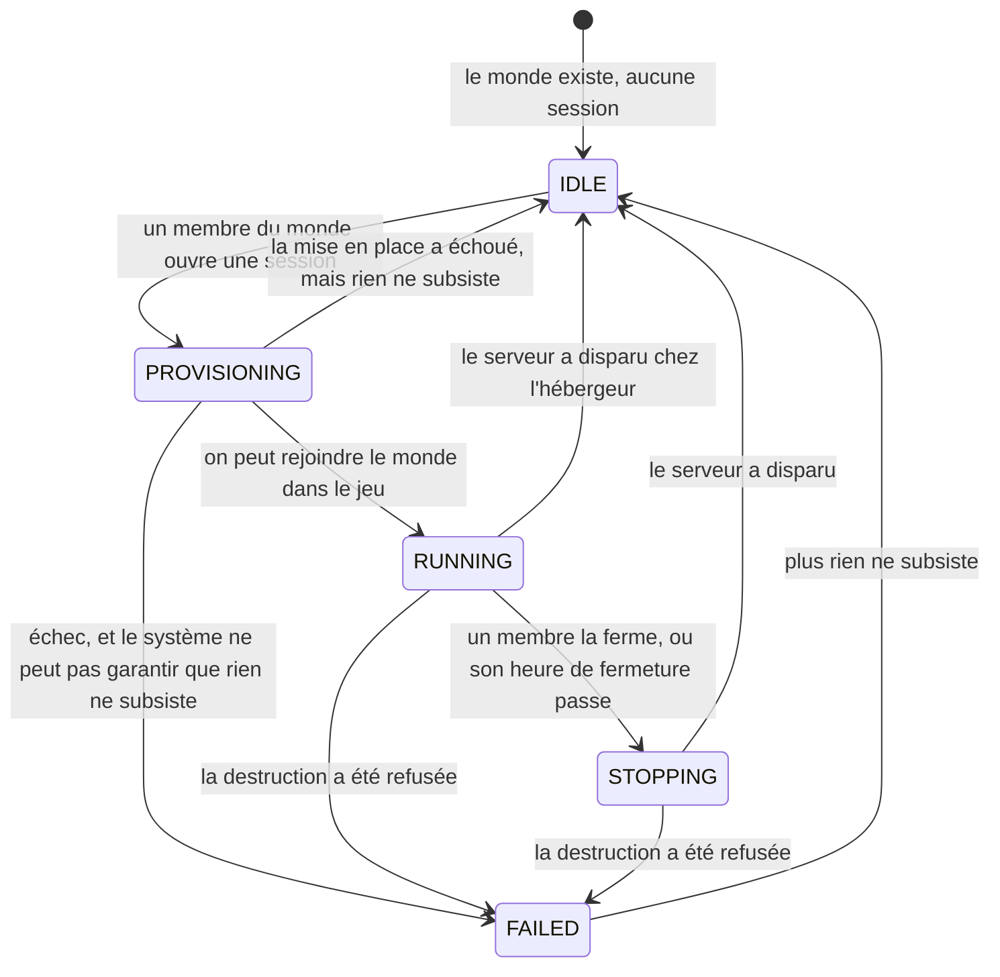

# session

## Boundary

Ce module porte ce qui naît et meurt avec une session : elle s'ouvre sur un
monde, porte une heure de fermeture, se prolonge, se ferme, et le serveur
qu'elle a fait naître disparaît avec elle.

Il couvre l'ouverture, la prolongation et la fermeture d'une session, ce qu'il
faut pour rejoindre son serveur, les jeux que ce serveur fait tourner et ce
qu'il faut pour les lancer, ce que le système garantit quand une session
échoue, qui a le droit d'agir dessus, et ce qu'elle laisse voir.

Ce qui survit aux sessions n'est pas à lui : le monde et ce qui dure avec lui
(`monde`), les utilisateurs (`utilisateur`), ce qui se déclare une fois et reste
(`infrastructure`). Exception : ce qu'il faut pour qu'un jeu tourne est à lui.

La forme de l'interface appartient à `.impeccable/DIRECTION.md`.

## Ubiquitous language

| Métier | Code, et libellé s'il diffère | Ce que c'est |
|---|---|---|
| session | `Session` | une partie ouverte sur un monde, de son ouverture à la disparition de son serveur |
| serveur | `HostedServer` | ce qu'une session fait naître chez l'hébergeur, qui fait tourner le jeu et qu'on rejoint |
| heure de fermeture | `Deadline`, affiché `Closes at` | l'instant auquel une session se ferme |
| ouvrir une session | `opening` | la faire naître sur un monde |
| prolonger | `extend` | repousser l'heure de fermeture d'une session |
| fermer | `requestStop` | demander qu'une session se ferme avant son heure de fermeture |
| durée d'une session | `sessionDurationMs` | ce qui sépare l'ouverture d'une session de sa première heure de fermeture |
| pas de prolongation | `extensionStepMs` | ce dont une prolongation repousse l'heure de fermeture |
| fenêtre de prolongation | `extensionWindowMs` | le temps, avant l'heure de fermeture, pendant lequel prolonger est possible |
| gabarit | `InstanceSize` | le calibre du serveur |
| jeu | `Game` | un jeu que Beacon sait faire tourner, désigné par son identité |
| dépôt d'un jeu | `game-depot` | ce qui est mis à disposition pour qu'un jeu tourne |
| mettre à disposition | `push` | déposer ce qu'un jeu exige pour tourner |
| rafraîchir | `update` | remplacer le dépôt d'un jeu par sa version courante |
| l'ouvrant | `startedBy` | le membre qui a ouvert la session |
| heure d'ouverture | `startedAt`, affiché `Opened at` | l'instant où la session a été ouverte |
| point de jonction | `JoinInfo`, affiché `How to join` | ce qu'un membre copie pour rejoindre le serveur |
| fourchette de disponibilité | `readyWindow`, affiché `Ready between` | les deux heures entre lesquelles le serveur devrait devenir joignable |
| réponse de l'hébergeur | `lastError`, affiché `What the host said` | ce que l'hébergeur a répondu au dernier échec |
| hors service | `IDLE`, affiché `Out of service` | le monde n'a aucun serveur |
| en préparation | `PROVISIONING`, affiché `Preparing` | le serveur se met en place |
| en service | `RUNNING`, affiché `In service` | un membre peut rejoindre le monde dans le jeu |
| en fermeture | `STOPPING`, affiché `Closing` | la session est fermée, et son serveur n'a pas encore disparu |
| bloqué | `FAILED`, affiché `Not cleared` | le système n'a pas pu garantir que rien ne subsiste de la session |

### Ce que ce contexte emprunte, et ce qu'il en connaît

| Terme | Ce que ce contexte en connaît, et rien de plus |
|---|---|
| `World` (`docs/specs/monde.md`) | ce sur quoi une session s'ouvre : une identité, un jeu, un nom et des membres |
| `Save` (`docs/specs/monde.md`) | l'état d'un monde à un instant. Une session en consomme un à son ouverture et en produit à sa fermeture |
| membre, `Player` (`docs/specs/monde.md`) | un utilisateur qui appartient à un monde |
| `User` (`docs/specs/utilisateur.md`) | une personne qui s'est connectée à Beacon, administrateur ou non |

## Opening a session

Le jeu d'une session est celui de son monde, et ne se choisit pas.

Une session a une heure de fermeture dès son ouverture : quatre heures plus
tard.

Un monde ne fait jamais tourner deux sessions à la fois.

Un membre qui ouvre une session sur un monde qui en a déjà une apprend qu'elle
existe.

Le nombre de mondes qui tournent en même temps n'a aucun plafond.

Une session ouvre le monde dans l'état où la précédente l'a laissé, quelle
qu'ait été la cause de sa fermeture.

Chaque ouverture met un nouveau serveur en place.

Pendant la mise en place, l'écran annonce une fourchette d'heures de
disponibilité, jamais une heure unique ni une durée.

Une ouverture qui ne nomme aucun gabarit prend le gabarit en vigueur.

## Joining

Le point de jonction prend la forme que lui donne le jeu, et le système le
transporte sans l'interpréter.

L'écran rend le point de jonction lisible et copiable.

Tout jeu offre au membre un moyen principal de rejoindre et un recours. Quand le
premier fait défaut, le second suffit.

Une partie du point de jonction qui n'a pas pu être publiée manque à l'écran, et
la session continue.

## Extending a session

Une prolongation repousse l'heure de fermeture d'une heure, et rien d'autre ne
la déplace.

Une prolongation n'est possible que dans les trente minutes qui précèdent
l'heure de fermeture.

Hors de cette fenêtre, l'écran dit pourquoi prolonger est impossible.

L'écran annonce à l'avance l'instant où la fenêtre de prolongation s'ouvre.

Le nombre de prolongations d'une session n'a aucun plafond.

Deux membres qui prolongent au même moment repoussent l'heure de fermeture d'une
heure, pas de deux.

## Closing a session

Rien de ce qu'une session a fait naître ne lui survit.

Aucun écran ne présente un serveur en pause.

## The life of a session

Seul le système fait passer une session en service, hors service ou bloquée, sur
ce qu'il constate.

Quand l'hébergeur refuse une mise en place, l'écran dit ce qu'il a répondu, et
une session peut s'ouvrir aussitôt.

Une session bloquée redevient hors service dès que plus rien ne subsiste.

Aucun état d'une session n'est sans issue.

## What the system guarantees when things go wrong

Ces garanties tiennent sans que personne soit devant un écran.

| Garantie | Pas avant |
|---|---|
| Une session dont l'heure de fermeture est passée se ferme | 2 minutes après l'heure |
| Une mise en place qui n'aboutit pas est abandonnée, et le monde redevient ouvrable | 25 minutes |
| Une fermeture dont le serveur ne dit rien se termine quand même | 10 minutes |
| Une session dont l'état ne correspond plus à la réalité de l'hébergeur est remise d'équerre | — |
| Un nettoyage refusé est retenté jusqu'à aboutir | — |

Tout ce qui existe chez l'hébergeur et qu'aucune session en cours n'explique est
détruit.

## Running a game

Beacon lance chaque jeu tel qu'il est publié, et n'y ajoute que ce qu'il faut
pour le démarrer et le relier au reste du produit.

Rien de ce qu'un serveur de jeu reçoit ne lui permet d'agir au nom du compte qui
possède un jeu.

Un serveur de jeu ne peut rien toucher d'autre que les sauvegardes de son monde,
en écriture, et le dépôt des jeux, en lecture.

## Making a game available

Un serveur prend lui-même un jeu que chacun peut obtenir, et rien de ce jeu
n'est gardé entre deux sessions.

Un jeu que seul son propriétaire peut obtenir est mis à disposition une fois, et
chaque serveur le reprend de ce dépôt.

Le dépôt d'un jeu se rafraîchit quand le jeu change.

Un administrateur met un jeu à disposition et le rafraîchit. Aucun autre
utilisateur ne le peut.

Aucun geste sur un jeu ne passe par l'interface que les utilisateurs consultent.

## Who may do what

| Qui | Ce qu'il peut faire sur une session |
|---|---|
| un membre du monde | ouvrir, prolonger, fermer, tout voir de la session en cours |
| un administrateur | la même chose, plus le gabarit |
| un utilisateur qui n'est pas membre du monde | rien, et il ne sait pas que cette session existe |

L'ouvrant n'a aucun droit de plus que les autres membres du monde.

La durée d'une session, le pas et la fenêtre de prolongation, et le gabarit sont
les mêmes pour tous les mondes. Seul un administrateur les change.

Personne n'ouvre une session au nom d'un autre.

Qui a ouvert, prolongé ou fermé une session reste su.

## Changelog

| batch | date | change |
|---|---|---|
