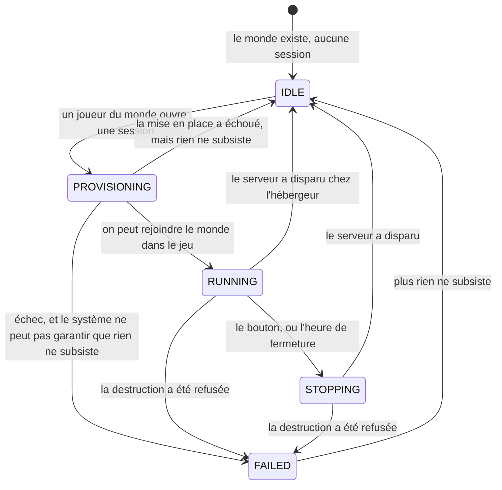

# session

## Boundary

Ce module porte **ce qui naît et meurt avec une partie** : une session s'ouvre
sur un monde, porte une heure de fermeture, se prolonge, s'arrête, et le serveur
qu'elle a fait naître disparaît avec elle.

Il couvre l'ouverture, la prolongation et la fermeture d'une session, ce qu'il
faut pour rejoindre le serveur qu'elle fait tourner, ce que le système garantit
quand elle échoue, qui a le droit d'agir dessus, et ce qu'elle laisse voir aux
autres.

**Ce qui survit aux sessions n'est pas à lui** : le monde et tout ce qui dure
avec lui, les personnes autorisées, ce qui se déclare une fois et reste.

La forme de l'interface appartient à `.impeccable/DIRECTION.md`. Ce qu'un écran
de session doit **dire** est ci-dessous, dans la section que ça concerne.

## Ubiquitous language

Les noms de code sont en anglais alors que la langue métier est le français :
l'expert du domaine lit lui-même le code, donc il n'y a pas de fossé de
traduction à combler.

**Ce tableau nomme les concepts du domaine, et rien d'autre.** Un libellé de
bouton, un titre d'écran ou un message ne sont pas des concepts : ils habillent
un concept déjà nommé ici, ou ils n'en portent aucun. La colonne du milieu ne se
remplit que là où le mot affiché **diffère réellement** du nom de code.

Un concept qu'on peine à nommer dans les deux colonnes est le signe que le
modèle est faux, pas que la traduction est difficile.

| Métier | Code, et libellé s'il diffère | Ce que c'est |
|---|---|---|
| session | `Session` | une partie ouverte, de son démarrage à la disparition de son serveur |
| heure de fermeture | `Deadline`, affiché `Closes at` | l'instant auquel le serveur s'arrête |
| ouvrir une session | `opening` | la faire naître sur un monde, son heure de fermeture déjà fixée |
| prolonger | `extend` | repousser l'heure de fermeture d'un pas |
| fermer | `requestStop` | demander l'arrêt. La disparition du serveur, elle, se constate |
| durée d'une session | `sessionDurationMs` | quatre heures : ce qui sépare l'ouverture de la première heure de fermeture |
| pas de prolongation | `extensionStepMs` | une heure : ce qu'une prolongation ajoute |
| fenêtre de prolongation | `extensionWindowMs` | les trente dernières minutes, seul moment où prolonger est possible |
| gabarit | `InstanceSize` | le calibre du serveur |
| l'ouvrant | `startedBy` | le joueur qui a ouvert la session |
| heure d'ouverture | `startedAt`, affiché `Opened at` | l'instant où la session a été ouverte |
| point de jonction | `JoinInfo`, affiché `How to join` | ce que le joueur copie pour rejoindre |
| fourchette de disponibilité | `readyWindow`, affiché `Ready between` | les deux heures entre lesquelles le serveur devrait être joignable |
| réponse de l'hébergeur | `lastError`, affiché `What the host said` | ce que l'hébergeur a répondu au dernier échec |
| hors service | `IDLE`, affiché `Out of service` | aucun serveur ; on peut ouvrir une session |
| en préparation | `PROVISIONING`, affiché `Preparing` | le serveur se met en place |
| en service | `RUNNING`, affiché `In service` | on peut rejoindre le monde dans le jeu |
| en fermeture | `STOPPING`, affiché `Closing` | la session est finie, le serveur n'a pas encore disparu |
| bloqué | `FAILED`, affiché `Not cleared` | le système n'a pas pu garantir que tout a disparu |

### Ce que ce contexte emprunte, et ce qu'il en connaît

D'autres modules portent des objets qu'une session manipule. **Ce contexte en a
son propre modèle, réduit à ce dont il se sert** — et c'est délibéré : si leur
définition bouge ailleurs, c'est ici qu'on verra si elle bouge aussi pour une
session, au lieu de l'apprendre par une panne.

| Terme | Ce que ce contexte en connaît, et rien de plus |
|---|---|
| `World` (`docs/specs/monde.md`) | ce sur quoi une session s'ouvre : une identité qui ne change jamais, un jeu, un nom affiché, et l'ensemble de ses joueurs. Une session ignore comment un monde naît, comment on y entre et ce qu'il devient quand personne n'y joue |
| `Game` | l'identité du jeu d'un monde, figée. Une session ne sait ni comment on se connecte à ce jeu, ni comment il se sauvegarde, ni ce qu'il coûte à mettre en place |
| `Save` (`docs/specs/monde.md`) | l'état d'un monde à un instant. Une session en consomme un à son ouverture et en produit un à sa fermeture ; elle ne sait ni où il est rangé, ni combien il en existe, ni lequel est le bon |
| `Player` (`docs/specs/monde.md`) | un membre qui joue dans ce monde. C'est la seule chose qui donne le droit d'agir sur une session |
| `Member` (`docs/specs/membre.md`) | une personne autorisée. Une session ne distingue que membre, administrateur, et ni l'un ni l'autre |

## Opening a session

**N'importe quel joueur du monde ouvre une session dessus.** Aucune action de jeu
ne dépend de la disponibilité d'un administrateur.

**Le jeu ne se choisit pas** : c'est celui du monde. On choisit un monde, le jeu
vient avec.

**Une session a, à tout instant, une heure de fermeture connue**, et elle en a
une dès son ouverture : quatre heures plus tard. C'est le mécanisme central du
produit — ce n'est pas une limite de durée, c'est l'obligation qu'un humain
éveillé reclique pour que la session continue.

**À aucun instant un monde ne fait tourner deux sessions.** Deux joueurs qui
ouvrent au même moment ouvrent une seule session, et le second apprend que la
première existe. Il n'existe pas de fenêtre, même brève, pendant laquelle les
deux coexistent.

**Plusieurs mondes tournent en même temps, et rien ne les plafonne.** L'heure
de fermeture est le seul garde-fou : trois mondes ouverts en même temps font
trois sessions facturées, et chacune s'éteint seule.

**Une session ouvre le monde dans l'état où la précédente l'a laissé**, quelle
qu'ait été la cause de sa fermeture. C'est la seule donnée irremplaçable du
système.

**Le serveur se met en place à chaque ouverture, et l'attente est
incompressible.** Sa durée varie d'une session à l'autre. L'écran annonce donc
**une fourchette d'heures de disponibilité, jamais une heure unique ni une durée
promise.**

**Le gabarit est choisi par l'administrateur, et il est le même pour tous les
mondes.** Une ouverture qui n'en nomme aucun prend le gabarit en vigueur.

## Joining

**Ce qu'il faut pour rejoindre dépend du jeu**, et le système ne l'interprète
jamais : il le transporte, et l'écran le rend lisible et copiable. Un jeu de plus
apporte sa forme sans que rien ici ne change.

**Une session est *en service* quand un joueur peut rejoindre le monde dans le
jeu**, et rien d'autre ne donne cet état : ni la mise en place terminée, ni un
serveur qui répond.

**Un échec de publication n'interrompt jamais une session.** Ce qui n'a pas pu
être publié manque à l'écran ; la session continue avec ce qui reste.

## Extending a session

**L'heure de fermeture vaut quatre heures après l'ouverture, plus une heure par
prolongation.**

**Une prolongation n'est possible que dans les trente minutes qui précèdent
l'heure de fermeture courante.** En dehors de cette fenêtre, le bouton est fermé
et dit pourquoi, en clair. L'instant où la fenêtre s'ouvre est annoncé à
l'avance, pour qu'on sache quand revenir.

Une session ouverte à 20 h ferme donc à minuit ; entre 23 h 30 et minuit on peut
la porter à 1 h ; entre 0 h 30 et 1 h, à 2 h ; et ainsi de suite.

**Il n'y a aucun plafond**, et c'est le cœur du produit : le garde-fou n'a jamais
été une durée maximale mais l'obligation de recliquer. Un serveur oublié s'arrête
donc toujours dans l'heure, quel que soit le nombre de prolongations déjà
accordées.

**Prolonger est un acte collectif sur une ressource commune.** Deux joueurs qui
prolongent au même moment gagnent une heure, pas deux.

## Closing a session

**Une session se ferme à son heure.** Personne n'a besoin d'être là : le serveur
disparaît de lui-même. N'importe quel joueur du monde peut aussi la fermer avant.

**Une session terminée ne coûte plus rien.** Ce qu'elle a fait naître chez
l'hébergeur cesse d'être facturé, et il n'existe donc pas de « serveur en
pause » — ni dans le produit, ni à l'écran.

> [!NOTE]
> **Le système ne promet pas que tout est sauvegardé.** La sauvegarde suit une
> cadence propre au jeu, et rien ne permet toujours de la provoquer : selon le
> jeu, les dernières minutes d'une session peuvent manquer. L'interface ne doit
> jamais affirmer le contraire.

## The life of a session

**Un joueur demande, le système constate.** Ouvrir et fermer sont des intentions,
qu'un joueur exprime. *En service*, *hors service* et *bloqué* sont des constats
sur le monde réel — un serveur joignable, un serveur disparu, un nettoyage
incertain — et personne ne peut les déclarer à la place du système.

**Un échec ordinaire ne bloque rien.** Une mise en place refusée par l'hébergeur
est un incident banal : l'écran dit ce que l'hébergeur a répondu, et le bouton
redevient immédiatement cliquable.

**« Bloqué » est un état d'attente, jamais un mur.** Il ne signifie qu'une chose :
le système n'a pas pu garantir que tout a disparu. Il y revient, et en sort dès
que plus rien ne subsiste.

**Aucun état d'une session n'est sans issue.** Sans cette garantie, un refus de
l'hébergeur un vendredi soir laisserait le produit mort jusqu'à une
intervention d'administrateur — exactement la dépendance que le produit refuse
avec « personne n'est jamais bloqué ».

## What the system guarantees when things go wrong

**Aucune de ces garanties n'attend qui que ce soit.** Elles tiennent sans que
personne soit devant l'écran, et c'est ce qui permet à une session de naître avec
son heure de fermeture : sans elles, cette heure ne serait qu'une intention.

| Garantie | Pas avant | Au plus tard |
|---|---|---|
| Une session dont l'heure de fermeture est passée se ferme | 2 minutes après l'heure | — |
| Une mise en place qui n'aboutit pas est abandonnée, et le monde redevient ouvrable | 25 minutes | — |
| Une fermeture dont le serveur ne dit rien se termine quand même | 10 minutes | — |
| Une session dont l'état ne correspond plus à la réalité de l'hébergeur est remise d'équerre | — | — |
| Un nettoyage refusé est retenté jusqu'à aboutir | — | — |

**Les deux colonnes ne disent pas la même chose.** *Pas avant* protège ce qui va bien : une mise en place lente n'est pas
abandonnée comme si elle avait échoué, et une session ne meurt pas à la seconde
où son heure sonne. *Au plus tard* est ce qu'un joueur ou une facture
constatent. Une garantie n'a de valeur pour eux que par sa seconde colonne.

**Aucun plafond n'a jamais été décidé, et le tiret est un aveu.** En inventer un
reviendrait à promettre ce que le code fait plutôt que ce que le produit veut.

**Rien de ce qu'une session a fait naître ne lui survit** — **y compris ce dont
le système a perdu la trace**, et y compris ce dont il ne sait plus dire à quelle
session il appartenait. Tout ce qui existe chez l'hébergeur et qu'aucune session
en cours n'explique est détruit. Il n'y a pas de ressource en sursis : le compte
d'hébergement ne sert qu'à ce produit, et ce qui y traîne est une facture que
personne n'a demandée. **Au bout de combien de temps elle coûte trop cher n'est
pas encore décidé**, et c'est une question d'argent, pas de surveillance.

## Who may do what

| Qui | Ce qu'il peut faire sur une session |
|---|---|
| un joueur du monde | ouvrir, prolonger, fermer, tout voir de la session en cours |
| un administrateur | la même chose, plus le gabarit |
| un membre qui n'est pas joueur du monde | rien, et il ne sait pas que cette session existe |
| un visiteur | rien du tout |

**Aucun joueur n'a d'autorité sur un autre.** Chacun peut fermer la session qu'un
autre a ouverte : c'est délibéré, la ressource est commune à ceux qui la
partagent.

**La durée d'une session, le pas et la fenêtre de prolongation, et le gabarit
sont les mêmes pour tous les mondes.** Seul un administrateur les change.

**Aucun geste sur une session n'est anonyme.** Personne n'ouvre une session au
nom d'un autre, et qui a fermé la session de quelqu'un reste su. C'est la
contrepartie de « chacun peut fermer la session d'un autre ».

## Changelog

| batch | date | change |
|---|---|---|
| out-of-batch | 2026-09-22 | le glossaire nomme les concepts du domaine, et un seul mot désigne chacun d'eux |
