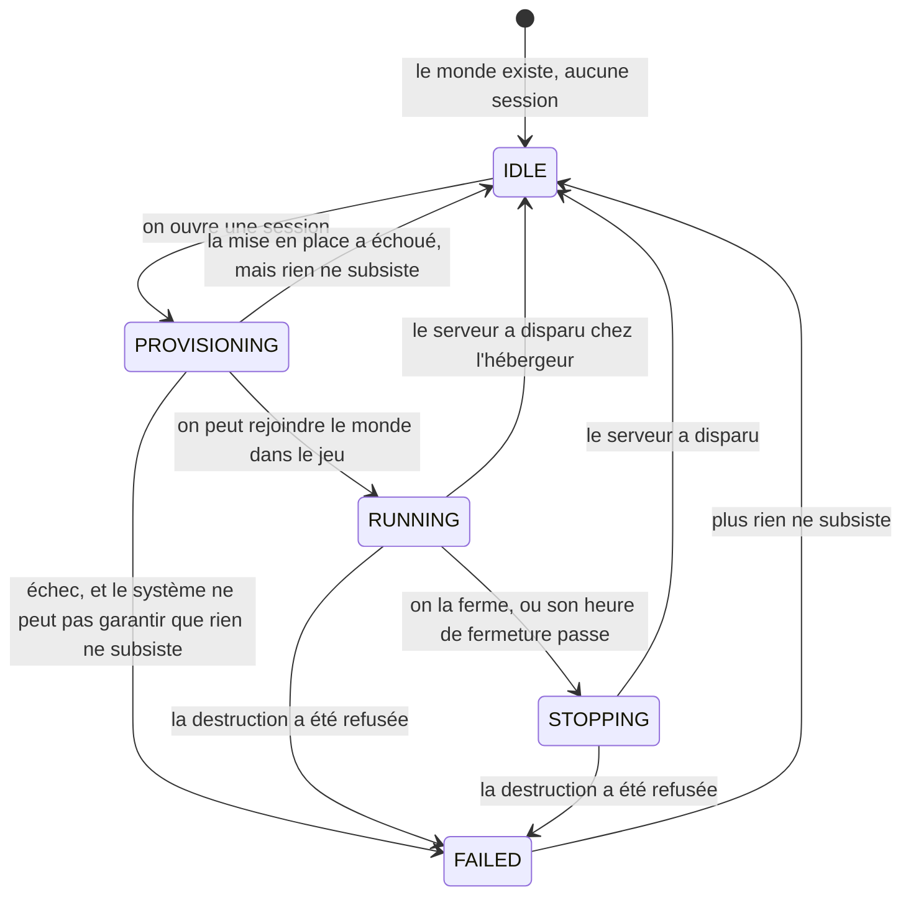

# session

## Boundary

Ce module couvre la session et le jeu qu'elle fait tourner : une session
s'ouvre sur un monde, se rejoint, se prolonge et se ferme.

Il ne couvre ni le monde et ses sauvegardes (`monde`), ni les utilisateurs
(`utilisateur`), ni ce qui se déclare une fois et reste (`infrastructure`).

La forme de l'interface appartient à `.impeccable/DIRECTION.md`.

## Ubiquitous language

| Métier | Code, et libellé s'il diffère | Ce que c'est |
|---|---|---|
| session | `Session` | une partie ouverte sur un monde, en cours de son ouverture à la disparition de son serveur |
| serveur de jeu | `HostedServer` | ce qu'une session fait naître chez l'hébergeur, qui fait tourner le jeu et qu'on rejoint |
| heure de fermeture | `Deadline`, affiché `Closes at` | l'instant auquel une session se ferme |
| ouvrir une session | `opening` | la faire naître sur un monde |
| prolonger | `extend` | repousser l'heure de fermeture d'une session |
| fermer | `requestStop` | demander qu'une session se ferme avant son heure de fermeture |
| durée d'une session | `sessionDurationMs` | ce qui sépare l'ouverture d'une session de sa première heure de fermeture |
| pas de prolongation | `extensionStepMs` | ce dont une prolongation repousse l'heure de fermeture |
| fenêtre de prolongation | `extensionWindowMs` | le temps, avant l'heure de fermeture, pendant lequel prolonger est possible |
| gabarit | `InstanceSize` | le calibre du serveur de jeu |
| réglages | `SessionSettings` | la durée d'une session, le pas et la fenêtre de prolongation, et le gabarit |
| jeu | `Game` | un jeu que Beacon sait faire tourner, désigné par son identité |
| point de jonction | `JoinInfo`, affiché `How to join` | les moyens de rejoindre le serveur d'une session |
| fourchette de disponibilité | `readyWindow`, affiché `Ready between` | les deux heures entre lesquelles le serveur devrait devenir joignable |
| réponse de l'hébergeur | `lastError`, affiché `What the host said` | ce que l'hébergeur a répondu au dernier échec |
| hors service | `IDLE`, affiché `Out of service` | le monde n'a aucun serveur de jeu |
| en préparation | `PROVISIONING`, affiché `Preparing` | le serveur se met en place |
| en service | `RUNNING`, affiché `In service` | on peut rejoindre le monde dans le jeu |
| en fermeture | `STOPPING`, affiché `Closing` | la session a commencé à se fermer, et son serveur n'a pas encore disparu |
| bloqué | `FAILED`, affiché `Not cleared` | le système n'a pas pu garantir que rien ne subsiste de la session |

### Ce que ce contexte emprunte, et ce qu'il en connaît

| Terme | Ce que ce contexte en connaît, et rien de plus |
|---|---|
| `World` (`docs/specs/monde.md`) | ce sur quoi une session s'ouvre : une identité, un jeu, un nom et des membres |
| `Save` (`docs/specs/monde.md`) | l'état d'un monde à un instant |
| dernière sauvegarde (`docs/specs/monde.md`) | la sauvegarde arrivée le plus récemment dans son monde, produite par une session ou déposée |
| membre, `Member` (`docs/specs/monde.md`) | un utilisateur qui appartient à un monde |
| admin en jeu (`docs/specs/monde.md`) | un utilisateur à qui le jeu d'un monde permet de commander la partie |
| utilisateur, `User` (`docs/specs/utilisateur.md`) | une personne qui s'est connectée à Beacon, administrateur ou non |
| administrateur (`docs/specs/utilisateur.md`) | un utilisateur qui a ce rôle dans Beacon, qu'il soit membre d'un monde ou non |

## Opening a session

Seuls les membres d'un monde et les administrateurs peuvent ouvrir une session
sur ce monde.

Le jeu d'une session est celui de son monde, et ne se choisit pas.

Une session a une heure de fermeture dès son ouverture : quatre heures plus
tard.

Un monde n'a jamais deux sessions en cours à la fois.

Qui ouvre une session sur un monde qui en a déjà une en cours apprend qu'elle
existe.

Le nombre de mondes qui tournent en même temps n'a aucun plafond.

Une session ouvre le monde sur sa dernière sauvegarde, quelle qu'ait été la
cause de la fermeture de la précédente.

Pendant la mise en place, l'écran annonce une fourchette de disponibilité,
jamais une heure unique ni une durée.

Quand l'hébergeur refuse une mise en place, l'écran dit ce qu'il a répondu.

Une mise en place qui n'aboutit pas est abandonnée.

La durée d'une session et le gabarit sont les mêmes pour tous les mondes, et
seul un administrateur les change.

## Seeing a session

Seuls les membres d'un monde et les administrateurs voient sa session en cours.

## Joining

Le point de jonction d'une session donne tous les moyens de rejoindre que son
jeu offre.

## Extending a session

Seuls les membres d'un monde et les administrateurs peuvent prolonger sa
session.

Une prolongation repousse l'heure de fermeture d'une heure.

Une prolongation n'est possible que dans les trente minutes qui précèdent
l'heure de fermeture.

Hors de cette fenêtre, l'écran dit pourquoi prolonger est impossible.

L'écran annonce à l'avance l'instant où la fenêtre de prolongation s'ouvre.

Le nombre de prolongations d'une session n'a aucun plafond.

Le pas et la fenêtre de prolongation sont les mêmes pour tous les mondes, et
seul un administrateur les change.

## Closing a session

Seuls les membres d'un monde et les administrateurs peuvent fermer sa session,
y compris celle qu'un autre a ouverte.

Une session dont l'heure de fermeture est passée se ferme sans que personne ait
à agir.

Une fermeture qui n'aboutit pas est forcée.

Aucun serveur de jeu ne coûte hors d'une session en cours.

## The life of a session

```mermaid
stateDiagram-v2
    [*] --> IDLE : le monde existe, aucune session
    IDLE --> PROVISIONING : on ouvre une session
    PROVISIONING --> RUNNING : on peut rejoindre le monde dans le jeu
    RUNNING --> STOPPING : on la ferme, ou son heure de fermeture passe
    STOPPING --> IDLE : le serveur a disparu
    PROVISIONING --> IDLE : la mise en place a échoué, mais rien ne subsiste
    RUNNING --> IDLE : le serveur a disparu chez l'hébergeur
    PROVISIONING --> FAILED : échec, et le système ne peut pas garantir que rien ne subsiste
    RUNNING --> FAILED : la destruction a été refusée
    STOPPING --> FAILED : la destruction a été refusée
    FAILED --> IDLE : plus rien ne subsiste
```

Seul le système fait passer une session en service, hors service ou bloquée, sur
ce qu'il constate.

Aucun état d'une session n'est sans issue.

Le système retente de détruire ce qui subsiste d'une session bloquée, jusqu'à
ce qu'il n'en reste rien.

## Running a game

Beacon fait tourner chaque jeu tel que son éditeur le publie.

Un serveur de jeu démarre avec les admins en jeu que son monde désigne.
