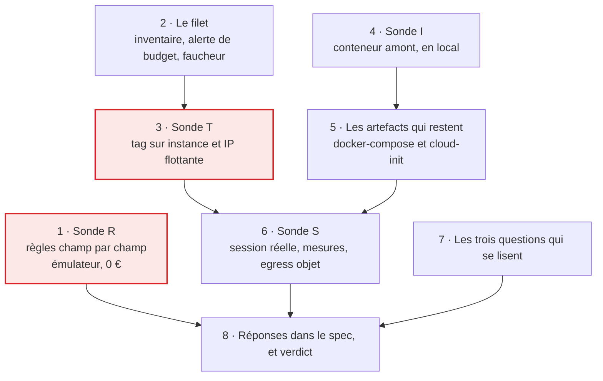

# Tranche 0 — Sonder

> **For agentic workers:** REQUIRED SUB-SKILL: Use superpowers:subagent-driven-development (recommended) or superpowers:executing-plans to implement this plan task-by-task. Steps use checkbox (`- [ ]`) syntax for tracking.

**But :** répondre aux neuf questions ouvertes du §12 du spec par la mesure et non
par la supposition, et livrer au passage un serveur Enshrouded jouable démarré à
la main.

**Approche :** une sonde n'est pas un système, c'est une suite d'expériences dont
seul le résultat écrit compte. Les deux questions qui peuvent déplacer
l'architecture passent en premier, la moins chère d'abord : la restriction champ
par champ des règles Firestore se tranche sur l'émulateur pour 0 €, le tag sur
l'IP flottante coûte une instance de cinq minutes. Rien qui crée une ressource
OVH n'est lancé avant qu'existent une alerte de budget et un faucheur manuel —
la règle du lotissement « le faucheur avant le semeur » vaut aussi à l'intérieur
de cette tranche, où aucun watchdog ne rattrapera l'oubli.

**Pile :** Node 22, TypeScript exécuté par `tsx`, Vitest, l'émulateur Firestore
via `firebase-tools`, `@firebase/rules-unit-testing`, Docker en local, et l'API
OVH v1 appelée en `fetch` signé. Aucun workspace Nx : il naît en tranche 1, avec
le premier code qui reste.

**Spec :** [`docs/superpowers/specs/2026-09-02-game-hosting-design.md`](../specs/2026-09-02-game-hosting-design.md) —
les questions sondées sont son §12. Le découpage en tranches est au
[lotissement](2026-09-02-lotissement.md).

## Contraintes globales

- **Aucune ressource OVH n'est créée, modifiée ou détruite par un agent.** Tout
  appel qui écrit chez OVH est écrit dans le plan, expliqué, et **lancé par un
  humain**. Un agent peut lancer les appels en lecture seule (`GET`).
- **Aucune écriture dans le Firestore de production, aucun `firebase deploy`.**
  L'émulateur est la cible, sur le projet fictif `demo-beacon` : le préfixe
  `demo-` garantit que le SDK ne joint jamais un vrai projet.
- **Toute ressource OVH créée pendant cette tranche porte le préfixe de nom
  `beacon-probe-`.** C'est ce qui rend le faucheur de la tâche 2 fiable avant que
  le mécanisme de tag soit connu.
- **Les images sont référencées par leur digest `sha256:`, jamais par un tag
  mobile** (§10 du spec). Cela vaut dès la tranche 0 pour l'image amont.
- **Les identifiants OVH ne quittent pas la machine du développeur** : ils vivent
  dans `probe/.env`, déjà couvert par le `.gitignore` du dépôt (`.env`).
- Code, noms de fichiers et commentaires en **anglais** ; documentation, rapport
  de sonde et messages de commit en **français**.
- Commits en Conventional Commits, description française à l'impératif, portée
  parmi `probe`, `deploy`, `spec`, `plan`.
- Budget attendu de la tranche entière : **moins de 0,20 €** — environ 2 h
  d'instance `b3-8` à ~0,047 €/h, plus quelques centimes de stockage objet.
- **Toute commande de ce plan se lance avec l'outil Bash**, c'est-à-dire Git Bash
  sur cette machine. Rien ne s'exécute par un `npx -e` à guillemets imbriqués :
  chaque script a son entrée dans `probe/package.json` et se lance par
  `npm --prefix probe run <script>`, seule forme qui survit à la fois au shell
  POSIX et à PowerShell.

## L'ordre et ce qui le produit



Les deux cases encadrées de rouge sont celles dont une réponse négative corrige
le spec avant que le plan de la tranche 1 s'écrive. Les tâches 1, 4 et 7 ne
touchent rien de facturé et peuvent tourner pendant qu'une autre attend.

## Ce que la tranche 0 ne construit pas

Une sonde bien faite ressemble à un début de système, et c'est le piège. Ce qui
suit est hors périmètre, non par oubli mais par décision :

- **Pas de workspace Nx.** Il naît en tranche 1, avec le premier code qui reste.
  `probe/` est un dossier Node autonome, et le `nx-generate` obligatoire du
  `CLAUDE.md` s'applique au monorepo, qui n'existe pas encore.
- **Pas de `libs/ovh-compute`.** Les scripts de `probe/ovh/` connaissent les
  routes de l'API en clair, chacun pour son compte. En faire un adapter
  aujourd'hui serait le construire contre les hypothèses que la sonde est
  justement chargée de vérifier — l'adapter s'écrit en tranche 1, sur les
  réponses.
- **Pas de `firestore.rules` de production.** Les règles de la tâche 1 sont un
  banc d'essai du mécanisme, pas la couche d'autorisation : celle-là s'écrit en
  tranche 4, avec `firebase-security-rules-auditor`, et elle est bien plus large.
- **Pas de compagnon, pas de `rclone`, pas de restauration de save.** C'est la
  tranche 3, et son gate ferme : aucun monde auquel on tient ne migre avant.
- **Aucun déploiement, d'aucune sorte.** Le gate de la tranche 4 tient : rien
  n'est exposé publiquement avant elle.

Une tâche de ce plan qui semble en réclamer une est une tâche mal lue.

---

### Task 1: Sonde R — la restriction champ par champ des règles Firestore

Le spec fait reposer toute la propriété des champs de `server/current` sur
`request.resource.data.diff(resource.data).affectedKeys().hasOnly([...])`. Si ce
mécanisme ne restreint pas réellement champ par champ, le document se scinde en
deux — l'un écrit par le navigateur, l'autre par les Functions — et le §5 change.
La question se tranche sur l'émulateur, sans un centime et sans OVH : elle passe
donc en premier.

Ces règles ne sont pas les règles du produit. Ce sont les règles minimales qui
mettent le mécanisme sous tension ; les vraies s'écrivent en tranche 4.

**Fichiers :**
- Créer : `probe/package.json`
- Créer : `probe/firebase.json`
- Créer : `probe/rules/firestore.rules`
- Test : `probe/rules/field-ownership.spec.ts`
- Créer : `probe/RESULTS.md`

**Interfaces :**
- Consomme : rien.
- Produit : `probe/package.json`, dont la tâche 2 étend les dépendances et les
  scripts ; `probe/RESULTS.md`, le rapport que toutes les tâches suivantes
  complètent et que la tâche 8 recopie dans le spec.

- [ ] **Step 1: Créer le socle du dossier de sonde**

Prérequis : Node ≥ 22 et un JRE installé — l'émulateur Firestore tourne sur la
JVM. Vérifier avec `node --version` et `java -version` avant de continuer.

`probe/package.json` :

```json
{
  "name": "beacon-probe",
  "private": true,
  "type": "module",
  "scripts": {
    "probe:rules": "firebase emulators:exec --project demo-beacon \"vitest run rules\""
  },
  "devDependencies": {
    "@firebase/rules-unit-testing": "^4.0.1",
    "firebase": "^11.0.0",
    "firebase-tools": "^13.29.1",
    "typescript": "^5.7.2",
    "vitest": "^2.1.8"
  }
}
```

`probe/firebase.json` :

```json
{
  "firestore": {
    "rules": "rules/firestore.rules"
  },
  "emulators": {
    "firestore": { "port": 8080 },
    "ui": { "enabled": false },
    "singleProjectMode": true
  }
}
```

Puis `npm install --prefix probe`.

- [ ] **Step 2: Écrire le test qui met le mécanisme sous tension**

`probe/rules/field-ownership.spec.ts` :

```ts
import { readFileSync } from 'node:fs'
import { fileURLToPath } from 'node:url'
import {
  assertFails,
  assertSucceeds,
  initializeTestEnvironment,
  type RulesTestEnvironment,
} from '@firebase/rules-unit-testing'
import { deleteField, doc, setDoc, updateDoc } from 'firebase/firestore'
import { afterAll, beforeAll, beforeEach, describe, it } from 'vitest'

const RULES_PATH = fileURLToPath(new URL('./firestore.rules', import.meta.url))

const MEMBER_UID = 'alice'
const STRANGER_UID = 'mallory'

// The two halves of server/current, as §5 of the spec splits them.
const REQUESTED_FIELDS = {
  state: 'IDLE',
  sessionId: '',
  startedBy: '',
  startedAt: null,
  deadline: null,
}

const RESERVED_FIELDS = {
  instanceId: 'i-seed',
  ipId: 'f-seed',
  ip: '203.0.113.7',
  provisionClaimedAt: null,
  lastError: '',
}

let env: RulesTestEnvironment

beforeAll(async () => {
  env = await initializeTestEnvironment({
    projectId: 'demo-beacon',
    firestore: {
      rules: readFileSync(RULES_PATH, 'utf8'),
      host: '127.0.0.1',
      port: 8080,
    },
  })
})

afterAll(async () => {
  await env.cleanup()
})

beforeEach(async () => {
  await env.clearFirestore()
  await env.withSecurityRulesDisabled(async (context) => {
    const db = context.firestore()
    await setDoc(doc(db, 'members', MEMBER_UID), { email: 'alice@example.com', role: 'player' })
    await setDoc(doc(db, 'server', 'current'), { ...REQUESTED_FIELDS, ...RESERVED_FIELDS })
  })
})

const asMember = () => env.authenticatedContext(MEMBER_UID).firestore()
const asStranger = () => env.authenticatedContext(STRANGER_UID).firestore()

describe('field ownership on server/current', () => {
  it('lets a member write a requested field', async () => {
    const db = asMember()
    await assertSucceeds(updateDoc(doc(db, 'server', 'current'), { deadline: 'T+4h' }))
  })

  it('rejects a member writing a reserved field alone', async () => {
    const db = asMember()
    await assertFails(updateDoc(doc(db, 'server', 'current'), { ip: '198.51.100.4' }))
  })

  // The crux: one illegitimate field must sink an otherwise legitimate write.
  it('rejects a mixed write as a whole', async () => {
    const db = asMember()
    await assertFails(
      updateDoc(doc(db, 'server', 'current'), { deadline: 'T+5h', ip: '198.51.100.4' }),
    )
  })

  it('rejects a member deleting a reserved field', async () => {
    const db = asMember()
    await assertFails(updateDoc(doc(db, 'server', 'current'), { ip: deleteField() }))
  })

  it('rejects a member asserting a state only a Function can constate', async () => {
    const db = asMember()
    await assertFails(updateDoc(doc(db, 'server', 'current'), { state: 'RUNNING' }))
  })

  it('rejects a non-member entirely', async () => {
    const db = asStranger()
    await assertFails(updateDoc(doc(db, 'server', 'current'), { deadline: 'T+4h' }))
  })

  it('rejects a client creating the document', async () => {
    await env.clearFirestore()
    await env.withSecurityRulesDisabled(async (context) => {
      await setDoc(doc(context.firestore(), 'members', MEMBER_UID), {
        email: 'alice@example.com',
        role: 'player',
      })
    })
    const db = asMember()
    await assertFails(
      setDoc(doc(db, 'server', 'current'), { ...REQUESTED_FIELDS, ...RESERVED_FIELDS }),
    )
  })

  // Observation, not a requirement: diff() reports changed keys, so rewriting a
  // reserved field with its current value may not register as a change at all.
  // Whatever this does, it goes in RESULTS.md — the rules of tranche 4 must know.
  it('records what an identical rewrite of a reserved field does', async () => {
    const db = asMember()
    await assertSucceeds(updateDoc(doc(db, 'server', 'current'), { ip: RESERVED_FIELDS.ip }))
  })
})
```

- [ ] **Step 3: Lancer le test contre des règles qui refusent tout, et le voir échouer**

`probe/rules/firestore.rules`, première version — délibérément fermée, pour
vérifier que le harnais teste bien quelque chose :

```
rules_version = '2';

service cloud.firestore {
  match /databases/{database}/documents {
    match /{document=**} {
      allow read, write: if false;
    }
  }
}
```

Run : `npm --prefix probe run probe:rules`
Attendu : les tests d'écriture légitime échouent (`assertSucceeds` sur un refus),
les tests de refus passent. Le harnais parle à l'émulateur.

- [ ] **Step 4: Écrire les règles minimales qui portent le mécanisme**

`probe/rules/firestore.rules` :

```
rules_version = '2';

service cloud.firestore {
  match /databases/{database}/documents {

    function isMember() {
      return request.auth != null
        && exists(/databases/$(database)/documents/members/$(request.auth.uid));
    }

    function touchesOnlyRequestedFields() {
      return request.resource.data.diff(resource.data).affectedKeys()
        .hasOnly(['state', 'sessionId', 'startedBy', 'startedAt', 'deadline']);
    }

    function assertsNoServerOnlyState() {
      return !('state' in request.resource.data.diff(resource.data).affectedKeys())
        || request.resource.data.state in ['PROVISIONING', 'STOPPING'];
    }

    match /server/current {
      allow read: if isMember();
      allow create, delete: if false;
      allow update: if isMember() && touchesOnlyRequestedFields() && assertsNoServerOnlyState();
    }

    match /members/{uid} {
      allow read: if isMember();
      allow write: if false;
    }
  }
}
```

- [ ] **Step 5: Lancer le test et lire ce qu'il dit**

Run : `npm --prefix probe run probe:rules`
Attendu : les sept premiers cas passent. Le huitième — la réécriture à
l'identique — passe ou échoue, et c'est l'observation.

Si `hasOnly` ne restreint pas, l'échec est spectaculaire : le cas « écriture
mixte » passe alors qu'il devrait échouer. **C'est ce cas-là qui décide** si
`server/current` reste un seul document.

- [ ] **Step 6: Consigner le verdict**

Créer `probe/RESULTS.md`. C'est le rapport de la tranche entière ; chaque tâche y
ajoute sa section, et la tâche 8 les recopie dans le §12 du spec.

```markdown
# Rapport de sonde — tranche 0

Chaque section répond à une question du §12 du spec. Une réponse sans la
commande ou l'observation qui la fonde n'est pas une réponse.

## R · Restriction champ par champ dans les règles Firestore

Question du §12 : `diff(resource.data).affectedKeys().hasOnly([...])`
restreint-il réellement champ par champ ? Sinon, `server/current` se scinde en
deux documents.

Commande : `npm --prefix probe run probe:rules`

| Cas | Attendu | Observé |
|---|---|---|
| écriture d'un champ demandé | accepté | |
| écriture d'un champ réservé seul | refusé | |
| écriture mixte demandé + réservé | refusé | |
| suppression d'un champ réservé | refusé | |
| `state: RUNNING` depuis le navigateur | refusé | |
| écriture par un non-membre | refusé | |
| création du document par un client | refusé | |
| réécriture d'un champ réservé à l'identique | inconnu — c'est l'observation | |

**Verdict :**

**Conséquence pour le spec :**
```

- [ ] **Step 7: Commit**

```bash
git add probe/package.json probe/package-lock.json probe/firebase.json probe/rules probe/RESULTS.md
git commit -m "test(probe): mesure la restriction champ par champ des regles Firestore"
```

---

### Task 2: Le filet — inventaire, alerte de budget, faucheur manuel

Aucun watchdog n'existe. Ce qui est créé dans les tâches suivantes n'est détruit
que si quelqu'un le détruit, et une instance oubliée un vendredi soir coûte
~3,40 € le temps qu'on s'en aperçoive. Le faucheur passe donc avant le semeur, à
l'échelle de cette tranche comme à celle du projet.

Cette tâche ne crée rien chez OVH. Elle lit, et elle se dote du moyen de
détruire.

**Fichiers :**
- Modifier : `probe/package.json` — dépendances et scripts
- Créer : `probe/.env.example`
- Créer : `probe/ovh/client.ts`
- Créer : `probe/ovh/me.ts`
- Créer : `probe/ovh/inventory.ts`
- Créer : `probe/ovh/reap.ts`
- Test : `probe/ovh/client.spec.ts`
- Modifier : `probe/RESULTS.md`

**Interfaces :**
- Consomme : `probe/package.json` de la tâche 1.
- Produit :
  - `signaturePayload(appSecret, consumerKey, method, url, body, timestamp): string`
  - `ovhFetch<T>(path: string, init?: { method?: string; body?: unknown }): Promise<T>`
  - `ovhConfig(): { endpoint: string; appKey: string; appSecret: string; consumerKey: string; serviceName: string; region: string }`
  - `runScript(main: () => Promise<void>): void` — le pied de page commun à tous
    les scripts de sonde
  - `npm --prefix probe run ovh:inventory` et `npm --prefix probe run ovh:reap`,
    utilisés par les tâches 3 et 6.

- [ ] **Step 1: Obtenir des identifiants OVH — geste humain**

Cette étape se fait à la main sur le compte OVH, elle ne s'automatise pas.

1. Ouvrir <https://eu.api.ovh.com/createToken/>.
2. Renseigner le compte, et demander les droits suivants — rien de plus :
   - `GET /me`
   - `GET /cloud/project`
   - `GET /cloud/project/*`
   - `POST /cloud/project/*`
   - `DELETE /cloud/project/*`
3. Validité : quelques jours suffisent, la sonde est jetable.
4. Recopier `Application Key`, `Application Secret` et `Consumer Key` dans
   `probe/.env`, ainsi que l'identifiant du projet Public Cloud
   (`serviceName`, visible dans l'espace client).

`probe/.env.example` — versionné, sans valeur :

```dotenv
# OVH API credentials, created at https://eu.api.ovh.com/createToken/
# The real file is probe/.env, which .gitignore already excludes.
OVH_ENDPOINT=https://eu.api.ovh.com/1.0
OVH_APP_KEY=
OVH_APP_SECRET=
OVH_CONSUMER_KEY=
OVH_PROJECT_ID=
OVH_REGION=GRA11
```

Vérifier avant d'aller plus loin que `git status` ne propose pas `probe/.env`.

- [ ] **Step 2: Écrire le test de l'assemblage de signature**

La signature OVH est un sha1 sur une chaîne assemblée dans un ordre précis, avec
`+` pour séparateur, l'URL complète query comprise, et une chaîne vide quand il
n'y a pas de corps. Tester le sha1 lui-même ne prouverait rien ; c'est
l'assemblage qui casse.

`probe/ovh/client.spec.ts` :

```ts
import { describe, expect, it } from 'vitest'
import { signaturePayload } from './client'

describe('signaturePayload', () => {
  it('joins the six parts with a plus sign, in OVH order', () => {
    const payload = signaturePayload(
      'SECRET',
      'CK',
      'GET',
      'https://eu.api.ovh.com/1.0/me',
      '',
      1756800000,
    )
    // An empty body still contributes its separator: the two plus signs matter.
    expect(payload).toBe('SECRET+CK+GET+https://eu.api.ovh.com/1.0/me++1756800000')
  })

  it('keeps the query string inside the signed url', () => {
    const payload = signaturePayload(
      'SECRET',
      'CK',
      'GET',
      'https://eu.api.ovh.com/1.0/cloud/project/abc/flavor?region=GRA11',
      '',
      1756800000,
    )
    expect(payload).toContain('/cloud/project/abc/flavor?region=GRA11')
  })

  it('signs the serialized body verbatim', () => {
    const payload = signaturePayload(
      'SECRET',
      'CK',
      'POST',
      'https://eu.api.ovh.com/1.0/cloud/project/abc/instance',
      '{"name":"beacon-probe-1"}',
      1756800000,
    )
    expect(payload).toBe(
      'SECRET+CK+POST+https://eu.api.ovh.com/1.0/cloud/project/abc/instance+{"name":"beacon-probe-1"}+1756800000',
    )
  })
})
```

- [ ] **Step 3: Lancer le test et le voir échouer**

Ajouter d'abord les dépendances et les scripts à `probe/package.json` :

```json
{
  "scripts": {
    "probe:rules": "firebase emulators:exec --project demo-beacon \"vitest run rules\"",
    "probe:ovh": "vitest run ovh",
    "ovh:me": "tsx ovh/me.ts",
    "ovh:schema": "tsx ovh/schema.ts",
    "ovh:inventory": "tsx ovh/inventory.ts",
    "ovh:reap": "tsx ovh/reap.ts",
    "ovh:tag": "tsx ovh/tag-probe.ts",
    "ovh:sshkey": "tsx ovh/sshkey.ts",
    "ovh:session": "tsx ovh/session-probe.ts"
  },
  "devDependencies": {
    "@firebase/rules-unit-testing": "^4.0.1",
    "dotenv": "^16.4.7",
    "firebase": "^11.0.0",
    "firebase-tools": "^13.29.1",
    "tsx": "^4.19.2",
    "typescript": "^5.7.2",
    "vitest": "^2.1.8"
  }
}
```

Puis `npm install --prefix probe`.

Run : `npm --prefix probe run probe:ovh`
Attendu : FAIL, `Failed to resolve import "./client"`.

- [ ] **Step 4: Écrire le client**

`probe/ovh/client.ts` :

```ts
import { createHash } from 'node:crypto'
import 'dotenv/config'

export function signaturePayload(
  appSecret: string,
  consumerKey: string,
  method: string,
  url: string,
  body: string,
  timestamp: number,
): string {
  return [appSecret, consumerKey, method, url, body, timestamp].join('+')
}

export function ovhConfig() {
  const required = [
    'OVH_ENDPOINT',
    'OVH_APP_KEY',
    'OVH_APP_SECRET',
    'OVH_CONSUMER_KEY',
    'OVH_PROJECT_ID',
    'OVH_REGION',
  ] as const
  const missing = required.filter((key) => !process.env[key])
  if (missing.length > 0) {
    throw new Error(`probe/.env is missing: ${missing.join(', ')}`)
  }
  return {
    endpoint: process.env.OVH_ENDPOINT!,
    appKey: process.env.OVH_APP_KEY!,
    appSecret: process.env.OVH_APP_SECRET!,
    consumerKey: process.env.OVH_CONSUMER_KEY!,
    serviceName: process.env.OVH_PROJECT_ID!,
    region: process.env.OVH_REGION!,
  }
}

// The caller names the shape it expects; nothing here can check it, and pushing
// an `unknown` onto every call site would only spread the cast around.
export async function ovhFetch<T>(
  path: string,
  init: { method?: string; body?: unknown } = {},
): Promise<T> {
  const config = ovhConfig()
  const method = init.method ?? 'GET'
  const url = `${config.endpoint}${path}`
  const body = init.body === undefined ? '' : JSON.stringify(init.body)
  const timestamp = Math.floor(Date.now() / 1000)

  const signature =
    '$1$' +
    createHash('sha1')
      .update(
        signaturePayload(config.appSecret, config.consumerKey, method, url, body, timestamp),
      )
      .digest('hex')

  const response = await fetch(url, {
    method,
    headers: {
      'Content-Type': 'application/json',
      'X-Ovh-Application': config.appKey,
      'X-Ovh-Consumer': config.consumerKey,
      'X-Ovh-Timestamp': String(timestamp),
      'X-Ovh-Signature': signature,
    },
    body: body === '' ? undefined : body,
  })

  const text = await response.text()
  if (!response.ok) {
    throw new Error(`${method} ${path} -> ${response.status} ${text}`)
  }
  return (text === '' ? null : JSON.parse(text)) as T
}

// Every probe script ends the same way; without this, eight copies of the same
// six lines drift apart and one of them forgets to set a failing exit code.
export function runScript(main: () => Promise<void>): void {
  main().catch((error) => {
    console.error(error)
    process.exitCode = 1
  })
}
```

Le décalage d'horloge est une cause classique de `403 Invalid signature` chez
OVH. Si l'horloge locale dérive de plus de 30 s, remplacer `Date.now()` par la
valeur de `GET /auth/time` — inutile tant que la signature passe.

- [ ] **Step 5: Lancer le test et le voir passer**

Run : `npm --prefix probe run probe:ovh`
Attendu : PASS, trois cas.

- [ ] **Step 6: Vérifier les identifiants contre le compte réel — lecture seule**

`probe/ovh/me.ts` :

```ts
import { ovhFetch, runScript } from './client'

runScript(async () => {
  console.log(JSON.stringify(await ovhFetch('/me'), null, 2))
})
```

Run : `npm --prefix probe run ovh:me`
Attendu : un objet JSON décrivant le compte. Un `403` signifie un droit manquant
sur le jeton ou une horloge décalée de plus de 30 s. Cet appel ne crée rien.

- [ ] **Step 7: Écrire l'inventaire**

Il liste tout ce qui existe dans le projet, pas seulement ce que la sonde croit
avoir créé : une ressource qu'on ne sait pas nommer est exactement celle qui
survit.

`probe/ovh/inventory.ts` :

```ts
import { ovhConfig, ovhFetch, runScript } from './client'

type Instance = { id: string; name: string; status: string; region: string; flavor?: { name?: string } }
type FloatingIp = { id: string; ip: string; status?: string; associatedEntity?: unknown }

runScript(async () => {
  const { serviceName, region } = ovhConfig()

  const instances = await ovhFetch<Instance[]>(`/cloud/project/${serviceName}/instance`)
  console.log(`\n=== instances (${instances.length}) ===`)
  for (const instance of instances) {
    console.log(
      [instance.id, instance.name, instance.status, instance.region, instance.flavor?.name ?? '?'].join(
        '  ',
      ),
    )
  }

  const floatingIps = await ovhFetch<FloatingIp[]>(
    `/cloud/project/${serviceName}/region/${region}/floatingip`,
  )
  console.log(`\n=== floating ips in ${region} (${floatingIps.length}) ===`)
  for (const floatingIp of floatingIps) {
    console.log(JSON.stringify(floatingIp))
  }

  console.log(`\n=== object storage containers ===`)
  console.log(JSON.stringify(await ovhFetch(`/cloud/project/${serviceName}/storage`), null, 2))
})
```

Si une de ces routes répond `404`, elle n'existe pas sous ce nom dans l'API :
c'est déjà un résultat de sonde. La tâche 3 étape 1 lit le schéma pour trancher ;
corriger le chemin ici et noter l'écart dans `RESULTS.md`.

- [ ] **Step 8: Lancer l'inventaire et noter l'état initial**

Run : `npm --prefix probe run ovh:inventory`
Attendu : la liste, probablement vide, des ressources du projet. **Cette sortie
est la ligne de base** : à la fin de la tranche, l'inventaire doit y être
revenu. La coller dans `probe/RESULTS.md`.

- [ ] **Step 9: Écrire le faucheur**

Il détruit par préfixe de nom, pas par tag : le mécanisme de tag est justement ce
que la tâche 3 doit découvrir, et un faucheur qui dépend de la réponse d'une
question ouverte ne protège rien pendant qu'on la pose.

`probe/ovh/reap.ts` :

```ts
import { ovhConfig, ovhFetch, runScript } from './client'

const PROBE_PREFIX = 'beacon-probe-'

type Instance = { id: string; name: string; status: string }
type FloatingIp = { id: string; ip: string; associatedEntity?: { id?: string } | null }

runScript(async () => {
  const { serviceName, region } = ovhConfig()
  const confirmed = process.argv.includes('--yes')
  const includeOrphanIps = process.argv.includes('--include-orphan-ips')

  const instances = await ovhFetch<Instance[]>(`/cloud/project/${serviceName}/instance`)
  const doomedInstances = instances.filter((instance) => instance.name.startsWith(PROBE_PREFIX))

  const floatingIps = await ovhFetch<FloatingIp[]>(
    `/cloud/project/${serviceName}/region/${region}/floatingip`,
  )
  const attachedToDoomed = (floatingIp: FloatingIp) =>
    doomedInstances.some((instance) => instance.id === floatingIp.associatedEntity?.id)
  const orphans = floatingIps.filter((floatingIp) => floatingIp.associatedEntity == null)

  // An unattached ip is billed and is very probably ours, but this account is
  // the owner's real account: destroying something the probe never created is
  // not a mistake it gets to make on its own.
  const doomedIps = includeOrphanIps
    ? floatingIps.filter((floatingIp) => attachedToDoomed(floatingIp) || orphans.includes(floatingIp))
    : floatingIps.filter(attachedToDoomed)

  for (const instance of doomedInstances) {
    console.log(`instance ${instance.id} ${instance.name} ${instance.status}`)
  }
  for (const floatingIp of doomedIps) {
    console.log(`floating ip ${floatingIp.id} ${floatingIp.ip}`)
  }
  if (!includeOrphanIps && orphans.length > 0) {
    console.log(
      `\n${orphans.length} unattached floating ip(s) left alone and still billed: ` +
        `${orphans.map((floatingIp) => floatingIp.ip).join(', ')}\n` +
        'rerun with --include-orphan-ips to destroy them too',
    )
  }

  if (!confirmed) {
    console.log('\ndry run — rerun with --yes to destroy the resources listed above')
    return
  }

  // The ip goes first: an orphaned floating ip keeps billing after its instance dies.
  for (const floatingIp of doomedIps) {
    await ovhFetch(`/cloud/project/${serviceName}/region/${region}/floatingip/${floatingIp.id}`, {
      method: 'DELETE',
    })
    console.log(`destroyed floating ip ${floatingIp.id}`)
  }
  for (const instance of doomedInstances) {
    await ovhFetch(`/cloud/project/${serviceName}/instance/${instance.id}`, { method: 'DELETE' })
    console.log(`destroyed instance ${instance.id}`)
  }
})
```

- [ ] **Step 10: Vérifier le faucheur à vide**

Run : `npm --prefix probe run ovh:reap`
Attendu : aucune ressource listée, et le message `dry run`. Le faucheur ne
détruit rien sans `--yes` : c'est ce qui permet à un agent de le lancer sans
danger, et à un humain seul de conclure.

Si le compte porte déjà des IP flottantes non attachées, il les signale sans y
toucher. Elles ne viennent pas de la sonde ; les détruire demande
`--include-orphan-ips`, et c'est une décision humaine.

- [ ] **Step 11: Poser l'alerte de budget OVH — geste humain**

Dans l'espace client OVH, projet Public Cloud, section *Alertes de consommation* :
créer une alerte à **2 €** par mois, destinataire l'adresse de l'administrateur.

Ce n'est pas de la décoration : la tranche 0 démarre des machines sans watchdog,
et le §7 du spec fait de l'alerte de budget le garde-fou humain de dernier
recours. Elle existe avant la première instance, pas après.

- [ ] **Step 12: Commit**

```bash
git add probe/package.json probe/package-lock.json probe/.env.example probe/ovh probe/RESULTS.md
git commit -m "feat(probe): outille l'API OVH et son faucheur avant toute creation"
```

---

### Task 3: Sonde T — le tag sur l'instance et sur l'IP flottante

Deuxième question qui peut déplacer l'architecture. Toute la réconciliation du
watchdog repose sur une métadonnée `beacon:{sessionId}` posée sur l'instance
**et** sur l'IP flottante, et sur la capacité de les lister. Si l'IP ne peut pas
la porter, le §5 change de mécanisme — rapprochement par l'instance
d'attachement, ou par la seule présence dans `provisioning/{sessionId}`.

Trois mécanismes candidats, essayés dans cet ordre, du plus direct au plus
coûteux :

1. un champ de métadonnées libres dans l'API OVH v1 ;
2. l'API OpenStack (Nova, Neutron) atteinte avec les identifiants OpenStack du
   projet, où les métadonnées sont natives ;
3. le repli sur le champ `name`, toujours libre, avec un rapprochement de l'IP
   par son instance d'attachement.

Le troisième marche à coup sûr. La sonde sert à savoir si on peut mieux.

**Fichiers :**
- Créer : `probe/ovh/schema.ts`
- Créer : `probe/ovh/tag-probe.ts`
- Créer : `probe/ovh/floatingip-probe.ts`
- Modifier : `probe/package.json` — le script `ovh:fip`
- Modifier : `probe/RESULTS.md`

**Interfaces :**
- Consomme : `ovhFetch`, `ovhConfig`, `npm run ovh:reap` de la tâche 2.
- Produit : la section T de `RESULTS.md`, dont dépend le mécanisme de
  réconciliation de la tranche 1.

- [ ] **Step 1: Lire le schéma de l'API avant de créer quoi que ce soit**

Gratuit, sans authentification, et cela répond peut-être à la question sans
allumer une machine.

`probe/ovh/schema.ts` :

```ts
import { runScript } from './client'

const SCHEMA_URL = 'https://eu.api.ovh.com/1.0/cloud.json'

runScript(async () => {
  const needle = (process.argv[2] ?? 'metadata').toLowerCase()
  const schema = (await (await fetch(SCHEMA_URL)).json()) as {
    apis: { path: string; operations: { httpMethod: string; parameters: unknown[] }[] }[]
    models: Record<string, unknown>
  }

  console.log(`=== paths matching "${needle}" ===`)
  for (const api of schema.apis) {
    if (api.path.toLowerCase().includes(needle)) {
      console.log(api.path, api.operations.map((operation) => operation.httpMethod).join(','))
    }
  }

  console.log(`\n=== models mentioning "${needle}" ===`)
  for (const [name, model] of Object.entries(schema.models)) {
    if (JSON.stringify(model).toLowerCase().includes(needle)) {
      console.log(name)
    }
  }
})
```

Run, trois fois :

```bash
npm --prefix probe run ovh:schema -- floatingip
npm --prefix probe run ovh:schema -- metadata
npm --prefix probe run ovh:schema -- openstack
```

Consigner dans `RESULTS.md` : les routes exactes des IP flottantes, l'existence
ou non d'un champ de métadonnées sur `cloud.instance` et sur le modèle d'IP
flottante, et la route qui délivre les identifiants OpenStack du projet.

- [ ] **Step 2: Écrire la sonde de tag**

Elle crée le strict minimum, observe, et détruit dans le même souffle. Les
chemins d'IP flottante viennent de l'étape 1 ; les corriger ici si le schéma en
dit d'autres.

`probe/ovh/tag-probe.ts` :

```ts
import { ovhConfig, ovhFetch, runScript } from './client'

const SESSION_ID = 'probe0001'
const TAG = `beacon:${SESSION_ID}`
const INSTANCE_NAME = `beacon-probe-${SESSION_ID}`

type Instance = { id: string; name: string; status: string }

runScript(async () => {
  const { serviceName, region } = ovhConfig()

  const flavors = await ovhFetch<{ id: string; name: string }[]>(
    `/cloud/project/${serviceName}/flavor?region=${region}`,
  )
  const flavor = flavors.find((candidate) => candidate.name === 'b3-8')
  if (!flavor) throw new Error(`no b3-8 flavor in ${region}`)

  const images = await ovhFetch<{ id: string; name: string }[]>(
    `/cloud/project/${serviceName}/image?region=${region}&osType=linux`,
  )
  const image = images.find((candidate) => candidate.name.includes('Ubuntu 24.04'))
  if (!image) throw new Error(`no Ubuntu 24.04 image in ${region}`)

  console.log(`flavor ${flavor.id}  image ${image.id}`)

  // Candidate 1: free-form metadata on the OVH v1 create call. If the API
  // ignores the field, the read-back below simply will not show it.
  const instance = await ovhFetch<Instance>(`/cloud/project/${serviceName}/instance`, {
    method: 'POST',
    body: {
      name: INSTANCE_NAME,
      flavorId: flavor.id,
      imageId: image.id,
      region,
      monthlyBilling: false,
      metadata: { beacon: TAG },
    },
  })

  console.log(`created instance ${instance.id}`)
  console.log(
    JSON.stringify(await ovhFetch(`/cloud/project/${serviceName}/instance/${instance.id}`), null, 2),
  )
})
```

- [ ] **Step 3: Lancer la sonde — geste humain, elle crée une instance facturée**

Run : `npm --prefix probe run ovh:tag`

Attendu : soit l'instance est créée et le `GET` de relecture montre la
métadonnée, soit l'API refuse le champ `metadata` (`400`), soit elle l'accepte en
silence sans le rendre. Les trois sont des réponses ; seule la première autorise
le mécanisme du spec tel quel.

Si l'appel échoue **après** création, lancer immédiatement
`npm --prefix probe run ovh:reap` puis `-- --yes`.

- [ ] **Step 4: Éprouver l'IP flottante — geste humain**

C'est la moitié qui décide. Ajouter `"ovh:fip": "tsx ovh/floatingip-probe.ts"` aux
scripts de `probe/package.json`, puis `probe/ovh/floatingip-probe.ts` — les deux
constantes de tête viennent du schéma lu à l'étape 1 :

```ts
import { ovhConfig, ovhFetch, runScript } from './client'

// Both routes come from step 1: read them off cloud.json rather than guessing.
const listRoute = (serviceName: string, region: string) =>
  `/cloud/project/${serviceName}/region/${region}/floatingip`
const attachRoute = (serviceName: string, region: string, instanceId: string) =>
  `/cloud/project/${serviceName}/region/${region}/instance/${instanceId}/attachFloatingIp`

runScript(async () => {
  const { serviceName, region } = ovhConfig()
  const instanceId = process.argv[2]
  if (!instanceId) throw new Error('usage: ovh:fip -- <instanceId>')

  console.log('--- before ---')
  console.log(JSON.stringify(await ovhFetch(listRoute(serviceName, region)), null, 2))

  console.log('--- attach response ---')
  console.log(
    JSON.stringify(
      await ovhFetch(attachRoute(serviceName, region, instanceId), {
        method: 'POST',
        body: { ip: { metadata: { beacon: 'beacon:probe0001' } } },
      }),
      null,
      2,
    ),
  )

  console.log('--- after ---')
  console.log(JSON.stringify(await ovhFetch(listRoute(serviceName, region)), null, 2))
})
```

Run : `npm --prefix probe run ovh:fip -- <instanceId de l'étape 3>`

Si le corps de l'appel d'attachement diffère dans le schéma, le corriger ici :
c'est l'observation qui commande, pas ce que ce plan suppose.

Répondre à trois questions, et les écrire :

1. l'IP flottante peut-elle porter une métadonnée libre à la création ?
2. la liste des IP flottantes la rend-elle, ou faut-il un `GET` par IP ?
3. l'IP détachée reste-t-elle listée avec son `associatedEntity` à `null` — ce
   qui rend le repli par instance d'attachement viable ?

- [ ] **Step 5: Essayer l'API OpenStack si l'API v1 a refusé**

Uniquement si l'étape 3 ou 4 a échoué. Relever la route des identifiants
OpenStack au schéma (étape 1), les créer, et vérifier avec la CLI OpenStack que
`nova` et `neutron` acceptent des métadonnées et savent filtrer dessus :

```bash
openstack server set --property beacon=beacon:probe0001 <instance-id>
openstack server list --property beacon=beacon:probe0001
openstack floating ip set --property beacon=beacon:probe0001 <floating-ip-id>
openstack floating ip list --long
```

Consigner ce que ça donne : c'est ce qui décide si `libs/ovh-compute` parle à
l'API v1 d'OVH ou à OpenStack — une décision d'implémentation d'adapter, pas
d'architecture, mais elle appartient au rapport.

- [ ] **Step 6: Détruire et vérifier — geste humain**

```bash
npm --prefix probe run ovh:reap          # liste, ne détruit rien
npm --prefix probe run ovh:reap -- --yes # détruit
npm --prefix probe run ovh:inventory     # doit être revenu à la ligne de base
```

Attendu : l'inventaire est identique à celui de la tâche 2 étape 8. Ne pas
passer à la suite tant que ce n'est pas le cas.

- [ ] **Step 7: Consigner le verdict**

Ajouter à `probe/RESULTS.md` :

```markdown
## T · Le tag sur l'instance et sur l'IP flottante

Question du §12 : l'API OVH accepte-t-elle des métadonnées libres sur
l'instance **et** sur l'IP flottante, et sait-elle les lister ? Toute la
réconciliation du watchdog en dépend.

| Ressource | Métadonnée à la création | Rendue par la liste | Filtrable |
|---|---|---|---|
| instance, API v1 | | | |
| IP flottante, API v1 | | | |
| instance, OpenStack | | | |
| IP flottante, OpenStack | | | |

Repli observé : une IP détachée reste-t-elle listée, et avec quel
`associatedEntity` ?

**Mécanisme retenu pour la tranche 1 :**

**Conséquence pour le spec :**
```

- [ ] **Step 8: Commit**

```bash
git add probe/package.json probe/ovh/schema.ts probe/ovh/tag-probe.ts probe/ovh/floatingip-probe.ts probe/RESULTS.md
git commit -m "test(probe): mesure le tag portable sur l'instance et l'IP flottante"
```

---

### Task 4: Sonde I — le conteneur amont, en local

`mornedhels/enshrouded-server` est consommée telle quelle, donc son
comportement est une donnée d'entrée du système et non un choix. Ce qu'il faut
savoir avant d'écrire un `docker-compose` : ses variables d'environnement, où et
sous quel format elle dépose ses backups, ses ports, et surtout **comment
désactiver son auto-update** — une mise à jour du jeu déclenchée en pleine
session couperait la soirée.

Tout se fait sur la machine du développeur, sans un centime et sans OVH. Le
téléchargement SteamCMD y prend quelques minutes ; c'est le prix d'apprendre
gratuitement.

**Fichiers :**
- Modifier : `probe/RESULTS.md`

**Interfaces :**
- Consomme : rien.
- Produit : le digest immuable de l'image amont, les noms exacts des variables et
  le chemin des backups, tous consommés par la tâche 5.

- [ ] **Step 1: Relever le digest immuable et la configuration figée dans l'image**

```bash
docker pull mornedhels/enshrouded-server:latest
docker image inspect mornedhels/enshrouded-server:latest --format '{{index .RepoDigests 0}}'
docker image inspect mornedhels/enshrouded-server:latest --format '{{json .Config.Env}}'
docker image inspect mornedhels/enshrouded-server:latest --format '{{json .Config.ExposedPorts}}'
docker image inspect mornedhels/enshrouded-server:latest --format '{{json .Config.Volumes}}'
docker image inspect mornedhels/enshrouded-server:latest --format '{{json .Config.Labels}}'
```

Le `RepoDigests` est **la** référence à écrire dans le `docker-compose` de la
tâche 5. `.Config.Env` donne la liste faisant autorité des variables et de leurs
valeurs par défaut — plus fiable qu'un README.

Compléter par la lecture de <https://github.com/mornedhels/enshrouded-server>,
en particulier ce qui concerne l'auto-update et les backups.

- [ ] **Step 2: Démarrer le conteneur en local**

Un volume nommé plutôt qu'un chemin de la machine : les chemins hôte sous Windows
traversent mal la frontière de Docker Desktop, et rien ici n'a besoin d'être lu
depuis l'extérieur du conteneur.

```bash
docker volume create beacon-probe-data
docker run -d --name beacon-probe-upstream \
  -p 15636:15636/udp -p 15637:15637/udp \
  -e SERVER_NAME="Beacon probe" \
  -e SERVER_PASSWORD="probe" \
  -e SERVER_SLOT_COUNT=4 \
  -v beacon-probe-data:/opt/enshrouded \
  mornedhels/enshrouded-server:latest
docker logs -f beacon-probe-upstream
```

Corriger les noms de variables et le point de montage avec ce que l'étape 1 a
montré — ceux ci-dessus sont ce qu'on croit savoir, pas ce qu'on a vérifié.

Attendu : SteamCMD télécharge, puis le serveur démarre sous Wine.

- [ ] **Step 3: Répondre aux quatre questions, conteneur allumé**

```bash
# Les ports réellement en écoute, dans le conteneur
docker exec beacon-probe-upstream sh -c 'ss -lunp || netstat -lunp'

# L'arborescence produite, et où atterrissent les backups
docker exec beacon-probe-upstream sh -c 'ls -R /opt/enshrouded | head -50'

# Les tâches planifiées de l'image : auto-update et backup
docker exec beacon-probe-upstream sh -c 'crontab -l 2>/dev/null; cat /etc/crontabs/* 2>/dev/null; ls /etc/cron.d 2>/dev/null'
docker exec beacon-probe-upstream sh -c 'cat /etc/supervisor/conf.d/*.conf 2>/dev/null'
```

Puis provoquer un backup — par la variable de cron trouvée à l'étape 1, ou en
attendant un cycle — et relever son **chemin exact**, son **format** (archive,
répertoire, extension) et la **rotation** appliquée. La tranche 3 branchera
`rclone` dessus ; un chemin approximatif y coûterait une save.

- [ ] **Step 4: Vérifier que l'auto-update se désactive**

Relancer le conteneur avec la variable identifiée à l'étape 1 mise à vide ou à
`false`, puis vérifier qu'aucune tâche d'update ne subsiste :

```bash
docker rm -f beacon-probe-upstream
docker run -d --name beacon-probe-upstream \
  -e UPDATE_CRON="" \
  ...  # mêmes options qu'à l'étape 2
docker exec beacon-probe-upstream sh -c 'crontab -l 2>/dev/null; ls /etc/cron.d 2>/dev/null'
```

Attendu : plus aucune entrée d'update. Si l'image ne sait pas la désactiver,
c'est un résultat de sonde qui compte — il faudrait alors accepter qu'une mise à
jour puisse tomber en session, ou figer l'image plus agressivement.

- [ ] **Step 5: Nettoyer la machine locale**

```bash
docker rm -f beacon-probe-upstream
docker volume rm beacon-probe-data
```

- [ ] **Step 6: Consigner**

Ajouter à `probe/RESULTS.md` :

```markdown
## I · Le conteneur amont `mornedhels/enshrouded-server`

Questions du §12 : ports UDP, emplacement et format des backups, variables
d'environnement disponibles, désactivation de l'auto-update.

- Digest immuable retenu : `mornedhels/enshrouded-server@sha256:…`
- Ports UDP réellement en écoute :
- Volume et point de montage des données :
- Chemin, format et rotation des backups :
- Variable qui désactive l'auto-update, et vérification :
- Variables d'environnement utiles, avec leurs valeurs par défaut :

**Conséquence pour le spec :**
```

- [ ] **Step 7: Commit**

```bash
git add probe/RESULTS.md
git commit -m "docs(probe): releve le comportement du conteneur Enshrouded amont"
```

---

### Task 5: Les deux artefacts qui restent — `docker-compose` et `cloud-init`

Le lotissement dit que la tranche 0 est jetable « sauf le `cloud-init` et le
`docker-compose`, qui restent ». Ils s'écrivent donc dans `deploy/`, au propre,
avec le digest et les variables relevés à la tâche 4 — pas dans `probe/`.

Le compagnon n'existe pas : il naît en tranche 3. Le `docker-compose` de cette
tranche ne décrit que le conteneur de jeu, et c'est correct — il décrira le
compagnon quand le compagnon existera.

**Fichiers :**
- Créer : `deploy/docker-compose.yml`
- Créer : `deploy/cloud-init/enshrouded.yaml.tmpl`
- Créer : `deploy/render-cloud-init.mjs`
- Créer : `deploy/README.md`

**Interfaces :**
- Consomme : le digest, les noms de variables et le point de montage de la
  tâche 4.
- Produit : `node deploy/render-cloud-init.mjs` sur `stdout`, le `userData`
  passé à OVH par la tâche 6. La tranche 2 remplacera ce script par la même
  opération dans une Function ; le gabarit, lui, reste.

- [ ] **Step 1: Écrire le `docker-compose`**

`deploy/docker-compose.yml` — remplacer le digest, les noms de variables et le
point de montage par ceux relevés en tâche 4 :

```yaml
services:
  enshrouded:
    image: mornedhels/enshrouded-server@sha256:REPLACE_WITH_DIGEST_FROM_TASK_4
    container_name: enshrouded
    restart: unless-stopped
    stop_grace_period: 90s
    ports:
      - "15636:15636/udp"
      - "15637:15637/udp"
    environment:
      SERVER_NAME: ${SERVER_NAME}
      SERVER_PASSWORD: ${SERVER_PASSWORD}
      SERVER_SLOT_COUNT: ${SERVER_SLOT_COUNT}
      # Emptied on purpose: a game update must never start mid-session.
      UPDATE_CRON: ""
    volumes:
      - ./data:/opt/enshrouded
```

`stop_grace_period` est long à dessein : le §6 du spec veut que le serveur
s'arrête **avant** que la save parte, et un `SIGKILL` prématuré laisserait une
sauvegarde incohérente. La tranche 3 s'appuiera dessus.

- [ ] **Step 2: Écrire le gabarit de `cloud-init`**

Le `docker-compose` doit finir **à l'intérieur** du `cloud-init`, puisque c'est
lui qu'OVH exécute au boot. Le recopier à la main en ferait deux fichiers à tenir
d'accord, et le jour où ils divergeraient, la version testée en local ne serait
pas celle qui tourne. Le gabarit porte donc un marqueur, et un script de dix
lignes y injecte le fichier unique.

`deploy/cloud-init/enshrouded.yaml.tmpl` :

```yaml
#cloud-config
package_update: true
packages:
  - docker.io
  - docker-compose-v2

write_files:
  - path: /opt/beacon/docker-compose.yml
    permissions: "0644"
    content: |
      __DOCKER_COMPOSE__
  - path: /opt/beacon/.env
    permissions: "0600"
    content: |
      SERVER_NAME=__SERVER_NAME__
      SERVER_PASSWORD=__SERVER_PASSWORD__
      SERVER_SLOT_COUNT=4

runcmd:
  - [ systemctl, enable, --now, docker ]
  - [ mkdir, -p, /opt/beacon/data ]
  - [ docker, compose, -f, /opt/beacon/docker-compose.yml, --env-file, /opt/beacon/.env, up, -d ]
```

`deploy/render-cloud-init.mjs` :

```js
import { readFileSync } from 'node:fs'
import { fileURLToPath } from 'node:url'

const read = (relative) => readFileSync(fileURLToPath(new URL(relative, import.meta.url)), 'utf8')

// The marker already sits six spaces in, so only the following lines get indented.
const compose = read('./docker-compose.yml')
  .trimEnd()
  .split('\n')
  .map((line, index) => (index === 0 || line === '' ? line : `      ${line}`))
  .join('\n')

const serverName = process.env.SERVER_NAME ?? 'Beacon probe'
const serverPassword = process.env.SERVER_PASSWORD
if (!serverPassword) throw new Error('SERVER_PASSWORD is required')

process.stdout.write(
  read('./cloud-init/enshrouded.yaml.tmpl')
    .replace('__DOCKER_COMPOSE__', compose)
    .replace('__SERVER_NAME__', serverName)
    .replace('__SERVER_PASSWORD__', serverPassword),
)
```

Le mot de passe vient de l'environnement et n'est jamais écrit dans le dépôt. En
tranche 2 c'est la Function qui tiendra ce rôle, avec en plus le jeton d'agent et
l'échéance ; le gabarit ne bougera pas, seul l'appelant changera.

- [ ] **Step 3: Vérifier le `cloud-init` sans allumer de machine**

```bash
SERVER_PASSWORD=probe node deploy/render-cloud-init.mjs > deploy/rendered.yaml
MSYS_NO_PATHCONV=1 docker run --rm -v "$(pwd)/deploy:/w" -w /w ubuntu:24.04 \
  sh -c 'apt-get update -qq && apt-get install -y -qq cloud-init >/dev/null && cloud-init schema --config-file rendered.yaml'
rm deploy/rendered.yaml
```

`MSYS_NO_PATHCONV=1` empêche Git Bash de réécrire `/w` en chemin Windows ; sans
lui, la commande échoue avec un message qui n'a rien à voir.

Attendu : `Valid schema`. Une erreur d'indentation YAML découverte ici coûte dix
secondes ; découverte sur une instance qui boote, elle coûte un cycle de
création-destruction complet — et c'est justement l'indentation du bloc injecté
qui est le point fragile de cette mécanique.

- [ ] **Step 4: Écrire le mode d'emploi**

`deploy/README.md` :

```markdown
# deploy

Les deux artefacts que la tranche 0 laisse derrière elle.

- `docker-compose.yml` — le conteneur de jeu, référencé par digest immuable
  (§10 du spec). Le compagnon s'y ajoute en tranche 3.
- `cloud-init/enshrouded.yaml.tmpl` — ce qu'OVH exécute au boot : il installe
  Docker, écrit le `docker-compose.yml` et le démarre.
- `render-cloud-init.mjs` — injecte le `docker-compose.yml` dans le gabarit. Le
  compose n'existe donc qu'une fois, et ce qui tourne sur l'instance est ce qui
  a été testé en local.

```bash
SERVER_PASSWORD=… node deploy/render-cloud-init.mjs
```

En tranche 2, c'est une Function qui rend ce gabarit, avec en plus le jeton
d'agent et l'échéance de la session. Le gabarit ne bouge pas, seul l'appelant
change.

Changer de version d'image est un commit sur ce dossier, jamais un effet de
bord — c'est ce que garantit le digest.
```

- [ ] **Step 5: Commit**

```bash
git add deploy
git commit -m "feat(deploy): pose le docker-compose et le cloud-init du serveur de jeu"
```

---

### Task 6: Sonde S — la session réelle

Le livrable visible de la tranche : un serveur Enshrouded jouable, démarré à la
main. Et les trois mesures qui n'existent nulle part ailleurs — le débit réel de
SteamCMD depuis OVH, la durée du clic au serveur jouable, et le comportement de
l'egress Object Storage intra-région.

Toute cette tâche est **conduite par un humain** : elle crée une instance
facturée, y fait jouer des gens, et la détruit.

**Fichiers :**
- Créer : `probe/ovh/sshkey.ts`
- Créer : `probe/ovh/session-probe.ts`
- Modifier : `probe/.env.example` — `SSH_PUBLIC_KEY`
- Modifier : `probe/RESULTS.md`

**Interfaces :**
- Consomme : `ovhFetch`/`ovhConfig` (tâche 2), le mécanisme de tag retenu
  (tâche 3), `deploy/render-cloud-init.mjs` (tâche 5).
- Produit : la durée de démarrage annoncée aux utilisateurs, qui fonde la ligne
  « prêt vers 20:18 » du dossier de surface `.impeccable/`.

- [ ] **Step 1: Déposer une clé SSH sur le projet — geste humain**

Sans accès SSH, une instance qui ne démarre pas ne se diagnostique pas : on ne
saurait rien d'autre que « elle ne répond pas », et la mesure de la tâche serait
perdue avec l'instance.

Ajouter `SSH_PUBLIC_KEY` à `probe/.env` — le contenu de `~/.ssh/id_ed25519.pub` —
et à `probe/.env.example` sans valeur. Puis `probe/ovh/sshkey.ts` :

```ts
import { ovhConfig, ovhFetch, runScript } from './client'

const KEY_NAME = 'beacon-probe'

runScript(async () => {
  const { serviceName, region } = ovhConfig()
  const publicKey = process.env.SSH_PUBLIC_KEY
  if (!publicKey) throw new Error('probe/.env is missing SSH_PUBLIC_KEY')

  const existing = await ovhFetch<{ name: string }[]>(`/cloud/project/${serviceName}/sshkey`)
  if (existing.some((key) => key.name === KEY_NAME)) {
    console.log(`ssh key ${KEY_NAME} already registered`)
    return
  }

  console.log(
    JSON.stringify(
      await ovhFetch(`/cloud/project/${serviceName}/sshkey`, {
        method: 'POST',
        body: { name: KEY_NAME, publicKey, region },
      }),
      null,
      2,
    ),
  )
})
```

Run : `npm --prefix probe run ovh:sshkey`

- [ ] **Step 2: Écrire le lanceur de session**

`probe/ovh/session-probe.ts` :

```ts
import { execFileSync } from 'node:child_process'
import { fileURLToPath } from 'node:url'
import { ovhConfig, ovhFetch, runScript } from './client'

const RENDERER = fileURLToPath(new URL('../../deploy/render-cloud-init.mjs', import.meta.url))
const POLL_INTERVAL_MS = 10_000
const POLL_TIMEOUT_MS = 10 * 60 * 1000

type Instance = { id: string; name: string; status: string; ipAddresses?: { ip: string; type: string }[] }

async function resolveTarget(serviceName: string, region: string) {
  const [flavors, images, sshKeys] = await Promise.all([
    ovhFetch<{ id: string; name: string }[]>(`/cloud/project/${serviceName}/flavor?region=${region}`),
    ovhFetch<{ id: string; name: string }[]>(
      `/cloud/project/${serviceName}/image?region=${region}&osType=linux`,
    ),
    ovhFetch<{ id: string; name: string }[]>(`/cloud/project/${serviceName}/sshkey`),
  ])

  const flavor = flavors.find((candidate) => candidate.name === 'b3-8')
  const image = images.find((candidate) => candidate.name.includes('Ubuntu 24.04'))
  const sshKey = sshKeys.find((candidate) => candidate.name === 'beacon-probe')
  if (!flavor) throw new Error(`no b3-8 flavor in ${region}`)
  if (!image) throw new Error(`no Ubuntu 24.04 image in ${region}`)
  if (!sshKey) throw new Error('no beacon-probe ssh key — run ovh:sshkey first')

  return { flavorId: flavor.id, imageId: image.id, sshKeyId: sshKey.id }
}

// The instance is billed from creation, so this loop must always end. A machine
// that never reaches ACTIVE is exactly what the watchdog will handle in tranche
// 1; here the operator is the watchdog, and they need to be told.
async function waitUntilActive(serviceName: string, instanceId: string, startedAt: number) {
  while (Date.now() - startedAt < POLL_TIMEOUT_MS) {
    await new Promise((resolve) => setTimeout(resolve, POLL_INTERVAL_MS))
    const current = await ovhFetch<Instance>(`/cloud/project/${serviceName}/instance/${instanceId}`)
    console.log(`${Math.round((Date.now() - startedAt) / 1000)}s  ${current.status}`)
    if (current.status === 'ACTIVE') return current
    if (current.status === 'ERROR') throw new Error(`instance ${instanceId} is in ERROR state`)
  }
  throw new Error(`instance ${instanceId} never became ACTIVE — destroy it now with ovh:reap`)
}

runScript(async () => {
  const { serviceName, region } = ovhConfig()
  const sessionId = process.argv[2]
  if (!sessionId) throw new Error('usage: ovh:session -- <sessionId>')
  if (!process.env.SERVER_PASSWORD) throw new Error('probe/.env is missing SERVER_PASSWORD')

  // The very same renderer the README documents: what boots is what was tested.
  const userData = execFileSync('node', [RENDERER], { encoding: 'utf8' })
  const target = await resolveTarget(serviceName, region)

  const startedAt = Date.now()
  const instance = await ovhFetch<Instance>(`/cloud/project/${serviceName}/instance`, {
    method: 'POST',
    body: {
      name: `beacon-probe-${sessionId}`,
      region,
      monthlyBilling: false,
      userData,
      ...target,
    },
  })
  console.log(`instance ${instance.id} requested at ${new Date(startedAt).toISOString()}`)

  const active = await waitUntilActive(serviceName, instance.id, startedAt)
  console.log(JSON.stringify(active.ipAddresses))
})
```

Le compte à rebours du produit continue au-delà de `ACTIVE` : c'est SteamCMD qui
mange les minutes suivantes, et il se mesure à l'étape 4, pas ici.

- [ ] **Step 3: Lancer la session — geste humain**

Ajouter `SERVER_PASSWORD` à `probe/.env`, puis :

```bash
npm --prefix probe run ovh:session -- s0001
```

Noter l'instant du lancement. Attendu : `ACTIVE` en une à deux minutes, puis une
adresse IP.

- [ ] **Step 4: Mesurer le démarrage, depuis la machine**

```bash
ssh ubuntu@<ip> 'cloud-init status --wait; sudo docker logs -f enshrouded'
```

Trois instants à relever à la seconde :

1. l'appel de création (étape 3) ;
2. la fin de `cloud-init` et le démarrage du conteneur ;
3. la ligne des logs où le serveur annonce écouter.

Le débit SteamCMD se lit dans ses propres logs de progression. La différence
entre 1 et 3 est **la durée annoncée aux utilisateurs** — le spec parie sur
environ 4 minutes, dont 2 à 3 pour SteamCMD.

- [ ] **Step 5: Vérifier les ports UDP depuis l'extérieur**

L'UDP ne se sonde pas de façon concluante à distance ; deux constats valent mieux
qu'un scan :

```bash
# Sur l'instance : le pare-feu local, et ce qui écoute vraiment
ssh ubuntu@<ip> 'sudo ufw status; sudo ss -lunp'

# Depuis la machine, si nmap est installé — indicatif seulement
nmap -sU -p 15636,15637 <ip>
```

Attendu : `ufw` inactif, les deux ports en écoute, et **aucun groupe de sécurité
à configurer côté OVH**. La preuve réelle vient de l'étape suivante : si quatre
joueurs se connectent, les ports sont ouverts. Si personne n'y arrive, chercher
dans cet ordre — `ufw` sur l'instance, puis un groupe de sécurité OpenStack côté
projet. La réponse détermine ce que la tranche 2 devra configurer au
provisionnement.

- [ ] **Step 6: Jouer — c'est la vérification qui compte**

Se connecter à trois ou quatre depuis les clients Enshrouded, sur `<ip>:15636`.
Jouer vingt minutes. Relever :

- la latence ressentie et toute saccade ;
- `docker stats` et `free -m` sur l'instance, pour savoir si 2 vCPU suffisent —
  c'est le doute nommé au §2 du spec sur le gabarit ;
- la bande passante sortante, qui fonde l'estimation d'egress du §11.

- [ ] **Step 7: Mesurer l'egress Object Storage intra-région — geste humain**

Créer un conteneur Object Storage en GRA depuis l'espace client OVH, y déposer
un fichier de 2 Go, puis depuis l'instance :

```bash
time curl -o /dev/null <url-du-fichier>
```

Relever le débit. La question de la *facturation* ne se lit pas en direct : noter
la date et le volume transféré, et la vérifier sur la facture du mois suivant.
Le rapport doit dire que c'est une réponse différée, pas une réponse.

- [ ] **Step 8: Détruire, et vérifier — geste humain**

```bash
npm --prefix probe run ovh:reap
npm --prefix probe run ovh:reap -- --yes
npm --prefix probe run ovh:inventory
```

Attendu : inventaire revenu à la ligne de base de la tâche 2 étape 8, **IP
flottante comprise**. Une IP orpheline continue d'être facturée (§7) ; c'est
précisément la panne que le watchdog de la tranche 1 devra rattraper, et
aujourd'hui il n'y a que cette commande.

- [ ] **Step 9: Consigner**

Ajouter à `probe/RESULTS.md` :

```markdown
## S · La session réelle

Questions du §12 : ports UDP et groupe de sécurité, débit réel de SteamCMD,
egress Object Storage intra-région.

| Mesure | Valeur |
|---|---|
| création → `ACTIVE` | |
| `ACTIVE` → fin de `cloud-init` | |
| durée du téléchargement SteamCMD, et débit | |
| **création → serveur jouable** | |
| ports UDP joignables sans configuration | |
| RAM et CPU à 4 joueurs | |
| débit Object Storage → instance, même région | |
| egress facturé — à vérifier sur la facture du mois | |

**Verdict sur le gabarit `b3-8` :**

**Durée de démarrage à annoncer dans l'interface :**

**Conséquence pour le spec :**
```

- [ ] **Step 10: Commit**

```bash
git add probe/ovh/sshkey.ts probe/ovh/session-probe.ts probe/.env.example probe/RESULTS.md
git commit -m "test(probe): mesure le demarrage reel d'une session sur b3-8"
```

---

### Task 7: Les trois questions qui se lisent

Trois questions du §12 ne demandent ni machine ni code : le tarif du `b3-8`
après le 1er octobre 2026, la capacité de Cloud Monitoring à alerter sur
l'absence d'exécution d'un job Scheduler, et l'acceptation de l'identité fédérée
OIDC par le déploiement Firebase. Elles se répondent par lecture de
documentation et de console, sans rien créer.

Cette tâche ne dépend d'aucune autre et peut se faire pendant qu'une instance
tourne.

**Fichiers :**
- Créer : `probe/ovh/price.ts`
- Modifier : `probe/package.json` — le script `ovh:price`
- Modifier : `probe/RESULTS.md`

**Interfaces :**
- Consomme : `ovhFetch`/`ovhConfig` de la tâche 2.
- Produit : les trois réponses, dont la deuxième conditionne une tâche de la
  tranche 1 et la troisième une tâche de la tranche 4.

- [ ] **Step 1: Le tarif du `b3-8` après le 1er octobre 2026**

Relever sur la grille tarifaire OVH Public Cloud, région GRA : le prix horaire du
`b3-8`, celui du stockage local s'il est facturé à part, et celui de l'IPv4
publique. Le spec du §11 table sur ~0,047 €/h tout compris ; si les trois postes
sont désormais séparés, le tableau des coûts change et le point d'équilibre de
165 h avec lui.

Croiser avec l'API, qui donne le prix réellement appliqué au projet et non celui
de la page publique. Ajouter `"ovh:price": "tsx ovh/price.ts"` aux scripts, et
`probe/ovh/price.ts` :

```ts
import { ovhConfig, ovhFetch, runScript } from './client'

runScript(async () => {
  const { serviceName, region } = ovhConfig()
  const flavors = await ovhFetch<{ name: string }[]>(
    `/cloud/project/${serviceName}/flavor?region=${region}`,
  )
  console.log(JSON.stringify(flavors.filter((flavor) => flavor.name === 'b3-8'), null, 2))
})
```

Run : `npm --prefix probe run ovh:price`

- [ ] **Step 2: L'alerte sur l'absence d'exécution du watchdog**

Dans la console Google Cloud du projet Firebase, **sans créer la politique** —
elle naîtra avec le watchdog en tranche 1 :

- vérifier qu'une politique d'alerte peut se poser sur la métrique
  `cloudscheduler.googleapis.com/job/attempt_count`, avec une condition
  d'**absence** de données sur une fenêtre (l'échec est facile, l'absence est ce
  qui compte — un watchdog qui ne tourne plus n'émet rien) ;
- vérifier qu'un canal de notification par e-mail est disponible ;
- relever le coût : le free tier de Cloud Monitoring doit couvrir une alerte
  unique.

Le §6 du spec est explicite : cette alerte est **le seul** garde-fou du
watchdog, `health/watchdog.lastRunAt` n'en étant qu'une trace de diagnostic. Si
l'alerte sur absence n'est pas possible, la tranche 1 doit trouver autre chose,
et c'est mieux de le savoir maintenant.

- [ ] **Step 3: L'identité fédérée OIDC vers Firebase**

Vérifier dans la documentation Google Cloud, sans rien configurer :

- qu'un pool d'identité de charge de travail accepte le fournisseur OIDC de
  GitHub Actions ;
- quels rôles IAM le compte de service de déploiement doit porter pour publier
  règles, index, Functions et Hosting ;
- que `firebase deploy` sait consommer ces jetons — via `GOOGLE_APPLICATION_CREDENTIALS`
  pointant sur un fichier de configuration d'identifiants externes, sans clé de
  longue durée.

Si un point bloque, le §10 du spec doit le dire plutôt que de promettre une
livraison sans clé entreposée.

- [ ] **Step 4: Consigner**

Ajouter à `probe/RESULTS.md` :

```markdown
## D · Les trois questions documentaires

| Question du §12 | Réponse | Source |
|---|---|---|
| tarif `b3-8` après le 2026-10-01, stockage et IPv4 compris ou non | | |
| Cloud Monitoring alerte-t-il sur l'**absence** d'exécution d'un job Scheduler, et à quel coût | | |
| le déploiement Firebase accepte-t-il l'identité fédérée OIDC sans clé entreposée | | |

**Conséquence pour le spec :**
```

- [ ] **Step 5: Commit**

```bash
git add probe/package.json probe/ovh/price.ts probe/RESULTS.md
git commit -m "docs(probe): repond aux questions de tarif, d'alerte et d'identite federee"
```

---

### Task 8: Les réponses dans le spec, et le verdict

Le lotissement pose la sortie de la tranche : « les réponses écrites dans le §12
du spec, qui cesse d'y avoir des trous ». Un rapport de sonde que personne ne
relit ne vaut pas mieux qu'une supposition ; c'est le spec qui fait autorité, donc
c'est lui qui doit porter les réponses.

Et le verdict : le spec validé tient-il, ou une hypothèse est-elle tombée ? Le
`CLAUDE.md` est net — un spec validé n'est pas un spec vérifié, et si la sonde
invalide une hypothèse, le spec se corrige **avant** que le plan de la tranche 1
s'écrive.

**Fichiers :**
- Modifier : `docs/superpowers/specs/2026-09-02-game-hosting-design.md` — §12, et
  les sections que la sonde contredit
- Modifier : `CLAUDE.md` — la section « Où en est le projet »
- Modifier : `docs/superpowers/plans/2026-09-02-lotissement.md` — si l'ordre des
  tranches bouge

**Interfaces :**
- Consomme : `probe/RESULTS.md`, complet.
- Produit : un spec sans question ouverte, sur lequel s'écrit le plan de la
  tranche 1.

- [ ] **Step 1: Relire le rapport et vérifier qu'aucune case n'est vide**

Chaque tableau de `probe/RESULTS.md` doit être rempli, et chaque section porter
son **Verdict** et sa **Conséquence pour le spec**. Une case laissée vide est une
question qui reviendra en tranche 2 sous forme de bug.

Une seule réponse a le droit de rester différée, et doit le dire explicitement :
la facturation réelle de l'egress objet, qui se lit sur la facture du mois
suivant.

- [ ] **Step 2: Réécrire le §12 du spec**

Remplacer la liste à puces « À vérifier au démarrage de l'implémentation » par
« Vérifié en tranche 0 » : une ligne par question, avec la réponse et la date de
mesure. Le §12 cesse d'être une liste de doutes pour devenir un relevé.

Ajouter en tête de section le renvoi au rapport :

```markdown
## 12. Vérifié en tranche 0

Les questions ouvertes de la conception ont été mesurées le 2026-09-03, sonde
par sonde. Le détail des commandes et des observations est dans
[`probe/RESULTS.md`](../../../probe/RESULTS.md) ; ci-dessous les réponses et ce
qu'elles changent.
```

- [ ] **Step 3: Corriger le spec là où la sonde le contredit**

Deux réponses peuvent déplacer l'architecture, et alors ce n'est pas le §12 qu'on
corrige mais le corps du spec :

- si `hasOnly` ne restreint pas champ par champ, le §5 scinde `server/current` en
  deux documents, et le §4 ajuste le rôle de `session-record` ;
- si l'IP flottante ne porte pas de métadonnée, le §5 et le §6 changent le
  mécanisme de réconciliation — rapprochement par l'instance d'attachement, ou
  par la seule présence dans `provisioning/{sessionId}`.

**Toute modification du spec passe par les skills `clean-architecture` et
`domain-driven-design`** : c'est la règle du `CLAUDE.md`, sans exception, et
c'est dans le spec que les frontières se décident.

Si aucune hypothèse n'est tombée, le corps du spec ne bouge pas et cette étape se
solde par un constat écrit dans le message de commit.

- [ ] **Step 4: Mettre à jour l'état du projet**

Dans `CLAUDE.md`, section « Où en est le projet » : la tranche 0 est faite, le
spec est vérifié, la prochaine chose à écrire est le plan de la tranche 1. Retirer
la phrase qui annonce la sonde comme à venir — elle a eu lieu.

Le `CLAUDE.md` ne porte que ce qui reste vrai : y écrire des mesures serait une
duplication du spec. Il dit où on en est, pas ce qu'on a trouvé.

- [ ] **Step 5: Commit**

Deux commits, parce que ce sont deux choses :

```bash
git add docs/superpowers/specs/2026-09-02-game-hosting-design.md
git commit -m "docs(spec): remplace les questions ouvertes par ce que la sonde a mesure"

git add CLAUDE.md
git commit -m "docs(agent): acte la fin de la tranche 0"
```

Si l'étape 3 a corrigé le corps du spec, elle fait son propre commit, avant les
deux autres, avec le motif dans le corps du message : la décision, pas la
manœuvre.

---

## Ce que la tranche livre

- Un serveur Enshrouded jouable, démarré à la main, mesuré.
- Les deux artefacts qui restent : `deploy/docker-compose.yml` et
  `deploy/cloud-init/enshrouded.yaml.tmpl` avec son rendu, l'image amont figée
  par digest.
- Les neuf réponses du §12, écrites dans le spec avec les commandes qui les
  fondent.
- Un faucheur manuel et une alerte de budget, qui restent utiles jusqu'à ce que
  le watchdog de la tranche 1 les rende superflus.
- Un inventaire OVH revenu à sa ligne de base : rien de ce que la sonde a créé ne
  survit.

`probe/` reste dans le dépôt. Le lotissement le dit jetable au sens où son code
n'est pas repris tel quel, mais l'effacer rendrait le §12 invérifiable : une
réponse dont on a perdu la commande n'est plus une mesure, c'est une affirmation.
La tranche 1 décidera de son sort quand `ovh-compute` couvrira le même terrain.
