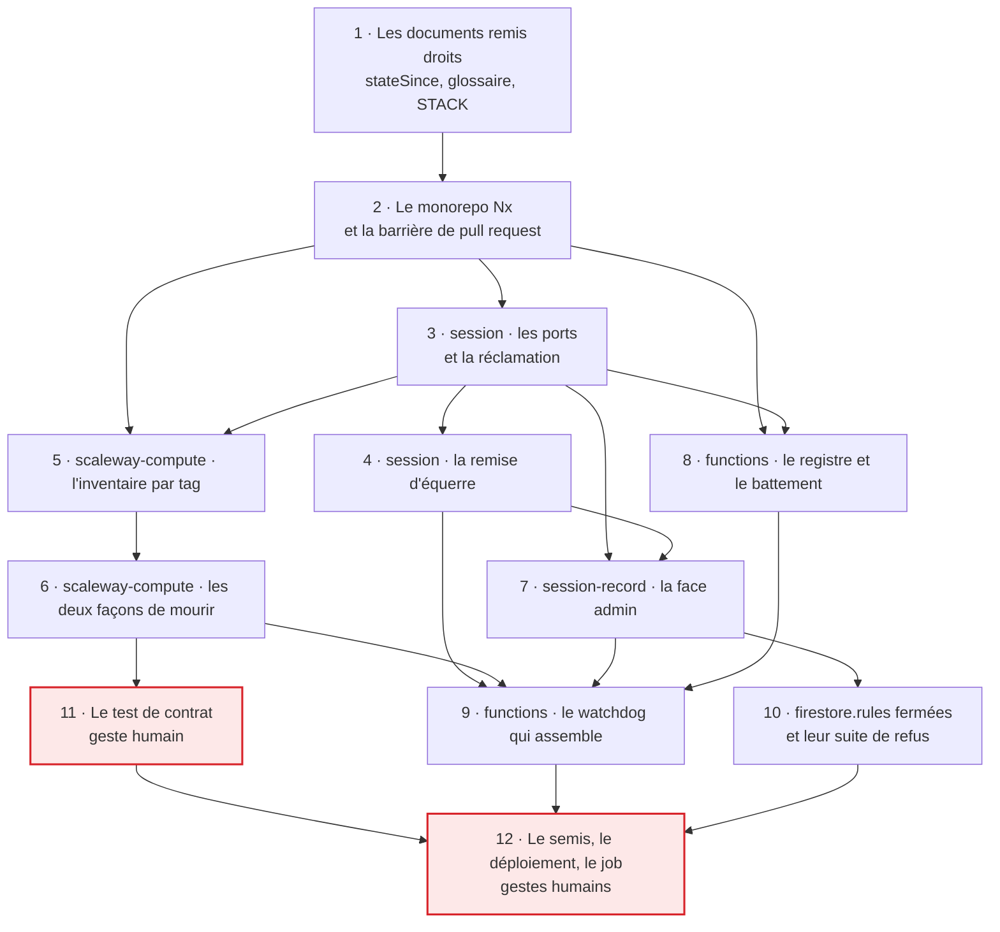

# Tranche 1 — Le faucheur

> **For agentic workers:** REQUIRED SUB-SKILL: Use superpowers:subagent-driven-development (recommended) or superpowers:executing-plans to implement this plan task-by-task. Steps use checkbox (`- [ ]`) syntax for tracking.

**But :** qu'aucune ressource Scaleway ne puisse survivre à sa session, y compris
si tout le reste du système est absent. À la fin de la tranche, un watchdog
tourne toutes les cinq minutes chez Firebase, interroge Scaleway par le tag
d'appartenance, et détruit tout ce qu'aucune intention de création ouverte
n'explique.

**Approche :** le faucheur avant le semeur, à l'échelle de la tranche comme à
celle du projet. Rien ici ne sait créer une instance — `ServerHost` n'a pas
d'`open()`, il arrive en tranche 2 avec son unique appelant. Ce qui décide de
détruire est du code pur, sans réseau ni base : deux fonctions de `libs/session`
prennent ce que le fournisseur déclare et ce que Firestore enregistre, et
rendent une liste de destructions et une correction d'état. Tout le reste — le
SDK Scaleway, l'Admin SDK, le déclencheur planifié — est une enveloppe qu'on ne
teste que par ses bords. C'est ce qui permet de couvrir en tests unitaires le
composant que le §3 du spec déclare le plus critique du système pour le budget,
sans dépenser un centime pour chaque cas.

**Pile :** monorepo Nx 23.2 sur npm workspaces, TypeScript, Vitest, ESLint,
`@scaleway/sdk`, `firebase-admin`, `firebase-functions` gen2, l'émulateur
Firestore de `firebase-tools`, `@firebase/rules-unit-testing`. Node 22 pour le
runtime des Functions.

**Spec :** [`docs/superpowers/specs/2026-09-02-game-hosting-design.md`](../specs/2026-09-02-game-hosting-design.md) —
la tranche implémente le §5 (deux tags, `provisioning`), le §6 (watchdog, moins
la ligne de l'échéance) et le §10 (barrière de pull request). Le découpage est au
[lotissement](2026-09-02-lotissement.md), les mesures qui fondent chaque choix
dans [`probe/RESULTS.md`](../../../probe/RESULTS.md).

## Ce que la tranche construit, et ce qu'elle laisse

Le tableau du §6 a **sept lignes, dont deux portent sur l'échéance**. Cinq sont
ici, dont une partielle ; les deux de l'échéance sont en tranche 2.

| Ligne du §6 | Tranche |
|---|---|
| Ressource taguée `beacon` sans `provisioning/{sessionId}` ouvert → destruction | **1** |
| `PROVISIONING` depuis plus de 15 min → destruction, puis `IDLE` ou `FAILED` | **1** |
| `STOPPING` depuis plus de 10 min → destruction sans attendre l'agent | **1** |
| État `FAILED` → nouvelle tentative, retour à `IDLE` dès que rien ne survit | **1** |
| État incohérent avec les champs réservés → remise d'équerre | **1**, partiellement — voir plus bas |
| Échéance dépassée de plus de 2 min, état encore `RUNNING` → arrêt forcé | 2 |
| `deadline - maintenant` supérieur à la durée de session → échéance ramenée à la borne | 2 |

Hors tableau, la phrase qui suit le §6 : `health/watchdog.lastRunAt` à chaque
passage, tranche 1.

L'échéance reste dehors parce qu'elle fait entrer `Deadline`, `config/settings`
et l'arithmétique de la fenêtre de prolongation — c'est-à-dire le cœur de
`libs/session`, que le lotissement place en tranche 2 et qui n'a rien à protéger
tant qu'aucune session ne naît.

**Un délai dépassé remet l'état d'équerre même quand il n'y a rien à détruire.**
Le §6 dit « destruction, **puis** `IDLE` » : le « puis » vaut aussi quand le
fournisseur ne tient rien — un plantage entre la réclamation du verrou et la
création de l'IP laisse un `PROVISIONING` sans machine, que le navigateur ne
peut pas dénouer (§5 : `IDLE` est réservé aux Functions). La réclamation est
donc émise sur le délai seul, et `close()` — idempotent par contrat — coûte deux
lectures chez le fournisseur pour que l'état retombe. Sans cela, le produit
reste mort jusqu'à une intervention en console, exactement ce que la sortie de
`FAILED` existe pour éviter (§5).

**La troisième liste est balayée, mais elle ne se détruit pas.** Le §6 pose que
la réconciliation balaie trois listes — serveurs, IP, **volumes** — et qu'« un
volume détaché dont on ne sait pas prouver l'origine est signalé, jamais détruit
d'office ». Un volume ne porte aucun tag : rien ne le rattache à ce système, et
supprimer le disque d'autrui n'est pas une erreur que le composant qui détruit a
le droit de commettre. La tranche 1 le liste et l'inscrit dans l'audit, sous un
événement à lui. C'est la seule ligne du watchdog qui produit une phrase et pas
un geste — et c'est celle qui rattrape le cas le plus coûteux : un
`deleteVolume` refusé après un `deleteServer` réussi laisse un disque de 80 Go
facturé que plus aucun tag ne désigne.

**La remise d'équerre n'est que partielle, et c'est une décision.** Le watchdog
ramène l'état à `IDLE` quand le fournisseur ne tient plus rien pour la session
affichée, et vide les champs réservés résiduels — **tous sauf `lastError`**, y
compris `provisionClaimedAt`. Ce dernier n'est pas un détail de ménage : c'est
le verrou qui fait abandonner `onServerStateChange` sur un déclenchement
dupliqué (§6). Laissé posé au retour à `IDLE`, il fait abandonner la session
*suivante*, et toutes celles d'après — le bouton répond, rien ne naît jamais, et
seule une console répare. Il ne fait **pas** l'inverse —
réinscrire un `instanceId` perdu à partir de ce que Scaleway déclare — parce que
le port `ServerHost` refuse délibérément de rendre les identifiants du
fournisseur au domaine (§4). L'incohérence dans ce sens ne coûte rien : la
destruction ne dépend d'aucun enregistrement, elle passe par le tag. Elle est
journalisée, pas réparée.

## Ce que la tranche 1 ne construit pas

Une tranche bien faite ressemble à un début de système, et c'est le piège. Ce
qui suit est hors périmètre par décision, pas par oubli :

- **Pas de `ServerHost.open()`.** Le port est déclaré tel que son consommateur
  d'aujourd'hui le consomme. Ouvrir un serveur arrive en tranche 2, avec la
  Function qui en a besoin. Déclarer une méthode que personne n'appelle et que
  l'adapter ferait lever est pire que de l'ajouter le jour venu.
- **Pas de `Deadline`, pas de `Session`, pas de `Game`, pas de `JoinInfo`, pas
  de `config/settings`.** Le `libs/session` de cette tranche ne porte que le
  vocabulaire des états, les ports, et les deux décisions du watchdog. Les deux
  objets valeur que la révision du 2026-09-05 a fait naître arrivent avec la
  session qui les remplit.
- **Rien de ce que le second jeu a fait entrer** : ni le catalogue
  `deploy/cloud-init/games/`, ni la commande `tools/game-depot`, ni `steamId`.
  Le premier vient avec `open()` en tranche 2, le deuxième avec le compagnon en
  tranche 3, le troisième avec `members` en tranche 4. **Le watchdog ne connaît
  aucun jeu, et c'est une décision** : il détruit par un tag qui n'en porte pas,
  la moitié de ses événements n'ont même pas de session, et
  `provisioning/{sessionId}` n'enregistre pas le jeu — il ne pourrait souvent
  pas le fournir. Si l'audit par jeu devient un besoin, c'est l'intention de
  création qui le résout, pas les cinq événements.
- **Pas d'`apps/web`, pas d'Angular, pas de Tailwind.** L'écran est la tranche 5
  et passe par `impeccable:impeccable` ; scaffolder l'app aujourd'hui figerait
  des choix d'interface sans les avoir pris.
- **Pas d'authentification, pas de `members`, pas de `membership-record`.**
  Tranche 4.
- **Pas de vraies règles Firestore.** Celles de la tranche 1 refusent tout, à
  tout le monde, sur tout. Les vraies s'écrivent en tranche 4 avec
  `firebase-security-rules-auditor`.
- **Pas de workflow de déploiement.** La barrière de pull request naît ici ; la
  fusion ne déploie rien avant la tranche 4. Le déploiement de cette tranche est
  un geste humain unique, à la main, et le §10 le range déjà parmi les deux
  chemins sans revue qu'il assume.
- **Pas de compagnon, pas de saves, pas d'`ovh-dns`, pas d'`agentReport`.**

Une tâche de ce plan qui semble en réclamer une est une tâche mal lue.

## Trois pièces déplacées, et pourquoi

Le lotissement plaçait ces trois morceaux ailleurs. Le choix de périmètre les
ramène ici, et la tranche 2 rétrécit d'autant.

- **`libs/session-record`, face admin seulement.** Les lignes de délai d'état
  lisent et corrigent `server/current` ; le §4 impose que cette collection passe
  par son module `*-record`. La face client reste en tranche 2 avec le
  navigateur qui l'utilisera.
- **Les tests de règles dans la CI.** Le lotissement les mettait en tranche 4,
  quand il n'existait pas de règles avant. La tranche 1 en déploie — fermées —
  donc leur suite de refus devient une barrière dès maintenant.
- **Le semis de `server/current`.** Le lotissement le range avec le workflow de
  déploiement, en tranche 4. Mais un watchdog qui tourne en production sans
  document à corriger n'est surveillé par personne : le semis vient avec le
  déploiement qui le rend nécessaire. Seul ce document est semé ici ;
  `config/settings` et le premier membre restent en tranche 4, avec les règles
  et l'authentification qui leur donnent un lecteur.

## Contraintes globales

- **Aucun appel qui crée, modifie ou détruit une ressource Scaleway n'est lancé
  par un agent.** Les appels en lecture (`list*`, `get*`) sont libres. Toute
  écriture est décrite dans le plan, expliquée, et **lancée par un humain**.
- **Aucun `firebase deploy` par un agent, aucune écriture dans le Firestore de
  production par un agent.** La cible d'un agent est toujours l'émulateur, sur
  le projet fictif `demo-beacon` — le préfixe `demo-` garantit que le SDK ne
  joint jamais un vrai projet.
- **Deux tags, exactement ceux du §5** : `beacon`, constant, pour énumérer ;
  `session:{sessionId}` pour apparier. Le préfixe `beacon-probe` de la tranche 0
  est un troisième tag, distinct, que **rien de cette tranche ne balaie** : les
  ressources de la sonde ne sont pas les nôtres au sens du watchdog.
- **Le filtre `tags=` de Scaleway est exact, pas par préfixe** — mesuré le
  2026-09-03, **sur l'IP flottante** ; que `listServers` se comporte de même est
  une extrapolation raisonnable que la tâche 11 vérifie. On n'interroge jamais
  par préfixe. On n'interroge jamais non plus avec deux tags à la fois : le
  comportement de la conjonction n'a pas été mesuré du tout, et une requête dont
  on ignore la sémantique n'a pas sa place dans le composant qui détruit.
- **`terminate` ne s'applique qu'à un serveur en marche.** Un serveur jamais
  démarré meurt par `deleteServer`, **qui laisse ses disques derrière**, facturés
  et sans tag. La distinction est mesurée (`probe/RESULTS.md`), elle est reprise
  telle quelle, et elle a deux cas de test.
- Code, noms de fichiers et commentaires en **anglais** ; plan, documentation et
  messages de commit en **français**.
- Commits en Conventional Commits, description française à l'impératif, portées
  parmi `spec`, `stack`, `plan`, `workspace`, `ci`, `session`, `session-record`,
  `scaleway-compute`, `functions`, `rules`.
- **TDD, sans exception** : le test d'abord, on le lance et on le voit échouer
  pour la bonne raison, puis le minimum qui le fait passer.
- Toutes les commandes se lancent **depuis la racine du dépôt**, par `npx nx …`.
- Budget de la tranche : **moins de 0,20 €**. Le test de contrat de la tâche 11
  vaut au plus 0,06 € — une heure entamée sur le disque et l'IP, le serveur ne
  démarrant jamais —, et les Functions déployées ajoutent ~0,05 €/mois
  d'Artifact Registry. Le reste est dans le free tier.
- **Deux affirmations de ce plan sont des inférences et non des mesures**, et
  elles sont écrites comme telles là où elles servent : qu'un second serveur
  survivrait à l'abandon de boucle de `serverActionAndWait` (la sonde a observé
  le mécanisme sur un seul serveur), et que le filtre `tags=` est exact sur
  `listServers` comme sur `listIps` (l'expérience a porté sur une IP). La
  tâche 11 répond à la seconde.

## L'ordre et ce qui le produit



Les deux cases encadrées de rouge ne se lancent pas par un agent : elles
déploient, elles créent des ressources facturées, ou les deux.

Les seules chaînes sont **3 → 4**, **3 → 5 → 6**, **3 → 7**, **4 → 7**,
**3 → 8**, **7 → 10** ; tout le reste peut avancer en parallèle dès que la 2 est
verte. Deux arêtes ne se lisent pas dans les noms : la tâche 7 consomme
`ServerRecord` et `DomainEvent` de la 3 **et** `StateCorrection` de la 4, et la
tâche 10 a besoin du `firebase.json` et du `firestore.rules` que la 7 pose.

**Le test de contrat vient avant le déploiement, et ce n'est pas un détail
d'ordonnancement.** Après la 12, un watchdog réel tourne toutes les cinq minutes
et détruit toute ressource `beacon` qu'aucune intention ouverte n'explique. Le
test de contrat crée exactement cela, sans intention, et son second cas dure
plusieurs minutes : une passe du watchdog au milieu détruirait ses ressources
entre deux assertions, et l'échec se lirait « la tâche 6 dit faux » alors que la
9 aurait parfaitement travaillé.

---

**Le spec a été corrigé après l'exécution de cette tranche** : `ResourceStranded`
n'est plus écrit qu'à l'apparition d'un volume orphelin, et `health/watchdog`
porte ce qui est orphelin maintenant. Le texte de spec cité dans les tâches
ci-dessous et les blocs de code qu'elles montrent sont l'état d'avant cette
correction — ils disent ce qui a été exécuté, pas ce qui fait autorité. Le spec
fait autorité.

### Task 1: Les documents remis droits avant qu'on code contre eux

> **Cette tâche modifie le spec. `CLAUDE.md` l'impose sans exception : invoquer
> `clean-architecture` **et** `domain-driven-design` avant la première ligne, et
> les suivre telles quelles.** Ce n'est pas une formalité ici : les steps 3 et 4
> ajoutent un événement au domaine et une transition à la machine à états.

Six défauts empêchent d'écrire la suite. Le premier est bloquant, le deuxième
coûte une requête sur toute la collection, deux sont des affirmations que la
tranche 0 a démenties et qui traînent encore, et **deux sont le sillage de la
révision du 2026-09-05** — celle qui a fait entrer Sunkenland. Une révision de
spec propage rarement du premier coup : celle-ci a redéfini `RUNNING` à un
endroit sur quatre, et rendu `joinInfo` réservé sans le dire aux deux
paragraphes du §4 qui énumèrent ces champs.

**Ce plan a été écrit avant cette révision.** Les steps qui suivent remplacent
des lignes du spec en les citant ; deux d'entre elles ont bougé depuis, et le
remplacement naïf effacerait ce que la révision vient d'écrire. Chaque
citation est donc à confronter au spec courant avant d'être appliquée — la
consigne vaut pour toute réécriture future de ce plan, pas seulement pour
celle-ci.

**Le bloquant.** Le §6 demande « `STOPPING` depuis plus de 10 min » et
« `PROVISIONING` depuis plus de 15 min ». Le §5 ne donne à `server/current`
aucun horodatage de son état courant : ses champs sont `state`, `sessionId`,
`startedBy`, `startedAt`, `deadline`, `game`, `instanceSize`, `instanceId`,
`ipId`, `ip`, `joinInfo`, `provisionClaimedAt`, `lastError`. `startedAt` date la session, pas
l'état ; `provisionClaimedAt` est le verrou de réclamation, dont la présence est
le mécanisme et non une durée. **Une machine à états dont le surveillant
raisonne en « depuis combien de temps » doit enregistrer quand l'état a
commencé.** Le champ s'appelle `stateSince`.

Il est *demandé* et non *réservé*, parce que le navigateur écrit lui-même deux
états (`PROVISIONING` et `STOPPING`, §5). Les règles le contrôlent par la même
forme que `startedAt` : `stateSince == request.time` interdit l'antidatage, et
c'est de la sécurité, pas du métier.

**Le second défaut** est plus discret et coûte une requête sur toute la
collection : « ouvert » se lit au §5 comme « `provisioning/{sessionId}` sans
`closedAt` », or Firestore ne sait pas interroger l'absence d'un champ. Le
document porte donc `closedAt: null` **dès sa création**, ce qui fait de
« ouvert » une égalité simple, donc un index automatique.

**Fichiers :**
- Modifier : `docs/superpowers/specs/2026-09-02-game-hosting-design.md` — §4, §5, §6
- Modifier : `STACK.md`
- Modifier : `README.md`
- Modifier : `docs/superpowers/plans/2026-09-02-lotissement.md`

**Interfaces :**
- Consomme : rien.
- Produit : `stateSince` et `closedAt: null`, dont dépendent les tâches 3, 4, 7
  et 8 ; les trois entrées de glossaire que les tâches 3 et 4 emploient dans les
  noms de fichiers et de fonctions ; l'événement `ResourceStranded` et la
  transition `RUNNING → FAILED`, que les tâches 3 et 4 implémentent ; et
  `joinInfo` reconnu comme champ réservé au §4, dont la tâche 7 vide la trace.

- [ ] **Step 1: Ajouter `stateSince` au §5**

Dans le tableau « Modèle de données », la première ligne de `server/current`
devient :

```markdown
| `server/current` | champs *demandés* : `state`, `stateSince`, `sessionId`, `startedBy`, `startedAt`, `deadline`, `game` | navigateur (membre) |
```

**`game` est là parce que la révision du 2026-09-05 l'y a mis, et ce plan a été
écrit avant elle.** Le recopier est le seul geste qui empêche ce remplacement
d'être une régression silencieuse : un diff qui paraîtrait n'ajouter que
`stateSince` retirerait en réalité le champ que le §2 fait choisir à
l'ouverture. Vérifier la ligne du spec avant de la remplacer, pas après.

Puis, juste après le paragraphe « `server/current` est un document unique dont
les champs ont deux propriétaires », insérer :

```markdown
**`stateSince` dit quand l'état courant a commencé**, et c'est ce qui rend
mesurables les délais du §6 — « `PROVISIONING` depuis plus de 15 min »,
« `STOPPING` depuis plus de 10 min ». `startedAt` date la session entière et ne
répond pas à cette question ; `provisionClaimedAt` est un verrou, dont la
présence est le mécanisme et non une durée.

Il est *demandé* et non *réservé* parce que le navigateur écrit lui-même deux
états. Les règles le traitent comme `startedAt` : `stateSince == request.time`,
ce qui interdit l'antidatage sans rien connaître du métier. Un client qui
mentirait sur cette valeur n'obtiendrait qu'une destruction plus tôt ou plus
tard de quelques minutes, jamais une machine.
```

Dans la ligne `provisioning/{sessionId}` du même tableau, rendre le `closedAt`
présent dès l'origine :

```markdown
| `provisioning/{sessionId}` | `tag`, `intendedAt`, `instanceSize`, `closedAt` — nul à la création —, puis `instanceId`, `ipId`, `ip` : l'intention de création ; ni lue ni écrite par un client | Functions |
```

Et, dans le paragraphe qui commence par « La réconciliation est alors une
comparaison en deux temps », remplacer les deux dernières phrases — « Une
ressource dont le document n'existe pas, **porte un `closedAt`**, ou qui n'a pas
de tag de session du tout, est orpheline et se détruit. Le document est fermé au
passage à `IDLE`, jamais supprimé : … » — par :

```markdown
Une ressource dont le document n'existe pas, dont le `closedAt` n'est plus nul,
ou qui n'a pas de tag de session du tout, est orpheline et se détruit. Le
document est fermé au passage à `IDLE` — `closedAt` reçoit un instant —, jamais
supprimé : c'est ce qui distingue « session terminée proprement » de « ressource
dont personne n'a jamais entendu parler ». **`closedAt` vaut `null` dès la
création et non pas rien**, sans quoi « les intentions ouvertes » ne serait pas
une requête : Firestore n'interroge pas l'absence d'un champ, et le watchdog
devrait rapatrier la collection entière à chaque passage.
```

« Porte un `closedAt` » devient faux à la seconde où le champ existe dès la
création : c'est la même modification, pas une seconde, et l'oublier laisserait
le §5 décrire la requête inverse de celle que la tâche 8 écrit.

Enfin, trois paragraphes plus bas, le §5 renvoie encore la sémantique du filtre
à une mesure qui a eu lieu. Supprimer la dernière phrase de ce paragraphe — « La
**sémantique exacte du filtre** … reste à mesurer en vivo (§12) : c'est elle qui
décide si le premier temps de la réconciliation coûte une requête ou un
rapatriement. » — et la remplacer par :

```markdown
La sémantique du filtre est mesurée (§12) : il est **exact, pas par préfixe**.
Le premier temps de la réconciliation coûte donc une requête et non un
rapatriement — et c'est exactement ce qui rend le tag d'appartenance
indispensable, deux paragraphes plus haut.
```

- [ ] **Step 2: Dire au §6 sur quoi chaque délai se compte**

Sous le tableau du watchdog, avant le paragraphe « Chaque passage écrit
`health/watchdog.lastRunAt` », insérer :

```markdown
**Les deux délais se comptent sur `stateSince`**, jamais sur `startedAt` : c'est
la durée passée dans l'état courant qui dit qu'une opération est bloquée, pas
l'âge de la session. Un `stateSince` absent — un document semé avant que le
champ existe — ne déclenche aucun délai : le watchdog ne devine pas une durée
qu'on ne lui a pas donnée, et la ligne de réconciliation par tag rattrape de
toute façon toute ressource qu'aucune intention ouverte n'explique.

`FAILED` n'a pas de délai : il se retente à chaque passage.
```

- [ ] **Step 3: Le §4 — les trois mots du watchdog, et `joinInfo` là où la révision l'a oublié**

Dans le tableau du glossaire, après sa dernière ligne — « bloqué | `Failed` » —
ajouter :

```markdown
| réclamation | `Reclamation` | la décision de détruire ce qu'une session ne peut plus justifier : aucune intention ouverte, un délai d'état dépassé, ou un nettoyage à retenter |
| remise d'équerre | `reconcile()` | ramener `server/current` à ce que le fournisseur déclare réellement |
| volume orphelin | `ResourceStranded` | un disque détaché dont aucun tag ne dit l'origine : signalé, jamais détruit |
```

La définition de « réclamation » couvre les trois causes et pas la seule
réconciliation par tag, sinon le mot du glossaire serait plus étroit que le type
qui le porte — et c'est le genre d'écart qui fait diverger la langue et le code.

Puis, dans la liste du paragraphe « **Les événements sont des faits au passé** »,
ajouter `ResourceStranded` à l'énumération, après `SessionReclaimed`.

Puis, après la phrase qui distingue `SessionStopRequested` de `SessionStopped` —
elle est dans le paragraphe suivant, celui qui commence par « Deux d'entre eux
se ressemblent » —, ajouter :

```markdown
**Deux événements portent un `sessionId` nul, et ce sont les seuls.**
`SessionReclaimed` quand la ressource détruite portait le tag d'appartenance
sans tag de session : elle n'appartient à aucune session — c'est même ce qui la
condamne — mais sa destruction engage de l'argent et doit se lire dans l'audit.
`ResourceStranded` quand un volume détaché ne peut être rattaché à personne :
là, rien n'est détruit, et l'événement *est* toute l'action. `CleanupFailed`
peut lui aussi n'avoir aucun sujet, pour la même raison que le premier. Un
événement dont l'acteur est le système et le sujet « ce que personne ne
réclamait » est plus honnête qu'un `sessionId` inventé pour remplir la colonne.
```

**Puis `joinInfo`, que la révision du 2026-09-05 a rendu réservé sans le dire au
§4.** Le tableau du §5 le liste parmi les champs réservés ; les deux endroits du
§4 qui énumèrent ces champs l'ignorent encore, et l'un des deux **interdit à
l'écran d'afficher le point de jonction** — ce que l'étape 8 du flux exige
pourtant. La tranche 2 écrirait sa face client contre cette interdiction.

Dans le paragraphe « `Session` ne voit jamais les champs réservés de
`server/current` », la parenthèse devient :

```markdown
(`instanceId`, `ipId`, `ip`, `joinInfo`, `provisionClaimedAt`, `lastError`)
```

Et le paragraphe qui commence par « `ServerFacts` est **manipulée** par le
watchdog et les Functions seuls » se remplace en entier :

```markdown
`ServerFacts` est **manipulée** par le watchdog et les Functions seuls, mais
trois de ses valeurs sont **affichées** : l'`ip`, que l'écran montre à côté du
nom de domaine, le `joinInfo`, que l'écran rend lisible et copiable (§6,
étape 8), et `lastError`, qui dit qu'une tentative précédente a échoué. La face
client en expose donc une vue en lecture seule, réduite à ces trois champs. Le
reste — `instanceId`, `ipId`, `provisionClaimedAt` — ne quitte jamais le côté
serveur, où il n'a d'ailleurs de sens que pour la réconciliation.

`joinInfo` est le seul champ réservé que le domaine transporte : réservé **en
écriture**, parce que seules les Functions et l'agent constatent qu'un serveur
est joignable, et affiché en lecture, parce que c'est exactement ce que le
joueur copie. Les deux ne se contredisent pas — c'est la même asymétrie que
`lastError`, poussée d'un cran.
```

- [ ] **Step 4: Aligner ce que `RUNNING` veut dire, et ouvrir `RUNNING → FAILED`**

**La révision a redéfini `RUNNING` à un seul endroit sur quatre.** Le §4 dit
désormais « le point de jonction est publié », et c'est la définition qui unifie
les deux jeux — pour Enshrouded la Function connaît le point de jonction dès que
l'IP est réservée, pour Sunkenland l'agent seul le découvre. Les trois autres
portent encore l'ancienne, celle qui ferait afficher « en service » un serveur
que personne ne peut rejoindre :

- tableau des écrivains autorisés du §5, ligne `RUNNING` : « une machine existe
  et répond » devient « **le point de jonction est publié** » ;
- diagramme du §5, transition `PROVISIONING --> RUNNING` : « l'agent rapporte
  que le serveur répond » devient « **le point de jonction est publié** » ;
- tableau des invariants du §7, première colonne : « `RUNNING` implique qu'une
  machine existe » devient « **`RUNNING` implique qu'une machine existe et que
  son point de jonction est publié** ».

Trois lignes, et elles évitent que la tranche 2 code la définition périmée en
croyant suivre le spec — c'est le sens même de cette tâche.

Le §5 réserve `FAILED` au cas « le nettoyage n'a pas pu être garanti », mais son
diagramme n'y mène que depuis `PROVISIONING` et `STOPPING`. Or une session en
`RUNNING` dont l'intention a été fermée est réclamée, et sa destruction peut
échouer : l'état honnête est alors `FAILED`, et la tranche 2 rencontrera le même
cas sur l'arrêt forcé à l'échéance. Ajouter la transition au diagramme, après la
ligne `STOPPING --> FAILED` :

```markdown
    RUNNING --> FAILED : destruction refusée
```

C'est la seule transition que cette tranche ajoute. `IDLE` n'en reçoit aucune :
un document déjà `IDLE` dont un nettoyage résiduel échoue n'a rien à afficher de
plus, l'échec se lit dans `events` et le passage suivant réessaie.

- [ ] **Step 5: Inscrire `stateSince` et `closedAt` dans les flux du §6**

C'est la moitié qui manque, et sans elle la tranche 2 écrirait des documents que
la tranche 1 ne sait pas lire. Le §6 décrit qui écrit quoi ; il n'a jamais été
amendé pour les deux champs des steps 1 et 2.

Flux **Démarrage**, étape 1 : la liste des champs inscrits par le navigateur
devient « `sessionId`, `game`, `stateSince`, `startedBy`, `startedAt`,
`deadline` ».

**`game` y manquait déjà**, et ce n'est pas ce plan qui l'a perdu : la révision
du 2026-09-05 l'a ajouté au tableau du §5 et en a fait un invariant du §4 — « le
jeu se fige à l'ouverture, écrit avec le passage à `PROVISIONING` » — sans
amender le flux qui décrit cette écriture. Ce step est le seul qui rouvre cette
liste ; la réécrire sans `game` graverait l'oubli, et la tranche 2 coderait une
transaction d'ouverture qui n'inscrit pas le jeu que l'adapter doit recevoir.

Flux **Démarrage**, étape 4 : « tag `session:{sessionId}`, instant, gabarit »
devient « tag `session:{sessionId}`, instant, gabarit, **`closedAt` à `null`** ».
Ajouter derrière, dans la même phrase ou juste après :

```markdown
`closedAt` est écrit nul dès la création et non laissé absent : c'est ce qui
fait des intentions ouvertes une requête d'égalité (§5). Une intention créée
sans ce champ est invisible du watchdog, qui détruira la machine en plein
provisionnement.
```

Flux **Arrêt propre**, étape 1 : « L'état passe à `STOPPING` » devient « L'état
passe à `STOPPING`, `stateSince` avec lui ».

- [ ] **Step 6: Commit du spec**

Trois commits et non un : dater l'état courant est une chose, ouvrir une
transition et un événement en est une autre, et rattraper le sillage d'une
révision qui n'est pas la nôtre en est une troisième. Tout étant dans le même
fichier, chacun se compose à la main — le premier prend les hunks des steps 1,
2 et 5, le deuxième ceux du glossaire et du diagramme, le troisième ce qui reste.

```bash
git add -p docs/superpowers/specs/2026-09-02-game-hosting-design.md
git commit -m "docs(spec): date l'etat courant et rend les intentions ouvertes interrogeables"
git add -p docs/superpowers/specs/2026-09-02-game-hosting-design.md
git commit -m "docs(spec): signale les volumes orphelins et ouvre running vers failed"
git add docs/superpowers/specs/2026-09-02-game-hosting-design.md
git commit -m "docs(spec): propage joinInfo et la definition de running au reste du document"
```

Le troisième est le sillage de la révision Sunkenland et pas de cette tranche :
le séparer permet de le lire pour ce qu'il est, une propagation oubliée, sans
le mêler à ce que le faucheur exige.

- [ ] **Step 7: Retirer de `STACK.md` un repli qui n'existe pas**

`STACK.md` annonce « `DEV1-L` par défaut, repli `PRO2-XXS` ». La tranche 0 a
mesuré que `PRO2` n'est commandable dans aucune zone parisienne, et le §2 du
spec a déjà été corrigé — pas `STACK.md`. Remplacer la phrase du bloc
« Serveur de jeu » :

```markdown
**Serveur de jeu** — **Scaleway**, région `fr-par` (Paris), zone `fr-par-1` :
Instances pour le calcul, Object Storage pour les sauvegardes. Le gabarit est
libre et réservé à l'admin ; `DEV1-L` est le défaut, et **il n'a pas de repli** —
c'est le seul calibre à 8 Gio de la zone à la fois disponible et livré avec son
disque local, tout substitut demandant un volume bloc. Le `PRO2-XXS` que ce
fichier nommait n'est commandable dans aucune zone parisienne. Le **DNS reste
chez OVH**, en DynHost : le domaine y est, et un enregistrement A pointe où l'on
veut.
```

**Et sa section « Conteneurs » ne connaît qu'un jeu.** Elle dit
`mornedhels/enshrouded-server` consommée telle quelle et « la seule image maison
est le compagnon » ; le spec en nomme une seconde depuis la révision, avec une
réserve, et une commande d'administration que ce fichier ne mentionne nulle
part. `CLAUDE.md` veut que toute brique s'écrive ici. Ajouter, après le
paragraphe de l'image amont :

```markdown
`melle2/sunkenland-ds` est consommée **sous réserve** : son script de démarrage
ignore les options dont Beacon a besoin et son `+login anonymous` ne peut pas
fonctionner pour cette app. Qui porte le script — contribution en amont ou image
mince à nous — est une question ouverte du §12 du spec. Les fichiers de ce jeu
ne passent jamais par SteamCMD sur la VM : ils sont déposés dans le seau par
`tools/game-depot`, depuis la machine d'un administrateur.
```

Deux commits : le repli de gabarit est une correction que la sonde impose, le
second conteneur est une conséquence de la révision.

```bash
git add -p STACK.md
git commit -m "docs(stack): retire un repli de gabarit que la zone ne commande pas"
git add STACK.md
git commit -m "docs(stack): nomme le conteneur du second jeu et son depot de fichiers"
```

- [ ] **Step 8: Remettre le `README.md` à l'heure**

Trois phrases y sont fausses, et les corriger séparément ferait trois commits
pour un seul sujet — l'état du dépôt.

Sa première ligne nomme encore un jeu unique, alors que `PRODUCT.md` et
`CLAUDE.md` viennent tous deux de cesser d'en nommer un :

```markdown
Serveurs de jeu à la demande, pour trois ou quatre amis. Le serveur n'existe
```

Puis les lignes de la stack et de l'état :

```markdown
Angular sur monorepo Nx, plan de contrôle Firebase, serveur de jeu chez
Scaleway.

Le spec est validé, et révisé le 2026-09-05 pour faire entrer un second jeu. La
tranche 0 — une sonde, sans code de production — a répondu à ses questions
ouvertes ; la tranche 1 pose le premier code qui reste.
```

« Le spec est en revue » est faux depuis le 2026-09-03, et « aucun code à ce
jour » le devient à la tâche suivante. Sujet sans rapport avec le spec, donc
commit à part.

```bash
git add README.md
git commit -m "docs: remet a l'heure l'hebergeur et l'etat du depot dans le README"
```

- [ ] **Step 9: Acter dans le lotissement les trois pièces déplacées**

Dans `docs/superpowers/plans/2026-09-02-lotissement.md`, section « 1 · Le
faucheur », ajouter en fin de section :

```markdown
**Trois pièces sont remontées de plus loin**, et la tranche 2 rétrécit d'autant.
La face **admin** de `libs/session-record` vient ici parce que les délais d'état
du §6 lisent et corrigent `server/current`, et que le §4 impose à cette
collection de passer par son module `*-record` ; la face client reste en
tranche 2. Les **tests de règles dans la CI** viennent ici parce que la
tranche 1 déploie des règles — fermées — et qu'un jeu de règles déployé sans sa
suite de refus n'est pas une barrière. Et le **semis de `server/current`** vient
ici parce qu'un watchdog déployé sans document à corriger n'est surveillé par
personne ; `config/settings` et le premier membre restent en tranche 4.
```

Dans le tableau « La livraison ne fait pas de tranche », la ligne des tests de
règles et celle du semis se scindent :

```markdown
| Tests de règles dans la CI | 1 |
| Semis de `server/current` | 1 |
| Workflow de déploiement, et semis du reste | 4 |
```

```bash
git add docs/superpowers/plans/2026-09-02-lotissement.md
git commit -m "docs(plan): remonte session-record, les tests de regles et le semis"
```

---

### Task 2: Le monorepo Nx et la barrière de pull request

Premier code qui reste. `probe/` était un dossier Node autonome et le
reste — c'est la provenance des mesures, et une mesure dont on a perdu la
commande n'est plus une mesure — mais il ne doit jamais entrer dans le graphe Nx :
ses scripts appellent le compte Scaleway réel et créent ou détruisent des
ressources facturées.

**Le générateur est obligatoire, et il ne produit pas exactement ce qu'il faut.**
Ce qui suit le lance d'abord et corrige ensuite, jamais l'inverse. Trois
corrections sont attendues et vérifiées : `create-nx-workspace` refuse un
répertoire non vide, il écrit un `CLAUDE.md` et une demi-douzaine de dossiers
d'agents qu'il ne faut pas laisser écraser les nôtres, et `nx.json` sort sans
`defaultBase`.

**Fichiers :**
- Créer : `nx.json`, `package.json`, `package-lock.json`, `tsconfig.base.json`,
  `tsconfig.json`, `.prettierrc`, `.prettierignore`, `.nxignore`,
  `eslint.config.mjs`, `vitest.config.mts`
- Créer : `apps/functions/**` (généré)
- Créer : `libs/session/**`, `libs/session-record/**`,
  `libs/scaleway-compute/**`, `libs/rules/**` (générés)
- Créer : `.github/workflows/pull-request.yml`
- Modifier : `.gitignore`

**Interfaces :**
- Consomme : rien.
- Produit :
  - les cinq projets Nx `@beacon/functions`, `@beacon/session`,
    `@beacon/session-record`, `@beacon/scaleway-compute`, `@beacon/rules` ;
  - les alias TypeScript `@beacon/session`, `@beacon/session-record`,
    `@beacon/scaleway-compute`, résolus par les npm workspaces ;
  - `npx nx run-many -t lint test build typecheck`, vert, qui est la barrière de
    toutes les tâches suivantes.

> **Tous les blocs `bash` de cette tâche se lancent avec l'outil Bash, jamais
> PowerShell** : boucles `for`, `cp`, `printf`, préfixes `VAR=valeur commande`
> n'ont pas d'équivalent syntaxique là-bas. Et **l'état du shell ne persiste pas
> d'un appel à l'autre** : un bloc qui pose une variable et s'en sert part en un
> seul appel.

- [ ] **Step 1: Générer le workspace dans un répertoire tiers, puis recopier une liste**

`create-nx-workspace` refuse d'écrire dans un répertoire non vide, et le dépôt
ne l'est pas. On le génère à côté, puis on recopie une liste explicite de
fichiers — explicite, parce qu'il produit aussi un `CLAUDE.md`, un `AGENTS.md`,
un `README.md` et six dossiers d'agents dont aucun ne doit atteindre ce dépôt.

Le répertoire tiers est le **scratchpad de la session**, jamais `/tmp` : sous
Git Bash `/tmp` pointe vers le temp de Windows, partagé avec tout le reste de la
machine. Les deux temps tiennent dans un seul appel, puisque `$SCAFFOLD` ne
survivrait pas au suivant.

```bash
SCAFFOLD="<le repertoire scratchpad annonce par le harnais>/beacon-scaffold"
REPO="$(git rev-parse --show-toplevel)"

mkdir -p "$SCAFFOLD" && cd "$SCAFFOLD"
npx --yes create-nx-workspace@23.2.0 beacon \
  --preset=ts --workspaces --nxCloud=skip --packageManager=npm --no-interactive

cd "$REPO"
for f in nx.json package.json package-lock.json tsconfig.base.json tsconfig.json .prettierrc .prettierignore; do
  cp "$SCAFFOLD/beacon/$f" "./$f"
done
rm -rf "$SCAFFOLD"
git status --short
```

Attendu du générateur : `"success":true`. Le preset `ts` est celui qu'il faut et
non `apps` : il sort en `strict: true`, en références de projets TypeScript et
en npm workspaces, là où `apps` sort en `strict: false` et traîne des
dépendances Angular dont cette tranche n'a pas l'usage.

Attendu : sept fichiers non suivis, et **rien d'autre**. En particulier, pas de
`CLAUDE.md` modifié, pas d'`AGENTS.md`, pas de `.claude/`, `.agents/`,
`.codex/`, `.cursor/`, `.gemini/`, `.opencode/`, `opencode.json`, `.vscode/`
ni `.github/`. Si l'un d'eux apparaît, la boucle a copié trop large : le
supprimer avant de continuer.

**Le `.gitignore` du dépôt n'est pas complet, contrairement à ce qu'on pourrait
supposer.** Il couvre `node_modules/`, `dist/`, `.nx/`, `.firebase/`,
`*-debug.log` et `.env` — ce dernier à toute profondeur, ce qui met d'avance
`apps/functions/.env` et `libs/scaleway-compute/.env` hors de portée. Mais il ne
couvre **ni `coverage/`, ni `out-tsc/`, ni `tmp/`, ni `test-output/`, ni les
horodatages de configuration Vitest**. Ajouter, sous la section « Node / Nx /
Firebase » :

```
out-tsc/
tmp/
coverage/
test-output/
vitest.config.*.timestamp*
```

Sans quoi le premier `--coverage` propose de commiter quelques milliers de
fichiers, et quelqu'un finit par le faire.

- [ ] **Step 2: Poser les emplacements, la branche de référence et le nom**

`package.json` : le preset publie sous `packages/*`, le §4 du spec range sous
`apps/` et `libs/`.

```bash
node -e "
const fs=require('fs'), f='package.json', p=JSON.parse(fs.readFileSync(f,'utf8'));
p.name='@beacon/source';
p.workspaces=['apps/*','libs/*'];
fs.writeFileSync(f, JSON.stringify(p,null,2)+'\n');
"
node -e "
const fs=require('fs'), f='nx.json', p=JSON.parse(fs.readFileSync(f,'utf8'));
p.defaultBase='main';
fs.writeFileSync(f, JSON.stringify(p,null,2)+'\n');
"
```

`defaultBase` sort à `master` ou absent selon la version ; la branche de ce
dépôt est `main`, et `nx affected` compare contre cette valeur. Un `affected`
qui compare contre une branche inexistante ne rend rien et la barrière de pull
request passe au vert sans avoir rien testé — c'est la panne silencieuse la plus
coûteuse de cette tâche.

- [ ] **Step 3: Tenir `probe/` hors du graphe**

Ce qui garde `probe/` hors du graphe, c'est le step précédent : les globs
`apps/*` et `libs/*` ne l'atteignent pas, donc ni npm ni Nx n'en font un projet,
et `nx run-many` ne peut pas lancer `scw:reap` ou `scw:session`. Le `.nxignore`
ne rattrape pas un oubli — il coupe le parcours des plugins sur les trente mille
fichiers de `probe/node_modules`, et il documente à quoi on tient.

`.nxignore` :

```
# La sonde de la tranche 0 est un projet npm autonome, avec son propre verrou de
# dependances. Ses scripts appellent le compte Scaleway reel et creent ou
# detruisent des ressources facturees : elle ne doit jamais etre atteinte par un
# `nx run-many`.
probe
```

- [ ] **Step 4: Installer et ajouter les deux plugins**

```bash
npm install
npx nx add @nx/node@23.2.0
npx nx add @nx/eslint@23.2.0
```

Attendu : `Package @nx/node added successfully.` puis
`Package @nx/eslint added successfully.`

- [ ] **Step 5: Générer l'application des Functions**

Ce que ce générateur produit exactement — l'arborescence, le nom du projet, et
surtout la présence d'un `vitest.config.mts` **par projet**, dont quatre cibles
de tâches ultérieures dépendent — est une hypothèse tant qu'on ne l'a pas vue.
`--dry-run` la lève gratuitement : même commande, rien d'écrit.

```bash
npx nx g @nx/node:application functions \
  --directory=apps/functions --framework=none --bundler=esbuild \
  --unitTestRunner=vitest --e2eTestRunner=none --linter=eslint --no-interactive --dry-run
```

Si `apps/functions/vitest.config.mts` n'apparaît pas dans la liste, les cibles
`test` des tâches 7, 8, 10 et 11 pointent vers un fichier qui n'existe pas :
corriger leur `--config` avant d'y arriver, pas au moment où elles échouent.
Puis, la même sans `--dry-run` :

```bash
npx nx g @nx/node:application functions \
  --directory=apps/functions --framework=none --bundler=esbuild \
  --unitTestRunner=vitest --e2eTestRunner=none --linter=eslint --no-interactive
```

Attendu : `apps/functions/**` créé, et le projet nommé `@beacon/functions`. Le
générateur crée aussi `eslint.config.mjs` et `vitest.config.mts` à la racine —
c'est voulu, ils sont partagés.

- [ ] **Step 6: Générer les quatre bibliothèques**

Même précaution, une fois, sur la première :

```bash
npx nx g @nx/js:library session --directory=libs/session \
  --bundler=none --unitTestRunner=vitest --linter=eslint --no-interactive --dry-run
```

Puis les quatre pour de bon :

```bash
for l in session session-record scaleway-compute rules; do
  npx nx g @nx/js:library "$l" --directory="libs/$l" \
    --bundler=none --unitTestRunner=vitest --linter=eslint --no-interactive
done
```

`--bundler=none` : aucune de ces libs n'est publiée ni construite pour
elle-même. `apps/functions` les avale au build, à l'étape suivante.

`libs/rules` n'est pas une bibliothèque au sens ordinaire : c'est le projet qui
porte la suite de refus des règles Firestore (tâche 10). Le fichier
`firestore.rules` reste à la racine, où le §4 du spec le place ; seuls ses tests
vivent ici, et le générateur est le seul moyen de leur donner une cible `test`,
un `tsconfig` et une entrée dans le graphe.

- [ ] **Step 7: Faire avaler les libs par le build des Functions**

Les libs exportent du TypeScript source et ne produisent pas de `dist`. Sans
regroupement, la charge utile déployée chez Firebase contiendrait un `main.js`
important `@beacon/session` que le runtime ne saurait pas résoudre. Le
regroupement est aussi ce qui rend `prune-lockfile` juste : la charge utile ne
déclare plus que les dépendances externes.

Firebase attend par ailleurs un `package.json` portant `main` et `engines` dans
le répertoire source du déploiement ; `prune-lockfile` recopie ceux du projet.

Remplacer `apps/functions/package.json` par :

```json
{
  "name": "@beacon/functions",
  "version": "0.0.1",
  "private": true,
  "main": "main.js",
  "engines": {
    "node": "22"
  },
  "nx": {
    "targets": {
      "build": {
        "executor": "@nx/esbuild:esbuild",
        "outputs": ["{options.outputPath}"],
        "defaultConfiguration": "production",
        "options": {
          "platform": "node",
          "outputPath": "apps/functions/dist",
          "format": ["cjs"],
          "bundle": true,
          "main": "apps/functions/src/main.ts",
          "tsConfig": "apps/functions/tsconfig.app.json",
          "assets": [],
          "esbuildOptions": { "sourcemap": true, "outExtension": { ".js": ".js" } }
        },
        "configurations": {
          "development": {},
          "production": {
            "esbuildOptions": { "sourcemap": false, "outExtension": { ".js": ".js" } }
          }
        }
      },
      "prune-lockfile": {
        "dependsOn": ["build"],
        "cache": true,
        "executor": "@nx/js:prune-lockfile",
        "outputs": [
          "{workspaceRoot}/apps/functions/dist/package.json",
          "{workspaceRoot}/apps/functions/dist/package-lock.json"
        ],
        "options": { "buildTarget": "build" }
      }
    }
  },
  "dependencies": {}
}
```

`"main": "main.js"` ne désigne rien dans `apps/functions/` et désigne le bon
fichier dans `apps/functions/dist/`, qui est le seul endroit où quelqu'un le
lit. Aucun outil du workspace ne le consulte : l'exécuteur esbuild prend son
entrée dans `nx.targets.build.options.main`.

Les cibles `copy-workspace-modules`, `prune` et `serve` que le générateur a
posées disparaissent : la première n'a plus d'objet une fois les libs
regroupées, les deux autres n'ont pas d'appelant dans cette tranche.

- [ ] **Step 8: Installer les dépendances de la tranche**

```bash
npm install firebase-admin@^13.0.0 firebase-functions@^6.1.1 \
  @scaleway/sdk@^4.0.7 @scaleway/sdk-client@^1.2.0 \
  --workspace=@beacon/functions
npm install -D firebase-tools@^13.29.1 @firebase/rules-unit-testing@^4.0.1 \
  firebase@^11.0.0 dotenv@^16.4.7
```

`@scaleway/sdk` et `firebase-admin` entrent par `@beacon/functions`, qui est la
racine de composition : `prune-lockfile` les recopiera dans la charge utile.
`firebase-tools` reste à la racine, c'est l'émulateur et il ne se déploie pas.

**`@scaleway/sdk-client` se déclare, il ne s'hérite pas.** `createClient` en
vient, et il ne remonte aujourd'hui que par le hissage des paquets `sdk-*` :
c'est une dépendance fantôme, qui résout tant que npm range les modules comme
aujourd'hui et casse le jour où il les range autrement. `dotenv` est de même une
dépendance réelle du test de contrat (tâche 11) : le `dotenv` de `probe/` est
hors du graphe et ne sert à rien ici.

- [ ] **Step 9: Vérifier que le squelette est vert**

```bash
npx nx sync
npx nx run-many -t lint test build typecheck
```

Attendu : aucune cible en échec. Le libellé exact varie — seul `functions` a une
cible `build`, donc le décompte de projets ne sera pas le même d'une cible à
l'autre ; ce qui compte est l'absence d'échec, pas la phrase. Les tests sont
ceux que les générateurs ont écrits — un par lib, trivial. Ils seront remplacés
par les tâches suivantes ; ici ils prouvent seulement que l'outillage tourne.

```bash
npx nx show projects
```

Attendu, exactement ces cinq : `@beacon/functions`, `@beacon/session`,
`@beacon/session-record`, `@beacon/scaleway-compute`, `@beacon/rules`. Si
`beacon-probe` apparaît, `.nxignore` n'est pas pris en compte — le corriger
avant d'aller plus loin.

- [ ] **Step 10: Fermer les frontières que le §9 exige**

Le §9 du spec demande une règle de lint, pas un test : « ni `libs/session` ni
`apps/web` n'importent un SDK Firestore ». `apps/web` n'existe pas encore ;
`libs/session` oui, et c'est lui qui compte — c'est le noyau de décision, et le
jour où un SDK y entre, l'argument du §4 sur le remplacement du stockage devient
faux sans que rien ne le signale.

Ajouter les tags dans les `package.json` de projet, sous `nx` :

| Projet | `tags` |
|---|---|
| `libs/session` | `["scope:domain"]` |
| `libs/session-record` | `["scope:record"]` |
| `libs/scaleway-compute` | `["scope:adapter"]` |
| `libs/rules` | `["scope:rules"]` |
| `apps/functions` | `["scope:app"]` |

Puis, dans `eslint.config.mjs` à la racine, remplacer le `depConstraints` par
défaut :

```js
  {
    files: ['**/*.ts', '**/*.tsx', '**/*.js', '**/*.jsx'],
    rules: {
      '@nx/enforce-module-boundaries': [
        'error',
        {
          enforceBuildableLibDependency: true,
          allow: ['^.*/eslint(\\.base)?\\.config\\.[cm]?[jt]s$'],
          depConstraints: [
            // The decision core depends on nothing of ours: it declares the
            // ports, it never reaches for an implementation.
            { sourceTag: 'scope:domain', onlyDependOnLibsWithTags: ['scope:domain'] },
            { sourceTag: 'scope:record', onlyDependOnLibsWithTags: ['scope:domain'] },
            { sourceTag: 'scope:adapter', onlyDependOnLibsWithTags: ['scope:domain'] },
            { sourceTag: 'scope:rules', onlyDependOnLibsWithTags: [] },
            { sourceTag: 'scope:app', onlyDependOnLibsWithTags: ['scope:domain', 'scope:record', 'scope:adapter'] },
          ],
        },
      ],
    },
  },
```

L'interdiction d'import, elle, ne va pas là. En flat config ESLint 9, un
`files` se résout contre le chemin de base du fichier de configuration
chargé — jamais contre la racine du dépôt. `nx lint` lance `eslint .` depuis
le répertoire du projet : pour `libs/session`, c'est donc
`libs/session/eslint.config.mjs` qui charge, avec `libs/session/` pour seule
base, et un `files: ['libs/session/**/*.ts']` écrit là viserait
`libs/session/libs/session/**` — rien. Réécrire le glob à la racine ne répare
rien non plus : le chemin de base ne remonte pas jusqu'à la racine. Mesuré
pendant la tranche, pas supposé : la même violation lève l'erreur attendue
depuis la racine et reste silencieuse depuis `libs/session`. Une règle portée
par un seul projet vit donc dans la configuration de ce projet, ou elle ne vit
nulle part — et c'est ce qui attend `apps/web` en tranche 5.

Dans `libs/session/eslint.config.mjs` :

```js
  {
    // §9 of the spec, as a lint rule and not a test: the decision core must run
    // in a browser, in a Function and in a test with no infrastructure at all.
    // The day a client library reaches in here, §4's claim that swapping the
    // store costs one adapter stops being true, and nothing else would say so.
    files: ['**/*.ts'],
    rules: {
      'no-restricted-imports': [
        'error',
        {
          patterns: [
            { group: ['firebase', 'firebase/*', 'firebase-admin', 'firebase-admin/*', '@firebase/*'], message: 'libs/session ne connait pas Firestore : passer par un module *-record.' },
            { group: ['@scaleway/*'], message: 'libs/session ne connait pas l hebergeur : passer par le port ServerHost.' },
          ],
        },
      ],
    },
  },
```

- [ ] **Step 11: Voir la frontière refuser, une fois**

Une règle de lint qu'on n'a jamais vue rouge est une règle qu'on suppose : un
bloc de configuration plate dont le `files` ne correspond à rien reste
silencieusement inerte, et personne ne l'apprend avant la tranche où ça compte.
C'est la même discipline qu'au step suivant sur la barrière.

```bash
SESSION=libs/session/src/lib/session.ts
cp "$SESSION" "$SESSION.bak"
printf '\nimport "firebase-admin";\n' >> "$SESSION"
npx nx lint @beacon/session
mv "$SESSION.bak" "$SESSION"
npx nx lint @beacon/session
```

Attendu : d'abord un échec portant le message
« libs/session ne connait pas Firestore », puis un succès. Si le premier passe,
le `files` du bloc ne cible pas ce fichier.

- [ ] **Step 12: Écrire la barrière de pull request**

Le §10 la définit : lint, tests unitaires, build, et **rien qui sorte du
runner** — ni appel à Scaleway, ni test de fumée Docker. L'émulateur Firestore
ne sort pas du runner : il tourne en local, sur la JVM déjà présente dans
l'image `ubuntu-latest`.

`.github/workflows/pull-request.yml` :

```yaml
name: pull-request

on:
  pull_request:
    branches: [main]

concurrency:
  group: ${{ github.workflow }}-${{ github.ref }}
  cancel-in-progress: true

jobs:
  verify:
    runs-on: ubuntu-latest
    steps:
      - uses: actions/checkout@v4
        with:
          fetch-depth: 0

      - uses: actions/setup-node@v4
        with:
          node-version: 22
          cache: npm

      - run: npm ci

      # Sets the base and head shas nx affected compares against.
      - uses: nrwl/nx-set-shas@v4

      - run: npx nx affected -t lint test build typecheck
```

Aucun secret n'est exposé à ce workflow : c'est la raison pour laquelle le §10
exclut les tests de contrat de l'intégration continue, et la clé Scaleway
n'entre pas dans GitHub.

- [ ] **Step 13: Vérifier que la barrière échoue quand elle doit**

Une barrière qu'on n'a jamais vue rouge est une barrière qu'on suppose. Casser
volontairement un test, lancer la commande, et la voir échouer. Rien n'est
encore commité à cette étape, donc `git checkout` ne restaurerait rien : on
garde une copie.

```bash
SPEC=libs/session/src/lib/session.spec.ts
cp "$SPEC" "$SPEC.bak"
printf '\nit("echoue expres", () => { expect(1).toBe(2) })\n' >> "$SPEC"
npx nx run-many -t test --skip-nx-cache
```

Attendu : FAIL sur `@beacon/session`. Puis restaurer :

```bash
mv "$SPEC.bak" "$SPEC"
npx nx run-many -t test --skip-nx-cache
```

Attendu : PASS, et `git status` ne montre aucun `.bak`.

- [ ] **Step 14: Commit**

```bash
git add nx.json package.json package-lock.json tsconfig.base.json tsconfig.json \
  .prettierrc .prettierignore .nxignore .gitignore eslint.config.mjs vitest.config.mts \
  apps libs .github
git commit -m "build(workspace): monte le monorepo nx et la barriere de pull request"
```

---

### Task 3: `libs/session` — les ports et la réclamation

Le cœur de la tranche. Ce fichier décide seul de ce qui doit mourir, et il le
décide sans réseau, sans base et sans horloge réelle : c'est ce qui permet de
mettre sous tension le composant le plus critique du système pour le budget en
une poignée de millisecondes et sans dépenser un centime.

**Le port `ServerHost` est déclaré tel que son consommateur d'aujourd'hui le
consomme.** Trois verbes, pas quatre : `open()` viendrait sans appelant, et
l'adapter devrait lever dessus. Le §4 tient sur les trois — *décrire* est
`list()`, *fermer* est `close()`, et `sweepUnclaimed()` est le passage sur ce
que personne ne réclame : il détruit ce que le §5 appelle « une ressource qui
n'a pas de tag de session du tout », et il **signale** ce qu'il n'a pas le droit
de détruire, la troisième liste du §6.

**`sweepUnclaimed()` rend un compte rendu, pas une liste.** Ce qu'il a détruit,
ce qu'il a seulement pu signaler, et ce qui a échoué — les trois, dans le même
retour, et l'échec est par ressource et non global. Rendre une liste plate
obligeait à choisir entre lever à la première erreur, ce qui perd l'audit de la
ressource détruite juste avant, et avaler l'erreur, ce qui perd l'erreur. Ce
composant existe pour empêcher exactement la première : le faucheur de la sonde
abandonnait sa boucle au premier refus et laissait vivre le suivant.

**Le port ne rend jamais un identifiant du fournisseur.** `HostedServer` porte
la session et une phrase pour l'audit, rien de plus. C'est ce qui interdit à une
décision de dépendre d'un `instanceId`, et c'est aussi ce qui laisse le gabarit
libre : selon le calibre, un serveur est deux ou trois ressources chez Scaleway,
et le domaine n'en sait rien.

**Fichiers :**
- Modifier : `libs/session/src/lib/session.ts`
- Créer : `libs/session/src/lib/ports.ts`
- Créer : `libs/session/src/lib/events.ts`
- Créer : `libs/session/src/lib/watchdog/view.ts`
- Créer : `libs/session/src/lib/watchdog/reclamations.ts`
- Test : `libs/session/src/lib/watchdog/reclamations.spec.ts`
- Modifier : `libs/session/src/index.ts`
- Supprimer : `libs/session/src/lib/session.spec.ts` (l'exemple du générateur)

**Interfaces :**
- Consomme : rien.
- Produit :
  - `type SessionId = string`, `type SessionState`, `const SESSION_STATES`
  - `interface Clock { now(): Date }`
  - `interface HostedServer { readonly sessionId: SessionId; readonly summary: string }`
  - `interface UnclaimedSweep { readonly destroyed: readonly string[]; readonly stranded: readonly string[]; readonly errors: readonly string[] }`
  - `interface ServerHost { list(): Promise<HostedServer[]>; close(sessionId: SessionId): Promise<void>; sweepUnclaimed(): Promise<UnclaimedSweep> }`
  - `type ReclaimReason`, `type DomainEvent`
  - `interface ServerRecord`, `interface WatchdogView`, `interface WatchdogLimits`, `const DEFAULT_LIMITS`
  - `interface Reclamation { readonly sessionId: SessionId; readonly reason: ReclaimReason; readonly detail: string }`
  - `function reclamations(view: WatchdogView, limits: WatchdogLimits): Reclamation[]`

- [ ] **Step 1: Poser le vocabulaire, les ports et les événements**

Ces trois fichiers n'ont pas de test à eux : ce sont des déclarations, et ce
sont les tests de `reclamations` qui les mettent sous tension à l'étape
suivante. Les écrire d'abord évite d'écrire un test contre des noms qui
n'existent pas encore.

Remplacer `libs/session/src/lib/session.ts` par :

```ts
/** A session's identity, drawn by whoever opens it. */
export type SessionId = string;

export const SESSION_STATES = [
  'IDLE',
  'PROVISIONING',
  'RUNNING',
  'STOPPING',
  'FAILED',
] as const;

export type SessionState = (typeof SESSION_STATES)[number];
```

`libs/session/src/lib/ports.ts` :

```ts
import type { SessionId } from './session';

export interface Clock {
  now(): Date;
}

/**
 * One game server as the provider holds it. How many resources that is — an
 * instance, an ip, sometimes a volume — depends on the size, and the domain
 * never counts them. Only the adapter does.
 */
export interface HostedServer {
  readonly sessionId: SessionId;
  /** Provider wording, for the audit trail only — never for a decision. */
  readonly summary: string;
}

/**
 * What a pass over the unclaimed found. Three lists and not one: destroying
 * spends money and must be auditable, reporting is an action in its own right,
 * and a failure on one resource must not erase what the previous one did.
 */
export interface UnclaimedSweep {
  /** Gone, in provider wording. Each entry is money that stopped being spent. */
  readonly destroyed: readonly string[];
  /**
   * Found, and deliberately left alone: volumes whose origin nothing proves.
   * §6 — a detached volume carries no tag of ours, and deleting someone else's
   * disk is not a mistake this component may make.
   */
  readonly stranded: readonly string[];
  /** One per resource that refused, so the pass can continue past it. */
  readonly errors: readonly string[];
}

export interface ServerHost {
  /** Every game server this system owns, one entry per session tag found. */
  list(): Promise<HostedServer[]>;

  /**
   * Destroy every resource tagged for this session, whatever it is and in
   * whatever order the provider requires. Idempotent: closing a session the
   * provider holds nothing for succeeds and does nothing — which is what lets
   * the watchdog ground a stuck state without first knowing whether anything
   * is left to destroy.
   *
   * It takes a session and not a list of resources on purpose. A crash between
   * creating a resource and recording its id would leave that resource
   * unfindable and billed; asking the provider by tag makes destruction depend
   * on no record of ours.
   */
  close(sessionId: SessionId): Promise<void>;

  /**
   * One pass over what this system owns but no session claims: destroy the
   * resources carrying the ownership tag and no session tag, report the
   * volumes nothing can be proven about, and survive a refusal on any of them.
   */
  sweepUnclaimed(): Promise<UnclaimedSweep>;
}
```

`libs/session/src/lib/events.ts` :

```ts
import type { SessionId } from './session';

export type ReclaimReason =
  /** Nothing open at the control plane explains these resources. */
  | 'no-open-session'
  | 'provisioning-timeout'
  | 'stopping-timeout'
  /** The record already says FAILED: try the destruction again. */
  | 'failed-retry';

export type DomainEvent =
  /**
   * The system took resources back. A null sessionId means no session claimed
   * them — destroying them still spends money, so it is still audited.
   */
  | { type: 'SessionReclaimed'; sessionId: SessionId | null; detail: string }
  /**
   * A detached volume nothing can be traced to. Nothing was destroyed and
   * nothing will be: this event is the whole action (§6). It always has a null
   * subject — a volume carries no tag, which is exactly the problem.
   */
  | { type: 'ResourceStranded'; sessionId: null; detail: string }
  | { type: 'CleanupFailed'; sessionId: SessionId | null; detail: string }
  | { type: 'ProvisioningFailed'; sessionId: SessionId; detail: string }
  | { type: 'SessionStopped'; sessionId: SessionId; detail: string };
```

`libs/session/src/lib/watchdog/view.ts` :

```ts
import type { HostedServer } from '../ports';
import type { SessionId, SessionState } from '../session';

/** server/current, as the watchdog reads it. */
export interface ServerRecord {
  /**
   * Null when the document says nothing this vocabulary recognises. The
   * watchdog then decides nothing from the record — but the tag-based
   * reclamation still runs, and it never needed the record anyway.
   */
  readonly state: SessionState | null;
  readonly sessionId: SessionId | null;
  /** When the current state began. Null on a record seeded before the field. */
  readonly stateSince: Date | null;
  /**
   * Whether any reserved field still holds something. A boolean and not the
   * fields themselves: §4 keeps the reserved fields out of the domain, and
   * naming them here would mean adding one the day the spec adds one — which
   * is exactly what happened to `joinInfo`. The adapter owns the list.
   */
  readonly hasReservedFacts: boolean;
}

export interface WatchdogView {
  readonly now: Date;
  /** Null when server/current does not exist yet. */
  readonly server: ServerRecord | null;
  readonly hosted: readonly HostedServer[];
  /** Sessions whose provisioning intent is written and not yet closed. */
  readonly openSessions: readonly SessionId[];
}

export interface WatchdogLimits {
  readonly provisioningTimeoutMs: number;
  readonly stoppingTimeoutMs: number;
}

/**
 * §6 of the spec. They live here rather than in config/settings because
 * nothing displays them and nobody tunes them; the day an admin does, they
 * move and this constant becomes the fallback.
 */
export const DEFAULT_LIMITS: WatchdogLimits = {
  provisioningTimeoutMs: 15 * 60_000,
  stoppingTimeoutMs: 10 * 60_000,
};
```

- [ ] **Step 2: Écrire le test de la réclamation**

`libs/session/src/lib/watchdog/reclamations.spec.ts` :

```ts
import { describe, expect, it } from 'vitest';
import type { HostedServer } from '../ports';
import type { SessionState } from '../session';
import { reclamations } from './reclamations';
import { DEFAULT_LIMITS, type ServerRecord, type WatchdogView } from './view';

const NOW = new Date('2026-09-04T21:00:00Z');
const minutesAgo = (n: number) => new Date(NOW.getTime() - n * 60_000);

const hosted = (sessionId: string): HostedServer => ({
  sessionId,
  summary: `server for ${sessionId}`,
});

const record = (
  state: SessionState | null,
  sessionId: string | null,
  stateSince: Date | null,
): ServerRecord => ({ state, sessionId, stateSince, hasReservedFacts: false });

const view = (parts: Partial<WatchdogView> = {}): WatchdogView => ({
  now: NOW,
  server: null,
  hosted: [],
  openSessions: [],
  ...parts,
});

const reasons = (v: WatchdogView) =>
  reclamations(v, DEFAULT_LIMITS).map((r) => `${r.sessionId}:${r.reason}`);

describe('reclamations', () => {
  it('reclaims nothing when every hosted session has an open intent', () => {
    expect(reasons(view({ hosted: [hosted('s1')], openSessions: ['s1'] }))).toEqual([]);
  });

  // The load-bearing rule of the whole tranche.
  it('reclaims a hosted session no open intent explains', () => {
    expect(reasons(view({ hosted: [hosted('s1')] }))).toEqual(['s1:no-open-session']);
  });

  it('reclaims every unexplained session, not just the first', () => {
    expect(reasons(view({ hosted: [hosted('s1'), hosted('s2')], openSessions: ['s2'] }))).toEqual([
      's1:no-open-session',
    ]);
  });

  it('reclaims a session stuck in PROVISIONING past the limit', () => {
    const v = view({
      hosted: [hosted('s1')],
      openSessions: ['s1'],
      server: record('PROVISIONING', 's1', minutesAgo(16)),
    });
    expect(reasons(v)).toEqual(['s1:provisioning-timeout']);
  });

  it('leaves a PROVISIONING session that is still within the limit', () => {
    const v = view({
      hosted: [hosted('s1')],
      openSessions: ['s1'],
      server: record('PROVISIONING', 's1', minutesAgo(14)),
    });
    expect(reasons(v)).toEqual([]);
  });

  it('reclaims a session stuck in STOPPING past its own, shorter limit', () => {
    const v = view({
      hosted: [hosted('s1')],
      openSessions: ['s1'],
      server: record('STOPPING', 's1', minutesAgo(11)),
    });
    expect(reasons(v)).toEqual(['s1:stopping-timeout']);
  });

  // FAILED is a waiting state, not a wall: it is retried on every pass.
  it('retries a FAILED record with no delay at all', () => {
    const v = view({
      hosted: [hosted('s1')],
      openSessions: ['s1'],
      server: record('FAILED', 's1', minutesAgo(0)),
    });
    expect(reasons(v)).toEqual(['s1:failed-retry']);
  });

  // §6 says "destruction, THEN IDLE". The "then" has to happen even when there
  // is nothing left to destroy: a crash before the first resource exists leaves
  // a PROVISIONING nobody can undo, since the browser may not write IDLE (§5).
  // close() is idempotent by contract, so reclaiming an empty session costs two
  // reads at the provider and is what lets reconcile ground the state.
  it('reclaims a stuck session even when the provider holds nothing', () => {
    const v = view({ openSessions: ['s1'], server: record('STOPPING', 's1', minutesAgo(30)) });
    expect(reasons(v)).toEqual(['s1:stopping-timeout']);
  });

  it('says as much in the detail, rather than inventing provider wording', () => {
    const v = view({ openSessions: ['s1'], server: record('PROVISIONING', 's1', minutesAgo(16)) });
    const [first] = reclamations(v, DEFAULT_LIMITS);
    expect(first.detail).toBe('the provider holds nothing for this session');
  });

  // A document that says something this vocabulary does not know is not a
  // reason to destroy: the tag-based line already covers what it owns.
  it('decides nothing from a record whose state it cannot read', () => {
    const v = view({
      hosted: [hosted('s1')],
      openSessions: ['s1'],
      server: record(null, 's1', minutesAgo(60)),
    });
    expect(reasons(v)).toEqual([]);
  });

  it('never reclaims the same session twice, and the specific reason wins', () => {
    const v = view({
      hosted: [hosted('s1')],
      openSessions: [],
      server: record('PROVISIONING', 's1', minutesAgo(20)),
    });
    expect(reasons(v)).toEqual(['s1:provisioning-timeout']);
  });

  // A record seeded before stateSince existed must not be read as "stuck since
  // the epoch" and destroyed on sight.
  it('applies no delay to a record with no stateSince', () => {
    const v = view({
      hosted: [hosted('s1')],
      openSessions: ['s1'],
      server: record('PROVISIONING', 's1', null),
    });
    expect(reasons(v)).toEqual([]);
  });

  it('carries the provider wording into the reclamation', () => {
    const [first] = reclamations(view({ hosted: [hosted('s1')] }), DEFAULT_LIMITS);
    expect(first.detail).toBe('server for s1');
  });
});
```

- [ ] **Step 3: Lancer le test et le voir échouer**

Run : `npx nx test @beacon/session`
Attendu : FAIL, `Failed to resolve import "./reclamations"`.

- [ ] **Step 4: Écrire la décision**

`libs/session/src/lib/watchdog/reclamations.ts` :

```ts
import type { ReclaimReason } from '../events';
import type { SessionId } from '../session';
import type { WatchdogLimits, WatchdogView } from './view';

export interface Reclamation {
  readonly sessionId: SessionId;
  readonly reason: ReclaimReason;
  /** What the provider said it holds, for the audit trail. */
  readonly detail: string;
}

/**
 * What must be destroyed, and why. Pure: it decides from what the provider
 * declares and what the control plane recorded, and never from an id it kept.
 */
export function reclamations(view: WatchdogView, limits: WatchdogLimits): Reclamation[] {
  const open = new Set(view.openSessions);
  const bySession = new Map<SessionId, Reclamation>();

  for (const server of view.hosted) {
    if (!open.has(server.sessionId)) {
      bySession.set(server.sessionId, {
        sessionId: server.sessionId,
        reason: 'no-open-session',
        detail: server.summary,
      });
    }
  }

  // A stuck state overwrites the entry above when both apply: the narrower
  // reason reads better in the audit, and it is the one that decides what
  // server/current becomes.
  //
  // It is emitted whether or not the provider holds anything. §6 asks for
  // "destruction, then IDLE", and the "then" is the part a session with no
  // resources still needs: close() is idempotent, so the cost of asking is two
  // reads, and the benefit is a state that stops being stuck forever.
  const stuck = stuckReason(view, limits);
  const sessionId = view.server?.sessionId;
  if (stuck !== null && sessionId != null) {
    const held = view.hosted.find((server) => server.sessionId === sessionId);
    bySession.set(sessionId, {
      sessionId,
      reason: stuck,
      detail: held?.summary ?? NOTHING_HELD,
    });
  }

  return [...bySession.values()];
}

const NOTHING_HELD = 'the provider holds nothing for this session';

function stuckReason(view: WatchdogView, limits: WatchdogLimits): ReclaimReason | null {
  const record = view.server;
  if (record === null) return null;
  if (record.state === 'FAILED') return 'failed-retry';
  if (record.stateSince === null) return null;

  const elapsed = view.now.getTime() - record.stateSince.getTime();
  if (record.state === 'PROVISIONING' && elapsed > limits.provisioningTimeoutMs) {
    return 'provisioning-timeout';
  }
  if (record.state === 'STOPPING' && elapsed > limits.stoppingTimeoutMs) {
    return 'stopping-timeout';
  }
  return null;
}
```

- [ ] **Step 5: Lancer le test et le voir passer**

Run : `npx nx test @beacon/session`
Attendu : PASS, treize cas.

- [ ] **Step 6: Ouvrir la bibliothèque et retirer l'exemple**

`libs/session/src/index.ts` :

```ts
export * from './lib/events';
export * from './lib/ports';
export * from './lib/session';
export * from './lib/watchdog/reclamations';
export * from './lib/watchdog/view';
```

```bash
rm libs/session/src/lib/session.spec.ts
npx nx run-many -t lint test typecheck
```

Attendu : vert sur les cinq projets.

- [ ] **Step 7: Commit**

```bash
git add libs/session
git commit -m "feat(session): decide ce qu'aucune session ouverte n'explique"
```

---

### Task 4: `libs/session` — la remise d'équerre

La seconde décision pure. Elle ne peut pas être prise en même temps que la
première : elle a besoin de savoir si les destructions ont **réussi**, ce qui
n'est connu qu'après les avoir tentées. D'où trois temps — décider, exécuter,
constater — dont seuls le premier et le troisième sont ici.

**Le point de vigilance est que `view.hosted` date d'avant les destructions.**
Une session « encore hébergée » dans la vue peut avoir disparu à l'instant. La
fonction ne raisonne donc jamais sur `hosted` seul pour conclure qu'une machine
survit : elle croise avec les résultats.

**Fichiers :**
- Créer : `libs/session/src/lib/watchdog/reconcile.ts`
- Test : `libs/session/src/lib/watchdog/reconcile.spec.ts`
- Modifier : `libs/session/src/index.ts`

**Interfaces :**
- Consomme : `Reclamation`, `WatchdogView`, `ServerRecord`, `DomainEvent`,
  `UnclaimedSweep` de la tâche 3.
- Produit :
  - `type ReclaimOutcome` — union discriminée : `{ reclamation, closed: true }` ou `{ reclamation, closed: false, error: string }`
  - `interface StateCorrection { readonly state: SessionState | null; readonly lastError: string | null; readonly clearFacts: boolean; readonly closeIntents: readonly SessionId[]; readonly events: readonly DomainEvent[] }`
  - `function reconcile(view: WatchdogView, outcomes: readonly ReclaimOutcome[], sweep: UnclaimedSweep): StateCorrection`

`ReclaimOutcome` est une union et non un booléen plus un message facultatif :
« fermé sans erreur » et « pas fermé, sans dire pourquoi » ne sont pas des états
du monde, et le type qui les autorise force un repli inventé au moment de les
lire.

- [ ] **Step 1: Écrire le test**

`libs/session/src/lib/watchdog/reconcile.spec.ts` :

```ts
import { describe, expect, it } from 'vitest';
import type { HostedServer, UnclaimedSweep } from '../ports';
import type { SessionState } from '../session';
import type { Reclamation } from './reclamations';
import { reconcile, type ReclaimOutcome } from './reconcile';
import type { ServerRecord, WatchdogView } from './view';

const NOW = new Date('2026-09-04T21:00:00Z');

const hosted = (sessionId: string): HostedServer => ({ sessionId, summary: `held ${sessionId}` });

const record = (
  state: SessionState,
  sessionId: string | null,
  hasReservedFacts = false,
): ServerRecord => ({ state, sessionId, stateSince: NOW, hasReservedFacts });

const view = (parts: Partial<WatchdogView> = {}): WatchdogView => ({
  now: NOW,
  server: null,
  hosted: [],
  openSessions: [],
  ...parts,
});

const outcome = (
  sessionId: string,
  reason: Reclamation['reason'],
  closed: boolean,
): ReclaimOutcome => {
  const reclamation = { sessionId, reason, detail: `held ${sessionId}` };
  return closed ? { reclamation, closed: true } : { reclamation, closed: false, error: 'boom' };
};

const quiet: UnclaimedSweep = { destroyed: [], stranded: [], errors: [] };
const types = (events: readonly { type: string }[]) => events.map((e) => e.type);

describe('reconcile', () => {
  it('corrects nothing when nothing happened', () => {
    const correction = reconcile(view(), [], quiet);
    expect(correction.state).toBeNull();
    expect(correction.clearFacts).toBe(false);
    expect(correction.events).toEqual([]);
    expect(correction.closeIntents).toEqual([]);
  });

  it('leaves the state alone when server/current does not exist', () => {
    const v = view({ hosted: [hosted('s1')] });
    const correction = reconcile(v, [outcome('s1', 'no-open-session', true)], quiet);
    expect(correction.state).toBeNull();
    expect(types(correction.events)).toEqual(['SessionReclaimed']);
    expect(correction.closeIntents).toEqual(['s1']);
  });

  it('closes the intent of a session it destroyed', () => {
    const v = view({ hosted: [hosted('s1')] });
    const correction = reconcile(v, [outcome('s1', 'no-open-session', true)], quiet);
    expect(correction.closeIntents).toEqual(['s1']);
  });

  // Leaving the intent open is what brings the watchdog back to it next pass.
  it('leaves the intent open when the destruction failed', () => {
    const v = view({ hosted: [hosted('s1')] });
    const correction = reconcile(v, [outcome('s1', 'no-open-session', false)], quiet);
    expect(correction.closeIntents).toEqual([]);
    expect(types(correction.events)).toEqual(['CleanupFailed']);
  });

  it('sends a timed-out PROVISIONING back to IDLE once destroyed', () => {
    const v = view({ server: record('PROVISIONING', 's1', true), hosted: [hosted('s1')] });
    const correction = reconcile(v, [outcome('s1', 'provisioning-timeout', true)], quiet);
    expect(correction.state).toBe('IDLE');
    expect(correction.clearFacts).toBe(true);
    expect(correction.lastError).toContain('provisioning');
    expect(types(correction.events)).toEqual(['ProvisioningFailed']);
  });

  // FAILED is for a cleanup that could not be guaranteed, never for an
  // ordinary failure — §5.
  it('sends a PROVISIONING whose cleanup failed to FAILED, keeping the facts', () => {
    const v = view({ server: record('PROVISIONING', 's1', true), hosted: [hosted('s1')] });
    const correction = reconcile(v, [outcome('s1', 'provisioning-timeout', false)], quiet);
    expect(correction.state).toBe('FAILED');
    expect(correction.clearFacts).toBe(false);
    expect(types(correction.events)).toEqual(['CleanupFailed']);
  });

  it('sends a timed-out STOPPING back to IDLE and says the session stopped', () => {
    const v = view({ server: record('STOPPING', 's1', true), hosted: [hosted('s1')] });
    const correction = reconcile(v, [outcome('s1', 'stopping-timeout', true)], quiet);
    expect(correction.state).toBe('IDLE');
    expect(correction.clearFacts).toBe(true);
    expect(types(correction.events)).toEqual(['SessionStopped']);
  });

  it('leaves FAILED once the retried destruction succeeds', () => {
    const v = view({ server: record('FAILED', 's1', true), hosted: [hosted('s1')] });
    const correction = reconcile(v, [outcome('s1', 'failed-retry', true)], quiet);
    expect(correction.state).toBe('IDLE');
    expect(correction.clearFacts).toBe(true);
    expect(types(correction.events)).toEqual(['SessionReclaimed']);
  });

  // Reachable only for a FAILED record naming no session: with one, the
  // failed-retry reclamation above has already answered for it.
  it('leaves FAILED when the record names no session to retry', () => {
    const v = view({ server: record('FAILED', null, true) });
    const correction = reconcile(v, [], quiet);
    expect(correction.state).toBe('IDLE');
    expect(correction.clearFacts).toBe(true);
  });

  // Null means "leave the recorded one alone", so the interface can still say
  // that the previous attempt failed once the state is back to IDLE.
  it('does not erase the recorded error on its way out of FAILED', () => {
    const v = view({ server: record('FAILED', null, true) });
    expect(reconcile(v, [], quiet).lastError).toBeNull();
  });

  it('stays in FAILED while the destruction keeps failing', () => {
    const v = view({ server: record('FAILED', 's1', true), hosted: [hosted('s1')] });
    const correction = reconcile(v, [outcome('s1', 'failed-retry', false)], quiet);
    expect(correction.state).toBe('FAILED');
    expect(types(correction.events)).toEqual(['CleanupFailed']);
  });

  // §5 draws no arrow from IDLE into FAILED, and there would be nothing to
  // show: the record already holds nothing. The failure is audited, and the
  // next pass retries it through the tag.
  it('does not send an IDLE record to FAILED when a residual cleanup fails', () => {
    const v = view({ server: record('IDLE', 's1', true), hosted: [hosted('s1')] });
    const correction = reconcile(v, [outcome('s1', 'no-open-session', false)], quiet);
    expect(correction.state).toBeNull();
    expect(types(correction.events)).toEqual(['CleanupFailed']);
  });

  // §5's state diagram: RUNNING --> IDLE, the machine vanished at the provider.
  it('sends RUNNING back to IDLE when the provider holds nothing for it', () => {
    const v = view({ server: record('RUNNING', 's1', true) });
    const correction = reconcile(v, [], quiet);
    expect(correction.state).toBe('IDLE');
    expect(correction.clearFacts).toBe(true);
    expect(types(correction.events)).toEqual(['SessionStopped']);
  });

  it('leaves RUNNING alone while the provider still holds its session', () => {
    const v = view({ server: record('RUNNING', 's1', true), hosted: [hosted('s1')], openSessions: ['s1'] });
    const correction = reconcile(v, [], quiet);
    expect(correction.state).toBeNull();
    expect(correction.clearFacts).toBe(false);
  });

  it('empties the reserved facts left over on an IDLE record', () => {
    const v = view({ server: record('IDLE', null, true) });
    const correction = reconcile(v, [], quiet);
    expect(correction.state).toBeNull();
    expect(correction.clearFacts).toBe(true);
  });

  it('records the sweep of what no session claimed, with a null subject', () => {
    const correction = reconcile(view(), [], { ...quiet, destroyed: ['ip 51.15.0.1'] });
    expect(correction.events).toEqual([
      { type: 'SessionReclaimed', sessionId: null, detail: 'ip 51.15.0.1' },
    ]);
  });

  it('says nothing when the sweep found nothing', () => {
    expect(reconcile(view(), [], quiet).events).toEqual([]);
  });

  it('records a sweep that could not run', () => {
    const correction = reconcile(view(), [], { ...quiet, errors: ['api down'] });
    expect(types(correction.events)).toEqual(['CleanupFailed']);
  });

  // The whole reason the sweep reports three lists: what it destroyed has to
  // survive a refusal on what came after, or that spending is never audited.
  it('keeps what the sweep destroyed even when part of it refused', () => {
    const correction = reconcile(view(), [], {
      destroyed: ['ip 51.15.0.1'],
      stranded: [],
      errors: ['scaleway refused terminate s-1'],
    });
    expect(types(correction.events).sort()).toEqual(['CleanupFailed', 'SessionReclaimed']);
  });

  // §6: signalé, jamais détruit. The event is the entire action.
  it('reports a stranded volume and destroys nothing', () => {
    const correction = reconcile(view(), [], { ...quiet, stranded: ['volume v-1 (80G)'] });
    expect(correction.events).toEqual([
      { type: 'ResourceStranded', sessionId: null, detail: 'volume v-1 (80G)' },
    ]);
    expect(correction.state).toBeNull();
    expect(correction.clearFacts).toBe(false);
  });
});
```

- [ ] **Step 2: Lancer le test et le voir échouer**

Run : `npx nx test @beacon/session`
Attendu : FAIL, `Failed to resolve import "./reconcile"`.

- [ ] **Step 3: Écrire la correction**

`libs/session/src/lib/watchdog/reconcile.ts` :

```ts
import type { DomainEvent, ReclaimReason } from '../events';
import type { UnclaimedSweep } from '../ports';
import type { SessionId, SessionState } from '../session';
import type { Reclamation } from './reclamations';
import type { WatchdogView } from './view';

export type ReclaimOutcome =
  | { readonly reclamation: Reclamation; readonly closed: true }
  | { readonly reclamation: Reclamation; readonly closed: false; readonly error: string };

export interface StateCorrection {
  /** Null leaves server/current's state alone. */
  readonly state: SessionState | null;
  /**
   * Null leaves the recorded one alone; it never clears it. A previous failure
   * has to stay visible until something replaces it — the interface says "the
   * last attempt failed", and only a next attempt can answer that.
   */
  readonly lastError: string | null;
  /**
   * Whether every reserved field but `lastError` must be emptied — §6 says
   * "les champs réservés sont remis à vide", and it means all of them. Which
   * fields those are is the adapter's business, not the domain's.
   */
  readonly clearFacts: boolean;
  /** Sessions whose provisioning intent must be closed. */
  readonly closeIntents: readonly SessionId[];
  readonly events: readonly DomainEvent[];
}

const NOTHING: StateCorrection = {
  state: null,
  lastError: null,
  clearFacts: false,
  closeIntents: [],
  events: [],
};

interface ClosedMeaning {
  readonly event: (reclamation: Reclamation) => DomainEvent;
  /** What server/current keeps once the state is back to IDLE. */
  readonly idleReason: string | null;
}

/**
 * What each reason means once its destruction succeeded. A table and not a
 * switch with a default: a reason added tomorrow must not compile until it has
 * an answer here. With a default, a deadline-exceeded reclamation would file
 * itself as SessionReclaimed and lose the session cost §11 hangs on it, and
 * nothing at all would say so.
 */
const CLOSED: Record<ReclaimReason, ClosedMeaning> = {
  'no-open-session': {
    event: ({ sessionId, detail }) => ({ type: 'SessionReclaimed', sessionId, detail }),
    idleReason: null,
  },
  'failed-retry': {
    event: ({ sessionId, detail }) => ({ type: 'SessionReclaimed', sessionId, detail }),
    idleReason: null,
  },
  'provisioning-timeout': {
    event: ({ sessionId, detail }) => ({ type: 'ProvisioningFailed', sessionId, detail }),
    idleReason: 'provisioning did not finish in time',
  },
  'stopping-timeout': {
    // The session did end, just without its agent saying so. Tranche 2 adds
    // the estimated cost this event carries in §11; there is no tariff yet.
    event: ({ sessionId, detail }) => ({ type: 'SessionStopped', sessionId, detail }),
    idleReason: 'stopped without the agent reporting',
  },
};

/**
 * What server/current must become, once the destructions have been tried.
 *
 * It never concludes from `view.hosted` alone that a machine survives: that
 * listing predates the closes, so a session still in it may be gone. Survival
 * is `hosted` for a session nothing was tried on.
 */
export function reconcile(
  view: WatchdogView,
  outcomes: readonly ReclaimOutcome[],
  sweep: UnclaimedSweep,
): StateCorrection {
  const events: DomainEvent[] = [];
  const closeIntents: SessionId[] = [];

  for (const outcome of outcomes) {
    const { sessionId } = outcome.reclamation;
    if (!outcome.closed) {
      events.push({ type: 'CleanupFailed', sessionId, detail: outcome.error });
      continue;
    }
    closeIntents.push(sessionId);
    events.push(CLOSED[outcome.reclamation.reason].event(outcome.reclamation));
  }

  // Destroyed, failed and stranded are three independent facts, not a
  // three-way choice: a sweep that destroyed one resource and was refused on
  // the next has to say both, or the money that stopped being spent is never
  // audited anywhere.
  for (const error of sweep.errors) {
    events.push({ type: 'CleanupFailed', sessionId: null, detail: error });
  }
  if (sweep.destroyed.length > 0) {
    events.push({ type: 'SessionReclaimed', sessionId: null, detail: sweep.destroyed.join(', ') });
  }
  for (const detail of sweep.stranded) {
    events.push({ type: 'ResourceStranded', sessionId: null, detail });
  }

  const record = view.server;
  if (record === null) {
    return { ...NOTHING, closeIntents, events };
  }

  const own = outcomes.find((o) => o.reclamation.sessionId === record.sessionId);

  if (own !== undefined && !own.closed) {
    // The one case FAILED exists for: a cleanup we could not guarantee. The
    // facts stay so the next pass still knows what it was looking at.
    //
    // Never from IDLE, though: §5 draws no arrow there, and a record that
    // already holds nothing has nothing to add to the event above.
    if (record.state === 'IDLE') return { ...NOTHING, closeIntents, events };
    return { state: 'FAILED', lastError: own.error, clearFacts: false, closeIntents, events };
  }

  if (own !== undefined) {
    return {
      state: 'IDLE',
      lastError: CLOSED[own.reclamation.reason].idleReason,
      clearFacts: true,
      closeIntents,
      events,
    };
  }

  const stillHeld =
    record.sessionId !== null && view.hosted.some((s) => s.sessionId === record.sessionId);

  if (record.state === 'FAILED' && !stillHeld) {
    // Reachable only for a FAILED record naming no session: with one, the
    // failed-retry reclamation has already produced an outcome above.
    // lastError is left null, which keeps the recorded one — the interface
    // still has to say the previous attempt failed.
    return { state: 'IDLE', lastError: null, clearFacts: true, closeIntents, events };
  }

  if (record.state === 'RUNNING' && !stillHeld && record.sessionId !== null) {
    events.push({
      type: 'SessionStopped',
      sessionId: record.sessionId,
      detail: 'the provider holds nothing for this session',
    });
    return {
      state: 'IDLE',
      lastError: 'the machine disappeared at the provider',
      clearFacts: true,
      closeIntents,
      events,
    };
  }

  if (record.state === 'IDLE' && record.hasReservedFacts) {
    return { ...NOTHING, clearFacts: true, closeIntents, events };
  }

  return { ...NOTHING, closeIntents, events };
}
```

- [ ] **Step 4: Lancer le test et le voir passer**

Run : `npx nx test @beacon/session`
Attendu : PASS, trente-trois cas au total sur la lib — treize pour la
réclamation, vingt pour la remise d'équerre.

- [ ] **Step 5: Exporter et vérifier**

Ajouter à `libs/session/src/index.ts` :

```ts
export * from './lib/watchdog/reconcile';
```

Run : `npx nx run-many -t lint test typecheck`
Attendu : vert.

- [ ] **Step 6: Commit**

```bash
git add libs/session
git commit -m "feat(session): remet server/current d'equerre sur ce que le fournisseur tient"
```

---

### Task 5: `libs/scaleway-compute` — l'inventaire par tag

La couche anticorruption vers Scaleway. Le modèle du fournisseur — serveurs, IP
flottantes, volumes, états, étiquettes — s'arrête ici et n'entre jamais dans
`session`.

**L'adapter ne parle pas au SDK directement.** Il parle à `InstanceApi`, une
interface de sept méthodes qui est exactement ce dont il se sert. Ce n'est pas
une abstraction de plus : c'est ce qui rend l'adapter testable sans réseau, sans
clé et sans un centime, et c'est le seul moyen de couvrir en tests unitaires les
deux façons de mourir de la tâche 6. La traduction depuis `Instancev1.API` est
sept délégations d'une ligne, écrites **dans cette lib** — `from-sdk.ts` — et
non à la racine de composition : elle ne dépend que du SDK et de `InstanceApi`,
et la ranger ailleurs obligerait le test de contrat de la tâche 11 à en tenir sa
propre copie. Deux traductions dont une seule tourne en production, c'est
exactement ce que ce test est censé empêcher.

**Une IP flottante seule est un serveur hébergé.** Elle est facturée de sa
réservation à sa suppression, même détachée — mesuré, et c'est ce qui explique
les 0,05 € de la première facture. Un inventaire qui ne verrait que les
instances raterait précisément la ressource qui survit à son instance.

**Fichiers :**
- Créer : `libs/scaleway-compute/src/lib/tags.ts`
- Test : `libs/scaleway-compute/src/lib/tags.spec.ts`
- Créer : `libs/scaleway-compute/src/lib/instance-api.ts`
- Créer : `libs/scaleway-compute/src/lib/scaleway-server-host.ts`
- Test : `libs/scaleway-compute/src/lib/scaleway-server-host.spec.ts`
- Test : `libs/scaleway-compute/src/lib/fake-instance-api.ts`
- Modifier : `libs/scaleway-compute/src/index.ts`
- Supprimer : `libs/scaleway-compute/src/lib/scaleway-compute.ts` et son `.spec.ts`

**Interfaces :**
- Consomme : `ServerHost`, `HostedServer`, `UnclaimedSweep`, `SessionId` de
  `@beacon/session`.
- Produit :
  - `const OWNERSHIP_TAG = 'beacon'`, `function sessionTag(sessionId: SessionId): string`,
    `function readSessionTag(tags: readonly string[]): SessionId | null`
  - `interface ScwServer`, `interface ScwIp`, `interface ScwVolume`, `interface InstanceApi`
  - `class ScalewayServerHost implements ServerHost`, construit par
    `new ScalewayServerHost(api: InstanceApi)`
  - `class FakeInstanceApi implements InstanceApi`, réservé aux tests des
    tâches 5 et 6.

- [ ] **Step 1: Poser les tags et la tranche d'API dont on se sert**

`libs/scaleway-compute/src/lib/tags.ts` :

```ts
import type { SessionId } from '@beacon/session';

/**
 * Constant, on every resource this system creates. It exists because
 * Scaleway's `tags=` filter is exact and not a prefix match — measured on
 * 2026-09-03 — and the reconciliation asks about sessions whose ids it does
 * not know. Without it there is nothing to ask the api.
 */
export const OWNERSHIP_TAG = 'beacon';

export const SESSION_PREFIX = 'session:';

export const sessionTag = (sessionId: SessionId): string => `${SESSION_PREFIX}${sessionId}`;
```

`readSessionTag` manque, et c'est voulu : ce n'est pas une déclaration mais la
lecture d'un format, donc elle vient après son test, au step suivant.

`libs/scaleway-compute/src/lib/instance-api.ts` :

```ts
/**
 * The slice of Scaleway's Instance API this adapter uses, declared here so the
 * adapter can be driven without a network, a key, or a cent. `Instancev1.API`
 * is adapted onto it in `from-sdk.ts`, next door.
 *
 * No method takes a zone. Which zone this system talks to is a fact of the
 * deployment, not of a destruction: threading it through seven signatures would
 * put it in the adapter, in every test and in every fake, for a value none of
 * them chooses. The translation closes over it once.
 */

export interface ScwServer {
  readonly id: string;
  readonly name: string;
  readonly state: string;
  readonly tags: string[];
  /**
   * Its disks. They carry no tag of ours — a volume is created by the server,
   * not by us — so this map is the only thing tying one to a session.
   */
  readonly volumes: Record<string, { readonly id: string }>;
}

export interface ScwIp {
  readonly id: string;
  readonly address: string;
  readonly tags: string[];
  /** Absent on some paths, null on others. Never test for one of the two. */
  readonly server?: { readonly id?: string } | null;
}

/**
 * A disk. It carries no tag — there is nothing to filter it by, which is the
 * entire reason §6 says a detached one is reported and never destroyed.
 */
export interface ScwVolume {
  readonly id: string;
  readonly name: string;
  readonly size: number;
  /** Absent or null when the volume is attached to nothing. */
  readonly server?: { readonly id?: string } | null;
}

export interface InstanceApi {
  listServers(request: { tags: string[] }): Promise<{ servers: ScwServer[] }>;
  listIps(request: { tags: string[] }): Promise<{ ips: ScwIp[] }>;
  /** No tag filter, because a volume has no tags. The whole project comes back. */
  listVolumes(): Promise<{ volumes: ScwVolume[] }>;
  serverAction(request: { serverId: string; action: 'terminate' }): Promise<unknown>;
  deleteServer(request: { serverId: string }): Promise<void>;
  deleteVolume(request: { volumeId: string }): Promise<void>;
  deleteIp(request: { ip: string }): Promise<void>;
}
```

- [ ] **Step 2: Lire le tag de session, par son test d'abord**

`libs/scaleway-compute/src/lib/tags.spec.ts` :

```ts
import { describe, expect, it } from 'vitest';
import { OWNERSHIP_TAG, readSessionTag, sessionTag } from './tags';

describe('readSessionTag', () => {
  it('finds the session a resource is tagged for', () => {
    expect(readSessionTag([OWNERSHIP_TAG, sessionTag('sess1')])).toBe('sess1');
  });

  it('reads nothing from a resource that carries only the ownership tag', () => {
    expect(readSessionTag([OWNERSHIP_TAG])).toBeNull();
  });

  it('reads nothing from a resource with no tags at all', () => {
    expect(readSessionTag([])).toBeNull();
  });

  // A bare `session:` names no session. Reading it as the empty string would
  // make it a session id, and close('') would ask the provider a question with
  // no answer; reading it as null hands it to the unclaimed sweep, which is
  // where a resource nobody can name belongs.
  it('reads an empty session tag as no session at all', () => {
    expect(readSessionTag([OWNERSHIP_TAG, 'session:'])).toBeNull();
  });

  it('is not fooled by a tag that merely contains the prefix', () => {
    expect(readSessionTag(['not-a-session:sess1'])).toBeNull();
  });
});
```

Run : `npx nx test @beacon/scaleway-compute` — attendu : FAIL sur l'import de
`readSessionTag`. Puis l'ajouter à `tags.ts` :

```ts
export function readSessionTag(tags: readonly string[]): SessionId | null {
  const found = tags.find((tag) => tag.startsWith(SESSION_PREFIX));
  if (found === undefined) return null;
  const sessionId = found.slice(SESSION_PREFIX.length);
  return sessionId === '' ? null : sessionId;
}
```

Run : `npx nx test @beacon/scaleway-compute` — attendu : PASS, cinq cas.

- [ ] **Step 3: Écrire le double d'API**

`libs/scaleway-compute/src/lib/fake-instance-api.ts` :

```ts
import type { InstanceApi, ScwIp, ScwServer, ScwVolume } from './instance-api';

/**
 * An in-memory Instance api that records what it was asked. Test-only, and it
 * lives in src/ rather than in the spec file because tasks 5 and 6 both drive
 * it and a copy in each would drift.
 */
export class FakeInstanceApi implements InstanceApi {
  readonly calls: string[] = [];
  failOn: string | null = null;

  constructor(
    public servers: ScwServer[] = [],
    public ips: ScwIp[] = [],
    public volumes: ScwVolume[] = [],
  ) {}

  private record(call: string): void {
    this.calls.push(call);
    if (this.failOn !== null && call.startsWith(this.failOn)) {
      throw new Error(`scaleway refused ${call}`);
    }
  }

  async listServers(request: { tags: string[] }) {
    this.record(`listServers ${request.tags.join('+')}`);
    return { servers: this.servers.filter((s) => request.tags.every((t) => s.tags.includes(t))) };
  }

  async listIps(request: { tags: string[] }) {
    this.record(`listIps ${request.tags.join('+')}`);
    return { ips: this.ips.filter((i) => request.tags.every((t) => i.tags.includes(t))) };
  }

  async serverAction(request: { serverId: string; action: 'terminate' }) {
    this.record(`terminate ${request.serverId}`);
    this.servers = this.servers.filter((s) => s.id !== request.serverId);
    return {};
  }

  async deleteServer(request: { serverId: string }) {
    this.record(`deleteServer ${request.serverId}`);
    this.servers = this.servers.filter((s) => s.id !== request.serverId);
  }

  async listVolumes() {
    this.record('listVolumes');
    return { volumes: this.volumes };
  }

  async deleteVolume(request: { volumeId: string }) {
    this.record(`deleteVolume ${request.volumeId}`);
    this.volumes = this.volumes.filter((v) => v.id !== request.volumeId);
  }

  async deleteIp(request: { ip: string }) {
    this.record(`deleteIp ${request.ip}`);
    this.ips = this.ips.filter((i) => i.id !== request.ip);
  }
}

export const scwServer = (
  id: string,
  tags: string[],
  state = 'running',
  volumeIds: string[] = [],
): ScwServer => ({
  id,
  name: `beacon-${id}`,
  state,
  tags,
  volumes: Object.fromEntries(volumeIds.map((v, index) => [String(index), { id: v }])),
});

export const scwIp = (id: string, address: string, tags: string[]): ScwIp => ({
  id,
  address,
  tags,
});

export const scwVolume = (id: string, serverId: string | null = null): ScwVolume => ({
  id,
  name: `volume-${id}`,
  size: 80_000_000_000,
  server: serverId === null ? null : { id: serverId },
});
```

- [ ] **Step 4: Écrire le test de l'inventaire**

`libs/scaleway-compute/src/lib/scaleway-server-host.spec.ts` :

```ts
import { beforeEach, describe, expect, it } from 'vitest';
import { FakeInstanceApi, scwIp, scwServer } from './fake-instance-api';
import { ScalewayServerHost } from './scaleway-server-host';
import { OWNERSHIP_TAG, sessionTag } from './tags';

const owned = (sessionId?: string) =>
  sessionId === undefined ? [OWNERSHIP_TAG] : [OWNERSHIP_TAG, sessionTag(sessionId)];

let api: FakeInstanceApi;
let host: ScalewayServerHost;

beforeEach(() => {
  api = new FakeInstanceApi();
  host = new ScalewayServerHost(api);
});

describe('list', () => {
  it('finds nothing in an empty project', async () => {
    expect(await host.list()).toEqual([]);
  });

  it('gathers a server and its ip under one session', async () => {
    api.servers = [scwServer('s-1', owned('sess1'))];
    api.ips = [scwIp('ip-1', '51.15.0.1', owned('sess1'))];

    const hosted = await host.list();

    expect(hosted).toHaveLength(1);
    expect(hosted[0].sessionId).toBe('sess1');
    expect(hosted[0].summary).toContain('s-1');
    expect(hosted[0].summary).toContain('51.15.0.1');
  });

  it('returns one entry per session', async () => {
    api.servers = [scwServer('s-1', owned('sess1')), scwServer('s-2', owned('sess2'))];
    expect((await host.list()).map((h) => h.sessionId).sort()).toEqual(['sess1', 'sess2']);
  });

  // A flexible ip is billed from reservation to deletion, attached or not —
  // measured. An inventory blind to it would miss exactly the resource that
  // outlives its instance.
  it('reports an ip with no server of its own as a hosted server', async () => {
    api.ips = [scwIp('ip-1', '51.15.0.1', owned('sess1'))];
    expect((await host.list()).map((h) => h.sessionId)).toEqual(['sess1']);
  });

  it('ignores what carries no session tag', async () => {
    api.servers = [scwServer('s-1', owned())];
    expect(await host.list()).toEqual([]);
  });

  // Asking by ownership tag alone is the whole point of having one: the
  // reconciliation asks about sessions whose ids it does not know.
  it('asks the provider by the ownership tag and nothing else', async () => {
    await host.list();
    expect(api.calls).toEqual([`listServers ${OWNERSHIP_TAG}`, `listIps ${OWNERSHIP_TAG}`]);
  });

  it('never sees what belongs to someone else', async () => {
    api.servers = [scwServer('s-1', ['someone-else', 'session:theirs'])];
    expect(await host.list()).toEqual([]);
  });
});
```

- [ ] **Step 5: Lancer le test et le voir échouer**

Run : `npx nx test @beacon/scaleway-compute`
Attendu : FAIL, `Failed to resolve import "./scaleway-server-host"`.

- [ ] **Step 6: Écrire l'inventaire**

`libs/scaleway-compute/src/lib/scaleway-server-host.ts` :

```ts
import type { HostedServer, ServerHost, SessionId, UnclaimedSweep } from '@beacon/session';
import type { InstanceApi, ScwServer } from './instance-api';
import { OWNERSHIP_TAG, readSessionTag } from './tags';

interface OwnedResource {
  readonly sessionId: SessionId | null;
  readonly summary: string;
}

export class ScalewayServerHost implements ServerHost {
  constructor(private readonly api: InstanceApi) {}

  async list(): Promise<HostedServer[]> {
    const bySession = new Map<SessionId, string[]>();
    for (const resource of await this.owned()) {
      if (resource.sessionId === null) continue;
      const parts = bySession.get(resource.sessionId) ?? [];
      parts.push(resource.summary);
      bySession.set(resource.sessionId, parts);
    }
    return [...bySession].map(([sessionId, parts]) => ({
      sessionId,
      summary: parts.join(', '),
    }));
  }

  async close(sessionId: SessionId): Promise<void> {
    throw new Error(`not implemented yet: ${sessionId}`);
  }

  async sweepUnclaimed(): Promise<UnclaimedSweep> {
    throw new Error('not implemented yet');
  }

  /** Everything the ownership tag claims, servers and ips alike. */
  private async owned(): Promise<OwnedResource[]> {
    const { servers } = await this.api.listServers({ tags: [OWNERSHIP_TAG] });
    const { ips } = await this.api.listIps({ tags: [OWNERSHIP_TAG] });
    return [
      ...servers.map((server) => ({
        sessionId: readSessionTag(server.tags),
        summary: `server ${server.id} (${server.state})`,
      })),
      ...ips.map((ip) => ({
        sessionId: readSessionTag(ip.tags),
        summary: `ip ${ip.address}`,
      })),
    ];
  }
}

/** Kept next to its only caller: the two death paths of close() need it. */
export function volumeIdsOf(server: ScwServer): string[] {
  return Object.values(server.volumes).map((volume) => volume.id);
}
```

Les deux méthodes qui lèvent sont temporaires et disparaissent à la tâche 6. La
lib ne s'exporte pas encore : elle n'est utilisable qu'une fois complète.

- [ ] **Step 7: Lancer le test et le voir passer**

Run : `npx nx test @beacon/scaleway-compute`
Attendu : PASS, douze cas — cinq sur les tags, sept sur l'inventaire.

- [ ] **Step 8: Retirer l'exemple du générateur et commiter**

```bash
rm libs/scaleway-compute/src/lib/scaleway-compute.ts libs/scaleway-compute/src/lib/scaleway-compute.spec.ts
node -e "require('fs').writeFileSync('libs/scaleway-compute/src/index.ts','export {};\n')"
npx nx run-many -t lint test typecheck
git add libs/scaleway-compute
git commit -m "feat(scaleway-compute): enumere par le tag d'appartenance ce que le systeme possede"
```

---

### Task 6: `libs/scaleway-compute` — les deux façons de mourir

La tâche qui justifie tout l'appareillage de doublure de la précédente. Une
instance meurt de deux manières selon son état, et se tromper coûte un volume de
80 Go facturé, détaché, absent de la liste des serveurs et sans tag qui permette
de le rattacher à qui que ce soit. La tranche 0 l'a mesuré en vivo le
2026-09-03, et le §6 du spec le porte désormais.

C'est aussi ici que se répare le défaut trouvé le même jour : `serverActionAndWait`
interroge le serveur jusqu'à un état stable, or `terminate` le supprime — la
boucle poursuit une ressource disparue, reçoit un `404`, et **lève après une
destruction réussie**. Cela, c'est mesuré, sur un serveur. Que le second survive
en est la conséquence directe et non une observation : la sonde n'en avait qu'un.
On emploie `serverAction`, sans attente.

**Fichiers :**
- Modifier : `libs/scaleway-compute/src/lib/scaleway-server-host.ts`
- Modifier : `libs/scaleway-compute/src/lib/scaleway-server-host.spec.ts`
- Créer : `libs/scaleway-compute/src/lib/from-sdk.ts`
- Modifier : `libs/scaleway-compute/src/index.ts`

**Interfaces :**
- Consomme : tout ce que la tâche 5 produit.
- Produit : `ScalewayServerHost.close()` et `.sweepUnclaimed()` réellement
  implémentées, `function fromSdk(api: Instancev1.API, zone: Zone): InstanceApi`,
  et `libs/scaleway-compute/src/index.ts` qui exporte `ScalewayServerHost`,
  `fromSdk`, `InstanceApi`, `ScwServer`, `ScwIp`, `ScwVolume`, `OWNERSHIP_TAG`,
  `sessionTag` — ce dont les tâches 9 et 12 ont besoin pour câbler.

- [ ] **Step 1: Écrire le test des deux morts**

Ajouter `scwVolume` à l'import de `./fake-instance-api` en tête du fichier, puis
ajouter à `libs/scaleway-compute/src/lib/scaleway-server-host.spec.ts` :

```ts
describe('close', () => {
  it('succeeds and calls nothing when the provider holds nothing', async () => {
    await host.close('sess1');
    expect(api.calls.filter((c) => c.startsWith('delete') || c.startsWith('terminate'))).toEqual([]);
  });

  // Exact filter, one tag. Asking with two was never measured, and a query
  // whose semantics we do not know has no place in the thing that destroys.
  it('asks by the session tag alone', async () => {
    await host.close('sess1');
    expect(api.calls).toEqual([`listIps ${sessionTag('sess1')}`, `listServers ${sessionTag('sess1')}`]);
  });

  // The ip first: a flexible ip outliving its server keeps billing.
  it('destroys the ip before the server', async () => {
    api.servers = [scwServer('s-1', owned('sess1'))];
    api.ips = [scwIp('ip-1', '51.15.0.1', owned('sess1'))];

    await host.close('sess1');

    const destructive = api.calls.filter((c) => !c.startsWith('list'));
    expect(destructive).toEqual(['deleteIp ip-1', 'terminate s-1']);
  });

  it('kills a running server with terminate, which takes its volumes along', async () => {
    api.servers = [scwServer('s-1', owned('sess1'), 'running', ['v-1'])];

    await host.close('sess1');

    expect(api.calls).toContain('terminate s-1');
    expect(api.calls).not.toContain('deleteVolume v-1');
  });

  // The measured trap. terminate is refused on anything not running, so a
  // server whose boot failed dies by deleteServer — which leaves the disks
  // behind, billed, detached, and carrying no tag anyone could claim them by.
  it('kills a stopped server by deletion, then its volumes itself', async () => {
    api.servers = [scwServer('s-1', owned('sess1'), 'stopped', ['v-1', 'v-2'])];

    await host.close('sess1');

    expect(api.calls.filter((c) => !c.startsWith('list'))).toEqual([
      'deleteServer s-1',
      'deleteVolume v-1',
      'deleteVolume v-2',
    ]);
    expect(api.calls).not.toContain('terminate s-1');
  });

  // The probe's own reaper aborted its loop on the first failure and let the
  // second server live. That is the exact failure this component exists to
  // prevent, so the error must reach the caller rather than be swallowed here.
  it('lets a provider error out, for the watchdog to record', async () => {
    api.servers = [scwServer('s-1', owned('sess1'))];
    api.failOn = 'terminate';

    await expect(host.close('sess1')).rejects.toThrow('scaleway refused');
  });
});

describe('sweepUnclaimed', () => {
  it('destroys only what carries no session tag', async () => {
    api.servers = [scwServer('s-1', owned()), scwServer('s-2', owned('sess1'))];
    api.ips = [scwIp('ip-1', '51.15.0.1', owned())];

    await host.sweepUnclaimed();

    const destructive = api.calls.filter((c) => !c.startsWith('list'));
    expect(destructive).toEqual(['deleteIp ip-1', 'terminate s-1']);
  });

  it('reports what it destroyed', async () => {
    api.ips = [scwIp('ip-1', '51.15.0.1', owned())];
    expect((await host.sweepUnclaimed()).destroyed).toEqual(['ip 51.15.0.1']);
  });

  it('finds nothing to say on a project where every resource is claimed', async () => {
    api.servers = [scwServer('s-1', owned('sess1'))];
    expect(await host.sweepUnclaimed()).toEqual({ destroyed: [], stranded: [], errors: [] });
  });

  // The probe's leftovers carry `beacon-probe`, a third tag this system does
  // not own. Sweeping them would destroy resources that are not ours to judge.
  it('never touches what the probe tagged', async () => {
    api.servers = [scwServer('s-1', ['beacon-probe', 'session:probe0001'])];
    expect((await host.sweepUnclaimed()).destroyed).toEqual([]);
    expect(api.calls.filter((c) => !c.startsWith('list'))).toEqual([]);
  });

  // The probe's own reaper aborted its loop on the first refusal and left the
  // next resource alive. Here the refusal is recorded and the pass goes on —
  // and what was destroyed before it still reaches the audit.
  it('carries on past a refusal, and records both sides of it', async () => {
    api.ips = [scwIp('ip-1', '51.15.0.1', owned())];
    api.servers = [scwServer('s-1', owned())];
    api.failOn = 'deleteIp';

    const sweep = await host.sweepUnclaimed();

    expect(api.calls).toContain('terminate s-1');
    expect(sweep.destroyed).toEqual(['server s-1']);
    expect(sweep.errors).toHaveLength(1);
    expect(sweep.errors[0]).toContain('ip-1');
  });

  // §6, the third list: signalé, jamais détruit. A volume carries no tag, so
  // nothing proves it is ours, and deleting someone else's disk is the one
  // mistake this component may not make.
  it('reports a detached volume without touching it', async () => {
    api.volumes = [scwVolume('v-1')];

    const sweep = await host.sweepUnclaimed();

    expect(sweep.stranded).toEqual(['volume v-1 (80 GB)']);
    expect(api.calls).not.toContain('deleteVolume v-1');
  });

  it('says nothing about a volume still attached to a server', async () => {
    api.volumes = [scwVolume('v-1', 's-1')];
    expect((await host.sweepUnclaimed()).stranded).toEqual([]);
  });

  // Listed before anything is destroyed: a disk this very pass is about to
  // orphan is in flight, not stranded. If it really is left behind, the pass
  // five minutes later will say so.
  it('lists the volumes before it destroys anything', async () => {
    api.servers = [scwServer('s-1', owned())];
    api.volumes = [scwVolume('v-1', 's-1')];

    await host.sweepUnclaimed();

    expect(api.calls.indexOf('listVolumes')).toBeLessThan(api.calls.indexOf('terminate s-1'));
  });
});
```

- [ ] **Step 2: Lancer le test et le voir échouer**

Run : `npx nx test @beacon/scaleway-compute`
Attendu : FAIL, `not implemented yet` sur les quatorze nouveaux cas.

- [ ] **Step 3: Écrire les deux fermetures**

Dans `libs/scaleway-compute/src/lib/scaleway-server-host.ts`, ajouter
`sessionTag` à l'import de `./tags`, puis remplacer les deux méthodes qui
lèvent :

```ts
  async close(sessionId: SessionId): Promise<void> {
    // One tag, not two. The filter is exact — measured — and the behaviour of
    // a conjunction was never measured at all.
    const tag = sessionTag(sessionId);
    const { ips } = await this.api.listIps({ tags: [tag] });
    const { servers } = await this.api.listServers({ tags: [tag] });

    await this.destroyIps(ips);
    for (const server of servers) {
      await this.destroyServer(server);
    }
  }

  async sweepUnclaimed(): Promise<UnclaimedSweep> {
    // The volumes first, and before any destruction: a disk this very pass is
    // about to orphan is in flight, not stranded. Listing after would report it
    // as abandoned every time a server dies.
    const { volumes } = await this.api.listVolumes();
    const stranded = volumes
      .filter((volume) => volume.server?.id === undefined)
      .map((volume) => `volume ${volume.id} (${Math.round(volume.size / 1e9)} GB)`);

    const { servers } = await this.api.listServers({ tags: [OWNERSHIP_TAG] });
    const { ips } = await this.api.listIps({ tags: [OWNERSHIP_TAG] });

    const strayIps = ips.filter((ip) => readSessionTag(ip.tags) === null);
    const strayServers = servers.filter((server) => readSessionTag(server.tags) === null);

    const destroyed: string[] = [];
    const errors: string[] = [];

    // One try per resource, and this is the whole point. The probe's reaper
    // wrapped the loop instead: the first refusal ended the pass, the next
    // server lived, and what had already been destroyed was never recorded.
    for (const ip of strayIps) {
      try {
        await this.api.deleteIp({ ip: ip.id });
        destroyed.push(`ip ${ip.address}`);
      } catch (error) {
        errors.push(`ip ${ip.id}: ${String(error)}`);
      }
    }
    for (const server of strayServers) {
      try {
        await this.destroyServer(server);
        destroyed.push(`server ${server.id}`);
      } catch (error) {
        errors.push(`server ${server.id}: ${String(error)}`);
      }
    }

    return { destroyed, stranded, errors };
  }

  /** Always before the servers: a flexible ip keeps billing once orphaned. */
  private async destroyIps(ips: readonly { id: string }[]): Promise<void> {
    for (const ip of ips) {
      await this.api.deleteIp({ ip: ip.id });
    }
  }

  private async destroyServer(server: ScwServer): Promise<void> {
    if (server.state === 'running') {
      // One call, and it takes the attached volumes with it. Deliberately not
      // serverActionAndWait: that helper polls a server terminate has just
      // deleted, gets a 404, and throws after a successful destruction —
      // measured on 2026-09-03, on one server. On two, the throw ends the loop
      // and the second lives; that part is inference, and it is why the loops
      // above catch per resource rather than trusting this call not to throw.
      await this.api.serverAction({ serverId: server.id, action: 'terminate' });
      return;
    }

    // A server that never booted refuses terminate outright: "invalid state
    // 'stopped' for the action 'terminate'". Deleting it leaves the disks
    // behind — billed, detached, absent from the server list, and carrying no
    // tag that would let anyone claim them afterwards.
    const volumeIds = volumeIdsOf(server);
    await this.api.deleteServer({ serverId: server.id });
    for (const volumeId of volumeIds) {
      await this.api.deleteVolume({ volumeId });
    }
  }
```

- [ ] **Step 4: Lancer le test et le voir passer**

Run : `npx nx test @beacon/scaleway-compute`
Attendu : PASS, vingt-six cas.

- [ ] **Step 5: Écrire la traduction depuis le SDK**

Sept délégations d'une ligne, et rien d'autre. Elles vivent ici et non à la
racine de composition parce qu'elles ne dépendent que du SDK et d'`InstanceApi` :
posées ailleurs, le test de contrat de la tâche 11 devrait en tenir une copie —
et deux traductions dont une seule tourne en production, c'est précisément ce
que ce test existe pour interdire.

Aucun test unitaire ne les couvre, et c'est assumé : ce qu'elles affirment, c'est
que le SDK a bien ces signatures, ce qu'un double ne peut pas vérifier. Le
compilateur en dit la moitié, le test de contrat le reste.

`libs/scaleway-compute/src/lib/from-sdk.ts` :

```ts
import type { Instancev1, Zone } from '@scaleway/sdk';
import type { InstanceApi } from './instance-api';

/**
 * The one place the sdk's types are named. The zone is a fact of the
 * deployment, so it is closed over here once instead of being threaded through
 * seven signatures, every test and every fake.
 */
export function fromSdk(api: Instancev1.API, zone: Zone): InstanceApi {
  return {
    listServers: (request) => api.listServers({ ...request, zone }),
    listIps: (request) => api.listIps({ ...request, zone }),
    listVolumes: () => api.listVolumes({ zone }),
    serverAction: (request) => api.serverAction({ ...request, zone }),
    deleteServer: (request) => api.deleteServer({ ...request, zone }),
    deleteVolume: (request) => api.deleteVolume({ ...request, zone }),
    deleteIp: (request) => api.deleteIp({ ...request, zone }),
  };
}
```

Si le compilateur refuse l'une des sept, c'est que la signature du SDK diffère
de la tranche déclarée en tâche 5 : **corriger `InstanceApi` pour qu'elle
décrive le SDK, jamais l'inverse par un cast élargi.** Le point de la tâche 5
est que cette interface soit vraie.

- [ ] **Step 6: Ouvrir la bibliothèque**

`libs/scaleway-compute/src/index.ts` :

```ts
export * from './lib/from-sdk';
export * from './lib/instance-api';
export * from './lib/scaleway-server-host';
export * from './lib/tags';
```

`fake-instance-api.ts` n'est pas exporté : c'est une doublure de test, et la
racine de composition n'a aucune raison de pouvoir l'instancier.

Run : `npx nx run-many -t lint test typecheck`
Attendu : vert.

- [ ] **Step 7: Commit**

Un seul commit, et c'est une chose : le passage sur ce que personne ne réclame,
avec ce qu'il détruit et ce qu'il se contente de signaler. Les séparer donnerait
un premier commit dont l'annulation laisserait le §6 à moitié tenu.

```bash
git add libs/scaleway-compute
git commit -m "feat(scaleway-compute): balaie les trois listes, detruit par le tag, signale les volumes"
```

---

### Task 7: `libs/session-record` — la face admin de `server/current` et `events`

La frontière avec Firestore, côté serveur. Elle traduit le document vers
`ServerRecord` et la correction vers un lot d'écritures — dans les deux sens,
avec les mêmes noms de champs, ce qui est la moitié qui compte : la face client
de la tranche 2 réutilisera ce mapping et non un second.

**L'état et son événement partent dans la même écriture groupée**, donc
atomique. Le §8 en fait la réponse à la panne « écriture d'état réussie mais
entrée d'audit absente ».

Les tests tournent contre l'émulateur Firestore. C'est le seul moyen honnête :
un double de Firestore testerait le double.

**Fichiers :**
- Créer : `firebase.json`
- Créer : `firestore.indexes.json`
- Créer : `firestore.rules` (provisoire, remplacé par la tâche 10)
- Créer : `libs/session-record/src/lib/server-state.ts`
- Test : `libs/session-record/src/lib/server-state.spec.ts`
- Modifier : `libs/session-record/package.json` (cible `test` sur l'émulateur)
- Modifier : `libs/session-record/src/index.ts`
- Supprimer : `libs/session-record/src/lib/session-record.ts` et son `.spec.ts`

**Interfaces :**
- Consomme : `ServerRecord`, `StateCorrection`, `DomainEvent` de `@beacon/session`.
- Produit :
  - `interface ServerStateStore { read(): Promise<ServerRecord | null>; apply(correction: StateCorrection, at: Date): Promise<void> }`
  - `function serverStateStore(db: Firestore): ServerStateStore`
  - `const SERVER_DOC = 'server/current'`, `const EVENTS = 'events'`

**L'instant arrive du dehors, il ne se lit pas ici.** `ledger.close(sessionId, at)`
et `heartbeat.beat(at)` le reçoivent déjà : une horloge cachée dans ce
module-ci ferait deux sources de temps dans un même passage, et un `stateSince`
qui ne serait pas l'instant sur lequel les décisions ont été prises. Ce n'est
pas un besoin de test, c'est une propriété du passage.

- [ ] **Step 1: Poser la configuration Firebase du dépôt**

`firebase.json` :

```json
{
  "firestore": {
    "rules": "firestore.rules",
    "indexes": "firestore.indexes.json"
  },
  "functions": [
    {
      "source": "apps/functions/dist",
      "codebase": "default",
      "predeploy": ["npx nx run @beacon/functions:prune-lockfile"]
    }
  ],
  "emulators": {
    "firestore": { "port": 8080 },
    "ui": { "enabled": false },
    "singleProjectMode": true
  }
}
```

`firestore.indexes.json` :

```json
{
  "indexes": [],
  "fieldOverrides": []
}
```

Aucun index composite n'est nécessaire : les deux seules requêtes de la tranche
sont des égalités simples — `provisioning` sur `closedAt`, et rien d'autre — et
Firestore les sert par son index automatique.

`firestore.rules`, provisoire jusqu'à la tâche 10 :

```
rules_version = '2';

service cloud.firestore {
  match /databases/{database}/documents {
    match /{document=**} {
      allow read, write: if false;
    }
  }
}
```

L'Admin SDK ne passe pas par les règles : les tests de cette tâche écrivent
malgré ce refus, et c'est normal.

- [ ] **Step 2: Faire tourner les tests de cette lib sur l'émulateur**

Le plugin Vitest infère une cible `test` qui lance `vitest` seul. Ici il faut un
émulateur autour. Une cible déclarée explicitement l'emporte sur celle qui est
inférée.

Dans `libs/session-record/package.json`, sous `nx` :

```json
{
  "nx": {
    "tags": ["scope:record"],
    "targets": {
      "test": {
        "executor": "nx:run-commands",
        "parallelism": false,
        "inputs": [
          "default",
          "{workspaceRoot}/firebase.json",
          "{workspaceRoot}/firestore.rules"
        ],
        "options": {
          "command": "firebase emulators:exec --project demo-beacon --only firestore \"npx vitest run --config libs/session-record/vitest.config.mts\""
        }
      }
    }
  }
}
```

La commande se lance depuis la racine du workspace, où `firebase.json` se
trouve. Prérequis : un JRE installé — l'émulateur Firestore tourne sur la JVM.

**`"parallelism": false` n'est pas une précaution, c'est une nécessité.** Trois
projets — celui-ci, `@beacon/functions` et `@beacon/rules` — auront chacun une
cible `test` qui démarre son propre émulateur sur le port 8080 de
`firebase.json`, et Nx exécute les cibles trois par trois par défaut. Sans ce
drapeau, `nx run-many -t test` fait tomber une barrière sur un `EADDRINUSE` qui
dépend de l'ordonnancement : le genre de panne qu'on met un après-midi à
attribuer, et qu'on finit par croire intermittente.

Les `inputs` importent tout autant : sans eux, `firestore.rules` et
`firebase.json` n'appartiennent à aucun projet, une pull request qui ne touche
qu'eux ne rend **aucune** cible affectée, et la barrière passe au vert sans
avoir rien testé. C'est exactement la panne silencieuse que `defaultBase`
évitait à la tâche 2, par une autre porte.

- [ ] **Step 3: Écrire le test**

`libs/session-record/src/lib/server-state.spec.ts` :

```ts
import { deleteApp, initializeApp } from 'firebase-admin/app';
import { getFirestore, type Firestore } from 'firebase-admin/firestore';
import { afterAll, beforeAll, beforeEach, describe, expect, it } from 'vitest';
import type { StateCorrection } from '@beacon/session';
import { serverStateStore, type ServerStateStore } from './server-state';

process.env['FIRESTORE_EMULATOR_HOST'] ??= '127.0.0.1:8080';

const NOW = new Date('2026-09-04T21:00:00Z');

let app: ReturnType<typeof initializeApp>;
let db: Firestore;
let store: ServerStateStore;

beforeAll(() => {
  app = initializeApp({ projectId: 'demo-beacon' }, 'server-state-spec');
  db = getFirestore(app);
  store = serverStateStore(db);
});

afterAll(async () => {
  await deleteApp(app);
});

beforeEach(async () => {
  await db.recursiveDelete(db.collection('events'));
  await db.doc('server/current').delete();
});

const correction = (parts: Partial<StateCorrection> = {}): StateCorrection => ({
  state: null,
  lastError: null,
  clearFacts: false,
  closeIntents: [],
  events: [],
  ...parts,
});

const apply = (parts: Partial<StateCorrection> = {}) => store.apply(correction(parts), NOW);

describe('serverStateStore', () => {
  it('reads a missing document as null rather than inventing a state', async () => {
    expect(await store.read()).toBeNull();
  });

  it('reads the state, the session and the instant it began', async () => {
    await db.doc('server/current').set({
      state: 'RUNNING',
      sessionId: 'sess1',
      stateSince: new Date('2026-09-04T20:30:00Z'),
      instanceId: 'i-1',
    });

    const record = await store.read();

    expect(record).toEqual({
      state: 'RUNNING',
      sessionId: 'sess1',
      stateSince: new Date('2026-09-04T20:30:00Z'),
      hasReservedFacts: true,
    });
  });

  it('reads absent fields as null, and no reserved fact as none', async () => {
    await db.doc('server/current').set({ state: 'IDLE' });
    expect(await store.read()).toEqual({
      state: 'IDLE',
      sessionId: null,
      stateSince: null,
      hasReservedFacts: false,
    });
  });

  // One case per reserved field would be five tests saying the same thing.
  // This one says what matters: the domain must see a residue whichever field
  // holds it, and joinInfo is the field the spec added after this was written.
  it('sees a residue held by any reserved field, not just the instance', async () => {
    await db.doc('server/current').set({ state: 'IDLE', joinInfo: { serverId: 'abc~123' } });
    expect((await store.read())?.hasReservedFacts).toBe(true);
  });

  it('does not mistake a reserved field explicitly set to null for a residue', async () => {
    await db.doc('server/current').set({ state: 'IDLE', instanceId: null, joinInfo: null });
    expect((await store.read())?.hasReservedFacts).toBe(false);
  });

  // The frontier does not invent a state. Reading an unknown value as IDLE
  // would hand the watchdog a fact nobody wrote, in the component that
  // destroys; null means "this document says nothing I know", and the
  // tag-based reclamation carries on regardless — it never needed the record.
  it('reads a state it does not recognise as no state at all', async () => {
    await db.doc('server/current').set({ state: 'BANANA', sessionId: 'sess1' });
    expect((await store.read())?.state).toBeNull();
  });

  it('reads a document with no state at all the same way', async () => {
    await db.doc('server/current').set({ sessionId: 'sess1' });
    expect((await store.read())?.state).toBeNull();
  });

  it('writes the state and stamps stateSince with it', async () => {
    await db.doc('server/current').set({ state: 'RUNNING', sessionId: 'sess1' });

    await apply({ state: 'IDLE', lastError: 'gone' });

    const after = (await db.doc('server/current').get()).data();
    expect(after?.['state']).toBe('IDLE');
    expect(after?.['lastError']).toBe('gone');
    expect(after?.['stateSince'].toDate()).toEqual(NOW);
  });

  it('leaves the state alone when the correction says nothing about it', async () => {
    await db.doc('server/current').set({ state: 'RUNNING', sessionId: 'sess1' });
    await apply({ clearFacts: true });
    expect((await db.doc('server/current').get()).data()?.['state']).toBe('RUNNING');
  });

  // A null lastError leaves the recorded one; only a string replaces it. Wiping
  // it on the way out of FAILED would take away the only thing that tells a
  // player the previous attempt did not work.
  it('keeps the recorded error when the correction carries none', async () => {
    await db.doc('server/current').set({ state: 'FAILED', lastError: 'scaleway refused' });

    await apply({ state: 'IDLE', clearFacts: true });

    const after = (await db.doc('server/current').get()).data();
    expect(after?.['state']).toBe('IDLE');
    expect(after?.['lastError']).toBe('scaleway refused');
  });

  it('empties every reserved field without touching the session', async () => {
    await db.doc('server/current').set({
      state: 'IDLE',
      sessionId: 'sess1',
      instanceId: 'i-1',
      ipId: 'f-1',
      ip: '51.15.0.1',
      joinInfo: { serverId: 'abc~123' },
      provisionClaimedAt: NOW,
    });

    await apply({ clearFacts: true });

    const after = (await db.doc('server/current').get()).data();
    expect(after?.['instanceId']).toBeNull();
    expect(after?.['ipId']).toBeNull();
    expect(after?.['ip']).toBeNull();
    expect(after?.['joinInfo']).toBeNull();
    expect(after?.['provisionClaimedAt']).toBeNull();
    expect(after?.['sessionId']).toBe('sess1');
  });

  // The one that would kill the product. provisionClaimedAt is the lock that
  // makes onServerStateChange abandon a duplicated trigger (§6, étape 3). Left
  // behind on the way to IDLE, it makes the Function abandon the NEXT session
  // too, and every one after it: the button works, nothing ever happens, and
  // only a console fixes it.
  it('releases the provisioning claim, so a next session can be born at all', async () => {
    await db.doc('server/current').set({ state: 'STOPPING', provisionClaimedAt: NOW });

    await apply({ state: 'IDLE', clearFacts: true });

    expect((await db.doc('server/current').get()).data()?.['provisionClaimedAt']).toBeNull();
  });

  // A stale join point is a copiable address to a machine that no longer
  // exists — and for Sunkenland the server id changes at every boot, so it can
  // never be right again (§4).
  it('erases the join point, which outlives its server otherwise', async () => {
    await db.doc('server/current').set({ state: 'RUNNING', joinInfo: { serverId: 'abc~123' } });

    await apply({ state: 'IDLE', clearFacts: true });

    expect((await db.doc('server/current').get()).data()?.['joinInfo']).toBeNull();
  });

  it('writes the state and its event together', async () => {
    await db.doc('server/current').set({ state: 'RUNNING', sessionId: 'sess1' });

    await apply({
      state: 'IDLE',
      events: [{ type: 'SessionStopped', sessionId: 'sess1', detail: 'gone' }],
    });

    const events = await db.collection('events').get();
    expect(events.size).toBe(1);
    expect((await db.doc('server/current').get()).data()?.['state']).toBe('IDLE');
  });

  it('writes several events in one go', async () => {
    await apply({
      events: [
        { type: 'SessionReclaimed', sessionId: 's1', detail: 'a' },
        { type: 'ResourceStranded', sessionId: null, detail: 'volume v-1 (80 GB)' },
      ],
    });
    expect((await db.collection('events').get()).size).toBe(2);
  });

  it('signs every event as the system, since no human asked', async () => {
    await apply({ events: [{ type: 'SessionReclaimed', sessionId: 's1', detail: 'a' }] });

    const [event] = (await db.collection('events').get()).docs;
    expect(event.data()['actor']).toEqual({ uid: 'system', name: 'system' });
    expect(event.data()['at'].toDate()).toEqual(NOW);
  });

  // §5 gives events a 400-day ttl, and the ttl policy needs a field to read.
  it('gives every event the expiry the ttl policy reads', async () => {
    await apply({ events: [{ type: 'SessionReclaimed', sessionId: 's1', detail: 'a' }] });

    const [event] = (await db.collection('events').get()).docs;
    const expiresAt: Date = event.data()['expiresAt'].toDate();
    expect(Math.round((expiresAt.getTime() - NOW.getTime()) / 86_400_000)).toBe(400);
  });

  it('carries a null sessionId through rather than dropping the field', async () => {
    await apply({ events: [{ type: 'ResourceStranded', sessionId: null, detail: 'volume v-1' }] });
    const [event] = (await db.collection('events').get()).docs;
    expect(event.data()['sessionId']).toBeNull();
  });
});
```

- [ ] **Step 4: Lancer le test et le voir échouer**

Run : `npx nx test @beacon/session-record`
Attendu : l'émulateur démarre, puis FAIL,
`Failed to resolve import "./server-state"`.

Si l'émulateur ne démarre pas, vérifier `java -version` : il tourne sur la JVM.

- [ ] **Step 5: Écrire la traduction**

`libs/session-record/src/lib/server-state.ts` :

```ts
import {
  SESSION_STATES,
  type DomainEvent,
  type ServerRecord,
  type SessionState,
  type StateCorrection,
} from '@beacon/session';
import { Timestamp, type Firestore } from 'firebase-admin/firestore';

export const SERVER_DOC = 'server/current';
export const EVENTS = 'events';

const TTL_DAYS = 400;

/**
 * The reserved fields of §5, minus `lastError`. This list is the one place in
 * the repository that knows them, and it is why `ServerRecord` carries a
 * boolean rather than the fields themselves: the day the spec adds a reserved
 * field — as it just did with `joinInfo` — only this line changes.
 *
 * `provisionClaimedAt` belongs here and its absence would be the worst bug of
 * the tranche: it is the provisioning claim lock (§6, étape 3), and one that
 * survived a return to IDLE would make the Function abandon every session
 * that follows, forever.
 */
const RESERVED_FACTS = ['instanceId', 'ipId', 'ip', 'joinInfo', 'provisionClaimedAt'] as const;

export interface ServerStateStore {
  read(): Promise<ServerRecord | null>;
  /** `at` comes from the pass, so one pass stamps everything with one instant. */
  apply(correction: StateCorrection, at: Date): Promise<void>;
}

/**
 * The admin face of the session context's state. The client face comes with
 * the browser that needs it; both must map the same field names, which is why
 * the names live here and not at each call site.
 */
export function serverStateStore(db: Firestore): ServerStateStore {
  return {
    async read(): Promise<ServerRecord | null> {
      const snapshot = await db.doc(SERVER_DOC).get();
      if (!snapshot.exists) return null;
      const data = snapshot.data() ?? {};
      return {
        state: toState(data['state']),
        sessionId: (data['sessionId'] as string | undefined) ?? null,
        stateSince: toDate(data['stateSince']),
        hasReservedFacts: RESERVED_FACTS.some((field) => (data[field] ?? null) !== null),
      };
    },

    async apply(correction: StateCorrection, at: Date): Promise<void> {
      const batch = db.batch();
      const patch: Record<string, unknown> = {};

      if (correction.state !== null) {
        patch['state'] = correction.state;
        // The state and the instant it began travel together, always. Writing
        // one without the other is how "STOPPING for 10 minutes" stops being
        // answerable.
        patch['stateSince'] = Timestamp.fromDate(at);
      }
      if (correction.lastError !== null) {
        // Only a string replaces it. Null means "leave the recorded one", not
        // "clear it": the interface has to keep saying that the previous
        // attempt failed until a next attempt answers for itself.
        patch['lastError'] = correction.lastError;
      }
      if (correction.clearFacts) {
        for (const field of RESERVED_FACTS) {
          patch[field] = null;
        }
      }
      if (Object.keys(patch).length > 0) {
        batch.set(db.doc(SERVER_DOC), patch, { merge: true });
      }

      for (const event of correction.events) {
        batch.set(db.collection(EVENTS).doc(), eventDocument(event, at));
      }

      // One commit: §8 answers "state written but audit entry missing" with
      // atomicity, not with a retry.
      await batch.commit();
    },
  };
}

function eventDocument(event: DomainEvent, at: Date) {
  return {
    type: event.type,
    sessionId: event.sessionId ?? null,
    detail: event.detail,
    actor: { uid: 'system', name: 'system' },
    at: Timestamp.fromDate(at),
    expiresAt: Timestamp.fromDate(new Date(at.getTime() + TTL_DAYS * 86_400_000)),
  };
}

/**
 * Null rather than a guess. This is the frontier: what crosses it must be a
 * state the domain named, or nothing at all. Defaulting to IDLE would hand the
 * component that destroys a fact nobody wrote.
 */
function toState(value: unknown): SessionState | null {
  return SESSION_STATES.includes(value as SessionState) ? (value as SessionState) : null;
}

function toDate(value: unknown): Date | null {
  if (value instanceof Timestamp) return value.toDate();
  if (value instanceof Date) return value;
  return null;
}
```

- [ ] **Step 6: Lancer le test et le voir passer**

Run : `npx nx test @beacon/session-record`
Attendu : PASS, dix-huit cas.

- [ ] **Step 7: Ouvrir, nettoyer, commiter**

`libs/session-record/src/index.ts` :

```ts
export * from './lib/server-state';
```

```bash
rm libs/session-record/src/lib/session-record.ts libs/session-record/src/lib/session-record.spec.ts
npx nx run-many -t lint test typecheck
git add libs/session-record firebase.json firestore.rules firestore.indexes.json
git commit -m "feat(session-record): traduit server/current et ecrit l'audit dans le meme lot"
```

---

### Task 8: `apps/functions` — le registre de provisionnement et le battement de cœur

Ces trois collections — `provisioning`, `agentTokens`, `health` — n'ont pas de
module `*-record` et ce n'est pas un oubli : le §4 dit qu'elles sont la
comptabilité interne d'`apps/functions`, « des documents qui n'existent que
parce que le stockage est Firestore ». Aucun client n'y lit ni n'y écrit.

`agentTokens` n'existe pas dans cette tranche : il naît avec l'agent, en
tranche 2.

**Fichiers :**
- Créer : `apps/functions/src/provisioning-ledger.ts`
- Test : `apps/functions/src/provisioning-ledger.spec.ts`
- Créer : `apps/functions/src/heartbeat.ts`
- Test : `apps/functions/src/heartbeat.spec.ts`
- Modifier : `apps/functions/package.json` (cible `test` sur l'émulateur)

**Interfaces :**
- Consomme : `SessionId` de `@beacon/session`.
- Produit :
  - `interface ProvisioningLedger { openSessions(): Promise<SessionId[]>; close(sessionId: SessionId, at: Date): Promise<void> }`
  - `function provisioningLedger(db: Firestore): ProvisioningLedger`
  - `interface Heartbeat { beat(at: Date): Promise<void> }`
  - `function heartbeat(db: Firestore): Heartbeat`

- [ ] **Step 1: Faire tourner les tests des Functions sur l'émulateur**

Dans `apps/functions/package.json`, ajouter sous `nx.targets` :

```json
      "test": {
        "executor": "nx:run-commands",
        "parallelism": false,
        "inputs": [
          "default",
          "{workspaceRoot}/firebase.json",
          "{workspaceRoot}/firestore.rules"
        ],
        "options": {
          "command": "firebase emulators:exec --project demo-beacon --only firestore \"npx vitest run --config apps/functions/vitest.config.mts\""
        }
      }
```

`"parallelism": false` pour la même raison qu'à la tâche 7 : un seul émulateur
peut tenir le port 8080 à la fois.

- [ ] **Step 2: Écrire le test du registre**

`apps/functions/src/provisioning-ledger.spec.ts` :

```ts
import { deleteApp, initializeApp } from 'firebase-admin/app';
import { getFirestore, type Firestore } from 'firebase-admin/firestore';
import { afterAll, beforeAll, beforeEach, describe, expect, it } from 'vitest';
import { provisioningLedger, type ProvisioningLedger } from './provisioning-ledger';

process.env['FIRESTORE_EMULATOR_HOST'] ??= '127.0.0.1:8080';

const NOW = new Date('2026-09-04T21:00:00Z');

let app: ReturnType<typeof initializeApp>;
let db: Firestore;
let ledger: ProvisioningLedger;

beforeAll(() => {
  app = initializeApp({ projectId: 'demo-beacon' }, 'ledger-spec');
  db = getFirestore(app);
  ledger = provisioningLedger(db);
});

afterAll(async () => {
  await deleteApp(app);
});

beforeEach(async () => {
  await db.recursiveDelete(db.collection('provisioning'));
});

const intend = (sessionId: string, closedAt: Date | null = null) =>
  db.doc(`provisioning/${sessionId}`).set({
    tag: `session:${sessionId}`,
    intendedAt: NOW,
    instanceSize: 'DEV1-L',
    closedAt,
  });

describe('provisioningLedger', () => {
  it('finds no open session in an empty ledger', async () => {
    expect(await ledger.openSessions()).toEqual([]);
  });

  it('lists an intent that was written and never closed', async () => {
    await intend('sess1');
    expect(await ledger.openSessions()).toEqual(['sess1']);
  });

  it('leaves out an intent that was closed', async () => {
    await intend('sess1', NOW);
    expect(await ledger.openSessions()).toEqual([]);
  });

  it('lists every open intent, not one', async () => {
    await intend('sess1');
    await intend('sess2');
    await intend('sess3', NOW);
    expect((await ledger.openSessions()).sort()).toEqual(['sess1', 'sess2']);
  });

  it('closes an intent by stamping it, never by deleting it', async () => {
    await intend('sess1');

    await ledger.close('sess1', NOW);

    const doc = await db.doc('provisioning/sess1').get();
    expect(doc.exists).toBe(true);
    expect(doc.data()?.['closedAt'].toDate()).toEqual(NOW);
    expect(await ledger.openSessions()).toEqual([]);
  });

  // The watchdog reclaims resources whose intent it never saw; closing one is
  // then a no-op, and must not be an error that aborts the pass.
  it('closing an intent that does not exist is not an error', async () => {
    await ledger.close('never-seen', NOW);
    expect((await db.doc('provisioning/never-seen').get()).exists).toBe(false);
  });
});
```

- [ ] **Step 3: Lancer le test et le voir échouer**

Run : `npx nx test @beacon/functions`
Attendu : FAIL, `Failed to resolve import "./provisioning-ledger"`.

- [ ] **Step 4: Écrire le registre**

`apps/functions/src/provisioning-ledger.ts` :

```ts
import type { SessionId } from '@beacon/session';
import { Timestamp, type Firestore } from 'firebase-admin/firestore';

export const PROVISIONING = 'provisioning';

export interface ProvisioningLedger {
  /** Sessions whose intent to create was written and never closed. */
  openSessions(): Promise<SessionId[]>;
  close(sessionId: SessionId, at: Date): Promise<void>;
}

export function provisioningLedger(db: Firestore): ProvisioningLedger {
  return {
    async openSessions(): Promise<SessionId[]> {
      // An equality, so Firestore's automatic index serves it. This is why the
      // document carries closedAt: null from creation: "field absent" is not
      // a query, and scanning the collection every five minutes would grow
      // without bound.
      const snapshot = await db.collection(PROVISIONING).where('closedAt', '==', null).get();
      return snapshot.docs.map((doc) => doc.id);
    },

    async close(sessionId: SessionId, at: Date): Promise<void> {
      // Stamped, never deleted: that is what tells "session ended properly"
      // apart from "resource nobody ever heard of". The update fails silently
      // on a document the watchdog never saw, which is the ordinary case when
      // it reclaims something older than the ledger.
      const doc = db.doc(`${PROVISIONING}/${sessionId}`);
      const snapshot = await doc.get();
      if (!snapshot.exists) return;
      await doc.update({ closedAt: Timestamp.fromDate(at) });
    },
  };
}
```

- [ ] **Step 5: Lancer le test et le voir passer**

Run : `npx nx test @beacon/functions`
Attendu : PASS, six cas.

- [ ] **Step 6: Écrire le test du battement de cœur, puis le battement**

`apps/functions/src/heartbeat.spec.ts` :

```ts
import { deleteApp, initializeApp } from 'firebase-admin/app';
import { getFirestore, type Firestore } from 'firebase-admin/firestore';
import { afterAll, beforeAll, describe, expect, it } from 'vitest';
import { heartbeat } from './heartbeat';

process.env['FIRESTORE_EMULATOR_HOST'] ??= '127.0.0.1:8080';

let app: ReturnType<typeof initializeApp>;
let db: Firestore;

beforeAll(() => {
  app = initializeApp({ projectId: 'demo-beacon' }, 'heartbeat-spec');
  db = getFirestore(app);
});

afterAll(async () => {
  await deleteApp(app);
});

describe('heartbeat', () => {
  it('records when the watchdog last completed a pass', async () => {
    const at = new Date('2026-09-04T21:00:00Z');

    await heartbeat(db).beat(at);

    expect((await db.doc('health/watchdog').get()).data()?.['lastRunAt'].toDate()).toEqual(at);
  });

  it('overwrites the previous beat rather than piling up', async () => {
    const later = new Date('2026-09-04T21:05:00Z');
    await heartbeat(db).beat(new Date('2026-09-04T21:00:00Z'));

    await heartbeat(db).beat(later);

    expect((await db.doc('health/watchdog').get()).data()?.['lastRunAt'].toDate()).toEqual(later);
  });
});
```

Run : `npx nx test @beacon/functions` — attendu FAIL sur l'import.

`apps/functions/src/heartbeat.ts` :

```ts
import { Timestamp, type Firestore } from 'firebase-admin/firestore';

export interface Heartbeat {
  beat(at: Date): Promise<void>;
}

/**
 * A diagnostic trace, not a guard. Nothing reads it automatically: what
 * signals the watchdog's silence is the Cloud Monitoring alert on the
 * scheduler job (§6). This answers "since when?" once that alert has arrived.
 */
export function heartbeat(db: Firestore): Heartbeat {
  return {
    async beat(at: Date): Promise<void> {
      await db.doc('health/watchdog').set({ lastRunAt: Timestamp.fromDate(at) }, { merge: true });
    },
  };
}
```

Run : `npx nx test @beacon/functions`
Attendu : PASS, huit cas.

- [ ] **Step 7: Commit**

```bash
git add apps/functions
git commit -m "feat(functions): lit les intentions ouvertes et marque chaque passage"
```

---

### Task 9: `apps/functions` — le watchdog qui assemble

L'enveloppe. Elle ne décide de rien : elle lit, elle appelle les deux fonctions
pures, elle exécute, elle écrit. Tout ce qu'elle contient de délicat tient en
une phrase — **l'échec d'une destruction ne doit jamais interrompre les
suivantes**, parce que c'est exactement la panne que ce composant existe pour
empêcher, et que la sonde de la tranche 0 l'a produite pour de vrai.

Le déclencheur planifié, lui, est aussi mince que possible : trois lignes qui
appellent `runWatchdog`. C'est le seul code de la tranche qu'aucun test ne
couvre, et c'est pour cela qu'il ne contient rien.

**Fichiers :**
- Créer : `apps/functions/src/watchdog.ts`
- Test : `apps/functions/src/watchdog.spec.ts`
- Créer : `apps/functions/src/container.ts`
- Modifier : `apps/functions/src/main.ts`

**Interfaces :**
- Consomme : `reclamations`, `reconcile`, `DEFAULT_LIMITS`, `ServerHost`,
  `Clock`, `UnclaimedSweep` de `@beacon/session` ; `serverStateStore` de
  `@beacon/session-record` ; `ScalewayServerHost` et `fromSdk` de
  `@beacon/scaleway-compute` ; `provisioningLedger` et `heartbeat` de la
  tâche 8.
- Produit :
  - `interface WatchdogDeps`
  - `function runWatchdog(deps: WatchdogDeps): Promise<void>`
  - `function buildDeps(): WatchdogDeps` — la racine de composition
  - `export const watchdog` — la Function planifiée

- [ ] **Step 1: Écrire le test du watchdog**

`apps/functions/src/watchdog.spec.ts` :

```ts
import {
  DEFAULT_LIMITS,
  type HostedServer,
  type ServerHost,
  type UnclaimedSweep,
} from '@beacon/session';
import { serverStateStore } from '@beacon/session-record';
import { deleteApp, initializeApp } from 'firebase-admin/app';
import { getFirestore, type Firestore } from 'firebase-admin/firestore';
import { afterAll, beforeAll, beforeEach, describe, expect, it } from 'vitest';
import { heartbeat } from './heartbeat';
import { provisioningLedger } from './provisioning-ledger';
import { runWatchdog, type WatchdogDeps } from './watchdog';

process.env['FIRESTORE_EMULATOR_HOST'] ??= '127.0.0.1:8080';

const NOW = new Date('2026-09-04T21:00:00Z');
const minutesAgo = (n: number) => new Date(NOW.getTime() - n * 60_000);

const QUIET: UnclaimedSweep = { destroyed: [], stranded: [], errors: [] };

class FakeServerHost implements ServerHost {
  readonly closed: string[] = [];
  sweep: UnclaimedSweep = QUIET;
  refuse = new Set<string>();
  /** Lets a test make the world move while the inventory is in flight. */
  onList: (() => Promise<void>) | null = null;

  constructor(public hosted: HostedServer[] = []) {}

  async list(): Promise<HostedServer[]> {
    if (this.onList !== null) await this.onList();
    return this.hosted;
  }

  async close(sessionId: string): Promise<void> {
    if (this.refuse.has(sessionId)) throw new Error(`scaleway refused ${sessionId}`);
    this.closed.push(sessionId);
  }

  async sweepUnclaimed(): Promise<UnclaimedSweep> {
    return this.sweep;
  }
}

const hosted = (sessionId: string): HostedServer => ({ sessionId, summary: `held ${sessionId}` });

let app: ReturnType<typeof initializeApp>;
let db: Firestore;
let host: FakeServerHost;

beforeAll(() => {
  app = initializeApp({ projectId: 'demo-beacon' }, 'watchdog-spec');
  db = getFirestore(app);
});

afterAll(async () => {
  await deleteApp(app);
});

beforeEach(async () => {
  await db.recursiveDelete(db.collection('events'));
  await db.recursiveDelete(db.collection('provisioning'));
  await db.doc('server/current').delete();
  await db.doc('health/watchdog').delete();
  host = new FakeServerHost();
});

const deps = (): WatchdogDeps => ({
  clock: { now: () => NOW },
  host,
  state: serverStateStore(db),
  ledger: provisioningLedger(db),
  heartbeat: heartbeat(db),
  limits: DEFAULT_LIMITS,
});

const eventTypes = async () =>
  (await db.collection('events').get()).docs.map((d) => d.data()['type']).sort();

describe('runWatchdog', () => {
  it('beats and does nothing else on an empty project', async () => {
    await runWatchdog(deps());

    expect(host.closed).toEqual([]);
    expect(await eventTypes()).toEqual([]);
    expect((await db.doc('health/watchdog').get()).exists).toBe(true);
  });

  it('destroys a hosted session no open intent explains, and closes its intent', async () => {
    host.hosted = [hosted('sess1')];
    await db.doc('provisioning/sess1').set({ closedAt: NOW });

    await runWatchdog(deps());

    expect(host.closed).toEqual(['sess1']);
    expect(await eventTypes()).toEqual(['SessionReclaimed']);
  });

  it('leaves alone a session whose intent is open', async () => {
    host.hosted = [hosted('sess1')];
    await db.doc('provisioning/sess1').set({ closedAt: null });

    await runWatchdog(deps());

    expect(host.closed).toEqual([]);
    expect(await eventTypes()).toEqual([]);
  });

  // Leaving the intent alone is what brings the watchdog back to this session
  // on the next pass instead of forgetting it.
  it('records a refused destruction and does not close the intent', async () => {
    host.hosted = [hosted('sess1')];
    host.refuse.add('sess1');
    await db.doc('provisioning/sess1').set({ closedAt: null });
    // An open intent alone would spare it; the record says otherwise.
    await db.doc('server/current').set({
      state: 'STOPPING',
      sessionId: 'sess1',
      stateSince: minutesAgo(11),
      instanceId: 'i-1',
    });

    await runWatchdog(deps());

    expect(await eventTypes()).toEqual(['CleanupFailed']);
    expect(await provisioningLedger(db).openSessions()).toEqual(['sess1']);
  });

  // The failure the probe produced on 2026-09-03, taken one step further than
  // it was observed: a throw inside the loop ended the pass after a successful
  // destruction. With two sessions, the second would have lived. This is the
  // component that exists to make sure it does not.
  it('destroys the second session even when the first one refuses', async () => {
    host.hosted = [hosted('sess1'), hosted('sess2')];
    host.refuse.add('sess1');

    await runWatchdog(deps());

    expect(host.closed).toEqual(['sess2']);
    expect(await eventTypes()).toEqual(['CleanupFailed', 'SessionReclaimed']);
  });

  it('records the sweep of what carries no session tag', async () => {
    host.sweep = { ...QUIET, destroyed: ['ip 51.15.0.1'] };

    await runWatchdog(deps());

    const [event] = (await db.collection('events').get()).docs;
    expect(event.data()['type']).toBe('SessionReclaimed');
    expect(event.data()['sessionId']).toBeNull();
  });

  // §6's third list. Nothing is destroyed and nothing will be: the entry in
  // the audit is the whole action, and it is what makes a stranded 80 GB disk
  // findable by a human before it has been billed for a month.
  it('records a stranded volume it deliberately did not destroy', async () => {
    host.sweep = { ...QUIET, stranded: ['volume v-1 (80 GB)'] };

    await runWatchdog(deps());

    const [event] = (await db.collection('events').get()).docs;
    expect(event.data()['type']).toBe('ResourceStranded');
    expect(event.data()['detail']).toBe('volume v-1 (80 GB)');
    expect(host.closed).toEqual([]);
  });

  // The order of the three reads is load-bearing, and this is the only test
  // that can say so. §6 writes the intent BEFORE calling the provider, so an
  // inventory taken first can only ever be explained by intents read after it.
  // Read together, a machine created between the two reads looks unexplained —
  // and gets destroyed on its first minute of life.
  it('reads the open intents after the inventory, never alongside it', async () => {
    host.hosted = [hosted('sess1')];
    host.onList = async () => {
      await db.doc('provisioning/sess1').set({ closedAt: null });
    };

    await runWatchdog(deps());

    expect(host.closed).toEqual([]);
  });

  it('beats even when a destruction failed — the pass still happened', async () => {
    host.hosted = [hosted('sess1')];
    host.refuse.add('sess1');

    await runWatchdog(deps());

    expect((await db.doc('health/watchdog').get()).exists).toBe(true);
  });

  it('destroys and grounds a session stuck in PROVISIONING past the limit', async () => {
    host.hosted = [hosted('sess1')];
    await db.doc('provisioning/sess1').set({ closedAt: null });
    await db.doc('server/current').set({
      state: 'PROVISIONING',
      sessionId: 'sess1',
      stateSince: minutesAgo(16),
      instanceId: 'i-1',
      joinInfo: { serverId: 'abc~123' },
      provisionClaimedAt: minutesAgo(16),
    });

    await runWatchdog(deps());

    expect(host.closed).toEqual(['sess1']);
    const after = (await db.doc('server/current').get()).data();
    expect(after?.['state']).toBe('IDLE');
    expect(after?.['instanceId']).toBeNull();
    // The two the plan forgot once: without them, the next session shows a dead
    // join point and can never be provisioned at all.
    expect(after?.['joinInfo']).toBeNull();
    expect(after?.['provisionClaimedAt']).toBeNull();
    expect(await eventTypes()).toEqual(['ProvisioningFailed']);
  });

  it('sends a record to FAILED when the cleanup could not be guaranteed', async () => {
    host.hosted = [hosted('sess1')];
    host.refuse.add('sess1');
    await db.doc('provisioning/sess1').set({ closedAt: null });
    await db.doc('server/current').set({
      state: 'STOPPING',
      sessionId: 'sess1',
      stateSince: minutesAgo(11),
      instanceId: 'i-1',
    });

    await runWatchdog(deps());

    expect((await db.doc('server/current').get()).data()?.['state']).toBe('FAILED');
  });
});
```

- [ ] **Step 2: Lancer le test et le voir échouer**

Run : `npx nx test @beacon/functions`
Attendu : FAIL, `Failed to resolve import "./watchdog"`.

- [ ] **Step 3: Écrire l'enveloppe**

`apps/functions/src/watchdog.ts` :

```ts
import {
  reclamations,
  reconcile,
  type Clock,
  type ReclaimOutcome,
  type ServerHost,
  type UnclaimedSweep,
  type WatchdogLimits,
  type WatchdogView,
} from '@beacon/session';
import type { ServerStateStore } from '@beacon/session-record';
import type { Heartbeat } from './heartbeat';
import type { ProvisioningLedger } from './provisioning-ledger';

export interface WatchdogDeps {
  readonly clock: Clock;
  readonly host: ServerHost;
  readonly state: ServerStateStore;
  readonly ledger: ProvisioningLedger;
  readonly heartbeat: Heartbeat;
  readonly limits: WatchdogLimits;
}

/**
 * Read the world, let the domain decide, do it, write down what happened.
 * There is no decision in here on purpose: everything that could be wrong
 * about *what* to destroy is tested without a network in libs/session.
 */
export async function runWatchdog(deps: WatchdogDeps): Promise<void> {
  const now = deps.clock.now();

  // The inventory first, the intents last, and never together. §6 writes the
  // intent before it calls the provider, so anything the provider holds was
  // preceded by an intent — but only if the intents are read afterwards. Read
  // in parallel, a machine born between the two reads appears in the inventory
  // while its intent is still absent from the query, and the watchdog destroys
  // a session on its first minute of life.
  const [server, hosted] = await Promise.all([deps.state.read(), deps.host.list()]);
  const openSessions = await deps.ledger.openSessions();
  const view: WatchdogView = { now, server, hosted, openSessions };

  const outcomes: ReclaimOutcome[] = [];
  for (const reclamation of reclamations(view, deps.limits)) {
    try {
      await deps.host.close(reclamation.sessionId);
      outcomes.push({ reclamation, closed: true });
    } catch (error) {
      // Caught per reclamation, and this is the whole point of the loop. A
      // throw that escaped would abort the pass after a successful
      // destruction and let the next resource live — measured, on the probe's
      // own reaper, on 2026-09-03.
      outcomes.push({ reclamation, closed: false, error: String(error) });
    }
  }

  const sweep = await sweepUnclaimed(deps);

  const correction = reconcile(view, outcomes, sweep);
  await deps.state.apply(correction, now);
  for (const sessionId of correction.closeIntents) {
    await deps.ledger.close(sessionId, now);
  }

  // Last, so that a beat means a whole pass went through.
  await deps.heartbeat.beat(now);
}

/**
 * The adapter already survives a refusal on any single resource. This catch is
 * for the other kind: the provider unreachable, the whole listing refused.
 */
async function sweepUnclaimed(deps: WatchdogDeps): Promise<UnclaimedSweep> {
  try {
    return await deps.host.sweepUnclaimed();
  } catch (error) {
    return { destroyed: [], stranded: [], errors: [String(error)] };
  }
}
```

- [ ] **Step 4: Lancer le test et le voir passer**

Run : `npx nx test @beacon/functions`
Attendu : PASS, dix-neuf cas.

- [ ] **Step 5: Écrire la racine de composition**

C'est le seul endroit du dépôt qui connaisse à la fois le SDK Scaleway, l'Admin
SDK et les paramètres de déploiement. La traduction vers `InstanceApi`, elle,
n'est pas ici : elle est dans `@beacon/scaleway-compute` depuis la tâche 6, où
le test de contrat peut l'atteindre sans traîner `firebase-functions` avec lui.

`apps/functions/src/container.ts` :

```ts
import { DEFAULT_LIMITS } from '@beacon/session';
import { serverStateStore } from '@beacon/session-record';
import { fromSdk, ScalewayServerHost } from '@beacon/scaleway-compute';
import { createClient } from '@scaleway/sdk-client';
import { Instancev1, type Zone } from '@scaleway/sdk';
import { getApps, initializeApp } from 'firebase-admin/app';
import { getFirestore } from 'firebase-admin/firestore';
import { defineSecret, defineString } from 'firebase-functions/params';
import { heartbeat } from './heartbeat';
import { provisioningLedger } from './provisioning-ledger';
import type { WatchdogDeps } from './watchdog';

export const SCW_SECRET_KEY = defineSecret('SCW_SECRET_KEY');
export const SCW_ACCESS_KEY = defineString('SCW_ACCESS_KEY');
export const SCW_PROJECT_ID = defineString('SCW_PROJECT_ID');
export const SCW_ZONE = defineString('SCW_ZONE');

export function buildDeps(): WatchdogDeps {
  if (getApps().length === 0) initializeApp();
  const db = getFirestore();
  const zone = SCW_ZONE.value();

  const client = createClient({
    accessKey: SCW_ACCESS_KEY.value(),
    secretKey: SCW_SECRET_KEY.value(),
    defaultProjectId: SCW_PROJECT_ID.value(),
    defaultZone: zone,
    defaultRegion: zone.slice(0, zone.lastIndexOf('-')),
  });

  return {
    clock: { now: () => new Date() },
    host: new ScalewayServerHost(fromSdk(new Instancev1.API(client), zone as Zone)),
    state: serverStateStore(db),
    ledger: provisioningLedger(db),
    heartbeat: heartbeat(db),
    limits: DEFAULT_LIMITS,
  };
}
```

Le seul `as` du fichier porte sur la zone, qui arrive du déploiement en `string`
et que le SDK type par une union fermée. Il est nommé, il est à la frontière, et
c'est le seul.

- [ ] **Step 6: Écrire le déclencheur planifié**

`apps/functions/src/main.ts` :

```ts
import { onSchedule } from 'firebase-functions/v2/scheduler';
import { buildDeps, SCW_SECRET_KEY } from './container';
import { runWatchdog } from './watchdog';

/**
 * §6: the most important component of the system for the budget. Everything
 * it decides is tested elsewhere, without a network; this wrapper exists to
 * hold nothing.
 */
export const watchdog = onSchedule(
  {
    schedule: 'every 5 minutes',
    timeZone: 'Etc/UTC',
    region: 'europe-west1',
    secrets: [SCW_SECRET_KEY],
    timeoutSeconds: 300,
    // No retry: the next pass is five minutes away and idempotent. A retry
    // storm on a provider outage would only multiply the calls.
    retryCount: 0,
  },
  async () => {
    await runWatchdog(buildDeps());
  },
);
```

- [ ] **Step 7: Vérifier que la charge utile se construit**

```bash
npx nx run @beacon/functions:prune-lockfile
node -e "const p=require('./apps/functions/dist/package.json');console.log(p.main, JSON.stringify(p.engines), Object.keys(p.dependencies))"
```

Attendu : `main.js {"node":"22"}` et une liste contenant `firebase-admin`,
`firebase-functions` et `@scaleway/sdk` — et **pas** `@beacon/session`, qui est
regroupée dans `main.js`. Si un `@beacon/*` apparaît, `bundle` n'est pas à
`true` dans `apps/functions/package.json`.

- [ ] **Step 8: Commit**

```bash
npx nx run-many -t lint test build typecheck
git add apps/functions
git commit -m "feat(functions): pose le watchdog qui reclame toutes les cinq minutes"
```

---

### Task 10: `firestore.rules` fermées, et leur suite de refus

La tranche 1 déploie une base de production. Elle n'a ni authentification, ni
membres, ni règles métier — donc la seule règle honnête est **le refus de
tout**, et la seule façon de le prouver est de le tester par ses refus, comme le
§9 le demandera des vraies règles en tranche 4.

**La leçon de la tranche 0 s'applique ici et elle n'est pas décorative** : un
test de refus qui passerait parce que le harnais ne parle à rien passerait
aussi. Un cas de contrôle écrit règles désactivées prouve que l'émulateur est
bien au bout du fil.

**Fichiers :**
- Modifier : `firestore.rules` (déjà posé par la tâche 7, ici il est éprouvé)
- Créer : `libs/rules/src/lib/closed.spec.ts`
- Modifier : `libs/rules/package.json` (cible `test` sur l'émulateur)
- Supprimer : `libs/rules/src/lib/rules.ts` et son `.spec.ts`

**Interfaces :**
- Consomme : `firestore.rules` de la tâche 7.
- Produit : `npx nx test @beacon/rules`, la barrière que le §10 exige avant tout
  déploiement de règles.

- [ ] **Step 1: Faire tourner la suite sur l'émulateur**

Dans `libs/rules/package.json`, sous `nx` :

```json
{
  "nx": {
    "tags": ["scope:rules"],
    "targets": {
      "test": {
        "executor": "nx:run-commands",
        "parallelism": false,
        "inputs": [
          "default",
          "{workspaceRoot}/firebase.json",
          "{workspaceRoot}/firestore.rules"
        ],
        "options": {
          "command": "firebase emulators:exec --project demo-beacon --only firestore \"npx vitest run --config libs/rules/vitest.config.mts\""
        }
      }
    }
  }
}
```

- [ ] **Step 2: Écrire la suite de refus**

`libs/rules/src/lib/closed.spec.ts` :

```ts
import { readFileSync } from 'node:fs';
import {
  assertFails,
  initializeTestEnvironment,
  type RulesTestEnvironment,
} from '@firebase/rules-unit-testing';
import { doc, getDoc, setDoc } from 'firebase/firestore';
import { afterAll, beforeAll, describe, expect, it } from 'vitest';

const RULES_PATH = new URL('../../../../firestore.rules', import.meta.url);

/**
 * Every collection the design names. The list is the test: a collection added
 * to the spec and forgotten here would be open on a database nothing else
 * guards until tranche 4.
 */
const DOCUMENTS = [
  'server/current',
  'config/settings',
  'events/whatever',
  'members/alice',
  'saves/whatever',
  'provisioning/sess1',
  'agentTokens/sess1',
  'health/watchdog',
];

let env: RulesTestEnvironment;

beforeAll(async () => {
  env = await initializeTestEnvironment({
    projectId: 'demo-beacon',
    firestore: {
      rules: readFileSync(RULES_PATH, 'utf8'),
      host: '127.0.0.1',
      port: 8080,
    },
  });
});

afterAll(async () => {
  await env.cleanup();
});

describe('the database is closed until tranche 4', () => {
  // The control case. Without it, a harness talking to nothing would pass
  // every refusal below — the trap tranche 0 caught by running its suite
  // against `allow read, write: if false` first.
  it('still lets the admin path through, so the refusals below mean something', async () => {
    await env.withSecurityRulesDisabled(async (context) => {
      await setDoc(doc(context.firestore(), 'server', 'current'), { state: 'IDLE' });
    });
    await env.withSecurityRulesDisabled(async (context) => {
      const snapshot = await getDoc(doc(context.firestore(), 'server', 'current'));
      expect(snapshot.exists()).toBe(true);
    });
  });

  for (const path of DOCUMENTS) {
    const [collection, id] = path.split('/');

    it(`refuses an anonymous read of ${path}`, async () => {
      const db = env.unauthenticatedContext().firestore();
      await assertFails(getDoc(doc(db, collection, id)));
    });

    it(`refuses an authenticated read of ${path}`, async () => {
      const db = env.authenticatedContext('alice').firestore();
      await assertFails(getDoc(doc(db, collection, id)));
    });

    it(`refuses an authenticated write of ${path}`, async () => {
      const db = env.authenticatedContext('alice').firestore();
      await assertFails(setDoc(doc(db, collection, id), { anything: true }));
    });
  }

  it('refuses a collection nobody thought of', async () => {
    const db = env.authenticatedContext('alice').firestore();
    await assertFails(setDoc(doc(db, 'something', 'new'), { anything: true }));
    await assertFails(getDoc(doc(db, 'something', 'new')));
  });
});
```

- [ ] **Step 3: Lancer la suite et la voir passer, puis la voir échouer**

Run : `npx nx test @beacon/rules`
Attendu : PASS, vingt-six cas.

Une suite de refus qui n'a jamais été vue rouge ne prouve rien. Ouvrir
temporairement `firestore.rules` :

```bash
node -e "require('fs').writeFileSync('firestore.rules', \"rules_version = '2';\nservice cloud.firestore {\n  match /databases/{database}/documents {\n    match /{document=**} {\n      allow read, write: if true;\n    }\n  }\n}\n\")"
npx nx test @beacon/rules --skip-nx-cache
```

Attendu : FAIL massif — les vingt-cinq refus tombent, le cas de contrôle passe.
Vingt-cinq et non vingt-quatre : les vingt-quatre du tableau, plus celui de la
collection à laquelle personne n'a pensé. Puis rétablir :

```bash
git checkout -- firestore.rules
npx nx test @beacon/rules --skip-nx-cache
```

Attendu : PASS.

- [ ] **Step 4: Nettoyer et commiter**

```bash
rm libs/rules/src/lib/rules.ts libs/rules/src/lib/rules.spec.ts
node -e "require('fs').writeFileSync('libs/rules/src/index.ts','export {};\n')"
npx nx run-many -t lint test build typecheck
git add libs/rules firestore.rules
git commit -m "test(rules): ferme la base jusqu'a la tranche 4 et le prouve par ses refus"
```

---

### Task 11: Le test de contrat contre le compte réel — **geste humain**

> **Cette tâche crée et détruit des ressources Scaleway facturées. Aucune de
> ses étapes ne se lance par un agent.**
>
> **Elle passe avant le déploiement, et c'est pour cela qu'elle le précède ici.**
> Une fois le watchdog en production, il fauche toutes les cinq minutes ce que ce
> test crée — ses ressources portent le tag d'appartenance et aucune intention ne
> les explique. L'échec se lirait « la tâche 6 dit faux » alors que la 9 aurait
> parfaitement travaillé.

Le §9 le prévoit : « L'adapter Scaleway dispose de tests de contrat lancés à la
demande contre le compte réel, jamais en intégration continue : c'est le seul
moyen de vérifier que l'API se comporte comme sa documentation le prétend. »

Il ne double pas les tests de la tâche 6, il vérifie autre chose : que
`InstanceApi` décrit bien le vrai SDK, que le filtre par tag rend ce qu'on croit,
et que les deux façons de mourir sont les bonnes **sur le vrai compte**. C'est
la question à laquelle un double ne peut pas répondre.

**Coût attendu : moins de 0,06 €, vraisemblablement autour de 0,02 €.** Une
heure entamée est due sur chaque ligne facturée, même si le test dure quatre
minutes — mais la mesure dit « facturation à l'heure d'**uptime** », et le
serveur de ce test **ne démarre jamais** : c'est tout son propos. Le disque et
l'IP sont dus, le calcul ne devrait pas l'être. On garde 0,06 € comme borne
haute et on relève le chiffre réel au step 6 : c'est précisément la question
qu'aucune mesure de la tranche 0 n'a posée.

**Fichiers :**
- Créer : `libs/scaleway-compute/src/lib/scaleway-server-host.contract.spec.ts`
- Modifier : `libs/scaleway-compute/vitest.config.mts` (exclure les contrats de
  la cible ordinaire)
- Créer : `libs/scaleway-compute/vitest.contract.config.mts`
- Modifier : `libs/scaleway-compute/package.json` (cible `test-contract`)

**Interfaces :**
- Consomme : `ScalewayServerHost`, `fromSdk`, `OWNERSHIP_TAG`, `sessionTag` de
  la lib elle-même, et le SDK Scaleway directement.
- Produit : la preuve que la tâche 6 dit vrai, et un inventaire revenu à zéro.

- [ ] **Step 1: Deux configurations, et non un drapeau**

Un test de contrat lancé par mégarde dans `nx run-many -t test` créerait une
instance à chaque passage, sur le poste comme dans la CI. La cible ordinaire les
exclut donc — dans `libs/scaleway-compute/vitest.config.mts`, ajouter à `test` :

```ts
    exclude: ['**/node_modules/**', '**/*.contract.spec.ts'],
```

**Et une seconde configuration les inclut, plutôt qu'un `--exclude` en ligne de
commande qui les rattraperait.** Le `--exclude` de la CLI Vitest est *additif* :
il s'ajoute à l'`exclude` du fichier de configuration, il ne le remplace pas. La
cible ne trouverait aucun test et rendrait « No test files found » — un vert qui
ne prouve rien, sur la seule chose que cette tâche existe pour prouver. Et les
guillemets simples d'un glob en ligne de commande ne survivent pas à `cmd.exe`,
par lequel `nx:run-commands` passe sous Windows.

`libs/scaleway-compute/vitest.contract.config.mts` :

```ts
import { defineConfig } from 'vitest/config';

export default defineConfig({
  test: {
    include: ['src/**/*.contract.spec.ts'],
    root: import.meta.dirname,
    // One billed hour on three lines is at stake; nothing here runs twice at
    // once against the same account.
    fileParallelism: false,
  },
});
```

Dans `libs/scaleway-compute/package.json`, sous `nx.targets` :

```json
      "test-contract": {
        "executor": "nx:run-commands",
        "options": {
          "command": "npx vitest run --config libs/scaleway-compute/vitest.contract.config.mts"
        }
      }
```

`test-contract` n'est dans aucun `run-many` du dépôt et dans aucun workflow.
La seule façon de le lancer est de le nommer.

- [ ] **Step 2: Écrire le test de contrat**

`libs/scaleway-compute/src/lib/scaleway-server-host.contract.spec.ts` :

```ts
import { config as loadEnv } from 'dotenv';
import { Instancev1, Marketplacev2 } from '@scaleway/sdk';
import { createClient, type Zone } from '@scaleway/sdk-client';
import { afterAll, describe, expect, it } from 'vitest';
import { fromSdk } from './from-sdk.js';
import { ScalewayServerHost } from './scaleway-server-host.js';
import { OWNERSHIP_TAG, sessionTag } from './tags.js';

// Not `dotenv/config`, which reads the .env of the current directory — the
// workspace root. The keys live next to the library that uses them, and a
// silently empty key gives a 401 that reads like a broken contract.
loadEnv({ path: new URL('../../.env', import.meta.url) });

/**
 * Runs against the real account, on demand, never in CI. It answers what a
 * double cannot: does InstanceApi describe the sdk, does the tag filter return
 * what we think, and do the two death paths work where they were measured.
 *
 * Budget: under 0.06 EUR. Billing is per hour of uptime, minimum 60 minutes,
 * each resource counted separately — and the server here never boots, so the
 * disk and the ip are what actually cost. The hour is due whatever the test's
 * real duration.
 */

const SESSION = `contract-${process.env['SCW_CONTRACT_RUN'] ?? 'manual'}`;
const COMMERCIAL_TYPE = 'DEV1-L';
const zone = (process.env['SCW_ZONE'] ?? 'fr-par-1') as Zone;
const projectId = process.env['SCW_PROJECT_ID'] ?? '';

const client = createClient({
  accessKey: process.env['SCW_ACCESS_KEY'] ?? '',
  secretKey: process.env['SCW_SECRET_KEY'] ?? '',
  defaultProjectId: projectId,
  defaultZone: zone,
  defaultRegion: zone.slice(0, zone.lastIndexOf('-')),
});

const sdk = new Instancev1.API(client);
const marketplace = new Marketplacev2.API(client);

// The very translation that runs in production, not a copy of it. That is the
// point: this test answers "does InstanceApi describe the sdk", and it could
// not answer it about a second translation nobody deploys.
const api = fromSdk(sdk, zone);
const host = new ScalewayServerHost(api);
const tags = [OWNERSHIP_TAG, sessionTag(SESSION)];

afterAll(async () => {
  // Belt and braces: whatever the assertions did, nothing tagged survives.
  await host.close(SESSION);
});

describe('ScalewayServerHost against the real account', () => {
  it('sees, then destroys, a flexible ip it owns', async () => {
    const created = await sdk.createIp({ zone, project: projectId, tags });
    expect(created.ip?.tags).toEqual(tags);

    // Tranche 0 measured `tags=` exact on the flexible ip by querying the
    // strict prefix `session:` and finding it empty (probe/RESULTS.md:226).
    // Re-run here through the production translation, as a pair: the
    // positive control proves the full-tag query reaches this ip at all — a
    // query that errored, or came back empty for an unrelated reason, would
    // make the negative below pass for the wrong reason.
    const { ips: byFullTag } = await api.listIps({ tags: [sessionTag(SESSION)] });
    expect(byFullTag.map((ip) => ip.id)).toContain(created.ip?.id);
    const { ips: byPrefix } = await api.listIps({ tags: ['session:'] });
    expect(byPrefix.map((ip) => ip.id)).not.toContain(created.ip?.id);

    const hosted = await host.list();
    expect(hosted.map((h) => h.sessionId)).toContain(SESSION);

    await host.close(SESSION);

    expect((await host.list()).map((h) => h.sessionId)).not.toContain(SESSION);
  }, 120_000);

  // The dangerous path, and the reason this test costs an hour: terminate is
  // refused on a server that never booted, and deleting it leaves the disk.
  it('destroys a never-booted server and its disk', async () => {
    const created = await sdk.createServer({
      zone,
      project: projectId,
      name: `beacon-${SESSION}`,
      commercialType: COMMERCIAL_TYPE,
      image: await resolveImageId(),
      tags,
    });
    // A missing server means the contract itself is broken — fail loudly here
    // rather than let `?? ''` and `?? {}` turn it into a confusing assertion
    // failure three lines down.
    if (created.server === undefined) throw new Error('createServer returned no server');
    // `created.server` is `any` here (see the comment on `api.listServers`
    // below): `open()` — the only place `InstanceApi` would grow a creation
    // method — is tranche 2, so this setup has no checked boundary to route
    // through, unlike everything else in this file. `CreatedServerShape`
    // names the shape the vendor's docs promise, the same way
    // `instance-api.ts` narrows the vendor's surface to what this library
    // trusts — but a declaration proves nothing the compiler can't check.
    // The assertions right after are the actual oracle.
    const server = created.server as CreatedServerShape;
    expect(typeof server.id).toBe('string');
    expect(server.id.length).toBeGreaterThan(0);
    const volumeIds = Object.values(server.volumes).map((volume) => volume.id);
    for (const volumeId of volumeIds) {
      expect(typeof volumeId).toBe('string');
      expect(volumeId.length).toBeGreaterThan(0);
    }
    const serverId = server.id;
    // The server is created and never started: its state is `stopped`, which
    // is exactly the path terminate refuses and the one that strands disks.
    expect(volumeIds.length).toBeGreaterThan(0);

    // The one moment a live, attached volume exists to check against — once
    // `host.close` runs below, the disk is gone. `sweepUnclaimed()` decides
    // stranded-versus-attached with exactly one expression,
    // `volume.server?.id === undefined`, and that field was bound to the SDK
    // by nothing at all until this. Checking the inverse — attached, not
    // stranded — is the only way to check it without orphaning a disk on
    // purpose.
    const { volumes } = await api.listVolumes();
    const attached = volumes.filter((volume) => volumeIds.includes(volume.id));
    expect(attached.map((volume) => volume.id)).toEqual(expect.arrayContaining(volumeIds));
    for (const volume of attached) {
      expect(volume.server?.id).toBe(serverId);
    }

    // Tranche 0 measured `tags=` exact only on the flexible ip, never on a
    // server — and the whole reconciliation's tag-based ownership rests on
    // servers behaving the same way. Same pair as the ip case above: the
    // positive control proves the full-tag query reaches this server, the
    // negative — the strict prefix `session:` — is the actual measurement,
    // extended here from ips to servers.
    const { servers: byFullTag } = await api.listServers({ tags: [sessionTag(SESSION)] });
    expect(byFullTag.map((s) => s.id)).toContain(serverId);
    const { servers: byPrefix } = await api.listServers({ tags: ['session:'] });
    expect(byPrefix.map((s) => s.id)).not.toContain(serverId);

    await host.close(SESSION);

    // Through the translation, not `sdk.listServers` directly. Not because
    // pagination is special: `Instancev1.API`'s own declaration file doesn't
    // resolve under this project's module resolution — its barrel re-exports
    // `./api.utils`, `./content.gen`, `./types.gen` and `./types.utils`
    // without the `.js` extension `nodenext` requires — and `skipLibCheck`
    // swallows that failure into `any` for every method on the class, this
    // one included. `fromSdk`'s explicit `InstanceApi` return type is what
    // restores checking at the boundary; routing through `api` keeps this
    // assertion typed instead of trusting an `any`.
    const { servers } = await api.listServers({ tags: [sessionTag(SESSION)] });
    expect(servers.map((s) => s.id)).not.toContain(serverId);

    for (const volumeId of volumeIds) {
      await expect(sdk.getVolume({ zone, volumeId })).rejects.toThrow();
    }
  }, 300_000);
});

/**
 * `Instancev1.API`'s `createServer` isn't behind `InstanceApi` — `open()` is
 * tranche 2 — so this test's setup has no checked boundary to trust instead.
 * Declared narrowly, next to its only use, for the reason `instance-api.ts`
 * gives for existing at all: the vendor's surface isn't trusted directly. See
 * the comment above `api.listServers` for why the compiler can't check this
 * one either way — the assertions after the cast are what actually do.
 */
interface CreatedServerShape {
  readonly id: string;
  readonly volumes: Record<string, { readonly id: string }>;
}

/**
 * `image` on a server creation wants a uuid, zone- and type-specific;
 * `ubuntu_noble` is a marketplace label. The probe guessed this response shape
 * wrong twice before using the sdk — probe/scaleway/images.ts.
 */
async function resolveImageId(): Promise<string> {
  const { localImages } = await marketplace.listLocalImages({
    imageLabel: 'ubuntu_noble',
    zone,
    pageSize: 100,
  });
  const image = localImages.find((candidate) =>
    (candidate.compatibleCommercialTypes ?? []).includes(COMMERCIAL_TYPE),
  );
  if (image === undefined) throw new Error(`no ubuntu image for ${COMMERCIAL_TYPE} in ${zone}`);
  return image.id;
}
```

Quatre écarts avec la transcription d'origine de cette étape, découverts en
l'écrivant et en la faisant tourner, pas en la concevant :

**Les imports relatifs prennent `.js`** (`tsconfig.base.json` est `nodenext`),
et `Zone` vient de `@scaleway/sdk-client`, pas de `@scaleway/sdk` — la tâche 6
l'a déjà découvert pour `from-sdk.ts`, ce fichier hérite de la même règle.

**Un défaut du SDK, pas de ce test, invalide la phrase du step 5 de la tâche
6 : « le compilateur en dit la moitié, le test de contrat le reste ». Le
compilateur n'en dit aucune moitié.** Le paquet publié
`@scaleway/sdk-instance@2.16.0` réexporte `./api.utils`, `./content.gen`,
`./types.gen` et `./types.utils` depuis son fichier `dist/v1/index.d.ts` sans
l'extension `.js` que `moduleResolution: nodenext` exige — vérifiable avec
`npx tsc --skipLibCheck false`, qui rend quatre `TS2307` là où `skipLibCheck:
true` (nécessaire par ailleurs, pour ne pas vérifier tous les `.d.ts` du
dépôt) les avale en silence. La conséquence n'est pas locale à une méthode :
`Instancev1.API` tout entière type `any`, `new Instancev1.API(...)` y
compris — vérifié en révélant le type construit, puis en appelant une méthode
inexistante sans qu'aucune erreur ne sorte. `@scaleway/sdk-k8s` porte le même
défaut dans son propre `dist/v1/index.d.ts`.

Personne ne l'avait remarqué parce que `from-sdk.ts` et
`apps/functions/src/container.ts` passent chacun le sdk construit à une
fonction dont le paramètre et le retour sont explicitement typés
(`Instancev1.API`, `InstanceApi`) — une annotation de type sur une frontière
arrête la propagation de l'`any` de l'appelant, donc rien n'y avait jamais
échoué. **`from-sdk.ts` n'est donc pas vérifié pour moitié par le compilateur :
il ne l'est pas du tout, et ce test de contrat est son unique vérification.**
`container.ts` a la même exposition, silencieuse depuis la tâche 6 ; rien n'y
a été changé ici — un cast ou une annotation n'y répareraient rien, seul ce
test lie réellement le SDK à la frontière — mais quiconque reprend la tranche
2 doit le savoir avant d'y ajouter `open()`.

**La couverture des sept méthodes d'`InstanceApi` par ce test reste
partielle.** `listServers`, `listIps`, `deleteServer`, `deleteVolume` et
`deleteIp` sont exercées par les deux cas (directement ou via `host.close`).
`listVolumes` l'est directement, ci-dessus, mais seulement sur la branche
attachée : elle prouve que `ScwVolume.server` existe et vaut l'id du serveur
quand le disque est monté, l'inverse exact du prédicat que `sweepUnclaimed()`
lit pour décider qu'un volume est errant. Produire un volume réellement
détaché sur le compte réel signifierait en orpheliner un exprès, ce qui est
hors budget et hors périmètre de ce test — **`sweepUnclaimed()` elle-même
n'est donc jamais appelée ici, et sa branche détachée reste vérifiée par les
seuls tests unitaires et le double.** `serverAction` (le `terminate` du
serveur en cours d'exécution) n'est couverte par rien dans ce fichier non
plus : le serveur créé ici ne démarre jamais, `destroyServer()` y prend
toujours la voie `deleteServer` + `deleteVolume`, jamais `serverAction`.

**La commanditaire a fait tourner ce test contre le compte réel — deux cas
verts, inventaire revenu à l'identique sur les trois listes — et la première
version de cette étape ne répondait pourtant pas à l'une des trois questions
de son préambule : le filtre `tags=` est-il exact sur un serveur comme il
l'est sur une IP ?** Chaque requête du fichier interrogeait le tag complet
`session:contract-manual`, qui est un préfixe de lui-même — sous sémantique
préfixe comme sous sémantique exacte, `host.list()`, `host.close()` et les
requêtes de post-fermeture rendent alors le même résultat : rien dans le
fichier ne distinguait les deux mondes. La tranche 0 avait mesuré
l'exactitude en interrogeant `session:`, un préfixe **strict**, et en
observant une liste vide (`probe/RESULTS.md:226`) — mais seulement sur l'IP
flottante, jamais sur un serveur, alors que c'est sur les serveurs que repose
toute la réconciliation par tag. Ajouté, pour chaque ressource et en lecture
seule : un contrôle positif à côté de la mesure elle-même, jamais l'un sans
l'autre — une assertion d'absence isolée passerait tout aussi bien si la
requête avait échoué, était vide pour une raison sans rapport, ou si la
ressource n'avait jamais existé, et c'est exactement pour ça que le contrôle
positif doit tenir dans la même respiration que la mesure.

- [ ] **Step 3: Vérifier l'inventaire avant — un agent peut le faire, c'est une lecture**

```bash
npm --prefix probe run scw:inventory
```

Noter l'état. C'est celui auquel il faut revenir.

- [ ] **Step 4: Lancer le contrat — geste humain**

Renseigner `libs/scaleway-compute/.env` avec les quatre valeurs
(`SCW_ACCESS_KEY`, `SCW_SECRET_KEY`, `SCW_PROJECT_ID`, `SCW_ZONE`) — le
`.gitignore` couvre `.env` — puis :

```bash
npx nx run @beacon/scaleway-compute:test-contract
```

Attendu : deux cas verts. Si le premier échoue sur les tags rendus, c'est le
contrat de la tâche 5 qui est faux et la tâche 6 est bâtie dessus : s'arrêter et
corriger `InstanceApi`.

Si `createServer` rend `403 quotas_exceeded`, le gabarit n'a pas de capacité
dans la zone. Lire la disponibilité avant de conclure à un problème de quota —
c'est le piège qui a coûté une décision fausse en tranche 0 :

```bash
npm --prefix probe run scw:products -- DEV1
```

- [ ] **Step 5: Vérifier l'inventaire après — geste humain**

```bash
npm --prefix probe run scw:inventory
```

Attendu : identique à l'étape 3, **sur les trois listes** — serveurs, IP et
volumes. Un volume détaché qui subsiste est la panne exacte que la tâche 6
existe pour empêcher : le signaler dans le rapport et rouvrir la tâche 6.

En cas de doute, le faucheur de la sonde reste disponible :

```bash
npm --prefix probe run scw:reap
npm --prefix probe run scw:reap -- --yes
```

- [ ] **Step 6: Consigner le résultat et commiter**

Ajouter à `probe/RESULTS.md`, en fin de fichier :

```markdown
## C · Le contrat de `scaleway-compute`, éprouvé en vivo

Question : `InstanceApi` décrit-elle vraiment le SDK, le filtre par tag est-il
exact sur les **serveurs** comme il l'est sur les IP, et les deux façons de
mourir sont-elles les bonnes sur le compte réel ?

Commande : `npx nx run @beacon/scaleway-compute:test-contract`

Mesuré le AAAA-MM-JJ, zone `fr-par-1`.

| Cas | Attendu | Observé |
|---|---|---|
| une IP taguée est vue par `list()` puis détruite | oui | |
| `listServers` filtré par le tag de session ne rend que ce serveur | oui | |
| un serveur jamais démarré meurt par `deleteServer` | oui | |
| ses volumes sont détruits explicitement | oui | |
| inventaire revenu à l'identique sur les trois listes | oui | |

Coût relevé sur la facture, et **détail par ligne** — c'est ce qui dit si un
serveur jamais démarré facture son heure de calcul, ce qu'aucune mesure de la
tranche 0 n'a établi :
```

```bash
git add libs/scaleway-compute probe/RESULTS.md
git commit -m "test(scaleway-compute): eprouve l'adapter contre le compte reel"
```

---

### Task 12: Le semis, le déploiement et le job — **gestes humains**

> **Aucune étape de cette tâche ne se lance par un agent.** Chacune écrit dans
> le projet Firebase de production ou crée une ressource facturée. Un agent peut
> préparer les fichiers, jamais lancer les commandes. Si une étape échoue, la
> corriger dans le dépôt et laisser un humain relancer.
>
> **La dernière tâche du plan, et dans tous les sens du terme** : après elle, le
> watchdog tourne pour de bon et fauche ce qu'aucune intention n'explique — dont
> les ressources du test de contrat, qui doit donc être passé avant.

C'est ici que le filet se tend pour de bon. Jusqu'à cette tâche, « rien ne
survit à sa session » est une propriété du code ; après, c'est une propriété du
système.

**Ce n'est pas un déploiement public** au sens du gate de la tranche 4 : aucun
écran, aucune authentification, aucune écriture de navigateur, et des règles qui
refusent tout à tout le monde. Ce que la fusion déclenchera à partir de la
tranche 4 reste à écrire ; ici, un humain lance les commandes depuis son poste,
ce que le §10 range déjà parmi les deux chemins sans revue qu'il assume.

**Fichiers :**
- Créer : `apps/functions/src/seed.ts`
- Modifier : `apps/functions/package.json` (cible `seed`)
- Créer : `apps/functions/.env.example` — les paramètres non secrets, à vide
- Modifier : `firebase.json` — le `predeploy` recopie le `.env` dans la source
  de déploiement (étape 6)

**Interfaces :**
- Consomme : tout ce qui précède.
- Produit : un watchdog qui tourne toutes les cinq minutes en production, une
  base fermée, une alerte de panne, et un `server/current` semé.

- [ ] **Step 1: Protéger `main` — geste humain, et il peut se faire dès la tâche 2**

Le §10 le dit sans détour : « pas de poussée directe, pull request obligatoire,
vérifications requises. Sans cette protection, la barrière se contourne d'un
`git push`. » La tâche 2 écrit le workflow ; sans cette règle, il est une
suggestion.

Dans *Settings → Branches → Add branch protection rule* sur `main` :

- *Require a pull request before merging* ;
- *Require status checks to pass* → cocher `verify`, le job de
  `pull-request.yml`. Il faut qu'il ait tourné au moins une fois pour
  apparaître dans la liste ;
- *Do not allow bypassing the above settings*, sans quoi la règle ne s'applique
  pas à celui qui l'a posée, c'est-à-dire à tout le monde ici.

Rien d'autre : ni revue obligatoire ni historique linéaire. Le dépôt a un seul
humain, et une règle qu'il faut désactiver pour travailler est une règle qui
sera désactivée pour de bon.

- [ ] **Step 2: Écrire le semis idempotent**

Le §10 en fait l'étape 4 du déploiement, et la tranche 4 l'intégrera au
workflow. Ici c'est un script qu'un humain lance à la main. Idempotent veut dire
qu'il ne touche jamais un document existant — le relancer après une perte est
justement la réponse du §8 à « perte du dernier admin ».

`apps/functions/src/seed.ts` :

```ts
import { getApps, initializeApp } from 'firebase-admin/app';
import { getFirestore, Timestamp } from 'firebase-admin/firestore';

/**
 * What §5 means by "seeded at deployment". Never touches an existing document:
 * re-running it after an incident is the recovery path, not a hazard.
 *
 * config/settings and the first members/{uid} are seeded in tranche 4, with
 * the rules and the auth that give them a reader.
 */
async function seed(): Promise<void> {
  if (getApps().length === 0) initializeApp();
  const db = getFirestore();
  const doc = db.doc('server/current');

  const snapshot = await doc.get();
  if (snapshot.exists) {
    console.log('server/current already exists — left untouched');
    return;
  }

  // Every field of §5, present and null. A field that is absent rather than
  // null does not read the same way in a rules diff, and the tranche 4 rules
  // will be written against this very document.
  await doc.create({
    state: 'IDLE',
    stateSince: Timestamp.now(),
    sessionId: null,
    startedBy: null,
    startedAt: null,
    deadline: null,
    game: null,
    instanceId: null,
    ipId: null,
    ip: null,
    joinInfo: null,
    provisionClaimedAt: null,
    lastError: null,
  });
  console.log('server/current seeded as IDLE');
}

seed().catch((error) => {
  console.error(error);
  process.exitCode = 1;
});
```

Ajouter la cible dans `apps/functions/package.json`, sous `nx.targets` :

```json
      "seed": {
        "executor": "nx:run-commands",
        "options": {
          "command": "npx tsx apps/functions/src/seed.ts"
        }
      }
```

Puis `npm install -D "tsx@^4.19.2"` — les guillemets ne sont pas décoratifs :
`^` est le caractère d'échappement de `cmd.exe`, qui l'avalerait et
installerait la version exacte `4.19.2` au lieu de la plage.

- [ ] **Step 3: Éprouver le semis contre l'émulateur — un agent peut le faire**

`firebase emulators:exec` pose lui-même `FIRESTORE_EMULATOR_HOST` pour le
processus fils ; seul l'identifiant de projet reste à donner.

Ici la commande porte déjà un argument entre guillemets — le script que
l'émulateur lance — et l'emballer dans un `node -e` comme à l'étape 8
imbriquerait un second niveau de guillemets, que PowerShell et `cmd.exe` ne
lisent pas de la même façon. Deux lignes explicites valent mieux : prendre
celle de son shell.

Git Bash, macOS, Linux :

```
GOOGLE_CLOUD_PROJECT=demo-beacon npx firebase emulators:exec --project demo-beacon --only firestore "npx nx run @beacon/functions:seed && npx nx run @beacon/functions:seed"
```

PowerShell :

```
$env:GOOGLE_CLOUD_PROJECT = 'demo-beacon'; npx firebase emulators:exec --project demo-beacon --only firestore "npx nx run @beacon/functions:seed && npx nx run @beacon/functions:seed"
```

Attendu : `server/current seeded as IDLE` puis
`server/current already exists — left untouched`. C'est l'idempotence, et elle
se vérifie ici et pas en production.

- [ ] **Step 4: Créer la clé Scaleway du watchdog — geste humain**

**Une clé distincte de celle de la sonde**, pour que révoquer l'une ne casse pas
l'autre. Dans la console Scaleway, *IAM → Clés API*, créer une clé décrite
« beacon watchdog ».

Sa politique, dans *IAM → Policies*, attachée au principal porteur :

| Jeu de permissions | Portée | Pourquoi |
|---|---|---|
| `InstancesFullAccess` | le seul projet Beacon | lister **et détruire** serveurs, IP et volumes |

Rien d'autre. Le §7 pose que les identifiants sont restreints ; le watchdog
n'écrit pas dans le stockage objet et n'a aucune raison d'en avoir le droit.
`InstancesReadOnly` ne suffit pas : c'est la destruction qui est le métier de ce
composant.

- [ ] **Step 5: Vérifier que le projet Firebase est prêt — geste humain**

```bash
firebase login
firebase use <projectId>
firebase projects:list
```

Trois prérequis, à vérifier dans la console avant d'aller plus loin :

1. **Le plan Blaze.** Les Functions gen2 et Cloud Scheduler l'exigent. Le free
   tier couvre l'usage de ce produit ; c'est la carte enregistrée qui manque,
   pas le budget.
2. **La base Firestore existe**, en mode production, région `eur3` ou
   `europe-west1`. Une base absente fait échouer le déploiement des règles.
3. **Une alerte de budget** est posée sur le projet Google Cloud. Scaleway a la
   sienne depuis la tranche 0 ; celle-ci couvre l'autre moitié de la facture.

- [ ] **Step 6: Poser le secret et les paramètres — geste humain**

```bash
firebase functions:secrets:set SCW_SECRET_KEY
```

La commande demande la valeur sur l'entrée standard ; **elle ne se passe pas en
argument**, ce qui la mettrait dans l'historique du shell.

Les trois autres ne sont pas des secrets — un identifiant de projet et une zone
ne protègent rien — et se posent en variables d'environnement des Functions.
Créer `apps/functions/.env` (ignoré par git, le `.gitignore` couvre `.env`) :

```dotenv
SCW_ACCESS_KEY=
SCW_PROJECT_ID=
SCW_ZONE=fr-par-1
```

**Ce fichier n'est pas là où la CLI le cherche, et c'est le piège de l'étape.**
La CLI lit le `.env` de la *source* du codebase, et `firebase.json` donne pour
source `apps/functions/dist` — la sortie de build. Un `.env` posé à côté du
`package.json` du projet n'est jamais lu : le déploiement réclame alors les
trois paramètres à l'invite et écrit les réponses dans `dist/.env.<projectId>`.
Et les y laisser ne tient pas non plus : `dist` est un artefact, qu'une
restauration du cache Nx remplace en entier. Une configuration ne se range pas
dans un répertoire que l'outillage a le droit d'effacer.

La source de déploiement se recopie donc à chaque déploiement, par le
`predeploy` qui reconstruit déjà la charge utile. Dans `firebase.json` :

```json
"predeploy": [
  "npx nx run @beacon/functions:prune-lockfile",
  "node -e \"require('fs').copyFileSync('apps/functions/.env','apps/functions/dist/.env')\""
]
```

**Une recopie en `node -e` et non en `cp`, et ce n'est pas un maniérisme :**
Firebase lance ses hooks dans le shell de la plateforme — `cmd.exe` sous
Windows, où `cp` n'existe pas — et non dans celui que supposent les blocs
`bash` du reste de ce plan. Node est déjà un prérequis du déploiement, donc
cette forme n'ajoute rien à installer, et son jeu de guillemets tient dans
`cmd.exe` comme dans un shell POSIX.

L'ordre compte : la recopie suit le build, sans quoi elle écrit dans un
répertoire que le build va reconstruire. Écarté au passage : donner un défaut à
`SCW_ZONE` par `defineString` — il en couvrirait un sur trois, et les deux
autres retomberaient sur l'invite.

Et versionner l'exemple à vide, à la racine du projet Functions,
`apps/functions/.env.example` :

```dotenv
# Non-secret Scaleway parameters, read by the watchdog. The secret key is not
# here: it lives in Secret Manager, set by `firebase functions:secrets:set`.
SCW_ACCESS_KEY=
SCW_PROJECT_ID=
SCW_ZONE=fr-par-1
```

Vérifier avant de continuer que `git status` ne propose pas `apps/functions/.env`.

- [ ] **Step 7: Déployer les règles, puis les Functions — geste humain**

Les règles d'abord, et seules. Elles ferment la base ; les poser après les
Functions laisserait une fenêtre où la base existe sans être fermée.

```bash
npx nx test @beacon/rules
firebase deploy --only firestore:rules,firestore:indexes
```

La suite de refus est la barrière du §10 : **si elle n'est pas verte, on ne
déploie pas.**

Puis les Functions. Le `predeploy` de `firebase.json` reconstruit la charge
utile ; il n'y a pas à lancer le build à la main.

```bash
firebase deploy --only functions
```

Attendu : une seule Function, `watchdog`, en `europe-west1`, runtime
`nodejs22`, avec un job Cloud Scheduler créé automatiquement.

- [ ] **Step 8: Semer `server/current` en production — geste humain**

Le semis a besoin de `GOOGLE_CLOUD_PROJECT`, et c'est là que le préfixe
`VAR=valeur` d'un shell POSIX ne sert à rien : sous PowerShell — le shell de ce
poste — c'est une erreur de syntaxe, pas un repli. La variable se pose donc
depuis Node, qui est déjà là, et la commande devient la même partout :

```
node -e "process.env.GOOGLE_CLOUD_PROJECT='<projectId>';require('child_process').execSync('npx nx run @beacon/functions:seed',{stdio:'inherit'})"
```

Attendu : `server/current seeded as IDLE`. Relancer une seconde fois et voir
`already exists` — c'est la même idempotence qu'à l'étape 2, vérifiée sur la
base réelle.

- [ ] **Step 9: Vérifier la première exécution à la main — geste humain, et non négociable**

C'est la conséquence directe d'une mesure de la tranche 0. Une alerte Cloud
Monitoring sur l'absence de métrique **exige qu'au moins un point ait déjà été
reçu** : *« The condition won't be met when the subsystem that writes metric
data has never written a data point. »* Elle détecte l'arrêt du watchdog, jamais
son absence de départ. Un job mal créé ou jamais exécuté ne déclencherait rien,
et personne ne le saurait.

```bash
gcloud scheduler jobs list --project <projectId> --location europe-west1
gcloud scheduler jobs run <jobName> --project <projectId> --location europe-west1
```

Puis, dans la console Firestore, vérifier que `health/watchdog.lastRunAt` porte
un instant des dernières minutes. **Tant que ce champ n'existe pas, le watchdog
n'a jamais tourné**, et rien de ce qui suit ne le signalera.

Vérifier aussi que l'inventaire Scaleway n'a pas bougé :

```bash
npm --prefix probe run scw:inventory
```

Attendu : inchangé. Les ressources de la sonde portent `beacon-probe` et ne sont
pas balayées ; si l'une disparaît, le tag d'appartenance a été mal posé et il
faut s'arrêter là.

- [ ] **Step 10: Poser l'alerte de panne — geste humain**

Dans Cloud Monitoring, *Alerting → Create policy* :

- métrique : `cloudscheduler.googleapis.com/job/attempt_count`, filtrée sur le
  job du watchdog ;
- condition : **absence de métrique**, fenêtre **1 heure** — douze exécutions
  attendues dans l'intervalle, donc une seule manquée ne réveille personne ;
- canal de notification : l'adresse de l'administrateur.

Les politiques d'alerte et les canaux e-mail ne sont pas facturés, et cette
métrique est gratuite — mesuré en tranche 0.

**Cette alerte est pour l'administrateur, jamais pour l'interface.** Un bandeau
« le surveillant ne répond plus » sur l'écran des joueurs serait exactement la
console cloud que le produit refuse.

- [ ] **Step 11: Poser le TTL sur `events` — geste humain**

Sur une seule ligne : la continuation par `\` est une forme POSIX, que
PowerShell et `cmd.exe` coupent en deux commandes incomplètes.

```
gcloud firestore fields ttls update expiresAt --collection-group=events --enable-ttl --project <projectId>
```

Le §5 donne 400 jours à `events`, et c'est le champ `expiresAt` écrit par
`session-record` qui les porte. La valeur n'est pas arbitraire : `events` est ce
d'où se totalise le cumul du mois (§11), et le TTL d'une collection ne descend
jamais sous l'horizon de ce qu'on affiche à partir d'elle.

- [ ] **Step 12: Commit**

`git status --short` d'abord : `apps/functions/.env` ne doit pas y figurer. Le
commentaire est ici et non en fin de ligne — `#` n'ouvre pas un commentaire dans
`cmd.exe`, qui le passerait à git comme un chemin.

```
git status --short
git add apps/functions firebase.json package.json package-lock.json
git commit -m "feat(functions): seme server/current sans jamais toucher l'existant"
```

---

## Ce que la tranche 1 laisse à la tranche 2

Écrit ici parce que le plan de la tranche 2 s'écrira contre cette liste, et
qu'un manque qu'on découvre en l'écrivant coûte moins cher qu'un manque qu'on
découvre en l'exécutant.

- **`ServerHost.open()`**, qui **reçoit le jeu et le gabarit** (§4), et avec lui
  la création de l'IP puis de l'instance, les deux tags posés dès la création,
  le catalogue `deploy/cloud-init/games/` et le `cloud-init` de `deploy/`.
- **Le point de jonction.** `joinInfo` est un champ réservé que cette tranche
  sait effacer et rien de plus : sa publication, la vérification de préfixe du
  §6 sur l'identifiant que l'agent rapporte, et le `DnsUpdater` appelé seulement
  quand le point de jonction porte une adresse — vrai pour un jeu, faux pour
  l'autre — arrivent avec les tranches 2 et 3. La définition de `RUNNING` que la
  tâche 1 aligne est ce contre quoi elles s'écriront.
- **La ligne d'échéance du watchdog** : arrêt forcé au-delà de deux minutes,
  échéance ramenée à la borne, `DeadlineClamped`. Elle fait entrer `Deadline`,
  `Session` et `config/settings`.
- **La face client de `libs/session-record`**, et `config/settings` avec elle.
- **`onServerStateChange`**, la réclamation transactionnelle du provisionnement,
  et l'écriture de `provisioning/{sessionId}` — dont cette tranche ne fait que
  lire les intentions **et sur lequel elle impose une forme** : `closedAt: null`
  dès la création, sans quoi `openSessions()` ne rend rien. Cette contrainte
  n'est plus seulement ici : la tâche 1 l'écrit dans l'étape 4 du flux de
  démarrage, au §6, qui est ce que la tranche 2 lira.
- **L'ordre des lectures du watchdog devient une dépendance réelle.** Tant que
  rien ne crée, lire les intentions après l'inventaire ne protège de rien ; dès
  `open()`, c'est ce qui empêche de détruire une machine née entre deux
  requêtes. Le test qui le fixe existe déjà (tâche 9) : l'invariant est que **les
  intentions se lisent après l'inventaire, jamais à côté** — ne pas le
  « simplifier » en versant cette lecture dans le `Promise.all` qui rassemble
  les autres, quel que soit le nombre qu'elles seront devenues.
- **Le volume orphelin est signalé une fois, jamais montré.**
  `ResourceStranded` date son apparition dans `events` ; ce qui est orphelin
  maintenant se lit dans `health/watchdog.stranded`, et c'est de là qu'un écran
  d'administration devra le tirer — pas d'une requête sur le journal (§5, §6).
  Reste à décider s'il mérite un écran, ou une alerte. Le §6 tranche le geste —
  ne pas détruire — pas la façon de le porter à la connaissance de quelqu'un.
- **Le chemin « volume orphelin » n'est pas éprouvé en vivo.** Le test de
  contrat de la tâche 11 couvre les deux façons de mourir, pas le signalement :
  il faudrait détacher un volume pour de bon, donc une heure facturée de plus.
  À faire le jour où un doute apparaît, pas avant.
- **`SessionStopped` doit gagner son coût estimé.** Cette tranche l'écrit sans,
  parce qu'il n'existe encore ni tarif ni durée de session ; le §11 en fait le
  seul événement porteur d'un montant, et le cumul du mois s'en déduit.
- **La restauration d'un `instanceId` perdu** depuis ce que Scaleway déclare,
  si jamais elle s'avère nécessaire. Elle demanderait au port de rendre des
  identifiants du fournisseur, ce qu'il refuse aujourd'hui — et la décision de
  le lui faire rendre doit se prendre contre le §4, pas par commodité.
