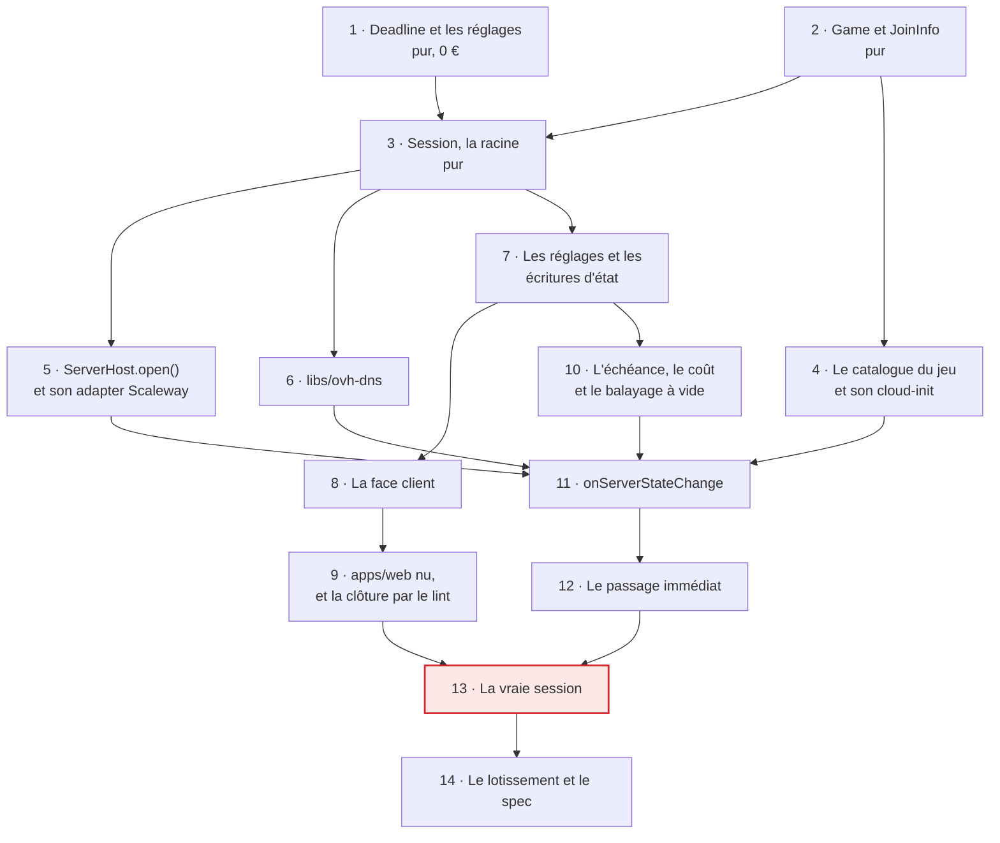

# Tranche 2 — Le cycle

> **For agentic workers:** REQUIRED SUB-SKILL: Use superpowers:subagent-driven-development (recommended) or superpowers:executing-plans to implement this plan task-by-task. Steps use checkbox (`- [ ]`) syntax for tracking.

**But :** une session naît, tourne, se prolonge et meurt à son échéance. Le
navigateur écrit, une Function provisionne, publie le point de jonction et
détruit ; le watchdog fait respecter l'échéance. Sur un monde jetable, sans
authentification, sans sauvegarde.

**Approche :** le noyau de décision d'abord, en tests purs avec un `Clock`
bouchonné — c'est là que vit toute la valeur et c'est le seul endroit qui se
teste sans rien allumer. Les adapters ensuite, chacun contre son double en
mémoire. Les Functions enfin, qui ne font que lire le monde, laisser le domaine
décider, agir et consigner — la forme que la tranche 1 a déjà posée pour le
watchdog. La vraie machine ne s'allume qu'une fois, à la fin, pour éprouver le
seul chemin qu'aucun double ne peut prouver.

**Pile :** Nx 23.2.0, TypeScript 6.0 en ESM `nodenext`, Vitest 4.1, Angular pour
`apps/web`, Firebase Functions gen2 et l'émulateur Firestore, SDK Scaleway pour
`scaleway-compute`, un simple GET HTTP pour `ovh-dns`.

**Spec :** [`docs/superpowers/specs/2026-09-02-game-hosting-design.md`](../specs/2026-09-02-game-hosting-design.md).
Cette tranche implémente le §4 (modèle, ports, `session-record`), le §5 (modèle
de données), le §6 (démarrage, prolongation, arrêt propre, deux lignes de plus au
watchdog) et le §9 pour ce qui les concerne. Le découpage est au
[lotissement](2026-09-02-lotissement.md), que la tâche 14 met à jour.

## Ce que les tranches précédentes laissent

`libs/session` ne porte que le vocabulaire d'état et la décision du watchdog ;
`libs/session-record` que sa face admin ; `libs/scaleway-compute` que `list()`,
`close()` et `sweepUnclaimed()` — **pas d'`open()`**. `apps/functions` tient le
watchdog, le registre des intentions, le battement de cœur et le semis de
`server/current`. `firestore.rules` est fermé et une suite garde qu'il le reste.

Les listes complètes sont en fin des plans de la
[tranche 1](2026-09-04-tranche-1-le-faucheur.md) et de la
[tranche 1 bis](2026-09-05-tranche-1-bis-sonder-le-second-jeu.md). Trois de leurs
lignes commandent ce plan :

- **`terminate` n'est exercé par rien.** C'est ainsi que meurt toute session
  normale, et aucun test ne l'a jamais vu tourner : le serveur du test de
  contrat ne démarre pas. La tâche 13 le ferme.
- **Les intentions se lisent après l'inventaire, jamais à côté.** Tant que rien
  ne créait, l'ordre ne protégeait de rien ; dès `open()`, c'est ce qui empêche
  de détruire une machine née entre deux requêtes.
- **`closedAt: null` dès la création** de `provisioning/{sessionId}`, sans quoi
  `openSessions()` ne rend rien et le watchdog détruit la machine en plein
  provisionnement.

## Quatre décisions prises avec le commanditaire, le 2026-09-06

Elles ne se redécouvrent pas en cours d'exécution.

1. **Pas d'agent dans cette tranche.** Le §6 étape 7 fait constater par l'agent
   que le serveur est prêt ; ici c'est la Function qui conclut, comme le §4 le
   permet pour Enshrouded — « la Function connaît le point de jonction dès que
   l'IP est réservée ». Conséquence assumée : `RUNNING` est écrit alors que le
   jeu télécharge encore ses 8,8 Go, donc pendant cinq à huit minutes il annonce
   un serveur que personne ne peut rejoindre. **Aucun joueur ne le verra jamais**
   — le lotissement interdit tout déploiement public avant la tranche 4, et la
   tranche 3 pose l'agent avant. `agentReport`, le jeton de session et la cadence
   d'une minute partent en tranche 3 avec le compagnon.
2. **`JoinInfo` porte deux formes**, comme le §4 l'a écrit : une interface
   commune, `EnshroudedJoinInfo` et `SunkenlandJoinInfo` en implémentations, un
   composant d'affichage par forme. Cette tranche n'en produit qu'une ; la
   seconde vient avec son entrée de catalogue en tranche 3.
3. **`apps/web` naît nu.** Les cinq états et les trois gestes, aucune direction
   visuelle. C'est un pilote qui exerce la face client, pas un écran : la
   tranche 5 garde tout son périmètre, et `.impeccable/` n'est pas touché.
4. **La tranche se termine par une vraie session facturée**, conduite par un
   humain — c'est le seul moyen d'exercer `terminate` contre l'API réelle.

## Contraintes globales

- **Aucune fusion dans `main`, aucun `firebase deploy`, aucune écriture dans le
  Firestore de production.** La cible est **l'émulateur**, toujours.
- **Aucune ressource facturée n'est créée, modifiée ou détruite par un agent.**
  La tâche 13 est conduite par un humain de bout en bout ; les appels en lecture
  (`list*`, `get*`) sont libres.
- **`firestore.rules` reste fermé et se déploie fermé.** Les règles qui laissent
  le pilote écrire vivent dans `firestore.dev.rules`, chargé par
  `firebase.dev.json` et **jamais référencé par `firebase.json`**. La suite de la
  tranche 1 garde le fichier déployé ; la tâche 9 ajoute le refus qui garde le
  fichier de développement hors du déploiement. Les vraies règles sont la
  tranche 4.
- **Ce qui se génère ne s'écrit pas à la main.** Toute app, lib ou configuration
  de projet passe par `nx g`. Si le générateur ne produit pas ce qu'il faut :
  le lancer d'abord, corriger ensuite.
- **Les deux tags dès la création** (§5) : `beacon` constant, et
  `session:{sessionId}`. Une ressource sans le premier est invisible de la
  réconciliation ; sans le second, elle est orpheline et meurt dans les cinq
  minutes.
- **Les images sont référencées par digest immuable, jamais `latest`** (§10).
- **Aucun identifiant d'API ne monte sur la VM** (§7). En tranche 2 le
  `cloud-init` ne porte que la configuration du serveur de jeu : ni clé Scaleway,
  ni clé S3, ni jeton.
- **Le mot de passe du serveur de jeu est un secret de Function**, lu depuis
  Secret Manager, jamais commité, jamais journalisé, jamais recopié dans un
  message de commit ou dans un rapport.
- Code, noms de fichiers et commentaires en **anglais** ; plan, documentation et
  messages de commit en **français**.
- Commits en Conventional Commits, description française à l'impératif, portée =
  le projet Nx touché — `session`, `session-record`, `scaleway-compute`,
  `ovh-dns`, `cloud-init`, `functions`, `web`, `rules` — ou l'artefact pour ce qui
  n'est pas du code : `spec`, `plan`, `deploy`.
- Node 22 et Temurin 21 (l'émulateur Firestore tourne sur la JVM), pinés par
  `mise.toml`. Toute commande se lance depuis la racine du dépôt.
- **Budget de la tâche 13 : moins de 0,30 €.** Une `DEV1-L` à 0,04284 €/h, son
  disque à ~0,0067 €/h et son IP à 0,005 €/h, deux heures entamées sur trois
  lignes séparées.

## L'ordre, et ce qui le produit



La tâche 13 est la seule que personne d'autre qu'un humain ne lance : elle crée
une instance facturée, y fait jouer quelqu'un, et la détruit.

## Ce que la tranche ne construit pas

Hors périmètre par décision, pas par oubli. Une tâche qui semble en réclamer une
est une tâche mal lue.

- **Pas d'agent, pas d'`agentReport`, pas de jeton de session.** Décision 1
  ci-dessus. `agentTokens/{sessionId}` n'est ni créé ni lu.
- **Pas de compagnon, pas de `SaveStore`, pas de `scaleway-storage`.** Aucune
  sauvegarde n'est restaurée ni poussée : le monde de cette tranche est jetable,
  et c'est ce que le gate de la tranche 3 protège.
- **Pas d'entrée Sunkenland dans le catalogue.** Ce jeu ne peut pas démarrer
  avant que ses 2,3 Go soient restaurés, donc avant le compagnon.
- **Pas de `firestore.rules` de production, pas d'authentification, pas de
  `members`, pas de `membership-record`.** C'est la tranche 4, et son gate.
- **Pas de direction visuelle.** Décision 3. Pas de Tailwind, pas de Playwright,
  pas une couleur du contrat de direction : `apps/web` est un pilote.
- **Pas de `tools/game-depot`, pas de `saves/{id}`, pas de cumul du mois.**
  `SessionStopped` gagne son coût estimé (§11) ; le totaliser est un écran.
- **Pas d'index composite.** La seule requête ajoutée est une égalité, servie
  par l'index automatique.
- **Pas de mise en pause automatique du watchdog.** L'idée a été posée le
  2026-09-06 et écartée le jour même ; la tâche 12 dit pourquoi. Ce qu'elle
  visait est livré autrement, et sans rien retirer : le passage immédiat
  (tâche 12) pour la réactivité, et l'espacement du balayage à vide (tâche 10)
  pour les joules — le job, lui, continue de se déclencher toutes les cinq
  minutes.
- **Pas de garde-fou de dérive entre onglets.** `rulesVersion` est semé à
  `null` ; c'est le déploiement qui l'écrit à chaque fusion (§4, §10), et
  l'écran qui le lit — tranches 4 et 5. Un pilote qu'on relance à la main n'a
  pas d'onglet d'hier.
- **Pas de politique TTL sur `events`.** Le champ `expiresAt` est écrit dès
  maintenant, pour que les documents en aient un le jour où la politique
  existe ; la poser est un geste de console sur le projet de production, donc
  la tranche 4.

---

### Task 1: `Deadline` et les réglages de session

Le cœur du produit tient en une phrase du `CLAUDE.md` : le serveur naît avec son
heure de fin déjà fixée, prolongeable d'une heure autant de fois qu'on veut mais
seulement dans les trente dernières minutes. Cette tâche écrit cette phrase, et
rien d'autre — pas de Firestore, pas d'hébergeur, un `Clock` bouchonné.

`Deadline` est un objet valeur immuable : prolonger ne le mute pas, il en rend
un autre. C'est ce qui rend le clampage du §4 possible sans effet de bord — la
lecture applique la même borne que l'écriture, et le décompte ne recule jamais.

**Fichiers :**
- Créer : `libs/session/src/lib/settings.ts`
- Créer : `libs/session/src/lib/deadline.ts`
- Créer : `libs/session/src/lib/deadline.spec.ts`
- Modifier : `libs/session/src/index.ts`

**Interfaces :**
- Consomme : `Clock` de `libs/session/src/lib/ports.ts`.
- Produit : `SessionSettings`, `DEFAULT_SETTINGS`, `InstanceSize`, et la classe
  `Deadline` avec `Deadline.at(instant)`, `Deadline.opening(clock, settings)`,
  `.at` (lecture), `.isWithinExtensionWindow(clock, settings)`,
  `.extended(settings)`, `.clampedTo(clock, settings)`,
  `.isPastBy(clock, graceMs)`. Les tâches 3, 7 et 10 en dépendent.

- [ ] **Step 1: Écrire les réglages**

`libs/session/src/lib/settings.ts` :

```ts
/**
 * The provider's word for a machine size stops at the adapter (§4): `flavor`
 * at OpenStack, *commercial type* at Scaleway. The domain only ever carries
 * the string, and never reads it.
 */
export type InstanceSize = string;

/**
 * What `config/settings` holds, as the domain needs it. It is read, never
 * decided here: an admin edits the document, and every process — browser,
 * function, watchdog — computes from the same values.
 */
export interface SessionSettings {
  /** How far ahead an opening session may close. Also the clamp bound (§6). */
  readonly sessionDurationMs: number;
  /** One click of the button. */
  readonly extensionStepMs: number;
  /** How long before closing the button becomes clickable. */
  readonly extensionWindowMs: number;
  readonly defaultInstanceSize: InstanceSize;
  /**
   * Per size, and all-inclusive: instance, local disk and ip. The three are
   * billed together by the started hour (§11), so one rate per size is the
   * honest unit — splitting them would invite adding them up wrong.
   */
  readonly tariffPerHour: Readonly<Record<InstanceSize, number>>;
}

/**
 * What §2 and §11 say, and what the seed writes. It is a fallback and not the
 * truth: the document wins, because a provider changes its prices and a rate
 * compiled into a bundle would silently lie about the only figure this product
 * shows on money (§5).
 */
export const DEFAULT_SETTINGS: SessionSettings = {
  sessionDurationMs: 4 * 60 * 60_000,
  extensionStepMs: 60 * 60_000,
  extensionWindowMs: 30 * 60_000,
  defaultInstanceSize: 'DEV1-L',
  tariffPerHour: { 'DEV1-L': 0.05454 },
};
```

- [ ] **Step 2: Écrire les tests qui échouent**

`libs/session/src/lib/deadline.spec.ts` :

```ts
import { describe, expect, it } from 'vitest';
import { Deadline } from './deadline.js';
import { DEFAULT_SETTINGS } from './settings.js';

const at = (iso: string) => ({ now: () => new Date(iso) });
const S = DEFAULT_SETTINGS;

describe('Deadline', () => {
  it('opens one session duration ahead of now', () => {
    expect(Deadline.opening(at('2026-09-06T20:00:00Z'), S).at).toEqual(
      new Date('2026-09-07T00:00:00Z'),
    );
  });

  it('closes the extension window while more than its width remains', () => {
    const deadline = Deadline.at(new Date('2026-09-07T00:00:00Z'));
    expect(deadline.isWithinExtensionWindow(at('2026-09-06T23:29:59Z'), S)).toBe(false);
  });

  it('opens the extension window on the exact minute it becomes true', () => {
    const deadline = Deadline.at(new Date('2026-09-07T00:00:00Z'));
    expect(deadline.isWithinExtensionWindow(at('2026-09-06T23:30:00Z'), S)).toBe(true);
  });

  // The button is dead once the deadline is behind us: what follows is a
  // shutdown, not an evening someone can still save.
  it('closes the window again once the deadline is past', () => {
    const deadline = Deadline.at(new Date('2026-09-07T00:00:00Z'));
    expect(deadline.isWithinExtensionWindow(at('2026-09-07T00:00:01Z'), S)).toBe(false);
  });

  // From the deadline, never from now. Extending at 23:45 for a midnight
  // closing has to buy an hour of play, not fifteen minutes of it.
  it('pushes one step past the deadline, not past now', () => {
    const deadline = Deadline.at(new Date('2026-09-07T00:00:00Z'));
    expect(deadline.extended(S).at).toEqual(new Date('2026-09-07T01:00:00Z'));
  });

  it('leaves an honest deadline alone when clamping', () => {
    const deadline = Deadline.at(new Date('2026-09-06T23:00:00Z'));
    expect(deadline.clampedTo(at('2026-09-06T20:00:00Z'), S).at).toEqual(
      new Date('2026-09-06T23:00:00Z'),
    );
  });

  // §6: a forged deadline is brought back to the bound. §4: the same bound is
  // applied on read, so the countdown never walks backwards on screen.
  it('brings a forged deadline back to one session duration ahead', () => {
    const forged = Deadline.at(new Date('2026-09-07T08:00:00Z'));
    expect(forged.clampedTo(at('2026-09-06T20:00:00Z'), S).at).toEqual(
      new Date('2026-09-07T00:00:00Z'),
    );
  });

  it('answers whether it is past by more than a grace period', () => {
    const deadline = Deadline.at(new Date('2026-09-07T00:00:00Z'));
    expect(deadline.isPastBy(at('2026-09-07T00:01:59Z'), 2 * 60_000)).toBe(false);
    expect(deadline.isPastBy(at('2026-09-07T00:02:01Z'), 2 * 60_000)).toBe(true);
  });

  it('is a value: two deadlines on the same instant are equal', () => {
    const instant = new Date('2026-09-07T00:00:00Z');
    expect(Deadline.at(instant).equals(Deadline.at(new Date(instant)))).toBe(true);
  });
});
```

- [ ] **Step 3: Lancer les tests et les voir échouer**

```bash
npx nx test session
```

Attendu : échec à la compilation, `./deadline.js` n'existant pas. C'est le bon
échec — un module absent, pas une assertion fausse.

- [ ] **Step 4: Écrire `Deadline`**

`libs/session/src/lib/deadline.ts` :

```ts
import type { Clock } from './ports.js';
import type { SessionSettings } from './settings.js';

/**
 * The instant a session closes. Immutable: extending returns another one.
 *
 * It carries the reading of time and not the writing of it — which is what
 * lets §4's clamp be applied on read as well as on write. A mutable deadline
 * would make "the value shown is already the one the watchdog converges to"
 * a promise instead of a property.
 */
export class Deadline {
  private constructor(private readonly instant: Date) {}

  static at(instant: Date): Deadline {
    // Copied, because a Date is mutable and the caller keeps a reference to
    // the one it passed in. A value object that a caller can move is not one.
    return new Deadline(new Date(instant.getTime()));
  }

  static opening(clock: Clock, settings: SessionSettings): Deadline {
    return Deadline.at(new Date(clock.now().getTime() + settings.sessionDurationMs));
  }

  get at(): Date {
    return new Date(this.instant.getTime());
  }

  isWithinExtensionWindow(clock: Clock, settings: SessionSettings): boolean {
    const remaining = this.instant.getTime() - clock.now().getTime();
    // Strictly positive: once the deadline is behind us there is no evening
    // left to extend, only a shutdown to watch.
    return remaining > 0 && remaining <= settings.extensionWindowMs;
  }

  extended(settings: SessionSettings): Deadline {
    return Deadline.at(new Date(this.instant.getTime() + settings.extensionStepMs));
  }

  clampedTo(clock: Clock, settings: SessionSettings): Deadline {
    const bound = clock.now().getTime() + settings.sessionDurationMs;
    return this.instant.getTime() <= bound ? this : Deadline.at(new Date(bound));
  }

  isPastBy(clock: Clock, graceMs: number): boolean {
    return clock.now().getTime() - this.instant.getTime() > graceMs;
  }

  equals(other: Deadline): boolean {
    return this.instant.getTime() === other.instant.getTime();
  }
}
```

- [ ] **Step 5: Exporter, et lancer les tests**

Ajouter à `libs/session/src/index.ts`, dans l'ordre alphabétique des chemins :

```ts
export * from './lib/deadline.js';
export * from './lib/settings.js';
```

```bash
npx nx test session && npx nx typecheck session
```

Attendu : tous verts, y compris les tests du watchdog de la tranche 1.

- [ ] **Step 6: Commit**

```bash
git add libs/session/src/lib/deadline.ts libs/session/src/lib/deadline.spec.ts libs/session/src/lib/settings.ts libs/session/src/index.ts
git commit -m "feat(session): fait de l'echeance un objet valeur qui borne a la lecture"
```

---

### Task 2: `Game` et `JoinInfo`

Deux objets valeur que le domaine transporte sans jamais les interpréter. Le
premier dit quel jeu la session ouvre — **rien d'autre**, ni image, ni port, ni
chemin de sauvegarde (§4). Le second dit ce que le joueur copie pour rejoindre,
et il porte deux formes parce que les deux jeux ne se rejoignent pas de la même
façon : Enshrouded par une adresse, Sunkenland par un identifiant de serveur que
la sonde du 2026-09-05 a mesuré comme n'ayant besoin d'aucune IP stable.

Les deux formes sont déclarées ici, **une seule est produite** dans cette
tranche : l'affichage et le catalogue de Sunkenland arrivent en tranche 3. Le
type est écrit en entier maintenant pour que la tranche 3 ajoute une entrée de
catalogue et un composant, pas une refonte du modèle.

**Fichiers :**
- Créer : `libs/session/src/lib/game.ts`
- Créer : `libs/session/src/lib/join-info.ts`
- Créer : `libs/session/src/lib/join-info.spec.ts`
- Modifier : `libs/session/src/index.ts`

**Interfaces :**
- Consomme : rien.
- Produit : `GAMES`, `Game`, `isGame(value)` ; `JoinInfo`,
  `EnshroudedJoinInfo`, `SunkenlandJoinInfo`, et le garde
  `isEnshroudedJoinInfo(info)` et `publishedAddressOf(info)`. Les tâches 3, 4,
  7, 9 et 11 en dépendent.

- [ ] **Step 1: Écrire `Game`**

`libs/session/src/lib/game.ts` :

```ts
/**
 * Which game a session opens. Frozen at opening and never changed (§4): the
 * restored world, the container launched and the join point published all
 * depend on it, and no gesture can swap games without destroying the machine
 * — which is precisely another session.
 */
export const GAMES = ['enshrouded', 'sunkenland'] as const;

export type Game = (typeof GAMES)[number];

export function isGame(value: unknown): value is Game {
  return GAMES.includes(value as Game);
}
```

- [ ] **Step 2: Écrire les tests de `JoinInfo` qui échouent**

`libs/session/src/lib/join-info.spec.ts` :

```ts
import { describe, expect, it } from 'vitest';
import { isEnshroudedJoinInfo, type JoinInfo } from './join-info.js';

describe('JoinInfo', () => {
  it('recognises the shape that carries an address', () => {
    const info: JoinInfo = {
      game: 'enshrouded',
      hostname: 'enshrouded.beacon.charlouze.com',
      address: '51.15.42.7',
      port: 15637,
    };
    expect(isEnshroudedJoinInfo(info)).toBe(true);
  });

  // The measurement of 2026-09-05: this game announces no address at all, and
  // the player finds the server in a list. Nothing here is pointable by dns,
  // which is why `DnsUpdater` is not called for it (§4).
  it('recognises the shape that carries none', () => {
    const info: JoinInfo = {
      game: 'sunkenland',
      serverId: '4db51c84-24cf-459e-9e9e-88b8c3a7ce3b~1757102400',
      region: 'eu',
      worldName: "Beacon's World",
    };
    expect(isEnshroudedJoinInfo(info)).toBe(false);
  });
});
```

- [ ] **Step 3: Lancer les tests et les voir échouer**

```bash
npx nx test session
```

Attendu : `./join-info.js` introuvable.

- [ ] **Step 4: Écrire `JoinInfo`**

`libs/session/src/lib/join-info.ts` :

```ts
import type { Game } from './game.js';

/**
 * What the player copies to join. The domain never reads any of these fields:
 * it carries the value and knows only whether it exists — `RUNNING` means the
 * join point is published (§4).
 *
 * Two shapes, and the second game is what revealed it. As long as there was
 * one, "joining" was spelled `ip` and nobody saw the confusion. What the two
 * have in common is not an address, it is *what the player copies*.
 *
 * Both shapes carry a main way and a fallback, which `PRODUCT.md` asked for
 * before either existed: the raw address when dns fails, the world's name in
 * the server list when the identifier is lost.
 *
 * The discriminant is `game` and not a separate `kind`: a session already
 * carries its game, frozen at opening, and a second field saying the same
 * thing could disagree with the first.
 */
export interface EnshroudedJoinInfo {
  readonly game: 'enshrouded';
  /** The main way in. */
  readonly hostname: string;
  /** The fallback, for the evening dns is down (§8). */
  readonly address: string;
  readonly port: number;
}

/**
 * Measured on 2026-09-05: no floating ip and no dns record serve this game.
 * The identifier is regenerated at every boot — it is the world's guid
 * followed by the boot instant — so it cannot be known in advance, and the
 * world's name is how a player finds the server when it is lost.
 *
 * Produced from tranche 3, with the catalogue entry that boots this game.
 */
export interface SunkenlandJoinInfo {
  readonly game: 'sunkenland';
  readonly serverId: string;
  readonly region: string;
  readonly worldName: string;
}

export type JoinInfo = EnshroudedJoinInfo | SunkenlandJoinInfo;

export function isEnshroudedJoinInfo(info: JoinInfo): info is EnshroudedJoinInfo {
  return info.game === 'enshrouded';
}

/**
 * Whether publishing this join point means pointing a dns record somewhere.
 * True for one game, false for the other — and it lives here rather than in a
 * branch of the flow, because a port one does not call is cheaper than a port
 * made optional (§4).
 */
export function publishedAddressOf(info: JoinInfo): string | null {
  return isEnshroudedJoinInfo(info) ? info.address : null;
}
```

- [ ] **Step 5: Compléter le test avec `publishedAddressOf`**

Ajouter à `libs/session/src/lib/join-info.spec.ts` :

```ts
  it('yields the address a dns record must point at, when there is one', () => {
    const info: JoinInfo = {
      game: 'enshrouded',
      hostname: 'enshrouded.beacon.charlouze.com',
      address: '51.15.42.7',
      port: 15637,
    };
    expect(publishedAddressOf(info)).toBe('51.15.42.7');
  });

  it('yields none for a game joined without an address', () => {
    const info: JoinInfo = {
      game: 'sunkenland',
      serverId: '4db51c84-24cf-459e-9e9e-88b8c3a7ce3b~1757102400',
      region: 'eu',
      worldName: "Beacon's World",
    };
    expect(publishedAddressOf(info)).toBeNull();
  });
```

Compléter l'import en tête de fichier :

```ts
import { isEnshroudedJoinInfo, publishedAddressOf, type JoinInfo } from './join-info.js';
```

- [ ] **Step 6: Exporter, et lancer les tests**

Ajouter à `libs/session/src/index.ts` :

```ts
export * from './lib/game.js';
export * from './lib/join-info.js';
```

```bash
npx nx test session && npx nx typecheck session
```

Attendu : vert.

- [ ] **Step 7: Commit**

```bash
git add libs/session/src/lib/game.ts libs/session/src/lib/join-info.ts libs/session/src/lib/join-info.spec.ts libs/session/src/index.ts
git commit -m "feat(session): nomme le jeu et le point de jonction, une forme par jeu"
```

---

### Task 3: `Session`, la racine

La seule porte d'entrée du modèle (§4). Elle expose `extend`, `requestStop`,
`displayedDeadline` et `estimatedCost`, et elle refuse les transitions
illégales. C'est le noyau que les trois processus rejouent — le navigateur pour
savoir quoi proposer, la Function pour ce qu'elle décide seule, le watchdog pour
constater ce qui a dérivé — donc le calcul n'existe qu'une fois dans le dépôt.

Elle ne voit jamais les champs réservés de `server/current` : `instanceId`,
`ipId`, `ip`, `provisionClaimedAt`, `lastError` sont des faits d'infrastructure.
`joinInfo` est la seule exception, et seulement en lecture — elle sait dire s'il
existe, jamais ce qu'il contient.

**Fichiers :**
- Créer : `libs/session/src/lib/session-aggregate.ts`
- Créer : `libs/session/src/lib/session-aggregate.spec.ts`
- Modifier : `libs/session/src/lib/events.ts`
- Modifier : `libs/session/src/index.ts`

**Interfaces :**
- Consomme : `Deadline`, `SessionSettings`, `InstanceSize` (tâche 1), `Game`,
  `JoinInfo` (tâche 2), `Clock`, `SessionId`, `SessionState`.
- Produit : la classe `Session` — `Session.opening(...)`, `Session.from(...)`,
  `.state`, `.sessionId`, `.game`, `.deadline`, `.canExtend(clock, settings)`,
  `.extend(clock, settings)`, `.requestStop(actor, clock)`,
  `.displayedDeadline(clock, settings)`, `.estimatedCost(clock, settings)` — et
  les événements `SessionStarted`, `SessionExtended`, `SessionStopRequested`,
  `DeadlineClamped`. Les tâches 7, 8, 10 et 11 en dépendent.

- [ ] **Step 1: Étendre le vocabulaire des événements**

Dans `libs/session/src/lib/events.ts`, ajouter à l'union `DomainEvent`, avant
`SessionReclaimed` :

```ts
  /**
   * Written by the browser, in the same write as the passage to PROVISIONING.
   * It is the only place that keeps the display name of whoever opened the
   * evening: `members` is read by admins only (§5), so the audit trail is
   * where a name may travel.
   */
  | { type: 'SessionStarted'; sessionId: SessionId; detail: string }
  | { type: 'SessionExtended'; sessionId: SessionId; detail: string }
  /**
   * Written by the browser in the same write as STOPPING. It is the only
   * record of *who* cut the evening — without it, ending someone else's
   * session would be the one anonymous gesture of the system (§4).
   */
  | { type: 'SessionStopRequested'; sessionId: SessionId; detail: string }
  /**
   * A deadline was forged past the bound and brought back (§6). It is audited
   * and never shown: the interface already clamps on read, so the countdown
   * does not walk backwards under the players' eyes (§4).
   */
  | { type: 'DeadlineClamped'; sessionId: SessionId; detail: string }
```

- [ ] **Step 2: Écrire les tests qui échouent**

`libs/session/src/lib/session-aggregate.spec.ts` :

```ts
import { describe, expect, it } from 'vitest';
import { Deadline } from './deadline.js';
import { Session } from './session-aggregate.js';
import { DEFAULT_SETTINGS } from './settings.js';

const at = (iso: string) => ({ now: () => new Date(iso) });
const S = DEFAULT_SETTINGS;
const ACTOR = { uid: 'u1', name: 'Alice' };

const running = (deadlineIso: string) =>
  Session.from({
    state: 'RUNNING',
    sessionId: 's1',
    game: 'enshrouded',
    startedBy: 'u1',
    startedAt: new Date('2026-09-06T20:00:00Z'),
    deadline: Deadline.at(new Date(deadlineIso)),
    instanceSize: 'DEV1-L',
    hasJoinInfo: true,
  });

describe('Session', () => {
  it('opens from nothing with a deadline one session duration ahead', () => {
    const opened = Session.opening(
      { sessionId: 's1', game: 'enshrouded', actor: ACTOR },
      at('2026-09-06T20:00:00Z'),
      S,
    );
    expect(opened.session.state).toBe('PROVISIONING');
    expect(opened.session.deadline.at).toEqual(new Date('2026-09-07T00:00:00Z'));
    expect(opened.events).toEqual([
      { type: 'SessionStarted', sessionId: 's1', detail: 'Alice opened enshrouded' },
    ]);
  });

  // §5: `instanceSize` is an admin's field. A member's opening must record
  // none at all — the function applies the deployed default, and tranche 4's
  // rules would refuse the write outright.
  it('records no size when nobody chose one', () => {
    const opened = Session.opening(
      { sessionId: 's1', game: 'enshrouded', actor: ACTOR },
      at('2026-09-06T20:00:00Z'),
      S,
    );
    expect(opened.session.instanceSize).toBeNull();
    expect(opened.session.estimatedCost(at('2026-09-06T21:00:00Z'), S)).toBe(0);
  });

  it('refuses to extend outside the window', () => {
    const session = running('2026-09-07T00:00:00Z');
    expect(session.canExtend(at('2026-09-06T22:00:00Z'), S)).toBe(false);
    expect(() => session.extend(ACTOR, at('2026-09-06T22:00:00Z'), S)).toThrow(
      /extension window/,
    );
  });

  // Extending is a collective act on a shared resource, not a counter each
  // person increments (§6): two clicks in the same second write the same
  // value, and the session gains one hour rather than two.
  it('extends by one step inside the window, and audits it', () => {
    const session = running('2026-09-07T00:00:00Z');
    const extended = session.extend(ACTOR, at('2026-09-06T23:45:00Z'), S);
    expect(extended.session.deadline.at).toEqual(new Date('2026-09-07T01:00:00Z'));
    expect(extended.events).toEqual([
      { type: 'SessionExtended', sessionId: 's1', detail: 'Alice extended to 01:00 UTC' },
    ]);
  });

  it('refuses a transition the state machine does not draw', () => {
    const idle = Session.idle();
    expect(idle.canRequestStop()).toBe(false);
    expect(() => idle.requestStop(ACTOR, at('2026-09-06T20:00:00Z'))).toThrow(/IDLE/);
  });

  it('requests a stop from RUNNING, and keeps who asked', () => {
    const stopped = running('2026-09-07T00:00:00Z').requestStop(
      ACTOR,
      at('2026-09-06T22:00:00Z'),
    );
    expect(stopped.session.state).toBe('STOPPING');
    expect(stopped.events).toEqual([
      { type: 'SessionStopRequested', sessionId: 's1', detail: 'Alice asked to stop' },
    ]);
  });

  // §4: the shown value is already the one the watchdog converges to, so the
  // countdown never walks backwards.
  it('shows a forged deadline already brought back to the bound', () => {
    const session = running('2026-09-07T08:00:00Z');
    expect(session.displayedDeadline(at('2026-09-06T20:00:00Z'), S).at).toEqual(
      new Date('2026-09-07T00:00:00Z'),
    );
  });

  // §11: the started hour is due, on each resource separately, and the rate
  // of a size already adds the three lines up.
  it('charges the started hour, never the fraction', () => {
    const session = running('2026-09-07T00:00:00Z');
    expect(session.estimatedCost(at('2026-09-06T20:01:00Z'), S)).toBeCloseTo(0.05, 2);
    expect(session.estimatedCost(at('2026-09-06T23:30:00Z'), S)).toBeCloseTo(0.22, 2);
  });

  it('charges nothing for a size no tariff names', () => {
    const session = Session.from({
      state: 'RUNNING',
      sessionId: 's1',
      game: 'enshrouded',
      startedBy: 'u1',
      startedAt: new Date('2026-09-06T20:00:00Z'),
      deadline: Deadline.at(new Date('2026-09-07T00:00:00Z')),
      instanceSize: 'GP1-XS',
      hasJoinInfo: true,
    });
    expect(session.estimatedCost(at('2026-09-06T21:00:00Z'), S)).toBe(0);
  });
});
```

- [ ] **Step 3: Lancer les tests et les voir échouer**

```bash
npx nx test session
```

Attendu : `./session-aggregate.js` introuvable.

- [ ] **Step 4: Écrire `Session`**

`libs/session/src/lib/session-aggregate.ts` :

```ts
import { Deadline } from './deadline.js';
import type { DomainEvent } from './events.js';
import type { Game } from './game.js';
import type { Clock } from './ports.js';
import type { SessionId, SessionState } from './session.js';
import type { InstanceSize, SessionSettings } from './settings.js';

/** Who acts. The name travels because a journal of uids does not read (§5). */
export interface Actor {
  readonly uid: string;
  readonly name: string;
}

/**
 * A session as the domain holds it. The reserved facts of §5 are absent by
 * construction — `instanceId`, `ipId`, `ip`, `provisionClaimedAt`,
 * `lastError` are infrastructure, and only the watchdog confronts them with
 * what `ServerHost` declares.
 *
 * `hasJoinInfo` and not the join point itself: the domain knows whether it
 * exists — that is what `RUNNING` means (§4) — and never what it contains.
 */
export interface SessionFields {
  readonly state: SessionState;
  readonly sessionId: SessionId;
  readonly game: Game;
  readonly startedBy: string;
  readonly startedAt: Date;
  readonly deadline: Deadline;
  /**
   * Null until something records one. §5 reserves this field to an admin, so
   * an ordinary member's opening must not write it at all — the function
   * applies the default from `config/settings` and publishes the size that was
   * actually provisioned. Falling back to a compiled constant here would let
   * the bundle's idea of the default quietly win over the deployed one.
   */
  readonly instanceSize: InstanceSize | null;
  readonly hasJoinInfo: boolean;
}

/** A decision, and the facts it wants written down. Never one without the other. */
export interface SessionDecision {
  readonly session: Session;
  readonly events: readonly DomainEvent[];
}

export interface OpeningRequest {
  readonly sessionId: SessionId;
  readonly game: Game;
  readonly actor: Actor;
  /** Admin only; the function applies the default when it is absent (§5). */
  readonly instanceSize?: InstanceSize;
}

/**
 * The aggregate root, and the only door into the model (§4).
 *
 * It is a shared decision core and not a guard: the browser runs it to know
 * what to offer, the functions for what they decide alone, the watchdog to
 * see what drifted. Which is why every refusal here is a `throw` and not a
 * silent correction — a caller that ignores `canExtend` has a bug, and the
 * real barrier against a forged write is the watchdog, five minutes later.
 */
export class Session {
  private constructor(private readonly fields: SessionFields | null) {}

  /** No session: `server/current` seeded as IDLE, with everything null. */
  static idle(): Session {
    return new Session(null);
  }

  static from(fields: SessionFields): Session {
    return new Session(fields);
  }

  static opening(
    request: OpeningRequest,
    clock: Clock,
    settings: SessionSettings,
  ): SessionDecision {
    const session = new Session({
      state: 'PROVISIONING',
      sessionId: request.sessionId,
      game: request.game,
      startedBy: request.actor.uid,
      startedAt: clock.now(),
      deadline: Deadline.opening(clock, settings),
      // Only what was asked for. An absent size is an ordinary member opening
      // a session, and §5 says the field is not theirs to write.
      instanceSize: request.instanceSize ?? null,
      hasJoinInfo: false,
    });
    return {
      session,
      events: [
        {
          type: 'SessionStarted',
          sessionId: request.sessionId,
          detail: `${request.actor.name} opened ${request.game}`,
        },
      ],
    };
  }

  get state(): SessionState {
    return this.fields?.state ?? 'IDLE';
  }

  get sessionId(): SessionId | null {
    return this.fields?.sessionId ?? null;
  }

  get game(): Game | null {
    return this.fields?.game ?? null;
  }

  get startedBy(): string {
    return this.required().startedBy;
  }

  get instanceSize(): InstanceSize | null {
    return this.fields?.instanceSize ?? null;
  }

  get deadline(): Deadline {
    return this.required().deadline;
  }

  canExtend(clock: Clock, settings: SessionSettings): boolean {
    return (
      this.fields !== null &&
      this.fields.state === 'RUNNING' &&
      this.fields.deadline.isWithinExtensionWindow(clock, settings)
    );
  }

  extend(actor: Actor, clock: Clock, settings: SessionSettings): SessionDecision {
    const fields = this.required();
    if (!this.canExtend(clock, settings)) {
      throw new Error(
        `cannot extend a ${fields.state} session outside its extension window`,
      );
    }
    const deadline = fields.deadline.extended(settings);
    return {
      session: new Session({ ...fields, deadline }),
      events: [
        {
          type: 'SessionExtended',
          sessionId: fields.sessionId,
          detail: `${actor.name} extended to ${hourOf(deadline)}`,
        },
      ],
    };
  }

  canRequestStop(): boolean {
    return this.fields?.state === 'RUNNING' || this.fields?.state === 'PROVISIONING';
  }

  requestStop(actor: Actor, clock: Clock): SessionDecision {
    const fields = this.required();
    if (!this.canRequestStop()) {
      throw new Error(`cannot stop a ${fields.state} session`);
    }
    // `clock` is taken and not used to compute: the instant of the passage is
    // `stateSince`, and it is `request.time` at the record's frontier (§5) so
    // that no client can backdate it. Taking it here keeps every decision of
    // this class a function of the same clock, which is what the tests pin.
    void clock;
    return {
      session: new Session({ ...fields, state: 'STOPPING' }),
      events: [
        {
          type: 'SessionStopRequested',
          sessionId: fields.sessionId,
          detail: `${actor.name} asked to stop`,
        },
      ],
    };
  }

  /**
   * The bound applied on read. Without it a forged deadline, once the watchdog
   * brings it back, would make the countdown jump backwards on a screen whose
   * whole principle is that the closing time is an announced fact (§4).
   */
  displayedDeadline(clock: Clock, settings: SessionSettings): Deadline {
    return this.required().deadline.clampedTo(clock, settings);
  }

  /**
   * §11: the started hour is due, and each resource carries its own 60-minute
   * minimum — so a rate already sums instance, disk and ip. An unknown size
   * charges zero rather than guessing: a made-up figure on the only number
   * this product shows about money would be worse than none.
   */
  estimatedCost(clock: Clock, settings: SessionSettings): number {
    const fields = this.required();
    if (fields.instanceSize === null) return 0;
    const rate = settings.tariffPerHour[fields.instanceSize];
    if (rate === undefined) return 0;
    const elapsedMs = clock.now().getTime() - fields.startedAt.getTime();
    const billedHours = Math.max(1, Math.ceil(elapsedMs / 3_600_000));
    return Math.round(billedHours * rate * 100) / 100;
  }

  private required(): SessionFields {
    if (this.fields === null) {
      throw new Error('no session is open: server/current is IDLE');
    }
    return this.fields;
  }
}

/** `HH:MM UTC`, for an audit line a human reads. */
function hourOf(deadline: Deadline): string {
  return `${deadline.at.toISOString().slice(11, 16)} UTC`;
}
```

- [ ] **Step 5: Exporter, et lancer les tests**

Ajouter à `libs/session/src/index.ts` :

```ts
export * from './lib/session-aggregate.js';
```

```bash
npx nx test session && npx nx typecheck session && npx nx lint session
```

Attendu : vert. Si `noUnusedLocals` se plaint de `clock` dans `requestStop`,
c'est que le `void clock;` a été retiré — le paramètre fait partie de la
signature parce que tous les gestes du domaine se datent du même horloge, et son
absence rendrait la classe incohérente pour économiser une ligne.

- [ ] **Step 6: Commit**

```bash
git add libs/session/src/lib/session-aggregate.ts libs/session/src/lib/session-aggregate.spec.ts libs/session/src/lib/events.ts libs/session/src/index.ts
git commit -m "feat(session): ouvre, prolonge et arrete une session dans un seul noyau de decision"
```

---

### Task 4: Le catalogue du jeu, et son `cloud-init`

`deploy/cloud-init/games/` est le seul endroit du dépôt qui sait qu'un serveur
Enshrouded écoute en `15637/udp` et que son mot de passe passe par
`SERVER_ROLE_0_PASSWORD` (§4). Cette tâche le fait naître, et **fait passer les
artefacts de la tranche 0 du disque au TypeScript**.

C'est un déplacement, pas une réécriture, et il a une raison unique : la Function
qui provisionne est un bundle esbuild, et un `readFileSync` relatif au module n'y
survit pas. Un gabarit qui reste sur le disque serait lu correctement en test et
introuvable en production — la pire des deux pannes. Ce que la tranche 0 a
mesuré ne change pas d'une ligne ; seul son support change, et une cible `render`
le rend au disque pour le test de fumée de la tranche 3.

**Fichiers :**
- Créer : `deploy/cloud-init/` comme projet Nx `@beacon/cloud-init` (généré)
- Créer : `deploy/cloud-init/src/lib/enshrouded.ts`
- Créer : `deploy/cloud-init/src/lib/enshrouded.spec.ts`
- Créer : `deploy/cloud-init/src/lib/catalog.ts`
- Créer : `deploy/cloud-init/src/render.ts`
- Modifier : `deploy/cloud-init/package.json` (cibles `render`)
- Modifier : `eslint.config.mjs`
- Modifier : `deploy/README.md`
- Supprimer : `deploy/render-cloud-init.mjs`, `deploy/cloud-init/enshrouded.yaml.tmpl`,
  `deploy/docker-compose.yml`

**Interfaces :**
- Consomme : `Game`, `JoinInfo` (tâche 2).
- Produit : `@beacon/cloud-init` exportant `BootRequest`, `GameCatalogEntry`,
  `catalogFor(game)`, `renderCloudInit(game, request)`,
  `renderCompose(game)`. Les tâches 11 et 13 en dépendent.

- [ ] **Step 1: Générer le projet, à blanc d'abord**

```bash
npx nx g @nx/js:library deploy/cloud-init --name=cloud-init --importPath=@beacon/cloud-init --bundler=tsc --unitTestRunner=vitest --linter=eslint --dry-run
```

Lire ce qu'il annonce : il écrit dans un dossier qui contient déjà
`enshrouded.yaml.tmpl`. Si le générateur refuse à cause de ce fichier, le
déplacer d'abord — son contenu part de toute façon dans le TypeScript à
l'étape 4 :

```bash
git mv deploy/cloud-init/enshrouded.yaml.tmpl deploy/enshrouded.yaml.tmpl.bak
```

Puis relancer sans `--dry-run`.

Vérifier que le projet est vu par le graphe, et **ne pas corriger à la main** ce
que le générateur n'aurait pas fait — le relancer :

```bash
npx nx show project cloud-init
```

- [ ] **Step 2: Poser l'étiquette de portée**

Dans `deploy/cloud-init/package.json`, sous la clé `nx` :

```json
    "tags": [
      "scope:catalog"
    ]
```

Dans `eslint.config.mjs`, ajouter la contrainte après celle de `scope:adapter` :

```js
            // The catalogue knows images, ports and command-line options. It
            // needs the domain for `Game` and `JoinInfo`, and nothing else —
            // an adapter it could reach would let a provider's word back in
            // through the one place §4 keeps free of it.
            {
              sourceTag: 'scope:catalog',
              onlyDependOnLibsWithTags: ['scope:domain'],
            },
```

et ajouter `'scope:catalog'` à la liste de `scope:app` :

```js
            {
              sourceTag: 'scope:app',
              onlyDependOnLibsWithTags: [
                'scope:domain',
                'scope:record',
                'scope:adapter',
                'scope:catalog',
              ],
            },
```

**`scope:adapter` ne le reçoit pas.** Le §4 écrit que l'adapter va chercher dans
le catalogue ; ce plan fait rendre le `cloud-init` par la Function et le passe à
`open()` en charge utile opaque, parce que les valeurs à injecter — le mot de
passe du serveur, demain l'échéance et le jeton — sont des secrets que le §7
garde côté Function et que `scaleway-compute` n'a aucune raison de connaître.
La frontière du §4 tient où elle compte : `libs/session` ne connaît toujours du
jeu que son identifiant, et le catalogue reste le seul endroit qui sait qu'un
serveur Enshrouded écoute en UDP.

- [ ] **Step 3: Écrire les tests qui échouent**

`deploy/cloud-init/src/lib/enshrouded.spec.ts` :

```ts
import { describe, expect, it } from 'vitest';
import { catalogFor, renderCloudInit, renderCompose } from './catalog.js';

const REQUEST = { serverName: 'Beacon', serverPassword: 'hunter2', slotCount: 4 };

describe('the enshrouded catalogue entry', () => {
  // §10: an immutable digest, never a moving tag. With a moving one, tonight's
  // session could pull an image nobody tested and nothing would say which ran.
  it('pins the image by digest and never by tag', () => {
    const compose = renderCompose('enshrouded');
    expect(compose).toContain('mornedhels/enshrouded-server@sha256:');
    expect(compose).not.toContain(':latest');
  });

  // Measured in tranche 0: upstream ignores SERVER_PASSWORD *and* its fallback
  // truncates the config file — the game then regenerates it with a random
  // password nobody knows, on a server that looks healthy.
  it('passes the password through the role variable, never the deprecated one', () => {
    const compose = renderCompose('enshrouded');
    expect(compose).toContain('SERVER_ROLE_0_PASSWORD: ${SERVER_PASSWORD}');
    expect(compose).not.toMatch(/^\s+SERVER_PASSWORD:/m);
  });

  // The image's role template grants world editing and nothing else. Without
  // these three, players can neither build nor open a chest.
  it('grants the three role rights the image does not', () => {
    const compose = renderCompose('enshrouded');
    for (const right of [
      'SERVER_ROLE_0_CAN_ACCESS_INVENTORIES',
      'SERVER_ROLE_0_CAN_EDIT_BASE',
      'SERVER_ROLE_0_CAN_EXTEND_BASE',
    ]) {
      expect(compose).toContain(`${right}: "true"`);
    }
  });

  // One udp port, measured. 15636 is never bound by the image, and opening it
  // would advertise a door that answers nothing.
  it('publishes one udp port and only one', () => {
    const compose = renderCompose('enshrouded');
    expect(compose).toContain('"15637:15637/udp"');
    expect(compose).not.toContain('15636');
  });

  it('writes the session password into a file only root can read', () => {
    const rendered = renderCloudInit('enshrouded', REQUEST);
    expect(rendered).toContain('SERVER_PASSWORD=hunter2');
    expect(rendered).toMatch(/path: \/opt\/beacon\/\.env\n {4}permissions: "0600"/);
  });

  // A `$&` or a `$'` in a password is capture-group syntax to String.replace.
  // It corrupted a password once, silently, on a server that then looked fine.
  it('carries a password full of replacement syntax through untouched', () => {
    const rendered = renderCloudInit('enshrouded', {
      ...REQUEST,
      serverPassword: "a$&b$'c$`d",
    });
    expect(rendered).toContain("SERVER_PASSWORD=a$&b$'c$`d");
  });

  it('starts the compose it just wrote, and nothing else', () => {
    const rendered = renderCloudInit('enshrouded', REQUEST);
    expect(rendered).toContain('docker compose');
    expect(rendered.startsWith('#cloud-config\n')).toBe(true);
  });

  it('yields the join point a player copies, from the address alone', () => {
    expect(catalogFor('enshrouded').joinInfo('51.15.42.7')).toEqual({
      game: 'enshrouded',
      hostname: 'enshrouded.beacon.charlouze.com',
      address: '51.15.42.7',
      port: 15637,
    });
  });

  // Not an oversight, and the message has to say so: this game cannot boot
  // before its 2.3 GB are restored, which is the companion, which is tranche 3.
  it('refuses the game whose files nothing restores yet', () => {
    expect(() => catalogFor('sunkenland')).toThrow(/tranche 3/);
  });
});
```

- [ ] **Step 4: Lancer les tests et les voir échouer**

```bash
npx nx test cloud-init
```

Attendu : `./catalog.js` introuvable.

- [ ] **Step 5: Écrire l'entrée du catalogue**

`deploy/cloud-init/src/lib/enshrouded.ts` :

```ts
import type { JoinInfo } from '@beacon/session';
import type { BootRequest, GameCatalogEntry } from './catalog.js';

/**
 * What tranche 0 measured, moved from `docker-compose.yml` to here. It is a
 * template literal, so every `$` that must survive to the file is escaped:
 * unescaped, `${SERVER_PASSWORD}` would be read by TypeScript and the machine
 * would boot with the string `undefined` as a password.
 */
const COMPOSE = `services:
  enshrouded:
    image: mornedhels/enshrouded-server@sha256:85978a10f88a85ab0a0aa92e9821d30424895d38bf81fe543532451219c42d0d
    container_name: enshrouded
    restart: unless-stopped
    stop_grace_period: 90s
    ports:
      # Only the Steam query port is ever bound. The image still carries a
      # SERVER_PORT default, but nothing reads it and 15636 stays closed.
      - "15637:15637/udp"
    environment:
      SERVER_NAME: \${SERVER_NAME}
      SERVER_SLOT_COUNT: \${SERVER_SLOT_COUNT}
      # Never SERVER_PASSWORD. Upstream ignores it, and its fallback path fails
      # a jq call that truncates the config file — the game then regenerates it
      # with a random password nobody knows, on a server that looks healthy.
      SERVER_ROLE_0_NAME: Default
      SERVER_ROLE_0_PASSWORD: \${SERVER_PASSWORD}
      # The image's role template grants nothing but world editing, so these
      # three are what let players open chests and build.
      SERVER_ROLE_0_CAN_ACCESS_INVENTORIES: "true"
      SERVER_ROLE_0_CAN_EDIT_BASE: "true"
      SERVER_ROLE_0_CAN_EXTEND_BASE: "true"
      # Already the image default. Stated so that no update is a decision.
      UPDATE_CRON: ""
    volumes:
      - ./data:/opt/enshrouded
`;

const CLOUD_INIT = `#cloud-config
package_update: true
packages:
  - docker.io
  - docker-compose-v2

write_files:
  - path: /opt/beacon/docker-compose.yml
    permissions: "0644"
    content: |
      __DOCKER_COMPOSE__
  - path: /opt/beacon/.env
    permissions: "0600"
    content: |
      SERVER_NAME=__SERVER_NAME__
      SERVER_PASSWORD=__SERVER_PASSWORD__
      SERVER_SLOT_COUNT=__SLOT_COUNT__

runcmd:
  - [ systemctl, enable, --now, docker ]
  - [ mkdir, -p, /opt/beacon/data ]
  - [ docker, compose, -f, /opt/beacon/docker-compose.yml, --env-file, /opt/beacon/.env, up, -d ]
`;

/** The marker sits six spaces in, so only the following lines get indented. */
function indent(text: string): string {
  return text
    .trimEnd()
    .split('\n')
    .map((line, index) => (index === 0 || line === '' ? line : `      ${line}`))
    .join('\n');
}

/**
 * A function replacement, and every occurrence: `$&`, `` $` `` and `$'` inside
 * a password are capture-group syntax to String.replace, and would be
 * substituted silently. The server then boots with a password nobody has.
 */
function fill(template: string, marker: string, value: string): string {
  return template.replaceAll(marker, () => value);
}

export const enshrouded: GameCatalogEntry = {
  game: 'enshrouded',
  hostname: 'enshrouded.beacon.charlouze.com',

  compose: () => COMPOSE,

  render(request: BootRequest): string {
    let rendered = fill(CLOUD_INIT, '__DOCKER_COMPOSE__', indent(COMPOSE));
    rendered = fill(rendered, '__SERVER_NAME__', request.serverName);
    rendered = fill(rendered, '__SERVER_PASSWORD__', request.serverPassword);
    return fill(rendered, '__SLOT_COUNT__', String(request.slotCount));
  },

  joinInfo(address: string): JoinInfo {
    return {
      game: 'enshrouded',
      hostname: this.hostname as string,
      address,
      port: 15637,
    };
  },
};
```

`deploy/cloud-init/src/lib/catalog.ts` :

```ts
import type { Game, JoinInfo } from '@beacon/session';
import { enshrouded } from './enshrouded.js';

export interface BootRequest {
  readonly serverName: string;
  readonly serverPassword: string;
  readonly slotCount: number;
}

/**
 * Everything the repository knows about one game, and the only place it knows
 * it. A port number has no business in a model that talks about sessions and
 * deadlines (§4).
 */
export interface GameCatalogEntry {
  readonly game: Game;
  /**
   * The name a dns record points at, or null when nothing does. Null is not a
   * missing value: one of the two games announces no address at all, and a
   * port one does not call is cheaper than a port made optional (§4).
   */
  readonly hostname: string | null;
  compose(): string;
  render(request: BootRequest): string;
  joinInfo(address: string): JoinInfo;
}

const CATALOG: Partial<Record<Game, GameCatalogEntry>> = { enshrouded };

export function catalogFor(game: Game): GameCatalogEntry {
  const entry = CATALOG[game];
  if (entry === undefined) {
    // Named, and with the reason: this game cannot start before its 2.3 GB
    // are restored from object storage, which is the companion, which is
    // tranche 3. A bare "unknown game" would read as an oversight.
    throw new Error(`no catalogue entry for ${game}: it arrives with the companion, in tranche 3`);
  }
  return entry;
}

export const renderCloudInit = (game: Game, request: BootRequest): string =>
  catalogFor(game).render(request);

export const renderCompose = (game: Game): string => catalogFor(game).compose();
```

`deploy/cloud-init/src/index.ts` :

```ts
export * from './lib/catalog.js';
```

- [ ] **Step 6: Lancer les tests et les voir passer**

```bash
npx nx test cloud-init && npx nx typecheck cloud-init && npx nx lint cloud-init
```

Attendu : vert. Si le lint rejette l'import de `@beacon/session`, c'est que
l'étiquette `scope:catalog` de l'étape 2 n'a pas été posée.

- [ ] **Step 7: Écrire le rendeur, qui remplace celui de la tranche 0**

`deploy/cloud-init/src/render.ts` :

```ts
import { renderCloudInit, renderCompose } from './lib/catalog.js';
import { isGame } from '@beacon/session';

/**
 * What tranche 0's `render-cloud-init.mjs` did, from the one source that now
 * exists. It is a development tool: the function renders its own cloud-init
 * at provisioning time and never shells out to this.
 */
const game = process.env['GAME'] ?? 'enshrouded';
if (!isGame(game)) throw new Error(`GAME must name a game, got "${game}"`);

if (process.env['WHAT'] === 'compose') {
  process.stdout.write(renderCompose(game));
} else {
  const serverPassword = process.env['SERVER_PASSWORD'];
  if (!serverPassword) throw new Error('SERVER_PASSWORD is required');
  process.stdout.write(
    renderCloudInit(game, {
      serverName: process.env['SERVER_NAME'] ?? 'Beacon',
      serverPassword,
      slotCount: Number(process.env['SLOT_COUNT'] ?? 4),
    }),
  );
}
```

Ajouter les cibles dans `deploy/cloud-init/package.json`, sous `nx.targets` :

```json
      "render": {
        "executor": "nx:run-commands",
        "options": {
          "command": "npx tsx deploy/cloud-init/src/render.ts"
        }
      },
      "render-compose": {
        "executor": "nx:run-commands",
        "options": {
          "command": "WHAT=compose npx tsx deploy/cloud-init/src/render.ts"
        }
      }
```

- [ ] **Step 8: Vérifier le rendu sans allumer de machine**

Le rendu **contient le mot de passe en clair** : il est écrit dans `tmp/`, que
le `.gitignore` couvre déjà, et supprimé tout de suite.

```bash
mkdir -p tmp
SERVER_PASSWORD=probe npx nx run cloud-init:render > tmp/rendered.yaml
MSYS_NO_PATHCONV=1 docker run --rm -v "$(pwd)/tmp:/w" -w /w ubuntu:24.04 \
  sh -c 'apt-get update -qq && apt-get install -y -qq cloud-init >/dev/null && cloud-init schema --config-file rendered.yaml'
rm tmp/rendered.yaml
```

Attendu : `Valid schema`. Ce rendu ne se colle ni dans un rapport, ni dans un
message de commit.

- [ ] **Step 9: Retirer les artefacts que ce projet remplace**

```bash
git rm deploy/render-cloud-init.mjs deploy/docker-compose.yml
rm -f deploy/enshrouded.yaml.tmpl.bak
```

Réécrire `deploy/README.md` :

```markdown
# deploy

## `cloud-init/`

Le projet `@beacon/cloud-init` : le catalogue par jeu, et le `cloud-init` que la
Function pose sur l'instance au provisionnement. C'est **le seul endroit du
dépôt** qui sait qu'un serveur Enshrouded écoute en `15637/udp`, quelle image le
lance et par quelle variable passe son mot de passe (§4 du spec).

Le gabarit et le `docker-compose` y sont du TypeScript et non des fichiers du
disque : la Function qui provisionne est un bundle, et un fichier lu au chemin
relatif du module y serait introuvable — correct en test, absent en production.

Les rendre au disque, pour les lire ou pour un test de fumée :

```bash
SERVER_PASSWORD=… npx nx run cloud-init:render          # le cloud-init entier
npx nx run cloud-init:render-compose                    # le compose seul
```

Le rendu contient le mot de passe en clair : il s'écrit dans `tmp/`, jamais
ailleurs, et ne se colle ni dans un rapport ni dans un message de commit.

Vérifier un rendu sans allumer de machine :

```bash
mkdir -p tmp
SERVER_PASSWORD=probe npx nx run cloud-init:render > tmp/rendered.yaml
MSYS_NO_PATHCONV=1 docker run --rm -v "$(pwd)/tmp:/w" -w /w ubuntu:24.04 \
  sh -c 'apt-get update -qq && apt-get install -y -qq cloud-init >/dev/null && cloud-init schema --config-file rendered.yaml'
rm tmp/rendered.yaml
```

`MSYS_NO_PATHCONV=1` empêche Git Bash de réécrire `/w` en chemin Windows.

Changer de version d'image est un commit sur ce projet, jamais un effet de bord
— c'est ce que garantit le digest.

## Ce que la sonde a corrigé ici

Le détail et les mesures sont dans [`../probe/RESULTS.md`](../probe/RESULTS.md),
section I. Ce qui compte pour relire ces fichiers :

- **Un seul port UDP**, `15637`. `15636` n'est jamais lié par l'image.
- **`SERVER_PASSWORD` ne doit jamais être passée au conteneur.** L'amont
  l'ignore, et son chemin de repli tronque la configuration : le serveur
  démarre alors avec un mot de passe aléatoire, sans rien signaler. Le mot de
  passe passe par `SERVER_ROLE_0_PASSWORD`. La variable `SERVER_PASSWORD` du
  `.env` est le nom côté produit ; le `docker-compose` fait la traduction, à un
  seul endroit.
- **Les droits du rôle se posent explicitement.** Le gabarit de groupe de
  l'image n'accorde que l'édition du monde ; sans les trois `CAN_*`, les joueurs
  ne peuvent ni construire ni ouvrir les coffres.

## `companion/`

L'image compagnon naît en tranche 3, avec la restauration des sauvegardes et
l'agent qui rapporte.
```

- [ ] **Step 10: Vérifier que rien d'autre ne référençait ces fichiers**

```bash
grep -rn "render-cloud-init\|deploy/docker-compose" --include="*.md" --include="*.ts" --include="*.yml" . --exclude-dir=node_modules --exclude-dir=dist --exclude-dir=out-tsc
```

Attendu : plus aucune occurrence hors des plans des tranches passées, qui sont
des traces datées et ne se réécrivent pas.

- [ ] **Step 11: Commit**

```bash
git add deploy eslint.config.mjs
git commit -m "feat(cloud-init): fait du catalogue de jeu un projet que la Function peut embarquer"
```

---

### Task 5: `ServerHost.open()`, et son adapter Scaleway

Le port qui manquait, et sa seule implémentation. `open()` **reçoit le jeu et le
gabarit** (§4) : c'est ce qui laisse les deux libres, et ce qui fait que le
second jeu n'a rien coûté à la frontière.

La séquence est celle que la sonde a éprouvée deux fois sur une vraie machine :
l'IP d'abord — parce que l'adresse est connue avant que la machine existe, et
c'est ce qui permet d'annoncer le point de jonction —, l'instance ensuite avec
l'IP attachée dès la création, le `cloud-init` posté en appel séparé **avant** le
démarrage, puis l'allumage.

**Fichiers :**
- Modifier : `libs/session/src/lib/ports.ts`
- Modifier : `libs/scaleway-compute/src/lib/instance-api.ts`
- Modifier : `libs/scaleway-compute/src/lib/from-sdk.ts`
- Modifier : `libs/scaleway-compute/src/lib/fake-instance-api.ts`
- Créer : `libs/scaleway-compute/src/lib/images.ts`
- Modifier : `libs/scaleway-compute/src/lib/scaleway-server-host.ts`
- Modifier : `libs/scaleway-compute/src/lib/scaleway-server-host.spec.ts`
- Modifier : `libs/scaleway-compute/src/index.ts`

**Interfaces :**
- Consomme : `SessionId`, `Game`, `InstanceSize` ; `OWNERSHIP_TAG`,
  `sessionTag` de `./tags.js`.
- Produit : `OpenServerRequest`, `OpenedServer`, `ServerHost.open(request)` ;
  `resolveImageId` ; et sur `InstanceApi` les quatre méthodes `createIp`,
  `createServer`, `setServerUserData`, `powerOn`. Les tâches 11, 12 et 13 en
  dépendent.

- [ ] **Step 1: Déclarer le port dans le domaine**

Dans `libs/session/src/lib/ports.ts`, ajouter les deux types avant l'interface
`ServerHost`, et la méthode dedans :

```ts
export interface OpenServerRequest {
  readonly sessionId: SessionId;
  readonly game: Game;
  readonly size: InstanceSize;
  /**
   * What the machine runs at first boot, rendered by the game catalogue. An
   * opaque payload: the domain carries it and never reads it, exactly as it
   * carries a join point. Naming its format here would put cloud-init — a
   * provider's word — inside a model that talks about sessions.
   */
  readonly bootstrap: string;
}

export interface OpenedServer {
  /** The machine's public address. What a dns record points at, when one does. */
  readonly address: string;
  /** The size actually provisioned, which the default may have decided. */
  readonly size: InstanceSize;
  /**
   * Provider references, written down for the audit and **never read to
   * decide** (§4). Destruction asks the provider by tag, so it depends on no
   * record of ours: a crash between creating a resource and recording its id
   * must not make that resource unfindable and billed.
   *
   * Tranche 1 left this as a decision to take deliberately — "making the port
   * yield provider identifiers must be argued against §4, not adopted out of
   * convenience". It is taken here, and named rather than opaque. A
   * `Record<string, string>` would keep the two words out of this file at the
   * price of an invariant nothing checks: the adapter and the record would
   * agree on two strings through a runtime whitelist, and a typo would be
   * caught, at best, by a test written for the occasion. Two named fields cost
   * two provider words in a type the aggregate never sees, and the compiler
   * keeps both ends honest.
   */
  readonly references: {
    readonly instanceId: string;
    readonly ipId: string;
  };
}
```

Dans `ServerHost`, au-dessus de `list()` :

```ts
  /**
   * Open one game server for this session, and answer where it is. Whatever
   * that costs at the provider — an instance and an ip, or an instance, an ip
   * and a volume — is the adapter's business (§4).
   *
   * Not idempotent, and it must not pretend to be: a second call would create
   * a second billed machine. What guards against a double call is the
   * transactional claim of §6, one layer up.
   */
  open(request: OpenServerRequest): Promise<OpenedServer>;
```

Compléter l'import en tête de fichier :

```ts
import type { Game } from './game.js';
import type { SessionId } from './session.js';
import type { InstanceSize } from './settings.js';
```

- [ ] **Step 2: Écrire les tests qui échouent**

Ajouter à `libs/scaleway-compute/src/lib/scaleway-server-host.spec.ts`, dans un
nouveau `describe` :

```ts
describe('open', () => {
  const REQUEST = {
    sessionId: 's1',
    game: 'enshrouded' as const,
    size: 'DEV1-L',
    bootstrap: '#cloud-config\n',
  };

  it('carries both tags on the ip and on the server, from creation', async () => {
    const api = new FakeInstanceApi();
    await new ScalewayServerHost(api, images).open(REQUEST);
    expect(api.ips[0].tags).toEqual(['beacon', 'session:s1']);
    expect(api.servers[0].tags).toEqual(['beacon', 'session:s1']);
  });

  // The ip first, and this is the order the sequence exists for: the address
  // is known before the machine is, which is what lets a join point be
  // announced. It is also what makes the resource reapable if the next call
  // fails — an untagged ip created after a tagged server would be invisible.
  it('reserves the ip before it creates the server', async () => {
    const api = new FakeInstanceApi();
    await new ScalewayServerHost(api, images).open(REQUEST);
    expect(api.calls.filter((c) => c.startsWith('create'))).toEqual([
      'createIp beacon+session:s1',
      'createServer beacon+session:s1',
    ]);
  });

  // There is no second chance at first boot: user data posted after poweron
  // is read by nothing, and the machine sits there billed and empty.
  it('posts the cloud-init before it powers the machine on', async () => {
    const api = new FakeInstanceApi();
    await new ScalewayServerHost(api, images).open(REQUEST);
    expect(api.calls.indexOf('setServerUserData srv-1')).toBeLessThan(
      api.calls.indexOf('powerOn srv-1'),
    );
  });

  it('answers with the address and the provider references', async () => {
    const api = new FakeInstanceApi();
    const opened = await new ScalewayServerHost(api, images).open(REQUEST);
    expect(opened.address).toBe('51.15.0.1');
    expect(opened.size).toBe('DEV1-L');
    expect(opened.references).toEqual({ instanceId: 'srv-1', ipId: 'ip-1' });
  });

  // The failure that costs money. An ip created and then abandoned keeps
  // billing, and carries the tags that would let the watchdog find it — so the
  // honest thing is to say what exists, not to hide it behind a bare throw.
  it('names the ip it already created when the server refuses', async () => {
    const api = new FakeInstanceApi();
    api.failOn = 'createServer';
    await expect(new ScalewayServerHost(api, images).open(REQUEST)).rejects.toThrow(
      /ip ip-1 is tagged session:s1/,
    );
  });

  it('refuses to open when no image matches the size', async () => {
    const api = new FakeInstanceApi();
    const none = { resolve: async () => null };
    await expect(new ScalewayServerHost(api, none).open(REQUEST)).rejects.toThrow(
      /no ubuntu image/,
    );
    expect(api.calls).toEqual([]);
  });
});
```

En tête du fichier, la résolution d'image bouchonnée :

```ts
const images = { resolve: async () => 'img-1' };
```

Et compléter les constructions existantes de `ScalewayServerHost` du fichier :
elles prennent désormais deux arguments, `new ScalewayServerHost(api, images)`.

- [ ] **Step 3: Lancer les tests et les voir échouer**

```bash
npx nx test scaleway-compute
```

Attendu : `open` n'existe pas, et le constructeur ne prend qu'un argument.

- [ ] **Step 4: Étendre la tranche d'API**

Dans `libs/scaleway-compute/src/lib/instance-api.ts`, ajouter à `InstanceApi` :

```ts
  createIp(request: { tags: string[] }): Promise<{ ip?: ScwIp }>;
  createServer(request: {
    name: string;
    commercialType: string;
    image: string;
    publicIps: string[];
    tags: string[];
  }): Promise<{ server?: ScwServer }>;
  /** cloud-init travels as user data, in a call of its own. */
  setServerUserData(request: { serverId: string; content: string }): Promise<void>;
  powerOn(request: { serverId: string }): Promise<void>;
```

**`powerOn` et non `serverAction`** : l'action de démarrage attend que la machine
soit `running`, celle de destruction ne doit surtout pas attendre — le SDK
interroge alors un serveur que `terminate` vient de supprimer et lève après une
destruction réussie, mesuré le 2026-09-03. Deux méthodes, parce que ce sont deux
comportements et non deux valeurs d'un paramètre.

Dans `libs/scaleway-compute/src/lib/from-sdk.ts`, ajouter au retour de
`fromSdk` :

```ts
    createIp: (request) => api.createIp({ ...request, zone }),
    createServer: (request) => api.createServer({ ...request, zone }),
    setServerUserData: (request) =>
      api.setServerUserData({ ...request, zone, key: 'cloud-init' }),
    // Waits for `running`, unlike every destruction path here: a machine that
    // never reached it is a provisioning failure, and the caller has to learn
    // it while it can still tear the resources down.
    powerOn: async (request) => {
      await api.serverActionAndWait(
        { ...request, zone, action: 'poweron' },
        { timeout: 10 * 60_000 },
      );
    },
```

- [ ] **Step 5: Écrire la résolution d'image**

`libs/scaleway-compute/src/lib/images.ts` :

```ts
import type { Marketplacev2 } from '@scaleway/sdk';

/**
 * `image` on a server creation wants a uuid, and it differs per zone and per
 * commercial type; `ubuntu_noble` is a marketplace label. Hand-rolled against
 * the http api, this resolution guessed the response shape wrong twice — the
 * sdk knows it.
 */
export interface ImageResolver {
  /** Null when the zone offers no such image for that size. */
  resolve(commercialType: string): Promise<string | null>;
}

export function marketplaceImages(
  api: Marketplacev2.API,
  zone: string,
  label = 'ubuntu_noble',
): ImageResolver {
  return {
    async resolve(commercialType: string): Promise<string | null> {
      const { localImages } = await api.listLocalImages({
        imageLabel: label,
        zone,
        pageSize: 100,
      });
      const image = localImages.find((candidate) =>
        (candidate.compatibleCommercialTypes ?? []).includes(commercialType),
      );
      return image?.id ?? null;
    },
  };
}
```

- [ ] **Step 6: Écrire `open()`**

Dans `libs/scaleway-compute/src/lib/scaleway-server-host.ts`, changer le
constructeur et ajouter la méthode en tête de classe :

```ts
export class ScalewayServerHost implements ServerHost {
  constructor(
    private readonly api: InstanceApi,
    private readonly images: ImageResolver,
  ) {}

  async open(request: OpenServerRequest): Promise<OpenedServer> {
    // Both tags, from creation (§5). The constant one is what makes "every
    // resource of this system whose session is unknown" a query the api can
    // answer; the session one is what pairs a resource with its intent.
    const tags = [OWNERSHIP_TAG, sessionTag(request.sessionId)];

    // Before anything is created: an unmatched size must cost nothing, and
    // `DEV1-L` has no fallback — it is the only 8 GiB type of the zone both
    // available and shipped with its disk (§2).
    const image = await this.images.resolve(request.size);
    if (image === null) {
      throw new Error(`no ubuntu image for ${request.size}`);
    }

    const { ip } = await this.api.createIp({ tags });
    if (ip?.address === undefined) {
      throw new Error('createIp returned no address — nothing to announce, nothing to attach');
    }

    // From here on, a failure has already spent money. Every throw names what
    // exists and how it is tagged, because that is what turns a stack trace
    // into something a human can act on — and the watchdog will reap it
    // within five minutes anyway, which the message should not have to say.
    const created = await this.failing(
      () =>
        this.api.createServer({
          name: `beacon-${request.sessionId}`,
          commercialType: request.size,
          image,
          publicIps: [ip.id],
          tags,
        }),
      ip,
      request,
    );
    const server = created.server;
    if (server === undefined) {
      throw new Error(
        `createServer returned no server, and ip ${ip.id} is tagged ${sessionTag(request.sessionId)}`,
      );
    }

    // The cloud-init lands before the boot: there is no second chance at
    // first boot, and user data posted after poweron is read by nothing.
    await this.failing(
      () => this.api.setServerUserData({ serverId: server.id, content: request.bootstrap }),
      ip,
      request,
    );
    await this.failing(() => this.api.powerOn({ serverId: server.id }), ip, request);

    return {
      address: ip.address,
      size: request.size,
      references: { instanceId: server.id, ipId: ip.id },
    };
  }
```

Et le garde, en bas de la classe, à côté de `destroyServer` :

```ts
  /**
   * Re-throws with what has already been created. Nothing is destroyed here:
   * the resources carry both tags, and destroying is the watchdog's single
   * responsibility — a second component that reaps is a second component that
   * can reap the wrong thing.
   */
  private async failing<T>(
    call: () => Promise<T>,
    ip: ScwIp,
    request: OpenServerRequest,
  ): Promise<T> {
    try {
      return await call();
    } catch (error) {
      throw new Error(
        `failed to open ${request.sessionId}: ip ${ip.id} is tagged ${sessionTag(request.sessionId)} — ${String(error)}`,
      );
    }
  }
```

Compléter les imports du fichier :

```ts
import type {
  HostedServer,
  OpenedServer,
  OpenServerRequest,
  ServerHost,
  SessionId,
  UnclaimedSweep,
} from '@beacon/session';
import type { ImageResolver } from './images.js';
import type { InstanceApi, ScwIp, ScwServer } from './instance-api.js';
```

- [ ] **Step 7: Étendre le double en mémoire**

Dans `libs/scaleway-compute/src/lib/fake-instance-api.ts`, ajouter à
`FakeInstanceApi` :

```ts
  private nextId = 1;

  async createIp(request: { tags: string[] }) {
    this.record(`createIp ${request.tags.join('+')}`);
    const ip = scwIp(`ip-${this.nextId}`, `51.15.0.${this.nextId}`, request.tags);
    this.ips.push(ip);
    return { ip };
  }

  async createServer(request: {
    name: string;
    commercialType: string;
    image: string;
    publicIps: string[];
    tags: string[];
  }) {
    this.record(`createServer ${request.tags.join('+')}`);
    // `stopped`, like the real one: a server is created before it is powered
    // on, and the two death paths of §6 turn on exactly this field.
    const server = scwServer(`srv-${this.nextId}`, request.tags, 'stopped');
    this.servers.push(server);
    this.nextId += 1;
    return { server };
  }

  async setServerUserData(request: { serverId: string; content: string }) {
    this.record(`setServerUserData ${request.serverId}`);
    this.userData.set(request.serverId, request.content);
  }

  async powerOn(request: { serverId: string }) {
    this.record(`powerOn ${request.serverId}`);
    this.servers = this.servers.map((s) =>
      s.id === request.serverId ? { ...s, state: 'running' } : s,
    );
  }
```

et le champ, à côté de `calls` :

```ts
  /** What was posted per server, so a test can assert what will boot. */
  readonly userData = new Map<string, string>();
```

**`nextId` s'incrémente dans `createServer` et non dans `createIp`** : l'IP et
le serveur d'une même ouverture doivent porter le même numéro, sans quoi les
tests lisent `ip-1` et `srv-2` et la lecture devient un exercice.

- [ ] **Step 8: Lancer les tests et les voir passer**

```bash
npx nx test scaleway-compute && npx nx typecheck scaleway-compute && npx nx lint scaleway-compute
```

Attendu : vert, y compris les tests de destruction de la tranche 1. Si l'un
d'eux échoue sur le constructeur, c'est qu'une construction de l'étape 2 a été
oubliée.

- [ ] **Step 9: Exporter, et laisser le test de contrat de côté**

Ajouter à `libs/scaleway-compute/src/index.ts` :

```ts
export * from './lib/images.js';
```

Le test de contrat n'est **pas** étendu à `open()` : il tournerait contre le
compte réel et allumerait une machine facturée à chaque exécution. C'est la
tâche 13 qui l'éprouve, une fois, à la main. Ajouter cette phrase en tête de
`libs/scaleway-compute/src/lib/scaleway-server-host.contract.spec.ts` :

```ts
/**
 * `open()` is deliberately absent from this suite: it boots a billed machine,
 * and a contract test that costs a euro per run is a contract test nobody
 * runs. It is exercised once, by hand, at the end of tranche 2.
 */
```

- [ ] **Step 10: Commit**

```bash
git add libs/session/src/lib/ports.ts libs/scaleway-compute
git commit -m "feat(scaleway-compute): ouvre un serveur de jeu, l'IP avant la machine"
```

---

### Task 6: `libs/ovh-dns`

Le troisième adapter, et le plus petit : un GET HTTP sur `ovh.com/nic/update`.
Il est nommé par port et non par fournisseur — c'est ce qui a permis à la
bascule du 2026-09-03 de ne pas le toucher.

Le §8 en fixe le comportement en panne, et c'est ce qui compte le plus ici :
**une mise à jour DynHost qui échoue n'interrompt pas la session.** L'interface
affiche l'IP brute, qui est précisément le recours que `JoinInfo` porte.

**Fichiers :**
- Créer : `libs/ovh-dns/` comme projet Nx `@beacon/ovh-dns` (généré)
- Créer : `libs/ovh-dns/src/lib/dynhost.ts`
- Créer : `libs/ovh-dns/src/lib/dynhost.spec.ts`
- Modifier : `libs/session/src/lib/ports.ts`

**Interfaces :**
- Consomme : `DnsUpdater` de `@beacon/session`.
- Produit : `dynHostUpdater({ user, password, fetch })` implémentant
  `DnsUpdater`. La tâche 11 en dépend.

- [ ] **Step 1: Déclarer le port dans le domaine**

Dans `libs/session/src/lib/ports.ts` :

```ts
/**
 * Point an A record at an address. It is not called for every game: only when
 * the join point carries an address — true for one, false for the other, where
 * there is nothing to point at. That is not a branch in the domain; the game's
 * catalogue entry knows, and a port one does not call is cheaper than a port
 * made optional (§4).
 */
export interface DnsUpdater {
  point(hostname: string, address: string): Promise<void>;
}
```

- [ ] **Step 2: Générer le projet**

```bash
npx nx g @nx/js:library libs/ovh-dns --name=ovh-dns --importPath=@beacon/ovh-dns --bundler=tsc --unitTestRunner=vitest --linter=eslint
```

Poser l'étiquette dans `libs/ovh-dns/package.json`, sous `nx` :

```json
    "tags": [
      "scope:adapter"
    ]
```

- [ ] **Step 3: Écrire les tests qui échouent**

`libs/ovh-dns/src/lib/dynhost.spec.ts` :

```ts
import { describe, expect, it, vi } from 'vitest';
import { dynHostUpdater } from './dynhost.js';

const ok = (body = 'good 51.15.42.7') =>
  vi.fn(async () => new Response(body, { status: 200 }));

describe('the dynhost updater', () => {
  it('asks ovh to point the record at the address', async () => {
    const fetch = ok();
    await dynHostUpdater({ user: 'u', password: 'p', fetch }).point(
      'enshrouded.beacon.charlouze.com',
      '51.15.42.7',
    );
    const [url] = fetch.mock.calls[0];
    expect(String(url)).toBe(
      'https://www.ovh.com/nic/update?system=dyndns&hostname=enshrouded.beacon.charlouze.com&myip=51.15.42.7',
    );
  });

  // Basic auth, and the credentials never reach the query string: a url ends
  // up in a log, a proxy, a browser history. §7 keeps them in Secret Manager.
  it('authenticates in a header and never in the url', async () => {
    const fetch = ok();
    await dynHostUpdater({ user: 'u', password: 'p', fetch }).point('h', '1.2.3.4');
    const [url, init] = fetch.mock.calls[0];
    expect(String(url)).not.toContain('p');
    expect((init?.headers as Record<string, string>)['Authorization']).toBe(
      `Basic ${btoa('u:p')}`,
    );
  });

  // `nochg` is a success: it means the record already says what we want. A
  // second session on a machine that kept its address would otherwise fail on
  // the one answer that proves everything is fine.
  it('accepts the answer that says nothing changed', async () => {
    const fetch = ok('nochg 51.15.42.7');
    await expect(
      dynHostUpdater({ user: 'u', password: 'p', fetch }).point('h', '51.15.42.7'),
    ).resolves.toBeUndefined();
  });

  // Two hundred and a refusal in the body — ovh answers `badauth` with a 200.
  // Read as a status code alone, a wrong password would look like a success,
  // and the record would silently point at last week's machine.
  it('rejects a refusal that arrives with a 200', async () => {
    const fetch = ok('badauth');
    await expect(
      dynHostUpdater({ user: 'u', password: 'p', fetch }).point('h', '1.2.3.4'),
    ).rejects.toThrow(/badauth/);
  });

  it('rejects an http failure', async () => {
    const fetch = vi.fn(async () => new Response('nope', { status: 500 }));
    await expect(
      dynHostUpdater({ user: 'u', password: 'p', fetch }).point('h', '1.2.3.4'),
    ).rejects.toThrow(/500/);
  });
});
```

- [ ] **Step 4: Lancer les tests et les voir échouer**

```bash
npx nx test ovh-dns
```

Attendu : `./dynhost.js` introuvable.

- [ ] **Step 5: Écrire l'adapter**

`libs/ovh-dns/src/lib/dynhost.ts` :

```ts
import type { DnsUpdater } from '@beacon/session';

const ENDPOINT = 'https://www.ovh.com/nic/update';

export interface DynHostConfig {
  readonly user: string;
  readonly password: string;
  /** Injected so the suite drives it without a network. */
  readonly fetch?: typeof globalThis.fetch;
}

/**
 * DynHost, which is dyndns2. The protocol answers a refusal with a 200 and a
 * word in the body, so the body is what decides — a status-only reading would
 * make a wrong password look like a success, and leave the record pointing at
 * a machine that no longer exists.
 */
export function dynHostUpdater(config: DynHostConfig): DnsUpdater {
  const call = config.fetch ?? globalThis.fetch;
  const authorization = `Basic ${btoa(`${config.user}:${config.password}`)}`;

  return {
    async point(hostname: string, address: string): Promise<void> {
      const url = `${ENDPOINT}?system=dyndns&hostname=${encodeURIComponent(
        hostname,
      )}&myip=${encodeURIComponent(address)}`;

      const response = await call(url, { headers: { Authorization: authorization } });
      if (!response.ok) {
        throw new Error(`dynhost refused ${hostname}: http ${response.status}`);
      }

      const body = (await response.text()).trim();
      // `good` and `nochg` are the two successes. The second means the record
      // already says what we want, which is what a second session on the same
      // address looks like.
      if (!body.startsWith('good') && !body.startsWith('nochg')) {
        throw new Error(`dynhost refused ${hostname}: ${body}`);
      }
    },
  };
}
```

`libs/ovh-dns/src/index.ts` :

```ts
export * from './lib/dynhost.js';
```

- [ ] **Step 6: Lancer les tests et les voir passer**

```bash
npx nx test ovh-dns && npx nx typecheck ovh-dns && npx nx lint ovh-dns
```

Attendu : vert.

- [ ] **Step 7: Écrire le README de la lib**

`libs/ovh-dns/README.md` :

```markdown
# ovh-dns

L'adapter du port `DnsUpdater` : un GET sur `ovh.com/nic/update`, en dyndns2.

Il n'est appelé que pour un jeu qui se rejoint par une adresse. L'autre
n'annonce aucune IP et n'a rien à pointer — mesuré le 2026-09-05.

**Une panne ici n'interrompt pas la session** (§8 du spec) : l'écran affiche
l'IP brute, qui est le recours que `JoinInfo` porte déjà. L'appelant journalise
et continue.

Le couple d'identifiants DynHost vit dans Secret Manager, jamais dans GitHub
(§7, §10). Il n'y a pas de test de contrat : le seul enregistrement A du projet
est celui de la production, et le pointer depuis un test le ferait pointer
ailleurs que là où les joueurs se connectent.
```

- [ ] **Step 8: Commit**

```bash
git add libs/ovh-dns libs/session/src/lib/ports.ts
git commit -m "feat(ovh-dns): pointe l'enregistrement A, et lit le refus dans le corps"
```

---

### Task 7: Les réglages, et les écritures d'état

`libs/session-record` est la frontière avec Firestore sur les trois collections
du contexte `session` (§4). La tranche 1 lui a donné une face admin qui lit un
`ServerRecord` et applique une correction ; cette tâche lui donne **les noms de
champs à un seul endroit**, la traduction du document vers `Session`, la lecture
de `config/settings`, la réclamation transactionnelle et la publication des
faits.

Le mapping vit ici et pas aux points d'appel parce que les deux faces doivent
écrire les mêmes noms — sans cette symétrie il s'écrirait deux fois et
divergerait, le défaut qu'on refuse aux règles.

**Fichiers :**
- Créer : `libs/session-record/src/lib/fields.ts`
- Créer : `libs/session-record/src/lib/fields.spec.ts`
- Créer : `libs/session-record/src/lib/settings-record.ts`
- Modifier : `libs/session-record/src/lib/server-state.ts`
- Modifier : `libs/session-record/src/lib/server-state.spec.ts`
- Modifier : `libs/session-record/src/index.ts`
- Modifier : `libs/session/src/lib/watchdog/reconcile.ts`
- Modifier : `apps/functions/src/seed.ts`

**Interfaces :**
- Consomme : `Session`, `Deadline`, `SessionSettings`, `JoinInfo`,
  `InstanceSize`, `StateCorrection`.
- Produit : `SERVER_DOC`, `SETTINGS_DOC`, `EVENTS`, `RESERVED_FACTS`,
  `sessionFrom(data)`, `openingFields(...)`, `settingsFrom(data)` ;
  `ServerFacts` ; sur `ServerStateStore` les méthodes `readSession()`,
  `claimProvisioning(sessionId, at)`, `publish(facts, at)` ; et
  `settingsStore(db)`. Les tâches 8, 10 et 11 en dépendent.

- [ ] **Step 1: Écrire les tests de la traduction**

`libs/session-record/src/lib/fields.spec.ts` :

```ts
import { describe, expect, it } from 'vitest';
import { Timestamp } from 'firebase-admin/firestore';
import { DEFAULT_SETTINGS } from '@beacon/session';
import { sessionFrom, settingsFrom } from './fields.js';

const document = {
  state: 'RUNNING',
  sessionId: 's1',
  game: 'enshrouded',
  startedBy: 'u1',
  startedAt: Timestamp.fromDate(new Date('2026-09-06T20:00:00Z')),
  deadline: Timestamp.fromDate(new Date('2026-09-07T00:00:00Z')),
  instanceSize: 'DEV1-L',
  joinInfo: { game: 'enshrouded', hostname: 'h', address: '1.2.3.4', port: 15637 },
};

describe('sessionFrom', () => {
  it('reads a running session without losing anything the domain uses', () => {
    const session = sessionFrom(document);
    expect(session?.state).toBe('RUNNING');
    expect(session?.sessionId).toBe('s1');
    expect(session?.game).toBe('enshrouded');
    expect(session?.instanceSize).toBe('DEV1-L');
    expect(session?.deadline.at).toEqual(new Date('2026-09-07T00:00:00Z'));
  });

  it('reads the seeded document as no session at all', () => {
    expect(sessionFrom({ state: 'IDLE', sessionId: null })?.state).toBe('IDLE');
  });

  // Null rather than a guess, like `toState` of tranche 1. A document this
  // vocabulary does not recognise must not become a session with invented
  // fields: the caller shows that it cannot read it, and the watchdog — which
  // has its own view and never needed this one — carries on regardless.
  it('refuses to invent a session from a document it cannot read', () => {
    expect(sessionFrom({ state: 'RUNNING', sessionId: 's1' })).toBeNull();
    expect(sessionFrom({ state: 'BANANA' })).toBeNull();
  });

  it('reads the join point as an opinion of the document, never as one of its own', () => {
    expect(sessionFrom(document)?.state).toBe('RUNNING');
    expect(sessionFrom({ ...document, joinInfo: null })).not.toBeNull();
  });
});

describe('settingsFrom', () => {
  it('reads what an admin wrote', () => {
    const settings = settingsFrom({
      sessionDurationMs: 7_200_000,
      extensionStepMs: 1_800_000,
      extensionWindowMs: 600_000,
      defaultInstanceSize: 'DEV1-L',
      tariffPerHour: { 'DEV1-L': 0.06 },
    });
    expect(settings.sessionDurationMs).toBe(7_200_000);
    expect(settings.tariffPerHour['DEV1-L']).toBe(0.06);
  });

  // A missing document must not silently become a four-hour session with a
  // made-up price: the defaults are the spec's own values, and the seed writes
  // them, so falling back to them is falling back to what is deployed.
  it('falls back field by field on a document that is missing pieces', () => {
    expect(settingsFrom({ extensionStepMs: 1_800_000 })).toEqual({
      ...DEFAULT_SETTINGS,
      extensionStepMs: 1_800_000,
    });
  });

  it('ignores a tariff that is not a number', () => {
    expect(settingsFrom({ tariffPerHour: { 'DEV1-L': 'free' } }).tariffPerHour).toEqual({});
  });
});
```

- [ ] **Step 2: Lancer les tests et les voir échouer**

```bash
npx nx test session-record
```

Attendu : `./fields.js` introuvable.

- [ ] **Step 3: Écrire la traduction**

`libs/session-record/src/lib/fields.ts` :

```ts
import {
  Deadline,
  DEFAULT_SETTINGS,
  isGame,
  SESSION_STATES,
  Session,
  type InstanceSize,
  type JoinInfo,
  type SessionSettings,
  type SessionState,
} from '@beacon/session';

export const SERVER_DOC = 'server/current';
export const SETTINGS_DOC = 'config/settings';
export const EVENTS = 'events';

/**
 * The reserved fields of §5, minus `lastError`. This list is the one place in
 * the repository that knows them, and it is why `ServerRecord` carries a
 * boolean rather than the fields themselves: the day the spec adds a reserved
 * field — as it did with `joinInfo` — only this line changes.
 *
 * `provisionClaimedAt` belongs here and its absence would be the worst bug of
 * the tranche: it is the provisioning claim lock (§6, étape 3), and one that
 * survived a return to IDLE would make the function abandon every session
 * that follows, forever.
 */
export const RESERVED_FACTS = [
  'instanceId',
  'ipId',
  'ip',
  'joinInfo',
  'provisionClaimedAt',
] as const;

/**
 * Both sdks hand timestamps back as an object with `toDate()` — the admin one
 * and the client one — so one reader serves both transports. That is the whole
 * point of this module: the same names and the same translation, twice.
 */
export function toDate(value: unknown): Date | null {
  if (value instanceof Date) return value;
  const candidate = value as { toDate?: () => Date } | null;
  return typeof candidate?.toDate === 'function' ? candidate.toDate() : null;
}

export function toState(value: unknown): SessionState | null {
  return SESSION_STATES.includes(value as SessionState) ? (value as SessionState) : null;
}

/**
 * `server/current` as the domain reads it. Null means the document says
 * nothing this vocabulary recognises — never a session with invented fields.
 */
export function sessionFrom(data: Record<string, unknown>): Session | null {
  const state = toState(data['state']);
  if (state === null) return null;
  if (state === 'IDLE') return Session.idle();

  const sessionId = data['sessionId'];
  const game = data['game'];
  const startedAt = toDate(data['startedAt']);
  const deadline = toDate(data['deadline']);
  if (typeof sessionId !== 'string' || !isGame(game) || startedAt === null || deadline === null) {
    return null;
  }

  return Session.from({
    state,
    sessionId,
    game,
    startedBy: typeof data['startedBy'] === 'string' ? data['startedBy'] : '',
    startedAt,
    deadline: Deadline.at(deadline),
    // Null and not the compiled default: the deployed `config/settings` is
    // what decides, and only the function reads it (§5).
    instanceSize: typeof data['instanceSize'] === 'string' ? data['instanceSize'] : null,
    hasJoinInfo: (data['joinInfo'] ?? null) !== null,
  });
}

export function settingsFrom(data: Record<string, unknown>): SessionSettings {
  const number = (key: keyof SessionSettings, fallback: number): number =>
    typeof data[key] === 'number' ? (data[key] as number) : fallback;

  const raw = (data['tariffPerHour'] ?? {}) as Record<string, unknown>;
  const tariffPerHour: Record<InstanceSize, number> = {};
  for (const [size, value] of Object.entries(raw)) {
    // A price that is not a number is not a price. Coercing it would put a
    // NaN on the only figure this product shows about money (§5).
    if (typeof value === 'number' && Number.isFinite(value)) tariffPerHour[size] = value;
  }

  return {
    sessionDurationMs: number('sessionDurationMs', DEFAULT_SETTINGS.sessionDurationMs),
    extensionStepMs: number('extensionStepMs', DEFAULT_SETTINGS.extensionStepMs),
    extensionWindowMs: number('extensionWindowMs', DEFAULT_SETTINGS.extensionWindowMs),
    defaultInstanceSize:
      typeof data['defaultInstanceSize'] === 'string'
        ? data['defaultInstanceSize']
        : DEFAULT_SETTINGS.defaultInstanceSize,
    tariffPerHour:
      data['tariffPerHour'] === undefined ? DEFAULT_SETTINGS.tariffPerHour : tariffPerHour,
  };
}

/** What a session's opening writes. The instants are the caller's sentinel. */
export function openingFields(session: Session, serverTime: unknown): Record<string, unknown> {
  return {
    state: session.state,
    // The server's own instant, not the browser's. The tranche 4 rules require
    // `stateSince == request.time` and `startedAt == request.time`, which
    // forbids backdating without teaching the rules anything about the domain.
    stateSince: serverTime,
    startedAt: serverTime,
    sessionId: session.sessionId,
    game: session.game,
    startedBy: session.startedBy,
    deadline: session.deadline.at,
    // Written only when an admin chose one. §5 reserves the field, and an
    // ordinary member's write that touched it would be refused whole by the
    // tranche 4 rules — every opening, for every player.
    ...(session.instanceSize !== null ? { instanceSize: session.instanceSize } : {}),
  };
}

export interface EventFields {
  readonly type: string;
  readonly sessionId: string | null;
  readonly detail: string;
  readonly actor: { readonly uid: string; readonly name: string };
}

/** 400 days (§5): never below the horizon of what is displayed from it. */
export const TTL_DAYS = 400;

export type { JoinInfo };
```

- [ ] **Step 4: Lancer les tests et les voir passer**

```bash
npx nx test session-record
```

Attendu : les tests de `fields.spec.ts` verts. Ceux de `server-state.spec.ts`
le sont toujours — rien ne les a touchés.

- [ ] **Step 5: Écrire les tests des trois écritures qui manquent**

Ajouter à `libs/session-record/src/lib/server-state.spec.ts` :

```ts
describe('claiming the provisioning', () => {
  // §6 étape 3, §8: Firestore triggers are delivered at least once. Without
  // this claim a double delivery creates two billed machines, and the second
  // is invisible to everything but the invoice.
  it('claims once and refuses every claim after it', async () => {
    await seedServer({ state: 'PROVISIONING', sessionId: 's1' });
    const store = serverStateStore(db);
    expect(await store.claimProvisioning('s1', AT)).toBe(true);
    expect(await store.claimProvisioning('s1', AT)).toBe(false);
  });

  it('refuses a claim for a session the document does not name', async () => {
    await seedServer({ state: 'PROVISIONING', sessionId: 's1' });
    expect(await serverStateStore(db).claimProvisioning('s2', AT)).toBe(false);
  });

  it('refuses a claim on a state that is no longer provisioning', async () => {
    await seedServer({ state: 'IDLE', sessionId: null });
    expect(await serverStateStore(db).claimProvisioning('s1', AT)).toBe(false);
  });
});

describe('publishing the facts', () => {
  it('writes the reserved fields and turns the state to RUNNING', async () => {
    await seedServer({ state: 'PROVISIONING', sessionId: 's1' });
    await serverStateStore(db).publish(
      {
        ip: '51.15.42.7',
        joinInfo: { game: 'enshrouded', hostname: 'h', address: '51.15.42.7', port: 15637 },
        instanceSize: 'DEV1-L',
        references: { instanceId: 'srv-1', ipId: 'ip-1' },
      },
      AT,
    );
    const data = (await db.doc(SERVER_DOC).get()).data() ?? {};
    expect(data['state']).toBe('RUNNING');
    expect(data['instanceId']).toBe('srv-1');
    expect(data['ipId']).toBe('ip-1');
    expect(data['ip']).toBe('51.15.42.7');
    expect(data['joinInfo']).toMatchObject({ port: 15637 });
    // Recopied so that a default size changed mid-session cannot make the
    // shown estimate drift (§6 étape 7).
    expect(data['instanceSize']).toBe('DEV1-L');
    expect(toDate(data['stateSince'])).toEqual(AT);
  });

});

describe('applying a deadline', () => {
  it('writes a clamped deadline and its audit line in one commit', async () => {
    await seedServer({ state: 'RUNNING', sessionId: 's1' });
    await serverStateStore(db).apply(
      {
        state: null,
        lastError: null,
        clearFacts: false,
        deadline: Deadline.at(new Date('2026-09-07T00:00:00Z')),
        closeIntents: [],
        events: [{ type: 'DeadlineClamped', sessionId: 's1', detail: 'brought back to 4 h' }],
      },
      AT,
    );
    const data = (await db.doc(SERVER_DOC).get()).data() ?? {};
    expect(toDate(data['deadline'])).toEqual(new Date('2026-09-07T00:00:00Z'));
    // The state did not move, so `stateSince` must not either: the delays of
    // §6 are measured on it, and touching it would restart the clock on a
    // STOPPING that has been stuck for nine minutes.
    expect(data['stateSince']).toBeUndefined();
    const events = await db.collection(EVENTS).get();
    expect(events.docs.map((d) => d.get('type'))).toEqual(['DeadlineClamped']);
  });
});
```

Les aides `seedServer`, `db` et `AT` existent déjà dans ce fichier depuis la
tranche 1 ; compléter l'import de tête avec `Deadline` et `toDate`.

- [ ] **Step 6: Lancer les tests et les voir échouer**

```bash
npx nx test session-record
```

Attendu : `claimProvisioning` et `publish` n'existent pas, et `StateCorrection`
n'a pas de champ `deadline`.

- [ ] **Step 7: Ajouter l'échéance à la correction**

Dans `libs/session/src/lib/watchdog/reconcile.ts`, dans `StateCorrection` :

```ts
  /**
   * Null leaves the recorded one. Set only when the watchdog brings a forged
   * deadline back to the bound (§6) — and it never moves `stateSince`, which
   * is what the stuck-state delays are measured on.
   */
  readonly deadline: Deadline | null;
```

dans `NOTHING` et dans chacun des retours littéraux de la fonction,
ajouter `deadline: null`. L'import :

```ts
import type { Deadline } from '../deadline.js';
```

- [ ] **Step 8: Écrire les trois opérations**

Dans `libs/session-record/src/lib/server-state.ts`, remplacer les constantes
locales par un import de `fields.js`, et ajouter à l'interface :

```ts
export interface ServerFacts {
  readonly ip: string;
  readonly joinInfo: JoinInfo;
  readonly instanceSize: InstanceSize;
  /** Provider references, as `open()` handed them back. */
  readonly references: { readonly instanceId: string; readonly ipId: string };
}

export interface ServerStateStore {
  read(): Promise<ServerRecord | null>;
  /** The same document, as the domain reads it. Null when it is unreadable. */
  readSession(): Promise<Session | null>;
  /**
   * §6 étape 3. True when this call is the one that claimed it — and only the
   * caller that gets true may spend money.
   */
  claimProvisioning(sessionId: SessionId, at: Date): Promise<boolean>;
  /** The machine exists and its join point is published: this is RUNNING (§4). */
  publish(facts: ServerFacts, at: Date): Promise<void>;
  apply(correction: StateCorrection, at: Date): Promise<void>;
}
```

et, dans `serverStateStore`, les trois corps :

```ts
    async readSession(): Promise<Session | null> {
      const snapshot = await db.doc(SERVER_DOC).get();
      return snapshot.exists ? sessionFrom(snapshot.data() ?? {}) : null;
    },

    async claimProvisioning(sessionId: SessionId, at: Date): Promise<boolean> {
      return db.runTransaction(async (transaction) => {
        const snapshot = await transaction.get(db.doc(SERVER_DOC));
        const data = snapshot.data() ?? {};
        // Three refusals and not one. Already claimed is the double delivery;
        // another session is a trigger that arrived after the world moved on;
        // another state is the same thing, seen from the other side.
        if ((data['provisionClaimedAt'] ?? null) !== null) return false;
        if (data['sessionId'] !== sessionId) return false;
        if (data['state'] !== 'PROVISIONING') return false;
        transaction.update(db.doc(SERVER_DOC), {
          provisionClaimedAt: Timestamp.fromDate(at),
        });
        return true;
      });
    },

    async publish(facts: ServerFacts, at: Date): Promise<void> {
      await db.doc(SERVER_DOC).set(
        {
          state: 'RUNNING',
          stateSince: Timestamp.fromDate(at),
          ip: facts.ip,
          joinInfo: facts.joinInfo,
          instanceSize: facts.instanceSize,
          instanceId: facts.references.instanceId,
          ipId: facts.references.ipId,
        },
        { merge: true },
      );
    },
```

et, dans `apply`, juste avant le test `Object.keys(patch).length > 0` :

```ts
      if (correction.deadline !== null) {
        // The deadline alone. `stateSince` stays where it is: the state did
        // not change, and the delays of §6 are measured on it.
        patch['deadline'] = Timestamp.fromDate(correction.deadline.at);
      }
```

- [ ] **Step 9: Écrire la lecture des réglages**

`libs/session-record/src/lib/settings-record.ts` :

```ts
import type { SessionSettings } from '@beacon/session';
import type { Firestore } from 'firebase-admin/firestore';
import { settingsFrom, SETTINGS_DOC } from './fields.js';

export interface SettingsStore {
  read(): Promise<SessionSettings>;
}

/**
 * `config/settings`, admin face. It never writes: the document is seeded at
 * deployment and edited by an admin from the browser (§5). A function that
 * could write it would be a function that can change what a session costs.
 */
export function settingsStore(db: Firestore): SettingsStore {
  return {
    async read(): Promise<SessionSettings> {
      const snapshot = await db.doc(SETTINGS_DOC).get();
      return settingsFrom(snapshot.data() ?? {});
    },
  };
}
```

Ajouter à `libs/session-record/src/index.ts` :

```ts
export * from './lib/fields.js';
export * from './lib/settings-record.js';
```

- [ ] **Step 10: Semer `config/settings`**

Dans `apps/functions/src/seed.ts`, après le semis de `server/current`, et en
remplaçant le commentaire qui renvoyait ce document à la tranche 4 :

```ts
  // §5: seeded at deployment, and never created by a client — `resource` is
  // null on a create, so a document a client could create would bypass every
  // field-by-field restriction at once.
  const settings = db.doc('config/settings');
  if ((await settings.get()).exists) {
    console.log('config/settings already exists — left untouched');
  } else {
    await settings.create({
      sessionDurationMs: 4 * 60 * 60_000,
      extensionStepMs: 60 * 60_000,
      extensionWindowMs: 30 * 60_000,
      defaultInstanceSize: 'DEV1-L',
      // All-inclusive per size: instance, local disk and flexible ip, which
      // are billed together by the started hour (§11). Read from the project's
      // own catalogue on 2026-09-03, not from a public price page.
      tariffPerHour: { 'DEV1-L': 0.05454 },
      // Written by the deployment at every merge, with the deployed commit
      // (§4, §10). Null here means "no deployment has stamped it yet", which
      // is exactly true of a freshly seeded database.
      rulesVersion: null,
    });
    console.log('config/settings seeded');
  }
```

Corriger le commentaire de tête du fichier : `config/settings` n'est plus semé
en tranche 4, seul le premier `members/{uid}` l'est.

- [ ] **Step 11: Lancer, vérifier, commiter**

```bash
npx nx test session-record && npx nx test session && npx nx typecheck session-record && npx nx lint session-record
```

Attendu : vert, y compris les tests du watchdog que `deadline: null` traverse.

```bash
git add libs/session-record libs/session apps/functions/src/seed.ts
git commit -m "feat(session-record): traduit le document en session, et sait reclamer et publier"
```

---

### Task 8: La face client

Le navigateur passe par le SDK client, les Functions par `firebase-admin` : même
traduction, mêmes noms de champs, deux transports (§4). La face client naît ici,
dans le **même projet** et derrière une seconde entrée — un paquet unique
évite le mapping écrit deux fois, deux entrées évitent que `firebase-admin`
parte dans un bundle de navigateur.

C'est aussi ici que le §9 est honoré : l'aller-retour `document → Session →
patch` tourne **une fois par transport**.

**Fichiers :**
- Créer : `libs/session-record/src/client.ts`
- Créer : `libs/session-record/src/lib/client-session.ts`
- Créer : `libs/session-record/src/lib/round-trip.spec.ts`
- Modifier : `libs/session-record/package.json`

**Interfaces :**
- Consomme : `sessionFrom`, `openingFields`, `settingsFrom`, `SERVER_DOC`,
  `SETTINGS_DOC`, `EVENTS`, `TTL_DAYS` (tâche 7) ; `Session`, `Actor`,
  `Deadline`, `SessionSettings`.
- Produit : `@beacon/session-record/client` exportant
  `clientSessionRecord(db)` et `connectSessionRecord({ app, emulator })`, avec
  `watch(onSession)`, `watchSettings(onSettings)`, `open(request)`,
  `extend(actor)`, `requestStop(actor)`. La tâche 9 en dépend.

- [ ] **Step 1: Ouvrir la seconde entrée du paquet**

Dans `libs/session-record/package.json`, ajouter à `exports`, avant
`"./package.json"` :

```json
    "./client": {
      "types": "./src/client.ts",
      "import": "./src/client.ts",
      "default": "./src/client.ts"
    },
```

et déclarer la dépendance du navigateur :

```json
  "dependencies": {
    "firebase-admin": "^13.10.0",
    "firebase": "^11.10.0"
  },
```

- [ ] **Step 2: Écrire les tests qui échouent**

`libs/session-record/src/lib/round-trip.spec.ts` :

```ts
import { afterAll, beforeAll, beforeEach, describe, expect, it } from 'vitest';
import {
  initializeTestEnvironment,
  type RulesTestEnvironment,
} from '@firebase/rules-unit-testing';
import { readFileSync } from 'node:fs';
import { getFirestore } from 'firebase-admin/firestore';
import { getApps, initializeApp } from 'firebase-admin/app';
import type { Session } from '@beacon/session';
import { clientSessionRecord, type ClientSessionRecord } from './client-session.js';
import { serverStateStore } from './server-state.js';
import { SERVER_DOC, sessionFrom } from './fields.js';

const ACTOR = { uid: 'u1', name: 'Alice' };
let env: RulesTestEnvironment;

beforeAll(async () => {
  env = await initializeTestEnvironment({
    projectId: 'demo-beacon',
    firestore: {
      rules: readFileSync(new URL('../../../../firestore.rules', import.meta.url), 'utf8'),
      host: '127.0.0.1',
      port: 8080,
    },
  });
});

afterAll(async () => {
  await env?.cleanup();
});

beforeEach(async () => {
  await env.clearFirestore();
  if (getApps().length === 0) initializeApp({ projectId: 'demo-beacon' });
  await getFirestore().doc(SERVER_DOC).set({ state: 'IDLE', sessionId: null });
});

/** The client face, on a context where the rules are bypassed. */
const clientRecord = async () => {
  let record!: ReturnType<typeof clientSessionRecord>;
  await env.withSecurityRulesDisabled(async (context) => {
    record = clientSessionRecord(context.firestore());
  });
  return record;
};

/**
 * §9: the round trip, once per transport. Each face writes and **the other**
 * reads it back — a suite that only checked each face against itself would
 * pass with two mappings that disagree, which is the one failure this file
 * exists to catch.
 *
 * The rules are bypassed on the client side because what is under test is the
 * mapping, not the authorisation: the refusals have their own suite, and they
 * are tranche 4's.
 */
describe('the two faces agree on the document', () => {
  it('reads back, admin side, what the browser wrote', async () => {
    const record = await clientRecord();
    await record.open({ sessionId: 's1', game: 'enshrouded', actor: ACTOR });

    const session = sessionFrom((await getFirestore().doc(SERVER_DOC).get()).data() ?? {});
    expect(session?.state).toBe('PROVISIONING');
    expect(session?.sessionId).toBe('s1');
    expect(session?.game).toBe('enshrouded');
    expect(session?.startedBy).toBe('u1');
    // None: the field is an admin's (§5), and the driver is not one. The
    // function applies the deployed default and publishes what it provisioned.
    expect(session?.instanceSize).toBeNull();
    expect(session?.deadline.at.getTime()).toBeGreaterThan(Date.now());
  });

  it('reads back, browser side, what the function wrote', async () => {
    await runningSince('2026-09-06T22:00:00Z');
    await serverStateStore(getFirestore()).publish(
      {
        ip: '51.15.42.7',
        joinInfo: { game: 'enshrouded', hostname: 'h', address: '51.15.42.7', port: 15637 },
        instanceSize: 'DEV1-L',
        references: { instanceId: 'srv-1', ipId: 'ip-1' },
      },
      new Date('2026-09-06T22:00:00Z'),
    );

    const seen = await firstSnapshot(await clientRecord());
    expect(seen?.state).toBe('RUNNING');
    expect(seen?.sessionId).toBe('s1');
    expect(seen?.instanceSize).toBe('DEV1-L');
    // The join point exists; what it contains is a reserved field the domain
    // transports and never reads (§4).
    expect(seen?.state).toBe('RUNNING');
  });
});

/**
 * The first value the subscription yields. `onSnapshot` never fires
 * synchronously, so `unsubscribe` is assigned before the promise can settle.
 */
function firstSnapshot(record: ClientSessionRecord): Promise<Session | null> {
  let unsubscribe = (): void => undefined;
  const first = new Promise<Session | null>((resolve) => {
    unsubscribe = record.watch(resolve);
  });
  return first.finally(() => unsubscribe());
}
```

Ajouter à `libs/session-record/src/lib/round-trip.spec.ts` les cas propres à la
face client :

```ts
describe('the client face', () => {
  // §6 étape 1: read the state and write in the same transaction. The second
  // click replays its read, sees PROVISIONING and gives up — no lock, no
  // flag, just the transaction.
  it('lets one of two simultaneous openings through, and one only', async () => {
    const record = await clientRecord();
    const results = await Promise.allSettled([
      record.open({ sessionId: 's1', game: 'enshrouded', actor: ACTOR }),
      record.open({ sessionId: 's2', game: 'enshrouded', actor: ACTOR }),
    ]);
    expect(results.filter((r) => r.status === 'fulfilled')).toHaveLength(1);
    expect(await sessionIdOf()).toMatch(/^s[12]$/);
  });

  it('refuses to open on a document that is not idle', async () => {
    const record = await clientRecord();
    await record.open({ sessionId: 's1', game: 'enshrouded', actor: ACTOR });
    await expect(
      record.open({ sessionId: 's2', game: 'enshrouded', actor: ACTOR }),
    ).rejects.toThrow(/PROVISIONING/);
  });

  it('writes the opening and its audit line in the same transaction', async () => {
    const record = await clientRecord();
    await record.open({ sessionId: 's1', game: 'enshrouded', actor: ACTOR });
    const events = await getFirestore().collection(EVENTS).get();
    expect(events.docs.map((d) => d.get('type'))).toEqual(['SessionStarted']);
    expect(events.docs[0].get('actor')).toEqual(ACTOR);
  });

  // Two people extending in the same second write the same value: the session
  // gains one hour, not two. A batched write and not a transaction, on
  // purpose (§6).
  it('extends inside the window, twice, to the same value', async () => {
    const record = await clientRecord();
    await runningSince('2026-09-06T23:45:00Z');
    await Promise.all([record.extend(ACTOR), record.extend(ACTOR)]);
    expect(await deadlineOf()).toEqual(new Date('2026-09-07T01:00:00Z'));
  });

  it('refuses to extend outside the window, without writing anything', async () => {
    const record = await clientRecord();
    await runningSince('2026-09-06T21:00:00Z');
    await expect(record.extend(ACTOR)).rejects.toThrow(/extension window/);
    expect(await eventCount()).toBe(0);
  });

  it('records who asked for the stop', async () => {
    const record = await clientRecord();
    await runningSince('2026-09-06T23:45:00Z');
    await record.requestStop(ACTOR);
    const events = await getFirestore().collection(EVENTS).get();
    expect(events.docs[0].get('type')).toBe('SessionStopRequested');
    expect(events.docs[0].get('actor')).toEqual(ACTOR);
  });
});
```

avec les aides, en bas du fichier :

```ts
const sessionIdOf = async () =>
  (await getFirestore().doc(SERVER_DOC).get()).get('sessionId') as string;

const deadlineOf = async () =>
  ((await getFirestore().doc(SERVER_DOC).get()).get('deadline') as Timestamp).toDate();

const eventCount = async () => (await getFirestore().collection(EVENTS).get()).size;

/** A RUNNING session whose deadline is one session duration after `now`. */
async function runningSince(nowIso: string): Promise<void> {
  const now = new Date(nowIso);
  vi.setSystemTime(now);
  await getFirestore().doc(SERVER_DOC).set({
    state: 'RUNNING',
    sessionId: 's1',
    game: 'enshrouded',
    startedBy: 'u1',
    startedAt: now,
    deadline: new Date('2026-09-07T00:00:00Z'),
    instanceSize: 'DEV1-L',
    joinInfo: { game: 'enshrouded', hostname: 'h', address: '1.2.3.4', port: 15637 },
  });
}
```

et, en tête du fichier, compléter les imports : `Timestamp` depuis
`firebase-admin/firestore`, `EVENTS` depuis `./fields.js`, et `vi` depuis
`vitest`. Ajouter
`afterEach(() => vi.useRealTimers());` à côté du `beforeEach`, et
`vi.useFakeTimers({ shouldAdvanceTime: true })` dans `runningSince` — sans
`shouldAdvanceTime`, l'attente réseau de l'émulateur ne s'écoule jamais et le
test pend.

- [ ] **Step 3: Lancer les tests et les voir échouer**

```bash
npx nx test session-record
```

Attendu : `./client-session.js` introuvable.

- [ ] **Step 4: Écrire la face client**

`libs/session-record/src/lib/client-session.ts` :

```ts
import {
  DEFAULT_SETTINGS,
  Session,
  type Actor,
  type Game,
  type SessionSettings,
} from '@beacon/session';
import {
  collection,
  doc,
  onSnapshot,
  runTransaction,
  serverTimestamp,
  Timestamp,
  writeBatch,
  type Firestore,
} from 'firebase/firestore';
import { EVENTS, openingFields, sessionFrom, settingsFrom, SERVER_DOC, SETTINGS_DOC, TTL_DAYS } from './fields.js';

export interface OpenRequest {
  readonly sessionId: string;
  readonly game: Game;
  readonly actor: Actor;
}

/**
 * The browser's face of the session context. It owns the connection on
 * purpose: `apps/web` must not import a Firestore sdk nor name a document
 * field (§4), and the only way to keep that true is for this module to be the
 * one that calls `getFirestore`.
 */
export interface ClientSessionRecord {
  watch(onSession: (session: Session | null) => void): () => void;
  watchSettings(onSettings: (settings: SessionSettings) => void): () => void;
  open(request: OpenRequest): Promise<void>;
  extend(actor: Actor): Promise<void>;
  requestStop(actor: Actor): Promise<void>;
}

export function clientSessionRecord(
  db: Firestore,
  clock = { now: () => new Date() },
): ClientSessionRecord {
  const server = () => doc(db, SERVER_DOC);

  /**
   * The settings as they were last read, kept current by one listener and one
   * only. Every decision needs them, and a second subscription would let two
   * copies of the same document disagree for as long as one of them lags.
   */
  let settings: SessionSettings = DEFAULT_SETTINGS;
  const settingsListeners = new Set<(settings: SessionSettings) => void>();
  onSnapshot(doc(db, SETTINGS_DOC), (snapshot) => {
    settings = settingsFrom(snapshot.data() ?? {});
    for (const listener of settingsListeners) listener(settings);
  });

  const eventFor = (session: Session, event: { type: string; detail: string }, actor: Actor) => ({
    type: event.type,
    sessionId: session.sessionId,
    detail: event.detail,
    actor,
    at: serverTimestamp(),
    expiresAt: Timestamp.fromDate(new Date(clock.now().getTime() + TTL_DAYS * 86_400_000)),
  });

  /** Read, decide, write the patch and its audit line in one batch. */
  async function write(
    actor: Actor,
    decide: (session: Session) => {
      session: Session;
      events: readonly { type: string; detail: string }[];
    },
    patch: (session: Session) => Record<string, unknown>,
  ): Promise<void> {
    const snapshot = await getDoc(server());
    const current = sessionFrom(snapshot.data() ?? {});
    if (current === null) throw new Error('server/current is unreadable');

    // The domain refuses before anything is written: an extension outside the
    // window must leave no audit line behind, or the journal records gestures
    // that never happened.
    const decided = decide(current);

    const batch = writeBatch(db);
    batch.set(server(), patch(decided.session), { merge: true });
    for (const event of decided.events) {
      batch.set(doc(collection(db, EVENTS)), eventFor(decided.session, event, actor));
    }
    // §8: the state and its audit entry leave in the same batched write, so
    // atomically. A retry is not an answer to "written but unaudited".
    await batch.commit();
  }

  return {
    watch(onSession) {
      return onSnapshot(server(), (snapshot) => onSession(sessionFrom(snapshot.data() ?? {})));
    },

    watchSettings(onSettings) {
      settingsListeners.add(onSettings);
      onSettings(settings);
      return () => settingsListeners.delete(onSettings);
    },

    /**
     * §6 étape 1. Reading the state and writing in the same transaction is the
     * whole lock against two people clicking at once: the second transaction
     * replays its read, sees PROVISIONING and gives up.
     */
    async open(request: OpenRequest): Promise<void> {
      await runTransaction(db, async (transaction) => {
        const snapshot = await transaction.get(server());
        const current = sessionFrom(snapshot.data() ?? {});
        if (current === null || current.state !== 'IDLE') {
          throw new Error(`cannot open a session while server/current is ${current?.state}`);
        }
        const opened = Session.opening(request, clock, settings);
        transaction.set(server(), openingFields(opened.session, serverTimestamp()), {
          merge: true,
        });
        for (const event of opened.events) {
          transaction.set(
            doc(collection(db, EVENTS)),
            eventFor(opened.session, event, request.actor),
          );
        }
      });
    },

    /**
     * A batched write and not a transaction, deliberately (§6): two people
     * extending in the same second write the same value, and the session gains
     * one hour rather than two. Extending is a collective act on a shared
     * resource, not a counter each person increments.
     */
    extend(actor: Actor): Promise<void> {
      return write(
        actor,
        (session) => session.extend(actor, clock, settings),
        (session) => ({ deadline: Timestamp.fromDate(session.deadline.at) }),
      );
    },

    requestStop(actor: Actor): Promise<void> {
      return write(
        actor,
        (session) => session.requestStop(actor, clock),
        () => ({ state: 'STOPPING', stateSince: serverTimestamp() }),
      );
    },
  };
}
```

L'import de `firebase/firestore` porte donc `collection`, `doc`, `getDoc`,
`onSnapshot`, `runTransaction`, `serverTimestamp`, `Timestamp`, `writeBatch` et
le type `Firestore`.

`libs/session-record/src/client.ts` :

```ts
import { getFirestore, connectFirestoreEmulator } from 'firebase/firestore';
import type { FirebaseApp } from 'firebase/app';
import { clientSessionRecord, type ClientSessionRecord } from './lib/client-session.js';

export * from './lib/client-session.js';

export interface ConnectOptions {
  readonly app: FirebaseApp;
  /** Set in development. The emulator is this project's preproduction (§10). */
  readonly emulator?: { readonly host: string; readonly port: number };
}

/**
 * The one call `apps/web` makes. It exists so that no screen ever imports a
 * Firestore sdk: the closure of §4 says `apps/web` does not, and a convenience
 * that made it call `getFirestore` itself would break it on its first line.
 */
export function connectSessionRecord(options: ConnectOptions): ClientSessionRecord {
  const db = getFirestore(options.app);
  if (options.emulator) {
    connectFirestoreEmulator(db, options.emulator.host, options.emulator.port);
  }
  return clientSessionRecord(db);
}
```

- [ ] **Step 5: Lancer les tests et les voir passer**

```bash
npx nx test session-record && npx nx typecheck session-record && npx nx lint session-record
```

Attendu : vert, les deux transports compris.

- [ ] **Step 6: Vérifier que le paquet admin ne tire pas le navigateur**

```bash
grep -rn "firebase/firestore" libs/session-record/src/lib/server-state.ts libs/session-record/src/lib/fields.ts libs/session-record/src/lib/settings-record.ts
```

Attendu : aucune occurrence. `fields.ts` est partagé par les deux faces : s'il
importait l'un des deux SDK, l'autre transport l'embarquerait avec lui.

- [ ] **Step 7: Commit**

```bash
git add libs/session-record
git commit -m "feat(session-record): donne au navigateur sa face, et le meme mapping qu'a l'admin"
```

---

### Task 9: `apps/web` nu, et la clôture par le lint

Le pilote. Il exerce la face client pour de vrai — le SDK du navigateur, la
transaction, l'abonnement temps réel —, ce qu'aucune suite de tests ne peut
remplacer le soir d'une vraie session.

**Il n'a aucune direction visuelle, et c'est une décision.** Le monde retenu,
les cinq états sur un seul écran, le décompte et la libération pendant le
démarrage sont la tranche 5, avec la skill `impeccable` et les cinq contraintes
fermes de `.impeccable/mocks/decision/README.md`. Écrire ici un écran
« provisoire » reviendrait à écrire l'écran définitif en le jurant provisoire.

C'est aussi ici que la clôture du §4 cesse d'être une promesse : une règle de
lint interdit à `libs/session` et à `apps/web` d'importer un SDK Firestore.

**Fichiers :**
- Créer : `apps/web/` (généré)
- Créer : `apps/web/src/app/session-page.component.ts` (nom donné par le générateur)
- Créer : `apps/web/src/app/join-info.component.ts`
- Créer : `apps/web/README.md`
- Créer : `firestore.dev.rules`, `firebase.dev.json`
- Créer : `libs/rules/src/lib/deployed-config.spec.ts`
- Modifier : `eslint.config.mjs`, `.gitignore` si besoin

**Interfaces :**
- Consomme : `connectSessionRecord` de `@beacon/session-record/client`,
  `Session`, `SessionSettings`, `isEnshroudedJoinInfo`.
- Produit : le pilote, et la cible `nx serve web`. La tâche 13 s'en sert.

- [ ] **Step 1: Installer le plugin, puis générer — à blanc d'abord**

Angular n'est pas encore dans l'espace de travail : c'est le plugin qui câble le
graphe, les chemins et les cibles, et rien de tout cela ne s'écrit à la main.

```bash
npx nx add @nx/angular
npx nx g @nx/angular:application apps/web --name=web --unitTestRunner=vitest --e2eTestRunner=none --routing=false --style=css --prefix=beacon --dry-run
```

Lire ce que le générateur annonce, **puis** relancer sans `--dry-run`. Si une
option a été renommée depuis, prendre celle que `npx nx g @nx/angular:application
--help` donne — jamais corriger le résultat à la main.

`--e2eTestRunner=none` et `--style=css` : Playwright et Tailwind sont dans
`STACK.md` pour l'écran de la tranche 5, pas pour un pilote dont l'interface sera
réécrite. Les câbler maintenant produirait des tests de bout en bout à jeter et
une configuration Tailwind qui ne dérive d'aucun contrat de direction.

Vérifier :

```bash
npx nx show project web
```

- [ ] **Step 2: Poser l'étiquette de portée**

Dans `apps/web/package.json` (ou `project.json` selon ce qu'a produit le
générateur), sous `nx` :

```json
    "tags": [
      "scope:app"
    ]
```

- [ ] **Step 3: Fermer la clôture du §4 par une règle de lint**

Dans `eslint.config.mjs`, après le bloc `@nx/enforce-module-boundaries` :

```js
  {
    // §4: neither `libs/session` nor `apps/web` imports a Firestore sdk. The
    // closure is what keeps replacing the store at the price of an adapter,
    // and §9 asks for it to be checked by lint rather than by a test.
    //
    // It covers the imports. "Nor names a document field" is not lintable and
    // stays a review rule — the field names live in `libs/session-record`,
    // and a string that looks like one appearing here is the smell.
    files: ['libs/session/**/*.ts', 'apps/web/**/*.ts'],
    rules: {
      'no-restricted-imports': [
        'error',
        {
          patterns: [
            {
              group: ['firebase/firestore', 'firebase-admin', 'firebase-admin/*'],
              message:
                'the session context reaches Firestore through a *-record module (§4)',
            },
          ],
        },
      ],
    },
  },
```

Vérifier que la règle mord :

```bash
printf "import { getFirestore } from 'firebase/firestore';\nexport const x = getFirestore;\n" > libs/session/src/lib/breach.ts
npx nx lint session
rm libs/session/src/lib/breach.ts
```

Attendu : le lint échoue en nommant `firebase/firestore`. Une règle qu'on n'a
pas vue refuser quelque chose n'est pas une règle.

- [ ] **Step 4: Ouvrir l'émulateur au pilote, sans ouvrir la production**

`firestore.dev.rules` :

```
rules_version = '2';

// DEVELOPMENT ONLY — this file is never deployed.
//
// `firebase.json` points at `firestore.rules`, which refuses everything until
// tranche 4 writes the real ones. This file exists so the tranche 2 driver can
// write against the emulator, which is this project's preproduction (§10).
//
// It is loaded by `firebase.dev.json` and by nothing else. `libs/rules` fails
// if the deployed configuration ever points here.
service cloud.firestore {
  match /databases/{database}/documents {
    match /{document=**} {
      allow read, write: if true;
    }
  }
}
```

`firebase.dev.json` :

```json
{
  "firestore": {
    "rules": "firestore.dev.rules",
    "indexes": "firestore.indexes.json"
  },
  "emulators": {
    "firestore": { "port": 8080 },
    "ui": { "enabled": false },
    "singleProjectMode": true
  }
}
```

`libs/rules/src/lib/deployed-config.spec.ts` :

```ts
import { readFileSync } from 'node:fs';
import { describe, expect, it } from 'vitest';

const read = (name: string) =>
  readFileSync(new URL(`../../../../${name}`, import.meta.url), 'utf8');

/**
 * A permissive rules file exists in this repository, for the emulator. These
 * two tests are what keeps it there: deployment happens on merge (§10), so
 * pointing the deployed configuration at it would open the database players
 * play on, in one commit, with nothing else to notice.
 */
describe('the deployed configuration', () => {
  it('points at the closed rules and never at the development ones', () => {
    expect(JSON.parse(read('firebase.json')).firestore.rules).toBe('firestore.rules');
  });

  it('deploys rules that allow nothing', () => {
    const rules = read('firestore.rules');
    expect(rules).toContain('allow read, write: if false;');
    expect(rules).not.toContain('if true');
  });
});
```

- [ ] **Step 5: Lancer les tests des règles**

```bash
npx nx test rules
```

Attendu : vert, les treize refus de la tranche 1 et les deux nouveaux.

- [ ] **Step 6: Écrire le pilote**

`apps/web/src/app/session-page.component.ts` — remplacer le composant généré
par celui-ci, en gardant le nom de fichier et de classe que le générateur a
produits pour la racine de l'application :

```ts
import { ChangeDetectionStrategy, Component, computed, signal } from '@angular/core';
import { initializeApp } from 'firebase/app';
import { connectSessionRecord } from '@beacon/session-record/client';
import { DEFAULT_SETTINGS, type Session, type SessionSettings } from '@beacon/session';
import { JoinInfoComponent } from './join-info.component';

/**
 * The tranche 2 driver. It is not the screen: the visual world, the five
 * states on one page, the countdown and the release during boot are tranche 5,
 * with the `impeccable` skill and the five firm constraints of
 * `.impeccable/mocks/decision/README.md`.
 *
 * Deliberately unstyled, so that nothing here survives into that work by
 * accident.
 */
@Component({
  selector: 'beacon-session-page',
  standalone: true,
  imports: [JoinInfoComponent],
  changeDetection: ChangeDetectionStrategy.OnPush,
  template: `
    <h1>Beacon — driver</h1>
    <p>State: {{ state() }}</p>
    <p>Closing time: {{ closingTime() }}</p>

    <button type="button" [disabled]="state() !== 'IDLE'" (click)="open()">
      Start a session
    </button>
    <button type="button" [disabled]="!canExtend()" (click)="extend()">
      Extend by one hour
    </button>
    <button type="button" [disabled]="!canStop()" (click)="stop()">Stop</button>

    <beacon-join-info [session]="session()" />

    @if (error(); as message) {
      <p role="alert">{{ message }}</p>
    }
  `,
})
export class SessionPageComponent {
  private readonly record = connectSessionRecord({
    // A demo project id and a placeholder key: the driver only ever talks to
    // the emulator, and no real credential belongs in this repository (§7).
    app: initializeApp({ projectId: 'demo-beacon', apiKey: 'demo' }),
    emulator: { host: '127.0.0.1', port: 8080 },
  });

  readonly session = signal<Session | null>(null);
  readonly error = signal<string | null>(null);
  private readonly settings = signal<SessionSettings>(DEFAULT_SETTINGS);

  private readonly clock = { now: () => new Date() };
  private readonly actor = { uid: 'driver', name: 'Driver' };

  readonly state = computed(() => this.session()?.state ?? 'unreadable');

  readonly closingTime = computed(() => {
    const session = this.session();
    if (session === null || session.state === 'IDLE') return '—';
    // Never the raw deadline: the domain bounds on read, so the countdown
    // cannot walk backwards when the watchdog clamps a forged one (§4).
    return session.displayedDeadline(this.clock, this.settings()).at.toISOString();
  });

  readonly canExtend = computed(() =>
    (this.session()?.canExtend(this.clock, this.settings()) ?? false),
  );

  readonly canStop = computed(() => this.session()?.canRequestStop() ?? false);

  constructor() {
    this.record.watch((session) => this.session.set(session));
    this.record.watchSettings((settings) => this.settings.set(settings));
  }

  open(): void {
    this.run(() =>
      this.record.open({
        sessionId: crypto.randomUUID(),
        game: 'enshrouded',
        actor: this.actor,
      }),
    );
  }

  extend(): void {
    this.run(() => this.record.extend(this.actor));
  }

  stop(): void {
    this.run(() => this.record.requestStop(this.actor));
  }

  /** Shown rather than swallowed: a refused write is what a driver is for. */
  private run(action: () => Promise<void>): void {
    this.error.set(null);
    action().catch((cause: unknown) => this.error.set(String(cause)));
  }
}
```

`apps/web/src/app/join-info.component.ts` :

```ts
import { ChangeDetectionStrategy, Component, input } from '@angular/core';
import type { Session } from '@beacon/session';

/**
 * One component per shape of join point, and this is the one that carries an
 * address. The other game is joined by a server identifier, a region and a
 * world name, and its component arrives with its catalogue entry in tranche 3
 * — adding a game adds a shape, which §4 accepts as an honest, visible cost.
 *
 * The driver only knows whether a join point exists: what it contains is
 * `server/current`'s reserved field, and the screen that reads it is tranche 5.
 */
@Component({
  selector: 'beacon-join-info',
  standalone: true,
  changeDetection: ChangeDetectionStrategy.OnPush,
  template: `
    @if (session()?.state === 'RUNNING') {
      <p>How to join: published — the screen that shows it is tranche 5.</p>
    }
  `,
})
export class JoinInfoComponent {
  readonly session = input<Session | null>(null);
}
```

- [ ] **Step 7: Écrire le README, qui dit ce que ce projet n'est pas**

`apps/web/README.md` :

```markdown
# web

**Le pilote de la tranche 2, pas l'écran.** Il existe pour exercer la face
client de `libs/session-record` — le SDK du navigateur, la transaction
anti-double-clic, l'abonnement temps réel — contre l'émulateur.

Aucune direction visuelle, volontairement. Le monde retenu (The Departure
Board), les cinq états sur un seul écran, le décompte et la libération pendant
le démarrage sont la **tranche 5** : ils s'écrivent avec la skill `impeccable`
et les cinq contraintes fermes de `.impeccable/mocks/decision/README.md`. Un
écran « provisoire » écrit ici serait l'écran définitif, juré provisoire.

Ce projet n'importe **jamais** un SDK Firestore ni ne nomme un champ de
document : tout passe par `@beacon/session-record/client` (§4 du spec). Une
règle de lint le vérifie.

```bash
npx firebase emulators:start --config firebase.dev.json --project demo-beacon --only firestore
npx nx run functions:seed          # server/current et config/settings
npx nx serve web
```

Les règles chargées par `firebase.dev.json` laissent tout passer : ce sont
celles du développement, jamais celles du déploiement. Les vraies arrivent en
tranche 4.
```

- [ ] **Step 8: Vérifier le pilote à la main**

Dans trois terminaux :

```bash
npx firebase emulators:start --config firebase.dev.json --project demo-beacon --only firestore
FIRESTORE_EMULATOR_HOST=127.0.0.1:8080 npx nx run functions:seed
npx nx serve web
```

Ouvrir la page. Attendu : `State: IDLE`, le premier bouton actif et les deux
autres grisés. Cliquer sur *Start a session* : l'état passe à `PROVISIONING`
sans rechargement — c'est l'abonnement temps réel qui le prouve. Aucune Function
ne tourne encore, donc rien ne va plus loin : c'est la tâche 11.

Remettre à `IDLE` pour la suite :

```bash
FIRESTORE_EMULATOR_HOST=127.0.0.1:8080 npx nx run functions:seed
```

Si le document existe déjà, le semis n'y touche pas — le remettre à la main
depuis l'interface de l'émulateur, ou vider l'émulateur et resemer.

- [ ] **Step 9: Lancer tout ce qui doit rester vert**

```bash
npx nx run-many -t lint test typecheck build
```

- [ ] **Step 10: Commit**

```bash
git add apps/web eslint.config.mjs firebase.dev.json firestore.dev.rules libs/rules package.json package-lock.json nx.json
git commit -m "feat(web): pose un pilote nu qui exerce la face client, et ferme la cloture par le lint"
```

---

### Task 10: L'échéance, le coût, et le balayage à vide

Deux lignes du §6 que la tranche 1 avait laissées faute de `Deadline` : l'arrêt
forcé au-delà de deux minutes, et l'échéance forgée ramenée à la borne. Et le
montant que le §11 accroche au seul `SessionStopped`.

Le watchdog lit désormais **deux vues du même document** : `ServerRecord`, qui
ne sait rien du métier et suffit à décider d'une destruction, et `Session`, dont
il a besoin pour l'échéance et le coût. Ce n'est pas un oubli de la tranche 1 :
c'est le §4 appliqué — un constat d'infrastructure et un modèle de domaine, dans
le même document et pas dans le même objet.

Et une troisième chose, qui n'a rien à voir avec les deux premières sinon
qu'elle touche le même composant : **le balayage du fournisseur n'a plus lieu à
chaque passage quand rien n'est ouvert.** Elle vient d'une demande d'écologie et
non de coût — un passage à vide interroge l'API Scaleway cinq fois pour ne rien
trouver, 8 640 fois par mois.

Ce qui la rend sûre est une mesure de la tranche 0 : **l'heure entamée est due,
sur chaque ressource séparément.** Détruire une ressource orpheline au bout de
cinq minutes ou de trente coûte donc exactement la même chose. La cadence de
cinq minutes n'achète rien tant que rien n'est ouvert ; elle sert aux échéances
et aux délais d'état, qui n'existent que pendant une session.

**Le job continue de se déclencher toutes les cinq minutes**, et c'est tout
l'écart avec la mise en pause qui a été écartée : l'alerte du §6 est le seul
signal d'un watchdog mort, elle ne détecte qu'un job qui s'arrête, et un passage
qui fait moins lui reste invisible là où un job en pause est indiscernable d'un
job tombé.

**Fichiers :**
- Modifier : `libs/session/src/lib/watchdog/view.ts`
- Modifier : `libs/session/src/lib/events.ts`
- Modifier : `libs/session/src/lib/watchdog/reclamations.ts`
- Modifier : `libs/session/src/lib/watchdog/reclamations.spec.ts`
- Modifier : `libs/session/src/lib/watchdog/reconcile.ts`
- Modifier : `libs/session/src/lib/watchdog/reconcile.spec.ts`
- Créer : `libs/session/src/lib/watchdog/sweep.ts`
- Créer : `libs/session/src/lib/watchdog/sweep.spec.ts`
- Modifier : `libs/session/src/index.ts`
- Modifier : `apps/functions/src/watchdog.ts`
- Modifier : `apps/functions/src/watchdog.spec.ts`
- Modifier : `apps/functions/src/watchdog-health.ts`
- Modifier : `apps/functions/src/watchdog-health.spec.ts`
- Modifier : `apps/functions/src/container.ts`

**Interfaces :**
- Consomme : `Session`, `Deadline`, `SessionSettings`, `settingsStore`,
  `ServerStateStore.readSession`.
- Produit : `WatchdogView.session`, `WatchdogView.settings`,
  `WatchdogLimits.deadlineGraceMs`, `WatchdogLimits.quietSweepIntervalMs`, la
  raison `deadline-exceeded`, `SessionStopped.costEuros`, `mustSweep(...)`, et
  `WatchdogHealth.previousPass()` en remplacement de `strandedLastPass()`. La
  tâche 11 en dépend.

**Deux commits.** L'échéance et le coût sont un sujet, le balayage à vide en est
un autre : ils ont été écrits d'affilée, ils se relisent séparément, et l'un
s'annule sans l'autre.

- [ ] **Step 1: Écrire les tests qui échouent**

Ajouter à `libs/session/src/lib/watchdog/reclamations.spec.ts` :

```ts
// §6: deadline exceeded by more than two minutes, still RUNNING → forced stop.
// The grace exists because a watchdog runs every five minutes and a deadline
// that just passed is not a system that failed.
it('reclaims a session whose deadline passed by more than the grace', () => {
  const view = viewWith({
    server: record('RUNNING', 's1'),
    session: runningSession('s1', '2026-09-07T00:00:00Z'),
    now: new Date('2026-09-07T00:02:01Z'),
  });
  expect(reclamations(view, DEFAULT_LIMITS)[0]).toMatchObject({
    sessionId: 's1',
    reason: 'deadline-exceeded',
  });
});

it('leaves a session alone inside the grace', () => {
  const view = viewWith({
    server: record('RUNNING', 's1'),
    session: runningSession('s1', '2026-09-07T00:00:00Z'),
    now: new Date('2026-09-07T00:01:59Z'),
  });
  expect(reclamations(view, DEFAULT_LIMITS)).toEqual([]);
});
```

Ajouter à `libs/session/src/lib/watchdog/reconcile.spec.ts` :

```ts
// §6: a forged deadline is brought back to the bound, and the gap is audited.
// It is never displayed: the interface already bounds on read (§4).
it('brings a forged deadline back and files the fact', () => {
  const view = viewWith({
    server: record('RUNNING', 's1'),
    session: runningSession('s1', '2026-09-07T12:00:00Z'),
    now: new Date('2026-09-06T20:00:00Z'),
  });
  const correction = reconcile(view, [], NO_SWEEP);
  expect(correction.deadline?.at).toEqual(new Date('2026-09-07T00:00:00Z'));
  expect(correction.events).toEqual([
    { type: 'DeadlineClamped', sessionId: 's1', detail: 'brought back from 12:00 UTC to 00:00 UTC' },
  ]);
});

it('leaves an honest deadline alone, and files nothing', () => {
  const view = viewWith({
    server: record('RUNNING', 's1'),
    session: runningSession('s1', '2026-09-06T23:00:00Z'),
    now: new Date('2026-09-06T20:00:00Z'),
  });
  const correction = reconcile(view, [], NO_SWEEP);
  expect(correction.deadline).toBeNull();
  expect(correction.events).toEqual([]);
});

// §11: SessionStopped is the one event carrying a figure, and the month's
// total is summed from it. A stop that files no cost is a month that is wrong.
it('hangs the estimated cost on the stop it files', () => {
  const view = viewWith({
    server: record('RUNNING', 's1'),
    session: runningSession('s1', '2026-09-07T00:00:00Z'),
    now: new Date('2026-09-07T00:03:00Z'),
  });
  const outcomes = [
    { reclamation: { sessionId: 's1', reason: 'deadline-exceeded' as const, detail: 'server x' }, closed: true as const },
  ];
  const stopped = reconcile(view, outcomes, NO_SWEEP).events.find(
    (e) => e.type === 'SessionStopped',
  );
  // Four started hours between 20:00 and 00:03, at the DEV1-L rate.
  expect(stopped).toMatchObject({ sessionId: 's1', costEuros: 0.27 });
});

it('files a zero cost when no session explains the reclamation', () => {
  const view = viewWith({ server: record('STOPPING', 's1'), session: null });
  const outcomes = [
    { reclamation: { sessionId: 's1', reason: 'stopping-timeout' as const, detail: 'server x' }, closed: true as const },
  ];
  const stopped = reconcile(view, outcomes, NO_SWEEP).events.find(
    (e) => e.type === 'SessionStopped',
  );
  expect(stopped).toMatchObject({ costEuros: 0 });
});
```

Les deux fichiers partagent déjà une aide `viewWith` ; lui ajouter les clés
`session` et `settings`, et l'aide de session :

```ts
const runningSession = (sessionId: string, deadlineIso: string) =>
  Session.from({
    state: 'RUNNING',
    sessionId,
    game: 'enshrouded',
    startedBy: 'u1',
    startedAt: new Date('2026-09-06T20:00:00Z'),
    deadline: Deadline.at(new Date(deadlineIso)),
    instanceSize: 'DEV1-L',
    hasJoinInfo: true,
  });
```

- [ ] **Step 2: Lancer les tests et les voir échouer**

```bash
npx nx test session
```

Attendu : `session` et `settings` absents de `WatchdogView`, `deadline-exceeded`
inconnue, `costEuros` inexistant.

- [ ] **Step 3: Étendre la vue et les limites**

Dans `libs/session/src/lib/watchdog/view.ts` :

```ts
  /**
   * The same document as `server`, read as the domain reads it. Two views and
   * not one, by design (§4): destroying needs no business rule and must work
   * on a record it cannot parse, while a deadline and a cost need the model.
   * Null when the document says nothing this vocabulary recognises.
   */
  readonly session: Session | null;
  /** From `config/settings`, so the bound is the deployed one, never a guess. */
  readonly settings: SessionSettings;
```

et, dans `WatchdogLimits` et `DEFAULT_LIMITS` :

```ts
  /**
   * §6: a deadline exceeded by more than two minutes. The grace is not
   * politeness — the watchdog passes every five minutes, and a deadline that
   * fell thirty seconds ago is a normal system, not a stuck one.
   */
  readonly deadlineGraceMs: number;
```

```ts
  deadlineGraceMs: 2 * 60_000,
```

- [ ] **Step 4: Ajouter la raison, et le montant**

Dans `libs/session/src/lib/events.ts`, ajouter à `ReclaimReason` :

```ts
  /** The closing time passed and nobody extended (§6). */
  | 'deadline-exceeded'
```

et donner son montant à `SessionStopped` :

```ts
  | {
      type: 'SessionStopped';
      sessionId: SessionId;
      detail: string;
      /**
       * §11: the one event that carries a figure, and what the month is
       * summed from. Zero when no readable session explains the stop — an
       * honest hole beats an invented number on the only thing this product
       * says about money.
       */
      costEuros: number;
    }
```

- [ ] **Step 5: Décider l'arrêt forcé**

Dans `libs/session/src/lib/watchdog/reclamations.ts`, dans `stuckReason`, avant
les deux délais d'état :

```ts
  // Before the state delays, because a RUNNING session past its deadline is
  // not stuck — it is finished, and the audit must say so with the right word.
  if (
    record.state === 'RUNNING' &&
    view.session?.state === 'RUNNING' &&
    view.session.deadline.isPastBy({ now: () => view.now }, limits.deadlineGraceMs)
  ) {
    return 'deadline-exceeded';
  }
```

- [ ] **Step 6: Réconcilier l'échéance et le coût**

Dans `libs/session/src/lib/watchdog/reconcile.ts`, faire porter le montant à la
table :

```ts
interface ClosedMeaning {
  readonly event: (reclamation: Reclamation, costEuros: number) => DomainEvent;
  readonly idleReason: string | null;
}
```

```ts
  'deadline-exceeded': {
    event: ({ sessionId, detail }, costEuros) => ({
      type: 'SessionStopped',
      sessionId,
      detail,
      costEuros,
    }),
    idleReason: null,
  },
  'stopping-timeout': {
    event: ({ sessionId, detail }, costEuros) => ({
      type: 'SessionStopped',
      sessionId,
      detail,
      costEuros,
    }),
    idleReason: 'stopped without the agent reporting',
  },
```

Les deux autres entrées ignorent le second argument. Dans le corps, calculer une
fois :

```ts
  const clock = { now: () => view.now };
  // Zero when the document is unreadable: `estimatedCost` needs a session, and
  // there is none to ask.
  const costEuros = view.session?.estimatedCost(clock, view.settings) ?? 0;
```

et passer `costEuros` aux deux appels de `CLOSED[...].event(...)`. Le
`SessionStopped` du chemin « la machine a disparu chez l'hébergeur » le reçoit
aussi.

Puis le clampage, juste avant le dernier `return` :

```ts
  // Only here: a session about to be destroyed has nothing to clamp, and a
  // record already being corrected says what it becomes. This is the branch
  // where the session is alive and unremarkable — the only one where a forged
  // deadline is worth bringing back.
  const clamped = clamping(view);
  return { ...NOTHING, ...clamped, closeIntents, events: [...events, ...clamped.events] };
```

avec, en bas du fichier :

```ts
/**
 * §6: `deadline - now` above the session duration is brought back to the
 * bound, and the gap is audited. Nothing shows it — §4 has the interface bound
 * on read, so the countdown never walks backwards under the players' eyes.
 */
function clamping(view: WatchdogView): { deadline: Deadline | null; events: DomainEvent[] } {
  const session = view.session;
  if (session === null || session.sessionId === null || session.state === 'IDLE') {
    return { deadline: null, events: [] };
  }
  const clock = { now: () => view.now };
  const clamped = session.deadline.clampedTo(clock, view.settings);
  if (clamped.equals(session.deadline)) return { deadline: null, events: [] };
  return {
    deadline: clamped,
    events: [
      {
        type: 'DeadlineClamped',
        sessionId: session.sessionId,
        detail: `brought back from ${hourOf(session.deadline)} to ${hourOf(clamped)}`,
      },
    ],
  };
}

const hourOf = (deadline: Deadline): string =>
  `${deadline.at.toISOString().slice(11, 16)} UTC`;
```

- [ ] **Step 7: Brancher le watchdog**

Dans `apps/functions/src/watchdog.ts`, ajouter `settings` aux dépendances et la
session à la lecture :

```ts
  const [server, session, hosted, alreadyAnnounced, settings] = await Promise.all([
    deps.state.read(),
    deps.state.readSession(),
    deps.host.list(),
    deps.health.strandedLastPass(),
    deps.settings.read(),
  ]);
  // The intents last, and never in the batch above. §6 writes the intent
  // before it calls the provider, so anything the provider holds was preceded
  // by an intent — but only if the intents are read afterwards. Read in
  // parallel, a machine born between the two reads appears in the inventory
  // while its intent is still absent, and the watchdog destroys a session on
  // its first minute of life.
  const openSessions = await deps.ledger.openSessions();
  const view: WatchdogView = {
    now,
    server,
    session,
    settings,
    hosted,
    openSessions,
    alreadyAnnounced,
  };
```

et `readonly settings: SettingsStore;` dans `WatchdogDeps`. Dans
`apps/functions/src/container.ts`, `settings: settingsStore(db)`.

- [ ] **Step 8: Lancer, et commiter le premier sujet**

```bash
npx nx test session && npx nx test functions && npx nx typecheck session functions && npx nx lint session functions
```

Attendu : vert. Les tests du watchdog de la tranche 1 passent une vue enrichie ;
si l'un d'eux échoue sur un champ manquant, c'est l'aide de construction du
fichier de test qui n'a pas été complétée, pas la production.

```bash
git add libs/session apps/functions
git commit -m "feat(session): fait respecter l'echeance par le watchdog, et chiffre l'arret"
```

- [ ] **Step 9: Écrire les tests de la décision de balayer**

`libs/session/src/lib/watchdog/sweep.spec.ts` :

```ts
import { describe, expect, it } from 'vitest';
import { mustSweep } from './sweep.js';
import { DEFAULT_LIMITS } from './view.js';

const NOW = new Date('2026-09-06T20:00:00Z');
const quiet = { state: 'IDLE' as const, sessionId: null, stateSince: null, hasReservedFacts: false };
const ago = (minutes: number) => new Date(NOW.getTime() - minutes * 60_000);

describe('mustSweep', () => {
  it('sweeps while anything is not idle', () => {
    expect(mustSweep({ ...quiet, state: 'RUNNING' }, ago(1), NOW, DEFAULT_LIMITS)).toBe(true);
  });

  // IDLE while a reserved field still holds something is the record disagreeing
  // with itself — exactly what the reconciliation is for, so it must look.
  it('sweeps while a reserved field still holds something', () => {
    expect(mustSweep({ ...quiet, hasReservedFacts: true }, ago(1), NOW, DEFAULT_LIMITS)).toBe(
      true,
    );
  });

  // A document that does not exist is not a quiet system, it is an unseeded or
  // damaged one. Deciding to look at nothing because we can read nothing is
  // the mistake this line exists to refuse.
  it('sweeps when there is no record at all', () => {
    expect(mustSweep(null, ago(1), NOW, DEFAULT_LIMITS)).toBe(true);
  });

  it('sweeps when nothing has ever swept', () => {
    expect(mustSweep(quiet, null, NOW, DEFAULT_LIMITS)).toBe(true);
  });

  it('does not sweep on a quiet pass that follows a recent one', () => {
    expect(mustSweep(quiet, ago(5), NOW, DEFAULT_LIMITS)).toBe(false);
  });

  // §11: the started hour is due on each resource separately, so a stray
  // reclaimed at thirty minutes costs exactly what it would at five. Thirty is
  // also the ceiling: at sixty, one missed pass buys a second billed hour.
  it('sweeps again once the quiet interval has passed', () => {
    expect(mustSweep(quiet, ago(30), NOW, DEFAULT_LIMITS)).toBe(true);
  });
});
```

- [ ] **Step 10: Lancer les tests et les voir échouer**

```bash
npx nx test session
```

Attendu : `./sweep.js` introuvable.

- [ ] **Step 11: Écrire la décision**

Dans `libs/session/src/lib/watchdog/view.ts`, ajouter à `WatchdogLimits` et à
`DEFAULT_LIMITS` :

```ts
  /**
   * How long a pass may go without asking the provider anything, while the
   * record says nothing is open. Not a budget decision — §11 makes the started
   * hour due on each resource, so a stray reclaimed at thirty minutes costs
   * exactly what it would at five — but an ecological one: five api calls
   * every five minutes, 8 640 times a month, to find nothing.
   *
   * **Thirty minutes is a ceiling, not a preference.** At sixty, a single
   * missed pass pushes a stray into a second billed hour, and the property
   * that makes this safe stops holding.
   */
  readonly quietSweepIntervalMs: number;
```

```ts
  quietSweepIntervalMs: 30 * 60_000,
```

`libs/session/src/lib/watchdog/sweep.ts` :

```ts
import type { ServerRecord, WatchdogLimits } from './view.js';

/**
 * Whether this pass has any reason to ask the provider anything.
 *
 * It reads the record and the last sweep, and nothing else — it has to decide
 * *before* the calls it may avoid. Which is why it is deliberately blind to
 * the open intents: reading them here would put them before the inventory, and
 * that order is what stops a machine born between two reads from being
 * destroyed on its first minute.
 *
 * The hole that leaves is IDLE with an intent still open, which takes a hand
 * edit to reach — the function and the watchdog both close an intent in the
 * same breath as they write IDLE. And it is bounded: such a resource is found
 * at the next sweep, within thirty minutes, still inside its first billed hour.
 */
export function mustSweep(
  server: ServerRecord | null,
  sweptAt: Date | null,
  now: Date,
  limits: WatchdogLimits,
): boolean {
  if (server === null) return true;
  if (server.state !== 'IDLE') return true;
  if (server.hasReservedFacts) return true;
  if (sweptAt === null) return true;
  return now.getTime() - sweptAt.getTime() >= limits.quietSweepIntervalMs;
}
```

Ajouter à `libs/session/src/index.ts` :

```ts
export * from './lib/watchdog/sweep.js';
```

- [ ] **Step 12: Faire dire au battement de cœur quand le dernier balayage a eu lieu**

Dans `apps/functions/src/watchdog-health.ts`, remplacer `strandedLastPass()` par
une lecture qui rend les deux faits du document en un seul `get` :

```ts
export interface PreviousPass {
  /** The volumes the previous pass left stranded. Empty before the first one. */
  readonly stranded: string[];
  /** When a pass last asked the provider anything. Null before the first one. */
  readonly sweptAt: Date | null;
}

export interface WatchdogHealth {
  previousPass(): Promise<PreviousPass>;
  /** `sweptAt` null leaves the recorded one: this pass did not look. */
  beat(at: Date, stranded: readonly string[], sweptAt: Date | null): Promise<void>;
}
```

```ts
    async previousPass(): Promise<PreviousPass> {
      const health = await doc.get();
      return {
        stranded: (health.get('stranded') as string[] | undefined) ?? [],
        sweptAt: (health.get('lastSweptAt') as Timestamp | undefined)?.toDate() ?? null,
      };
    },

    async beat(at, stranded, sweptAt): Promise<void> {
      // Written whole, never merged into the previous one: the field says what
      // is stranded now, and a volume a human finally deleted has to leave it.
      await doc.set(
        {
          lastRunAt: Timestamp.fromDate(at),
          stranded: [...stranded],
          ...(sweptAt !== null ? { lastSweptAt: Timestamp.fromDate(sweptAt) } : {}),
        },
        { merge: true },
      );
    },
```

Reprendre `apps/functions/src/watchdog-health.spec.ts` sur la nouvelle forme, et
y ajouter les deux cas qui comptent :

```ts
it('remembers when a pass last looked at the provider', async () => {
  await watchdogHealth(db).beat(AT, [], AT);
  expect((await watchdogHealth(db).previousPass()).sweptAt).toEqual(AT);
});

// A pass that did not look must not claim it did, or the next quiet pass
// would reset the clock forever and nothing would ever sweep again.
it('leaves the recorded sweep alone when the pass did not look', async () => {
  await watchdogHealth(db).beat(AT, [], AT);
  await watchdogHealth(db).beat(new Date(AT.getTime() + 60_000), [], null);
  expect((await watchdogHealth(db).previousPass()).sweptAt).toEqual(AT);
});
```

- [ ] **Step 13: Sortir le balayage du chemin d'un passage à vide**

Dans `apps/functions/src/watchdog.ts`, remplacer la tête de `runWatchdog` :

```ts
  const now = deps.clock.now();

  // Firestore only, and first. These four reads decide whether this pass has
  // any reason to reach for the provider at all.
  const [server, session, previous, settings] = await Promise.all([
    deps.state.read(),
    deps.state.readSession(),
    deps.health.previousPass(),
    deps.settings.read(),
  ]);

  // The job still fires every five minutes, and that is the point: the
  // Monitoring alert of §6 is the only signal of a dead watchdog, it only
  // detects a job that stops, and a pass that does less stays invisible to it
  // where a paused job would be indistinguishable from a dead one.
  if (!mustSweep(server, previous.sweptAt, now, deps.limits)) {
    await deps.health.beat(now, previous.stranded, null);
    return;
  }

  const hosted = await deps.host.list();
  // The intents last, and never beside the inventory. §6 writes the intent
  // before it calls the provider, so anything the provider holds was preceded
  // by an intent — but only if the intents are read afterwards. Read in
  // parallel, a machine born between the two reads appears in the inventory
  // while its intent is still absent from the query, and the watchdog destroys
  // a session on its first minute of life.
  const openSessions = await deps.ledger.openSessions();
  const view: WatchdogView = {
    now,
    server,
    session,
    settings,
    hosted,
    openSessions,
    alreadyAnnounced: previous.stranded,
  };
```

et la queue :

```ts
  // Last, so that a beat means a whole pass went through — and it carries what
  // is stranded now, which is what the next pass must not announce again. A
  // refused sweep keeps what the last sweep that *looked* saw: recording an
  // empty set would claim nothing is stranded, and re-announce it all in five
  // minutes. `now` as the sweep instant either way: this pass did reach for
  // the provider, whatever the provider answered.
  await deps.health.beat(now, swept ? sweep.stranded : previous.stranded, now);
```

- [ ] **Step 14: Écrire les deux tests du passage à vide**

Ajouter à `apps/functions/src/watchdog.spec.ts` :

```ts
describe('a pass with nothing open', () => {
  // The whole point: five api calls per pass, 8 640 times a month, to find
  // nothing. Skipping them is safe because §11 makes the started hour due on
  // each resource — a stray reclaimed at thirty minutes costs what it would
  // at five.
  it('asks the provider nothing when the last sweep is recent', async () => {
    const deps = quietDeps({ sweptAt: new Date(NOW.getTime() - 5 * 60_000) });
    await runWatchdog(deps);
    expect(deps.host.list).not.toHaveBeenCalled();
    expect(deps.host.sweepUnclaimed).not.toHaveBeenCalled();
    expect(deps.ledger.openSessions).not.toHaveBeenCalled();
  });

  // It still beats. The alert of §6 watches the job, not the document, but a
  // pass that wrote nothing would leave "since when?" unanswerable — and a
  // `lastSweptAt` left untouched is what makes the next sweep come due.
  it('still beats, and does not pretend it looked', async () => {
    const deps = quietDeps({ sweptAt: new Date(NOW.getTime() - 5 * 60_000) });
    await runWatchdog(deps);
    expect(deps.health.beat).toHaveBeenCalledWith(NOW, ['volume v1'], null);
  });

  it('sweeps again once the quiet interval has passed', async () => {
    const deps = quietDeps({ sweptAt: new Date(NOW.getTime() - 31 * 60_000) });
    await runWatchdog(deps);
    expect(deps.host.sweepUnclaimed).toHaveBeenCalled();
    expect(deps.health.beat).toHaveBeenCalledWith(NOW, [], NOW);
  });
});
```

avec l'aide, à côté de celles du fichier :

```ts
/** A world where the record is idle, clean, and a previous pass saw a volume. */
const quietDeps = (previous: { sweptAt: Date | null }): WatchdogDeps => ({
  ...baseDeps(),
  state: {
    ...baseDeps().state,
    read: vi.fn(async () => ({
      state: 'IDLE' as const,
      sessionId: null,
      stateSince: null,
      hasReservedFacts: false,
    })),
    readSession: vi.fn(async () => null),
  },
  health: {
    previousPass: vi.fn(async () => ({ stranded: ['volume v1'], sweptAt: previous.sweptAt })),
    beat: vi.fn(async () => undefined),
  },
});
```

`baseDeps()` est l'aide de construction que la tranche 1 a déjà dans ce fichier ;
si elle n'y est pas sous ce nom, la lui donner — trois `describe` la
construisaient à la main, et c'est la troisième copie qui a fait diverger la
première.

- [ ] **Step 15: Lancer, et commiter le second sujet**

```bash
npx nx test session && npx nx test functions && npx nx typecheck session functions && npx nx lint session functions
```

Attendu : vert. Les tests de la tranche 1 qui appelaient `strandedLastPass()`
ont été repris à l'étape 12 ; si l'un échoue encore là-dessus, c'est une copie
oubliée.

```bash
git add libs/session apps/functions
git commit -m "$(cat <<'MSG'
perf(functions): espace le balayage du fournisseur quand rien n'est ouvert

Cinq appels a l'API Scaleway par passage, 8 640 fois par mois, pour ne rien
trouver. La cadence de cinq minutes n'achete rien tant que rien n'est ouvert :
l'heure entamee est due sur chaque ressource, donc reclamer un orphelin a
trente minutes coute ce qu'il couterait a cinq.

Le job continue de se declencher toutes les cinq minutes. C'est ce qui
distingue cette forme de la mise en pause du job, ecartee : l'alerte du §6 ne
detecte qu'un job qui s'arrete, et un job en pause lui est indiscernable d'un
job tombe.
MSG
)"
```

---

### Task 11: `onServerStateChange`

La seule frontière vers les secrets (§6 étape 3). Elle réclame le
provisionnement dans une transaction, écrit l'intention **avant** d'appeler
Scaleway, ouvre le serveur, publie le point de jonction, et détruit quand
l'arrêt est demandé.

Elle a la forme que la tranche 1 a posée pour le watchdog : lire le monde,
laisser le domaine décider, agir, consigner. Aucune décision n'est prise dans le
`onDocumentWritten` lui-même, qui ne tient rien.

**Fichiers :**
- Créer : `apps/functions/src/provisioning.ts`
- Créer : `apps/functions/src/provisioning.spec.ts`
- Modifier : `apps/functions/src/provisioning-ledger.ts`
- Modifier : `apps/functions/src/provisioning-ledger.spec.ts`
- Modifier : `apps/functions/src/container.ts`
- Modifier : `apps/functions/src/main.ts`
- Modifier : `apps/functions/package.json`, `apps/functions/.env.example`

**Interfaces :**
- Consomme : `ServerHost.open`, `DnsUpdater.point`, `catalogFor`,
  `renderCloudInit`, `publishedAddressOf`, `ServerStateStore.claimProvisioning`,
  `.publish`, `.apply`, `SettingsStore.read`, `ProvisioningLedger`.
- Produit : `runStateChange(deps, session)`, et la Function exportée
  `onServerStateChange`. Les tâches 12 et 13 s'en servent.

- [ ] **Step 1: Donner au registre de quoi ouvrir une intention**

Dans `apps/functions/src/provisioning-ledger.ts` :

```ts
export interface ProvisioningIntent {
  readonly tag: string;
  readonly instanceSize: string;
}

export interface ProvisionedFacts {
  readonly instanceId: string;
  readonly ipId: string;
  /** Not a reference — what a human reads first when something must be found. */
  readonly ip: string;
}

export interface ProvisioningLedger {
  openSessions(): Promise<SessionId[]>;
  /**
   * §6 étape 4: written **before** any call to the provider. Without it, a
   * crash between the call and recording the instance id leaves a billed
   * machine nobody knows exists.
   *
   * A strict create: a sessionId already seen fails the transaction, which is
   * what closes the reuse of an id drawn by a browser (§5).
   */
  open(sessionId: SessionId, intent: ProvisioningIntent, at: Date): Promise<void>;
  /** What the provider answered, once it has (§5): the two ids and the address. */
  record(sessionId: SessionId, facts: ProvisionedFacts): Promise<void>;
  close(sessionId: SessionId, at: Date): Promise<void>;
}
```

```ts
    async open(sessionId, intent, at): Promise<void> {
      await db.doc(`${PROVISIONING}/${sessionId}`).create({
        tag: intent.tag,
        intendedAt: Timestamp.fromDate(at),
        instanceSize: intent.instanceSize,
        // Null from creation, never absent: "the open intents" is an equality
        // query, and Firestore does not query the absence of a field. An
        // intent created without it is invisible to the watchdog, which then
        // destroys the machine mid-provisioning.
        closedAt: null,
      });
    },

    async record(sessionId, facts): Promise<void> {
      await db.doc(`${PROVISIONING}/${sessionId}`).set({ ...facts }, { merge: true });
    },
```

Le test qui va avec, dans `provisioning-ledger.spec.ts` :

```ts
it('refuses to open an intent for a session id already seen', async () => {
  const ledger = provisioningLedger(db);
  await ledger.open('s1', { tag: 'session:s1', instanceSize: 'DEV1-L' }, AT);
  await expect(
    ledger.open('s1', { tag: 'session:s1', instanceSize: 'DEV1-L' }, AT),
  ).rejects.toThrow();
});

it('opens an intent the watchdog reads as open', async () => {
  await provisioningLedger(db).open('s1', { tag: 'session:s1', instanceSize: 'DEV1-L' }, AT);
  expect(await provisioningLedger(db).openSessions()).toEqual(['s1']);
});
```

- [ ] **Step 2: Écrire les tests du flux qui échouent**

`apps/functions/src/provisioning.spec.ts` :

```ts
import { beforeEach, describe, expect, it, vi } from 'vitest';
import { Deadline, DEFAULT_SETTINGS, Session } from '@beacon/session';
import { runStateChange, type ProvisionDeps } from './provisioning.js';

const NOW = new Date('2026-09-06T20:00:00Z');

const provisioning = () =>
  Session.from({
    state: 'PROVISIONING',
    sessionId: 's1',
    game: 'enshrouded',
    startedBy: 'u1',
    startedAt: NOW,
    deadline: Deadline.at(new Date('2026-09-07T00:00:00Z')),
    instanceSize: 'DEV1-L',
    hasJoinInfo: false,
  });

const stopping = () => Session.from({ ...fieldsOf(provisioning()), state: 'STOPPING' });

let deps: ProvisionDeps;

beforeEach(() => {
  deps = {
    clock: { now: () => NOW },
    host: {
      open: vi.fn(async () => ({
        address: '51.15.42.7',
        size: 'DEV1-L',
        references: { instanceId: 'srv-1', ipId: 'ip-1' },
      })),
      close: vi.fn(async () => undefined),
      list: vi.fn(async () => []),
      sweepUnclaimed: vi.fn(async () => ({ destroyed: [], stranded: [], errors: [] })),
    },
    dns: { point: vi.fn(async () => undefined) },
    state: {
      claimProvisioning: vi.fn(async () => true),
      publish: vi.fn(async () => undefined),
      apply: vi.fn(async () => undefined),
      read: vi.fn(async () => null),
      readSession: vi.fn(async () => null),
    },
    settings: { read: vi.fn(async () => DEFAULT_SETTINGS) },
    ledger: {
      open: vi.fn(async () => undefined),
      record: vi.fn(async () => undefined),
      close: vi.fn(async () => undefined),
      openSessions: vi.fn(async () => []),
    },
    serverPassword: () => 'hunter2',
  };
});

describe('provisioning', () => {
  // §6 étape 3, §8: triggers are delivered at least once. Without the claim, a
  // double delivery creates two billed machines.
  it('does nothing at all when another delivery already claimed it', async () => {
    deps.state.claimProvisioning = vi.fn(async () => false);
    await runStateChange(deps, provisioning());
    expect(deps.ledger.open).not.toHaveBeenCalled();
    expect(deps.host.open).not.toHaveBeenCalled();
  });

  // The order that protects the budget: the intent exists before anything is
  // billed, so a crash right after `open()` still leaves something to reap.
  it('writes the intent before it calls the provider', async () => {
    const order: string[] = [];
    deps.ledger.open = vi.fn(async () => void order.push('intent'));
    deps.host.open = vi.fn(async () => {
      order.push('provider');
      return { address: '51.15.42.7', size: 'DEV1-L', references: {} };
    });
    await runStateChange(deps, provisioning());
    expect(order).toEqual(['intent', 'provider']);
  });

  it('hands the provider the cloud-init the catalogue rendered', async () => {
    await runStateChange(deps, provisioning());
    const request = (deps.host.open as ReturnType<typeof vi.fn>).mock.calls[0][0];
    expect(request.bootstrap).toContain('#cloud-config');
    expect(request.bootstrap).toContain('SERVER_PASSWORD=hunter2');
    expect(request.sessionId).toBe('s1');
    expect(request.size).toBe('DEV1-L');
  });

  it('points the record at the address, then publishes the join point', async () => {
    await runStateChange(deps, provisioning());
    expect(deps.dns.point).toHaveBeenCalledWith(
      'enshrouded.beacon.charlouze.com',
      '51.15.42.7',
    );
    expect(deps.state.publish).toHaveBeenCalledWith(
      expect.objectContaining({
        ip: '51.15.42.7',
        instanceSize: 'DEV1-L',
        references: { instanceId: 'srv-1', ipId: 'ip-1' },
      }),
      NOW,
    );
  });

  // §8: dns failing does not interrupt the session — the interface shows the
  // raw ip, which is exactly the fallback the join point already carries.
  it('publishes anyway when dns refuses, and files the incident', async () => {
    deps.dns.point = vi.fn(async () => {
      throw new Error('badauth');
    });
    await runStateChange(deps, provisioning());
    expect(deps.state.publish).toHaveBeenCalled();
    expect(deps.state.apply).toHaveBeenCalledWith(
      expect.objectContaining({
        events: [expect.objectContaining({ type: 'ProvisioningFailed' })],
      }),
      NOW,
    );
  });

  // §5, §8: an ordinary refusal is not FAILED. Clean up, say why, and the
  // button is clickable again immediately.
  it('cleans up and returns to IDLE when the provider refuses', async () => {
    deps.host.open = vi.fn(async () => {
      throw new Error('no capacity');
    });
    await runStateChange(deps, provisioning());
    expect(deps.host.close).toHaveBeenCalledWith('s1');
    expect(deps.state.apply).toHaveBeenCalledWith(
      expect.objectContaining({ state: 'IDLE', clearFacts: true }),
      NOW,
    );
    expect(deps.ledger.close).toHaveBeenCalledWith('s1', NOW);
  });

  // FAILED is for exactly one case: a cleanup that could not be guaranteed.
  it('goes to FAILED when the cleanup itself fails', async () => {
    deps.host.open = vi.fn(async () => {
      throw new Error('no capacity');
    });
    deps.host.close = vi.fn(async () => {
      throw new Error('api unreachable');
    });
    await runStateChange(deps, provisioning());
    expect(deps.state.apply).toHaveBeenCalledWith(
      expect.objectContaining({ state: 'FAILED', clearFacts: false }),
      NOW,
    );
    // The intent stays open: something is still billed, and closing it would
    // hide the resources from the reconciliation that has to find them.
    expect(deps.ledger.close).not.toHaveBeenCalled();
  });
});

describe('stopping', () => {
  it('destroys, returns to IDLE, and hangs the cost on the audit line', async () => {
    await runStateChange(deps, stopping());
    expect(deps.host.close).toHaveBeenCalledWith('s1');
    expect(deps.state.apply).toHaveBeenCalledWith(
      expect.objectContaining({
        state: 'IDLE',
        clearFacts: true,
        events: [expect.objectContaining({ type: 'SessionStopped', costEuros: 0.05 })],
      }),
      NOW,
    );
    expect(deps.ledger.close).toHaveBeenCalledWith('s1', NOW);
  });

  it('goes to FAILED when the destruction is refused', async () => {
    deps.host.close = vi.fn(async () => {
      throw new Error('refused');
    });
    await runStateChange(deps, stopping());
    expect(deps.state.apply).toHaveBeenCalledWith(
      expect.objectContaining({ state: 'FAILED' }),
      NOW,
    );
  });
});

describe('every other state', () => {
  it.each(['IDLE', 'RUNNING', 'FAILED'] as const)('does nothing on %s', async (state) => {
    await runStateChange(deps, Session.from({ ...fieldsOf(provisioning()), state }));
    expect(deps.host.open).not.toHaveBeenCalled();
    expect(deps.host.close).not.toHaveBeenCalled();
  });
});
```

avec, en bas du fichier, l'aide qui rejoue les champs d'une session :

```ts
/**
 * `Session` keeps its fields private, so a test that needs a variant rebuilds
 * them. Kept here and not exposed on the class: opening a domain object's
 * insides for a test's convenience is how an aggregate becomes a data bag.
 */
const fieldsOf = (session: Session) => ({
  sessionId: session.sessionId as string,
  game: session.game as 'enshrouded',
  startedBy: session.startedBy,
  startedAt: NOW,
  deadline: session.deadline,
  instanceSize: session.instanceSize,
  hasJoinInfo: false,
});
```

- [ ] **Step 3: Lancer les tests et les voir échouer**

```bash
npx nx test functions
```

Attendu : `./provisioning.js` introuvable.

- [ ] **Step 4: Écrire le flux**

`apps/functions/src/provisioning.ts` :

```ts
import {
  catalogFor,
  renderCloudInit,
} from '@beacon/cloud-init';
import {
  publishedAddressOf,
  type Clock,
  type DnsUpdater,
  type DomainEvent,
  type ServerHost,
  type Session,
} from '@beacon/session';
import type { ServerStateStore, SettingsStore } from '@beacon/session-record';
import type { ProvisioningLedger } from './provisioning-ledger.js';

export interface ProvisionDeps {
  readonly clock: Clock;
  readonly host: ServerHost;
  readonly dns: DnsUpdater;
  readonly state: ServerStateStore;
  readonly settings: SettingsStore;
  readonly ledger: ProvisioningLedger;
  /** From Secret Manager. It never leaves this process except in a cloud-init. */
  readonly serverPassword: () => string;
}

/**
 * The only frontier to the secrets (§6). Two states do something; every other
 * one is a write this function has no business reacting to — including the
 * RUNNING it writes itself, which would otherwise re-enter here.
 */
export async function runStateChange(deps: ProvisionDeps, session: Session): Promise<void> {
  if (session.state === 'PROVISIONING') return provision(deps, session);
  if (session.state === 'STOPPING') return tearDown(deps, session);
}

async function provision(deps: ProvisionDeps, session: Session): Promise<void> {
  const sessionId = session.sessionId;
  const game = session.game;
  if (sessionId === null || game === null) return;
  const now = deps.clock.now();

  // Nothing before this line spends money, and nothing after it runs twice.
  const claimed = await deps.state.claimProvisioning(sessionId, now);
  if (!claimed) return;

  const size = session.instanceSize ?? (await deps.settings.read()).defaultInstanceSize;

  // Before the provider, always (§6 étape 4).
  await deps.ledger.open(sessionId, { tag: `session:${sessionId}`, instanceSize: size }, now);

  let opened;
  try {
    opened = await deps.host.open({
      sessionId,
      game,
      size,
      bootstrap: renderCloudInit(game, {
        serverName: 'Beacon',
        serverPassword: deps.serverPassword(),
        slotCount: 4,
      }),
    });
  } catch (error) {
    return failed(deps, sessionId, now, error);
  }

  // §5: the intent carries the two ids **and** the address.
  await deps.ledger.record(sessionId, { ...opened.references, ip: opened.address });

  const entry = catalogFor(game);
  const joinInfo = entry.joinInfo(opened.address);
  await announce(deps, sessionId, entry.hostname, joinInfo, now);

  // RUNNING means the join point is published (§4). For this game the function
  // knows it the moment the ip is reserved — the agent that watches the server
  // actually answer arrives with the companion, in tranche 3.
  await deps.state.publish(
    {
      ip: opened.address,
      joinInfo,
      instanceSize: opened.size,
      references: opened.references,
    },
    now,
  );
}

/**
 * Point the dns record, when this game has one to point. §8: a failure here
 * does **not** interrupt the session — the interface shows the raw ip, which is
 * precisely the fallback the join point already carries. So it is a fact to
 * file, not a reason to destroy a working machine.
 */
async function announce(
  deps: ProvisionDeps,
  sessionId: string,
  hostname: string | null,
  joinInfo: JoinInfo,
  now: Date,
): Promise<void> {
  const address = publishedAddressOf(joinInfo);
  if (address === null || hostname === null) return;

  try {
    await deps.dns.point(hostname, address);
  } catch (error) {
    await deps.state.apply(
      {
        state: null,
        lastError: `dns update failed: ${String(error)}`,
        clearFacts: false,
        deadline: null,
        closeIntents: [],
        events: [{ type: 'ProvisioningFailed', sessionId, detail: `dns: ${String(error)}` }],
      },
      now,
    );
  }
}

/**
 * An ordinary refusal is not FAILED (§5): clean up, say why, and the button is
 * clickable again. FAILED is kept for the one case it exists for — a cleanup
 * that could not be guaranteed.
 */
async function failed(
  deps: ProvisionDeps,
  sessionId: string,
  now: Date,
  cause: unknown,
): Promise<void> {
  const detail = String(cause);
  try {
    await deps.host.close(sessionId);
  } catch (cleanupError) {
    await deps.state.apply(
      {
        state: 'FAILED',
        lastError: detail,
        clearFacts: false,
        deadline: null,
        closeIntents: [],
        events: [
          { type: 'ProvisioningFailed', sessionId, detail },
          { type: 'CleanupFailed', sessionId, detail: String(cleanupError) },
        ],
      },
      now,
    );
    // The intent stays open on purpose: something may still be billed, and a
    // closed intent is exactly what makes the reconciliation stop looking.
    return;
  }

  await deps.state.apply(
    {
      state: 'IDLE',
      lastError: detail,
      clearFacts: true,
      deadline: null,
      closeIntents: [],
      events: [{ type: 'ProvisioningFailed', sessionId, detail }],
    },
    now,
  );
  await deps.ledger.close(sessionId, now);
}

async function tearDown(deps: ProvisionDeps, session: Session): Promise<void> {
  const sessionId = session.sessionId;
  if (sessionId === null) return;
  const now = deps.clock.now();
  const settings = await deps.settings.read();

  try {
    await deps.host.close(sessionId);
  } catch (error) {
    await deps.state.apply(
      {
        state: 'FAILED',
        lastError: String(error),
        clearFacts: false,
        deadline: null,
        closeIntents: [],
        events: [{ type: 'CleanupFailed', sessionId, detail: String(error) }],
      },
      now,
    );
    return;
  }

  const stopped: DomainEvent = {
    type: 'SessionStopped',
    sessionId,
    detail: 'stopped on request',
    // §11: the started hour is due. Computed here and not at the deadline,
    // because what is billed is what the machine actually lived.
    costEuros: session.estimatedCost(deps.clock, settings),
  };

  await deps.state.apply(
    {
      state: 'IDLE',
      lastError: null,
      clearFacts: true,
      deadline: null,
      closeIntents: [],
      events: [stopped],
    },
    now,
  );
  await deps.ledger.close(sessionId, now);
}
```

- [ ] **Step 5: Brancher la Function**

Dans `apps/functions/src/container.ts` :

```ts
export const SERVER_PASSWORD: ReturnType<typeof defineSecret> = defineSecret('SERVER_PASSWORD');
export const DYNHOST_USER: ReturnType<typeof defineSecret> = defineSecret('DYNHOST_USER');
export const DYNHOST_PASSWORD: ReturnType<typeof defineSecret> =
  defineSecret('DYNHOST_PASSWORD');
```

```ts
export function buildProvisionDeps(): ProvisionDeps {
  const shared = buildShared();
  return {
    clock: shared.clock,
    host: shared.host,
    dns: dynHostUpdater({
      user: DYNHOST_USER.value(),
      password: DYNHOST_PASSWORD.value(),
    }),
    state: shared.state,
    settings: shared.settings,
    ledger: shared.ledger,
    serverPassword: () => SERVER_PASSWORD.value(),
  };
}
```

où `buildShared()` extrait ce que `buildDeps()` construisait déjà — client
Scaleway, `ScalewayServerHost`, `serverStateStore`, `settingsStore`,
`provisioningLedger` — pour que les deux Functions le partagent sans le
recopier. `ScalewayServerHost` prend désormais son résolveur d'image :

```ts
    host: new ScalewayServerHost(
      fromSdk(new Instancev1.API(client), zone as Zone),
      marketplaceImages(new Marketplacev2.API(client), zone),
    ),
```

Dans `apps/functions/src/main.ts` :

```ts
import { onDocumentWritten } from 'firebase-functions/v2/firestore';
import { sessionFrom } from '@beacon/session-record';

/**
 * The single trigger of the system (§4): `events` is an audit journal and
 * nothing subscribes to it. This wrapper holds nothing — everything it decides
 * is tested next door, without a network.
 */
export const onServerStateChange = onDocumentWritten(
  {
    document: 'server/current',
    region: 'europe-west1',
    secrets: [SCW_SECRET_KEY, SERVER_PASSWORD, DYNHOST_USER, DYNHOST_PASSWORD],
    timeoutSeconds: 540,
    // One at a time. Two deliveries racing is what the transactional claim
    // answers; two *sessions* provisioning at once is not a case this system
    // has — one instance at a time, whatever the number of games (§13).
    concurrency: 1,
    retryCount: 0,
  },
  async (event) => {
    const after = event.data?.after;
    if (after === undefined || !after.exists) return;
    const session = sessionFrom(after.data() ?? {});
    if (session === null) return;
    await runStateChange(buildProvisionDeps(), session);
  },
);
```

Ajouter `@beacon/cloud-init` et `@beacon/ovh-dns` aux dépendances de
`apps/functions/package.json`, et les trois secrets à `.env.example` en
commentaire — **jamais leurs valeurs** :

```bash
# Secrets, set with `firebase functions:secrets:set` and never written here:
#   SCW_SECRET_KEY, SERVER_PASSWORD, DYNHOST_USER, DYNHOST_PASSWORD
```

- [ ] **Step 6: Lancer, et vérifier que le bundle se construit**

```bash
npx nx test functions && npx nx typecheck functions && npx nx build functions && npx nx lint functions
```

Attendu : vert. Le `build` compte autant que les tests ici : c'est lui qui
prouve que le catalogue du jeu voyage dans le bundle, ce pour quoi la tâche 4
l'a fait passer du disque au TypeScript.

```bash
grep -c "cloud-config" apps/functions/dist/main.js
```

Attendu : au moins 1. Zéro signifie que le gabarit n'est pas embarqué, et que la
première vraie session bootera une machine vide.

- [ ] **Step 7: Commit**

```bash
git add apps/functions
git commit -m "feat(functions): provisionne, publie le point de jonction et detruit a la demande"
```

---

### Task 12: Le passage immédiat après un changement d'état

Le watchdog passe toutes les cinq minutes, et c'est la bonne cadence pour ce
qu'il surveille : des ressources dont personne ne sait rien. Mais quand une
Function vient de provisionner ou de détruire, l'attente n'apporte rien —
l'échec de démarrage qu'elle laisse derrière elle reste cinq minutes sans
personne, et un `FAILED` attend son tour pour être retenté.

Cette tâche ajoute un passage **en plus** de l'horaire, déclenché par la
Function qui vient d'agir. C'est un gain de réactivité, jamais un remplacement :
la ligne du §6 qui rattrape ce qu'aucune session n'explique n'a de valeur que
parce qu'elle tourne sans que rien ne la déclenche.

**Ce que la tranche ne fait pas, et pourquoi.** L'idée voisine — mettre le job
en pause quand rien ne tourne, le relancer quand une machine naît — est écartée,
le 2026-09-06 :

- **« Rien ne tourne » est une croyance du plan de contrôle, pas un fait.** La
  réconciliation par tag existe pour rattraper une machine née d'un
  provisionnement qui a planté avant d'écrire quoi que ce soit, une IP laissée
  par un nettoyage à moitié réussi, un trigger mort en chemin. Dans tous ces
  cas `server/current` dit `IDLE` : la pause couperait le faucheur exactement
  dans l'état où il est le seul recours.
- **L'asymétrie est fatale.** Une mise en pause qui échoue ne coûte rien ; une
  reprise qui échoue coûte toute la garantie de budget, et rien ne surveillerait
  la reprise.
- **Elle tuerait le seul garde-fou.** Le §6 fait de l'alerte Cloud Monitoring le
  seul signal de la panne du watchdog, et la tranche 0 a mesuré qu'elle détecte
  l'arrêt et jamais l'absence de départ. Un job qui se met légitimement en pause
  rend « arrêté » indiscernable de « en pause » — il faudrait couper l'alerte en
  permanence.

**Deux dangers propres à ce passage-là**, et les deux se traitent ici :

1. **La boucle.** Le passage écrit parfois `server/current`, ce qui déclenche à
   nouveau la Function. Elle est bornée parce que `runStateChange` n'agit que
   sur `PROVISIONING` et `STOPPING`, et qu'un passage n'écrit jamais ces
   deux-là. Le test de l'étape 6 est ce qui le fixe.
2. **La ressource déjà détruite.** Deux passages à quelques secondes d'écart —
   ce que ce mécanisme rend ordinaire — tomberont sur une IP que le précédent
   vient de supprimer et que le fournisseur liste encore. Signalée comme un
   échec, elle ferait écrire un `CleanupFailed` et pousserait un état sain vers
   `FAILED`. `close()` promet déjà l'idempotence dans son propre commentaire ;
   l'étape 1 la lui donne pour de bon.

**Fichiers :**
- Modifier : `libs/scaleway-compute/src/lib/scaleway-server-host.ts`
- Modifier : `libs/scaleway-compute/src/lib/scaleway-server-host.spec.ts`
- Modifier : `apps/functions/src/provisioning.ts`
- Modifier : `apps/functions/src/provisioning.spec.ts`
- Créer : `apps/functions/src/immediate-pass.spec.ts`
- Modifier : `apps/functions/src/main.ts`

**Interfaces :**
- Consomme : `runWatchdog`, `buildDeps` (le watchdog de la tranche 1),
  `runStateChange` (tâche 11).
- Produit : `runStateChange` rend désormais `Promise<boolean>` — « ce write
  était-il un de ceux sur lesquels j'agis ». La tâche 13 s'en sert.

- [ ] **Step 1: Écrire les tests de l'idempotence qui échouent**

Ajouter à `libs/scaleway-compute/src/lib/scaleway-server-host.spec.ts` :

```ts
describe('closing something the provider no longer holds', () => {
  // Two passes seconds apart is what the immediate pass makes ordinary: the
  // second one lists an ip the first has just deleted. Treated as a failure,
  // it files a CleanupFailed and pushes a healthy record to FAILED.
  it('treats an ip that is already gone as closed', async () => {
    const api = new FakeInstanceApi([], [scwIp('ip-1', '1.2.3.4', ['beacon', 'session:s1'])]);
    api.failWith = { call: 'deleteIp', error: notFound() };
    await expect(new ScalewayServerHost(api, images).close('s1')).resolves.toBeUndefined();
  });

  it('treats a server that is already gone as closed', async () => {
    const api = new FakeInstanceApi([scwServer('srv-1', ['beacon', 'session:s1'])]);
    api.failWith = { call: 'terminate', error: notFound() };
    await expect(new ScalewayServerHost(api, images).close('s1')).resolves.toBeUndefined();
  });

  // The distinction that matters: a refusal is still a refusal. Swallowing
  // every error under the name of idempotence would make the watchdog report
  // success on a provider that is simply unreachable.
  it('still refuses when the provider says something else', async () => {
    const api = new FakeInstanceApi([], [scwIp('ip-1', '1.2.3.4', ['beacon', 'session:s1'])]);
    api.failWith = { call: 'deleteIp', error: new Error('quota exceeded') };
    await expect(new ScalewayServerHost(api, images).close('s1')).rejects.toThrow(/quota/);
  });
});

/** What the sdk hands back for a resource that no longer exists. */
const notFound = () => Object.assign(new Error('resource not found'), { status: 404 });
```

et, dans `libs/scaleway-compute/src/lib/fake-instance-api.ts`, de quoi choisir
l'erreur — `failOn` ne sait lever qu'un message générique :

```ts
  /** A specific error on a specific call, where `failOn` only throws a string. */
  failWith: { call: string; error: unknown } | null = null;
```

et dans `record`, après le test de `failOn` :

```ts
    if (this.failWith !== null && call.startsWith(this.failWith.call)) {
      throw this.failWith.error;
    }
```

- [ ] **Step 2: Lancer les tests et les voir échouer**

```bash
npx nx test scaleway-compute
```

Attendu : les deux premiers échouent — `close()` rejette là où il devrait
résoudre. Le troisième passe déjà, et c'est voulu : il garde la limite que
l'étape suivante ne doit pas franchir.

- [ ] **Step 3: Donner à `close()` l'idempotence qu'il promet**

Dans `libs/scaleway-compute/src/lib/scaleway-server-host.ts`, en bas du
fichier :

```ts
/**
 * A resource the provider no longer holds. Not a failure: `close()` promises
 * idempotence, and since a pass can now run seconds after another one, trying
 * to delete what the previous pass just deleted is ordinary rather than
 * exceptional.
 *
 * Read off the error's shape because the sdk exports no typed error for it —
 * so the three forms it has been seen to take are all accepted, and nothing
 * else is. Widening this to `catch (error) { return }` would make an
 * unreachable provider look like a successful destruction, which is the one
 * lie this system cannot afford.
 */
function isAlreadyGone(error: unknown): boolean {
  const candidate = error as { status?: number; type?: string; message?: string } | null;
  if (candidate?.status === 404) return true;
  if (candidate?.type === 'not_found') return true;
  return /not found|does not exist/i.test(candidate?.message ?? '');
}
```

et, dans les deux boucles de `close()`, dans les trois `catch` de la classe :

```ts
      } catch (error) {
        if (isAlreadyGone(error)) continue;
        failures.push(`ip ${ip.id}: ${String(error)}`);
      }
```

Même forme pour la boucle des serveurs de `close()`, pour les deux boucles de
`sweepUnclaimed()`, et pour la boucle des volumes de `destroyServer()` — la
course y est la même, et une seule des cinq laissée en arrière suffit à
ramener le défaut.

- [ ] **Step 4: Lancer les tests et les voir passer**

```bash
npx nx test scaleway-compute && npx nx typecheck scaleway-compute
```

Attendu : vert, les trois nouveaux et tous ceux de la tranche 1.

- [ ] **Step 5: Faire dire à la Function si elle a agi**

Ajouter à `apps/functions/src/provisioning.spec.ts` :

```ts
describe('what the caller learns', () => {
  it('says it acted when it provisioned', async () => {
    expect(await runStateChange(deps, provisioning())).toBe(true);
  });

  it('says it acted when it destroyed', async () => {
    expect(await runStateChange(deps, stopping())).toBe(true);
  });

  // A double delivery claimed by someone else did nothing, so there is nothing
  // for a pass to look at either.
  it('says it did not act when another delivery had claimed it', async () => {
    deps.state.claimProvisioning = vi.fn(async () => false);
    expect(await runStateChange(deps, provisioning())).toBe(false);
  });

  // What bounds the loop: a pass writes IDLE, FAILED or RUNNING, and none of
  // the three is a state this function acts on — so the trigger it fires dies
  // here instead of asking for another pass.
  it.each(['IDLE', 'RUNNING', 'FAILED'] as const)('says it did not act on %s', async (state) => {
    expect(
      await runStateChange(deps, Session.from({ ...fieldsOf(provisioning()), state })),
    ).toBe(false);
  });
});
```

Dans `apps/functions/src/provisioning.ts`, changer la signature :

```ts
/**
 * The only frontier to the secrets (§6). Two states do something; every other
 * one is a write this function has no business reacting to — including the
 * RUNNING it writes itself, which would otherwise re-enter here.
 *
 * It answers whether it acted, and that answer is what bounds the immediate
 * pass: the caller only asks for one when something happened, and a pass never
 * writes a state this function acts on.
 */
export async function runStateChange(deps: ProvisionDeps, session: Session): Promise<boolean> {
  if (session.state === 'PROVISIONING') return provision(deps, session);
  if (session.state === 'STOPPING') return tearDown(deps, session);
  return false;
}
```

`provision` et `tearDown` rendent désormais `Promise<boolean>` : `false` sur la
sortie de réclamation refusée et sur les deux sorties précoces qui n'ont rien
fait, `true` partout ailleurs — y compris sur les chemins d'échec, puisque
c'est précisément là qu'un passage a du travail. `failed()` rend `false` à son
appelant sans rien y changer : ce sont les `return failed(...)` qui deviennent
`await failed(...); return true;`.

- [ ] **Step 6: Écrire le test qui interdit au passage de manger sa propre session**

`apps/functions/src/immediate-pass.spec.ts` — contre l'émulateur, avec un
inventaire Scaleway en mémoire :

```ts
import { beforeEach, describe, expect, it } from 'vitest';
import { getApps, initializeApp } from 'firebase-admin/app';
import { getFirestore } from 'firebase-admin/firestore';
import { FakeInstanceApi, ScalewayServerHost } from '@beacon/scaleway-compute';
import { DEFAULT_LIMITS } from '@beacon/session';
import { serverStateStore, settingsStore, SERVER_DOC } from '@beacon/session-record';
import { provisioningLedger } from './provisioning-ledger.js';
import { runStateChange } from './provisioning.js';
import { runWatchdog } from './watchdog.js';
import { watchdogHealth } from './watchdog-health.js';

/**
 * The hazard the immediate pass introduces, and the only test that can catch
 * it: the pass runs seconds after a machine was created, against the very
 * document the provisioning just wrote. If the intent, the tags and the state
 * do not line up exactly, it reclaims the session it is meant to protect —
 * five minutes of grace used to hide any such mistake.
 */
describe('a pass fired right after a provisioning', () => {
  // Wiring is deliberately real on the Firestore side and fake on the provider
  // side: what is under test is the agreement between the document, the intent
  // and the inventory, and only one of the three is worth faking.
  const api = new FakeInstanceApi();
  const host = new ScalewayServerHost(api, { resolve: async () => 'img-1' });

  beforeEach(async () => {
    if (getApps().length === 0) initializeApp({ projectId: 'demo-beacon' });
    await getFirestore().doc(SERVER_DOC).set(openingDocument());
  });

  it('leaves the machine it just created alone', async () => {
    const db = getFirestore();
    const acted = await runStateChange(provisionDeps(db, host), sessionOf(await db.doc(SERVER_DOC).get()));
    expect(acted).toBe(true);
    expect(api.servers).toHaveLength(1);

    await runWatchdog(watchdogDeps(db, host));

    expect(api.servers).toHaveLength(1);
    expect(api.ips).toHaveLength(1);
    expect((await db.doc(SERVER_DOC).get()).get('state')).toBe('RUNNING');
  });

  it('destroys nothing more after a stop, and closes the intent', async () => {
    const db = getFirestore();
    await runStateChange(provisionDeps(db, host), sessionOf(await db.doc(SERVER_DOC).get()));
    await db.doc(SERVER_DOC).set({ state: 'STOPPING' }, { merge: true });
    await runStateChange(provisionDeps(db, host), sessionOf(await db.doc(SERVER_DOC).get()));

    await runWatchdog(watchdogDeps(db, host));

    expect(api.servers).toHaveLength(0);
    expect((await db.doc(SERVER_DOC).get()).get('state')).toBe('IDLE');
  });
});
```

avec les trois aides en bas du fichier, écrites une fois :

```ts
const openingDocument = () => ({
  state: 'PROVISIONING',
  sessionId: 's1',
  game: 'enshrouded',
  startedBy: 'u1',
  startedAt: new Date(),
  deadline: new Date(Date.now() + 4 * 3_600_000),
  provisionClaimedAt: null,
});

const provisionDeps = (db: Firestore, host: ServerHost): ProvisionDeps => ({
  clock: { now: () => new Date() },
  host,
  dns: { point: async () => undefined },
  state: serverStateStore(db),
  settings: settingsStore(db),
  ledger: provisioningLedger(db),
  serverPassword: () => 'probe',
});

const watchdogDeps = (db: Firestore, host: ServerHost): WatchdogDeps => ({
  clock: { now: () => new Date() },
  host,
  state: serverStateStore(db),
  settings: settingsStore(db),
  ledger: provisioningLedger(db),
  health: watchdogHealth(db),
  limits: DEFAULT_LIMITS,
});
```

**Cette cible tourne déjà contre l'émulateur** : `apps/functions` a une cible
`test` qui enveloppe Vitest dans `firebase emulators:exec`. Vider la base entre
les fichiers n'est pas automatique — ajouter au fichier ce que
`provisioning-ledger.spec.ts` fait déjà pour la sienne, et si ce nettoyage
n'existe pas encore, l'écrire ici et l'y ramener.

- [ ] **Step 7: Lancer, et voir le test échouer pour la bonne raison**

```bash
npx nx test functions
```

S'il échoue en détruisant la machine, lire **pourquoi** avant de corriger :
l'intention absente, le `closedAt` non nul, un tag manquant et un état
incohérent donnent le même symptôme et n'ont pas le même remède. C'est le test
le plus utile de la tranche, et sa panne dit quelque chose à chaque fois.

- [ ] **Step 8: Brancher le passage sur la Function**

Dans `apps/functions/src/main.ts`, dans le corps de `onServerStateChange` :

```ts
    const acted = await runStateChange(buildProvisionDeps(), session);
    // In addition to the schedule, never instead of it. The five-minute pass
    // catches what nothing announces — a resource no session explains — and
    // that is worth exactly as much as the fact that nobody has to trigger it.
    // This one only shortens the wait for what we just did: a failed boot gets
    // reclaimed now instead of in five minutes, and a FAILED is retried at once.
    if (acted) await runWatchdog(buildDeps());
```

Le `timeoutSeconds` de la Function reste à 540 : le passage s'ajoute à un
provisionnement qui a déjà attendu le démarrage de la machine.

**Ce passage-là rencontre l'espacement de la tâche 10, et les deux s'accordent
sans rien savoir l'un de l'autre.** Après un provisionnement l'état est
`RUNNING`, après un échec de nettoyage il est `FAILED` : dans les deux cas le
passage balaie, et c'est exactement quand il sert. Après un arrêt réussi l'état
est `IDLE` et les champs réservés sont vides — donc il ne balaie pas, et il a
raison : la destruction vient de réussir, il n'y a rien à chercher.

- [ ] **Step 9: Vérifier l'ensemble**

```bash
npx nx run-many -t lint test typecheck build
```

- [ ] **Step 10: Commit**

```bash
git add libs/scaleway-compute apps/functions
git commit -m "feat(functions): declenche un passage du watchdog des qu'une session change d'etat"
```

---

### Task 13: La vraie session — **geste humain**

La tranche 1 laisse une lacune qu'elle nomme elle-même la plus grave :
`terminate` n'est exercé par rien. C'est ainsi que meurt toute session normale,
et le serveur du test de contrat ne démarre jamais. Cette tâche la ferme, et
c'est la seule façon de la fermer.

Toute cette tâche est **conduite par un humain de bout en bout** : elle crée une
instance facturée, y fait jouer quelqu'un, et la détruit.

**Le plan de contrôle reste l'émulateur.** Les Functions tournent en local
contre l'émulateur Firestore, avec les vrais identifiants Scaleway et DynHost.
Rien n'est déployé, rien n'est écrit dans le Firestore de production.

> **Danger, et il annule la soirée si on l'ignore.** Le watchdog de la tranche 1
> tourne en production toutes les cinq minutes et lit le Firestore de
> **production**. La session de ce soir écrit son intention dans l'**émulateur**.
> Le watchdog verra donc une machine taguée `beacon` qu'aucune intention ouverte
> n'explique, et il la détruira en moins de cinq minutes — au milieu de la
> partie, et sans que rien ne l'explique. **Le job Scheduler se met en pause
> avant, et se relance après.** C'est l'étape 1 et l'étape 8, et l'étape 8 n'est
> pas facultative : oubliée, le garde-fou du budget n'existe plus.

**Fichiers :**
- Créer : `docs/superpowers/plans/2026-09-06-tranche-2-le-cycle-session.md` — le
  relevé de la soirée
- Modifier : `apps/functions/.env.example` si un paramètre manquait

**Interfaces :**
- Consomme : tout ce que les tâches 4 à 12 ont produit.
- Produit : le relevé, que la tâche 14 verse au spec s'il contredit quelque
  chose.

- [ ] **Step 1: Mettre le watchdog de production en pause — geste humain**

```bash
gcloud scheduler jobs list --location=europe-west1
gcloud scheduler jobs pause <nom-du-job> --location=europe-west1
gcloud scheduler jobs describe <nom-du-job> --location=europe-west1 --format='value(state)'
```

Attendu : `PAUSED`. **Noter l'heure.**

Depuis la tâche 12, la pause est moins nue qu'elle n'en a l'air : la Function
locale déclenche un passage du watchdog dès qu'une session change d'état, contre
l'émulateur et le vrai compte Scaleway. Ce qui reste découvert pendant la
soirée, c'est ce qu'aucun changement d'état n'annonce — donc exactement ce que
le balayage périodique existe pour rattraper. Raison de plus pour que l'étape 8
soit faite le soir même.

- [ ] **Step 2: Vérifier qu'aucune ressource ne traîne — lecture, donc libre**

```bash
npx nx run scaleway-compute:test-contract
```

Ce test de contrat ne crée rien : il liste. Attendu : aucune instance, aucune IP
taguée `beacon`, aucun volume détaché. Une ressource survivante ici se détruit
**avant** d'en créer une autre, sinon la facture de la soirée devient illisible.

- [ ] **Step 3: Poser les identifiants, en local**

Dans `apps/functions/.env` — que le `.gitignore` couvre déjà, et qui ne se
commite jamais :

```bash
SCW_ACCESS_KEY=…
SCW_SECRET_KEY=…
SCW_PROJECT_ID=…
SCW_ZONE=fr-par-1
SERVER_PASSWORD=…
DYNHOST_USER=…
DYNHOST_PASSWORD=…
```

Le mot de passe du serveur de jeu est celui que les joueurs taperont. Il ne se
colle ni dans le relevé, ni dans un message de commit, ni dans un ticket.

- [ ] **Step 4: Démarrer l'émulateur et les Functions**

```bash
npx nx build functions
npx firebase emulators:start --config firebase.dev.json --project demo-beacon --only firestore,functions
```

Dans un second terminal :

```bash
FIRESTORE_EMULATOR_HOST=127.0.0.1:8080 npx nx run functions:seed
npx nx serve web
```

Attendu : le pilote affiche `State: IDLE`.

- [ ] **Step 5: Ouvrir la session, et regarder la montre**

Cliquer sur *Start a session*. Relever, dans l'ordre :

1. l'instant du clic ;
2. l'instant où l'état passe à `RUNNING` dans le pilote ;
3. l'IP publiée, et si `enshrouded.beacon.charlouze.com` la résout :

```bash
nslookup enshrouded.beacon.charlouze.com
```

4. l'instant où le serveur répond réellement dans le client du jeu — c'est
   **l'écart avec le point 2 qui est la mesure** : il chiffre le mensonge que
   `RUNNING` porte tant que l'agent n'existe pas, et c'est ce que la tranche 3
   supprime.

Se connecter avec le mot de passe, et jouer assez pour que ce ne soit pas une
supposition — construire quelque chose, ouvrir un coffre. Les trois droits de
rôle du catalogue se vérifient là et nulle part ailleurs.

- [ ] **Step 6: Prolonger, et regarder le refus**

Avant la fenêtre, cliquer sur *Extend* : le bouton est grisé. Le forcer depuis
la console du navigateur en appelant la face client directement, et vérifier que
le refus vient du domaine et qu'**aucune entrée d'audit n'a été écrite** —
l'émulateur Firestore montre la collection `events`.

Puis avancer l'échéance à la main dans l'émulateur pour entrer dans la fenêtre,
cliquer sur *Extend*, et vérifier que l'échéance recule d'une heure et qu'un
`SessionExtended` est écrit.

- [ ] **Step 7: Arrêter, et vérifier que tout est mort**

Cliquer sur *Stop*. Attendu : `STOPPING` puis `IDLE`, les champs réservés vidés,
un `SessionStopped` portant `costEuros`.

**C'est ici que se ferme la lacune de la tranche 1.** L'instance tournait, donc
elle est morte par `terminate`, et le volume est parti avec elle. Le vérifier,
et ne pas le supposer parce que l'écran est repassé à `IDLE` :

```bash
npx nx run scaleway-compute:test-contract
```

Attendu : plus aucune instance, plus aucune IP, **et aucun volume détaché**. Un
volume survivant voudrait dire que `terminate` a été refusé et que la suppression
simple a pris le relais — ce qui serait une découverte, pas un détail.

- [ ] **Step 8: Relancer le watchdog de production — geste humain, non facultatif**

```bash
gcloud scheduler jobs resume <nom-du-job> --location=europe-west1
gcloud scheduler jobs describe <nom-du-job> --location=europe-west1 --format='value(state)'
```

Attendu : `ENABLED`. Vérifier ensuite qu'un passage a bien eu lieu, comme le §6
l'exige à la pose du job : l'alerte Cloud Monitoring ne détecte que l'arrêt d'un
watchdog qui a déjà tourné, jamais son absence de départ.

- [ ] **Step 9: Écrire le relevé**

`docs/superpowers/plans/2026-09-06-tranche-2-le-cycle-session.md` :

```markdown
# La première vraie session — AAAA-MM-JJ

Ce que la tranche 2 a éprouvé une fois, à la main, et qu'aucun double en
mémoire ne pouvait prouver.

- Watchdog de production en pause de       à       , relancé et vérifié :
- Du clic à `RUNNING` :
- De `RUNNING` au serveur réellement joignable :        ← ce que la tranche 3 supprime
- `enshrouded.beacon.charlouze.com` résout vers :
- Droits de rôle : construire      , ouvrir un coffre
- Prolongation refusée hors fenêtre, sans entrée d'audit :
- Prolongation acceptée dans la fenêtre :
- Arrêt : `terminate` sur une instance en marche, volume emporté :
- Ressources survivantes après l'arrêt :
- Coût relevé sur la facture, deux jours plus tard :

## Ce que la soirée a contredit
```

- [ ] **Step 10: Commit**

```bash
git add docs/superpowers/plans/2026-09-06-tranche-2-le-cycle-session.md
git commit -m "docs(plan): releve la premiere vraie session du cycle"
```

---

### Task 14: Le lotissement, et ce que la tranche a déplacé

Le lotissement a été écrit le 2026-09-02, avant le second jeu et avant que
l'agent soit repoussé. Trois de ses lignes ne sont plus vraies, et un plan de
tranche 3 écrit contre elles se tromperait de périmètre.

C'est la règle du `CLAUDE.md` prise dans l'autre sens : si une tranche déplace
une frontière, elle le dit **avant** que le plan de la suivante s'écrive.

**Fichiers :**
- Modifier : `docs/superpowers/plans/2026-09-02-lotissement.md`
- Modifier : `docs/superpowers/specs/2026-09-02-game-hosting-design.md` si la
  tâche 13 a contredit quelque chose

**Interfaces :**
- Consomme : le relevé de la tâche 13.
- Produit : un lotissement qui décrit ce qui reste à faire.

- [ ] **Step 1: Corriger la description de la tranche 2**

Dans `docs/superpowers/plans/2026-09-02-lotissement.md`, remplacer la
section `### 2 · Le cycle` :

```markdown
### 2 · Le cycle

`libs/session` — `Session`, `Deadline`, `Game`, `JoinInfo` —,
`libs/session-record` et ses deux faces, `libs/ovh-dns`, le catalogue
`deploy/cloud-init/`, `ServerHost.open()`, `onServerStateChange`, et les deux
lignes d'échéance du watchdog. Un pilote Angular nu exerce la face client ; le
monde jetable est celui d'Enshrouded.

**Sans agent, et c'est une décision du 2026-09-06.** Le §6 fait constater par
l'agent que le serveur est prêt ; ici la Function conclut, comme le §4 le
permet pour ce jeu — elle connaît le point de jonction dès que l'IP est
réservée. `RUNNING` annonce donc un serveur encore en train de télécharger,
pendant cinq à huit minutes. Aucun joueur ne le voit : la règle 2 ci-dessus
interdit toute exposition avant la tranche 4, et la tranche 3 pose l'agent
avant. **`agentReport`, le jeton de session et la cadence d'une minute sont
donc en tranche 3.**

`config/settings` est semé ici et non en tranche 4 : le cycle ne tourne pas
sans durée de session ni tarif. Seul le premier `members/{uid}` reste là-bas.

**Sortie** : le cycle complet tourne de bout en bout, éprouvé une fois sur une
vraie machine.
```

- [ ] **Step 2: Corriger la tranche 3, qui hérite de l'agent**

Remplacer `### 3 · Les saves` :

```markdown
### 3 · Les saves

`scaleway-storage`, l'image compagnon, la restauration au démarrage, la
synchronisation, les trois défenses de la règle d'or (§8 du spec) et leurs
tests dédiés.

**Et l'agent, descendu de la tranche 2** : `agentReport`, le jeton de session
haché dans `agentTokens/{sessionId}`, la cadence d'une minute, et la définition
de `RUNNING` rendue à ce que le §6 en dit — le serveur répond, et c'est le bon
monde. Le compagnon est l'endroit naturel : il est déjà sur la machine et il
sait quand la restauration est finie, ce dont la définition dépend.

L'entrée Sunkenland du catalogue arrive ici pour la même raison : ce jeu ne peut
pas démarrer avant que ses 2,3 Go soient restaurés.

**Gate ferme : aucun monde auquel on tient ne migre avant que cette tranche
soit finie et ses tests verts.**
```

- [ ] **Step 3: Corriger le tableau de la livraison**

Dans `## La livraison ne fait pas de tranche` :

```markdown
| Morceau du §10 | Naît en |
|---|---|
| CI de pull request — lint, tests unitaires, build | 1 |
| Tests de règles dans la CI | 1 |
| Semis de `server/current` | 1 |
| Semis de `config/settings` | 2 |
| Workflow de déploiement, et semis du premier membre | 4 |
| Workflow de construction du compagnon vers ghcr.io, tag immuable, test de fumée | 3 |
| Tag immuable sur l'image amont dans le `cloud-init` | 0 |
```

- [ ] **Step 4: Dater ce que la tranche a laissé ouvert**

Ajouter en fin de `docs/superpowers/plans/2026-09-06-tranche-2-le-cycle.md` :

```markdown
## Ce que la tranche 2 laisse à la tranche 3

- **`RUNNING` ment pendant le démarrage.** La Function le publie dès que l'IP
  est réservée ; le serveur répond cinq à huit minutes plus tard. L'écart est
  chiffré dans le relevé de la tâche 13. L'agent le supprime, et c'est la
  première chose que la tranche 3 doit rendre vraie **avant** que la tranche 4
  expose quoi que ce soit.
- **`agentReport` n'existe pas**, ni le jeton, ni `agentTokens/{sessionId}`. Le
  `cloud-init` ne porte aucun identifiant, ce qui est le seul état où le §7 est
  respecté sans effort.
- **`firestore.dev.rules` laisse tout passer.** C'est du développement, gardé
  par deux tests, et la tranche 4 écrit les vraies. Le jour où elles existent,
  ce fichier et `firebase.dev.json` doivent disparaître ou se justifier à
  nouveau.
- **Le pilote `apps/web` n'est pas l'écran.** La tranche 5 le remplace ; ce
  qu'il prouve, c'est que la face client tient.
- **Le composant d'affichage du point de jonction n'existe que pour une
  forme.** L'autre vient avec l'entrée de catalogue de son jeu.
- **La soirée de la tâche 13 a demandé de mettre le watchdog en pause.** Tant
  que le plan de contrôle est l'émulateur et les ressources réelles, les deux
  ne peuvent pas tourner ensemble. La tranche 4, qui déploie, fait disparaître
  le problème — et il faut s'en souvenir si une tranche 3 refait une soirée.
```

- [ ] **Step 5: Verser au spec ce que la soirée a contredit**

Si la tâche 13 a mesuré quelque chose que le spec affirme autrement — un délai,
un comportement de l'API, un port —, corriger le §12 du spec **maintenant**, pas
au moment du plan de la tranche 3. C'est la règle qui a fait changer
d'hébergeur.

Si rien n'a été contredit, l'écrire aussi : une ligne dans le relevé qui dit que
le spec a tenu vaut mieux qu'un silence qu'on relira comme un oubli.

- [ ] **Step 6: Commit**

```bash
git add docs/superpowers/plans/2026-09-02-lotissement.md docs/superpowers/plans/2026-09-06-tranche-2-le-cycle.md
git commit -m "docs(plan): descend l'agent en tranche 3 et remonte le semis des reglages"
```

---
