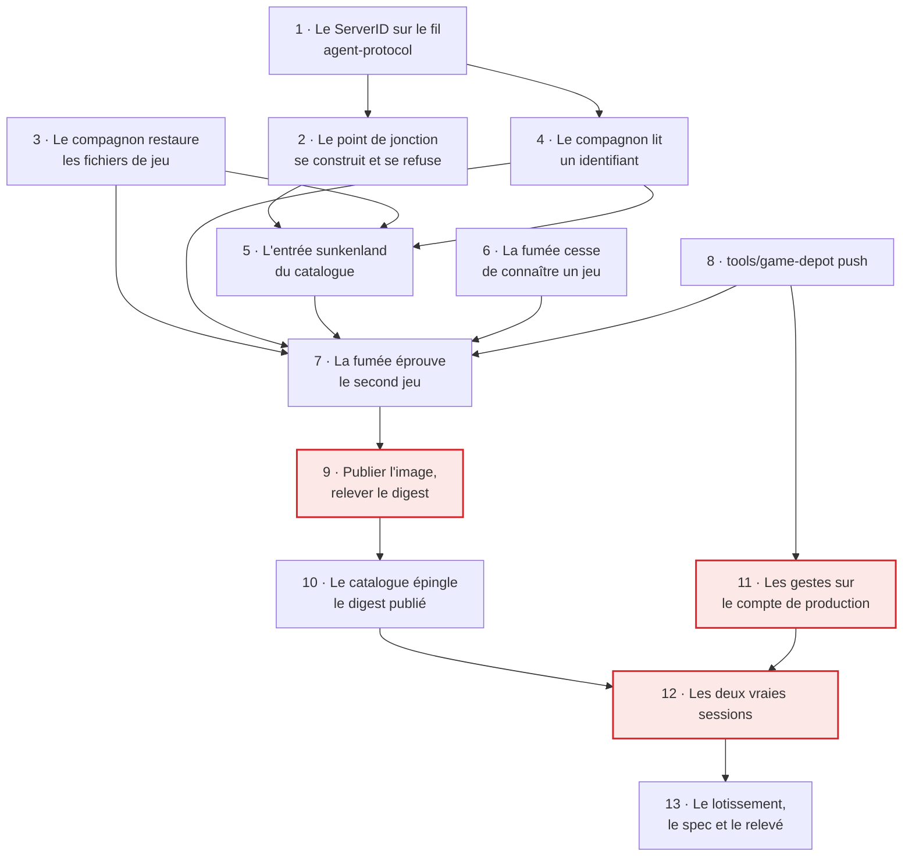

# Tranche 3 bis — Le second jeu

> **For agentic workers:** REQUIRED SUB-SKILL: Use superpowers:subagent-driven-development (recommended) or superpowers:executing-plans to implement this plan task-by-task. Steps use checkbox (`- [ ]`) syntax for tracking.

**But :** Sunkenland démarre. Le compagnon restaure les 2,3 Go de fichiers de
jeu **et** le monde, le serveur annonce son identifiant, la Function le vérifie
avant de le publier, et le point de jonction qui s'affiche n'est plus une
adresse mais un `SunkenlandJoinInfo`. À la fin, le gate du lotissement se lève
pour ce jeu comme il s'est levé pour l'autre.

**Approche :** rien de neuf dans le domaine. Le §4 a écrit `JoinInfo` à deux
formes et laissé `ServerHost` libre du jeu précisément pour que celui-ci ne
coûte qu'une entrée de catalogue — cette tranche le **vérifie**, et chaque
tâche qui déborde de cette promesse est une tâche à relire. L'ordre suit la
leçon de la tranche 3 : le fil d'abord, la Function ensuite, le compagnon après,
la barrière de fumée avant toute machine facturée, et la vraie session en
dernier.

**Une contrainte de forme, héritée de la tranche 3 et plus importante qu'elle
n'en a l'air.** Ce plan porte **les tests et les contraintes de chaque tâche,
jamais le code d'implémentation**. Onze contradictions ont été trouvées entre le
code embarqué dans le plan de la tranche 3 et ses propres tests : du code jamais
exécuté se périme entre son écriture et sa lecture, et c'est le lecteur qui
paie. Les tâches ajoutées en cours de route l'ont été sous cette forme, et le
lotissement en a fait la forme à reprendre. Un bloc de code ci-dessous est donc
**un test, une valeur littérale à écrire, ou une commande à lancer** — jamais
une implémentation à recopier.

**Pile :** Nx 23.2.0, TypeScript 6.0 en ESM `nodenext`, Vitest 4.1, Firebase
Functions gen2 et l'émulateur Firestore, `@aws-sdk/client-s3`, Node 22 pour
l'image du compagnon, `bash` pour le point d'entrée monté dans l'image amont.

**Spec :** [`docs/superpowers/specs/2026-09-02-game-hosting-design.md`](../specs/2026-09-02-game-hosting-design.md).
Cette tranche implémente le §2 (fichiers du serveur par le seau, amorçage d'un
monde, conteneur du jeu et ses deux contraintes), le §4 (la seconde forme de
`JoinInfo`, `tools/game-depot`), le §5 (la règle de cycle de vie de ce jeu), le
§6 (étapes 6 et 7 pour ce jeu, et la vérification du préfixe) et le §8 (ce que
`pre-shutdown` promet ici, et ce qu'il ne promet pas). Le découpage est au
[lotissement](2026-09-02-lotissement.md), que la tâche 13 met à jour.

**Mesures :** sections J et V de [`probe/RESULTS.md`](../../../probe/RESULTS.md).
Tout chiffre cité ci-dessous en vient et n'a pas à être redécouvert.

## Ce que la tranche 3 laisse

Elle a livré le 2026-09-07 et son gate est levé pour Enshrouded : deux sessions
consécutives, la seconde restaure la clé que la première avait déposée, à
l'octet près. Cinq lignes de son legs commandent ce plan, et elles sont
nommées dans le lotissement :

- **`catalogFor('sunkenland')` lève toujours**, et son message nomme encore la
  tranche 3. La tâche 5 le fait disparaître : le catalogue devient total, et
  `catalogFor` cesse de pouvoir échouer.
- **`SunkenlandJoinInfo` est déclaré depuis la tranche 2 et jamais produit.**
  Le type existe, `publishedAddressOf` rend déjà `null` pour lui, et rien ne
  l'a jamais construit.
- **`probeFor` ne connaît que `a2s://`** et refuse tout le reste en nommant ce
  qu'elle a reçu. La tâche 4 lui ajoute une seconde forme.
- **Le compagnon ne restaure pas de fichiers de jeu.** `beacon-games` existe,
  sa politique de lecture seule est posée et mesurée, le `cloud-init` écrit déjà
  `BEACON_GAMES_BUCKET` — et rien ne le lit.
- **`beacon-stop.service` nomme `enshrouded` en dur** dans son `ExecStart`. Un
  second jeu le rend faux ; la tâche 5 fait rendre ce nom par le catalogue.

Et une observation que la tranche 3 n'a pas pu faire : **l'état de
`beacon-stop.path` une fois qu'elle a tiré**. L'unité a été vue armée et vue
fonctionner, jamais après coup — la machine était détruite. La tâche 12 vise
exprès la fenêtre de quelques dizaines de secondes entre l'arrêt du jeu et la
destruction.

## Les décisions prises avec le commanditaire, le 2026-09-08

Elles ne se redécouvrent pas en cours d'exécution.

1. **Les 2,3 Go voyagent en une archive unique**, `sunkenland/game.tar` dans
   `beacon-games`. Le compagnon fait un `get` et déballe : c'est exactement le
   chemin de code de la restauration d'un monde, et il n'y a ni `rclone` ni
   transfert parallèle à écrire. Prix accepté : `game-depot` reconstruit
   l'archive entière à chaque rafraîchissement, et le seau cesse d'être
   inspectable fichier par fichier.
2. **`tools/game-depot` n'a qu'un verbe, `push`.** Pas de `purge` : la seule
   chose qui supprime dans ce système est une règle de cycle de vie de seau
   (§8), et ces fichiers sous licence ne se redéposent que depuis une machine
   qui possède le jeu.
3. **L'identité du monde vit dans le catalogue du dépôt** — GUID, nom affiché,
   région —, comme `enshrouded.beacon.charlouze.com` y vit déjà. C'est ce qui
   permet au plan de contrôle de vérifier le préfixe du ServerID sans dépendre
   d'un document que quelqu'un peut modifier. Changer de monde est une pull
   request, et c'est cohérent avec un amorçage qui est déjà un geste manuel
   (§2).
4. **Le compagnon ne lit pas le journal du conteneur de jeu.** Le socket Docker
   est interdit (§7) et ce journal porte le mot de passe **trois fois** (section
   V). C'est le point d'entrée monté — qui est le nôtre — qui extrait
   l'identifiant et écrit **une ligne** dans un volume partagé. Aucun journal ne
   franchit la frontière, et le compagnon ne porte aucun motif propre à un jeu.
5. **Un ServerID au mauvais préfixe ne publie rien.** La session reste
   `PROVISIONING` et meurt par le délai, avec un `AgentContradicted` au journal.
   Un seul chemin de mort plutôt que deux : le délai de provisionnement existe
   déjà et couvre exactement ce cas.

## Contraintes globales

- **Aucune fusion dans `main`, aucun `firebase deploy`, aucune écriture dans le
  Firestore de production.** La cible est **l'émulateur**, toujours.
- **Aucune ressource facturée n'est créée, modifiée ou détruite par un agent.**
  Les tâches 9, 11 et 12 sont conduites par un humain de bout en bout : publier
  une image, déposer 2,3 Go, poser une règle qui supprime des objets, allumer
  une machine.
- **Aucun identifiant d'API cloud ne monte sur la VM au-delà de la clé S3**
  (§7). Pas de clé Scaleway Instance, **pas d'identifiant Steam** — c'est toute
  la raison pour laquelle ces 2,3 Go passent par un seau.
- **Le seul geste destructeur du dépôt est celui qui n'existe pas.** `SaveStore`
  n'expose ni suppression ni élagage, `ObjectApi` non plus, et `game-depot`
  n'ajoute pas de verbe qui efface.
- **Les images sont référencées par digest immuable, jamais `latest`** (§10),
  la nôtre comme celle qu'on emprunte.
- **Le jeton d'agent, la clé S3 et le mot de passe du serveur ne sont jamais
  journalisés**, ni dans un rapport, ni dans une trace du compagnon, ni dans un
  message de commit. Pour ce jeu la règle mord plus fort qu'ailleurs : son
  journal et sa table des processus portent le mot de passe en clair, et rien
  de ce qui vient de cette machine ne remonte au-delà de l'identifiant.
- **`firestore.rules` reste fermé et se déploie fermé.** Les règles réelles sont
  la tranche 4, et son gate tient.
- **Ce qui se génère ne s'écrit pas à la main.** Toute lib, app ou configuration
  de projet passe par `nx g` — cela vaut nommément pour `tools/game-depot`. Si
  le générateur ne produit pas ce qu'il faut : le lancer d'abord, corriger
  ensuite.
- Code, noms de fichiers et commentaires en **anglais** ; plan, documentation et
  messages de commit en **français**.
- Commits en Conventional Commits, description française à l'impératif, portée =
  le projet Nx touché — `agent-protocol`, `cloud-init`, `companion`,
  `functions`, `game-depot`, `session` — ou l'artefact pour ce qui n'est pas du
  code : `spec`, `plan`, `deploy`.
- Node 22 et Temurin 21, pinés par `mise.toml`. Toute commande se lance depuis
  la racine du dépôt.
- **Budget de la tâche 12 : moins de 0,30 €.** Deux sessions courtes, une
  `DEV1-L` à 0,04284 €/h, son disque et son IP, une heure entamée chacune.

## L'ordre, et ce qui le produit



**La tâche 10 attend la 9, et c'est une contrainte et non une maladresse** —
c'est la même que la tranche 3 avait entre ses tâches 11 et 10. Le §10 veut que
le `cloud-init` référence l'image du compagnon par un digest immuable ; un
digest est ce que le registre rend après une poussée, et la poussée est un geste
humain. Écrire le catalogue plus tôt demanderait d'y mettre un tag mobile,
c'est-à-dire exactement ce que le §10 interdit. La tâche 5 écrit donc l'entrée
avec le digest **d'aujourd'hui**, et la tâche 10 l'échange.

**La tâche 8 ne dépend de rien, et deux tâches dépendent d'elle.** L'humain de
la tâche 11 s'en sert pour déposer, et la barrière de la tâche 7 s'en sert pour
fermer une chaîne que rien d'autre ne ferme : la clé de l'archive des fichiers
de jeu est construite là et nommée dans le catalogue, et aucune frontière de
module ne permet aux deux de se lire. C'est le harnais qui les tient ensemble,
et c'est écrit dans la tâche 7.

**Aucune tâche ne prouve la chaîne entière avant la 12.** La barrière de fumée
n'a pas de Function et son conteneur de jeu est un bouchon ; l'émulateur n'a pas
de conteneur du tout. La tranche 3 l'a écrit plutôt que de le laisser croire, et
ce plan fait pareil.

## Ce que la tranche ne construit pas

Hors périmètre par décision, pas par oubli. Une tâche qui semble en réclamer une
est une tâche mal lue.

- **Pas d'écran.** `apps/web` ne bouge pas : les deux formes de `JoinInfo` sont
  affichées par la tranche 5, et rien ici n'est visible.
- **Pas de `members`, pas de `steamId`, pas d'authentification.** C'est la
  tranche 4 et son gate. `-adminSteamIDs` est donc nourri par une constante du
  catalogue, et la tâche 13 inscrit ce que la tranche 4 devra reprendre.
- **Pas d'amorçage d'un monde depuis l'interface.** Le §2 le met hors périmètre
  v1 : le monde se crée dans le client d'un joueur et se dépose à la main. La
  tâche 11 est ce geste-là.
- **Pas de rafraîchissement automatique des fichiers de jeu.** Il demanderait le
  compte Steam sur un runner ou une VM (§7). La dérive est acceptée en v1, le §2
  le dit, et `game-depot push` est le seul remède.
- **Pas de détection du décalage de version Photon.** Non mesuré, exclu du
  périmètre de la sonde, et le §2 l'assume.
- **Pas de `-publicip`, `-publicport` ni `-port`.** Mesuré derrière un vrai NAT
  le 2026-09-05 : sans aucune de ces options, un joueur trouve le serveur par la
  liste et y entre. Ces options restent *inutiles* et non *inopérantes* — le
  second essai n'a jamais eu lieu.
- **Pas de `DnsUpdater` pour ce jeu, pas de sous-domaine, pas d'IP flottante
  réservée.** On ne rejoint pas un serveur Sunkenland par une adresse. Le port
  existe, il n'est pas appelé, et c'est moins cher qu'un port rendu optionnel
  (§4).
- **Pas de suppression, pas d'élagage, pas de versionnement d'objet.**
- **La barrière de fumée ne démarre pas le vrai serveur de jeu.** Ses 2,3 Go et
  ses deux minutes de boot n'ont pas leur place dans un runner ; elle éprouve
  les services du compagnon contre un MinIO et un conteneur bouchonné. Que le
  vrai serveur démarre est ce que la tâche 12 prouve, et elle seule.

---

### Task 1: Le ServerID sur le fil

`agent-protocol` apprend un champ. Il voyage à côté d'`ip` et avec le même
statut : une valeur que la machine déclare, que la frontière borne, et que
personne n'a encore le droit de suivre.

**Ce que ce module ne fait pas, et il faut le dire ici parce que c'est
tentant :** il ne valide aucune forme d'identifiant. `agent-protocol` porte le
tag `scope:protocol` et ne peut dépendre que du domaine ; le GUID du monde vit
dans le catalogue, que ce module n'a pas le droit d'importer. La vérification
est la tâche 2, et elle est ailleurs exprès.

**Fichiers :**
- Modifier : `libs/agent-protocol/src/lib/report.ts`
- Test : `libs/agent-protocol/src/lib/report.spec.ts`

**Interfaces :**
- Produit : `AgentReport.serverId?: string`, borné à 1024 caractères par
  `isBoundedString` comme `ip` et `detail`. `parseReport` rend `null` si le
  champ est présent et n'est pas une chaîne bornée non vide.

- [ ] **Step 1: Écrire les tests qui échouent**

Dans `report.spec.ts`, à la suite des existants :

```ts
// §6 étape 7. Ce jeu-ci n'a pas d'adresse à publier : ce que le joueur copie
// est un identifiant que la VM seule découvre, et qui n'existe ni dans l'API
// du fournisseur ni sur un port qu'on pourrait interroger.
it('reads the readiness of a game whose join point is an identifier', () => {
  expect(
    parseReport({
      sessionId: 's1',
      phase: 'ready',
      serverId: '4db51c84-24cf-459e-9e9e-88b8c3a7ce3b~639242318300625638',
    }),
  ).toEqual({
    sessionId: 's1',
    phase: 'ready',
    serverId: '4db51c84-24cf-459e-9e9e-88b8c3a7ce3b~639242318300625638',
  });
});

// Le jeu qui publie une adresse n'en envoie pas, et le parseur ne l'invente
// pas : un champ absent reste absent.
it('leaves the identifier out when the machine sent none', () => {
  expect(parseReport({ sessionId: 's1', phase: 'ready', ip: '51.15.42.7' })).toEqual({
    sessionId: 's1',
    phase: 'ready',
    ip: '51.15.42.7',
  });
});

// Borné, comme toute chaîne qu'un client écrit (§5). Un détail sans borne sur
// un point d'entrée public est une façon de faire grossir la facture d'un autre.
it('refuses an identifier longer than the bound', () => {
  expect(parseReport({ sessionId: 's1', phase: 'ready', serverId: 'x'.repeat(1025) })).toBeNull();
});

// Vide ou d'un autre type : refusé, jamais réparé. Le §4 en fait une couche
// anticorruption, et le §7 fait de la machine l'élément le moins fiable.
it('refuses an identifier that is not a string, and an empty one', () => {
  expect(parseReport({ sessionId: 's1', phase: 'ready', serverId: '' })).toBeNull();
  expect(parseReport({ sessionId: 's1', phase: 'ready', serverId: 42 })).toBeNull();
});
```

- [ ] **Step 2: Lancer les tests et vérifier qu'ils échouent**

```bash
npx nx test agent-protocol
```

Attendu : les quatre échouent — le premier parce que `serverId` est absent du
résultat, les deux derniers parce qu'ils rendent un rapport au lieu de `null`.

- [ ] **Step 3: Écrire le champ et sa borne**

Le type gagne `readonly serverId?: string` avec le commentaire qui dit **d'où
il vient et pourquoi la règle « ne jamais suivre ce que l'agent déclare » ne
peut pas s'appliquer telle quelle** — l'identifiant n'existe que sur la VM, il
change à chaque démarrage, et il vaut `<GUID du monde>~<instant de démarrage>`.
`parseReport` le lit par `isBoundedString`, exactement comme `ip`.

- [ ] **Step 4: Lancer les tests et vérifier qu'ils passent**

```bash
npx nx test agent-protocol
npx nx run-many -t lint --projects=agent-protocol
```

- [ ] **Step 5: Commit**

```bash
git add libs/agent-protocol
git commit -m "feat(agent-protocol): fait voyager l'identifiant que la machine seule decouvre"
```

---

### Task 2: Le point de jonction se construit à partir de faits, et se refuse

`GameCatalogEntry.joinInfo(address)` ne suffit plus. Un jeu construit son point
de jonction à partir d'une adresse que la Function a réservée ; l'autre à partir
d'un identifiant que la VM déclare. La signature devient `joinInfo(facts)`, et
elle gagne le droit de rendre `null`.

**C'est le catalogue qui refuse, pas la Function**, et c'est le cœur de cette
tâche. Le §6 veut que le plan de contrôle rejette tout identifiant dont le
préfixe ne correspond pas au GUID du monde — mais le GUID est une connaissance
de jeu, et le §4 interdit au reste du système d'en porter. L'entrée de catalogue
sait ; `becomeRunning` constate seulement qu'elle n'a rien rendu.

Ce que cette vérification laisse passer, et il faut l'écrire : une VM compromise
peut encore envoyer les joueurs vers un autre serveur **portant le même monde**.
Ce qu'elle ne peut plus faire est les envoyer n'importe où. C'est une réduction
du dommage, pas une preuve, et c'est le maximum atteignable pour une donnée qui
n'existe que sur la machine.

**Fichiers :**
- Modifier : `deploy/cloud-init/src/lib/catalog.ts`
- Modifier : `deploy/cloud-init/src/lib/enshrouded.ts`
- Modifier : `apps/functions/src/agent-report.ts:97-149`
- Test : `deploy/cloud-init/src/lib/enshrouded.spec.ts`
- Test : `apps/functions/src/agent-report.spec.ts`

**Interfaces :**
- Consomme : `AgentReport.serverId` de la tâche 1.
- Produit : `interface JoinFacts { readonly address: string; readonly serverId?: string }`
  exporté par `@beacon/cloud-init`, et
  `GameCatalogEntry.joinInfo(facts: JoinFacts): JoinInfo | null`.
  L'entrée `enshrouded` ne rend jamais `null`.

- [ ] **Step 1: Écrire le test du catalogue qui échoue**

Dans `enshrouded.spec.ts`, en remplacement du test `yields the join point a
player copies, from the address alone` :

```ts
// Ce jeu-ci publie une adresse, et rien de ce que la machine déclare n'entre
// dans ce qu'un joueur copie : l'adresse vient de ce que la Function a réservé.
it('yields the join point a player copies, from the reserved address', () => {
  expect(catalogFor('enshrouded').joinInfo({ address: '51.15.42.7' })).toEqual({
    game: 'enshrouded',
    hostname: 'enshrouded.beacon.charlouze.com',
    address: '51.15.42.7',
    port: 15637,
  });
});

// Et un identifiant qui arriverait quand même ne change rien : ce jeu n'en a
// pas l'usage, et une entrée de catalogue qui lirait un champ qu'elle n'utilise
// pas serait une frontière qui fuit.
it('ignores an identifier this game has no use for', () => {
  expect(
    catalogFor('enshrouded').joinInfo({ address: '51.15.42.7', serverId: 'whatever' }),
  ).toEqual({
    game: 'enshrouded',
    hostname: 'enshrouded.beacon.charlouze.com',
    address: '51.15.42.7',
    port: 15637,
  });
});
```

- [ ] **Step 2: Écrire les tests de la Function qui échouent**

Dans `agent-report.spec.ts`, suivant l'idiome des tests existants de
`becomeRunning` (émulateur Firestore, session en `PROVISIONING`, `ledger`
renseigné) :

```ts
// §6 étape 7 : RUNNING veut dire « le point de jonction est publié ». Si le
// catalogue ne peut pas en construire un, il n'y a rien à publier — et la
// session meurt par le délai de provisionnement, qui existe déjà et couvre
// exactement ce cas. Un second chemin de mort n'achèterait rien.
it('publishes nothing when the catalogue refuses what the machine declared', async () => {
  // catalogue bouchonné : joinInfo rend null
  await runAgentReport(deps, token, { sessionId: 's1', phase: 'ready', serverId: 'forged' });

  const session = await deps.state.readSession();
  expect(session?.state).toBe('PROVISIONING');
  expect(await eventsOf(deps)).toContainEqual(
    expect.objectContaining({ type: 'AgentContradicted' }),
  );
});

// Le chemin qui existait déjà, inchangé : une entrée qui rend un point de
// jonction publie RUNNING comme avant.
it('still publishes for a game whose join point comes from the address', async () => {
  await runAgentReport(deps, token, { sessionId: 's1', phase: 'ready', ip: '51.15.42.7' });

  const session = await deps.state.readSession();
  expect(session?.state).toBe('RUNNING');
});
```

- [ ] **Step 3: Lancer les deux suites et vérifier qu'elles échouent**

```bash
npx nx test cloud-init
npx nx test functions
```

Attendu : `cloud-init` échoue sur la signature (`joinInfo` reçoit un objet et
attend une chaîne), `functions` échoue parce que `becomeRunning` publie quoi
qu'il arrive.

- [ ] **Step 4: Changer la signature et le point d'appel**

`JoinFacts` naît dans `catalog.ts` à côté de `GameCatalogEntry`, avec le
commentaire qui dit pourquoi le retour est nullable — ce n'est pas une erreur à
signaler, c'est un refus, et le seul appelant sait quoi en faire.
`enshrouded.ts` prend l'adresse dans les faits et ignore le reste.
`becomeRunning` construit `{ address: facts.ip, serverId: report.serverId }`,
et sur `null` : un `AgentContradicted` dont le `detail` nomme ce qui a été
refusé, puis retour sans publier.

**Le `detail` est borné et lisible par tout membre (§5).** Il ne recopie pas
l'identifiant brut sans borne : `AgentContradicted` existe déjà pour l'écart
d'IP et sa forme se reprend telle quelle.

- [ ] **Step 5: Lancer les deux suites et vérifier qu'elles passent**

```bash
npx nx test cloud-init
npx nx test functions
npx nx run-many -t lint --projects=cloud-init,functions
```

- [ ] **Step 6: Commit**

```bash
git add deploy/cloud-init apps/functions
git commit -m "feat(cloud-init): fait construire le point de jonction par le catalogue, ou refuser"
```

---

### Task 3: Le compagnon restaure les fichiers de jeu

Le §6 étape 6 : ce que le compagnon restaure diffère selon le jeu. Pour l'un, la
sauvegarde seule — le serveur télécharge ses 8,8 Go par SteamCMD. Pour l'autre,
**la sauvegarde et les 2,3 Go du jeu**, parce que son téléchargement exigerait
un compte Steam sur la machine.

« Le second cas n'ajoute pas de chemin de code » dit le spec, et cette tâche
tient cette phrase : c'est le même `ObjectApi.get` vers un autre dossier, depuis
l'autre seau. Ce qui change est la configuration, pas la logique.

**Une valeur absente n'est pas une valeur vide.** `BEACON_GAME_FILES_KEY` est
optionnelle : absente, aucun transfert n'a lieu et le jeu télécharge lui-même.
Présente, elle est obligatoire jusqu'au bout — un échec fait sortir `restore` en
non-zéro, donc le conteneur de jeu ne démarre pas, donc personne ne joue dans un
monde qui n'est pas le bon (§8, première défense).

**Et une reprise du `chown` du monde, pour le dossier du jeu.** Le serveur tourne
en `uid 7000`, le déballage se fait en root. Le 2026-09-05 a mesuré ce que
coûte l'oubli sur le dossier des mondes : l'autosave n'écrit rien, et la panne
est muette. Le dossier du jeu n'est lu que par le serveur, mais un mode que
l'archive porterait et qui ne lui laisserait pas la lecture produirait la même
panne obscure, sur une machine facturée.

**Fichiers :**
- Modifier : `deploy/companion/src/lib/config.ts`
- Modifier : `deploy/companion/src/lib/restore.ts`
- Modifier : `deploy/companion/src/lib/container.ts`
- Modifier : `deploy/companion/src/restore.ts`
- Test : `deploy/companion/src/lib/config.spec.ts`
- Test : `deploy/companion/src/lib/restore.spec.ts`

**Interfaces :**
- Produit : `CompanionConfig.gameFiles?: { readonly objectKey: string; readonly directory: string }`,
  lue de `BEACON_GAME_FILES_KEY` et `BEACON_GAME_DIR` — les deux présentes ou
  les deux absentes, jamais l'une sans l'autre.
- Produit : `RestoreDeps.gameFiles?: { readonly api: ObjectApi; readonly directory: string; readonly objectKey: string }`.
- Produit : `buildGameFiles(config): RestoreDeps['gameFiles']` dans
  `container.ts`, bâti sur le **même** client S3 et le seau `gamesBucket`. Il
  rend exactement la forme que la dépendance attend, et `undefined` quand le
  catalogue n'a rien écrit — une seconde forme intermédiaire ne servirait qu'à
  être traduite une ligne plus loin.

- [ ] **Step 1: Écrire les tests de configuration qui échouent**

```ts
// Deux variables ou aucune. Une seule est une configuration à moitié écrite,
// et la moitié qui manque est celle qui décide où 2,3 Go atterrissent.
it('reads the game files a machine must restore before its server starts', () => {
  const config = readConfig({ ...ENV, BEACON_GAME_FILES_KEY: 'sunkenland/game.tar', BEACON_GAME_DIR: '/sunkenland/game' });
  expect(config.gameFiles).toEqual({ objectKey: 'sunkenland/game.tar', directory: '/sunkenland/game' });
});

// Le jeu qui télécharge le sien n'en écrit aucune, et le compagnon ne restaure
// alors que le monde. C'est l'absence qui décide, jamais une branche par jeu.
it('leaves the game files out when the catalogue wrote none', () => {
  expect(readConfig(ENV).gameFiles).toBeUndefined();
});

it('refuses a half-written game files configuration', () => {
  expect(() => readConfig({ ...ENV, BEACON_GAME_FILES_KEY: 'sunkenland/game.tar' })).toThrow(
    /BEACON_GAME_DIR/,
  );
  expect(() => readConfig({ ...ENV, BEACON_GAME_DIR: '/sunkenland/game' })).toThrow(
    /BEACON_GAME_FILES_KEY/,
  );
});
```

- [ ] **Step 2: Écrire les tests de restauration qui échouent**

Contre un `ObjectApi` double — une `Map` en mémoire, comme
`fake-object-api.ts` le fait déjà pour l'adapter :

```ts
// Le même transfert que celui d'une sauvegarde, vers un autre dossier, depuis
// l'autre seau. Pas un second chemin de code : un second appel.
it('unpacks the game files before the game container may start', async () => {
  await runRestore(depsWithGameFiles);
  expect(readdirSync('/sunkenland/game')).toContain('Sunkenland-DedicatedServer.exe');
});

// §8, première défense : tant que ce processus ne sort pas en zéro, il n'y a
// pas de conteneur de jeu du tout. Un jeu dont les fichiers manquent démarrerait
// autrement sur une installation à moitié écrite.
it('refuses when the game files cannot be fetched', async () => {
  await expect(runRestore(depsWhoseGamesBucketThrows)).rejects.toThrow();
  expect(reported).toContainEqual(expect.objectContaining({ phase: 'failed' }));
});

// Mesuré le 2026-09-05 sur le dossier des mondes : le serveur tourne en uid
// 7000, le déballage en root, et l'oubli est muet. La même ligne, pour le
// dossier que le serveur lit.
it('gives the game folder to the uid the server runs as', async () => {
  await runRestore(depsWithGameFiles);
  expect(ownershipTaken).toContainEqual(['/sunkenland/game', '7000:7000']);
});

// §7 : la clé de cette machine lit ce seau et n'y écrit pas. L'assertion est
// explicite plutôt que « aucune exception n'a été levée » — un test dont la
// vérification est l'absence de panne passe aussi le jour où il ne teste plus
// rien.
it('never writes to the bucket it reads', async () => {
  const games = fakeObjectApi({ 'sunkenland/game.tar': anArchive });
  await runRestore({ ...depsWithGameFiles, gameFiles: { ...gameFiles, api: games } });
  expect(games.writes).toEqual([]);
});

// Le jeu qui télécharge le sien n'a rien à restaurer de plus, et le chemin
// existant ne bouge pas d'un pouce.
it('restores the world alone when no game files are configured', async () => {
  await runRestore(depsWithoutGameFiles);
  expect(fetchedKeys).toEqual([theNewestSaveKey]);
});
```

- [ ] **Step 3: Lancer la suite et vérifier qu'elle échoue**

```bash
npx nx test companion
```

- [ ] **Step 4: Écrire la lecture de configuration, le transfert et le montage**

`readConfig` lit la paire et refuse la moitié. `runRestore` fait le transfert
des fichiers de jeu **avant** celui du monde — le plus gros d'abord, et un
échec coûte alors moins de travail déjà fait. `container.ts` construit le second
`ObjectApi` sur le même client. `src/restore.ts` câble le tout.

- [ ] **Step 5: Lancer la suite et vérifier qu'elle passe**

```bash
npx nx test companion
npx nx run-many -t lint --projects=companion
```

- [ ] **Step 6: Commit**

```bash
git add deploy/companion
git commit -m "feat(companion): fait venir du seau les fichiers d'un jeu qui ne se telecharge pas"
```

---

### Task 4: Le compagnon lit un identifiant, et le rapporte

`probeFor` apprend une seconde forme. Ce n'est pas un pis-aller et le §6 le dit :
l'identifiant de serveur n'existe nulle part ailleurs, ni dans l'API du
fournisseur ni sur un port qu'on pourrait interroger, et il change à chaque
démarrage.

**Deux mécanismes, pas deux jeux.** Le compagnon implémente déjà l'A2S ; il
implémente maintenant « lire un identifiant dans un fichier ». Lequel s'applique
est une valeur du catalogue, `BEACON_READY_PROBE`, et rien dans ce projet ne
nomme un jeu.

**Ce que ce projet ne valide pas, et c'est la décision de conception de cette
tâche.** La tentation est de lui faire vérifier la forme `<guid>~<chiffres>` —
et ce serait mettre le format d'identifiant d'un jeu dans le seul projet dont le
§4 dit qu'il n'en connaît aucun. La valeur est opaque ici, exactement comme tout
le reste : le compagnon lit une ligne non vide, la borne, et la rapporte. Ce qui
la vérifie est le catalogue, qui connaît le GUID du monde, et la tâche 2 dit ce
qu'il en fait.

Ce que cette répartition coûte : un identifiant mal écrit meurt par le délai de
provisionnement au lieu d'être ignoré tout de suite. Ce qu'elle achète : un
endroit de moins où la forme d'un ServerID est écrite. La lecture partielle,
elle, est empêchée par la conception et non par la validation — le point
d'entrée écrit dans un fichier temporaire puis renomme (tâche 5), et un
renommage sur le même système de fichiers est atomique.

**Un piège que la section J a payé d'une mesure :** la ligne d'état périodique
de ce jeu ne s'imprime que lorsqu'un joueur est connecté. Le silence ne dit pas
que le serveur est mort. Cette sonde ne relit donc **jamais** pour vérifier que
le serveur vit encore : une fois l'identifiant lu, il reste lu.

**Fichiers :**
- Renommer : `deploy/companion/src/lib/a2s.ts` → `deploy/companion/src/lib/readiness.ts`
  (`probeFor` y retrouve sa place à côté des deux mécanismes qu'elle choisit ;
  `a2sInfo` reste dans `a2s.ts`)
- Créer : `deploy/companion/src/lib/serverid.ts`
- Modifier : `deploy/companion/src/lib/agent-loop.ts`
- Modifier : `deploy/companion/src/lib/push.ts:141-149`
- Modifier : `deploy/companion/src/agent.ts`
- Test : `deploy/companion/src/lib/readiness.spec.ts`
- Test : `deploy/companion/src/lib/agent-loop.spec.ts`

**Interfaces :**
- Consomme : `AgentReport.serverId` de la tâche 1.
- Produit : `type Readiness = { readonly ready: false } | { readonly ready: true; readonly serverId?: string }`.
- Produit : `probeFor(url: string): () => Promise<Readiness>` — elle rend
  désormais la sonde elle-même, et non plus une paire hôte/port.
- Produit : `AgentLoopDeps.probeReady: () => Promise<Readiness>` et
  `PushDeps.probeReady` de même type.

- [ ] **Step 1: Écrire les tests de la sonde qui échouent**

```ts
// La forme que la tranche 3 connaissait, inchangée.
it('still reads the form that queries a server the way a player does', async () => {
  const probe = probeFor('a2s://enshrouded:15637');
  // le serveur udp bouchonné de la suite existante répond
  expect(await probe()).toEqual({ ready: true });
});

// La seconde forme : ce que le joueur copie n'est pas une adresse, et il n'y a
// pas de port à interroger.
it('reads the form that recovers an identifier from a file', async () => {
  writeFileSync('/tmp/serverid', '4db51c84-24cf-459e-9e9e-88b8c3a7ce3b~639242318300625638');
  const probe = probeFor('serverid:///tmp/serverid');
  expect(await probe()).toEqual({
    ready: true,
    serverId: '4db51c84-24cf-459e-9e9e-88b8c3a7ce3b~639242318300625638',
  });
});

// Les cinq à huit premières minutes d'une session, ce fichier n'existe pas. Ce
// n'est pas un incident, c'est le cas ordinaire.
it('is not ready while nothing has written the file', async () => {
  expect(await probeFor('serverid:///tmp/nothing-here')()).toEqual({ ready: false });
});

// Un fichier vide est un fichier que personne n'a fini d'écrire, et « pas
// encore prêt » est la seule réponse honnête. La forme, elle, ne se juge pas
// ici : ce projet ne connaît aucun jeu.
it('is not ready while the file holds nothing', async () => {
  for (const content of ['', '   ', '\n']) {
    writeFileSync('/tmp/serverid-empty', content);
    expect(await probeFor('serverid:///tmp/serverid-empty')()).toEqual({ ready: false });
  }
});

// Le retour chariot que Wine écrit ne fait pas partie de l'identifiant. Ce
// n'est pas une connaissance de jeu, c'est de l'hygiène de lecture de fichier —
// et un identifiant qui le garderait serait refusé par le catalogue sans que la
// cause soit lisible.
it('reports the line without the whitespace around it', async () => {
  writeFileSync('/tmp/serverid-crlf', 'w~1\r\n');
  expect(await probeFor('serverid:///tmp/serverid-crlf')()).toEqual({ ready: true, serverId: 'w~1' });
});

// Borné comme tout ce qui voyage sur ce fil (§5) : un fichier que quelque chose
// aurait rempli ne doit pas faire grossir un rapport que la Function accepte
// une fois par minute.
it('is not ready on a line longer than the protocol carries', async () => {
  writeFileSync('/tmp/serverid-huge', 'x'.repeat(1025));
  expect(await probeFor('serverid:///tmp/serverid-huge')()).toEqual({ ready: false });
});

// Une forme que ce compagnon ne sait pas courir est une entrée de catalogue à
// corriger, dite au lancement et en nommant ce qui a été reçu.
it('refuses a form it cannot run, and names what it was given', () => {
  expect(() => probeFor('http://enshrouded:15637')).toThrow(/http:\/\/enshrouded:15637/);
});
```

- [ ] **Step 2: Écrire les tests de la boucle qui échouent**

```ts
// §6 : RUNNING veut dire « le point de jonction est publié ». Pour ce jeu, la
// seule source du point de jonction est ce que la sonde a lu.
it('carries the identifier in the report that announces readiness', async () => {
  await runAgentLoop({ ...deps, probeReady: async () => ({ ready: true, serverId: 'w~1' }), until: twoTurns });
  expect(reports[0]).toEqual({ phase: 'ready', serverId: 'w~1' });
});

// `ready` une fois et une seule : un second réécrirait `stateSince`, et les
// délais du §6 se mesurent dessus. La règle ne change pas parce que le rapport
// porte une valeur de plus.
it('announces readiness once, identifier included', async () => {
  await runAgentLoop({ ...deps, probeReady: async () => ({ ready: true, serverId: 'w~1' }), until: threeTurns });
  expect(reports.filter((report) => report.phase === 'ready')).toHaveLength(1);
});

// Le jeu qui publie une adresse n'a pas d'identifiant, et le rapport n'en
// invente pas.
it('reports readiness without an identifier when the probe found none', async () => {
  await runAgentLoop({ ...deps, probeReady: async () => ({ ready: true }), until: twoTurns });
  expect(reports[0]).toEqual({ phase: 'ready' });
});
```

- [ ] **Step 3: Lancer la suite et vérifier qu'elle échoue**

```bash
npx nx test companion
```

- [ ] **Step 4: Écrire les deux mécanismes et le type qui les unifie**

`serverid.ts` porte la lecture du fichier et la validation de la forme.
`readiness.ts` porte `probeFor`, qui reconnaît les deux schémas et rend la
sonde déjà câblée — c'est ce qui permet à `agent.ts` de ne plus rien savoir de
l'A2S. `agent-loop.ts` et `push.ts` lisent `ready` là où ils lisaient un
booléen ; `stopAndPush` continue d'attendre que la sonde cesse de répondre.

**`stopAndPush` mérite une relecture ici, et un commentaire.** Pour ce jeu, la
sonde ne redevient jamais fausse : le fichier reste sur le disque une fois
écrit. La boucle d'attente ira donc au bout de sa fenêtre de grâce puis
archivera quand même — ce que le code fait déjà, exprès, et ce que le §8
accepte pour ce jeu-là : une archive déchirée est un risque, une archive
absente est une perte, et rien ne permet de provoquer une sauvegarde de toute
façon.

- [ ] **Step 5: Lancer la suite et vérifier qu'elle passe**

```bash
npx nx test companion
npx nx run-many -t lint --projects=companion
```

- [ ] **Step 6: Commit**

```bash
git add deploy/companion
git commit -m "feat(companion): fait apprendre a la sonde une seconde facon d'etre pret"
```

---

### Task 5: L'entrée `sunkenland` du catalogue

Le catalogue devient total. C'est la tâche la plus lourde de la tranche et
c'est normal : le §4 a mis toute la connaissance de jeu ici pour qu'elle ne soit
nulle part ailleurs.

**Ce qu'elle adopte de `probe/sunkenland/`** — le script mesuré le 2026-09-05,
avec l'`uid 7000` et le `trap` que l'image impose — **et ce qu'elle en retire** :
les options que la sonde portait pour les essayer. `-publicip`, `-publicport`,
`-port` et `-steamID` ne sont pas repris ; la mesure a dit qu'aucun n'est
nécessaire.

**Ce qu'elle ajoute au script** : l'extraction de l'identifiant. Le point
d'entrée fait passer sa propre sortie par un filtre qui la recopie telle quelle
et écrit **la seule ligne** que quoi que ce soit hors de ce conteneur a le droit
de voir. Écriture dans un fichier temporaire puis renommage, parce qu'un lecteur
tourne à côté toutes les trente secondes.

**Le mot de passe, et c'est le piège le plus cher de cette entrée.** `docker
compose` interpole tout ce qui passe par son `environment` : `a$bc` arrive au
serveur comme `a`, avec un avertissement sur une variable inconnue et aucun sur
le mot de passe amputé. `env_file` n'y change rien. Ce rendeur **refuse** un
mot de passe qui contient `$`, avant qu'une machine facturée existe — et le
script imprime la longueur au démarrage, seconde défense, parce que le journal
de ce jeu ne permet pas de relire le mot de passe autrement.

**Le fichier de règles de cycle de vie change dans le même commit.** Le préfixe
`saves/sunkenland/auto/` est littéral, aucun test ne le réclamera, et personne
ne verra qu'il manque : les poussées automatiques de ce jeu s'accumuleraient
sans fin. Il est entraîné par l'existence du jeu, donc il voyage avec elle.

**Fichiers :**
- Créer : `deploy/cloud-init/src/lib/sunkenland.ts`
- Créer : `deploy/cloud-init/src/lib/companion-image.ts`
- Créer : `deploy/cloud-init/src/lib/catalogue-fixtures.spec-helper.ts`
- Modifier : `deploy/cloud-init/src/lib/catalog.ts`
- Modifier : `deploy/cloud-init/package.json` (la cible `render-serverid-filter`)
- Modifier : `deploy/cloud-init/src/lib/enshrouded.ts` (le digest partagé sort,
  et le nom du conteneur que l'unité d'arrêt vise devient une valeur)
- Modifier : `deploy/scaleway/beacon-saves-lifecycle.json`
- Modifier : `deploy/scaleway/README.md`
- Modifier : `apps/web/src/app/join-info.component.ts` (le commentaire seul)
- Test : `deploy/cloud-init/src/lib/sunkenland.spec.ts`
- Test : `deploy/cloud-init/src/lib/enshrouded.spec.ts` (le test qui attend un
  refus de `catalogFor('sunkenland')` disparaît)

**Interfaces :**
- Consomme : `JoinFacts` et `joinInfo(): JoinInfo | null` de la tâche 2 ;
  `BEACON_GAME_FILES_KEY` / `BEACON_GAME_DIR` de la tâche 3 ;
  `serverid://` de la tâche 4.
- Produit : `sunkenland: GameCatalogEntry`, `hostname: null`.
- Produit : `CATALOG` devient `Record<Game, GameCatalogEntry>` et `catalogFor`
  cesse de pouvoir lever.

**Les constantes de cette entrée**, décision 3 du 2026-09-08 — elles vivent ici
et nulle part ailleurs :

| Constante | Valeur | D'où elle vient |
|---|---|---|
| image | `melle2/sunkenland-ds@sha256:2b21e6f098c76f8da91a7c5f53e02ceb9af126fa93d05f7958fd189d759873b7` | La digest mesurée le 2026-09-05, §10 |
| GUID du monde | à relever sur le monde d'amorçage déposé à la tâche 11 | §6 : c'est ce qui rend la vérification du ServerID possible |
| nom du monde | le nom du dossier déposé, ce que les joueurs lisent dans la liste | §2 : c'est leur recours si l'identifiant se perd |
| région | `eu` | Mesurée, `-region eu` |
| port | `27015/udp` | Mesuré, en écoute sans avoir passé `-port` |
| cadence d'autosave | `300` s | Décision du commanditaire, §2 |
| cadence de poussée | `300000` ms | §4 : elle suit ce que le jeu écrit |
| propriétaire des dossiers | `7000:7000` | Mesuré, l'image impose l'uid |

> **Le GUID et le nom du monde ne sont connus qu'à la tâche 11.** Cette tâche
> les écrit avec les valeurs du monde de la sonde
> (`4db51c84-24cf-459e-9e9e-88b8c3a7ce3b`), la tâche 11 les remplace si le monde
> déposé diffère, et la tâche 12 ne part pas si le préfixe ne correspond pas —
> c'est précisément ce que la vérification du §6 attrape.

- [ ] **Step 1: Sortir la constante et l'aide que les deux suites partagent**

`enshrouded.spec.ts` porte `REQUEST` et `serviceBlock`. Les recopier dans la
seconde suite les ferait diverger — et c'est précisément la classe de défaut que
la tranche 3 a payée onze fois. Les deux sortent dans
`catalogue-fixtures.spec-helper.ts`, et `enshrouded.spec.ts` les importe.

Vérifier que rien n'a bougé avant d'écrire quoi que ce soit de neuf :

```bash
npx nx test cloud-init
```

Attendu : vert, à l'identique.

- [ ] **Step 2: Écrire les tests de l'entrée qui échouent**

`sunkenland.spec.ts`, sur le modèle de `enshrouded.spec.ts`, important `REQUEST`
et `serviceBlock` de l'aide du step 1 :

```ts
// §10, sur l'image qu'on emprunte comme sur la nôtre.
it('pins both images by digest and never by tag', () => {
  const compose = renderCompose('sunkenland');
  expect(compose).toContain('melle2/sunkenland-ds@sha256:');
  expect(compose).toContain('ghcr.io/charlouze/beacon-companion@sha256:');
  expect(compose).not.toContain(':latest');
});

// §2 : notre script remplace le point d'entrée de l'image, monté et non
// construit. C'est ce qui évite un fork et une image de plus.
it('replaces the image entrypoint with a mounted script, never a baked one', () => {
  const compose = renderCompose('sunkenland');
  expect(serviceBlock(compose, 'sunkenland')).toContain('entrypoint: ["/opt/beacon/start.sh"]');
  expect(serviceBlock(compose, 'sunkenland')).toContain('/opt/beacon/start.sh:ro');
});

// Mesuré le 2026-09-05 : en écoute sur 27015 sans qu'aucun -port ait été passé.
it('publishes the one udp port measured, and only it', () => {
  expect(serviceBlock(renderCompose('sunkenland'), 'sunkenland')).toContain('"27015:27015/udp"');
});

// §6 étape 7, la protection avant la commodité : tant que la restauration n'est
// pas sortie en zéro, il n'y a pas de conteneur de jeu, donc personne ne peut
// jouer dans un monde vierge qui serait ensuite sauvegardé par-dessus le vrai.
it('makes the game wait for a restore that succeeded', () => {
  expect(renderCompose('sunkenland')).toMatch(
    /sunkenland:[\s\S]*depends_on:[\s\S]*restore:[\s\S]*condition: service_completed_successfully/,
  );
});

// §7 : ces 2,3 Go sont sous licence, déposés une fois, et rien sur une machine
// de jeu n'a à les réécrire. La restauration les écrit, le jeu les lit.
it('mounts the game files writable for the restore and read-only for the game', () => {
  const compose = renderCompose('sunkenland');
  expect(serviceBlock(compose, 'restore')).toContain('./game:/sunkenland/game\n');
  expect(serviceBlock(compose, 'sunkenland')).toContain('./game:/sunkenland/game:ro');
});

// L'identifiant traverse une frontière et le journal n'en traverse aucune : le
// jeu écrit, l'agent lit, et rien d'autre ne passe.
it('gives the game a folder to announce itself in, and the agent only reading rights on it', () => {
  const compose = renderCompose('sunkenland');
  expect(serviceBlock(compose, 'sunkenland')).toContain('./ready:/opt/beacon/ready\n');
  expect(serviceBlock(compose, 'agent')).toContain('./ready:/opt/beacon/ready:ro');
});

// §7 : le canal à un seul verbe reste réservé au compagnon. Le conteneur de jeu
// n'a rien à demander à l'hôte.
it('keeps the one-verb channel out of the game container', () => {
  expect(serviceBlock(renderCompose('sunkenland'), 'sunkenland')).not.toContain('/opt/beacon/control');
});

// Mesuré : le serveur tourne en uid 7000. Sans ce propriétaire, l'autosave
// n'écrit rien et la panne est muette — invisible sur Docker Desktop, fatale
// sur une VM Linux.
it('hands the restored folders to the uid the server runs as', () => {
  expect(renderCloudInit('sunkenland', REQUEST)).toContain('BEACON_SAVE_OWNER=7000:7000');
});

// Le monde vit là où l'image attend son lien symbolique. Une valeur fausse ici
// pousse un dossier vide toute la soirée, sans rien dire.
it('points the save dir where the compose actually mounts the world', () => {
  expect(renderCloudInit('sunkenland', REQUEST)).toContain('BEACON_SAVE_DIR=/sunkenland/Worlds');
});

// §2 : ce jeu ne se télécharge pas, il se restaure. Une seule archive, un seul
// get, le même chemin de code qu'une sauvegarde.
it('tells the companion which archive holds the game and where to unpack it', () => {
  const rendered = renderCloudInit('sunkenland', REQUEST);
  expect(rendered).toContain('BEACON_GAME_FILES_KEY=sunkenland/game.tar');
  expect(rendered).toContain('BEACON_GAME_DIR=/sunkenland/game');
});

// §6 : la sonde de ce jeu lit un identifiant, elle n'interroge pas un port.
it('tells the companion how readiness is observed for this game', () => {
  expect(renderCloudInit('sunkenland', REQUEST)).toContain(
    'BEACON_READY_PROBE=serverid:///opt/beacon/ready/serverid',
  );
});

// §4 : la cadence de poussée suit ce que le jeu écrit — cinq minutes ici.
it('pushes at the cadence this game writes at', () => {
  expect(renderCloudInit('sunkenland', REQUEST)).toContain('BEACON_PUSH_INTERVAL_MS=300000');
});

// Les options que la sonde a retenues, et la cadence journalisée telle quelle
// par le binaire : `Auto Save Enabled, auto save interval: 300`.
it('launches with the options measured, and with the world it was given', () => {
  const rendered = renderCloudInit('sunkenland', REQUEST);
  expect(rendered).toContain('-worldGuid');
  expect(rendered).toContain('-autoSaveIntervalInSeconds 300');
  expect(rendered).toContain('-region eu');
});

// Mesuré derrière un vrai NAT : sans aucune de ces options, un joueur trouve le
// serveur par la liste et y entre. Les porter serait annoncer une adresse que
// ce jeu n'utilise pas.
it('announces no address at all', () => {
  const rendered = renderCloudInit('sunkenland', REQUEST);
  for (const option of ['-publicip', '-publicport', '-steamID']) {
    expect(rendered).not.toContain(option);
  }
});

// Mesuré : en PID 1, un processus sans gestionnaire ne reçoit jamais SIGTERM.
// Un `exec` ferait de chaque docker stop dix secondes puis un SIGKILL,
// possiblement au milieu d'une sauvegarde.
it('keeps the upstream trap, and never execs into the server', () => {
  const rendered = renderCloudInit('sunkenland', REQUEST);
  expect(rendered).toContain('trap _terminate HUP INT QUIT TERM');
  expect(rendered).toContain('wineserver -k -w');
  expect(rendered).not.toMatch(/exec wine /);
});

// Le filtre qui écrit la seule ligne qui sort de ce conteneur. Renommage et non
// écriture en place : un lecteur tourne à côté toutes les trente secondes.
it('writes the identifier through a rename, never in place', () => {
  const rendered = renderCloudInit('sunkenland', REQUEST);
  expect(rendered).toContain('Server Start Complete, Ready for Clients to Join');
  expect(rendered).toContain('/opt/beacon/ready/serverid');
  expect(rendered).toMatch(/mv .*serverid\.tmp.*serverid/);
});

// Mesuré, et c'est le piège le plus cher de cette entrée : compose lit `$bc`
// comme une variable vide, et `a$bc` arrive au serveur comme `a`. Personne ne
// peut relire ce mot de passe dans le journal. Refusé avant qu'une machine
// facturée existe.
it('refuses a password docker compose would silently swallow', () => {
  expect(() => renderCloudInit('sunkenland', { ...REQUEST, serverPassword: 'a$bc' })).toThrow(/\$/);
});

// Seconde défense, parce qu'aucune ne couvre les deux chemins : la longueur au
// démarrage est la seule chose qui se relit quand le mot de passe lui-même ne
// se relit pas.
it('prints the password length at launch, and never the password', () => {
  const rendered = renderCloudInit('sunkenland', REQUEST);
  expect(rendered).toContain('beacon: password length');
  expect(rendered).not.toMatch(/printf .*GAME_PASSWORD"?\\n/);
});

// L'unité d'arrêt ne peut plus nommer un jeu en dur : il y en a deux.
it('gives the host a unit that stops this game and no other', () => {
  expect(renderCloudInit('sunkenland', REQUEST)).toContain(
    'ExecStart=-/usr/bin/docker stop -t 90 sunkenland',
  );
});

// §7 : ce que le compagnon peut obtenir est ce que sa clé s3 permet, et rien
// de plus.
it('mounts no docker socket anywhere', () => {
  expect(renderCloudInit('sunkenland', REQUEST)).not.toContain('docker.sock');
});

// Un marqueur oublié est un trou dans un document qui ressemble encore à un
// document : cloud-init tourne, et la machine démarre sur un littéral.
it('leaves no marker of its own behind', () => {
  expect(renderCloudInit('sunkenland', REQUEST)).not.toContain('__');
});

// Le compose voyage en scalaire de bloc : sa profondeur est sa syntaxe. Une
// ligne trop courte referme le bloc, et tout ce qui suit devient des clés
// cloud-init que personne n'a écrites.
it('lays the compose inside the block scalar, every line at its own depth', () => {
  const rendered = renderCloudInit('sunkenland', REQUEST);
  expect(rendered).toContain('    content: |\n      services:\n');
  expect(rendered).toContain('\n        restore:\n');
  expect(rendered).toContain('\n        sunkenland:\n');
  expect(rendered).toContain('\n            - "27015:27015/udp"');
});

// §4 : ce que le joueur copie. Un identifiant de serveur, une région et le nom
// du monde — jamais une adresse.
it('yields the join point a player copies, from what the machine declared', () => {
  expect(
    catalogFor('sunkenland').joinInfo({
      address: '51.15.42.7',
      serverId: '4db51c84-24cf-459e-9e9e-88b8c3a7ce3b~639242318300625638',
    }),
  ).toEqual({
    game: 'sunkenland',
    serverId: '4db51c84-24cf-459e-9e9e-88b8c3a7ce3b~639242318300625638',
    region: 'eu',
    worldName: "Beacon's World",
  });
});

// §6 : la Function ne peut pas recalculer cet identifiant, mais elle connaît le
// GUID du monde — c'est elle qui l'a passé au conteneur. Le préfixe est la
// vérification, et elle est gratuite.
it('refuses an identifier that does not name the world it booted', () => {
  const entry = catalogFor('sunkenland');
  expect(entry.joinInfo({ address: '51.15.42.7', serverId: 'deadbeef~639242318300625638' })).toBeNull();
  expect(entry.joinInfo({ address: '51.15.42.7' })).toBeNull();
});

// Rien à pointer : la découverte passe par Photon et le transport par de l'UDP
// direct que le NAT traverse. Un port qu'on n'appelle pas coûte moins cher
// qu'un port rendu optionnel (§4).
it('announces no hostname, so nothing points a dns record at it', () => {
  expect(catalogFor('sunkenland').hostname).toBeNull();
});
```

- [ ] **Step 3: Lancer la suite et vérifier qu'elle échoue**

```bash
npx nx test cloud-init
```

Attendu : tout échoue sur `catalogFor('sunkenland')`, qui lève encore.

- [ ] **Step 4: Écrire l'entrée**

Le digest du compagnon sort dans `companion-image.ts` — deux entrées ne peuvent
pas en porter deux copies, et la tâche 10 doit n'avoir qu'un endroit à changer.
`enshrouded.ts` l'importe. `sunkenland.ts` porte le compose à trois services, le
`cloud-init`, le point d'entrée et son filtre, et `joinInfo`.

**Le `$` dans un littéral de gabarit.** Le script est du bash : chaque `$` qui
doit survivre au TypeScript s'échappe. `enshrouded.ts` le fait déjà pour son
compose, et les tests ci-dessus épinglent les lignes qui comptent — un `$`
oublié produit une valeur vide, pas une erreur de compilation.

- [ ] **Step 5: Donner au filtre d'extraction une cible qui le rend**

Le filtre est du bash embarqué dans du TypeScript, et la tâche 7 doit pouvoir
lui faire avaler une trace réelle. Le faire extraire du `cloud-init` rendu
demanderait de parser un scalaire de bloc pour retrouver un fichier — un
analyseur de plus, dans un test, sur un format qui change.

`sunkenland.ts` exporte donc le filtre comme valeur nommée, et
`deploy/cloud-init/package.json` gagne une cible qui l'écrit sur la sortie
standard, à côté de `render` et `render-compose` qui existent déjà :

```bash
npx nx run cloud-init:render-serverid-filter
```

- [ ] **Step 6: Retirer le refus devenu faux**

Dans `catalog.ts`, `CATALOG` devient total et `catalogFor` cesse de lever ; le
`Partial<Record>` et son message qui nommait la tranche 3 disparaissent. Dans
`enshrouded.spec.ts`, le test `refuses the game whose files nothing restores
yet` disparaît avec lui.

- [ ] **Step 7: Ajouter la règle de cycle de vie de ce jeu**

Dans `beacon-saves-lifecycle.json`, une seconde règle, sœur littérale de la
première :

```json
{
  "ID": "sunkenland-auto-sept-jours",
  "Status": "Enabled",
  "Filter": { "Prefix": "saves/sunkenland/auto/" },
  "Expiration": { "Days": 7 },
  "NoncurrentVersionExpiration": { "NoncurrentDays": 1 }
}
```

Rien sur `pre-shutdown/` ni sur `manual/` : le §8 l'interdit, et le `README.md`
du répertoire dit déjà pourquoi. Y corriger la phrase qui annonce cette règle
comme à venir.

- [ ] **Step 8: Rendre au pilote un commentaire devenu faux**

`join-info.component.ts` annonce que le composant du second jeu « arrive avec
son entrée de catalogue en tranche 3 ». L'entrée arrive ici ; le composant, lui,
arrive avec l'écran, en tranche 5. Le commentaire dit désormais les deux, et
c'est tout ce qui change dans `apps/web` de cette tranche.

- [ ] **Step 9: Lancer la suite et vérifier qu'elle passe**

```bash
npx nx test cloud-init
npx nx run-many -t lint --projects=cloud-init
GAME=sunkenland SERVER_PASSWORD=hunter2 npx nx run cloud-init:render | head -60
```

La dernière commande est une relecture humaine, pas une assertion : le document
doit être lisible et commencer par `#cloud-config`.

- [ ] **Step 10: Commit**

```bash
git add deploy/cloud-init deploy/scaleway apps/web
git commit -m "feat(cloud-init): fait entrer le second jeu au catalogue, avec sa regle d'elagage"
```

---

### Task 6: La barrière de fumée cesse de connaître un jeu

Le harnais nomme `enshrouded` à six endroits : le service que
`render-smoke-compose.mjs` remplace par le bouchon, le `container_name`, le
dossier de sauvegarde du bouchon, les chemins que `run.sh` inspecte, les noms de
services qu'il démarre, et `smoke.env`.

Cette tâche ne change **aucune** couverture. Son test est la suite existante,
qui doit rester verte — et c'est exactement ce qui la rend relisable seule :
rendre le changement facile, puis faire le changement facile.

**Fichiers :**
- Modifier : `deploy/companion/smoke/run.sh`
- Modifier : `deploy/companion/smoke/render-smoke-compose.mjs`
- Modifier : `deploy/companion/smoke/stub-game.mjs`
- Renommer : `deploy/companion/smoke/smoke.env` → `deploy/companion/smoke/enshrouded.env`

**Interfaces :**
- Produit : `run.sh [game]`, `enshrouded` par défaut. Il lit `<game>.env`, passe
  `GAME=<game>` à `cloud-init:render-compose`, et lit du fichier d'environnement
  les chemins qu'il inspectait en dur.

- [ ] **Step 1: Relever la référence, avant de toucher à quoi que ce soit**

```bash
bash deploy/companion/smoke/run.sh
```

Attendu : `smoke: the round trip holds and the empty archive was refused` puis
`smoke: the clean shutdown stopped the game, archived, and reported`. **Si la
barrière est rouge avant le refactor, cette tâche s'arrête ici** : on ne
paramètre pas un harnais dont on ne sait pas s'il passait.

- [ ] **Step 2: Paramétrer le rendeur de compose**

Le service à remplacer est nommé par `GAME`, et non plus cherché sous
`enshrouded`. Le message d'erreur qui dit « rendered compose has no "…" service
— cloud-init changed shape » nomme la valeur reçue. Le bouchon garde le
`container_name` du jeu rendu, sans quoi `run.sh` ne peut plus le viser.

- [ ] **Step 3: Paramétrer le bouchon**

`stub-game.mjs` lit déjà `SAVE_DIR` et `PORT` de son environnement. Ce qu'il
faut lui retirer est le défaut qui nomme un jeu : un défaut silencieux ferait
passer le harnais du second jeu en écrivant le monde du premier.

- [ ] **Step 4: Paramétrer `run.sh`**

Un argument, un fichier d'environnement, et les chemins de sauvegarde lus de ce
fichier plutôt qu'écrits deux fois. Les noms de service (`restore`, `agent`,
`bucket`) ne bougent pas — ils ne nomment aucun jeu.

- [ ] **Step 5: Vérifier que rien n'a changé**

```bash
bash deploy/companion/smoke/run.sh
bash deploy/companion/smoke/run.sh enshrouded
```

Attendu : les deux passent, avec les deux mêmes lignes finales.

- [ ] **Step 6: Commit**

```bash
git add deploy/companion/smoke
git commit -m "refactor(companion): fait prendre le jeu en parametre a la barriere de fumee"
```

---

### Task 7: La barrière de fumée éprouve le second jeu

C'est le niveau qui a trouvé quatre défauts rendant l'image inutilisable en
tranche 3, après que neuf tâches de tests unitaires eurent prouvé la logique.
Chaque niveau ne voit que ce que le précédent ne pouvait pas voir.

**Ce qu'elle prouve ici** : que le compagnon restaure deux sources et non une,
qu'il lit l'identifiant que le jeu a écrit, qu'il le rapporte, et que le filtre
du point d'entrée extrait bien ce qu'il doit d'une ligne réelle.

**Ce qu'elle ne prouve pas** : que le vrai serveur démarre, qu'il écrit la ligne
attendue, et que 2,3 Go traversent. La tâche 12, et elle seule.

**Et une chaîne qu'elle est le seul endroit à pouvoir fermer.** La clé de
l'archive des fichiers de jeu vit à deux endroits qui ne peuvent pas se voir :
`gameArchiveKeyFor` la *construit* dans `tools/game-depot`, le `cloud-init` la
*nomme* dans `BEACON_GAME_FILES_KEY`, et les frontières de modules interdisent
au second d'importer le premier — c'est le même défaut que le §5 décrit déjà
pour le format des sauvegardes, et rien ne casse quand les deux divergent. Ce
harnais est le seul à tenir les deux bouts : il **dépose au moyen de
`gameArchiveKeyFor`** et laisse le compagnon chercher à la clé que le catalogue
lui a donnée. Deux littéraux qui divergent rendent cette pile rouge, et rien
d'autre ne le ferait.

**Fichiers :**
- Créer : `deploy/companion/smoke/sunkenland.env`
- Créer : `deploy/companion/smoke/serverid-extraction.sh`
- Modifier : `deploy/companion/smoke/run.sh`
- Modifier : `deploy/companion/smoke/stub-game.mjs`
- Modifier : `deploy/companion/smoke/fake-endpoint.mjs`

- [ ] **Step 1: Écrire le test du filtre d'extraction**

`serverid-extraction.sh` demande le filtre à la cible que la tâche 5 a posée, et
lui fait avaler une trace réelle :

```bash
filter=$(mktemp)
npx nx run cloud-init:render-serverid-filter > "$filter"
chmod +x "$filter"
```

Ce qu'il assert :

```bash
# La ligne mesurée le 2026-09-05, telle quelle, au milieu du bruit qui
# l'entoure — dont les trois copies du mot de passe que ce journal porte.
# Ce qui sort du filtre doit être l'entrée, à l'octet près : ce n'est pas un
# journal filtré, c'est un journal recopié dont on extrait une valeur.
test "$(printf '%s' "$fixture" | "$filter" "$out")" = "$fixture"
test "$(cat "$out")" = '4db51c84-24cf-459e-9e9e-88b8c3a7ce3b~639242318300625638'

# Wine écrit du CRLF : un identifiant qui garde son retour chariot est un
# identifiant que la sonde refuse, et la session meurt par le délai sans que
# rien ne dise pourquoi.
printf 'Server Start Complete, Ready for Clients to Join. ServerID is '"'"'w~1'"'"'\r\n' | "$filter" "$out2"
test "$(cat "$out2")" = 'w~1'

# Rien à extraire : le fichier n'existe pas, et la sonde répond « pas prêt ».
printf 'beacon: launching with -batchmode\n' | "$filter" "$out3"
test ! -f "$out3"
```

- [ ] **Step 2: Lancer ce test, et prouver qu'il mord**

```bash
bash deploy/companion/smoke/serverid-extraction.sh
```

**Il peut passer du premier coup, et ce n'est pas un défaut** : il éprouve un
filtre que la tâche 5 a déjà écrit, à un niveau qu'aucun test unitaire ne
pouvait atteindre. C'est exactement la forme qui a trouvé quatre défauts en
tranche 3, et elle vient toujours après.

Un test qui n'a jamais été rouge ne prouve rien tant qu'on ne l'a pas vu mordre.
Casser le filtre exprès — retirer le retrait du retour chariot, ou écrire en
place au lieu de renommer —, relancer, constater le rouge, puis rétablir.

```bash
git diff --stat deploy/cloud-init  # doit être vide avant de continuer
```

- [ ] **Step 3: Écrire `sunkenland.env` et apprendre au bouchon à s'annoncer**

Le fichier d'environnement reprend les valeurs que la tâche 5 écrit, avec les
adaptations du harnais : `BEACON_ENDPOINT` sur l'hôte, `BEACON_SAVE_OWNER=0:0`
(le harnais tourne en root et Docker Desktop aplatit les propriétaires),
`BEACON_PUSH_INTERVAL_MS=30000`, et `BEACON_GAME_FILES_KEY` pointant une archive
que le harnais dépose lui-même dans MinIO.

Le bouchon écrit un monde, puis, après un délai, l'identifiant — **dans cet
ordre et avec le délai**, parce que c'est l'ordre réel et que ce que la sonde
doit supporter est l'attente.

- [ ] **Step 4: Écrire la pile du second jeu dans `run.sh`**

Ce qu'elle vérifie, dans l'ordre :

1. Le seau des jeux existe et porte l'archive **à la clé que
   `gameArchiveKeyFor('sunkenland')` rend** — jamais à un littéral réécrit ici :
   le `restore` déballe **les deux sources**, et le dossier du jeu porte le
   fichier attendu.
2. Un `restore` dont le seau des jeux ne répond pas **sort en non-zéro**, et le
   conteneur de jeu ne démarre donc jamais.
3. L'agent rapporte `ready` **avec** l'identifiant que le bouchon a écrit — lu
   dans le journal des phases, que `fake-endpoint.mjs` apprend à noter.
4. L'aller-retour du monde, comme pour le premier jeu.
5. L'arrêt propre dépose une `pre-shutdown` sous `saves/sunkenland/pre-shutdown/`.

- [ ] **Step 5: Lancer les deux piles et vérifier qu'elles passent**

```bash
bash deploy/companion/smoke/serverid-extraction.sh
bash deploy/companion/smoke/run.sh enshrouded
bash deploy/companion/smoke/run.sh sunkenland
```

- [ ] **Step 6: Commit**

```bash
git add deploy/companion/smoke
git commit -m "test(companion): fait eprouver par la fumee la pile du second jeu"
```

---

### Task 8: `tools/game-depot push`

L'outil d'administration du §4, réduit à son seul verbe utile (décision 2). Il
construit l'archive des fichiers de jeu depuis une installation locale, la
dépose dans `beacon-games`, et relit ce qu'il a déposé.

**Sa principale caractéristique est ce qu'il ne connaît pas** : le préfixe des
sauvegardes. Il n'importe ni `objectKeyFor` ni `SaveStore` ; il ne sait
construire qu'une clé de fichiers de jeu, et il ne sait pas supprimer.

**Il tourne sur la machine d'un administrateur, jamais sur un runner ni sur une
VM.** C'est la seule machine qui possède le jeu, et le §7 garde tout identifiant
Steam hors du système. Cette tâche écrit l'outil ; c'est la tâche 11 qui le
lance.

**Fichiers :**
- Créer : `tools/game-depot/` par `nx g @nx/js:library game-depot --directory=tools/game-depot`
- Modifier : `eslint.config.mjs` (le tag `scope:tool` et ce qu'il peut atteindre)
- Test : `tools/game-depot/src/lib/game-depot.spec.ts`

**Interfaces :**
- Consomme : `ObjectApi` et `fromS3` de `@beacon/scaleway-storage`.
- Produit : `gameArchiveKeyFor(game: Game): string` — `<game>/game.tar`, la même
  valeur littérale que `BEACON_GAME_FILES_KEY` de la tâche 5, et que rien ne
  tient ensemble avant la tâche 7.
- Produit : la cible Nx `game-depot:push`, qui lit son seau et ses
  identifiants de l'environnement et prend le dossier source en argument.
- Produit : la cible Nx `game-depot:archive-key`, qui écrit cette clé sur la
  sortie standard — c'est par elle que la barrière de fumée dépose, plutôt que
  par un troisième littéral recopié dans un script shell.

- [ ] **Step 1: Scaffolder le projet**

```bash
npx nx g @nx/js:library game-depot --directory=tools/game-depot --unitTestRunner=vitest --bundler=none
```

Puis lui donner le tag `scope:tool`, et dans `eslint.config.mjs` la règle qui
dit ce qu'il peut atteindre — `scope:adapter` et `scope:domain`, jamais
`scope:catalog` ni `scope:record`.

- [ ] **Step 2: Écrire les tests qui échouent**

```ts
// La même valeur littérale que le cloud-init écrit dans BEACON_GAME_FILES_KEY.
// Deux endroits, et rien ne casse quand ils divergent : ce test est ce qui les
// tient ensemble, exactement comme keys.spec.ts tient le format des sauvegardes.
it('names the archive the companion will look for', () => {
  expect(gameArchiveKeyFor('sunkenland')).toBe('sunkenland/game.tar');
});

// §4 : cet outil ne connaît pas le préfixe des sauvegardes, et c'est sa
// principale caractéristique. Un jour où quelqu'un lui ajouterait un verbe,
// c'est ce test qui dirait que la frontière a bougé.
it('builds no key that could name a save', () => {
  expect(gameArchiveKeyFor('sunkenland')).not.toContain('saves/');
});

// Contre un ObjectApi double : ce qui est déposé est relu, et une taille qui
// ne correspond pas est un dépôt à refaire, pas un dépôt à croire. 2,3 Go en
// une requête, et un réseau qui a coupé rend un objet plus court sans rien dire.
it('reads back what it deposited, and refuses a size that disagrees', async () => {
  await expect(pushGameFiles({ ...deps, api: apiThatReportsAShorterObject })).rejects.toThrow(/size/);
});

// Déposer 2,3 Go du mauvais dossier coûte une minute de transfert et une soirée
// de doute — et le doute porte sur les seuls fichiers que personne ne peut
// redéposer sans le compte Steam.
it('refuses a source folder that does not hold the server', async () => {
  await expect(pushGameFiles({ ...deps, from: anEmptyFolder })).rejects.toThrow(/Sunkenland-DedicatedServer\.exe/);
});
```

- [ ] **Step 3: Lancer les tests et vérifier qu'ils échouent**

```bash
npx nx test game-depot
```

- [ ] **Step 4: Écrire l'outil et sa cible**

L'archive est un `tar` **sans compression** : ces fichiers sont déjà compressés,
et gzip coûterait des minutes de CPU des deux côtés pour rien. `node-tar` la
construit, `ObjectApi.put` la dépose en une requête — 2,3 Go tiennent sous la
limite d'un `PutObject` simple, et un échec se reprend en relançant.

La cible `push` refuse de partir si le dossier source ne porte pas le binaire du
serveur : déposer 2,3 Go du mauvais dossier coûte une minute de transfert et
une soirée de doute.

- [ ] **Step 5: Lancer les tests et vérifier qu'ils passent**

```bash
npx nx test game-depot
npx nx run-many -t lint --projects=game-depot
npx nx graph --file=/dev/null
```

La dernière commande vérifie que le graphe accepte le nouveau projet et ses
contraintes de frontière.

- [ ] **Step 6: Commit**

```bash
git add tools/game-depot eslint.config.mjs
git commit -m "feat(game-depot): donne a l'administrateur de quoi deposer les fichiers d'un jeu"
```

---

### Task 9: **[humain]** Publier l'image du compagnon, relever son digest

Le compagnon a changé aux tâches 3 et 4. Publier une image est l'un des deux
chemins du §10 qui n'a pas de revue, donc c'est délibérément un geste et jamais
l'effet de bord d'une fusion.

**Aucun agent ne fait cette tâche.** Elle pose un tag git qui déclenche une
publication.

**Fichiers :** aucun dans le dépôt. Le résultat est une valeur, à reporter dans
la tâche 10.

- [ ] **Step 1: Vérifier que la branche est prête**

```bash
npx nx run-many -t lint test typecheck build
bash deploy/companion/smoke/run.sh enshrouded
bash deploy/companion/smoke/run.sh sunkenland
```

Attendu : vert. Le tag ne se pose pas sur un travail rouge, et il se pose sur
**les deux** jeux — l'image publiée les sert tous les deux.

- [ ] **Step 2: Pousser la branche, sans quoi le tag ne porte sur rien**

Pour un événement `push`, Actions lit les workflows du ref poussé, mais il faut
que le commit existe sur le distant. **Pousser une branche n'est pas une mise en
production** : le `CLAUDE.md` réserve ce mot à la fusion dans `main`, qui reste
interdite tant que la tâche 12 n'est pas faite.

```bash
git push -u origin tranche-3-bis-le-second-jeu
```

- [ ] **Step 3: Poser le tag**

Le tag de la tranche 3 était `companion-v1` ; celui-ci est le suivant. Le tag
d'image n'est pas celui du tag git — le workflow retire le préfixe, l'image
s'appelant déjà `beacon-companion`.

```bash
git tag companion-v2
git push origin companion-v2
```

La barrière tourne avant la publication (§10), soit quelques minutes de
conteneurs ; un rouge là ne dit rien de la publication elle-même.

- [ ] **Step 4: Relever le digest publié**

Le workflow l'écrit dans son résumé d'exécution. Le relire, ou le redemander au
registre :

```bash
docker buildx imagetools inspect ghcr.io/charlouze/beacon-companion:2
```

Noter la ligne `Digest: sha256:…`. C'est la seule sortie de cette tâche, et la
tâche 10 en dépend entièrement.

---

### Task 10: Le catalogue épingle le digest publié

Une constante, un endroit — `companion-image.ts`, créé à la tâche 5 exactement
pour que ce soit vrai.

**Cette tâche est minuscule et elle mérite sa propre revue** : elle décide quel
code tourne sur une machine facturée pendant qu'un joueur y joue.

**Fichiers :**
- Modifier : `deploy/cloud-init/src/lib/companion-image.ts`

- [ ] **Step 1: Remplacer le digest**

Celui relevé à la tâche 9. Jamais un tag mobile, jamais un digest résolu en
repoussant l'image (§10).

- [ ] **Step 2: Vérifier que les deux entrées le portent**

```bash
npx nx test cloud-init
GAME=sunkenland npx nx run cloud-init:render-compose | grep beacon-companion
GAME=enshrouded npx nx run cloud-init:render-compose | grep beacon-companion
```

Attendu : le même digest deux fois, celui de la tâche 9.

- [ ] **Step 3: Commit**

```bash
git add deploy/cloud-init/src/lib/companion-image.ts
git commit -m "build(cloud-init): epingle le compagnon qui sait restaurer deux sources"
```

---

### Task 11: **[humain]** Les gestes sur le compte de production

Cinq gestes qu'aucun agent ne fait : ils déposent des fichiers sous licence,
posent une règle qui supprime des objets, et écrivent le monde auquel on tient.

**Fichiers :** aucun dans le dépôt, sauf le GUID et le nom du monde à corriger
dans `deploy/cloud-init/src/lib/sunkenland.ts` si le monde déposé diffère de
celui de la sonde.

- [ ] **Step 1: Vérifier que le mot de passe du serveur ne contient pas de `$`**

C'est le geste le moins visible et celui qui bloquerait tout. Le rendeur de la
tâche 5 refuse un mot de passe qui en porte un — donc si le secret de production
en contient un, **aucune session Sunkenland ne peut être provisionnée**, et
personne ne le découvrirait avant la tâche 12.

```bash
firebase functions:secrets:access SERVER_PASSWORD | grep -c '\$'
```

Attendu : `0`. Sinon, changer le secret avant de continuer — et le mot de passe
d'Enshrouded change avec, les deux jeux partageant le même.

- [ ] **Step 2: Déposer l'archive unique des fichiers de jeu**

Depuis la machine qui possède le jeu, avec la clé d'administration — jamais
celle de la VM, qui ne sait que lire ce seau :

```bash
npx nx run game-depot:push -- --game=sunkenland --from="<installation locale>"
```

Puis relire ce que le seau porte :

```bash
mise exec -- scw object bucket list
rclone ls scw:beacon-games/sunkenland/
```

Attendu : `sunkenland/game.tar`, autour de 2,4 Go. **Ne supprimer les 247 objets
de l'ancien dépôt qu'après cette vérification**, et c'est la décision de
l'administrateur, pas une étape que ce plan impose : ce sont des fichiers sous
licence, redéposables seulement depuis une machine qui possède le jeu.

- [ ] **Step 3: Déposer le monde d'amorçage**

Le serveur dédié **ne sait pas créer un monde** : sans un `-worldGuid` qui
existe déjà, il s'arrête. Le monde se crée dans le client d'un joueur, et deux
choix se figent à cet instant sans se rattraper — le GUID, auquel les
personnages restent attachés, et le nom du dossier, que les joueurs lisent dans
la liste des serveurs.

```bash
tar czf world.tar.gz -C "<…>/SteamCloudData/<steamID64>/Worlds" .
rclone copy world.tar.gz "scw:beacon-saves/saves/sunkenland/manual/bootstrap/$(date -u +%Y-%m-%dT%H-%M-%SZ).tar.gz"
```

**Le `-C` est la ligne dangereuse.** L'archive doit porter le *contenu* du
dossier `Worlds`, pas le dossier : c'est ce que `packDirectory` produit et ce
que la restauration attend. Une archive faite depuis le parent donnerait
`Worlds/Worlds/<monde>`, et le serveur **n'échouerait pas** — il générerait un
monde vierge, quelqu'un y jouerait, et la poussée de fin de soirée en ferait la
sauvegarde la plus récente. La règle d'or tombe par un `-C` mal placé.

Vérifier avant de déposer :

```bash
tar tzf world.tar.gz | head -3
```

Attendu : `./` puis `./<nom du monde>~<guid>/…`, jamais `./Worlds/…`.

Un dépôt manuel n'a pas de document `saves/{id}` — seule la Function en écrit,
sur rapport d'une machine. Il est invisible à l'audit et visible à la
restauration, et **rien ne vérifie sa taille** : le plancher de `Save` protège
ce que le compagnon pousse, pas ce qu'un humain dépose.

- [ ] **Step 4: Reporter le GUID et le nom du monde dans le catalogue**

Relever le GUID et le nom du dossier déposé, et les comparer à ce que la tâche 5
a écrit. S'ils diffèrent, corriger `sunkenland.ts` et relancer `npx nx test
cloud-init` — sans quoi la vérification du §6 refusera chaque identifiant que la
machine annoncera, et la session mourra par le délai sans que la cause soit
lisible.

- [ ] **Step 5: Poser la règle de cycle de vie**

Le fichier porte les deux règles depuis la tâche 5, et `create` **remplace la
configuration entière** : un fichier qui ne porterait que la nouvelle
supprimerait silencieusement celle du premier jeu.

```bash
mise exec -- scw object bucket-lifecycle create beacon-saves \
  lifecycle-configuration=deploy/scaleway/beacon-saves-lifecycle.json
mise exec -- scw object bucket-lifecycle get beacon-saves
```

La relecture n'est pas une politesse : c'est la seule preuve que le fournisseur
a compris ce qu'on lui a dit.

---

### Task 12: **[humain]** Les deux vraies sessions

Deux, comme en tranche 3, et pour la même raison : une seule prouve qu'un
serveur démarre, deux prouvent qu'un monde revient. C'est ce que le gate du
lotissement demande pour lever, et il lève jeu par jeu.

**Le trafic va dans le sens que la tranche 3 a découvert** : la machine appelle
le plan de contrôle, et une VM sur Internet ne joint pas un émulateur derrière
un NAT. Le tunnel HTTPS s'ouvre et se vérifie **avant** de provisionner quoi que
ce soit — `cloudflared` est épinglé dans `mise.toml` depuis la tranche 3.

**Budget : moins de 0,30 €.** Deux sessions courtes.

**Le monde n'est plus jetable, et c'est la différence avec la tranche 3.** Le
gate se lève pour ce jeu à la fin de cette tâche ; celui qu'on restaure ce soir
est le monde d'amorçage déposé à la tâche 11, et c'est celui auquel on tient.
S'il est perdu, il se recrée dans le client — mais son GUID change, et les
personnages qui y étaient attachés avec lui.

- [ ] **Step 1: Mettre le watchdog de production en pause**

Comme aux tranches 2 et 3, et pour la même raison : le watchdog déployé ne
connaît pas cette branche. Le relever à la fin, et vérifier qu'il est `ENABLED`.

- [ ] **Step 2: Lancer l'émulateur avec le pilote**

```bash
firebase emulators:exec --config firebase.dev.json --only firestore,functions "npx nx serve web"
```

- [ ] **Step 3: Ouvrir un chemin de la machine vers l'émulateur, et le vérifier**

Une VM sur Internet ne joint pas un émulateur derrière un NAT. Ouvrir un tunnel
HTTPS vers le port des Functions — `cloudflared tunnel --url`, épinglé dans
`mise.toml` — et renseigner `AGENT_ENDPOINT` avec l'URL publique, dans
`apps/functions/.env`, **avant de provisionner**. Le rendeur refuse un endpoint
qui n'est pas en `https://`, donc une URL mal collée échoue avant qu'une machine
facturée existe.

Vérifier depuis une autre machine que le poste :

```bash
curl -i -X POST "$AGENT_ENDPOINT" -H 'authorization: Bearer nope' \
  -H 'content-type: application/json' -d '{"sessionId":"x","phase":"alive"}'
```

Attendu : **`401`** — le tunnel porte et le jeton est vérifié. Un `404` dit que
l'URL est fausse, un délai d'attente que le tunnel ne porte pas.

- [ ] **Step 4: Première session**

Ce qu'il faut voir, et dans cet ordre :

- La restauration tire **deux** sources. Relever la durée du transfert des
  2,3 Go : la sonde a mesuré 16 s en 247 objets, et c'est le premier transfert
  en archive unique.
- Le journal du conteneur de jeu porte `Server Start Complete, Ready for Clients
  to Join. ServerID is '…'`, et `/opt/beacon/ready/serverid` porte cet
  identifiant **seul**.
- La session passe à `RUNNING` et `joinInfo` porte l'identifiant, la région et
  le nom du monde. Durée totale attendue : environ 5 minutes, dont ~2 pour le
  jeu lui-même — il met dix fois plus à démarrer que ses fichiers à arriver.
- Un joueur rejoint **par la liste**, sans qu'aucune adresse ait été annoncée.
- L'autosave écrit toutes les 300 s. Sans le propriétaire `7000:7000`, elle
  n'écrirait rien et ne le dirait pas.

- [ ] **Step 5: L'arrêt propre, et la fenêtre que la tranche 3 a manquée**

Demander l'arrêt, puis, **entre l'arrêt du jeu et la destruction** — quelques
dizaines de secondes qu'il faut viser exprès :

```bash
systemctl status beacon-stop.path beacon-stop.service
ls -l /opt/beacon/control/
```

Ce qui est cherché : l'unité n'est pas en `failed`, et le drapeau a été effacé
par l'`ExecStartPost=`. La tranche 3 a écrit ce comportement sans l'observer,
la machine ayant été détruite avant.

Vérifier ensuite que la `pre-shutdown` est déposée. **Pour ce jeu elle ne promet
rien de plus que ce que le disque contenait déjà** : rien ne permet de provoquer
une sauvegarde, mesuré six fois, et l'arrêt propre ne fait pas mieux qu'un
crash.

- [ ] **Step 6: Seconde session**

Le monde de la première revient, à l'octet près. Le comparer par empreinte, pas
à l'œil : la sonde a mesuré que le numéro le plus élevé du tampon circulaire
n'est pas le plus récent, et que seuls `Cache.json` et les `.meta` font foi.

Relever aussi le watchdog à `ENABLED` avant de refermer la soirée.

- [ ] **Step 7: Relever l'egress objet, deux jours après**

La question est ouverte depuis la tranche 0 et c'est la première tranche dont la
restauration tire 2,3 Go plutôt que 72 Ko. La grille tarifaire annonce
l'intra-régional `PAR ↔ PAR` gratuit ; c'est une lecture de tarif, pas une
mesure, et c'est exactement le genre de lecture qui a coûté un hébergeur.

---

### Task 13: Le lotissement, le spec et le relevé

Ce qui a été mesuré retourne dans les documents qui font autorité, sans quoi la
prochaine session le redécouvre.

**Fichiers :**
- Créer : `docs/superpowers/plans/YYYY-MM-DD-tranche-3-bis-session.md`
- Modifier : `docs/superpowers/plans/2026-09-02-lotissement.md`
- Modifier : `docs/superpowers/specs/2026-09-02-game-hosting-design.md`
- Modifier : `probe/RESULTS.md` si une mesure de la tâche 12 contredit la
  section V

- [ ] **Step 1: Écrire le relevé des deux sessions**

Sur le modèle de
[`2026-09-07-tranche-3-les-saves-session.md`](2026-09-07-tranche-3-les-saves-session.md) :
les durées, le coût réel, ce qui a été observé de `beacon-stop.path`, et ce qui
a échoué. **Ce qui a échoué surtout** : c'est ce qu'un relevé apporte qu'un plan
vert ne dit pas.

- [ ] **Step 2: Verser les mesures au §12 du spec**

L'egress objet, la durée de restauration en archive unique, et le démarrage
complet. Si une mesure invalide une hypothèse, **le spec se corrige avant que le
plan de la tranche suivante s'écrive** — la règle vaut pour une mise en
production comme pour une sonde.

- [ ] **Step 3: Marquer la tranche au lotissement**

L'état passe à livrée, le gate se lève pour ce jeu, et la section « ce que la
tranche 3 lui laisse » devient un constat au passé.

**Une phrase du lotissement est à corriger, et pas à laisser diverger en
silence** : sa section 3 bis annonce « `SunkenlandJoinInfo` **et son
affichage** ». L'affichage n'est pas ici — le domaine ne transporte vers le
navigateur qu'un `hasJoinInfo` booléen, le champ lui-même est réservé, et le
lire demanderait à `libs/session-record` un travail qui est celui de l'écran.
Décision du 2026-09-08 : la forme est produite en 3 bis, elle s'affiche en
tranche 5, et c'est là que « ajouter un jeu ajoute une forme » se paiera pour de
bon.

Inscrire ensuite ce que cette tranche laisse à son tour :

- **`-adminSteamIDs` est nourri par une constante du catalogue.** Le §5 veut que
  `steamId` soit le champ d'un membre ; la tranche 4 apporte `members` et
  reprendra cette valeur.
- **La charge à quatre joueurs n'est toujours pas mesurée.** À un joueur, ce jeu
  tient sur un cœur des quatre et 5,3 Gio.
- **Le décalage de version Photon reste une déduction.**

- [ ] **Step 4: Commit**

```bash
git add docs probe
git commit -m "docs(plan): releve les deux sessions du second jeu, et leve son gate"
```

---

## Ce que la tranche livre

- **Un second jeu jouable**, et la preuve que le §4 avait mis la frontière au
  bon endroit : une entrée de catalogue, aucune branche ailleurs.
- **Un point de jonction qui n'est pas une adresse**, publié depuis une valeur
  que seule la machine connaît et que le plan de contrôle vérifie sans avoir à
  la croire.
- **Un compagnon qui restaure deux sources sans savoir pourquoi** — ce qu'il
  déplace, à qui il le donne et ce qu'il interroge restent des valeurs.
- **Le journal du jeu qui ne franchit aucune frontière**, sur un jeu dont le
  journal porte le mot de passe trois fois.
- **Un outil d'administration qui ne sait pas supprimer.**
- **La règle de cycle de vie du second jeu**, qu'aucun test n'aurait réclamée.

## Ce qu'elle laisse

- **Les deux formes de `JoinInfo` ne s'affichent nulle part.** L'écran est la
  tranche 5, et c'est là que « ajouter un jeu ajoute une forme » se paiera pour
  de bon.
- **`members`, `steamId` et les règles réelles** restent la tranche 4 et son
  gate : rien n'est déployé publiquement avant elle.
- **Les ressources hors dépôt n'ont toujours pas de description en code.** Le
  seau des jeux, sa politique, les règles de cycle de vie, la clé de la machine :
  tout naît d'un geste de console, et rien ne dit ce qui existe.
