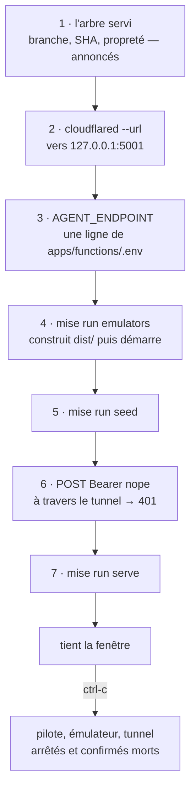

# L'outil de session — monter le système de test en une commande

> **For agentic workers:** REQUIRED SUB-SKILL: Use superpowers:subagent-driven-development (recommended) or superpowers:executing-plans to implement this plan task-by-task. Steps use checkbox (`- [ ]`) syntax for tracking.

**Goal:** une commande, `mise run session`, qui ouvre le tunnel, reporte son URL
dans `AGENT_ENDPOINT`, construit, démarre l'émulateur et son interface, sème,
prouve le 401 à travers le tunnel, lance le pilote, et démonte tout au Ctrl-C.

**Architecture:** un projet Nx `tools/dev-session`, sur la forme de
`tools/game-depot`. Tout ce qui décide — extraire une URL, réécrire une ligne,
lire un statut HTTP, tenir l'ordre — est une fonction pure testée sans réseau ni
processus. Un seul fichier, `src/session.ts`, connaît Node : il assemble les
ports et n'a aucune décision à lui.

**Tech Stack:** TypeScript, vitest, `tsx`. **Aucune dépendance npm nouvelle** —
`node:child_process`, `node:fs`, `node:process` et le `fetch` natif suffisent.

**Spec:** ce plan ne vient pas d'un spec mais d'un relevé de panne :
[`2026-09-09-tranche-3-bis-session.md`](2026-09-09-tranche-3-bis-session.md),
section « Ce qui a raté, et c'est la partie utile ». Les §6 et §7 du
[spec](../specs/2026-09-02-game-hosting-design.md) portent le sens de
`AGENT_ENDPOINT` et du 401.

---

## Pourquoi cet outil existe

Les deux sessions du 2026-09-08 ont enchaîné ces gestes à la main. Trois pannes
en sont sorties, et le plan les vise une par une :

1. **L'ordre est contraignant et rien ne le rappelle.** L'émulateur lit
   `apps/functions/dist/.env`, une **copie** reposée par le build. Réécrire
   `apps/functions/.env` sans reconstruire, ou reconstruire après avoir démarré
   l'émulateur, fait provisionner une machine facturée qui rapporte à une URL
   morte. C'est arrivé.
2. **Le tunnel expire avec sa fenêtre**, et son URL change à chaque ouverture.
3. **Une bascule de branche est invisible depuis le pilote.** L'arbre était passé
   sur `main` entre deux soirées ; deux sessions sont mortes en `PROVISIONING`,
   et le seul signal était une phrase au journal d'audit Firestore.

La troisième ne se corrige pas par un refus — **la commande construit `dist/`
elle-même, après la réécriture**. « Le code servi n'est pas celui de l'arbre »
devient impossible par construction. Il reste à dire quel arbre, en tête et en
évidence, et c'est tout ce que l'étape 1 fait : **elle n'a aucun pouvoir de
refus.** `main` propre est une valeur de travail légitime.

## Global Constraints

- **Aucune dépendance npm.** Rien ne s'ajoute à `package.json` ni à
  `package-lock.json`. C'est ce qui garde ce travail parallélisable avec la
  tranche 4.
- **Code, commentaires et sortie de la commande en anglais.** Ce plan et les
  messages de commit sont en français (CLAUDE.md).
- **Aucun secret n'atteint la sortie**, y compris dans un message d'erreur ou
  une trace. `apps/functions/.env` porte cinq valeurs qui ne doivent jamais être
  imprimées. Deux tests l'épinglent : un sur la fonction de réécriture, un sur
  l'interacteur complet.
- **La cible est l'émulateur, toujours.** Cet outil ne touche aucune ressource
  facturée et n'appelle aucune API de fournisseur.
- **Les étapes appellent les tâches `mise` par leur nom** — `emulators`, `seed`,
  `serve` — jamais leur contenu. Quand la tranche 4 ajoutera le premier membre
  au semis, ça arrive ici sans rien changer.
- **Portée des commits : `dev-session`**, sauf le commit qui n'ouvre que
  l'interface de l'émulateur, qui porte `emulators`.
- Un seul commit par tâche, sujet en français à l'impératif.
- **Ne pas lancer `nx format:write` ni `prettier --write`.** Le `.prettierrc` du
  dépôt ne fixe pas de `printWidth`, donc prettier retombe sur 80 colonnes —
  alors que le code est écrit à ~120, et que **24 fichiers déjà versionnés sont
  en désaccord avec prettier**. Formater ici reformaterait ces fichiers-là, dans
  un commit qui n'a rien à voir. Écrire au style des voisins, à la main.

## Structure des fichiers

```
tools/dev-session/
  package.json              cible nx `session`
  README.md                 ce que la commande fait, et ce qu'elle ne fait pas
  vitest.config.mts         généré
  eslint.config.mjs         généré
  tsconfig{,.lib,.spec}.json généré
  src/
    session.ts              point d'entrée : le seul fichier qui connaît Node
    index.ts                réexporte les modules purs
    lib/
      tunnel-url.ts         extrait l'URL du fouillis que cloudflared écrit
      agent-endpoint.ts     construit l'endpoint, réécrit une ligne de .env
      emulator-ports.ts     lit les ports déclarés dans firebase.dev.json
      readiness.ts          traduit un statut HTTP en verdict
      dev-session.ts        l'ordre, et le démontage en ordre inverse
```

Fichiers modifiés hors du projet :

- `firebase.dev.json` — déclare les ports `functions`, `hub`, et active l'`ui`
- `mise.toml` — la tâche `session`
- `tsconfig.json` racine — la référence ajoutée par le générateur

## La séquence



**`mise run emulators` seul, jamais `dev-functions` puis `emulators`.** La tâche
porte déjà `depends = ["dev-functions"]` : l'ordre build-avant-émulateur est
encodé là, une fois. Le redemander ici le dupliquerait et le ferait diverger.

---

### Task 1: Le projet, et l'URL que cloudflared cache dans son bavardage

**Files:**
- Create: `tools/dev-session/` (par le générateur)
- Create: `tools/dev-session/src/lib/tunnel-url.ts`
- Test: `tools/dev-session/src/lib/tunnel-url.spec.ts`
- Delete: `tools/dev-session/src/lib/dev-session.ts` et son spec générés
- Modify: `tsconfig.json` racine (par le générateur)

**Interfaces:**
- Consumes: rien
- Produces: `tunnelUrlFrom(text: string): string | undefined`

- [ ] **Step 1: Générer le projet**

Le générateur est obligatoire (CLAUDE.md) : il câble l'entrée dans le graphe Nx,
les chemins TypeScript et les cibles inférées, qu'un fichier écrit à la main
n'obtient pas. Commande vérifiée en `--dry-run` sur ce workspace :

```bash
npx nx g @nx/js:library --name=dev-session --directory=tools/dev-session \
  --bundler=none --unitTestRunner=vitest --linter=eslint \
  --testEnvironment=node --tags=scope:tool --no-interactive
```

Attendu : neuf fichiers créés sous `tools/dev-session/`, plus une référence
ajoutée au `tsconfig.json` racine. `package.json` racine n'est **pas** touché —
`workspaces` couvre déjà `tools/*`.

`--name=dev-session` produit `nx.name: "dev-session"` en plus de
`"name": "@beacon/dev-session"`. Sans ce flag le projet nx s'appellerait
`@beacon/dev-session`, et `mise run session` viserait le mauvais nom.

- [ ] **Step 2: Supprimer les deux fichiers d'exemple**

```bash
rm tools/dev-session/src/lib/dev-session.ts tools/dev-session/src/lib/dev-session.spec.ts
```

Le fichier `dev-session.ts` renaîtra à la tâche 6 avec un tout autre contenu.

`src/index.ts` réexporte le fichier qu'on vient de supprimer : le pointer sur le
module de cette tâche, sans quoi ce commit laisse un arbre qui ne compile pas —
et un commit dont l'annulation seule casserait le dépôt n'est pas un commit.

```ts
export * from './lib/tunnel-url.js';
```

**Chaque tâche suivante y ajoute sa ligne** au moment de son commit, pour la
même raison.

- [ ] **Step 3: Écrire le test qui échoue**

Créer `tools/dev-session/src/lib/tunnel-url.spec.ts` :

```ts
import { describe, expect, it } from 'vitest';
import { tunnelUrlFrom } from './tunnel-url.js';

/**
 * What cloudflared really writes on stderr, banner included. The documentation
 * link comes *before* the box: a reader that took "the first https url" would
 * point AGENT_ENDPOINT at Cloudflare's own documentation, which answers 200 to
 * anything — and a billed machine would report into a web page.
 */
const REAL_STDERR = [
  '2026-09-09T20:14:02Z INF Thank you for trying Cloudflare Tunnel. Doing so, without a Cloudflare',
  '  account, is a quick way to experiment and try it out. However, be aware that these',
  '  account-less Tunnels have no uptime guarantee. If you intend to use Tunnels in production',
  '  you should use a pre-created named tunnel by following: https://developers.cloudflare.com/',
  '  cloudflare-one/connections/connect-apps',
  '2026-09-09T20:14:02Z INF Requesting new quick Tunnel on trycloudflare.com...',
  '2026-09-09T20:14:05Z INF +------------------------------------------------------------------+',
  '2026-09-09T20:14:05Z INF |  Your quick Tunnel has been created! Visit it at (it may take     |',
  '2026-09-09T20:14:05Z INF |  some time to be reachable):                                      |',
  '2026-09-09T20:14:05Z INF |  https://ripe-badge-outer-quest.trycloudflare.com                 |',
  '2026-09-09T20:14:05Z INF +------------------------------------------------------------------+',
].join('\n');

describe('finding the tunnel url in what cloudflared says', () => {
  it('takes the quick tunnel, not the documentation link printed above it', () => {
    expect(tunnelUrlFrom(REAL_STDERR)).toBe('https://ripe-badge-outer-quest.trycloudflare.com');
  });

  // stderr arrives in chunks, and the box lands several seconds after the
  // banner. Before it lands there is no answer — and no wrong answer either.
  it('has no answer while only the banner has arrived', () => {
    const banner = REAL_STDERR.slice(0, REAL_STDERR.indexOf('Requesting new quick Tunnel'));
    expect(tunnelUrlFrom(banner)).toBeUndefined();
  });

  it('finds the url once the chunk that carried it is appended', () => {
    const cut = REAL_STDERR.indexOf('https://ripe-badge') + 20;
    expect(tunnelUrlFrom(REAL_STDERR.slice(0, cut))).toBeUndefined();
    expect(tunnelUrlFrom(REAL_STDERR)).toBe('https://ripe-badge-outer-quest.trycloudflare.com');
  });

  // The url sits inside an ascii box, padded up to a closing pipe. Carrying one
  // trailing space into AGENT_ENDPOINT would build an endpoint that resolves to
  // nothing, and the 401 probe would blame the tunnel.
  it('stops at the url, not at the box border that follows it', () => {
    const boxed = '2026-09-09T20:14:05Z INF |  https://ripe-badge-outer-quest.trycloudflare.com    |';
    expect(tunnelUrlFrom(boxed)).toBe('https://ripe-badge-outer-quest.trycloudflare.com');
  });

  it('ignores an update notice, which is also an https url on stderr', () => {
    const notice = '2026-09-09T20:14:01Z INF cloudflared version 2026.8.3 is out: https://github.com/cloudflare/cloudflared/releases';
    expect(tunnelUrlFrom(notice)).toBeUndefined();
  });
});
```

- [ ] **Step 4: Lancer le test, vérifier qu'il échoue**

```bash
npx nx run dev-session:test -- --run
```

Attendu : ÉCHEC, `Failed to resolve import "./tunnel-url.js"`.

- [ ] **Step 5: Écrire l'implémentation minimale**

Créer `tools/dev-session/src/lib/tunnel-url.ts` :

```ts
/**
 * cloudflared prints its url on stderr, in an ascii box, a few seconds after
 * it starts — and the banner above that box carries https urls of its own: the
 * documentation link it always prints, and an update notice it prints
 * sometimes. So this matches the shape of a quick tunnel rather than the first
 * url it sees. What that shape excludes is the point of the test next door.
 */
const QUICK_TUNNEL = /https:\/\/[a-z0-9-]+\.trycloudflare\.com/i;

/** The accumulated stderr so far; `undefined` until the box has landed. */
export function tunnelUrlFrom(text: string): string | undefined {
  return QUICK_TUNNEL.exec(text)?.[0];
}
```

- [ ] **Step 6: Lancer les tests, vérifier qu'ils passent**

```bash
npx nx run dev-session:test -- --run
npx nx run-many -t lint,typecheck -p dev-session
```

Attendu : 5 tests verts, lint et typecheck verts.

- [ ] **Step 7: Commit**

```bash
git add tools/dev-session tsconfig.json
git commit -m "feat(dev-session): sait lire l'url du tunnel dans le bavardage de cloudflared"
```

---

### Task 2: L'endpoint, et la ligne qu'on réécrit sans toucher aux douze autres

**Files:**
- Create: `tools/dev-session/src/lib/agent-endpoint.ts`
- Test: `tools/dev-session/src/lib/agent-endpoint.spec.ts`

**Interfaces:**
- Consumes: rien
- Produces:
  - `agentEndpointFor(tunnelUrl: string): string`
  - `withAgentEndpoint(envText: string, endpoint: string): EnvRewrite`
  - `interface EnvRewrite { readonly text: string; readonly assignments: number }`
  - constantes `EMULATOR_PROJECT`, `FUNCTIONS_REGION`, `AGENT_FUNCTION`

- [ ] **Step 1: Écrire le test qui échoue**

Créer `tools/dev-session/src/lib/agent-endpoint.spec.ts` :

```ts
import { describe, expect, it } from 'vitest';
import { agentEndpointFor, withAgentEndpoint } from './agent-endpoint.js';

const TUNNEL = 'https://ripe-badge-outer-quest.trycloudflare.com';
const ENDPOINT = `${TUNNEL}/demo-beacon/europe-west1/agentReport`;

/** Five fake secrets, in the shape the real file has. None may ever be printed. */
const SCW_SECRET = 'scw-secret-that-must-never-be-printed';
const S3_SECRET = 's3-secret-that-must-never-be-printed';
const DYNHOST_SECRET = 'dynhost-secret-that-must-never-be-printed';

const ENV = [
  '# Non-secret Scaleway parameters, read by the watchdog.',
  'SCW_ACCESS_KEY=SCWXXXXXXXXXXXXXXXXX',
  'SCW_PROJECT_ID=00000000-0000-0000-0000-000000000000',
  'SCW_ZONE=fr-par-1',
  `SCW_SECRET_KEY=${SCW_SECRET}`,
  '',
  'AGENT_ENDPOINT=https://a-tunnel-that-died-last-night.trycloudflare.com/demo-beacon/europe-west1/agentReport',
  'S3_ENDPOINT=https://s3.fr-par.scw.cloud',
  'S3_ACCESS_KEY=SCWYYYYYYYYYYYYYYYYY',
  `S3_SECRET_KEY=${S3_SECRET}`,
  'SAVES_BUCKET=beacon-saves',
  'GAMES_BUCKET=beacon-games',
  'SERVER_PASSWORD=a-password-that-must-never-be-printed',
  'DYNHOST_USER=beacon.charlouze.com',
  `DYNHOST_PASSWORD=${DYNHOST_SECRET}`,
  '',
].join('\n');

describe('the endpoint a game machine will report to', () => {
  // demo-beacon is the emulator project, europe-west1 the region declared on
  // every function in apps/functions/src/main.ts, agentReport the function
  // name. All three are duplicated here from places this project cannot
  // import — and all three are checked at every run by the 401 probe, which
  // answers 404 the moment one of them drifts, before a machine is billed.
  it('builds the full path the functions emulator serves', () => {
    expect(agentEndpointFor(TUNNEL)).toBe(ENDPOINT);
  });

  it('does not double the slash when the url carries a trailing one', () => {
    expect(agentEndpointFor(`${TUNNEL}/`)).toBe(ENDPOINT);
  });
});

describe('rewriting AGENT_ENDPOINT and nothing else', () => {
  it('puts the new endpoint in, and leaves every other line byte for byte', () => {
    const { text } = withAgentEndpoint(ENV, ENDPOINT);
    expect(text).toContain(`AGENT_ENDPOINT=${ENDPOINT}`);
    expect(text).not.toContain('a-tunnel-that-died-last-night');

    const before = ENV.split('\n');
    const after = text.split('\n');
    expect(after).toHaveLength(before.length);
    before.forEach((line, index) => {
      if (line.startsWith('AGENT_ENDPOINT=')) return;
      expect(after[index]).toBe(line);
    });
  });

  it('counts the assignments, so the operator is told what was left alone', () => {
    expect(withAgentEndpoint(ENV, ENDPOINT).assignments).toBe(13);
  });

  // The file on a Windows checkout has CRLF endings. Splitting and rejoining
  // would silently rewrite all thirteen lines, and the diff would say the
  // command touched everything it promised not to.
  it('leaves CRLF endings exactly as it found them', () => {
    const { text } = withAgentEndpoint(ENV.replace(/\n/g, '\r\n'), ENDPOINT);
    expect(text).toContain(`AGENT_ENDPOINT=${ENDPOINT}\r\n`);
    expect(text.split('\r\n')).toHaveLength(ENV.split('\n').length);
  });

  // A key that only ends with the name is not the key. dotenv reads
  // BEACON_AGENT_ENDPOINT as its own variable, and rewriting it would leave
  // the real one pointing at last night's tunnel.
  it('does not match a longer key that ends with the name', () => {
    const decoy = 'BEACON_AGENT_ENDPOINT=https://elsewhere.example\nAGENT_ENDPOINT=\n';
    const { text } = withAgentEndpoint(decoy, ENDPOINT);
    expect(text).toContain('BEACON_AGENT_ENDPOINT=https://elsewhere.example');
    expect(text).toContain(`\nAGENT_ENDPOINT=${ENDPOINT}`);
  });

  // Adding the line would be helpful and wrong: a .env without this key is not
  // the file this command thinks it is holding.
  it('refuses a file that has no such key, and names .env.example', () => {
    let message = '';
    try {
      withAgentEndpoint('S3_ENDPOINT=https://s3.fr-par.scw.cloud\n', ENDPOINT);
    } catch (error) {
      message = String(error);
    }
    expect(message).toContain('AGENT_ENDPOINT');
    expect(message).toContain('.env.example');
  });

  it('refuses a file that declares the key twice, rather than guessing which wins', () => {
    const twice = 'AGENT_ENDPOINT=https://one.example\nAGENT_ENDPOINT=https://two.example\n';
    expect(() => withAgentEndpoint(twice, ENDPOINT)).toThrow(/twice/);
  });
});

/**
 * The load-bearing test of this module. Whatever goes wrong, the five secrets
 * in that file must not reach a terminal, a log, or a stack trace.
 */
describe('what a failure is allowed to say', () => {
  it('names no value from the file, whatever the fault', () => {
    const broken = ENV.replace(/^AGENT_ENDPOINT=.*$/m, '');
    let message = '';
    try {
      withAgentEndpoint(broken, ENDPOINT);
    } catch (error) {
      message = `${String(error)}${error instanceof Error ? error.stack : ''}`;
    }
    expect(message).not.toBe('');
    for (const secret of [SCW_SECRET, S3_SECRET, DYNHOST_SECRET]) {
      expect(message).not.toContain(secret);
    }
  });
});
```

- [ ] **Step 2: Lancer le test, vérifier qu'il échoue**

```bash
npx nx run dev-session:test -- --run
```

Attendu : ÉCHEC, `Failed to resolve import "./agent-endpoint.js"`.

- [ ] **Step 3: Écrire l'implémentation minimale**

Créer `tools/dev-session/src/lib/agent-endpoint.ts` :

```ts
/**
 * The emulator's project id, fixed by `firebase emulators:start --project`
 * in the `emulators` mise task.
 */
export const EMULATOR_PROJECT = 'demo-beacon';

/** Declared on every function in `apps/functions/src/main.ts`. */
export const FUNCTIONS_REGION = 'europe-west1';

/** The one endpoint a game machine talks to (§7). */
export const AGENT_FUNCTION = 'agentReport';

const KEY = 'AGENT_ENDPOINT';

/**
 * All three names above are duplicated from files this project cannot import,
 * which is the shape of drift. What makes it survivable is that the 401 probe
 * calls this very url at every run: a wrong project, region or function name
 * answers 404 and the command refuses — before a machine is billed.
 */
export function agentEndpointFor(tunnelUrl: string): string {
  const host = tunnelUrl.replace(/\/+$/, '');
  return `${host}/${EMULATOR_PROJECT}/${FUNCTIONS_REGION}/${AGENT_FUNCTION}`;
}

export interface EnvRewrite {
  /** The whole file, one line changed. Never printed, never logged. */
  readonly text: string;
  /** How many `KEY=` lines the file holds, so the operator hears what was spared. */
  readonly assignments: number;
}

/**
 * Twelve of the thirteen values in `apps/functions/.env` are none of this
 * command's business, and five of them are credentials. So this replaces one
 * line by regex rather than parsing and re-emitting the file: bytes that are
 * not the endpoint are never rebuilt, and CRLF endings survive.
 *
 * Nothing here — return value, error message, or stack — carries a value read
 * out of that file.
 */
export function withAgentEndpoint(envText: string, endpoint: string): EnvRewrite {
  const assignment = new RegExp(`^${KEY}=[^\\r\\n]*`, 'gm');
  const found = envText.match(assignment)?.length ?? 0;

  if (found === 0) {
    throw new Error(
      `apps/functions/.env holds no ${KEY}= line. ` +
        `That is not the file this expects — apps/functions/.env.example says which keys belong in it.`,
    );
  }
  if (found > 1) {
    throw new Error(`apps/functions/.env declares ${KEY} twice, and nothing here will guess which one is read`);
  }

  return {
    text: envText.replace(assignment, `${KEY}=${endpoint}`),
    assignments: envText.match(/^[A-Z_][A-Z0-9_]*=/gm)?.length ?? 0,
  };
}
```

- [ ] **Step 4: Lancer les tests, vérifier qu'ils passent**

```bash
npx nx run dev-session:test -- --run
npx nx run-many -t lint,typecheck -p dev-session
```

Attendu : tous verts.

- [ ] **Step 5: Commit**

```bash
git add tools/dev-session
git commit -m "feat(dev-session): reecrit AGENT_ENDPOINT sans toucher aux douze autres valeurs"
```

---

### Task 3: Montrer la base et les journaux pendant la session

**Files:**
- Modify: `firebase.dev.json:12-16`

**Interfaces:**
- Consumes: rien
- Produces: l'interface de l'émulateur sur `http://127.0.0.1:4000`

- [ ] **Step 1: Activer l'interface**

Dans `firebase.dev.json`, remplacer le bloc `emulators` par :

```json
  "emulators": {
    "firestore": { "port": 8080 },
    "ui": { "enabled": true, "port": 4000 },
    "singleProjectMode": true
  }
```

- [ ] **Step 2: Vérifier à la main**

```bash
mise run emulators
```

Ouvrir `http://127.0.0.1:4000`. Attendu : l'onglet Firestore montre les
documents, l'onglet Logs montre la sortie des Functions. Puis Ctrl-C.

C'est le seul moyen de vérifier ce changement : aucun test unitaire ne dit si
une interface s'est affichée.

- [ ] **Step 3: Commit**

```bash
git add firebase.dev.json
git commit -m "feat(emulators): montre la base et les journaux pendant une session"
```

---

### Task 4: Les ports déclarés, plutôt que devinés

**Files:**
- Modify: `firebase.dev.json`
- Create: `tools/dev-session/src/lib/emulator-ports.ts`
- Test: `tools/dev-session/src/lib/emulator-ports.spec.ts`

**Interfaces:**
- Consumes: rien
- Produces:
  - `interface EmulatorPorts { readonly functions: number; readonly hub: number; readonly ui: number }`
  - `emulatorPortsFrom(configText: string): EmulatorPorts`

- [ ] **Step 1: Déclarer les deux ports que le fichier taisait**

Dans `firebase.dev.json`, le bloc `emulators` devient :

```json
  "emulators": {
    "firestore": { "port": 8080 },
    "functions": { "port": 5001 },
    "hub": { "port": 4400 },
    "ui": { "enabled": true, "port": 4000 },
    "singleProjectMode": true
  }
```

`functions` et `hub` étaient jusqu'ici des défauts de `firebase-tools`. Le
tunnel pointe vers le premier et la sonde de disponibilité interroge le second :
un défaut qui bouge à une montée de version enverrait le tunnel vers un port
que rien n'écoute, et le verdict accuserait le tunnel.

- [ ] **Step 2: Écrire le test qui échoue**

Créer `tools/dev-session/src/lib/emulator-ports.spec.ts` :

```ts
import { readFileSync } from 'node:fs';
import { describe, expect, it } from 'vitest';
import { emulatorPortsFrom } from './emulator-ports.js';

/** Vitest roots this project at `tools/dev-session`, so the real file is four up. */
const REAL_CONFIG = new URL('../../../../firebase.dev.json', import.meta.url);

const CONFIG = JSON.stringify({
  firestore: { rules: 'firestore.dev.rules', indexes: 'firestore.indexes.json' },
  functions: [{ source: 'apps/functions/dist', codebase: 'default' }],
  emulators: {
    firestore: { port: 8080 },
    functions: { port: 5001 },
    hub: { port: 4400 },
    ui: { enabled: true, port: 4000 },
    singleProjectMode: true,
  },
});

describe('reading the ports the emulator was told to use', () => {
  it('takes the three the command needs', () => {
    expect(emulatorPortsFrom(CONFIG)).toEqual({ functions: 5001, hub: 4400, ui: 4000 });
  });

  // The top-level `functions` key is an array of codebases and has no port.
  // Reading it instead of emulators.functions would yield undefined, and the
  // tunnel would be opened towards `http://127.0.0.1:undefined`.
  it('reads emulators.functions, not the codebase declaration next to it', () => {
    expect(emulatorPortsFrom(CONFIG).functions).toBe(5001);
  });

  it('names the port that is missing rather than falling back to a default', () => {
    const without = JSON.stringify({ emulators: { firestore: { port: 8080 }, hub: { port: 4400 } } });
    expect(() => emulatorPortsFrom(without)).toThrow(/functions/);
  });

  it('refuses a ui that is declared but switched off', () => {
    const off = JSON.stringify({
      emulators: { functions: { port: 5001 }, hub: { port: 4400 }, ui: { enabled: false, port: 4000 } },
    });
    expect(() => emulatorPortsFrom(off)).toThrow(/ui/);
  });
});

/**
 * The one test that fails when someone edits firebase.dev.json without reading
 * this file. It is the whole reason the ports are declared there rather than
 * copied here.
 */
describe('the real firebase.dev.json', () => {
  it('declares all three ports this command depends on', () => {
    const ports = emulatorPortsFrom(readFileSync(REAL_CONFIG, 'utf8'));
    expect(ports).toEqual({ functions: 5001, hub: 4400, ui: 4000 });
  });
});
```

- [ ] **Step 3: Lancer le test, vérifier qu'il échoue**

```bash
npx nx run dev-session:test -- --run
```

Attendu : ÉCHEC, `Failed to resolve import "./emulator-ports.js"`.

- [ ] **Step 4: Écrire l'implémentation minimale**

Créer `tools/dev-session/src/lib/emulator-ports.ts` :

```ts
export interface EmulatorPorts {
  /** What the tunnel points at. */
  readonly functions: number;
  /** What answers whether the emulator has finished coming up. */
  readonly hub: number;
  /** Where the operator watches the database and the function logs. */
  readonly ui: number;
}

interface DeclaredPort {
  readonly port?: number;
  readonly enabled?: boolean;
}

/**
 * Read rather than copied. Three ports decide whether this command works at
 * all, and a default taken silently — `firebase-tools` has one for each — is
 * the failure that looks like a tunnel fault: the box carries, nothing is
 * behind it, and the verdict blames the wrong half.
 */
export function emulatorPortsFrom(configText: string): EmulatorPorts {
  const emulators = (JSON.parse(configText) as { emulators?: Record<string, DeclaredPort> }).emulators ?? {};

  const portOf = (name: string): number => {
    const declared = emulators[name];
    if (declared?.port === undefined) {
      throw new Error(`firebase.dev.json declares no port for the ${name} emulator, and this command will not guess one`);
    }
    return declared.port;
  };

  // Ports first: a config that declares no ui at all must be told which port is
  // missing, not that its ui is switched off — a message it cannot act on.
  const ports = { functions: portOf('functions'), hub: portOf('hub'), ui: portOf('ui') };

  if (emulators['ui']?.enabled !== true) {
    throw new Error('firebase.dev.json has the ui emulator switched off, and a session is conducted by watching it');
  }

  return ports;
}
```

L'ordre des deux gardes n'est pas cosmétique : placée avant les ports, la garde
`ui` tire la première sur un fichier qui ne déclare **aucun** `ui`, et annonce
« ui éteinte » à quelqu'un dont le vrai problème est un port `functions`
manquant. Le test « names the port that is missing » est ce qui l'attrape.

- [ ] **Step 5: Lancer les tests, vérifier qu'ils passent**

```bash
npx nx run dev-session:test -- --run
npx nx run-many -t lint,typecheck -p dev-session
```

Attendu : tous verts. Le dernier test lit le vrai `firebase.dev.json`, donc il
échoue si l'étape 1 a été sautée.

- [ ] **Step 6: Commit**

```bash
git add firebase.dev.json tools/dev-session
git commit -m "feat(dev-session): lit les ports de l'emulateur au lieu de les recopier"
```

---

### Task 5: Le verdict, qui dit laquelle des trois choses a lâché

**Files:**
- Create: `tools/dev-session/src/lib/readiness.ts`
- Test: `tools/dev-session/src/lib/readiness.spec.ts`

**Interfaces:**
- Consumes: rien
- Produces:
  - `type Probe = { readonly status: number } | { readonly unreachable: string }`
  - `interface Verdict { readonly ok: boolean; readonly lines: readonly string[] }`
  - `verdictFor(probe: Probe): Verdict`
  - `PROBE_BODY`, `PROBE_TOKEN`

- [ ] **Step 1: Écrire le test qui échoue**

Créer `tools/dev-session/src/lib/readiness.spec.ts` :

```ts
import { describe, expect, it } from 'vitest';
import { verdictFor } from './readiness.js';

const said = (probe: Parameters<typeof verdictFor>[0]): string => verdictFor(probe).lines.join(' ');

describe('what one POST with a false token proves', () => {
  // Three things at once, which is why this probe is worth its round trip: the
  // tunnel carries, the function is loaded, and the token barrier bites.
  it('takes 401 as the green light', () => {
    expect(verdictFor({ status: 401 }).ok).toBe(true);
    expect(said({ status: 401 })).toContain('token');
  });

  // The loudest failure in the file. A fake token that is accepted means
  // anything on the internet can drive a session, and the machine this would
  // provision is billed. Never hand over on this.
  it('refuses hardest when a false token is accepted', () => {
    expect(verdictFor({ status: 200 }).ok).toBe(false);
    expect(said({ status: 200 })).toContain('accepted a token that does not exist');
  });

  it('reads 404 as a wrong url rather than a broken tunnel', () => {
    expect(verdictFor({ status: 404 }).ok).toBe(false);
    expect(said({ status: 404 })).toContain('project, region or function name');
  });

  // agentReport answers 400 when parseReport refuses the body. That is this
  // command's own probe drifting from @beacon/agent-protocol — not a fault of
  // the tunnel, and pointing at the tunnel would send the operator hunting in
  // the wrong place.
  it('reads 400 as the probe body having drifted from the protocol', () => {
    expect(verdictFor({ status: 400 }).ok).toBe(false);
    expect(said({ status: 400 })).toContain('agent-protocol');
  });

  it('reads a bad gateway as nothing listening behind the tunnel', () => {
    for (const status of [502, 503, 504, 530]) {
      expect(verdictFor({ status }).ok).toBe(false);
      expect(said({ status })).toContain('nothing is listening');
    }
  });

  it('reads no answer at all as a tunnel that does not carry', () => {
    const verdict = verdictFor({ unreachable: 'fetch failed' });
    expect(verdict.ok).toBe(false);
    expect(said({ unreachable: 'fetch failed' })).toContain('did not answer');
  });

  it('reports a status it has no story for, rather than staying quiet', () => {
    expect(verdictFor({ status: 418 }).ok).toBe(false);
    expect(said({ status: 418 })).toContain('418');
  });
});
```

- [ ] **Step 2: Lancer le test, vérifier qu'il échoue**

```bash
npx nx run dev-session:test -- --run
```

Attendu : ÉCHEC, `Failed to resolve import "./readiness.js"`.

- [ ] **Step 3: Écrire l'implémentation minimale**

Créer `tools/dev-session/src/lib/readiness.ts` :

```ts
/** A token that is not in the database, and must never be. */
export const PROBE_TOKEN = 'nope';

/**
 * The smallest body `parseReport` accepts. If it ever stops being accepted the
 * probe answers 400, and the verdict says so in those words rather than
 * blaming the tunnel.
 */
export const PROBE_BODY = { sessionId: 'x', phase: 'alive' } as const;

export type Probe = { readonly status: number } | { readonly unreachable: string };

export interface Verdict {
  readonly ok: boolean;
  readonly lines: readonly string[];
}

/**
 * One POST, three proofs: the tunnel carries, the function is loaded, and the
 * token barrier bites. Every other answer says which of the three failed —
 * that is the whole value of doing this before a machine exists rather than
 * discovering it from a session dying in PROVISIONING.
 */
export function verdictFor(probe: Probe): Verdict {
  if ('unreachable' in probe) {
    return {
      ok: false,
      lines: [
        'the tunnel did not answer at all.',
        'cloudflared is up but nothing came back — the quick tunnel may still be',
        'propagating, or it has already expired.',
      ],
    };
  }

  switch (probe.status) {
    case 401:
      return { ok: true, lines: ['401 — the tunnel carries, the function is loaded, the token barrier bites'] };
    case 200:
      return {
        ok: false,
        lines: [
          'agentReport accepted a token that does not exist.',
          'Nothing is guarding the endpoint a game machine reports to. Do not provision.',
        ],
      };
    case 400:
      return {
        ok: false,
        lines: [
          'agentReport refused the probe body, not the token.',
          "This command's probe has drifted from @beacon/agent-protocol —",
          'the tunnel is most likely fine.',
        ],
      };
    case 404:
      return {
        ok: false,
        lines: [
          'the tunnel carries, but that path is not agentReport.',
          'One of the project, region or function name in agent-endpoint.ts is wrong.',
        ],
      };
    case 502:
    case 503:
    case 504:
    case 530:
      return {
        ok: false,
        lines: [
          `${probe.status} — the tunnel carries, but nothing is listening behind it.`,
          'The functions emulator is not serving on the port the tunnel points at.',
        ],
      };
    default:
      return { ok: false, lines: [`${probe.status} — no story for this answer, and it is not the 401 expected`] };
  }
}
```

- [ ] **Step 4: Lancer les tests, vérifier qu'ils passent**

```bash
npx nx run dev-session:test -- --run
npx nx run-many -t lint,typecheck -p dev-session
```

Attendu : tous verts.

- [ ] **Step 5: Commit**

```bash
git add tools/dev-session
git commit -m "feat(dev-session): fait dire au 401 laquelle des trois choses a lache"
```

---

### Task 6: L'ordre, et le démontage en ordre inverse

**Files:**
- Create: `tools/dev-session/src/lib/dev-session.ts`
- Test: `tools/dev-session/src/lib/dev-session.spec.ts`

**Interfaces:**
- Consumes: `tunnelUrlFrom`, `agentEndpointFor`, `withAgentEndpoint`,
  `emulatorPortsFrom`, `verdictFor`, `PROBE_BODY`, `PROBE_TOKEN`
- Produces:
  - `interface Started { readonly name: string; stop(): Promise<void>; running(): boolean }`
  - `interface Spawned extends Started { output(): string }`
  - `interface DevSessionPorts { … }` (détail ci-dessous)
  - `type DevSessionOutcome = 'held' | 'refused'`
  - `runDevSession(ports: DevSessionPorts): Promise<DevSessionOutcome>`

- [ ] **Step 1: Écrire le test qui échoue**

Créer `tools/dev-session/src/lib/dev-session.spec.ts` :

```ts
import { describe, expect, it } from 'vitest';
import { type DevSessionPorts, type Spawned, runDevSession } from './dev-session.js';

const SECRET = 'the-secret-that-must-never-be-printed';

const ENV = ['AGENT_ENDPOINT=https://dead.trycloudflare.com/x', `SCW_SECRET_KEY=${SECRET}`, ''].join('\n');

const FIREBASE_CONFIG = JSON.stringify({
  emulators: {
    firestore: { port: 8080 },
    functions: { port: 5001 },
    hub: { port: 4400 },
    ui: { enabled: true, port: 4000 },
  },
});

const TUNNEL_STDERR = 'INF |  https://ripe-badge-outer-quest.trycloudflare.com  |';

interface Recorded {
  readonly calls: string[];
  readonly said: string[];
  readonly written: Map<string, string>;
}

function fakePorts(overrides: Partial<DevSessionPorts> = {}): { ports: DevSessionPorts; log: Recorded } {
  const log: Recorded = { calls: [], said: [], written: new Map() };

  const spawn = (name: string): Spawned => {
    log.calls.push(`spawn:${name}`);
    let alive = true;
    return {
      name,
      output: () => (name === 'tunnel' ? TUNNEL_STDERR : ''),
      running: () => alive,
      stop: async () => {
        log.calls.push(`stop:${name}`);
        alive = false;
      },
    };
  };

  const ports: DevSessionPorts = {
    head: async () => ({ branch: 'main', sha: '292bfab', clean: true }),
    readText: (path) => {
      log.calls.push(`read:${path}`);
      return path.endsWith('.env') ? ENV : FIREBASE_CONFIG;
    },
    writeText: (path, text) => {
      log.calls.push(`write:${path}`);
      log.written.set(path, text);
    },
    spawn,
    run: async (name) => {
      log.calls.push(`run:${name}`);
      return 0;
    },
    probe: async () => {
      log.calls.push('probe');
      return { status: 401 };
    },
    reachable: async () => true,
    waitUntil: async (what) => {
      log.calls.push(`wait:${what}`);
      return true;
    },
    say: (line) => log.said.push(line),
    hold: async () => {
      log.calls.push('hold');
    },
    ...overrides,
  };
  return { ports, log };
}

describe('the order, which is the whole point of the command', () => {
  it('runs the seven steps in the one order that works', async () => {
    const { ports, log } = fakePorts();
    expect(await runDevSession(ports)).toBe('held');

    // The rewrite lands before the build, and the build is inside `emulators`
    // — that is the invariant two dead sessions paid for. dist/.env is a copy
    // the build lays down, and the emulator reads it once, at startup.
    expect(log.calls.filter((call) => !call.startsWith('read:'))).toEqual([
      'spawn:tunnel',
      'wait:tunnel url',
      'write:apps/functions/.env',
      'spawn:emulator',
      'wait:emulator',
      'run:seed',
      'probe',
      'spawn:pilot',
      'wait:pilot',
      'hold',
      'stop:pilot',
      'stop:emulator',
      'stop:tunnel',
    ]);
  });

  it('stops what it started in reverse, so no tunnel outlives the window', async () => {
    const { ports, log } = fakePorts();
    await runDevSession(ports);
    expect(log.calls.slice(-3)).toEqual(['stop:pilot', 'stop:emulator', 'stop:tunnel']);
  });
});

/**
 * A precondition checked after acting is the exact class of fault this command
 * exists to prevent, so its own preconditions are checked before it acts.
 */
describe('what it settles before it starts anything', () => {
  it('refuses without opening a tunnel when the env file cannot be read', async () => {
    const { ports, log } = fakePorts({
      readText: (path) => {
        if (path.endsWith('.env')) throw new Error("ENOENT: no such file or directory, open 'apps/functions/.env'");
        return FIREBASE_CONFIG;
      },
    });
    expect(await runDevSession(ports)).toBe('refused');
    expect(log.calls).not.toContain('spawn:tunnel');
    expect(log.said.join('\n')).toContain('nothing has been started yet');
  });

  // The rewrite is rehearsed in step 1, so a file that is not the one this
  // command expects is refused before cloudflared is ever launched.
  it('refuses without opening a tunnel when the env file carries no AGENT_ENDPOINT', async () => {
    const { ports, log } = fakePorts({
      readText: (path) => (path.endsWith('.env') ? `SCW_SECRET_KEY=${SECRET}\n` : FIREBASE_CONFIG),
    });
    expect(await runDevSession(ports)).toBe('refused');
    expect(log.calls).not.toContain('spawn:tunnel');
    expect(log.said.join('\n')).toContain('AGENT_ENDPOINT');
    // The refusal prints what the rewrite threw, so this is the path where a
    // leak would happen if the rewrite ever named a value it read.
    expect(log.said.join('\n')).not.toContain(SECRET);
  });
});

describe('what happens when a step gives up', () => {
  it('tears down the two it had started when the seed fails', async () => {
    const { ports, log } = fakePorts({
      run: async (name) => {
        log.calls.push(`run:${name}`);
        return 1;
      },
    });
    expect(await runDevSession(ports)).toBe('refused');
    expect(log.calls).not.toContain('spawn:pilot');
    expect(log.calls.slice(-2)).toEqual(['stop:emulator', 'stop:tunnel']);
  });

  // The failure that must never hand over: anything on the internet could
  // drive a session, and what it would provision is billed.
  it('refuses and tears down when a false token is accepted', async () => {
    const { ports, log } = fakePorts({ probe: async () => ({ status: 200 }) });
    expect(await runDevSession(ports)).toBe('refused');
    expect(log.calls).not.toContain('spawn:pilot');
    expect(log.calls.slice(-2)).toEqual(['stop:emulator', 'stop:tunnel']);
  });

  it('leaves no orphan when cloudflared never prints a url', async () => {
    const { ports, log } = fakePorts({ waitUntil: async () => false });
    expect(await runDevSession(ports)).toBe('refused');
    expect(log.calls).toContain('stop:tunnel');
    expect(log.calls).not.toContain('write:apps/functions/.env');
  });

  // stop() signals, waits, then kills hard. If a process is still alive after
  // all that, saying so is the only thing left that is useful: the next run
  // will fail on a port that is still held, minutes from here.
  it('says loudly when something refused to die', async () => {
    const { ports, log } = fakePorts({
      spawn: (name) => {
        log.calls.push(`spawn:${name}`);
        return { name, output: () => TUNNEL_STDERR, running: () => true, stop: async () => undefined };
      },
    });
    await runDevSession(ports);
    expect(log.said.join('\n')).toContain('still alive');
  });
});

describe('the branch, said and never refused', () => {
  it('names the branch and the commit the emulator will serve', async () => {
    const { ports, log } = fakePorts();
    await runDevSession(ports);
    expect(log.said.join('\n')).toContain('main');
    expect(log.said.join('\n')).toContain('292bfab');
  });

  // main is a legitimate tree to test from. The gesture that killed two
  // sessions was not "being on main", it was not knowing — and the build this
  // command performs makes the tree served and the tree checked out the same
  // thing by construction.
  it('holds the window on main just the same', async () => {
    const { ports } = fakePorts();
    expect(await runDevSession(ports)).toBe('held');
  });

  it('says when the tree is dirty, because that is served too', async () => {
    const { ports, log } = fakePorts({
      head: async () => ({ branch: 'tranche-4-la-securite', sha: 'deadbee', clean: false }),
    });
    await runDevSession(ports);
    expect(log.said.join('\n')).toContain('uncommitted');
  });
});

/**
 * The end-to-end version of the guarantee agent-endpoint.spec.ts makes about
 * one function: across a whole run, nothing this command says carries a value
 * out of apps/functions/.env.
 */
describe('what the whole run is allowed to print', () => {
  it('never says a secret, on the green path', async () => {
    const { ports, log } = fakePorts();
    await runDevSession(ports);
    expect(log.said.join('\n')).not.toContain(SECRET);
    expect(log.written.get('apps/functions/.env')).toContain(SECRET);
  });

  it('never says a secret when a step fails either', async () => {
    const { ports, log } = fakePorts({ probe: async () => ({ unreachable: 'fetch failed' }) });
    await runDevSession(ports);
    expect(log.said.join('\n')).not.toContain(SECRET);
  });
});
```

- [ ] **Step 2: Lancer le test, vérifier qu'il échoue**

```bash
npx nx run dev-session:test -- --run
```

Attendu : ÉCHEC, `Failed to resolve import "./dev-session.js"`.

- [ ] **Step 3: Écrire l'implémentation minimale**

Créer `tools/dev-session/src/lib/dev-session.ts` :

```ts
import { agentEndpointFor, withAgentEndpoint } from './agent-endpoint.js';
import { type EmulatorPorts, emulatorPortsFrom } from './emulator-ports.js';
import { PROBE_BODY, PROBE_TOKEN, type Probe, verdictFor } from './readiness.js';
import { tunnelUrlFrom } from './tunnel-url.js';

export const FUNCTIONS_ENV = 'apps/functions/.env';
export const FIREBASE_CONFIG = 'firebase.dev.json';
/** Angular's default. Announced only — see step 7 for why that is enough. */
export const PILOT_URL = 'http://localhost:4200';

/**
 * Stands in for the real endpoint while step 1 rehearses the rewrite. It is
 * never written anywhere: the rehearsal exists to make a bad `.env` throw
 * before a tunnel is opened, and its result is discarded.
 */
const REHEARSAL_ENDPOINT = 'https://rehearsal.invalid/never-written';

/** A long-running child this command is responsible for killing. */
export interface Started {
  readonly name: string;
  stop(): Promise<void>;
  running(): boolean;
}

export interface Spawned extends Started {
  /** Everything the child has written so far, stdout and stderr merged. */
  output(): string;
}

export interface Head {
  readonly branch: string;
  readonly sha: string;
  readonly clean: boolean;
}

export interface DevSessionPorts {
  readonly head: () => Promise<Head>;
  readonly readText: (path: string) => string;
  readonly writeText: (path: string, text: string) => void;
  readonly spawn: (name: string, command: string, args: readonly string[]) => Spawned;
  /** Runs to completion and answers its exit code. */
  readonly run: (name: string, command: string, args: readonly string[]) => Promise<number>;
  readonly probe: (url: string, token: string, body: unknown) => Promise<Probe>;
  /** A plain GET that only answers whether something is listening. */
  readonly reachable: (url: string) => Promise<boolean>;
  /** Polls `check` until true or the deadline passes. */
  readonly waitUntil: (what: string, check: () => Promise<boolean> | boolean, timeoutMs: number) => Promise<boolean>;
  readonly say: (line: string) => void;
  /** Resolves when the operator asks for the window back. */
  readonly hold: () => Promise<void>;
}

export type DevSessionOutcome =
  /** The window was held, then handed back. */
  | 'held'
  /** Something was wrong; nothing was left running. */
  | 'refused';

/** The quick tunnel prints its box a few seconds in; sixty is generous. */
const TUNNEL_URL_TIMEOUT_MS = 60_000;
/** `mise run emulators` builds the functions first, and that build is not fast. */
const EMULATOR_TIMEOUT_MS = 300_000;
/** Angular's first compile, on a cold cache. */
const PILOT_TIMEOUT_MS = 240_000;
/** A fresh quick tunnel takes a few seconds to be reachable from outside. */
const PROBE_TIMEOUT_MS = 60_000;

/**
 * One command for the gesture that used to be seven, in the one order that
 * works. The order is not a convenience: `apps/functions/dist/.env` is a copy
 * the build lays down, and the emulator reads it once at startup. Rewriting
 * after the build, or building after the emulator, provisions a billed machine
 * that reports to a dead url — which is what happened on 2026-09-08.
 *
 * Every long-running child is pushed on a stack as it starts, and the stack is
 * unwound in reverse on any exit — a failed step as much as a ctrl-c. Nothing
 * this command started outlives it, and a tunnel left behind is an url that
 * carries nothing while still looking alive.
 */
export async function runDevSession(ports: DevSessionPorts): Promise<DevSessionOutcome> {
  const { say } = ports;
  const started: Started[] = [];

  say('beacon: a test session, from the tunnel to the pilot');

  try {
    say('');
    say('1. The tree this emulator will serve');
    const head = await ports.head();
    say(`  ok    ${head.branch} @ ${head.sha}${head.clean ? '' : ', with uncommitted changes'}`);
    // Said, never refused. main is a legitimate tree to test from, and the
    // build below makes the tree served and the tree checked out the same
    // thing — so the only thing left worth doing is naming it.
    say('        this command builds what is here, so that is what will run');

    const emulator: EmulatorPorts = emulatorPortsFrom(ports.readText(FIREBASE_CONFIG));

    // Both files are read before anything is started, and the rewrite is
    // rehearsed against a url that will never be written. A file this command
    // cannot use costs nothing to find out about here; found out after the
    // next step, it costs an open tunnel and the operator's attention.
    let envText: string;
    try {
      envText = ports.readText(FUNCTIONS_ENV);
      withAgentEndpoint(envText, REHEARSAL_ENDPOINT);
    } catch (error) {
      say(`  STOP  ${FUNCTIONS_ENV} is not usable, and nothing has been started yet.`);
      // Safe to print: the read failure names a path, and the rewrite is
      // written never to carry a value out of that file.
      say(`        ${error instanceof Error ? error.message : String(error)}`);
      say('        That file is git-ignored and holds real credentials, so a fresh worktree');
      say('        has none: run this from the main checkout, or copy the file into yours.');
      return 'refused';
    }
    say(`  ok    ${FUNCTIONS_ENV} is readable and carries AGENT_ENDPOINT`);

    say('');
    say('2. The tunnel');
    const tunnel = ports.spawn('tunnel', 'cloudflared', [
      'tunnel',
      '--no-autoupdate',
      '--url',
      `http://127.0.0.1:${emulator.functions}`,
    ]);
    started.push(tunnel);
    const gotUrl = await ports.waitUntil(
      'tunnel url',
      () => tunnelUrlFrom(tunnel.output()) !== undefined,
      TUNNEL_URL_TIMEOUT_MS,
    );
    const tunnelUrl = gotUrl ? tunnelUrlFrom(tunnel.output()) : undefined;
    if (tunnelUrl === undefined) {
      say('  STOP  cloudflared printed no quick tunnel url.');
      say('        Nothing was rewritten and nothing else was started.');
      return 'refused';
    }
    say(`  ok    ${tunnelUrl} -> http://127.0.0.1:${emulator.functions}`);

    say('');
    say('3. AGENT_ENDPOINT');
    const endpoint = agentEndpointFor(tunnelUrl);
    const rewrite = withAgentEndpoint(envText, endpoint);
    ports.writeText(FUNCTIONS_ENV, rewrite.text);
    say(`  ok    ${FUNCTIONS_ENV}, one line rewritten, ${rewrite.assignments - 1} other values untouched`);
    say('  ok    no value out of that file is printed by this command, here or below');

    say('');
    say('4. The emulator, which builds first');
    const emulatorProcess = ports.spawn('emulator', 'mise', ['run', 'emulators']);
    started.push(emulatorProcess);
    // The hub, not a log line. `firebase-tools` rewords "All emulators ready"
    // between versions; the hub answering on its declared port is a contract.
    const up = await ports.waitUntil(
      'emulator',
      () => ports.reachable(`http://127.0.0.1:${emulator.hub}/emulators`),
      EMULATOR_TIMEOUT_MS,
    );
    if (!up) {
      say('  STOP  the emulator hub never answered.');
      return 'refused';
    }
    say(`  ok    functions on ${emulator.functions}, hub on ${emulator.hub}`);
    say(`  ok    emulator ui   http://127.0.0.1:${emulator.ui}   database and function logs`);

    say('');
    say('5. The seed');
    if ((await ports.run('seed', 'mise', ['run', 'seed'])) !== 0) {
      say('  STOP  the seed did not finish.');
      return 'refused';
    }
    say('  ok    server/current, config/settings');

    say('');
    say('6. The 401, through the tunnel');
    let verdict = verdictFor(await ports.probe(endpoint, PROBE_TOKEN, PROBE_BODY));
    if (!verdict.ok) {
      // A quick tunnel takes a few seconds to be reachable from outside, so
      // one red answer is not yet an answer.
      await ports.waitUntil(
        'endpoint',
        async () => {
          verdict = verdictFor(await ports.probe(endpoint, PROBE_TOKEN, PROBE_BODY));
          return verdict.ok;
        },
        PROBE_TIMEOUT_MS,
      );
    }
    if (!verdict.ok) {
      say('  STOP  the endpoint a game machine would report to is not answering as it must.');
      for (const line of verdict.lines) say(`        ${line}`);
      return 'refused';
    }
    for (const line of verdict.lines) say(`  ok    ${line}`);

    say('');
    say('7. The pilot');
    const pilot = ports.spawn('pilot', 'mise', ['run', 'serve']);
    started.push(pilot);
    // Announced, not depended on — unlike the emulator ports, nothing here
    // points at 4200. So a pilot that took longer than the wait, or that
    // picked another port because 4200 was busy, is worth a line and not a
    // refusal: its own output above already said where it is listening.
    if (await ports.waitUntil('pilot', () => ports.reachable(PILOT_URL), PILOT_TIMEOUT_MS)) {
      say(`  ok    ${PILOT_URL}`);
    } else {
      say(`  !     nothing answered on ${PILOT_URL} — read the pilot's own output above for its port`);
    }

    say('');
    say('  --    ctrl-c stops all three, in reverse order');
    await ports.hold();
    return 'held';
  } finally {
    say('');
    for (const child of [...started].reverse()) {
      await child.stop();
      // Not a politeness. A tunnel or an emulator that survives holds a port,
      // and the next run fails on it several minutes from here, far from the
      // cause.
      if (child.running()) {
        say(`  !     ${child.name} is still alive after being asked and then killed — stop it by hand`);
      } else {
        say(`  ok    ${child.name} stopped`);
      }
    }
  }
}
```

**Cette fonction est longue exprès, et ne se découpe pas.** Sept étapes
extraites en sept fonctions appelées une seule fois chacune rendraient l'ordre
— la seule chose que ce fichier existe pour montrer — invisible dans le fichier
qui le porte, et chaque extraction serait un module creux : une interface de
plus pour aucune fonctionnalité cachée. La règle des vingt lignes sert la
lisibilité ; ici elle la coûterait. Le seul découpage envisagé et écarté est le
démontage, qui tient en huit lignes dans un `finally` où il est déjà séparé.

- [ ] **Step 4: Lancer les tests, vérifier qu'ils passent**

```bash
npx nx run dev-session:test -- --run
npx nx run-many -t lint,typecheck -p dev-session
```

Attendu : tous verts. Si l'ordre attendu du premier test ne correspond pas,
c'est l'implémentation qui a tort : cet ordre est la raison d'être du fichier.

- [ ] **Step 5: Commit**

```bash
git add tools/dev-session
git commit -m "feat(dev-session): tient l'ordre qui a coute deux sessions, et demonte a l'envers"
```

---

### Task 7: Le point d'entrée, le Ctrl-C, et la tâche `mise`

**Files:**
- Create: `tools/dev-session/src/session.ts`
- Modify: `tools/dev-session/src/index.ts`
- Modify: `tools/dev-session/package.json`
- Modify: `tools/dev-session/README.md`
- Modify: `mise.toml`

**Interfaces:**
- Consumes: `runDevSession`, `DevSessionPorts`, `Spawned`
- Produces: `mise run session`

- [ ] **Step 1: Écrire le point d'entrée**

Créer `tools/dev-session/src/session.ts` :

```ts
import { type ChildProcess, execFileSync, spawn as spawnProcess } from 'node:child_process';
import { readFileSync, writeFileSync } from 'node:fs';
import { setTimeout as delay } from 'node:timers/promises';
import { type DevSessionPorts, type Spawned, runDevSession } from './lib/dev-session.js';
import type { Probe } from './lib/readiness.js';

const STOP_GRACE_MS = 10_000;
const POLL_MS = 1_000;
/** How long a wait may stay silent before it says it is still a wait. */
const SILENCE_MS = 15_000;

/**
 * A shell where `mise activate` has run already carries the pinned tools; one
 * that has not still reaches the same versions through `mise exec`. Same
 * resolution as the sibling in tools/game-depot.
 *
 * `mise` itself is exempt: falling back to `mise exec -- mise` would be
 * nonsense, and every step here is a mise task. If it is not on the path,
 * nothing below can work and saying so once is the useful answer.
 */
function resolveBinary(command: string): { file: string; prefix: readonly string[] } {
  if (command === 'mise') return { file: 'mise', prefix: [] };
  try {
    execFileSync(command, ['--version'], { stdio: 'ignore' });
    return { file: command, prefix: [] };
  } catch {
    return { file: 'mise', prefix: ['exec', '--', command] };
  }
}

/**
 * Killing a child is not killing what it started. `mise run emulators` becomes
 * npx, then firebase, then a java for firestore and a node for functions —
 * and on Windows `child.kill()` reaches only the first of them, leaving the
 * ports held. `taskkill /T` is what walks the tree.
 */
async function stopTree(child: ChildProcess): Promise<void> {
  const pid = child.pid;
  if (pid === undefined || child.exitCode !== null) return;

  if (process.platform === 'win32') {
    try {
      execFileSync('taskkill', ['/pid', String(pid), '/T'], { stdio: 'ignore' });
    } catch {
      // Already gone, or refusing politeness. The hard kill below answers both.
    }
  } else {
    try {
      process.kill(-pid, 'SIGINT');
    } catch {
      // Same.
    }
  }

  const deadline = Date.now() + STOP_GRACE_MS;
  while (child.exitCode === null && Date.now() < deadline) await delay(POLL_MS);
  if (child.exitCode !== null) return;

  try {
    if (process.platform === 'win32') execFileSync('taskkill', ['/pid', String(pid), '/T', '/F'], { stdio: 'ignore' });
    else process.kill(-pid, 'SIGKILL');
  } catch {
    // Nothing left to try; runDevSession says so out loud.
  }
  await delay(POLL_MS);
}

function spawnChild(name: string, command: string, args: readonly string[]): Spawned {
  const { file, prefix } = resolveBinary(command);
  const child = spawnProcess(file, [...prefix, ...args], {
    // The children write straight to this console, so their logs interleave
    // with the steps above — that is the price of one window, and it is the
    // price the window was chosen for.
    stdio: ['ignore', 'pipe', 'pipe'],
    shell: false,
    detached: process.platform !== 'win32',
  });

  let seen = '';
  const keep = (chunk: Buffer): void => {
    const text = chunk.toString('utf8');
    seen += text;
    process.stdout.write(text);
  };
  child.stdout?.on('data', keep);
  child.stderr?.on('data', keep);

  return {
    name,
    output: () => seen,
    running: () => child.exitCode === null && child.signalCode === null,
    stop: () => stopTree(child),
  };
}

const ports: DevSessionPorts = {
  head: async () => ({
    branch: execFileSync('git', ['branch', '--show-current'], { encoding: 'utf8' }).trim(),
    sha: execFileSync('git', ['rev-parse', '--short', 'HEAD'], { encoding: 'utf8' }).trim(),
    clean: execFileSync('git', ['status', '--porcelain'], { encoding: 'utf8' }).trim() === '',
  }),

  readText: (path) => readFileSync(path, 'utf8'),

  writeText: (path, text) => writeFileSync(path, text),

  spawn: spawnChild,

  run: async (_name, command, args) => {
    const { file, prefix } = resolveBinary(command);
    const child = spawnProcess(file, [...prefix, ...args], { stdio: 'inherit', shell: false });
    return await new Promise((resolve) => child.on('close', (code) => resolve(code ?? 1)));
  },

  probe: async (url, token, body) => {
    try {
      const response = await fetch(url, {
        method: 'POST',
        headers: { authorization: `Bearer ${token}`, 'content-type': 'application/json' },
        body: JSON.stringify(body),
        signal: AbortSignal.timeout(10_000),
      });
      return { status: response.status };
    } catch (error) {
      return { unreachable: error instanceof Error ? error.message : 'no answer' };
    }
  },

  reachable: async (url) => {
    try {
      await fetch(url, { signal: AbortSignal.timeout(2_000) });
      // Any answer at all is the whole question: something is listening. A 404
      // from the hub would still mean the emulator is up.
      return true;
    } catch {
      return false;
    }
  },

  // `what` is not decoration. Waiting for the emulator means waiting for the
  // functions build first, which runs for minutes — and a terminal that says
  // nothing for minutes is indistinguable from one that has hung.
  waitUntil: async (what, check, timeoutMs) => {
    const deadline = Date.now() + timeoutMs;
    let waited = 0;
    while (Date.now() < deadline) {
      if (await check()) return true;
      await delay(POLL_MS);
      waited += POLL_MS;
      if (waited % SILENCE_MS === 0) console.log(`  ..    still waiting for ${what}, ${waited / 1000}s in`);
    }
    return false;
  },

  say: (line) => console.log(line),

  // On Windows ctrl-c reaches every process on the console, so the children
  // may already be dying when the stack unwinds. stopTree is written to be
  // right either way: it asks, waits, kills, and confirms.
  hold: () => new Promise((resolve) => process.once('SIGINT', () => resolve())),
};

try {
  if ((await runDevSession(ports)) === 'refused') process.exitCode = 1;
} catch (error) {
  // Never the error object: a stack from the rewrite would carry a line of
  // apps/functions/.env into the terminal.
  console.error(`beacon: ${error instanceof Error ? error.message : 'the session could not be brought up'}`);
  process.exitCode = 1;
}
```

- [ ] **Step 2: Vérifier que les réexports sont complets**

`tools/dev-session/src/index.ts` a grandi d'une ligne par tâche. À l'arrivée il
doit porter exactement :

```ts
export * from './lib/agent-endpoint.js';
export * from './lib/dev-session.js';
export * from './lib/emulator-ports.js';
export * from './lib/readiness.js';
export * from './lib/tunnel-url.js';
```

- [ ] **Step 3: Déclarer la cible nx**

Dans `tools/dev-session/package.json`, ajouter au bloc `nx` (le générateur ne
le fait pas — les cibles de `game-depot` ont été ajoutées de la même façon) :

```json
    "targets": {
      "session": {
        "executor": "nx:run-commands",
        "options": {
          "command": "npx tsx tools/dev-session/src/session.ts"
        }
      }
    }
```

- [ ] **Step 4: Déclarer la tâche `mise`**

Ajouter à `mise.toml`, après `[tasks.serve]` :

```toml
# Les sept gestes d'une soiree d'essai, dans le seul ordre qui marche. L'ordre
# n'est pas un confort : `apps/functions/dist/.env` est une copie que le build
# repose, et l'emulateur ne la lit qu'au demarrage. Reecrire apres avoir
# construit, ou construire apres avoir demarre l'emulateur, fait provisionner
# une machine facturee qui rapporte a une url morte — c'est arrive le
# 2026-09-08. La commande tient la fenetre ; Ctrl-C arrete les trois processus
# en ordre inverse.
[tasks.session]
description = "Monte le tunnel, l'emulateur, le semis et le pilote, et verifie le 401"
run = "npx nx run dev-session:session"
```

- [ ] **Step 5: Écrire le README du projet**

Remplacer `tools/dev-session/README.md` par :

````markdown
# dev-session

One command for an evening of testing against a real game machine:

```bash
mise run session
```

It opens a tunnel, points `AGENT_ENDPOINT` at it, builds, starts the emulator
and its ui, seeds, proves the 401 through the tunnel, starts the pilot, and
holds the window until ctrl-c.

## The order is the product

`apps/functions/dist/.env` is a **copy**, laid down by the build, and the
emulator reads it once at startup. So the only order that works is: tunnel,
rewrite, build, emulator, seed, probe, pilot. Rewriting after the build, or
building after the emulator has started, provisions a billed machine that
reports to a dead url. That happened on 2026-09-08, and the two sessions it
cost are written up in
[the tranche 3 bis log](../../docs/superpowers/plans/2026-09-09-tranche-3-bis-session.md).

## What the 401 proves

One `POST` with a token that does not exist. `401` says three things at once:
the tunnel carries, the function is loaded, and the token barrier bites. Every
other answer says which of the three failed — `404` a wrong url, `502` nothing
listening behind the tunnel, `400` this command's own probe drifting from
`@beacon/agent-protocol`, and `200` an endpoint that guards nothing at all.

## What it does not do

- **It never refuses a branch.** It prints the branch, the commit and whether
  the tree is dirty, then carries on — including on `main`. It builds what is
  in the tree, so what is served and what is checked out are the same thing.
- **It touches nothing that is billed.** No provider api, no production
  database. It stops at the 401; opening a session is the human gesture that
  follows.
- **It knows no game and no save prefix.** It depends on no library in this
  repository.

## When something is left running

Every child is stopped in reverse order on the way out — pilot, emulator,
tunnel — and each one is confirmed dead rather than assumed. If a line says
`still alive`, a port is still held and the next run will fail on it.
````

- [ ] **Step 6: Vérifier que rien n'est cassé**

```bash
grep '"type"' tools/dev-session/package.json
npx nx run-many -t lint,typecheck -p dev-session
CI=true npx nx run-many -t test
git diff --stat package.json package-lock.json
```

Attendu : `"type": "module"` — `session.ts` a un `await` de premier niveau, qui
ne compile pas en CommonJS. Puis lint et typecheck verts, les 13 projets verts.

Sur les dépendances : `package.json` racine ne bouge **pas du tout**, et
`package-lock.json` ne gagne que les **deux entrées de lien d'espace de travail**
que le générateur y pose pour `@beacon/dev-session` — huit lignes, aucun paquet
tiers. C'est la forme exacte que prend la contrainte « aucune dépendance npm » ;
toute autre ligne dans ce diff est une violation.

`test-ci` n'est pas utilisable — il exige Nx Cloud sur ce workspace. `CI=true`
est ce qui sort `test` du mode `watch` déclaré dans `nx.json`.

- [ ] **Step 7: Commit**

```bash
git add tools/dev-session mise.toml
git commit -m "feat(dev-session): donne au geste ses sept etapes en une commande"
```

---

### Task 8: **[humain]** L'éprouver pour de vrai, sans provisionner

**Files:** aucun

Cette tâche ne s'écrit pas, elle se conduit. Elle n'allume **aucune machine** et
ne coûte rien : elle s'arrête avant d'ouvrir une session dans le pilote.

- [ ] **Step 1: Lancer la commande**

```bash
mise run session
```

Attendu, dans l'ordre : la branche et le SHA ; une URL en
`https://….trycloudflare.com` ; la ligne réécrite ; l'émulateur et son
interface ; le semis ; **`ok 401`** ; le pilote.

- [ ] **Step 2: Vérifier ce que le tableau de bord annonce**

- `http://127.0.0.1:4000` montre `server/current` en `IDLE` et l'onglet des
  journaux des Functions.
- `apps/functions/dist/.env` porte la **même** URL que celle imprimée à
  l'étape 2 — c'est l'invariant que la commande existe pour tenir :

```bash
grep AGENT_ENDPOINT apps/functions/dist/.env
```

- Le 401 se rejoue depuis une autre machine que le poste, pour prouver que le
  tunnel porte de l'extérieur et pas seulement en boucle locale :

```bash
curl -i -X POST "<l-url-imprimee>/demo-beacon/europe-west1/agentReport" \
  -H 'authorization: Bearer nope' -H 'content-type: application/json' \
  -d '{"sessionId":"x","phase":"alive"}'
```

- [ ] **Step 3: Ctrl-C, puis vérifier qu'il ne reste rien**

```bash
# Windows
Get-Process cloudflared,java -ErrorAction SilentlyContinue
netstat -ano | Select-String ':5001|:8080|:4000|:4200'
```

Attendu : aucun processus, aucun port tenu. C'est la garde qui compte le plus
au quotidien — un tunnel orphelin est une URL qui a l'air vivante.

- [ ] **Step 4: Éprouver un rouge, exprès**

Relancer, et pendant que la commande attend le 401, couper le tunnel depuis une
autre fenêtre. Attendu : la commande refuse, dit **laquelle** des trois choses a
lâché, et démonte l'émulateur puis le tunnel.

- [ ] **Step 5: Relever ce qui a été appris**

Ajouter au bas de ce plan une section « Ce que l'outil a appris en marchant » :
les durées réelles (URL du tunnel, émulateur prêt, pilote prêt), et tout écart
entre ce que le plan supposait et ce qui s'est passé. Si un délai s'avère trop
court, le corriger dans `dev-session.ts` **dans le même commit** que le relevé.

```bash
git add docs/superpowers/plans/2026-09-09-outil-de-session.md
git commit -m "docs(plan): releve ce que l'outil de session mesure en marchant"
```

---

## Ce que ce plan ne fait pas

- **Il ne restaure pas `apps/functions/.env` en sortant.** La valeur y reste,
  périmée, jusqu'au prochain lancement qui la réécrira. C'est sans danger
  précisément parce que la réécriture précède toujours le build : une URL morte
  dans ce fichier ne peut plus atteindre un émulateur qui tourne.
- **Il ne sait rien du catalogue des jeux ni du préfixe des sauvegardes.** Le
  projet ne dépend d'aucune lib du dépôt, et son tag `scope:tool` l'y contraint.
- **Il ne conduit pas la session.** Ouvrir une session, provisionner une
  machine, la regarder démarrer : c'est le geste humain qui suit, et il coûte
  de l'argent. Cette commande s'arrête au 401.
