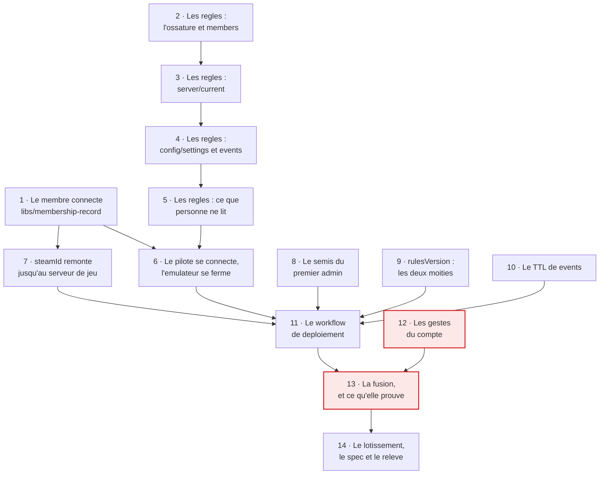

# Tranche 4 — La sécurité

> **For agentic workers:** REQUIRED SUB-SKILL: Use superpowers:subagent-driven-development (recommended) or superpowers:executing-plans to implement this plan task-by-task. Steps use checkbox (`- [ ]`) syntax for tracking.

**But :** le système peut être exposé. Un membre se connecte avec son compte
Google, les règles Firestore délimitent son autorité champ par champ, un
visiteur n'obtient rien, et la fusion dans `main` déploie le tout — règles,
index, Functions et l'application — avec le semis du premier admin et le tampon
de version. À la fin, le gate du lotissement est levé : c'est la seule tranche
dont c'est l'objet.

**Approche :** les règles sont écrites **après** les écritures qu'elles
filtrent, et c'est la deuxième des trois règles du lotissement. Toutes existent
depuis la tranche 2 ; aucune ligne de `libs/session` ni de `libs/session-record`
n'est à changer pour elles. L'ordre suit la surface : d'abord le module qui dit
*qui est là*, puis les règles collection par collection, puis le pilote qui les
éprouve depuis un vrai navigateur, puis la chaîne de livraison, puis les gestes
humains, et la fusion en dernier.

**Une contrainte de forme, héritée des tranches 3 et 3 bis.** Ce plan porte
**les tests et les contraintes de chaque tâche, jamais le code
d'implémentation**. Onze contradictions avaient été trouvées entre le code
embarqué dans le plan de la tranche 3 et ses propres tests : du code jamais
exécuté se périme entre son écriture et sa lecture, et c'est le lecteur qui
paie. Un bloc de code ci-dessous est donc **un test, une valeur littérale à
écrire, ou une commande à lancer** — jamais une implémentation à recopier.

**Pile :** Nx 23.2.0, TypeScript en ESM `nodenext`, Vitest 4.1, Angular 22,
`firebase` 11 (Auth et Firestore côté client), `firebase-admin` 13,
`@firebase/rules-unit-testing` 4, émulateurs Firestore et Auth, GitHub Actions
avec identité fédérée OIDC.

**Spec :** [`docs/superpowers/specs/2026-09-02-game-hosting-design.md`](../specs/2026-09-02-game-hosting-design.md).
Cette tranche implémente le §4 (`libs/membership-record`, ce que les règles font
et ne font pas), le §5 (qui a le droit de lire, la propriété champ par champ,
`steamId`, le semis du premier admin, le TTL de `events`), le §7 (le modèle de
menace en entier), le §9 (la suite de refus, écritures **et** lectures) et le
§10 (le déploiement à la fusion, ses cinq étapes, et la protection de `main`).
Le découpage est au [lotissement](2026-09-02-lotissement.md), que la tâche 14
met à jour.

---

## Ce que les tranches précédentes laissent

Cinq legs commandent ce plan, et aucun n'est une surprise :

- **`firestore.rules` refuse tout**, et `libs/rules` le vérifie document par
  document. C'est ce fichier qui devient les vraies règles ; sa suite actuelle
  (`closed.spec.ts`) disparaît avec lui.
- **`firestore.dev.rules` ouvre tout**, chargé par `firebase.dev.json` et par
  rien d'autre. Il existe pour que le pilote de la tranche 2 puisse écrire
  contre l'émulateur, et il n'a plus de raison d'être dès que les vraies règles
  existent : c'est l'émulateur qui devient la préproduction pour de bon.
- **Le pilote se déclare `{ uid: 'driver', name: 'Driver' }`.** Rien dans
  `apps/web` ne sait qui est là.
- **`ADMIN_STEAM_IDS` est une constante du catalogue**, dans
  `deploy/cloud-init/src/lib/sunkenland.ts:66`, et son commentaire nomme déjà
  cette tranche. C'est le seul moyen qu'un humain a de déclencher une sauvegarde
  sur ce jeu.
- **La règle de lint de `apps/web` annonce que `firebase/auth` deviendra
  légitime en tranche 4.** La décision du 2026-09-09 dit le contraire : le SDK
  Auth vit dans `libs/membership-record`. Ce commentaire est faux et la tâche 6
  le corrige.

Et un fait de livraison qu'il faut avoir en tête : **`main` n'est pas égal à ce
qui tourne**, aujourd'hui. Le seul workflow du dépôt est celui des pull
requests ; ce qui est en production y a été mis par un humain lançant
`firebase deploy` depuis son poste. La tâche 11 est ce qui rend vraie la phrase
du §10, et la tâche 13 est le premier moment où elle l'est.

## Les décisions prises avec le commanditaire, le 2026-09-09

Elles ne se redécouvrent pas en cours d'exécution.

1. **Un membre entre par la console.** Un `uid` Google n'existe qu'après une
   première connexion : le visiteur se connecte, ne lit rien, et son `uid`
   apparaît à côté de son e-mail dans l'onglet Auth de la console, d'où l'admin
   crée `members/{uid}`. Ce n'est pas une exception taillée dans les règles —
   une écriture de console passe par l'Admin SDK, donc au-dessus d'elles par
   construction. **Conséquence directe sur ce plan : la face écriture de
   `libs/membership-record` n'est pas construite ici**, faute d'appelant. Elle
   naît avec l'écran d'administration, en tranche 5.
2. **La connexion vit dans `libs/membership-record`**, pas dans `apps/web`.
   L'`Actor` que porte chaque événement vient du profil Google, et « qui je
   suis » ne se lit jamais sans « ce que j'ai le droit de faire ». Le §4 est
   corrigé en conséquence (commit `db05905`).
3. **La tranche va jusqu'à la production, Hosting compris.** La fusion déploie
   les règles, les index, les Functions **et** l'application sur
   `beacon.charlouze.com`. Conséquence assumée : le produit visible est un
   pilote nu pendant une tranche, et un membre qui clique démarre une vraie
   machine — le watchdog est là pour ça depuis la tranche 1.
4. **Les deux moitiés du garde-fou de version sont ici.** Le déploiement tamponne
   `config/settings.rulesVersion`, et le front se recharge sur écart. Une moitié
   sans l'autre est un champ écrit que personne ne lit.

## Contraintes globales

- **Aucune fusion dans `main` par un agent, aucun `firebase deploy`, aucune
  écriture dans le Firestore de production, aucun geste dans une console de
  fournisseur.** Les tâches 12 et 13 sont conduites par un humain de bout en
  bout. La cible de tout le reste est **l'émulateur**.
- **Les règles sont de la sécurité, pas du métier** (§4). Aucune arithmétique
  d'échéance, aucune lecture de `config/settings` depuis les règles, aucune
  table de transitions légales. Le pendant en test : **aucun test de règles ne
  contient de date ni de durée** (§9) — une assertion sur une fenêtre de trente
  minutes dans ce dossier est le signe qu'une règle métier a fui.
- **Les règles font un `get()` sur `members` et sur rien d'autre.** C'est la
  frontière du §5 : lire pour savoir *qui tu es*, jamais pour savoir *ce qui est
  métier-correct*.
- **Toute chaîne écrite par un client est bornée**, à 1024 caractères, la même
  borne que `libs/agent-protocol` porte déjà sur le fil.
- **Chaque refus est testé sur `create` **et** sur `update`** quand les deux
  existent : une règle correcte en modification et permissive en création ne
  protège rien (§9).
- **Les refus de lecture se testent au même titre que ceux d'écriture**, et
  collection par collection. Une lecture de trop ne casse rien : elle fuit.
- **Aucun identifiant de production n'entre dans le dépôt.** L'application lit
  sa configuration Firebase sur `/__/firebase/init.json`, que Hosting sert
  lui-même ; il n'y a donc rien à coller nulle part. La clé d'API web n'est pas
  un secret, mais rien n'oblige à la recopier ici.
- **Les actions GitHub sont épinglées par SHA**, comme `companion.yml` le fait
  déjà.
- **Tu ne te mentionnes nulle part** — ni commit, ni description de pull
  request, ni commentaire.

## L'ordre, et ce qui le produit



**Les tâches 2 à 5 sont en file et non en parallèle**, parce qu'elles écrivent
le même fichier. Chacune ajoute un `match` et sa suite de refus ; l'ordre va du
plus structurant au plus fermé, de sorte qu'une revue puisse rejeter la 3 sans
rejeter la 2.

**La tâche 6 attend les cinq précédentes**, et c'est la seule qui ne peut pas
être coupée en deux : elle supprime les règles permissives de développement, et
le pilote cesse au même instant de pouvoir écrire sans se connecter. Livrer
l'une sans l'autre laisse le dépôt dans un état où `npx nx serve web` ne fait
plus rien.

**Les tâches 8, 9 et 10 ne dépendent de rien** et pourraient être faites en
premier ; elles sont placées après parce que le workflow de la tâche 11 les
appelle toutes les trois, et qu'il vaut mieux qu'elles existent avant qu'un
fichier YAML les nomme.

**La tâche 12 ne dépend d'aucune autre** et peut être lancée dès le premier
jour : un humain peut activer le fournisseur Google et créer la fédération
d'identité pendant que le reste s'écrit. Elle est seulement obligatoire avant la
13.

**La tâche 7 est la seule qui ne serve pas le gate**, et c'est ce qu'il faut
couper si la tranche s'allonge. Elle vient du legs de la 3 bis, elle a besoin de
`members` — donc de cette tranche-ci et pas d'une autre —, mais rien de
l'exposition n'en dépend. Reportée, elle laisse le jeu exactement dans l'état où
la 3 bis l'a livré : un administrateur en dur, qui est le seul à pouvoir
déclencher une sauvegarde.

**Aucune suite existante n'est à réparer**, et c'est une conséquence heureuse
d'une décision de la tranche 2 : les suites d'émulateur de `session-record`
chargent `firestore.rules` mais écrivent par le jeton `owner`, qui contourne les
règles, et celles de `apps/functions` passent par l'Admin SDK, qui est au-dessus
d'elles. Les vraies règles ne rougissent donc rien de ce qui existe. Si une de
ces suites casse, c'est un `match` trop large, pas un test à adapter.

**Aucune tâche ne prouve la chaîne entière avant la 13**, et il faut le dire
plutôt que le laisser croire. Les tests de règles tournent contre l'émulateur
avec des jetons simulés ; le pilote tourne contre l'émulateur avec l'émulateur
Auth ; ni l'un ni l'autre n'éprouve une vraie connexion Google, un vrai
déploiement OIDC, ni la propagation d'une règle chez Google.

## Ce que la tranche ne construit pas

Hors périmètre par décision, pas par oubli.

- **Pas d'écran.** Le monde visuel, les cinq états, le décompte et l'écran du
  visiteur non autorisé sont la tranche 5. Le pilote reste nu et le reste
  volontairement : rien de ce qui est écrit ici ne doit survivre à ce travail
  par accident.
- **Pas de gestion des membres dans l'interface** — décision 1 ci-dessus. Ni
  liste, ni ajout, ni retrait, ni changement de rôle.
- **Pas de session de jeu réelle, donc pas un centime de calcul.** La tranche 13
  se connecte, lit, et se fait refuser des choses. Elle ne clique pas sur
  « démarrer ».
- **Pas de custom claim Auth.** Le §5 tranche : le rôle vit dans `members`, lu
  par `get()`. C'est plus cher en lectures et immédiat au retrait, et ça évite
  une Function pour un geste qui ne demande aucun secret.
- **Pas de règle sur `expiresAt`.** Le TTL de `events` est de 400 jours et une
  règle qui le vérifierait devrait porter une durée, ce que le §9 interdit
  nommément. La borne réelle est la taille des chaînes, et elle est testée.
- **Pas de vérification de format sur `steamId`.** Le §5 le dit : c'est un
  entier public, non vérifiable, et le déclarer n'accorde rien. Seule sa borne
  de taille est contrôlée.
- **Pas de secret Scaleway dans GitHub** (§10). Le workflow de déploiement ne
  parle qu'à Firebase.

---

### Task 1: Le membre connecté

`libs/membership-record` naît. C'est l'ACL du §4 pour `members/`, **et pour la
connexion Google** depuis la correction de spec du 2026-09-09. Elle rend une
seule valeur, et c'est ce qui la rend utile : « qui est là » et « ce qu'il a le
droit de faire » ne se lisent jamais séparément.

**La forme est un objet humble**, et c'est la seule façon de tester quoi que ce
soit ici : une fenêtre de connexion Google ne s'ouvre pas dans un runner. Le
module définit donc un port `IdentitySource` — s'abonner à l'identité, se
connecter, se déconnecter — dont l'implémentation Firebase Auth est une dizaine
de lignes sans test, et tout le reste se teste contre une identité bouchonnée.

**Ce que ce module ne fait pas :** il n'écrit pas `members`, sauf le `steamId`
du sujet lui-même. Ajouter, promouvoir, retirer sont la tranche 5 (décision 1).

**Fichiers :**
- Créer : la bibliothèque, **par le générateur** (voir Step 1)
- Créer : `libs/membership-record/src/lib/viewer.ts`, `viewer.spec.ts`
- Créer : `libs/membership-record/src/lib/client-membership.ts`
- Créer : `libs/membership-record/src/lib/firebase-identity.ts`
- Créer : `libs/membership-record/src/client.ts`, `src/index.ts`
- Créer : `libs/membership-record/src/lib/client-membership.spec.ts`

**Interfaces :**
- Produit : `type Role = 'admin' | 'player'`
- Produit : `interface Identity { readonly uid: string; readonly name: string }`
- Produit : `interface Member { readonly uid: string; readonly name: string; readonly role: Role; readonly steamId: string | null }`
- Produit : `type Viewer = { kind: 'signed-out' } | { kind: 'visitor'; identity: Identity } | { kind: 'member'; member: Member }`
- Produit : `viewerFrom(identity: Identity | null, data: Record<string, unknown> | null): Viewer`
- Produit : `interface IdentitySource { watch(on: (i: Identity | null) => void): () => void; signIn(): Promise<void>; signOut(): Promise<void> }`
- Produit : `firebaseIdentity(auth: Auth): IdentitySource`
- Produit : `clientMembershipRecord(db: Firestore, identity: IdentitySource): ClientMembershipRecord`, dont l'interface est
  `watchViewer(on: (viewer: Viewer) => void): () => void`, `signIn(): Promise<void>`,
  `signOut(): Promise<void>`, `declareSteamId(steamId: string): Promise<void>`
- Produit : `connectMembershipRecord(options: { app: FirebaseApp; emulator?: { host: string; port: number } }): ClientMembershipRecord`
  — même façade que `connectSessionRecord`, dans `./client`
- Consomme : rien. La bibliothèque porte le tag `scope:record`, donc elle ne
  peut dépendre que du domaine, et elle n'en a même pas besoin.

- [ ] **Step 1: Générer la bibliothèque**

**Obligatoire, et avant toute écriture de fichier** (`CLAUDE.md`). Invoquer la
skill `nx-generate`, puis générer une bibliothèque TypeScript de la même
facture que `libs/session-record` : `scope:record`, ESM, Vitest.

Après génération, aligner à la main ce que le générateur ne sait pas :
le nom `@beacon/membership-record` — celui de sa sœur, et les commandes
ci-dessous en dépendent —, `"tags": ["scope:record"]`, l'export `./client` dans
`exports`, et une cible `test` sur `firebase emulators:exec` copiée de
`libs/session-record/package.json` en changeant le seul chemin de config Vitest.

- [ ] **Step 2: Écrire les tests de la traduction, qui échouent**

Dans `libs/membership-record/src/lib/viewer.spec.ts`. Tests purs : ni Firestore,
ni Auth.

```ts
import { describe, expect, it } from 'vitest';
import { viewerFrom } from './viewer.js';

const ALICE = { uid: 'alice', name: 'Alice' };

describe('who is at the keyboard', () => {
  it('is signed out when there is no identity', () => {
    expect(viewerFrom(null, null)).toEqual({ kind: 'signed-out' });
  });

  // PRODUCT.md: "un visiteur non autorisé existe et doit être traité". The
  // identity travels with it because the screen greets a person, not a uid.
  it('is a visitor when the identity has no member document', () => {
    expect(viewerFrom(ALICE, null)).toEqual({ kind: 'visitor', identity: ALICE });
  });

  it('is a member when the document names a role', () => {
    expect(viewerFrom(ALICE, { role: 'player', email: 'alice@example.com' })).toEqual({
      kind: 'member',
      member: { uid: 'alice', name: 'Alice', role: 'player', steamId: null },
    });
  });

  it('reads the admin role as itself', () => {
    expect(viewerFrom(ALICE, { role: 'admin' })).toEqual({
      kind: 'member',
      member: { uid: 'alice', name: 'Alice', role: 'admin', steamId: null },
    });
  });

  // The name is the Google profile's, never the document's: `members` carries
  // an email, which is not a name, and §5 protects it rather than displaying
  // it.
  it('takes the name from the identity and never from the document', () => {
    const viewer = viewerFrom(ALICE, { role: 'player', name: 'Someone Else' });
    expect(viewer).toEqual({
      kind: 'member',
      member: { uid: 'alice', name: 'Alice', role: 'player', steamId: null },
    });
  });

  it('carries the declared steam id, and nothing else about it', () => {
    expect(viewerFrom(ALICE, { role: 'player', steamId: '76561197965918116' })).toEqual({
      kind: 'member',
      member: { uid: 'alice', name: 'Alice', role: 'player', steamId: '76561197965918116' },
    });
  });

  // Never repaired, never invented. A role this vocabulary does not know says
  // nothing about what its holder may do, so the answer is the honest one.
  it('refuses to guess at a role it does not know', () => {
    expect(viewerFrom(ALICE, { role: 'moderator' })).toEqual({ kind: 'visitor', identity: ALICE });
    expect(viewerFrom(ALICE, { email: 'alice@example.com' })).toEqual({
      kind: 'visitor',
      identity: ALICE,
    });
  });
});
```

- [ ] **Step 3: Lancer les tests et vérifier qu'ils échouent**

```bash
npx nx test @beacon/membership-record
```

Attendu : sept échecs, tous sur un module `./viewer.js` introuvable.

- [ ] **Step 4: Écrire `viewer.ts`**

Les types de la section **Interfaces**, et `viewerFrom`. Un commentaire, un
seul, sur ce que le refus d'un rôle inconnu produit : les règles bornent `role`
à l'écriture, donc un tel document ne peut naître que d'un geste de console, et
alors l'écran refuse là où les règles laissent passer. C'est le seul écart
possible entre les deux, et il vaut mieux écrit que découvert.

- [ ] **Step 5: Lancer les tests et vérifier qu'ils passent**

```bash
npx nx test @beacon/membership-record
```

- [ ] **Step 6: Écrire les tests de la face client, qui échouent**

Dans `libs/membership-record/src/lib/client-membership.spec.ts`. Contre
l'émulateur, avec les règles contournées par le jeton `owner` documenté —
exactement le montage de `libs/session-record/src/lib/round-trip.spec.ts`, et
pour la même raison : **ce qui est sous test est la traduction, pas
l'autorisation.** Les refus ont leur propre suite, et ce sont les tâches 2 à 5.

Trois aides locales à ce fichier, à écrire avec lui : `identity`, le double de
la source — un `Set` d'abonnés et une fonction `emit(identity: Identity | null)`
que le test appelle ; `given(path, data)`, une écriture par la connexion `owner`
qui contourne les règles ; et `read(path)`, sa lecture. `record` est le
`clientMembershipRecord` construit dans le `beforeEach` sur `identity`.

```ts
// A signed-in identity with a document is a member, and the record says so
// without the caller ever naming a collection.
it('turns an identity and its document into a member', async () => {
  await given('members/alice', { role: 'admin', email: 'alice@example.com' });
  const seen: Viewer[] = [];
  record.watchViewer((viewer) => seen.push(viewer));

  identity.emit({ uid: 'alice', name: 'Alice' });

  await vi.waitFor(() => expect(seen.at(-1)?.kind).toBe('member'));
  expect(seen.at(-1)).toEqual({
    kind: 'member',
    member: { uid: 'alice', name: 'Alice', role: 'admin', steamId: null },
  });
});

// The whole point of the visitor case: the document is absent, the read is
// allowed anyway (a subject may read its own), and nothing hangs.
it('turns an identity with no document into a visitor', async () => {
  const seen: Viewer[] = [];
  record.watchViewer((viewer) => seen.push(viewer));

  identity.emit({ uid: 'mallory', name: 'Mallory' });

  await vi.waitFor(() =>
    expect(seen.at(-1)).toEqual({
      kind: 'visitor',
      identity: { uid: 'mallory', name: 'Mallory' },
    }),
  );
});

// Signing out is not "the document went away": it is a different state, and
// the screen of tranche 5 shows a different thing for each.
it('goes back to signed out when the identity goes away', async () => {
  await given('members/alice', { role: 'player' });
  const seen: Viewer[] = [];
  record.watchViewer((viewer) => seen.push(viewer));
  identity.emit({ uid: 'alice', name: 'Alice' });
  await vi.waitFor(() => expect(seen.at(-1)?.kind).toBe('member'));

  identity.emit(null);

  await vi.waitFor(() => expect(seen.at(-1)).toEqual({ kind: 'signed-out' }));
});

// Live, because a role revoked in the console must take effect without a
// reload — that is the §5 argument for keeping the role in a document rather
// than in a custom claim.
it('follows the document while it changes', async () => {
  await given('members/alice', { role: 'player' });
  const seen: Viewer[] = [];
  record.watchViewer((viewer) => seen.push(viewer));
  identity.emit({ uid: 'alice', name: 'Alice' });
  await vi.waitFor(() => expect(seen.at(-1)?.kind).toBe('member'));

  await given('members/alice', { role: 'admin' });

  await vi.waitFor(() =>
    expect(seen.at(-1)).toMatchObject({ member: { role: 'admin' } }),
  );
});

// §5: the one write a member makes on its own document. The record writes the
// field alone, because the rules refuse the whole write if it touches
// anything else — and that refusal is task 2's test, not this one's.
it('declares a steam id without touching anything else', async () => {
  await given('members/alice', { role: 'player', email: 'alice@example.com' });
  identity.emit({ uid: 'alice', name: 'Alice' });

  await record.declareSteamId('76561197965918116');

  const stored = (await read('members/alice')) as Record<string, unknown>;
  expect(stored).toEqual({
    role: 'player',
    email: 'alice@example.com',
    steamId: '76561197965918116',
  });
});

// Nothing to write it on. Failing loudly beats writing `members/undefined`.
it('refuses to declare a steam id while nobody is signed in', async () => {
  await expect(record.declareSteamId('76561197965918116')).rejects.toThrow();
});
```

- [ ] **Step 7: Lancer les tests et vérifier qu'ils échouent**

```bash
npx nx test @beacon/membership-record
```

- [ ] **Step 8: Écrire la face client, le port et son adapter**

Trois fichiers, et la répartition est le sujet de la tâche :

- `client-membership.ts` — l'abonnement croisé identité × document, et
  `declareSteamId`. Il ne connaît que le port `IdentitySource`.
- `firebase-identity.ts` — l'objet humble. `onAuthStateChanged`,
  `signInWithPopup(new GoogleAuthProvider())`, `signOut`. Le nom affiché est
  `user.displayName`, avec `user.email` en repli et `user.uid` en dernier
  recours : un `Actor` sans nom rend le journal illisible (§5).
- `client.ts` — `connectMembershipRecord`, qui appelle `getFirestore`,
  `getAuth`, et branche les deux émulateurs quand l'option est là. C'est la
  seule façon que `apps/web` n'importe aucun SDK.

Contrainte : quand l'identité disparaît, l'abonnement au document se coupe.
Un écouteur laissé ouvert sur `members/{uid}` après une déconnexion est une
lecture que les règles refuseront, en boucle.

- [ ] **Step 9: Lancer les tests et vérifier qu'ils passent**

```bash
npx nx test @beacon/membership-record
npx nx run-many -t lint typecheck --projects=@beacon/membership-record
```

- [ ] **Step 10: Commit**

```bash
git add libs/membership-record eslint.config.mjs tsconfig.base.json package-lock.json
git commit -m "feat(membership-record): rend qui est la et ce qu'il a le droit de faire"
```

---

### Task 2: Les règles — l'ossature et `members`

`firestore.rules` cesse de tout refuser. Cette tâche pose les deux fonctions qui
portent toute la suite — `isMember()` et `isAdmin()` — et la collection qui les
alimente.

**`isAdmin()` teste l'existence avant de lire.** Dans le langage des règles,
`get()` sur un document absent rend `null`, et lire `.data` dessus fait *échouer*
l'évaluation — donc refuse tout, y compris ce qui devrait passer. Écrit dans le
mauvais ordre, ce garde-fou transforme chaque visiteur en panne silencieuse.

**Un membre peut écrire son `steamId` et rien d'autre sur son propre document.**
La tentation d'ouvrir `members/{uid}` en écriture au sujet lui donnerait `role`,
donc l'élévation de privilège que le §7 interdit nommément. `hasOnly(['steamId'])`
est mesuré depuis la tranche 0 (sonde, section R).

**Fichiers :**
- Modifier : `firestore.rules` (le fichier entier est réécrit)
- Créer : `libs/rules/src/lib/harness.ts`
- Créer : `libs/rules/src/lib/members.spec.ts`
- Supprimer : `libs/rules/src/lib/closed.spec.ts`

**Interfaces :**
- Produit, dans `harness.ts` : `rulesEnvironment(): Promise<RulesTestEnvironment>`,
  `as(env, uid: string | null): Firestore` (un contexte authentifié, ou
  `unauthenticatedContext` sur `null`), `given(env, path: string, data: object): Promise<void>`
  et `remove(env, path: string): Promise<void>` (écriture et suppression règles
  désactivées — `remove` sert aux tests de création, voir plus bas), et les
  quatre identités du dossier :
  `ROOT = 'root'` (admin), `ALICE = 'alice'` (player), `BOB = 'bob'` (player),
  `MALLORY = 'mallory'` (authentifié, absent de `members`).
- Produit, dans les règles : `isMember()`, `isAdmin()`, `bounded(value)` à 1024.

- [ ] **Step 1: Écrire le harnais et les tests, qui échouent**

`harness.ts` porte le `beforeEach` que les quatre suites partagent : vider la
base, puis semer `members/root` en `admin`, `members/alice` et `members/bob` en
`player`, plus `server/current` en `IDLE` et `config/settings` — les deux
documents que le §5 dit semés au déploiement et jamais créés par un client.

Dans `members.spec.ts` :

```ts
describe('members', () => {
  // §5: an admin, or the subject. Nobody else, and this is the collection
  // whose read is narrower than membership — what it protects is the email
  // addresses.
  it('lets the subject read its own document', async () => {
    await assertSucceeds(getDoc(doc(as(env, ALICE), 'members', ALICE)));
  });

  it('lets an admin read anyone', async () => {
    await assertSucceeds(getDoc(doc(as(env, ROOT), 'members', ALICE)));
  });

  it('refuses one member the document of another', async () => {
    await assertFails(getDoc(doc(as(env, ALICE), 'members', BOB)));
  });

  // The visitor's own read is allowed and comes back empty. It has to be:
  // that non-existence is exactly what tells the interface it is a visitor,
  // and a refusal there would be indistinguishable from a broken rule.
  it('lets a visitor read its own absent document', async () => {
    await assertSucceeds(getDoc(doc(as(env, MALLORY), 'members', MALLORY)));
  });

  it('refuses an anonymous read', async () => {
    await assertFails(getDoc(doc(as(env, null), 'members', ALICE)));
  });

  // The one that closes self-enrolment. PRODUCT.md: no free registration.
  it('refuses a visitor enrolling itself', async () => {
    await assertFails(setDoc(doc(as(env, MALLORY), 'members', MALLORY), { role: 'player' }));
  });

  // §7, named: nobody grants themselves admin.
  it('refuses a member promoting itself', async () => {
    await assertFails(
      updateDoc(doc(as(env, ALICE), 'members', ALICE), { role: 'admin' }),
    );
  });

  it('lets the subject declare its own steam id', async () => {
    await assertSucceeds(
      updateDoc(doc(as(env, ALICE), 'members', ALICE), { steamId: '76561197965918116' }),
    );
  });

  // The whole write sinks, even though one half of it was legitimate. This is
  // the field-by-field property the tranche 0 probe measured.
  it('sinks a write that carries a steam id and a role together', async () => {
    await assertFails(
      updateDoc(doc(as(env, ALICE), 'members', ALICE), {
        steamId: '76561197965918116',
        role: 'admin',
      }),
    );
  });

  it("refuses one member writing another's steam id", async () => {
    await assertFails(
      updateDoc(doc(as(env, ALICE), 'members', BOB), { steamId: '76561197965918116' }),
    );
  });

  it('lets an admin add, promote and remove', async () => {
    await assertSucceeds(
      setDoc(doc(as(env, ROOT), 'members', 'carol'), {
        role: 'player',
        email: 'carol@example.com',
      }),
    );
    await assertSucceeds(updateDoc(doc(as(env, ROOT), 'members', BOB), { role: 'admin' }));
    await assertSucceeds(deleteDoc(doc(as(env, ROOT), 'members', BOB)));
  });

  it('refuses a member adding or removing anyone', async () => {
    await assertFails(
      setDoc(doc(as(env, ALICE), 'members', 'carol'), { role: 'player' }),
    );
    await assertFails(deleteDoc(doc(as(env, ALICE), 'members', BOB)));
  });

  // The types are checked, the strings are bounded (§4). Not a format check:
  // §5 says a steam id is a public integer with nothing to usurp.
  it('refuses a role outside the two the model knows', async () => {
    await assertFails(
      setDoc(doc(as(env, ROOT), 'members', 'carol'), { role: 'owner' }),
    );
  });

  it('refuses a string past the bound', async () => {
    await assertFails(
      updateDoc(doc(as(env, ALICE), 'members', ALICE), { steamId: 'x'.repeat(1025) }),
    );
    await assertFails(
      setDoc(doc(as(env, ROOT), 'members', 'carol'), {
        role: 'player',
        email: 'x'.repeat(1025),
      }),
    );
  });
});
```

- [ ] **Step 2: Lancer les tests et vérifier qu'ils échouent**

```bash
npx nx test @beacon/rules
```

Attendu : tous les `assertSucceeds` échouent — les règles refusent encore tout —
et les `assertFails` passent déjà. C'est le sens de la barrière : ce sont les
succès qui prouvent qu'on a ouvert quelque chose, les refus qu'on ne l'a pas
trop ouvert.

- [ ] **Step 3: Écrire les règles de `members` et supprimer l'ancienne suite**

`firestore.rules` garde son `match /{document=**} { allow read, write: if false; }`
en dernier ressort — c'est lui qui fait de chaque collection non nommée un
refus — et gagne `match /members/{uid}` au-dessus.

`closed.spec.ts` disparaît : il affirme qu'aucun document n'est lisible, ce qui
devient faux à cette tâche. Ce qu'il portait de durable — « une collection
ajoutée au spec et oubliée ici serait ouverte » — est repris par la tâche 5.

- [ ] **Step 4: Lancer les tests et vérifier qu'ils passent**

```bash
npx nx test @beacon/rules
```

- [ ] **Step 5: Commit**

```bash
git add firestore.rules libs/rules
git commit -m "feat(rules): ouvre members a son sujet et a l'admin, et a personne d'autre"
```

---

### Task 3: Les règles — `server/current`

Le document dont les champs ont deux propriétaires. Les règles imposent la
propriété champ par champ : une écriture du navigateur qui touche un champ
réservé est refusée **en bloc**, même si le reste était légitime.

**Trois valeurs de `state` affirment un fait que seule une Function peut
constater** (§5) : `RUNNING` dit que le point de jonction est publié, `IDLE` que
la machine et l'IP sont détruites, `FAILED` qu'une opération a échoué et que le
nettoyage n'a pas pu être garanti. Le navigateur n'écrit que `PROVISIONING` et
`STOPPING`, qui sont des intentions.

**Les règles ne connaissent pas la machine à états**, et ce n'est pas un oubli :
l'ordre des transitions est du métier, il vit dans `libs/session` et le watchdog
le rattrape en moins de cinq minutes (§4).

**Le piège de `stateSince`, à ne pas manquer.** La prolongation n'écrit que
`deadline` — elle ne touche pas à l'état, donc pas à l'instant où il a commencé.
Une règle qui exigerait `stateSince == request.time` sur *toute* écriture
refuserait toutes les prolongations du produit. La contrainte ne s'applique que
si le champ est dans les clés affectées.

**Fichiers :**
- Modifier : `firestore.rules`
- Créer : `libs/rules/src/lib/server-current.spec.ts`

- [ ] **Step 1: Écrire les tests, qui échouent**

```ts
const RESERVED = ['instanceId', 'ipId', 'ip', 'joinInfo', 'provisionClaimedAt', 'lastError'];

describe('server/current', () => {
  it('is read by every member and by nobody else', async () => {
    await assertSucceeds(getDoc(doc(as(env, ALICE), 'server', 'current')));
    await assertFails(getDoc(doc(as(env, MALLORY), 'server', 'current')));
    await assertFails(getDoc(doc(as(env, null), 'server', 'current')));
  });

  // §5, and it is the trap that motivates the seed: `resource` is null on a
  // create, so a document a client could create bypasses every field-by-field
  // restriction at once — it would suffice to be born RUNNING with a made-up
  // ip. Tested for an admin too: this one is nobody's privilege.
  //
  // `remove` and not `clearFirestore`: wiping the base would take `members`
  // with it, and then this test would pass because nobody is a member — the
  // right result for the wrong reason, which is the failure mode a refusal
  // suite is worst at noticing.
  it('is never created by a client, member or admin', async () => {
    await remove(env, 'server/current');
    await assertFails(
      setDoc(doc(as(env, ALICE), 'server', 'current'), { state: 'RUNNING', ip: '1.2.3.4' }),
    );
    await assertFails(
      setDoc(doc(as(env, ROOT), 'server', 'current'), { state: 'RUNNING', ip: '1.2.3.4' }),
    );
  });

  it('is never deleted by a client', async () => {
    await assertFails(deleteDoc(doc(as(env, ROOT), 'server', 'current')));
  });

  // What an opening writes (§6 étape 1), through the record's own field list.
  it('accepts an opening a member signs with its own uid', async () => {
    await assertSucceeds(
      updateDoc(doc(as(env, ALICE), 'server', 'current'), {
        state: 'PROVISIONING',
        stateSince: serverTimestamp(),
        startedAt: serverTimestamp(),
        startedBy: ALICE,
        sessionId: 's1',
        game: 'enshrouded',
        deadline: Timestamp.fromMillis(1_800_000_000_000),
      }),
    );
  });

  // §7: the one field attached to a person. The resource is shared on
  // purpose — anyone may stop anyone's session — but nobody opens one in
  // someone else's name.
  it('refuses an opening signed with somebody else', async () => {
    await assertFails(
      updateDoc(doc(as(env, ALICE), 'server', 'current'), {
        state: 'PROVISIONING',
        stateSince: serverTimestamp(),
        startedAt: serverTimestamp(),
        startedBy: BOB,
        sessionId: 's1',
        game: 'enshrouded',
        deadline: Timestamp.fromMillis(1_800_000_000_000),
      }),
    );
  });

  // Backdating, refused without the rules knowing anything about the domain.
  // A literal instant is not `request.time`, whatever its value.
  it('refuses an instant the client chose itself', async () => {
    await assertFails(
      updateDoc(doc(as(env, ALICE), 'server', 'current'), {
        state: 'STOPPING',
        stateSince: Timestamp.fromMillis(1_700_000_000_000),
      }),
    );
  });

  it('accepts the two states that are intentions', async () => {
    await assertSucceeds(
      updateDoc(doc(as(env, ALICE), 'server', 'current'), {
        state: 'STOPPING',
        stateSince: serverTimestamp(),
      }),
    );
  });

  it('refuses the three states that are findings', async () => {
    for (const state of ['RUNNING', 'IDLE', 'FAILED']) {
      await assertFails(
        updateDoc(doc(as(env, ALICE), 'server', 'current'), {
          state,
          stateSince: serverTimestamp(),
        }),
      );
    }
  });

  it('refuses every reserved field, one by one', async () => {
    for (const field of RESERVED) {
      await assertFails(
        updateDoc(doc(as(env, ALICE), 'server', 'current'), { [field]: 'anything' }),
      );
    }
  });

  // The point of writing it whole: a legitimate write plus one reserved field
  // is not "the legitimate part goes through".
  it('sinks a legitimate write that smuggles a reserved field', async () => {
    await assertFails(
      updateDoc(doc(as(env, ALICE), 'server', 'current'), {
        state: 'STOPPING',
        stateSince: serverTimestamp(),
        ip: '51.15.42.7',
      }),
    );
  });

  it('refuses a field nobody declared', async () => {
    await assertFails(
      updateDoc(doc(as(env, ALICE), 'server', 'current'), { nonsense: true }),
    );
  });

  // §5: the template is an admin's. A member who does not write it inherits
  // the default the function applies.
  it('reserves the instance size to an admin', async () => {
    await assertFails(
      updateDoc(doc(as(env, ALICE), 'server', 'current'), { instanceSize: 'PRO2-M' }),
    );
    await assertSucceeds(
      updateDoc(doc(as(env, ROOT), 'server', 'current'), { instanceSize: 'PRO2-M' }),
    );
  });

  // The extension, and the reason `stateSince == request.time` is conditional.
  // Written unconditionally, this rule refuses every extension the product has.
  it('accepts an extension that writes the deadline alone', async () => {
    await assertSucceeds(
      updateDoc(doc(as(env, ALICE), 'server', 'current'), {
        deadline: Timestamp.fromMillis(1_800_003_600_000),
      }),
    );
  });

  it('refuses a visitor everything', async () => {
    await assertFails(
      updateDoc(doc(as(env, MALLORY), 'server', 'current'), {
        state: 'STOPPING',
        stateSince: serverTimestamp(),
      }),
    );
  });

  it('refuses a string past the bound', async () => {
    await assertFails(
      updateDoc(doc(as(env, ALICE), 'server', 'current'), { sessionId: 'x'.repeat(1025) }),
    );
  });
});
```

- [ ] **Step 2: Lancer les tests et vérifier qu'ils échouent**

```bash
npx nx test @beacon/rules
```

- [ ] **Step 3: Écrire le `match /server/{document}`**

Contraintes, dans l'ordre où elles mordent :

- `read` : `isMember()`. `create` et `delete` : jamais.
- `update` : `isMember()`, et les clés affectées sont dans la liste demandée —
  `state`, `stateSince`, `sessionId`, `startedBy`, `startedAt`, `deadline`,
  `game`, plus `instanceSize` **si et seulement si** `isAdmin()`.
- `startedBy`, quand il est écrit, vaut `request.auth.uid`.
- `stateSince` et `startedAt`, quand ils sont écrits, valent `request.time`.
- `state`, quand il est écrit, est `PROVISIONING` ou `STOPPING`.
- Les chaînes écrites sont bornées.

Le document est `server/current` et non `server/{id}` : la règle porte sur le
`match` du document nommé, et le refus par défaut couvre tout autre document de
la collection. Un test de la tâche 5 le vérifie.

**Contrainte de forme sur les règles, et le Step 5 en dépend :** la liste des
champs demandés s'écrit **une fois**, dans une fonction nommée
`demandedFields()` qui rend une liste, et le `hasOnly` s'en sert. Écrite en
ligne dans la condition, elle serait illisible depuis l'extérieur du fichier —
et il faut qu'elle le soit.

- [ ] **Step 4: Lancer les tests et vérifier qu'ils passent**

```bash
npx nx test @beacon/rules
```

- [ ] **Step 5: Fermer la chaîne entre le record et les règles**

**La liste des champs de `server/current` vit désormais à trois endroits** : le
`RESERVED_FACTS` de `libs/session-record/src/lib/fields.ts`, ce que
`openingFields` écrit, et le `demandedFields()` des règles — dans un langage
qui ne peut pas importer l'autre. Rien ne casse quand ils divergent : les règles
se mettent simplement à refuser une écriture que le record fait, ou à laisser
passer une écriture qu'elles devraient refuser. C'est le défaut que le §5
décrit déjà pour la clé des sauvegardes, et sa réponse est la même — **un test
qui épingle la chaîne entière**.

Il vit dans `libs/session-record`, et pas dans `libs/rules` : le tag
`scope:rules` ne peut dépendre d'aucune bibliothèque, alors que ce module-ci est
propriétaire des deux listes TypeScript et n'a qu'un fichier à lire.

Créer `libs/session-record/src/lib/reserved-fields.spec.ts` :

```ts
import { readFileSync } from 'node:fs';
import { describe, expect, it } from 'vitest';
import { openingFields, RESERVED_FACTS } from './fields.js';

// The single named list the rules declare, read as text because there is no
// other way across: rules are not TypeScript, and this is the only file in the
// repository that can see both ends of the chain.
function demandedByRules(): string[] {
  const rules = readFileSync(new URL('../../../../firestore.rules', import.meta.url), 'utf8');
  const declaration = /function demandedFields\(\)\s*\{\s*return\s*\[([^\]]*)\]/.exec(rules);
  if (declaration === null) throw new Error('firestore.rules declares no demandedFields()');
  return [...declaration[1].matchAll(/'([^']+)'/g)].map(([, name]) => name);
}

describe('the rules and the record agree on who owns what', () => {
  // A field the record writes and the rules do not demand is an opening
  // refused for every player, every evening. The test costs a line; the defect
  // costs the product.
  it('demands every field an opening writes', () => {
    const written = Object.keys(
      openingFields(SESSION_OPENED_BY_ALICE, 'server-time-sentinel'),
    );
    expect(demandedByRules()).toEqual(expect.arrayContaining(written));
  });

  // The other direction, and the one that leaks rather than breaks. `lastError`
  // is reserved by §5 but deliberately absent from RESERVED_FACTS — the record
  // does not carry it — so it is named here, or nothing would guard it.
  it('demands no field the functions reserve', () => {
    for (const field of [...RESERVED_FACTS, 'lastError']) {
      expect(demandedByRules()).not.toContain(field);
    }
  });

  // `instanceSize` is demanded, but only for an admin. It is neither a
  // reserved fact nor a field every opening writes, so neither test above
  // sees it — and its absence from the rules would silently take the template
  // away from the only person allowed to choose it.
  it('demands the instance size', () => {
    expect(demandedByRules()).toContain('instanceSize');
  });
});
```

`SESSION_OPENED_BY_ALICE` est une `Session` ouverte, construite comme les tests
existants de ce dossier la construisent.

- [ ] **Step 6: Lancer les tests et vérifier qu'ils passent**

```bash
npx nx test @beacon/rules
npx nx test @beacon/session-record
```

- [ ] **Step 7: Commit**

```bash
git add firestore.rules libs/rules libs/session-record
git commit -m "feat(rules): tient la propriete champ par champ de server/current"
```

---

### Task 4: Les règles — `config/settings` et `events`

Les deux collections que tout membre lit. La première est écrite par un admin,
sauf un champ que seul le déploiement écrit ; la seconde est écrite par tout le
monde, en création seule, et c'est la plus ouverte du système.

**`rulesVersion` est réservé au déploiement**, et pour la même raison que les
champs réservés de `server/current` : un admin qui le modifierait à la main
désynchroniserait tout le monde sans le savoir (§4). Il est écrit par l'Admin
SDK, qui est au-dessus des règles — la règle ne fait donc que le soustraire aux
clés qu'un client peut affecter.

**Ce qu'un membre peut faire dans `events` et qui est accepté** : en créer
autant qu'il veut, et y écrire ce qu'il veut du moment que l'acteur déclaré est
bien lui. Le §7 l'assume — un fait passé n'est pas vérifiable après coup, et ce
sont des affichages, pas des autorités. Ce qui est refusé, c'est de **modifier
ou d'effacer** une entrée : un journal qu'on peut réécrire n'est pas un journal.

**Fichiers :**
- Modifier : `firestore.rules`
- Créer : `libs/rules/src/lib/settings-and-events.spec.ts`

- [ ] **Step 1: Écrire les tests, qui échouent**

```ts
const EVENT = () => ({
  type: 'SessionStarted',
  sessionId: 's1',
  detail: 'enshrouded',
  actor: { uid: ALICE, name: 'Alice' },
  at: serverTimestamp(),
  expiresAt: Timestamp.fromMillis(1_800_000_000_000),
});

describe('config/settings', () => {
  // Every member reads it: the front needs it to compute a closing time (§5).
  it('is read by every member and by nobody else', async () => {
    await assertSucceeds(getDoc(doc(as(env, ALICE), 'config', 'settings')));
    await assertFails(getDoc(doc(as(env, MALLORY), 'config', 'settings')));
    await assertFails(getDoc(doc(as(env, null), 'config', 'settings')));
  });

  it('is written by an admin and by no other member', async () => {
    await assertSucceeds(
      updateDoc(doc(as(env, ROOT), 'config', 'settings'), { sessionDurationMs: 7_200_000 }),
    );
    await assertFails(
      updateDoc(doc(as(env, ALICE), 'config', 'settings'), { sessionDurationMs: 7_200_000 }),
    );
  });

  // §4: written by the deployment at every merge. An admin who edited it by
  // hand would desynchronise every open tab without knowing.
  it('refuses even an admin the version the deployment stamps', async () => {
    await assertFails(
      updateDoc(doc(as(env, ROOT), 'config', 'settings'), { rulesVersion: 'forged' }),
    );
    await assertFails(
      updateDoc(doc(as(env, ROOT), 'config', 'settings'), {
        sessionDurationMs: 7_200_000,
        rulesVersion: 'forged',
      }),
    );
  });

  // `remove` and not `clearFirestore`, for the reason server-current.spec.ts
  // gives: a wiped `members` would make this pass without proving anything.
  it('is never created nor deleted by a client', async () => {
    await assertFails(deleteDoc(doc(as(env, ROOT), 'config', 'settings')));
    await remove(env, 'config/settings');
    await assertFails(
      setDoc(doc(as(env, ROOT), 'config', 'settings'), { sessionDurationMs: 7_200_000 }),
    );
  });
});

describe('events', () => {
  it('is read by every member and by nobody else', async () => {
    await assertSucceeds(getDoc(doc(as(env, ALICE), 'events', 'e1')));
    await assertFails(getDoc(doc(as(env, MALLORY), 'events', 'e1')));
  });

  it('is created by a member who signs it with its own uid', async () => {
    await assertSucceeds(setDoc(doc(as(env, ALICE), 'events', 'e1'), EVENT()));
  });

  // §7: the audit would be worth nothing if one could sign another's name.
  it('refuses an entry signed with somebody else', async () => {
    await assertFails(
      setDoc(doc(as(env, ALICE), 'events', 'e1'), {
        ...EVENT(),
        actor: { uid: BOB, name: 'Bob' },
      }),
    );
  });

  it('refuses a visitor an entry', async () => {
    await assertFails(
      setDoc(doc(as(env, MALLORY), 'events', 'e1'), {
        ...EVENT(),
        actor: { uid: MALLORY, name: 'Mallory' },
      }),
    );
  });

  // A journal one can rewrite is not a journal.
  it('is never modified nor deleted, by anyone', async () => {
    await given(env, 'events/e1', { ...EVENT(), at: Timestamp.fromMillis(1_700_000_000_000) });
    await assertFails(updateDoc(doc(as(env, ALICE), 'events', 'e1'), { detail: 'other' }));
    await assertFails(deleteDoc(doc(as(env, ALICE), 'events', 'e1')));
    await assertFails(updateDoc(doc(as(env, ROOT), 'events', 'e1'), { detail: 'other' }));
    await assertFails(deleteDoc(doc(as(env, ROOT), 'events', 'e1')));
  });

  // The bound is the answer to §5's resource exhaustion: the most open
  // collection of the system is also a way to inflate the bill.
  it('refuses a string past the bound', async () => {
    await assertFails(
      setDoc(doc(as(env, ALICE), 'events', 'e1'), { ...EVENT(), detail: 'x'.repeat(1025) }),
    );
    await assertFails(
      setDoc(doc(as(env, ALICE), 'events', 'e1'), {
        ...EVENT(),
        actor: { uid: ALICE, name: 'x'.repeat(1025) },
      }),
    );
  });

  it('refuses an entry with no actor at all', async () => {
    const { actor, ...withoutActor } = EVENT();
    await assertFails(setDoc(doc(as(env, ALICE), 'events', 'e1'), withoutActor));
  });
});
```

- [ ] **Step 2: Lancer les tests et vérifier qu'ils échouent**

```bash
npx nx test @beacon/rules
```

- [ ] **Step 3: Écrire les deux `match`**

`config/settings` : `read` si `isMember()`, `update` si `isAdmin()` et que
`rulesVersion` n'est pas dans les clés affectées, `create` et `delete` jamais.

`events/{id}` : `read` si `isMember()`, `create` si `isMember()` et que
`actor.uid == request.auth.uid`, avec les chaînes bornées — `type`, `detail`,
`sessionId`, `actor.uid`, `actor.name`. `update` et `delete` jamais.

Rappel du §9 : pas de durée, donc **aucune contrainte sur `expiresAt`**. Ce
champ est le TTL, il est traité à la tâche 10, et une règle qui le vérifierait
porterait les 400 jours du §5 — exactement la fuite de métier que ce dossier
interdit.

- [ ] **Step 4: Lancer les tests et vérifier qu'ils passent**

```bash
npx nx test @beacon/rules
```

- [ ] **Step 5: Commit**

```bash
git add firestore.rules libs/rules
git commit -m "feat(rules): ouvre les reglages a l'admin et le journal en creation seule"
```

---

### Task 5: Les règles — ce que personne ne lit, et le refus par défaut

Quatre collections ne sortent jamais des Functions : `saves`, `provisioning`,
`agentTokens`, `health`. Le §5 le dit collection par collection, et le §9 en
fait des refus à tester.

**`agentTokens` est le cas le plus net.** Le hachage du jeton de session y vit
précisément parce que les règles ne filtrent pas la lecture au champ : posé dans
`server/current`, que tout membre lit en temps réel, il aurait été lisible par
tous.

**Et une suite qui remplace `closed.spec.ts`** : la liste des collections que le
spec nomme est le test. Une collection ajoutée au modèle et oubliée ici serait
ouverte par le refus par défaut — ou pire, ne le serait pas.

**Fichiers :**
- Créer : `libs/rules/src/lib/sealed.spec.ts`
- Modifier : `libs/rules/src/lib/deployed-config.spec.ts`

- [ ] **Step 1: Écrire les tests, qui passent peut-être déjà**

```ts
const SEALED = ['saves/s1', 'provisioning/sess1', 'agentTokens/sess1', 'health/watchdog'];

describe('what leaves the functions never', () => {
  for (const path of SEALED) {
    const [collection, id] = path.split('/');

    // §5: nobody, outside the functions. Tested for the admin too — this is
    // not a privilege, it is a boundary. The Admin SDK is above the rules by
    // construction, so the functions lose nothing.
    it(`refuses ${path} to every client`, async () => {
      for (const uid of [ROOT, ALICE, MALLORY, null]) {
        await assertFails(getDoc(doc(as(env, uid), collection, id)));
        await assertFails(setDoc(doc(as(env, uid), collection, id), { anything: true }));
      }
    });
  }

  // The default deny, and the reason the file ends with it.
  it('refuses a collection nobody thought of', async () => {
    await assertFails(getDoc(doc(as(env, ROOT), 'something', 'new')));
    await assertFails(setDoc(doc(as(env, ROOT), 'something', 'new'), { anything: true }));
  });

  // `server/current` is named, `server/anything-else` is not. A `match` on the
  // collection instead of the document would have opened this one silently.
  it('refuses a second document in the server collection', async () => {
    await assertFails(setDoc(doc(as(env, ALICE), 'server', 'other'), { state: 'IDLE' }));
    await assertFails(getDoc(doc(as(env, ALICE), 'server', 'other')));
  });

  it('refuses a second document in the config collection', async () => {
    await assertFails(setDoc(doc(as(env, ROOT), 'config', 'other'), { anything: true }));
  });
});
```

Et dans `deployed-config.spec.ts`, le test qui garde le fichier déployé change
de raison d'être : il ne peut plus affirmer que tout est refusé, mais il peut
affirmer que **le refus par défaut est là** et qu'aucune permissivité n'a
été committée.

```ts
it('points at the closed rules and never at another file', () => {
  expect(JSON.parse(read('firebase.json')).firestore.rules).toBe('firestore.rules');
});

// The last line of defence, and the one a new collection falls through to.
// Its absence would not fail a single other test in this folder.
it('ends on a default deny', () => {
  const rules = read('firestore.rules');
  expect(rules).toContain('allow read, write: if false;');
  expect(rules).not.toContain('if true');
});
```

- [ ] **Step 2: Lancer les tests**

```bash
npx nx test @beacon/rules
```

Attendu : tout passe sans qu'une ligne de règle ait changé — les quatre
collections sont couvertes par le refus par défaut depuis toujours. **C'est le
résultat recherché, et la tâche reste nécessaire** : sans elle, rien
n'empêcherait une tâche future d'ouvrir `saves` sans qu'un test rougisse.

Si un test échoue, c'est qu'un `match` d'une tâche précédente est plus large que
son document — le corriger avant de continuer.

- [ ] **Step 3: Commit**

```bash
git add libs/rules
git commit -m "test(rules): epingle ce que personne ne lit, et le refus par defaut"
```

---

### Task 6: Le pilote se connecte, et l'émulateur cesse d'être ouvert

Une seule tâche, parce que les deux moitiés ne peuvent pas vivre l'une sans
l'autre : supprimer `firestore.dev.rules` sans donner une connexion au pilote
rend `npx nx serve web` inerte, et donner une connexion au pilote sans supprimer
les règles permissives ne prouve rien.

**Ce que ça change, et c'est le vrai gain :** l'émulateur devient la
préproduction du §10 pour de bon. Jusqu'ici il tournait sur des règles qui
laissaient tout passer, donc une session d'essai n'éprouvait jamais ce que la
production refuserait.

**Le pilote reste nu.** Aucun style, aucune couleur, aucun mot travaillé : la
tranche 5 réécrit ce fichier avec la skill `impeccable` et les cinq contraintes
fermes de `.impeccable/mocks/decision/README.md`. Ce qui doit survivre à cette
réécriture est dans `libs/membership-record`, pas ici.

**Fichiers :**
- Supprimer : `firestore.dev.rules`, `firebase.dev.json`
- Modifier : `firebase.json` (émulateur Auth), `apps/web/src/app/app.ts`,
  `apps/web/src/main.ts`, `apps/web/eslint.config.mjs`, `apps/web/README.md`
- Modifier : `libs/rules/src/lib/deployed-config.spec.ts`

**Interfaces :**
- Consomme : `connectMembershipRecord`, `Viewer`, `Member` (tâche 1)

- [ ] **Step 1: Écrire le test qui ferme la porte, et le voir échouer**

Dans `deployed-config.spec.ts`. C'est le seul test de cette tâche, et il garde
la seule chose qui pourrait revenir en arrière sans qu'on le remarque.

```ts
// A permissive twin used to live here for the emulator. It is gone, and this
// is what keeps it gone: deployment happens on merge (§10), so a file that
// opens everything is one wrong `firebase.json` line away from opening the
// database players play on.
it('keeps no permissive rules file anywhere in the repository', () => {
  expect(existsSync(new URL('../../../../firestore.dev.rules', import.meta.url))).toBe(false);
  expect(existsSync(new URL('../../../../firebase.dev.json', import.meta.url))).toBe(false);
});
```

- [ ] **Step 2: Supprimer les deux fichiers et ouvrir l'émulateur Auth**

```bash
git rm firestore.dev.rules firebase.dev.json
```

Dans `firebase.json`, la section `emulators` gagne `"auth": { "port": 9099 }`.
C'est ce qui permet au pilote de se connecter localement ; les suites de règles
n'en ont pas besoin, `@firebase/rules-unit-testing` simulant les jetons
elle-même.

- [ ] **Step 3: Brancher le pilote sur `membership-record`**

Contraintes, et rien de plus :

- `App` s'abonne à `watchViewer`. Trois affichages, sans style : le bouton de
  connexion quand personne n'est là ; « signed in, not a member » avec le nom,
  quand c'est un visiteur ; l'état du serveur et les trois boutons quand c'est
  un membre.
- L'`Actor` passé à `open`, `extend` et `requestStop` est `{ uid, name }` du
  membre. La constante `{ uid: 'driver', name: 'Driver' }` disparaît — c'est
  elle qui rendait chaque écriture refusable par les règles de la tâche 3.
- Un champ et un bouton pour déclarer son `steamId`, appelant `declareSteamId`.
  Laid, et c'est voulu : sans lui, la chaîne de la tâche 7 n'a aucune source.
- **Les erreurs de lecture ne se taisent pas.** Un visiteur qui reste abonné à
  `server/current` reçoit un refus des règles ; le pilote l'affiche comme il
  affiche déjà les échecs d'écriture, plutôt que de tourner sur un état vide.
- `main.ts` obtient la configuration Firebase de `/__/firebase/init.json`, que
  Hosting sert lui-même, et retombe sur `{ projectId: 'demo-beacon', apiKey: 'demo' }`
  plus les deux émulateurs quand cette requête n'aboutit pas. Aucun identifiant
  de production n'entre dans le dépôt, et il n'y a rien à coller après la tâche 12.

- [ ] **Step 4: Corriger le commentaire de la règle de lint**

`apps/web/eslint.config.mjs` annonce que `firebase/auth` deviendra légitime en
tranche 4. C'est faux depuis la décision 2 : le SDK Auth vit dans
`libs/membership-record`. **Ajouter `firebase/auth` au groupe interdit** et
réécrire le commentaire pour dire pourquoi — `firebase/app` reste autorisé, le
pilote appelant `initializeApp`.

- [ ] **Step 5: Écrire le geste de développement dans `apps/web/README.md`**

Trois lignes, pas plus. Elles remplacent `firebase.dev.json`, qui n'existe plus,
et elles décrivent exactement la séquence de production — c'est ce qui les rend
utiles :

```bash
# 1. l'emulateur, avec les vraies regles
npx firebase emulators:start --project demo-beacon --only firestore,auth
# 2. le pilote ; se connecter une fois pour exister
npx nx serve web
# 3. le uid s'affiche dans l'ui de l'emulateur Auth ; s'en faire un membre
BEACON_FIRST_ADMIN_UID=<uid> FIRESTORE_EMULATOR_HOST=127.0.0.1:8080 \
  npx nx run @beacon/functions:seed
```

- [ ] **Step 6: Lancer les tests et vérifier qu'ils passent**

```bash
npx nx test @beacon/rules
npx nx run-many -t lint typecheck build --projects=web,@beacon/rules
```

- [ ] **Step 7: Vérifier à la main que le pilote fonctionne**

Suivre les trois commandes du README. Constater, dans cet ordre : le bouton de
connexion, l'écran de visiteur après connexion, l'écran de membre après le
semis, puis une session ouverte et arrêtée sans qu'aucune écriture ne soit
refusée.

**C'est la première fois du projet qu'une écriture du navigateur passe par les
vraies règles.** Un refus ici est un défaut des tâches 2 à 5, pas de cette
tâche-ci.

- [ ] **Step 8: Commit**

```bash
git add -A firebase.json apps/web libs/rules firestore.dev.rules firebase.dev.json
git commit -m "feat(web): fait du pilote quelqu'un, et ferme la preproduction"
```

---

### Task 7: `steamId` remonte jusqu'au serveur de jeu

La tranche 3 bis l'a inscrit dans son legs : `-adminSteamIDs` est nourri par une
constante du catalogue, et c'est la tranche 4 qui apporte `members` et son
`steamId`. C'est aussi le seul moyen qu'un humain a de déclencher une sauvegarde
sur ce jeu — mesuré le 2026-09-05, par son effet.

**Le séparateur pour plusieurs identifiants n'est pas mesuré.** La sonde n'en a
jamais posé qu'un. La contrainte qui en découle est nette : **le rendu à un seul
administrateur doit rester identique à l'octet près** à celui d'aujourd'hui, et
c'est un test. Le cas à plusieurs est une virgule, et il est signalé comme non
éprouvé dans « ce qu'elle laisse ».

**Fichiers :**
- Créer : `libs/membership-record/src/admin.ts`, `src/lib/admin-membership.ts`,
  `src/lib/admin-membership.spec.ts`
- Modifier : `deploy/cloud-init/src/lib/catalog.ts` (`BootRequest`),
  `deploy/cloud-init/src/lib/sunkenland.ts`, `sunkenland.spec.ts`
- Modifier : `apps/functions/src/provisioning.ts`, `provisioning.spec.ts`

**Interfaces :**
- Produit : `adminMembershipRecord(db: Firestore)` — face admin, `firebase-admin` —
  avec `adminSteamIds(): Promise<readonly string[]>`
- Produit : `BootRequest.adminSteamIds: readonly string[]`

- [ ] **Step 1: Écrire les tests de la face admin, qui échouent**

Contre l'émulateur, avec `firebase-admin` — les règles ne s'appliquent pas, et
c'est le point : cette face est celle des Functions. Deux aides locales à ce
fichier : `seed(path, data)`, une écriture par l'Admin SDK, et `record`, le
`adminMembershipRecord` construit dans le `beforeEach`.

```ts
// The order is sorted and not "whatever Firestore returned": the cloud-init is
// written at every provisioning, and two identical evenings must produce two
// identical files.
it('lists the declared steam ids of the admins, sorted', async () => {
  await seed('members/root', { role: 'admin', steamId: '76561197965918116' });
  await seed('members/zoe', { role: 'admin', steamId: '11111111111111111' });
  await seed('members/alice', { role: 'player', steamId: '22222222222222222' });

  expect(await record.adminSteamIds()).toEqual(['11111111111111111', '76561197965918116']);
});

// Declaring one is optional, and §5 says an identifier grants nothing. An
// admin who never declared one is simply not an in-game admin.
it('skips an admin who declared none', async () => {
  await seed('members/root', { role: 'admin' });
  await seed('members/zoe', { role: 'admin', steamId: '11111111111111111' });

  expect(await record.adminSteamIds()).toEqual(['11111111111111111']);
});

it('is empty when no admin declared one', async () => {
  await seed('members/root', { role: 'admin' });

  expect(await record.adminSteamIds()).toEqual([]);
});
```

- [ ] **Step 2: Lancer les tests et vérifier qu'ils échouent**

```bash
npx nx test @beacon/membership-record
```

- [ ] **Step 3: Écrire la face admin**

Une requête sur `role == 'admin'`, une projection sur `steamId`, un tri. Aucune
autre opération : la face admin de ce module n'existe que pour cet appelant.

- [ ] **Step 4: Écrire les tests du catalogue, qui échouent**

Dans `deploy/cloud-init/src/lib/sunkenland.spec.ts`, en remplaçant les deux
assertions qui nomment la constante (lignes 223 et 280 aujourd'hui) :

```ts
// The one measured case, byte for byte as the constant rendered it. What was
// proved on 2026-09-05 was a save triggered from the game console by this
// account, and nothing about the shape of a list.
it('renders one administrator exactly as the constant did', () => {
  const rendered = renderCloudInit('sunkenland', {
    ...REQUEST,
    adminSteamIds: ['76561197965918116'],
  });
  expect(rendered).toContain('\n        -adminSteamIDs 76561197965918116\n');
});

// Unmeasured: no probe ever passed two. A comma is the guess, and the plan
// says so out loud rather than letting a reader assume it was tested.
it('joins several administrators with a comma', () => {
  const rendered = renderCloudInit('sunkenland', {
    ...REQUEST,
    adminSteamIds: ['11111111111111111', '76561197965918116'],
  });
  expect(rendered).toContain('-adminSteamIDs 11111111111111111,76561197965918116');
});

// An empty option is not the same as no option, and a flag with no value is
// how a command line starts eating the argument that follows it.
it('leaves the option out when nobody declared an identifier', () => {
  const rendered = renderCloudInit('sunkenland', { ...REQUEST, adminSteamIds: [] });
  expect(rendered).not.toContain('-adminSteamIDs');
});
```

- [ ] **Step 5: Lancer les tests et vérifier qu'ils échouent**

```bash
npx nx test cloud-init
```

- [ ] **Step 6: Écrire le champ et supprimer la constante**

`BootRequest` gagne `adminSteamIds: readonly string[]`. `ADMIN_STEAM_IDS` et son
commentaire disparaissent de `sunkenland.ts` — le commentaire annonçait cette
tranche, il a fait son travail. L'entrée du catalogue omet l'option quand la
liste est vide.

L'entrée `enshrouded` ne bouge pas : ce jeu ne connaît pas cette option, et le
`BootRequest` est commun aux deux depuis toujours.

- [ ] **Step 7: Brancher la Function de provisionnement**

`provisioning.ts` lit la liste par la face admin de `membership-record` et la
passe dans le `BootRequest`. Un test à ajouter à `provisioning.spec.ts` :
l'appel rend un `cloud-init` qui contient l'identifiant d'un admin semé dans
`members`, et le rend sans lui quand personne n'en a déclaré.

- [ ] **Step 8: Lancer les tests et vérifier qu'ils passent**

```bash
npx nx test @beacon/membership-record
npx nx test cloud-init
npx nx test @beacon/functions
npx nx run-many -t lint typecheck --projects=@beacon/membership-record,cloud-init,@beacon/functions
```

- [ ] **Step 9: Commit**

```bash
git add libs/membership-record deploy/cloud-init apps/functions
git commit -m "feat(cloud-init): fait nommer les administrateurs du jeu par members"
```

---

### Task 8: Le semis du premier admin

`members` n'étant écrit que par un admin, il n'y aurait sinon aucun moyen d'en
obtenir un premier (§5). Le rôle vivant en base, ce semis est une écriture
Firestore ordinaire — ni Admin SDK hors bande, ni console, ni custom claim.

**C'est le seul paramètre d'installation du système** (§10), et il vient de
l'environnement : `BEACON_FIRST_ADMIN_UID`.

**Idempotent, comme les deux autres documents** : relancer le semis après un
incident est le chemin de récupération, pas un danger. Un document existant
n'est jamais touché — y compris s'il porte `role: 'player'`, ce qui est le seul
cas où relancer ne répare rien. Le remède est de supprimer le document dans la
console et de relancer, et il vaut mieux écrit ici que découvert un vendredi
soir.

**Fichiers :**
- Modifier : `apps/functions/src/seed.ts`
- Créer : `apps/functions/src/seed.spec.ts`

- [ ] **Step 1: Écrire les tests, qui échouent**

Contre l'émulateur. Le semis est un script à effet ; le test appelle sa fonction
exportée plutôt que le processus. `db` est le Firestore de l'Admin SDK, vidé
entre chaque test.

```ts
it('creates the first admin from the environment', async () => {
  await seed({ firstAdminUid: 'root' });

  const stored = (await db.doc('members/root').get()).data();
  expect(stored).toEqual({ role: 'admin', email: null, steamId: null });
});

// The recovery path (§10): re-running after an incident must be safe.
it('leaves an existing member untouched', async () => {
  await db.doc('members/root').set({ role: 'player', email: 'root@example.com' });

  await seed({ firstAdminUid: 'root' });

  expect((await db.doc('members/root').get()).data()).toEqual({
    role: 'player',
    email: 'root@example.com',
  });
});

// A deployment that forgot the parameter must not silently produce a database
// nobody can write to. It seeds the other two documents and says so.
it('refuses to run without a uid', async () => {
  await expect(seed({ firstAdminUid: undefined })).rejects.toThrow(/BEACON_FIRST_ADMIN_UID/);
});

// Each document is checked on its own: a crash between two creates must not
// make a re-run skip the third.
it('seeds the three documents on an empty database', async () => {
  await seed({ firstAdminUid: 'root' });

  for (const path of ['server/current', 'config/settings', 'members/root']) {
    expect((await db.doc(path).get()).exists).toBe(true);
  }
});
```

- [ ] **Step 2: Lancer les tests et vérifier qu'ils échouent**

```bash
npx nx test @beacon/functions
```

- [ ] **Step 3: Écrire le semis du membre**

`seed.ts` prend son paramètre en argument plutôt que de lire `process.env` en
son cœur — c'est ce qui le rend testable —, et l'entrée du script lit
l'environnement. Le document créé porte `email: null` et `steamId: null` : les
deux valeurs sont renseignées ensuite, l'une par la console, l'autre par le
sujet lui-même. Un champ absent et un champ nul ne se lisent pas pareil dans un
diff de règles, et le semis existant a déjà fait ce choix pour `server/current`.

Le commentaire de tête qui annonce « the first members/{uid} is seeded in
tranche 4 » disparaît : il est fait.

- [ ] **Step 4: Lancer les tests et vérifier qu'ils passent**

```bash
npx nx test @beacon/functions
```

- [ ] **Step 5: Commit**

```bash
git add apps/functions
git commit -m "feat(functions): seme le premier admin, seul parametre d'installation"
```

---

### Task 9: `rulesVersion` — les deux moitiés

Le calcul n'existe qu'une fois dans le dépôt, mais il peut exister deux fois en
production : un onglet ouvert hier exécute le `libs/session` d'hier contre le
`config/settings` et le watchdog d'aujourd'hui (§4). Le symptôme serait le pire
pour l'ami non technicien — un bouton qui marche, puis un effet qui s'évapore.

**Le champ ne monte pas dans `SessionSettings`.** C'est un fait de déploiement,
pas un réglage de session : `libs/session` n'a pas à le connaître, et la
frontière est exactement celle que le §4 défend. `session-record` le lit à côté,
sur le même abonnement.

**`null` ne déclenche rien.** Une base fraîchement semée n'a jamais été tamponnée,
et un rechargement en boucle au premier démarrage serait la pire façon
d'inaugurer le mécanisme.

**Fichiers :**
- Modifier : `libs/session-record/src/lib/client-session.ts`,
  `libs/session-record/src/lib/fields.ts`
- Créer : `libs/session-record/src/lib/version-drift.spec.ts`
- Créer : `apps/web/src/app/rules-version.ts`, `apps/web/tools/stamp.ts`,
  `apps/web/tools/stamp.spec.ts`
- Modifier : `apps/web/project.json` (cible `stamp`), `apps/web/src/app/app.ts`

**Interfaces :**
- Produit : `ClientSessionRecord.watchVersionDrift(compiled: string, onDrift: () => void): () => void`
- Produit : `COMPILED_RULES_VERSION` dans `apps/web/src/app/rules-version.ts`,
  valant `'dev'` dans le dépôt
- Produit : `renderRulesVersion(sha: string): string` dans `apps/web/tools/stamp.ts`

- [ ] **Step 1: Écrire les tests de la dérive, qui échouent**

Dans `libs/session-record/src/lib/version-drift.spec.ts`, contre l'émulateur,
avec la face admin qui écrit et la face client qui observe. Trois aides locales
à ce fichier : `admin.writeSettings(patch)`, une écriture par l'Admin SDK sur
`config/settings` ; `watchDrift(compiled)`, qui abonne la face client et rend un
compteur d'appels ; et `sleepUntilSettled()`, une attente courte qui laisse
passer les instantanés que Firestore va livrer — c'est la seule façon d'affirmer
qu'il **ne s'est rien passé**.

```ts
// A freshly seeded database has never been stamped. Reloading on that would
// be an infinite loop on first boot.
it('does not reload while the deployment has stamped nothing', async () => {
  await admin.writeSettings({ rulesVersion: null });
  const drifts = watchDrift('abc123');

  await sleepUntilSettled();
  expect(drifts).toBe(0);
});

it('does not reload while the deployed version is the compiled one', async () => {
  await admin.writeSettings({ rulesVersion: 'abc123' });
  const drifts = watchDrift('abc123');

  await sleepUntilSettled();
  expect(drifts).toBe(0);
});

// The whole point: the tab from yesterday learns that today happened.
it('reloads once the deployed version differs', async () => {
  await admin.writeSettings({ rulesVersion: 'abc123' });
  const drifts = watchDrift('abc123');

  await admin.writeSettings({ rulesVersion: 'def456' });

  await vi.waitFor(() => expect(drifts).toBe(1));
});

// Firestore delivers a snapshot per write, and a reload per snapshot would
// fight the reload itself.
it('reloads once however many snapshots follow', async () => {
  await admin.writeSettings({ rulesVersion: 'abc123' });
  const drifts = watchDrift('abc123');

  await admin.writeSettings({ rulesVersion: 'def456' });
  await admin.writeSettings({ rulesVersion: 'ghi789' });

  await vi.waitFor(() => expect(drifts).toBe(1));
});
```

- [ ] **Step 2: Écrire le test du tampon, qui échoue**

Dans `apps/web/tools/stamp.spec.ts`. Un geste récurrent devient un outil testé,
et pas un `sed` dans un YAML.

```ts
it('renders a module the bundle can compile', () => {
  expect(renderRulesVersion('9c1f2e3')).toContain("export const COMPILED_RULES_VERSION = '9c1f2e3';");
});

// The value ends up in a string literal in a file the build reads. A quote in
// it would not fail the stamp, it would fail the build, hours later.
it('refuses anything that is not a commit reference', () => {
  expect(() => renderRulesVersion("' + evil + '")).toThrow();
  expect(() => renderRulesVersion('')).toThrow();
});
```

- [ ] **Step 3: Lancer les deux suites et vérifier qu'elles échouent**

```bash
npx nx test @beacon/session-record
npx nx test web
```

- [ ] **Step 4: Écrire les deux moitiés**

- `fields.ts` gagne un lecteur de `rulesVersion` — une chaîne ou `null`, jamais
  une invention.
- `client-session.ts` gagne `watchVersionDrift`, branché sur l'abonnement aux
  réglages qui existe déjà. Un seul appel de `onDrift`, quoi qu'il arrive
  ensuite.
- `apps/web` porte `COMPILED_RULES_VERSION = 'dev'` et appelle
  `watchVersionDrift(COMPILED_RULES_VERSION, () => location.reload())`. Le
  rechargement est le geste humble : il ne se teste pas, il s'appelle.
- `apps/web/tools/stamp.ts` réécrit `rules-version.ts` à partir d'une référence
  de commit, refuse tout ce qui n'est pas `[0-9a-f]{7,40}`, et s'expose en cible
  Nx `stamp`.

- [ ] **Step 5: Lancer les tests et vérifier qu'ils passent**

```bash
npx nx test @beacon/session-record
npx nx test web
npx nx run-many -t lint typecheck build --projects=@beacon/session-record,web
```

- [ ] **Step 6: Vérifier le tampon à la main**

```bash
npx nx run web:stamp -- 9c1f2e3
git diff apps/web/src/app/rules-version.ts
git checkout apps/web/src/app/rules-version.ts
```

Attendu : une seule ligne change, et le dépôt revient à `'dev'`.

- [ ] **Step 7: Commit**

```bash
git add libs/session-record apps/web
git commit -m "feat(session-record): fait recharger l'onglet d'hier quand la version derive"
```

---

### Task 10: Le TTL de `events`

Le §5 pose 400 jours sur `events`, et rien ne l'a jamais configuré :
`firestore.indexes.json` est vide de bout en bout. Le champ `expiresAt` est
écrit par le client depuis la tranche 2 et n'expire rien.

**La valeur n'est pas arbitraire** : `events` est la seule collection qui porte
un coût estimé, donc c'est d'elle que se calcule le cumul du mois (§11). Le TTL
d'une collection ne descend jamais sous l'horizon de ce qu'on affiche à partir
d'elle.

**Une incertitude à lever avant d'écrire quoi que ce soit** : le CLI Firebase
sait-il déclarer une politique de TTL dans `firestore.indexes.json`, par un
`fieldOverrides` portant `ttl: true` ? Si oui, elle se déploie avec les index et
vit dans le dépôt. Sinon, c'est un geste `gcloud` d'humain, et il rejoint la
tranche 6 avec les autres ressources qui n'existent que dans une console.

**Fichiers :**
- Modifier : `firestore.indexes.json`, ou `deploy/README.md` selon le résultat
  du Step 1

- [ ] **Step 1: Lever l'incertitude, sans toucher à la production**

```bash
npx firebase firestore:indexes --project demo-beacon --help
npx firebase deploy --only firestore:indexes --project demo-beacon --dry-run
```

Et la lecture qui tranche : la documentation du format du fichier d'index.
Écrire le résultat dans le commit, quel qu'il soit.

- [ ] **Step 2a: Si le CLI le sait — déclarer le TTL**

`firestore.indexes.json` gagne un `fieldOverrides` sur `events.expiresAt` avec
sa politique de TTL. Le déploiement des index de la tâche 11 la porte, sans
étape de plus.

- [ ] **Step 2b: Si le CLI ne le sait pas — écrire le geste**

Une section dans `deploy/README.md`, sur le modèle de `deploy/scaleway/` : la
commande `gcloud firestore fields ttls update expiresAt --collection-group=events`
exacte, ce qu'elle fait, et comment la relire. **Ce n'est pas une ressource
gérée en code** — rien ne l'applique —, mais elle se relit en revue au lieu de
se redécouvrir dans une console, et elle rejoint la liste que la tranche 6
reprendra.

- [ ] **Step 3: Commit**

```bash
git add firestore.indexes.json deploy/README.md
git commit -m "build(functions): pose le ttl de 400 jours sur le journal"
```

---

### Task 11: Le workflow de déploiement

Ce qui rend vraie la phrase du §10 : « le déploiement se fait à la fusion dans
`main` », donc « `main` est toujours égal à ce qui tourne ». Elle est fausse
depuis le premier jour du dépôt, et le lotissement l'écrit noir sur blanc.

**Cinq étapes, et le job s'arrête à la première rouge** (§10). L'étape 2 est une
barrière : les règles ne partent jamais si leurs refus ne sont pas verts. Elle
n'a pas de ligne à elle dans le YAML parce que `nx run-many -t test` la contient
— et un job qui s'arrête au premier rouge donne exactement la même garantie
qu'une étape séparée, avec un endroit de moins où l'oublier.

**Elles tournent deux fois**, sur la pull request puis sur le commit de fusion.
Ce n'est pas de la redondance : deux branches vertes séparément peuvent produire
une fusion rouge, et c'est le commit de fusion qui part en production.

**Aucun secret d'hébergeur n'entre ici** (§10). Ce workflow ne parle qu'à
Firebase, par identité fédérée — vérifié en tranche 0, §12 : `google-github-actions/auth`
et `GOOGLE_APPLICATION_CREDENTIALS` sur un fichier d'identifiants externes.

**Fichiers :**
- Créer : `.github/workflows/deploy.yml`
- Modifier : `firebase.json` (section `hosting`)
- Modifier : `apps/functions/package.json` (cible `stamp`)
- Créer : `apps/functions/src/stamp.ts`

- [ ] **Step 1: Déclarer le Hosting**

`firebase.json` gagne une section `hosting` pointant sur la sortie du build
Angular — `dist/apps/web/browser` — avec une réécriture de tout vers
`index.html`, l'application étant une SPA.

- [ ] **Step 2: Écrire le tampon Firestore et son test**

`apps/functions/src/stamp.ts`, cible `stamp`, écriture ciblée sur le seul champ
`rulesVersion` (§10, étape 5) — donc distincte du semis, qui par construction ne
modifie rien d'existant. Le test va dans `apps/functions/src/stamp.spec.ts`, et
`db` y est le Firestore de l'Admin SDK, comme dans `seed.spec.ts`.

```ts
// Targeted: the seed never touches an existing document, so it could not
// carry this. And a whole-document write here would erase the settings an
// admin edited between two merges.
it('stamps the version without touching the rest of the settings', async () => {
  await db.doc('config/settings').set({ sessionDurationMs: 7_200_000, rulesVersion: null });

  await stamp('9c1f2e3');

  expect((await db.doc('config/settings').get()).data()).toEqual({
    sessionDurationMs: 7_200_000,
    rulesVersion: '9c1f2e3',
  });
});
```

- [ ] **Step 3: Écrire le workflow**

`.github/workflows/deploy.yml`, actions épinglées par SHA comme `companion.yml`.

```yaml
name: deploy

# §10: the decision to go to production is the merge, never the triggering of
# a workflow. No `workflow_dispatch` — a button here would be a second way to
# deploy, and the one that has no review.
on:
  push:
    branches: [main]

concurrency:
  group: deploy
  cancel-in-progress: false

permissions:
  contents: read
  # What federated identity needs, and the only reason this job holds more
  # than the pull-request one.
  id-token: write

jobs:
  deploy:
    runs-on: ubuntu-latest
    steps:
      - uses: actions/checkout@11d5960a326750d5838078e36cf38b85af677262 # v4
      - uses: actions/setup-node@49933ea5288caeca8642d1e84afbd3f7d6820020 # v4
        with:
          node-version: 22
          cache: npm
      # Three test targets shell out to `firebase emulators:exec`, and the
      # Firestore emulator is a Java program.
      - uses: actions/setup-java@v4
        with:
          distribution: temurin
          java-version: 21
      - run: npm ci

      # Before the build, because the bundle carries the value (§4). `dev`
      # never matches a deployed reference, so a forgotten stamp would reload
      # every tab forever rather than fail quietly.
      - run: npx nx run web:stamp -- ${{ github.sha }}

      # Steps 1 and 2 of §10 in one command. The rules never leave if their
      # refusals are not green: `nx run-many -t test` runs @beacon/rules, and
      # the job stops at the first red step.
      - run: npx nx run-many -t lint test build typecheck --all

      - uses: google-github-actions/auth@v2
        with:
          project_id: ${{ vars.FIREBASE_PROJECT_ID }}
          workload_identity_provider: ${{ vars.WIF_PROVIDER }}
          service_account: ${{ vars.DEPLOY_SERVICE_ACCOUNT }}

      - run: npx firebase deploy --project ${{ vars.FIREBASE_PROJECT_ID }} --only firestore:rules,firestore:indexes,functions,hosting --non-interactive

      # §10 étape 4: idempotent, never touches an existing document, and
      # re-runnable after an incident.
      - run: npx nx run @beacon/functions:seed
        env:
          GOOGLE_CLOUD_PROJECT: ${{ vars.FIREBASE_PROJECT_ID }}
          BEACON_FIRST_ADMIN_UID: ${{ vars.FIRST_ADMIN_UID }}

      # §10 étape 5. Without it the guard against drift between tabs would
      # never fire.
      - run: npx nx run @beacon/functions:stamp -- ${{ github.sha }}
        env:
          GOOGLE_CLOUD_PROJECT: ${{ vars.FIREBASE_PROJECT_ID }}
```

Épingler `setup-java`, `google-github-actions/auth` et les autres par SHA avant
de committer — les `@v2`/`@v4` ci-dessus sont des repères de lecture, pas la
valeur finale. `pull-request.yml` en porte encore, et ce n'est pas le sujet de
cette tranche.

- [ ] **Step 4: Vérifier ce qui peut l'être sans déployer**

```bash
npx nx run-many -t lint test build typecheck --all
npx nx run @beacon/functions:build
```

Attendu : vert. Le workflow lui-même ne s'éprouve qu'à la tâche 13, et il faut
le dire plutôt que le laisser croire : ni l'OIDC, ni le déploiement, ni le semis
contre une vraie base n'ont jamais tourné à ce stade.

- [ ] **Step 5: Commit**

```bash
git add .github/workflows/deploy.yml firebase.json apps/functions
git commit -m "ci(deploy): fait de la fusion dans main la mise en production"
```

---

### Task 12: **[humain]** Les gestes du compte

**Aucun agent ne fait rien de cette tâche.** Elle touche la console Firebase, la
console Google Cloud et les réglages du dépôt GitHub. Elle peut être conduite en
parallèle de tout le reste : rien du dépôt n'en dépend avant la tâche 13.

Chaque geste est écrit ici avec ce qu'il produit, pour qu'il soit relisible six
mois plus tard — c'est la même exigence que `deploy/scaleway/`.

- [ ] **Step 1: Activer le fournisseur Google dans Auth**

Console Firebase → Authentication → Sign-in method → Google → activer. Relever
le domaine d'autorisation, qui doit contenir `beacon.charlouze.com` **et**
`localhost`.

C'est le seul geste sans lequel rien de cette tranche ne fonctionne, en
production comme en local.

- [ ] **Step 2: Enregistrer une application web si le projet n'en a pas**

Console Firebase → Paramètres du projet → Vos applications → Web. C'est ce qui
fait exister `/__/firebase/init.json` sur le Hosting, dont `apps/web` tire sa
configuration. Rien à recopier dans le dépôt.

- [ ] **Step 3: Créer la fédération d'identité et le compte de service**

Un pool d'identité de charge de travail, un fournisseur OIDC pour GitHub, et un
compte de service dédié au déploiement — **jamais une clé de longue durée**
(§10). Restreindre le fournisseur au dépôt `charlouze/game-hosting` et à la
branche `main` : sans cette condition, n'importe quel dépôt GitHub peut prendre
l'identité.

Rôles minimaux sur le projet : Firebase Hosting Admin, Cloud Datastore Owner
(règles, index et écritures du semis), Cloud Functions Admin, Service Account
User, et Firebase Rules Admin.

Relever les trois valeurs et les poser en **variables** de dépôt GitHub — pas en
secrets, aucune n'en est un : `FIREBASE_PROJECT_ID`, `WIF_PROVIDER`,
`DEPLOY_SERVICE_ACCOUNT`.

- [ ] **Step 4: Se connecter une fois, et relever son `uid`**

Impossible avant l'étape 1, et nécessaire à l'étape 5 : le premier admin doit
exister dans Auth avant que le semis puisse le nommer. Se connecter au pilote
— en local suffit si le domaine `localhost` est autorisé —, puis relever l'`uid`
dans la console Firebase → Authentication → Users.

- [ ] **Step 5: Poser le paramètre d'installation**

Variable de dépôt GitHub `FIRST_ADMIN_UID`, avec la valeur de l'étape 4. C'est
le seul paramètre d'installation du système (§10).

- [ ] **Step 6: Protéger `main`**

Sans cette protection, la barrière du §10 se contourne d'un `git push` et tout
le raisonnement de cette section tombe. Trois réglages, et le troisième est
celui qu'on oublie :

- pas de poussée directe sur `main` ;
- pull request obligatoire ;
- **vérifications requises** : le job `verify` de `pull-request.yml`.

- [ ] **Step 7: Relever ce qui a été fait**

Dans un fichier de relevé que la tâche 13 complétera : la date, les rôles
accordés, la condition posée sur le fournisseur OIDC, et les noms des variables.
Aucune valeur secrète — il n'y en a pas, et c'est le résultat recherché.

---

### Task 13: **[humain]** La fusion, et ce qu'elle prouve

**Aucun agent ne fusionne.** La fusion *est* la mise en production, et c'est un
humain qui la décide.

**Aucune session de jeu.** Cette tâche ne clique jamais sur « démarrer » : elle
prouve l'authentification, les règles et la chaîne de livraison, pas le cycle,
qui est éprouvé depuis la tranche 3. Coût attendu : **zéro centime de calcul**.

- [ ] **Step 1: Ouvrir la pull request et la relire**

Titre en Conventional Commits — une fusion en squash en fait le sujet du commit
qui atterrit sur `main`.

C'est la revue qui porte le poids (§10) : avec un seul projet Firebase,
fusionner touche la base où les joueurs jouent. Relire en particulier les règles,
ligne à ligne, contre le tableau « qui a le droit de lire » du §5.

- [ ] **Step 2: Fusionner, et regarder le workflow tourner**

Constater les cinq étapes du §10 dans l'ordre, et relever le temps de chacune.
Si une étape échoue, **ne pas la relancer à l'aveugle** : une base à moitié
déployée est le seul état que ce projet n'a jamais eu.

- [ ] **Step 3: Constater ce que le déploiement a produit**

Quatre lectures, dans la console :

- `firestore.rules` déployé porte bien les règles du dépôt, pas les fermées ;
- `members/{uid}` existe, en `admin`, avec l'`uid` de la variable ;
- `config/settings.rulesVersion` porte la référence du commit fusionné ;
- `beacon.charlouze.com` sert l'application.

- [ ] **Step 4: Éprouver la frontière depuis un vrai navigateur**

C'est le cœur de la tâche, et l'ordre compte :

1. **Un compte Google qui n'est pas membre** se connecte : il obtient un compte,
   et l'écran dit qu'il n'est pas membre. Vérifier dans la console du navigateur
   qu'aucune lecture de `server/current`, `config/settings` ni `events` n'a
   abouti — un refus est le résultat attendu, pas une panne.
2. **Le premier admin** se connecte : il lit l'état du serveur.
3. **L'admin ajoute le premier compte** depuis la console, avec l'`uid` relevé
   dans l'onglet Auth. Le visiteur devient membre **sans se reconnecter** —
   c'est la propriété que le §5 achète en gardant le rôle en base plutôt qu'en
   custom claim, et c'est le moment de la vérifier.
4. **Le nouveau membre déclare son `steamId`**, et tente dans la console du
   navigateur d'écrire `{ steamId, role: 'admin' }` sur son propre document. Le
   refus est la mesure.

- [ ] **Step 5: Éprouver la dérive de version**

Fusionner un second commit sans conséquence — une ligne de documentation — et
constater qu'un onglet resté ouvert se recharge seul. C'est la seule façon de
prouver les deux moitiés de la tâche 9 ensemble.

- [ ] **Step 6: Écrire le relevé**

`docs/superpowers/plans/2026-09-XX-tranche-4-session.md`, sur le modèle des
relevés des tranches 3 et 3 bis : ce qui a été fait, dans l'ordre, avec les
temps, les refus constatés, et **ce qui a surpris**. Un relevé sans surprise est
un relevé qu'on n'a pas écrit en regardant.

---

### Task 14: Le lotissement, le spec et le relevé

La tranche se ferme là où elle se lit : dans les documents qui disent où en est
le projet.

**Fichiers :**
- Modifier : `docs/superpowers/plans/2026-09-02-lotissement.md`
- Modifier : `docs/superpowers/specs/2026-09-02-game-hosting-design.md` (§12)

- [ ] **Step 1: Mettre le lotissement à jour**

- Le tableau des tranches : la 4 passe à « livrée le AAAA-MM-JJ ».
- La section « 4 · La sécurité » : le gate est levé, et **la phrase qui dit
  comment**. Formellement il se lève à la fusion, la production étant `main`.
- La section « La livraison ne fait pas de tranche » : le paragraphe qui dit que
  « `main` peut différer de la production sans que rien ne le signale » **cesse
  d'être vrai**, et c'est cette tranche qui l'a fait cesser. Le corriger plutôt
  que le laisser mentir dans l'autre sens.
- Ce que la tranche laisse, et qui commande la 5 (voir la section finale de ce
  plan).

- [ ] **Step 2: Verser au §12 du spec ce qui a été mesuré**

Ce que la tâche 13 a appris et que rien ne savait avant : le délai de
propagation d'une règle déployée, le temps du workflow de bout en bout, et le
comportement d'un retrait de rôle en temps réel.

- [ ] **Step 3: Commit**

```bash
git add docs
git commit -m "docs(plan): releve la tranche 4, et leve le gate d'exposition"
```

---

## Ce que la tranche livre

- Un membre se connecte avec son compte Google, et le système sait qui il est.
- Les règles délimitent l'autorité champ par champ, et leur suite de refus —
  écritures **et** lectures, collection par collection — est une barrière de
  déploiement.
- Un visiteur non autorisé existe, obtient un compte, et n'obtient rien d'autre.
- La fusion dans `main` déploie, sème et tamponne. `main` est enfin égal à ce
  qui tourne.
- L'onglet d'hier se recharge quand la version dérive.
- Les administrateurs du serveur de jeu sont ceux que `members` nomme, et non
  une constante.
- **Le gate du lotissement est levé : le système peut être exposé.**

## Ce qu'elle laisse

- **Le séparateur de `-adminSteamIDs` n'est pas mesuré.** Le cas à un
  administrateur est identique à ce qui a été éprouvé le 2026-09-05 ; le cas à
  plusieurs est une virgule supposée. Le pire qu'une supposition fausse produise
  est qu'aucun administrateur ne soit reconnu dans le jeu, c'est-à-dire l'état
  d'avant cette tranche pour tout le monde sauf une personne.
- **La face écriture de `libs/membership-record` n'existe pas** — ni liste, ni
  ajout, ni retrait, ni changement de rôle. C'est la décision 1, et son domicile
  est l'écran d'administration de la tranche 5. Jusque-là, un membre entre par
  la console.
- **Un admin peut se rétrograder ou se supprimer lui-même.** Les règles ne
  l'empêchent pas, et le remède est le semis : supprimer le document et
  relancer le workflow. À reprendre le jour où il y aura plus d'un admin.
- **Le pilote est laid, et il est en ligne.** C'est la conséquence assumée de la
  décision 3 ; la tranche 5 est la réponse, et elle a maintenant un vrai
  utilisateur à servir.
- **`pull-request.yml` épingle encore ses actions par tag mobile**, là où
  `companion.yml` et `deploy.yml` les épinglent par SHA. Ce n'est pas le sujet
  de cette tranche, mais c'est le genre d'écart qui ne se voit plus une fois
  qu'on a arrêté de le regarder.
