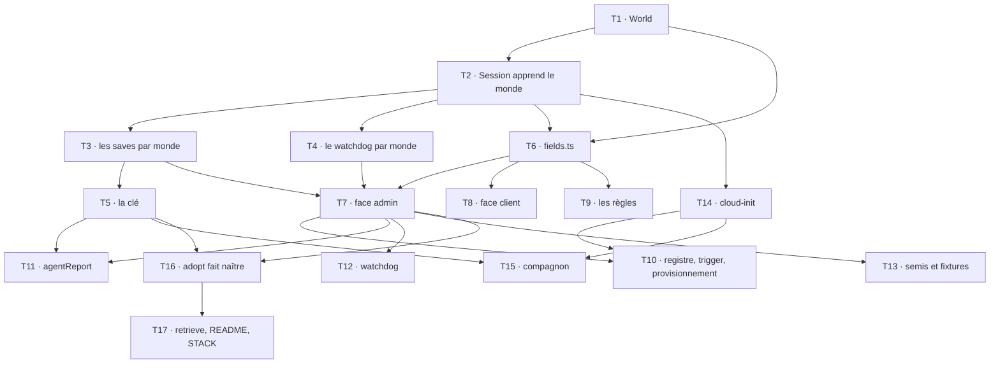

# Tranche 9 — Les mondes

> **Pour les exécutants agentiques :** SOUS-SKILL REQUISE — `superpowers:subagent-driven-development`
> (recommandée) ou `superpowers:executing-plans`. Les étapes sont en cases à cocher (`- [ ]`).

**But :** plusieurs mondes par jeu, chacun avec ses joueurs, et plusieurs sessions en même temps —
tout ce que la révision du spec du 2026-09-15 décrit **sous l'écran**. L'écran est la tranche 9 bis,
qui suit un tour de maquettes ; ce plan-ci s'arrête à la frontière Firestore côté navigateur, testée.

**Architecture :** sept volets, dans l'ordre des dépendances. **A** fait entrer `World` dans le
domaine et met le watchdog au pluriel. **B** change la clé de sauvegarde. **C** déplace
`server/current` sous le monde dans `libs/session-record`, sur ses deux faces. **D** réécrit les
règles pour la nouvelle portée. **E** fait suivre les Functions — trigger, provisionnement, rapport
de l'agent, watchdog, semis. **F** fait descendre le monde jusqu'à la machine. **G** fait naître un
monde par `world-depot adopt`, qui gagne pour cela une identité Firebase.

**Stack :** TypeScript, Nx, vitest, `firebase-admin` et `firebase` via `libs/session-record`,
`@firebase/rules-unit-testing` contre l'émulateur, `@aws-sdk/client-s3` via `libs/scaleway-storage`.

**Spec :** [`../specs/2026-09-02-game-hosting-design.md`](../specs/2026-09-02-game-hosting-design.md)
— révision du 2026-09-15 : §1, §2 (« Périmètre v1 », « Monde », « Adoption et restitution d'un
monde », « DNS », « Rôle d'administrateur dans le jeu »), §4 (les deux racines, le glossaire, les
ports, `session-record`), §5 (les documents, la clé, la règle d'élagage unique), §6 (démarrage,
watchdog), §7, §8, §9, §10, §11, §12, §13.

**Lotissement :** [`2026-09-02-lotissement.md`](2026-09-02-lotissement.md) — tranche 9, et le gate
qui la lie à la 9 bis.

## La forme de ce plan

**Les tâches portent leurs tests et leurs contraintes, jamais le code d'implémentation.** C'est la
forme de la tranche 7, et la raison est la sienne : du code jamais exécuté se périme entre le moment
où il est écrit et celui où il est lu. Les tests, eux, sont écrits en entier et exécutés dès
l'étape suivante.

**Les interfaces sont posées une fois, en tête**, parce qu'un exécutant ne voit que sa tâche et que
dix-sept tâches se passent des noms. Une signature de cette section fait autorité sur toute phrase
d'une tâche qui la contredirait.

**Cette tranche ne se fusionne pas seule.** La fusion est la mise en production (§10), et ce plan
retire `server/current` de la racine : l'écran d'aujourd'hui, qui le lit là, cesserait de lire quoi
que ce soit. La branche attend la 9 bis, et les deux partent dans une seule fusion. C'est le gate
que le lotissement porte.

## Contraintes globales

- **Code et interface en anglais ; spec, docs et commits en français.** Tout terme visible dans
  l'interface doit figurer au glossaire du §4 — les nouveaux y sont déjà (`World`, `Name`,
  `Players`, `Your worlds`, `Invite link`, `Join`, `Leave this world`), et ce plan n'affiche rien.
- **Aucune trace de l'outil qui a tapé le code** : pas de `Co-Authored-By`, pas de signature.
- **Commits en Conventional Commits**, portée = le projet Nx touché (`session`, `session-record`,
  `scaleway-storage`, `rules`, `functions`, `cloud-init`, `companion`, `world-depot`,
  `membership-record`, `agent-protocol`), ou l'artefact (`spec`, `plan`, `deploy`).
- **La production ne se touche pas.** Aucun `firebase deploy`, aucune écriture Firestore de
  production, aucun appel qui crée, modifie ou détruit une ressource facturée. La cible est
  l'émulateur ; les seaux sont MinIO ou `FakeObjectApi`. La migration des deux mondes réels est un
  geste humain, décrit à la fin, et il se fait après la fusion.
- **Ce qui se génère ne s'écrit pas à la main** : toute création de lib passe par `nx` via
  `nx-generate`. Ce plan n'en crée aucune — le monde vit dans `libs/session` et `libs/session-record`,
  comme le §4 le dit.
- **Tests par `npx nx test <projet>`**, via `nx-run-tasks`. Les cibles `session-record`, `rules` et
  `functions` démarrent elles-mêmes l'émulateur Firestore.
- **TDD** : le test échoue d'abord, pour la bonne raison, et on le voit échouer.
- **Avant la tâche 9, invoquer `firebase-firestore` puis `firebase-security-rules-auditor`** ; avant
  toute tâche du volet A, `domain-driven-design` pour vérifier qu'on ne défait pas le §4.
- **Les vocabulaires restent séparés.** Le mot `world` entre dans `session` ; `bucket`, `prefix`,
  `collectionGroup` n'y entrent pas. Le mot `role` reste dans `membership-record`.

## Structure des fichiers

| Fichier | Responsabilité | Volet |
|---|---|---|
| `libs/session/src/lib/world.ts` | **créé** — `WorldId`, `World`, ses décisions, ses événements | A |
| `libs/session/src/lib/events.ts` | **modifié** — `PlayerJoined`, `PlayerLeft`, `WorldRenamed` | A |
| `libs/session/src/lib/session-aggregate.ts` | **modifié** — `worldId` sur la session, `OpeningRequest` prend un monde | A |
| `libs/session/src/lib/ports.ts` | **modifié** — `SaveDraft` et `SaveStore` par monde, `OpenServerRequest` porte le monde | A |
| `libs/session/src/lib/saves/save.ts` | **modifié** — `SaveFields.worldId` à la place de `game` | A |
| `libs/session/src/lib/watchdog/view.ts` | **modifié** — une vue par monde, et ce qu'un passage partage | A |
| `libs/session/src/lib/watchdog/reclamations.ts` | **modifié** — les inexpliqués une fois, l'expiration et le blocage par monde | A |
| `libs/session/src/lib/watchdog/reconcile.ts` | **modifié** — `reconcileWorld` par monde, `sweepEvents` une fois | A |
| `libs/session/src/lib/watchdog/sweep.ts` | **modifié** — `mustSweep` sur tous les enregistrements | A |
| `libs/scaleway-storage/src/lib/keys.ts` | **modifié** — `{origine}/{worldId}/{instant}[-{sessionId}].tar.gz` | B |
| `libs/scaleway-storage/src/lib/scaleway-save-store.ts` | **modifié** — liste par monde, trois préfixes | B |
| `deploy/scaleway/beacon-saves-lifecycle.json` | **modifié** — une règle, `auto/` | B |
| `libs/session-record/src/lib/fields.ts` | **modifié** — chemins sous le monde, `worldFrom`, `sessionFrom(data, world)`, `idleServerDocument` | C |
| `libs/session-record/src/lib/world-state.ts` | **créé** — face admin : `worldStateStores`, `adminWorldRecord`, `systemEvents` | C |
| `libs/session-record/src/lib/save-records.ts` | **déplacé** depuis `apps/functions` — partagé avec l'outil | C |
| `libs/session-record/src/lib/client-session.ts` | **modifié** — mes mondes, entrer, quitter, renommer, réinviter, session par monde | C |
| `firestore.rules` | **modifié** — `worlds/{worldId}`, ses `players`, son `server/current` | D |
| `libs/rules/src/lib/harness.ts`, `worlds.spec.ts`, `server-current.spec.ts`, `sealed.spec.ts` | **modifiés / créé** | D |
| `apps/functions/src/provisioning-ledger.ts` | **modifié** — l'intention porte le monde | E |
| `apps/functions/src/main.ts` | **modifié** — trigger sur `worlds/{worldId}/server/current` | E |
| `apps/functions/src/provisioning.ts` | **modifié** — lit le monde, ses joueurs, rend le cloud-init avec | E |
| `libs/membership-record/src/lib/admin-membership.ts` | **modifié** — `declaredSteamIds(among)` | E |
| `apps/functions/src/agent-report.ts` | **modifié** — le monde vient du registre, la clé se reconnaît par monde | E |
| `apps/functions/src/watchdog.ts` | **modifié** — un passage, tous les mondes | E |
| `apps/functions/src/seed.ts`, `screen.ts`, `personas.ts` | **modifiés** — plus de `server/current` semé ; un monde de développement | E |
| `deploy/cloud-init/src/lib/catalog.ts`, `enshrouded.ts`, `sunkenland.ts` | **modifiés** — le monde dans la requête, le nom d'hôte dérivé, `BEACON_WORLD` | F |
| `deploy/companion/src/lib/config.ts`, `restore.ts`, `push.ts` | **modifiés** — par monde | F |
| `tools/world-depot/src/lib/admin-firestore.ts` | **créé** — l'identité Firebase de l'outil | G |
| `tools/world-depot/src/lib/world-birth.ts` | **créé** — ce qu'`adopt` imprime et crée pour un monde neuf | G |
| `tools/world-depot/src/adopt.ts`, `retrieve.ts`, `README.md` | **modifiés** | G |
| `STACK.md`, `deploy/scaleway/README.md` | **modifiés** | B, G |

## Interfaces partagées

Ce que les tâches produisent et consomment, avec les noms exacts. Un exécutant qui a besoin d'un
nom le prend ici.

```typescript
// libs/session — world.ts
export type WorldId = string;
/** 1 à 32 caractères, minuscules, chiffres et tirets, ni en tête ni en queue. */
export function isWorldId(value: unknown): value is WorldId;
export const MAX_WORLD_NAME = 64;
export interface WorldFields {
  readonly worldId: WorldId;
  readonly game: Game;
  readonly name: string;
  readonly inviteCode: string;
  readonly players: readonly string[];   // des uid
}
export interface WorldDecision { readonly world: World; readonly events: readonly DomainEvent[] }
export class World {
  static from(fields: WorldFields): World;           // refuse un worldId ou un name invalide
  get worldId(): WorldId; get game(): Game; get name(): string; get inviteCode(): string;
  get players(): readonly string[];
  hasPlayer(uid: string): boolean;
  rename(name: string, actor: Actor): WorldDecision;             // WorldRenamed
  regenerateInvite(code: string, actor: Actor): WorldDecision;    // aucun événement
  join(uid: string, code: string, actor: Actor): WorldDecision;   // PlayerJoined ; refuse un code faux ou un joueur déjà là
  leave(uid: string, actor: Actor): WorldDecision;                // PlayerLeft ; refuse un non-joueur
}

// libs/session — events.ts, trois variantes de plus, sessionId: null
| { type: 'PlayerJoined'; sessionId: null; detail: string }
| { type: 'PlayerLeft'; sessionId: null; detail: string }
| { type: 'WorldRenamed'; sessionId: null; detail: string }

// libs/session — session-aggregate.ts
export interface SessionFields { /* comme aujourd'hui, plus */ readonly worldId: WorldId; }
export interface OpeningRequest {
  readonly sessionId: SessionId;
  readonly world: World;              // remplace `game`
  readonly actor: Actor;
  readonly instanceSize?: InstanceSize;
}
// Session.opening copie world.worldId et world.game ; get worldId(): WorldId | null

// libs/session — ports.ts
export interface SaveDraft {
  readonly worldId: WorldId;
  readonly sessionId: SessionId | null;   // null pour une adoption
  readonly origin: SaveOrigin;
  readonly createdAt: Date;
}
export interface SaveStore { list(worldId: WorldId): Promise<Save[]>; /* fetch, deposit inchangés */ }
export interface OpenServerRequest {
  readonly sessionId: SessionId;
  readonly world: { readonly worldId: WorldId; readonly game: Game; readonly name: string };
  readonly size: InstanceSize;
  readonly bootstrap: string;
}
// SaveFields : `worldId: WorldId` remplace `game: Game` ; Save.worldId remplace Save.game

// libs/session — watchdog
export interface WorldView {
  readonly worldId: WorldId;
  readonly server: ServerRecord | null;
  readonly session: Session | null;
}
export interface WatchdogView {
  readonly now: Date;
  readonly worlds: readonly WorldView[];
  readonly hosted: readonly HostedServer[];
  readonly openSessions: readonly SessionId[];
  readonly alreadyAnnounced: readonly string[];
  readonly settings: SessionSettings;
}
export interface Expiration { readonly worldId: WorldId; readonly sessionId: SessionId; readonly detail: string }
export function reclamations(view: WatchdogView, limits: WatchdogLimits): WatchdogDecision; // même forme, expired porte worldId
export function reconcileWorld(view: WatchdogView, world: WorldView, outcomes: readonly ReclaimOutcome[], expired: readonly Expiration[]): StateCorrection;
export function sweepEvents(sweep: UnclaimedSweep, alreadyAnnounced: readonly string[]): readonly DomainEvent[];
export function mustSweep(servers: readonly (ServerRecord | null)[], sweptAt: Date | null, now: Date, limits: WatchdogLimits): boolean;

// libs/scaleway-storage — keys.ts
export function objectKeyFor(draft: SaveDraft): string;
export interface ParsedKey { readonly worldId: WorldId; readonly origin: SaveOrigin; readonly createdAt: Date; readonly sessionId: SessionId | null }
export function parseObjectKey(key: string): ParsedKey | null;

// libs/session-record — fields.ts
export const WORLDS = 'worlds';
export const PLAYERS = 'players';
export function serverDocPath(worldId: WorldId): string;   // `worlds/${worldId}/server/current`
export function worldFrom(worldId: WorldId, data: Record<string, unknown>, playerUids: readonly string[]): World | null;
export function sessionFrom(data: Record<string, unknown>, world: World): Session | null;
export function openingFields(session: Session, serverTime: unknown): Record<string, unknown>; // sans `game`
export function idleServerDocument(now: Date): Record<string, unknown>;  // ce que le semis écrivait
export function worldDocument(world: World, at: Date): Record<string, unknown>;
export function playerDocument(uid: string, code: string, serverTime: unknown): Record<string, unknown>;

// libs/session-record — world-state.ts (face admin)
export interface WorldStateStores {
  for(worldId: WorldId): ServerStateStore;    // readSession() lit aussi le monde ; apply() écrit worldId sur chaque événement
  all(): Promise<readonly WorldId[]>;         // tout monde qui a un server/current
}
export function worldStateStores(db: Firestore): WorldStateStores;
export interface AdminWorldRecord {
  read(worldId: WorldId): Promise<World | null>;
  create(world: World, at: Date): Promise<void>;   // strict : le monde et son server/current IDLE, ou refus
}
export function adminWorldRecord(db: Firestore): AdminWorldRecord;
export interface SystemEvents { file(events: readonly DomainEvent[], at: Date): Promise<void> } // worldId: null
export function systemEvents(db: Firestore): SystemEvents;

// libs/session-record — save-records.ts (déplacé)
export interface SaveRecords { record(save: Save): Promise<void> }
export function saveRecords(db: Firestore): SaveRecords;   // écrit worldId, plus game

// libs/session-record — client-session.ts
export interface WorldSummary { readonly world: World; readonly server: ServerView | null }
export interface OpenRequest { readonly worldId: WorldId; readonly sessionId: string; readonly actor: Actor }
export interface ClientSessionRecord {
  watchMyWorlds(uid: string, onWorlds: (worlds: readonly WorldSummary[]) => void): () => void;
  watchWorld(worldId: WorldId, onView: (view: WorldSummary | null) => void): () => void;
  watchSettings(...): () => void;            // inchangé
  watchVersionDrift(...): () => void;        // inchangé
  open(request: OpenRequest): Promise<void>;
  extend(worldId: WorldId, actor: Actor): Promise<void>;
  requestStop(worldId: WorldId, actor: Actor): Promise<void>;
  join(worldId: WorldId, code: string, actor: Actor): Promise<void>;
  leave(worldId: WorldId, actor: Actor): Promise<void>;
  rename(worldId: WorldId, name: string, actor: Actor): Promise<void>;
  regenerateInvite(worldId: WorldId, actor: Actor): Promise<void>;
}

// libs/membership-record — admin-membership.ts
export interface AdminMembershipRecord { declaredSteamIds(among: readonly string[]): Promise<readonly string[]> }

// apps/functions — provisioning-ledger.ts
export interface ProvisioningIntent { readonly worldId: WorldId; readonly tag: string; readonly instanceSize: string }
export interface ProvisioningLedger { /* comme aujourd'hui, plus */ worldOf(sessionId: SessionId): Promise<WorldId | null> }

// deploy/cloud-init — catalog.ts
export interface BootRequest { /* serverName disparaît */ readonly world: { readonly worldId: string; readonly name: string }; /* le reste inchangé */ }
export interface JoinFacts { /* plus */ readonly worldId: string }
export interface GameCatalogEntry { hostname(worldId: string): string | null; /* remplace le champ */ }

// deploy/companion — config.ts
export interface CompanionConfig { /* plus */ readonly world: string }   // BEACON_WORLD
```

## Graphe de dépendances entre tâches



**T1 n'a aucune dépendance.** T5, T8, T9, T14 peuvent partir dès que leurs prédécesseurs sont
verts. **T9 est la seule tâche qui demande deux skills avant de commencer.** Aucune tâche ne rend le
dépôt vert et la production cohérente à elle seule — c'est le gate.

---

## Volet A — le domaine

Invoquer `domain-driven-design` avant T1 : il s'agit de vérifier que `World` entre comme le §4 le
dit — une racine, référencée par identifiant, jamais contenue — et pas de re-modéliser.

### Task 1 : `World`, la seconde racine

**Fichiers :**
- Créer : `libs/session/src/lib/world.ts`, `libs/session/src/lib/world.spec.ts`
- Modifier : `libs/session/src/lib/events.ts`, `libs/session/src/index.ts`

**Interfaces :** voir « Interfaces partagées », `world.ts` et `events.ts`.

**Contraintes :**
- **`World` ne porte aucune session.** Pas de champ `session`, pas de `state`. « Une session par
  monde » est la cardinalité du document `server/current` sous lui (§5), pas un invariant de cette
  classe.
- **`worldId` est validé à la construction**, par `isWorldId` : minuscules, chiffres, tirets, un à
  trente-deux caractères, ni tiret en tête ni en queue. Il devient un segment de clé S3, un
  sous-domaine et un chemin de document — trois endroits où une majuscule ou un espace se paie
  plus tard. Le §5 dit « un slug validé à l'adoption ».
- **`name` est borné à `MAX_WORLD_NAME`** et ne peut être vide : il descend dans un fichier que
  `docker compose` lit (§6, F), et `renderCloudInit` refusera de toute façon un `$`. Ici on refuse
  le vide et la longueur, pas le `$` — ce n'est pas au domaine de savoir qu'un compose existe.
- **`join` refuse un code faux et un joueur déjà présent**, par un `throw`, comme `extend` hors
  fenêtre : un appelant qui ignore la règle a un bug, et la vraie barrière est la règle Firestore.
- **`regenerateInvite` prend le code** ; il ne le tire pas. Le hasard est un port de fait, et il
  vit chez l'appelant (`crypto.randomUUID()` côté client, `randomBytes` côté outil).
- **Les trois événements portent `sessionId: null`** et un `detail` qui nomme la personne : ce
  sont les seuls gestes d'un membre sur ce qu'un autre voit hors la session.
- **`World.from` copie `players`** : un tableau que l'appelant garde est un tableau que l'appelant
  peut bouger, et un objet valeur n'est pas fait pour ça — même règle que `Save.of` sur la date.

- [ ] **Étape 1 : écrire les tests qui échouent**

```typescript
import { describe, expect, it } from 'vitest';
import { isWorldId, World, MAX_WORLD_NAME } from './world.js';

const ACTOR = { uid: 'u1', name: 'Alice' };
const fields = (parts: Partial<Parameters<typeof World.from>[0]> = {}) => ({
  worldId: 'les-copains',
  game: 'enshrouded' as const,
  name: 'Les copains',
  inviteCode: 'c0de',
  players: ['u1'],
  ...parts,
});

describe('isWorldId', () => {
  it('accepts a slug and nothing else', () => {
    expect(isWorldId('les-copains')).toBe(true);
    expect(isWorldId('a')).toBe(true);
    expect(isWorldId('x'.repeat(32))).toBe(true);
    for (const bad of ['', 'Les-Copains', 'les copains', '-les', 'les-', 'x'.repeat(33), 'a_b', 42]) {
      expect(isWorldId(bad)).toBe(false);
    }
  });
});

describe('World', () => {
  it('refuses an identifier that is not a slug, and an empty or overlong name', () => {
    expect(() => World.from(fields({ worldId: 'Les Copains' }))).toThrow(/worldId/);
    expect(() => World.from(fields({ name: '' }))).toThrow(/name/);
    expect(() => World.from(fields({ name: 'x'.repeat(MAX_WORLD_NAME + 1) }))).toThrow(/name/);
  });

  it('knows who plays in it', () => {
    const world = World.from(fields());
    expect(world.hasPlayer('u1')).toBe(true);
    expect(world.hasPlayer('u2')).toBe(false);
  });

  it('copies its players rather than sharing them', () => {
    const players = ['u1'];
    const world = World.from(fields({ players }));
    players.push('u2');
    expect(world.hasPlayer('u2')).toBe(false);
  });

  it('lets someone in with the right code, and files it', () => {
    const { world, events } = World.from(fields()).join('u2', 'c0de', { uid: 'u2', name: 'Bob' });
    expect(world.hasPlayer('u2')).toBe(true);
    expect(events).toEqual([{ type: 'PlayerJoined', sessionId: null, detail: 'Bob joined' }]);
  });

  it('refuses a wrong code and a player already in', () => {
    const world = World.from(fields());
    expect(() => world.join('u2', 'nope', { uid: 'u2', name: 'Bob' })).toThrow(/code/);
    expect(() => world.join('u1', 'c0de', ACTOR)).toThrow(/already/);
  });

  it('lets a player leave, and refuses someone who is not in', () => {
    const { world, events } = World.from(fields()).leave('u1', ACTOR);
    expect(world.hasPlayer('u1')).toBe(false);
    expect(events).toEqual([{ type: 'PlayerLeft', sessionId: null, detail: 'Alice left' }]);
    expect(() => world.leave('u1', ACTOR)).toThrow(/not a player/);
  });

  it('renames, within the bound, and files it', () => {
    const { world, events } = World.from(fields()).rename('Les bras cassés', ACTOR);
    expect(world.name).toBe('Les bras cassés');
    expect(events).toEqual([
      { type: 'WorldRenamed', sessionId: null, detail: 'Alice renamed it to Les bras cassés' },
    ]);
    expect(() => world.rename('', ACTOR)).toThrow(/name/);
  });

  it('takes a new invite code without filing anything', () => {
    const { world, events } = World.from(fields()).regenerateInvite('n3w', ACTOR);
    expect(world.inviteCode).toBe('n3w');
    expect(events).toEqual([]);
  });

  // Figé à l'adoption (§4) : aucune méthode ne le change, et le type le dit.
  it('has no way to change its game', () => {
    const world = World.from(fields());
    expect('changeGame' in world).toBe(false);
    expect(world.game).toBe('enshrouded');
  });
});
```

- [ ] **Étape 2 : les voir échouer**

Lancer : `npx nx test session`
Attendu : ÉCHEC — `Cannot find module './world.js'`

- [ ] **Étape 3 : implémenter `world.ts`, ajouter les trois événements, exporter depuis `index.ts`**

- [ ] **Étape 4 : les tests passent**

Lancer : `npx nx test session` → SUCCÈS, toute la suite

- [ ] **Étape 5 : commit**

```bash
git add libs/session/
git commit -m "feat(session): fait entrer le monde comme seconde racine, avec ses joueurs"
```

---

### Task 2 : `Session` apprend son monde

**Fichiers :**
- Modifier : `libs/session/src/lib/session-aggregate.ts`, `libs/session/src/lib/ports.ts`
  (`OpenServerRequest`), `libs/session/src/lib/session-aggregate.spec.ts`

**Interfaces :** `SessionFields.worldId`, `OpeningRequest.world: World`, `Session.worldId`,
`OpenServerRequest.world`.

**Contraintes :**
- **`game` reste sur `SessionFields`, et il vient du monde.** Le §4 dit que la session lit le jeu sur
  le monde ; le document ne le porte plus (§5), et `sessionFrom(data, world)` — T6 — le recopie du
  monde à la lecture. La classe garde le champ parce que tous ses consommateurs (le catalogue, le
  rapport de l'agent, l'écran) le lisent sur la session, et qu'une session sans monde sous la main
  n'existe nulle part.
- **`Session.opening` refuse un monde dont l'acteur n'est pas joueur.** C'est le même genre de
  `throw` que `extend` hors fenêtre — la vraie barrière est la règle, mais le noyau ne propose pas
  un geste qu'il sait refusé.
- **Le `detail` de `SessionStarted` nomme le monde**, pas seulement le jeu : `Alice opened Les
  copains` — c'est ce que le journal montrera, et deux mondes du même jeu doivent s'y distinguer.
- **`Session.idle()` reste sans monde**, `worldId` y est `null` comme `sessionId` : l'appelant
  connaît le monde par le chemin du document.

- [ ] **Étape 1 : écrire les tests qui échouent** — dans `session-aggregate.spec.ts`, en plus de
  l'adaptation mécanique des tests existants (chaque `opening({ game })` devient `opening({ world })`)

```typescript
import { World } from './world.js';

const WORLD = World.from({
  worldId: 'les-copains',
  game: 'sunkenland',
  name: 'Les copains',
  inviteCode: 'c0de',
  players: ['u1'],
});

describe('Session.opening on a world', () => {
  it('takes the game and the id from the world', () => {
    const { session, events } = Session.opening(
      { sessionId: 's1', world: WORLD, actor: { uid: 'u1', name: 'Alice' } },
      clock,
      DEFAULT_SETTINGS,
    );
    expect(session.worldId).toBe('les-copains');
    expect(session.game).toBe('sunkenland');
    expect(events[0]).toEqual({ type: 'SessionStarted', sessionId: 's1', detail: 'Alice opened Les copains' });
  });

  it('refuses an actor who does not play in that world', () => {
    expect(() =>
      Session.opening({ sessionId: 's1', world: WORLD, actor: { uid: 'u9', name: 'Mallory' } }, clock, DEFAULT_SETTINGS),
    ).toThrow(/not a player/);
  });

  it('has no world when it has no session', () => {
    expect(Session.idle().worldId).toBeNull();
  });
});
```

- [ ] **Étape 2 : les voir échouer** — `npx nx test session` → ÉCHEC, `world` n'est pas une propriété de
  `OpeningRequest`

- [ ] **Étape 3 : implémenter, puis adapter `OpenServerRequest` dans `ports.ts`** (le compilateur
  nommera les appelants — `scaleway-compute` et `apps/functions` — qui seront repris dans leurs
  tâches ; ici, seule `libs/session` doit compiler et passer)

- [ ] **Étape 4 : `npx nx test session` → SUCCÈS**

- [ ] **Étape 5 : commit**

```bash
git add libs/session/
git commit -m "feat(session): ouvre une session sur un monde, dont elle tient son jeu"
```

---

### Task 3 : les sauvegardes appartiennent à un monde

**Fichiers :**
- Modifier : `libs/session/src/lib/saves/save.ts`, `libs/session/src/lib/ports.ts` (`SaveDraft`,
  `SaveStore`), `libs/session/src/lib/saves/save.spec.ts` (ou le spec existant qui construit un `Save`)

**Interfaces :** `SaveFields.worldId`, `Save.worldId`, `SaveDraft { worldId, sessionId | null, … }`,
`SaveStore.list(worldId)`.

**Contraintes :**
- **`game` sort de `Save`.** Le monde le porte, et un `Save` qui le répéterait pourrait le
  contredire — la même raison que `JoinInfo` a un `game` et pas un `kind`, appliquée à l'envers.
- **`sessionId` devient nullable sur le brouillon** : une adoption n'a pas de session et n'en
  invente plus une (§5). `Save` lui-même ne porte pas le `sessionId` — il ne le portait pas.
- **Le plancher ne bouge pas.** `SAVE_FLOOR_BYTES` et `isPlausibleSaveSize` restent ce qu'ils sont.

- [ ] **Étape 1 : écrire le test qui échoue**

```typescript
import { describe, expect, it } from 'vitest';
import { Save } from './save.js';

describe('Save on a world', () => {
  it('names its world and no game', () => {
    const save = Save.of({
      createdAt: new Date('2026-09-15T20:00:00Z'),
      worldId: 'les-copains',
      objectKey: 'pre-shutdown/les-copains/2026-09-15T20-00-00Z-s1.tar.gz',
      sizeBytes: 4096,
      origin: 'pre-shutdown',
    });
    expect(save.worldId).toBe('les-copains');
    expect('game' in save).toBe(false);
  });
});
```

- [ ] **Étape 2 : le voir échouer** — `npx nx test session` → ÉCHEC, `worldId` inconnu de `SaveFields`

- [ ] **Étape 3 : implémenter** — `save.ts`, puis `ports.ts` ; reprendre `newest.spec.ts` et tout
  test de la lib qui construit un `Save` avec `game`

- [ ] **Étape 4 : `npx nx test session` → SUCCÈS**

- [ ] **Étape 5 : commit**

```bash
git add libs/session/
git commit -m "feat(session): range les sauvegardes par monde, une adoption sans session"
```

---

### Task 4 : le watchdog décide par monde, et balaie une fois

Le §6 : « il lit tous les `server/current` en un passage et applique à chacun, séparément, les
décisions du tableau ». La réclamation par tag était déjà plurielle ; ce qui pliait tout sur un
document singulier, c'est `view.server`, et c'est ce que cette tâche défait.

**Fichiers :**
- Modifier : `libs/session/src/lib/watchdog/view.ts`, `reclamations.ts`, `reconcile.ts`, `sweep.ts`
  et leurs trois `.spec.ts`

**Interfaces :** `WorldView`, `WatchdogView.worlds`, `Expiration.worldId`, `reclamations`,
`reconcileWorld`, `sweepEvents`, `mustSweep(servers, …)`.

**Contraintes :**
- **Les inexpliqués se calculent une fois**, sur `hosted` et `openSessions`, pas une fois par monde :
  une machine que le fournisseur tient et qu'aucune intention n'explique n'appartient à aucun monde,
  et la compter N fois ferait N `SessionReclaimed` pour une destruction.
- **L'expiration l'emporte sur l'inexpliqué pour la même session**, exactement comme aujourd'hui,
  monde par monde : une session passée son échéance est finie, pas inexpliquée, et elle ne doit pas
  les deux verbes à la fois.
- **`reconcileWorld` ne voit pas le balayage.** Les événements du balayage — `CleanupFailed` sans
  session, `SessionReclaimed` sans session, `ResourceStranded` — sortent de `sweepEvents`, une fois,
  et sont écrits avec `worldId: null` par `systemEvents` (T7). Aujourd'hui ils sortent de
  `reconcile` ; les y laisser les ferait écrire une fois par monde.
- **Chaque correction reste ce qu'elle est** : un `StateCorrection` par monde, la même forme, les
  mêmes branches. Les scénarios existants de `reconcile.spec.ts` se conservent un à un, chacun
  gagne un `worldId` et devient un appel à `reconcileWorld` sur un `WatchdogView` à un monde.
- **`mustSweep` prend tous les enregistrements** : il suffit qu'un monde ne soit pas `IDLE` sans
  faits réservés pour que le passage interroge le fournisseur.
- **Le coût d'un `SessionStopped` se calcule sur la session du monde concerné**, jamais sur une
  autre — c'est le piège de la mise au pluriel : `costEuros` était calculé une fois en tête de
  `reconcile` sur `view.session`.

- [ ] **Étape 1 : écrire les tests qui échouent** — en plus de la reprise des scénarios existants,
  ces trois-là sont nouveaux et sont le sens de la tâche

```typescript
// reclamations.spec.ts
describe('two worlds in one pass', () => {
  const worldView = (worldId: string, state: SessionState, sessionId: string, deadlineIso: string): WorldView => ({
    worldId,
    server: { state, sessionId, stateSince: NOW, hasReservedFacts: true },
    session: runningSession(sessionId, deadlineIso),
  });

  it('asks the expired one to stop and leaves the healthy one alone', () => {
    const decision = reclamations(
      view({
        worlds: [
          worldView('a', 'RUNNING', 's-a', '2026-09-04T20:00:00Z'), // échue depuis une heure
          worldView('b', 'RUNNING', 's-b', '2026-09-05T01:00:00Z'), // quatre heures devant
        ],
        hosted: [hosted('s-a'), hosted('s-b')],
        openSessions: ['s-a', 's-b'],
      }),
      DEFAULT_LIMITS,
    );
    expect(decision.expired).toEqual([{ worldId: 'a', sessionId: 's-a', detail: expect.any(String) }]);
    expect(decision.destroy).toEqual([]);
  });

  it('counts an unexplained machine once, whatever the number of worlds', () => {
    const decision = reclamations(
      view({
        worlds: [worldView('a', 'IDLE', 's-a', '2026-09-05T01:00:00Z'), worldView('b', 'IDLE', 's-b', '2026-09-05T01:00:00Z')],
        hosted: [hosted('s-ghost')],
        openSessions: [],
      }),
      DEFAULT_LIMITS,
    );
    expect(decision.destroy).toHaveLength(1);
    expect(decision.destroy[0]).toMatchObject({ sessionId: 's-ghost', reason: 'no-open-session' });
  });
});

// reconcile.spec.ts
describe('sweepEvents', () => {
  it('files what the sweep destroyed, refused and newly stranded, and nothing already announced', () => {
    const events = sweepEvents(
      { destroyed: ['ip 1.2.3.4'], stranded: ['vol-old', 'vol-new'], errors: ['refused vol-x'] },
      ['vol-old'],
    );
    expect(events.map((e) => e.type)).toEqual(['CleanupFailed', 'SessionReclaimed', 'ResourceStranded']);
    expect(events.every((e) => e.sessionId === null)).toBe(true);
  });
});

describe('reconcileWorld', () => {
  const stoppingSession = (sessionId: string, startedAtIso: string) =>
    Session.from({
      state: 'STOPPING',
      sessionId,
      worldId: 'w',
      game: 'enshrouded',
      startedBy: 'u1',
      startedAt: new Date(startedAtIso),
      deadline: Deadline.at(new Date('2026-09-05T01:00:00Z')),
      instanceSize: 'DEV1-L',
      hasJoinInfo: true,
    });

  it('costs a stop from the session of that world, not another', () => {
    const cheap = stoppingSession('s-a', '2026-09-04T20:30:00Z');     // une heure facturée
    const expensive = stoppingSession('s-b', '2026-09-04T10:00:00Z'); // onze
    const v = view({
      worlds: [
        { worldId: 'a', server: record('STOPPING', 's-a', true), session: cheap },
        { worldId: 'b', server: record('STOPPING', 's-b', true), session: expensive },
      ],
      hosted: [],
      openSessions: [],
    });
    const stopA = reconcileWorld(v, v.worlds[0], [outcome('s-a', 'stopping-timeout', true)], []);
    const stopB = reconcileWorld(v, v.worlds[1], [outcome('s-b', 'stopping-timeout', true)], []);
    const cost = (c: StateCorrection) => (c.events.find((e) => e.type === 'SessionStopped') as { costEuros: number }).costEuros;
    expect(cost(stopB)).toBeGreaterThan(cost(stopA));
  });
});
```

- [ ] **Étape 2 : les voir échouer** — `npx nx test session` → ÉCHEC, `worlds` n'existe pas sur
  `WatchdogView`

- [ ] **Étape 3 : implémenter** — `view.ts` d'abord, puis `reclamations.ts`, `reconcile.ts`
  (scinder en `reconcileWorld` + `sweepEvents`, sans dupliquer une branche), `sweep.ts`

- [ ] **Étape 4 : `npx nx test session` → SUCCÈS, toute la suite**

- [ ] **Étape 5 : commit**

```bash
git add libs/session/
git commit -m "feat(session): fait décider le watchdog monde par monde, et balayer une fois"
```

---

## Volet B — le stockage

### Task 5 : la clé `{origine}/{worldId}/{instant}[-{sessionId}].tar.gz`

**Fichiers :**
- Modifier : `libs/scaleway-storage/src/lib/keys.ts`, `keys.spec.ts`,
  `scaleway-save-store.ts`, `scaleway-save-store.spec.ts`
- Modifier : `deploy/scaleway/beacon-saves-lifecycle.json`, `deploy/scaleway/README.md`

**Interfaces :** `objectKeyFor(draft: SaveDraft)`, `ParsedKey`, `parseObjectKey`, `list(worldId)`.

**Contraintes :**
- **L'origine en tête, le monde ensuite, et c'est le fournisseur qui l'impose** (§5) : une règle
  de cycle de vie filtre par préfixe littéral, et `auto/` en une règle élague tous les mondes.
  Le monde en tête aurait demandé une règle de console par adoption.
- **Plus de `saves/` ni de jeu.** Le seau s'appelle déjà `beacon-saves`, et le monde porte le jeu.
- **Le `sessionId` va dans le nom de fichier**, après l'instant, séparé par un tiret ; absent pour
  une adoption. `agentReport` (T11) le reconnaît par suffixe.
- **Une clé de l'ancien format se lit `null`** : cinq segments commençant par `saves/`. Le lecteur
  l'ignore, comme il ignore déjà ce qu'il n'a pas écrit ; les deux mondes existants migrent par
  `retrieve` puis `adopt` (fin du plan).
- **`list(worldId)` interroge trois préfixes**, un par origine, et concatène — pas un listage du
  seau entier filtré côté client : le seau grossit d'un objet par soirée et par monde, sans fin.
- **Le format vit toujours à trois endroits**, et le §5 le dit : construit ici, reconnu dans
  `agentReport`, filtré par la règle de cycle de vie. Le test qui épingle la chaîne littérale
  reste, et il est réécrit.
- **Le JSON de cycle de vie passe à une règle**, `auto/`, sept jours, et le README dit que les deux
  règles précédentes sont lettre morte, et que remplacer la configuration est un geste de console
  fait une fois après la fusion — pas par ce plan.

- [ ] **Étape 1 : écrire les tests qui échouent** — `keys.spec.ts`, en remplacement du fichier

```typescript
import { describe, expect, it } from 'vitest';
import { objectKeyFor, parseObjectKey } from './keys.js';

const DRAFT = {
  worldId: 'les-copains',
  sessionId: 'b19af9ed-c4de-49d0-bd7c-1eacd1624c55',
  origin: 'pre-shutdown' as const,
  createdAt: new Date('2026-09-07T20:04:26Z'),
};

describe('the object key', () => {
  // §5 : l'origine d'abord, parce que la règle d'élagage du seau filtre un
  // préfixe littéral et qu'il n'y en a qu'une, `auto/`, pour tous les mondes.
  it('carries origin, world, instant and session, in that order', () => {
    expect(objectKeyFor(DRAFT)).toBe(
      'pre-shutdown/les-copains/2026-09-07T20-04-26Z-b19af9ed-c4de-49d0-bd7c-1eacd1624c55.tar.gz',
    );
  });

  it('carries no session for an adoption', () => {
    expect(objectKeyFor({ ...DRAFT, sessionId: null, origin: 'manual' })).toBe(
      'manual/les-copains/2026-09-07T20-04-26Z.tar.gz',
    );
  });

  it('spells the instant without a colon', () => {
    expect(objectKeyFor(DRAFT)).not.toContain(':');
  });

  it('reads back what it wrote, session included or not', () => {
    expect(parseObjectKey(objectKeyFor(DRAFT))).toEqual({
      worldId: 'les-copains',
      origin: 'pre-shutdown',
      createdAt: new Date('2026-09-07T20:04:26Z'),
      sessionId: 'b19af9ed-c4de-49d0-bd7c-1eacd1624c55',
    });
    expect(parseObjectKey('manual/les-copains/2026-09-07T20-04-26Z.tar.gz')).toEqual({
      worldId: 'les-copains',
      origin: 'manual',
      createdAt: new Date('2026-09-07T20:04:26Z'),
      sessionId: null,
    });
  });

  // L'ancien format, et tout ce que ce module n'a pas écrit. Null et non un
  // throw : `list()` saute ce qu'il ne sait pas lire.
  it('yields nothing for a key of the previous format, or a foreign one', () => {
    expect(parseObjectKey('saves/enshrouded/pre-shutdown/s1/2026-09-07T20-04-26Z.tar.gz')).toBeNull();
    expect(parseObjectKey('games/sunkenland/Sunkenland_Data/level0')).toBeNull();
    expect(parseObjectKey('whatever/les-copains/2026-09-07T20-04-26Z.tar.gz')).toBeNull();
    expect(parseObjectKey('auto/Les Copains/2026-09-07T20-04-26Z.tar.gz')).toBeNull();
  });
});
```

Et dans `scaleway-save-store.spec.ts`, en plus de l'adaptation des clés existantes :

```typescript
it('lists one world across its three origins, and no other world', async () => {
  const api = new FakeObjectApi();
  await api.putText('auto/les-copains/2026-09-07T20-00-00Z-s1.tar.gz', 'x'.repeat(2048));
  await api.putText('pre-shutdown/les-copains/2026-09-07T22-00-00Z-s1.tar.gz', 'x'.repeat(2048));
  await api.putText('manual/les-copains/2026-09-01T00-00-00Z.tar.gz', 'x'.repeat(2048));
  await api.putText('pre-shutdown/les-autres/2026-09-07T22-00-00Z-s2.tar.gz', 'x'.repeat(2048));
  const saves = await new ScalewaySaveStore(api).list('les-copains');
  expect(saves.map((s) => s.origin)).toEqual(['pre-shutdown', 'auto', 'manual']);
  expect(saves.every((s) => s.worldId === 'les-copains')).toBe(true);
});
```

**Note pour l'exécutant :** `FakeObjectApi` est dans `fake-object-api.ts` ; adapter le nom de sa
méthode d'écriture à ce qu'elle expose réellement. Le point du test est le nombre de préfixes lus et
l'exclusion de l'autre monde.

- [ ] **Étape 2 : les voir échouer** — `npx nx test scaleway-storage` → ÉCHEC sur la chaîne épinglée

- [ ] **Étape 3 : implémenter `keys.ts` et le `list` à trois préfixes ; réécrire le JSON de cycle de
  vie et le paragraphe du README**

```json
{
  "Rules": [
    {
      "ID": "auto-sept-jours",
      "Status": "Enabled",
      "Filter": { "Prefix": "auto/" },
      "Expiration": { "Days": 7 },
      "NoncurrentVersionExpiration": { "NoncurrentDays": 1 }
    }
  ]
}
```

- [ ] **Étape 4 : `npx nx test scaleway-storage` → SUCCÈS**

- [ ] **Étape 5 : commit**

```bash
git add libs/scaleway-storage/ deploy/scaleway/
git commit -m "feat(scaleway-storage): range les sauvegardes par origine puis par monde, une règle d élagage pour tous"
```

---

## Volet C — la frontière Firestore

### Task 6 : `fields.ts` — les chemins sous le monde, et la traduction du monde

**Fichiers :**
- Modifier : `libs/session-record/src/lib/fields.ts`, `fields.spec.ts`, `round-trip.spec.ts`

**Interfaces :** `WORLDS`, `PLAYERS`, `serverDocPath`, `worldFrom`, `sessionFrom(data, world)`,
`openingFields` sans `game`, `idleServerDocument`, `worldDocument`, `playerDocument`.

**Contraintes :**
- **`SERVER_DOC` disparaît.** Toute lecture qui le nommait passe par `serverDocPath(worldId)`. Le
  compilateur nomme les endroits.
- **`sessionFrom` prend le monde** et en recopie `game` et `worldId` : le document ne porte plus le
  jeu (§5), et une session sans monde n'est pas une lecture possible.
- **`worldFrom` rend `null`** pour un document qui ne dit rien de reconnaissable — jamais un monde
  aux champs inventés, même discipline que `sessionFrom`.
- **`idleServerDocument`** est le document que `seed.ts` écrivait, à l'identique, `game` en moins :
  tous les champs présents et nuls, parce qu'une clé absente et une clé nulle ne se lisent pas
  pareil dans un diff de règles.
- **`playerDocument` porte `uid`, `joinedAt` et `code`** — `uid` en champ et pas seulement en
  identifiant, parce que « mes mondes » est une requête de groupe de collection sur ce champ (T8),
  et qu'une règle ne sait prouver une requête que sur un champ.
- **`round-trip.spec.ts` continue de tourner une fois par transport**, avec un monde.

- [ ] **Étape 1 : écrire les tests qui échouent** — dans `fields.spec.ts`

```typescript
import { describe, expect, it } from 'vitest';
import { DEFAULT_SETTINGS, Session, World } from '@beacon/session';
import { idleServerDocument, openingFields, playerDocument, serverDocPath, sessionFrom, worldDocument, worldFrom } from './fields.js';

const WORLD = World.from({ worldId: 'les-copains', game: 'sunkenland', name: 'Les copains', inviteCode: 'c0de', players: ['u1'] });
const clock = { now: () => new Date('2026-09-15T20:00:00Z') };

describe('paths under a world', () => {
  it('names the server document of a world', () => {
    expect(serverDocPath('les-copains')).toBe('worlds/les-copains/server/current');
  });
});

describe('worldFrom', () => {
  it('reads a world with its players', () => {
    const world = worldFrom('les-copains', { game: 'sunkenland', name: 'Les copains', inviteCode: 'c0de' }, ['u1', 'u2']);
    expect(world?.game).toBe('sunkenland');
    expect(world?.hasPlayer('u2')).toBe(true);
  });

  it('reads nothing this vocabulary does not recognise', () => {
    expect(worldFrom('les-copains', { game: 'tetris', name: 'x', inviteCode: 'c' }, [])).toBeNull();
    expect(worldFrom('Les Copains', { game: 'enshrouded', name: 'x', inviteCode: 'c' }, [])).toBeNull();
    expect(worldFrom('les-copains', { game: 'enshrouded', name: 'x' }, [])).toBeNull();
  });

  it('writes what it reads', () => {
    const data = worldDocument(WORLD, new Date('2026-09-15T20:00:00Z'));
    expect(worldFrom('les-copains', data, ['u1'])?.name).toBe('Les copains');
    expect(data['players']).toBeUndefined(); // les joueurs sont une sous-collection, jamais un champ
  });
});

describe('sessionFrom with a world', () => {
  it('takes the game and the world id from the world, never from the document', () => {
    const session = sessionFrom(
      { state: 'RUNNING', sessionId: 's1', startedAt: new Date(), deadline: new Date(), game: 'enshrouded' },
      WORLD,
    );
    expect(session?.game).toBe('sunkenland');
    expect(session?.worldId).toBe('les-copains');
  });
});

describe('what a client writes', () => {
  it('opens without writing the game', () => {
    const { session } = Session.opening({ sessionId: 's1', world: WORLD, actor: { uid: 'u1', name: 'Alice' } }, clock, DEFAULT_SETTINGS);
    expect(Object.keys(openingFields(session, 'now'))).not.toContain('game');
  });

  it('seeds a server document with every field present and null', () => {
    const doc = idleServerDocument(new Date());
    expect(doc['state']).toBe('IDLE');
    for (const key of ['sessionId', 'startedBy', 'startedAt', 'deadline', 'instanceId', 'ipId', 'ip', 'joinInfo', 'provisionClaimedAt', 'lastError']) {
      expect(doc).toHaveProperty(key, null);
    }
    expect(doc).not.toHaveProperty('game');
  });

  it('writes a player with its uid as a field', () => {
    expect(playerDocument('u2', 'c0de', 'now')).toEqual({ uid: 'u2', code: 'c0de', joinedAt: 'now' });
  });
});
```

- [ ] **Étape 2 : les voir échouer** — `npx nx test session-record` → ÉCHEC, `serverDocPath` inconnu

- [ ] **Étape 3 : implémenter** — et laisser `server-state.ts`, `client-session.ts` rouges : ce
  sont T7 et T8

- [ ] **Étape 4 : `npx nx test session-record` → les specs de `fields` et `round-trip` passent** ;
  les autres échouent encore à la compilation, et c'est attendu jusqu'à T8

- [ ] **Étape 5 : commit**

```bash
git add libs/session-record/src/lib/fields.ts libs/session-record/src/lib/fields.spec.ts libs/session-record/src/lib/round-trip.spec.ts
git commit -m "feat(session-record): traduit le monde, et met server/current sous lui"
```

---

### Task 7 : la face admin — un magasin d'état par monde, la naissance d'un monde, les événements sans monde

**Fichiers :**
- Créer : `libs/session-record/src/lib/world-state.ts`, `world-state.spec.ts`
- Déplacer : `apps/functions/src/save-records.ts` → `libs/session-record/src/lib/save-records.ts`,
  avec son spec
- Modifier : `libs/session-record/src/lib/server-state.ts`, `server-state.spec.ts`,
  `libs/session-record/src/index.ts`

**Interfaces :** `WorldStateStores`, `AdminWorldRecord`, `SystemEvents`, `SaveRecords`.

**Contraintes :**
- **`serverStateStore(db, worldId)` reste le magasin d'aujourd'hui**, interface identique, sur le
  chemin du monde ; `worldStateStores(db).for(worldId)` le construit. Les tests existants de
  `server-state.spec.ts` se conservent un à un, sur `worlds/w1/server/current`.
- **`readSession()` lit le monde lui-même**, puisque `sessionFrom` en a besoin et que le magasin
  connaît son `worldId` : deux lectures derrière un appel, plutôt qu'un `AdminWorldRecord` de plus
  dans les dépendances de chaque Function. Un monde illisible rend `null`, comme un document
  illisible.
- **`apply()` écrit `worldId` sur chaque événement.** C'est ici que le §4 « tout événement gagne un
  `worldId` » tient : au bord, comme `actor` et `at`, jamais dans `DomainEvent`.
- **`all()` est une requête de groupe de collection** sur `server`, et elle rend les `worldId` des
  documents `current` — le seul nom que la collection connaît.
- **`AdminWorldRecord.create` est stricte** et écrit deux documents dans un batch : le monde et son
  `server/current` par `idleServerDocument`. Un monde qui existe déjà fait échouer l'écriture
  entière, comme `provisioning/{sessionId}`.
- **`read` lit le monde et sa sous-collection `players`** — le domaine veut `hasPlayer`.
- **`systemEvents.file` écrit `worldId: null`**, pour les événements que `sweepEvents` (T4) produit.
- **`saveRecords` déménage sans changer**, hormis `worldId` à la place de `game` : `world-depot`
  (T16) l'appellera, et `apps/functions` n'est pas importable par un outil.

- [ ] **Étape 1 : écrire les tests qui échouent** — `world-state.spec.ts`, sur le même harnais
  émulateur que `server-state.spec.ts`

```typescript
import { deleteApp, initializeApp } from 'firebase-admin/app';
import { getFirestore, type Firestore } from 'firebase-admin/firestore';
import { afterAll, beforeAll, beforeEach, describe, expect, it } from 'vitest';
import { World } from '@beacon/session';
import { adminWorldRecord, systemEvents, worldStateStores } from './world-state.js';

process.env['FIRESTORE_EMULATOR_HOST'] ??= '127.0.0.1:8080';
const NOW = new Date('2026-09-15T20:00:00Z');

let app: ReturnType<typeof initializeApp>;
let db: Firestore;

const aWorld = (worldId: string) =>
  World.from({ worldId, game: 'enshrouded', name: 'Les copains', inviteCode: 'c0de', players: [] });
const WORLD = aWorld('les-copains');

beforeAll(() => {
  app = initializeApp({ projectId: 'demo-beacon' }, 'world-state-spec');
  db = getFirestore(app);
});
afterAll(() => deleteApp(app));
beforeEach(async () => {
  await db.recursiveDelete(db.collection('worlds'));
  await db.recursiveDelete(db.collection('events'));
});

describe('adminWorldRecord', () => {
  it('creates a world and its idle server document together, once', async () => {
    const worlds = adminWorldRecord(db);
    await worlds.create(WORLD, NOW);
    expect((await db.doc('worlds/les-copains/server/current').get()).get('state')).toBe('IDLE');
    expect((await worlds.read('les-copains'))?.name).toBe('Les copains');
    await expect(worlds.create(WORLD, NOW)).rejects.toThrow();
  });

  it('reads the players from the subcollection', async () => {
    await adminWorldRecord(db).create(WORLD, NOW);
    await db.doc('worlds/les-copains/players/u7').set({ uid: 'u7', joinedAt: NOW, code: 'c0de' });
    expect((await adminWorldRecord(db).read('les-copains'))?.hasPlayer('u7')).toBe(true);
  });

  it('reads an absent world as null', async () => {
    expect(await adminWorldRecord(db).read('nobody')).toBeNull();
  });
});

describe('worldStateStores', () => {
  it('finds every world that has a server document', async () => {
    await adminWorldRecord(db).create(WORLD, NOW);
    await adminWorldRecord(db).create(aWorld('les-autres'), NOW);
    expect((await worldStateStores(db).all()).sort()).toEqual(['les-autres', 'les-copains']);
  });

  it('stamps the world on every event it files', async () => {
    await adminWorldRecord(db).create(WORLD, NOW);
    await worldStateStores(db).for('les-copains').apply(
      { state: null, lastError: null, clearFacts: false, deadline: null, closeIntents: [],
        events: [{ type: 'DeadlineClamped', sessionId: 's1', detail: 'x' }] },
      NOW,
    );
    const events = await db.collection('events').get();
    expect(events.docs[0].get('worldId')).toBe('les-copains');
  });
});

describe('systemEvents', () => {
  it('files with no world at all', async () => {
    await systemEvents(db).file([{ type: 'ResourceStranded', sessionId: null, detail: 'vol-1' }], NOW);
    const events = await db.collection('events').get();
    expect(events.docs[0].get('worldId')).toBeNull();
    expect(events.docs[0].get('actor')).toEqual({ uid: 'system', name: 'system' });
  });
});
```

- [ ] **Étape 2 : les voir échouer** — `npx nx test session-record` → ÉCHEC, module absent

- [ ] **Étape 3 : implémenter ; reprendre `server-state.spec.ts` sur un chemin de monde ; déplacer
  `save-records` et son spec** (les imports d'`apps/functions` seront repris en T10-T11)

- [ ] **Étape 4 : `npx nx test session-record` → `world-state`, `server-state`, `save-records`,
  `fields`, `round-trip` passent** ; `client-session` et `authorised-writes` restent rouges jusqu'à T8

- [ ] **Étape 5 : commit**

```bash
git add libs/session-record/ apps/functions/src/save-records.ts apps/functions/src/save-records.spec.ts
git commit -m "feat(session-record): fait naître un monde, et tient un état de serveur par monde"
```

---

### Task 8 : la face client — mes mondes, entrer, quitter, renommer, réinviter

**Fichiers :**
- Modifier : `libs/session-record/src/lib/client-session.ts`, `client-session.spec.ts`,
  `authorised-writes.spec.ts`, `version-drift.spec.ts`, `libs/session-record/src/client.ts`,
  `firestore.indexes.json`

**Interfaces :** `ClientSessionRecord` — voir « Interfaces partagées ». `WorldSummary`, `OpenRequest`.

**Contraintes :**
- **`watchMyWorlds(uid)` est une requête de groupe de collection** `players` où `uid == uid`, puis
  un abonnement par monde trouvé — au monde et à son `server/current`. Trois ou quatre mondes, pas
  trente ; un abonnement par monde est la forme honnête, et le nombre se voit.
- **Elle exige un index que l'émulateur ne réclame pas et que la production refuse d'inventer** :
  un champ interrogé à l'échelle d'un groupe de collection n'a pas d'index automatique. La tâche
  ajoute dans `firestore.indexes.json` une `fieldOverrides` sur `players.uid` avec un index de
  portée `COLLECTION_GROUP`, que le déploiement du §10 pose avec les règles. Sans elle, la première
  liste de mondes en production échoue avec un lien vers la console — le genre d'écart qu'aucun
  test local ne trouve, et qui est écrit ici pour ça.
- **`watchWorld` rend un seul objet**, monde et vue de session ensemble, comme `watch` rendait
  session et faits ensemble : deux abonnements sur deux documents, une seule publication, parce
  que l'écran ne doit pas voir un monde sans son état.
- **`open` lit le monde dans la transaction**, pour que `Session.opening` ait un `World` et que le
  refus « pas joueur » soit joué avant d'écrire. Le verrou anti-double-clic est inchangé : lire
  `server/current` du monde et écrire dans la même transaction.
- **`join` écrit `players/{uid}` avec le code et l'événement `PlayerJoined` dans un batch** ; le
  domaine a d'abord dit oui (`World.join`), la règle dira le sien (T9). Le code faux est refusé par
  le domaine avant tout envoi.
- **`leave` efface `players/{uid}` et écrit `PlayerLeft`** ; `rename` et `regenerateInvite`
  écrivent le champ seul, et `WorldRenamed` pour le premier. Le code est tiré par
  `crypto.randomUUID()` ; c'est le seul hasard de ce module.
- **`extend` et `requestStop` prennent le `worldId`** et rien d'autre de nouveau.
- **Rien de `firebase/firestore` ne sort de ce fichier**, et `apps/web` n'en importera rien : la
  clôture du §4 tient.
- **Les tests tournent contre l'émulateur**, comme aujourd'hui, avec un monde semé dont `ALICE` est
  joueur. `authorised-writes.spec.ts` — les écritures que les règles acceptent — est repris avec
  les règles de T9 ; s'il est exécuté avant T9, il échoue sur les règles et c'est la bonne raison.

- [ ] **Étape 1 : écrire les tests qui échouent** — dans `client-session.spec.ts`

```typescript
describe('a member and their worlds', () => {
  it('sees the worlds where they play, with each server state', async () => {
    await seedWorld('les-copains', { players: ['alice'] });
    await seedWorld('les-autres', { players: ['bob'] });
    const seen = await firstValue((on) => record.watchMyWorlds('alice', on));
    expect(seen.map((w) => w.world.worldId)).toEqual(['les-copains']);
    expect(seen[0].server?.session.state).toBe('IDLE');
  });

  it('joins with the code, and is then a player', async () => {
    await seedWorld('les-copains', { players: ['bob'], inviteCode: 'c0de' });
    await record.join('les-copains', 'c0de', { uid: 'alice', name: 'Alice' });
    const view = await firstValue((on) => record.watchWorld('les-copains', on));
    expect(view?.world.hasPlayer('alice')).toBe(true);
    expect(await eventTypes()).toContain('PlayerJoined');
  });

  it('refuses a wrong code before writing anything', async () => {
    await seedWorld('les-copains', { players: ['bob'], inviteCode: 'c0de' });
    await expect(record.join('les-copains', 'nope', { uid: 'alice', name: 'Alice' })).rejects.toThrow(/code/);
    expect(await eventTypes()).toEqual([]);
  });

  it('leaves, renames and regenerates the code, each filed as the spec says', async () => {
    await seedWorld('les-copains', { players: ['alice'], inviteCode: 'c0de' });
    await record.rename('les-copains', 'Les bras cassés', { uid: 'alice', name: 'Alice' });
    await record.regenerateInvite('les-copains', { uid: 'alice', name: 'Alice' });
    const renamed = await firstValue((on) => record.watchWorld('les-copains', on));
    expect(renamed?.world.name).toBe('Les bras cassés');
    expect(renamed?.world.inviteCode).not.toBe('c0de');
    await record.leave('les-copains', { uid: 'alice', name: 'Alice' });
    expect(await eventTypes()).toEqual(['WorldRenamed', 'PlayerLeft']);
  });

  it('opens a session on a world, and refuses it on a second one while the first is open', async () => {
    await seedWorld('les-copains', { players: ['alice'] });
    await record.open({ worldId: 'les-copains', sessionId: 's1', actor: { uid: 'alice', name: 'Alice' } });
    await expect(
      record.open({ worldId: 'les-copains', sessionId: 's2', actor: { uid: 'alice', name: 'Alice' } }),
    ).rejects.toThrow(/PROVISIONING/);
  });

  it('opens two sessions on two worlds the same evening', async () => {
    await seedWorld('les-copains', { players: ['alice'] });
    await seedWorld('les-autres', { players: ['alice'] });
    await record.open({ worldId: 'les-copains', sessionId: 's1', actor: { uid: 'alice', name: 'Alice' } });
    await record.open({ worldId: 'les-autres', sessionId: 's2', actor: { uid: 'alice', name: 'Alice' } });
    const both = await firstValue((on) => record.watchMyWorlds('alice', on));
    expect(both.map((w) => w.server?.session.state)).toEqual(['PROVISIONING', 'PROVISIONING']);
  });
});
```

**Note pour l'exécutant :** `seedWorld`, `firstValue` et `eventTypes` sont des aides du spec, à
écrire à côté des aides existantes du fichier : `seedWorld` écrit `worlds/{id}` (par
`worldDocument`), un `players/{uid}` par joueur (par `playerDocument`) et `server/current` (par
`idleServerDocument`) **sous règles désactivées** ; `firstValue` attend la première publication
non nulle d'un `watch*` et se désabonne ; `eventTypes` lit `events` par ordre d'`at`. Les tests
existants — `watch`, `extend`, `requestStop`, la transaction — se conservent, sur un monde.

- [ ] **Étape 2 : les voir échouer** — `npx nx test session-record` → ÉCHEC à la compilation

- [ ] **Étape 3 : implémenter** ; `connectSessionRecord` ne change pas de forme

- [ ] **Étape 4 : `npx nx test session-record` → SUCCÈS** — si `authorised-writes` échoue sur les
  règles, passer à T9 puis revenir : ce spec est la couture entre les deux

- [ ] **Étape 5 : commit**

```bash
git add libs/session-record/
git commit -m "feat(session-record): donne au navigateur ses mondes, et le geste d entrer par un lien"
```

---

## Volet D — les règles

### Task 9 : `firestore.rules` — le monde, ses joueurs, son serveur

**Invoquer `firebase-firestore`, puis `firebase-security-rules-auditor`, avant d'écrire une ligne.**

**Fichiers :**
- Modifier : `firestore.rules`, `libs/rules/src/lib/harness.ts`, `server-current.spec.ts`,
  `sealed.spec.ts`, `settings-and-events.spec.ts`
- Créer : `libs/rules/src/lib/worlds.spec.ts`

**Contraintes :**
- **`isPlayerOf(worldId)` est une existence** : `isMember()` et
  `exists(/…/worlds/$(worldId)/players/$(request.auth.uid))`. Elle remplace `isMember()` sur le
  monde, ses joueurs et son `server/current`. `isMember()` reste la condition de `config/settings`
  et `events`.
- **`match /worlds/{worldId}`** : lecture par un joueur ou un admin ; `update` par un joueur sur
  `name` et `inviteCode` seulement, bornés ; par un admin sur tout sauf `game` ; **ni `create` ni
  `delete`** pour personne — un monde naît d'une adoption.
- **`match /worlds/{worldId}/players/{uid}`** : lecture par un joueur du monde ou un admin ;
  `create` par le sujet seul, avec `request.auth.uid == uid`, les trois clés exactement
  (`uid`, `joinedAt`, `code`), `data.uid == uid`, `joinedAt == request.time`, et `data.code` égal
  au `inviteCode` du monde lu par `get()` ; `delete` par le sujet ou un admin ; **jamais `update`**.
- **`match /{path=**}/players/{uid}`** : lecture si `resource.data.uid == request.auth.uid` — c'est
  ce qui rend « mes mondes » prouvable pour une requête de groupe de collection, et rien d'autre.
- **`match /worlds/{worldId}/server/current`** : ce qu'était `match /server/current`, avec
  `isPlayerOf(worldId)` à la place de `isMember()`, et `game` retiré de `demandedFields()` et de
  `sessionIdentityFields()`. Tout le reste — `stateSince == request.time`, les trois états
  réservés, `instanceSize` à l'admin, le bound — ne bouge pas.
- **`match /server/current` disparaît**, et `sealed.spec.ts` le vérifie : le document de la racine
  n'est plus lisible par personne. C'est aussi ce qui rend la migration honnête (fin du plan).
- **Le harnais sème un monde `w1`** avec `ALICE` en joueur, `BOB` membre sans monde, `ROOT` admin
  sans monde, `MALLORY` visiteur. Les champs restent nuls là où §9 interdit une valeur.
- **Les règles font `get()` sur `members` et sur le monde, `exists()` sur `players`, et rien
  d'autre** (§9).

- [ ] **Étape 1 : écrire les tests qui échouent** — `worlds.spec.ts`

```typescript
import { assertFails, assertSucceeds } from '@firebase/rules-unit-testing';
import { collectionGroup, deleteDoc, doc, getDoc, getDocs, query, serverTimestamp, setDoc, updateDoc, where } from 'firebase/firestore';
import { describe, it } from 'vitest';
import { ALICE, BOB, env, MALLORY, ROOT, as, given, useRulesEnvironment } from './harness.js';

useRulesEnvironment();

const world = (uid: string | null) => doc(as(env, uid), 'worlds', 'w1');
const player = (uid: string | null, who: string) => doc(as(env, uid), 'worlds', 'w1', 'players', who);
const server = (uid: string | null) => doc(as(env, uid), 'worlds', 'w1', 'server', 'current');
const joining = (who: string, code: string) => ({ uid: who, joinedAt: serverTimestamp(), code });

describe('worlds/{worldId}', () => {
  it('is read by its players and by an admin, and by nobody else', async () => {
    await assertSucceeds(getDoc(world(ALICE)));
    await assertSucceeds(getDoc(world(ROOT)));
    await assertFails(getDoc(world(BOB)));
    await assertFails(getDoc(world(MALLORY)));
    await assertFails(getDoc(world(null)));
  });

  it('is never created nor deleted by a client, admin included', async () => {
    await assertFails(setDoc(doc(as(env, ROOT), 'worlds', 'w2'), { game: 'enshrouded', name: 'x', inviteCode: 'c' }));
    await assertFails(deleteDoc(world(ROOT)));
  });

  it('lets a player rename and reinvite, and touch nothing else', async () => {
    await assertSucceeds(updateDoc(world(ALICE), { name: 'Les bras cassés' }));
    await assertSucceeds(updateDoc(world(ALICE), { inviteCode: 'n3w' }));
    await assertFails(updateDoc(world(ALICE), { game: 'sunkenland' }));
    await assertFails(updateDoc(world(ALICE), { createdAt: serverTimestamp() }));
    await assertFails(updateDoc(world(ALICE), { name: 'x'.repeat(1025) }));
  });

  it('refuses a member who is not a player, even a harmless rename', async () => {
    await assertFails(updateDoc(world(BOB), { name: 'Les autres' }));
  });

  it('lets an admin touch everything but the game', async () => {
    await assertSucceeds(updateDoc(world(ROOT), { name: 'Renamed by root' }));
    await assertFails(updateDoc(world(ROOT), { game: 'sunkenland' }));
  });
});

describe('worlds/{worldId}/players/{uid}', () => {
  it('lets a member in with the right code, under their own uid only', async () => {
    await assertSucceeds(setDoc(player(BOB, BOB), joining(BOB, 'c0de')));
  });

  it('refuses a wrong code, a visitor, and inscribing somebody else', async () => {
    await assertFails(setDoc(player(BOB, BOB), joining(BOB, 'nope')));
    await assertFails(setDoc(player(MALLORY, MALLORY), joining(MALLORY, 'c0de')));
    await assertFails(setDoc(player(ALICE, BOB), joining(BOB, 'c0de')));
    await assertFails(setDoc(player(BOB, BOB), joining(ALICE, 'c0de')));
  });

  it('refuses a player document with an extra field, or a chosen instant', async () => {
    await assertFails(setDoc(player(BOB, BOB), { ...joining(BOB, 'c0de'), role: 'admin' }));
    await assertFails(setDoc(player(BOB, BOB), { uid: BOB, code: 'c0de', joinedAt: new Date(0) }));
  });

  it('is never updated', async () => {
    await assertFails(updateDoc(player(ALICE, ALICE), { code: 'other' }));
    await assertFails(updateDoc(player(ROOT, ALICE), { code: 'other' }));
  });

  it('is deleted by its subject or by an admin, and by nobody else', async () => {
    await assertFails(deleteDoc(player(BOB, ALICE)));
    await assertSucceeds(deleteDoc(player(ROOT, ALICE)));
    await given(env, 'worlds/w1/players/alice', { uid: ALICE, joinedAt: null, code: null });
    await assertSucceeds(deleteDoc(player(ALICE, ALICE)));
  });

  it('is read by the players of the world and an admin', async () => {
    await assertSucceeds(getDoc(player(ALICE, ALICE)));
    await assertSucceeds(getDoc(player(ROOT, ALICE)));
    await assertFails(getDoc(player(BOB, ALICE)));
  });

  // « Mes mondes » : la seule requête de groupe de collection du système.
  it('answers "my worlds" to its subject, and refuses the query for anyone else', async () => {
    const mine = query(collectionGroup(as(env, ALICE), 'players'), where('uid', '==', ALICE));
    await assertSucceeds(getDocs(mine));
    const theirs = query(collectionGroup(as(env, BOB), 'players'), where('uid', '==', ALICE));
    await assertFails(getDocs(theirs));
    await assertFails(getDocs(collectionGroup(as(env, ALICE), 'players')));
  });
});

describe('worlds/{worldId}/server/current', () => {
  it('is read and driven by the players of the world, and by nobody else', async () => {
    await assertSucceeds(getDoc(server(ALICE)));
    await assertFails(getDoc(server(BOB)));
    await assertSucceeds(updateDoc(server(ALICE), { state: 'STOPPING', stateSince: serverTimestamp() }));
    await assertFails(updateDoc(server(BOB), { state: 'STOPPING', stateSince: serverTimestamp() }));
  });

  it('opens without a game, and refuses one', async () => {
    await assertSucceeds(
      updateDoc(server(ALICE), {
        state: 'PROVISIONING', stateSince: serverTimestamp(), startedAt: serverTimestamp(),
        startedBy: ALICE, sessionId: 's1', deadline: new Date(1_800_000_000_000),
      }),
    );
    await assertFails(updateDoc(server(ALICE), { game: 'enshrouded' }));
  });

  it('is never created, by a client of any rank', async () => {
    await assertFails(setDoc(doc(as(env, ROOT), 'worlds', 'w1', 'server', 'other'), { state: 'IDLE' }));
    await assertFails(setDoc(doc(as(env, ALICE), 'worlds', 'w9', 'server', 'current'), { state: 'RUNNING', ip: '1.2.3.4' }));
  });
});
```

Et dans `sealed.spec.ts` :

```typescript
it('no longer serves a server document at the root', async () => {
  await given(env, 'server/current', { state: 'IDLE' });
  for (const uid of [ROOT, ALICE, MALLORY]) {
    await assertFails(getDoc(doc(as(env, uid), 'server', 'current')));
  }
});
```

- [ ] **Étape 2 : les voir échouer** — `npx nx test rules` → ÉCHEC, `worlds` refusé partout par le
  déni par défaut

- [ ] **Étape 3 : écrire les règles, reprendre le harnais et `server-current.spec.ts`** sur le chemin
  du monde (chaque `doc(as(env, uid), 'server', 'current')` devient `server(uid)`, `game` retiré des
  ouvertures, et le test « refuses a session identity rewritten outside an opening » perd sa ligne
  `game`)

- [ ] **Étape 4 : `npx nx test rules` → SUCCÈS ; puis `npx nx test session-record` → SUCCÈS**, la
  couture de T8

- [ ] **Étape 5 : passer `firebase-security-rules-auditor` sur le fichier**, et corriger ce qu'il
  trouve avant de commiter

- [ ] **Étape 6 : commit**

```bash
git add firestore.rules libs/rules/
git commit -m "feat(rules): délimite un monde à ses joueurs, et fait entrer par le code"
```

---

## Volet E — les Functions

### Task 10 : le registre porte le monde, le trigger le suit, le provisionnement lit les joueurs

**Fichiers :**
- Modifier : `apps/functions/src/provisioning-ledger.ts`, `provisioning-ledger.spec.ts`,
  `main.ts`, `main.spec.ts`, `provisioning.ts`, `provisioning.spec.ts`, `container.ts`
- Modifier : `libs/membership-record/src/lib/admin-membership.ts`, `admin-membership.spec.ts`

**Interfaces :** `ProvisioningIntent.worldId`, `ProvisioningLedger.worldOf`,
`declaredSteamIds(among)`, `runStateChange(deps, worldId, session)`, `ProvisionDeps.worlds:
AdminWorldRecord`, `ProvisionDeps.states: WorldStateStores`.

**Contraintes :**
- **Le trigger écoute `worlds/{worldId}/server/current`** et lit `event.params.worldId`. Il lit la
  session par `states.for(worldId).readSession()` — une lecture de plus que `sessionFrom(after.data())`,
  parce que le jeu est sur le monde — et abandonne si elle est nulle. **`concurrency: 1` reste**, avec un commentaire qui dit
  pourquoi : la réclamation transactionnelle protège déjà par document, deux mondes qui se
  provisionnent à la même seconde se sérialisent pour quelques secondes d'appels API, et monter la
  concurrence est un réglage qu'on prend le jour où ces secondes comptent — pas une hypothèse
  qu'on paie d'avance.
- **`provision` rend le cloud-init avec le monde** : `world: { worldId, name }` à la place de
  `serverName: 'Beacon'`, et `adminSteamIds` calculés par `deps.members.declaredSteamIds(world.players)`.
  La liste se filtre par `uid` **dans la requête** — un `where(documentId(), 'in', …)` par lots de
  dix, ou une lecture par joueur — jamais en rapatriant `members` entier pour trier : le §5
  cloisonne cette collection pour protéger des adresses.
- **`ledger.open` écrit `worldId`**, et `worldOf(sessionId)` le rend — c'est ce par quoi
  `agentReport` (T11) retrouve le monde d'une session, sans croire la machine.
- **`failed()` écrit sur le magasin du monde**, `deps.states.for(worldId)`.
- **`buildProvisionDeps` câble `worlds` et `states`** ; `state` singulier disparaît.

- [ ] **Étape 1 : écrire les tests qui échouent** — `provisioning.spec.ts`, en plus de la reprise des
  scénarios existants sur un monde

```typescript
it('renders the cloud-init with the world, and only its players as in-game admins', async () => {
  const deps = fakeDeps({
    world: World.from({ worldId: 'les-copains', game: 'sunkenland', name: 'Les copains', inviteCode: 'c', players: ['u1', 'u2'] }),
    members: { declaredSteamIds: vi.fn(async (among) => among.map((uid) => `7656119${uid.slice(1)}`)) },
  });
  await runStateChange(deps, 'les-copains', provisioningSession('s1', 'les-copains', 'sunkenland'));
  expect(deps.members.declaredSteamIds).toHaveBeenCalledWith(['u1', 'u2']);
  const request = deps.host.open.mock.calls[0][0];
  expect(request.world).toEqual({ worldId: 'les-copains', game: 'sunkenland', name: 'Les copains' });
  expect(request.bootstrap).toContain('BEACON_WORLD=les-copains');
});

it('records the world in the intent before calling the provider', async () => {
  const deps = fakeDeps({ world: WORLD });
  await runStateChange(deps, 'les-copains', provisioningSession('s1', 'les-copains', 'enshrouded'));
  expect(deps.ledger.open).toHaveBeenCalledWith('s1', expect.objectContaining({ worldId: 'les-copains' }), expect.any(Date));
});
```

`provisioning-ledger.spec.ts` :

```typescript
it('answers the world of a session it recorded, and null for one it never saw', async () => {
  await ledger.open('s1', { worldId: 'les-copains', tag: 'session:s1', instanceSize: 'DEV1-L' }, NOW);
  expect(await ledger.worldOf('s1')).toBe('les-copains');
  expect(await ledger.worldOf('s9')).toBeNull();
});
```

`admin-membership.spec.ts` :

```typescript
it('answers the steam ids of the named members only, sorted, skipping the malformed', async () => {
  await db.doc('members/u1').set({ role: 'player', email: null, steamId: '76561198000000002' });
  await db.doc('members/u2').set({ role: 'player', email: null, steamId: 'not-a-steam-id' });
  await db.doc('members/u3').set({ role: 'admin', email: null, steamId: '76561198000000001' });
  expect(await adminMembershipRecord(db).declaredSteamIds(['u1', 'u2'])).toEqual(['76561198000000002']);
  expect(await adminMembershipRecord(db).declaredSteamIds([])).toEqual([]);
});
```

`main.spec.ts` : le test qui épingle le chemin du trigger, s'il existe, passe à
`worlds/{worldId}/server/current` ; sinon l'ajouter.

- [ ] **Étape 2 : les voir échouer** — `npx nx test functions` et `npx nx test membership-record`

- [ ] **Étape 3 : implémenter**

- [ ] **Étape 4 : les deux cibles → SUCCÈS** (les specs d'`agent-report` et du `watchdog` restent
  rouges jusqu'à T11 et T12 — les exclure de ce passage n'est pas permis ; les faire compiler avec le
  minimum et laisser leurs assertions rouges l'est)

- [ ] **Étape 5 : commit**

```bash
git add apps/functions/ libs/membership-record/
git commit -m "feat(functions): provisionne une session sur son monde, avec les seuls joueurs du monde pour admins du jeu"
```

---

### Task 11 : `agentReport` retrouve le monde par le registre, et reconnaît la clé

**Fichiers :**
- Modifier : `apps/functions/src/agent-report.ts`, `agent-report.spec.ts`, `container.ts`

**Interfaces :** `AgentReportDeps.states: WorldStateStores`, `AgentReportDeps.saves: SaveRecords`
(de `session-record`).

**Contraintes :**
- **Le monde vient de `ledger.worldOf(sessionId)`**, jamais du rapport : le §7 tient la machine pour
  l'élément le moins fiable, et le registre a été écrit par la Function avant le fournisseur. Pas
  de monde dans le registre → `STAND_DOWN`.
- **La session se lit sur le magasin du monde**, `states.for(worldId).readSession()`, qui lit le
  monde lui-même (T7). `session.sessionId !== report.sessionId` → `STAND_DOWN`, comme aujourd'hui.
- **`assertOwnKey` reconnaît `{origine}/{worldId}/…-{sessionId}.tar.gz`** : préfixe
  `${origin}/${worldId}/` **et** suffixe `-${sessionId}.tar.gz`. Le préfixe seul laisserait une
  session enregistrer la clé d'une autre session du même monde ; le suffixe seul, celle d'un autre
  monde. La dette « reconnu ici, construit là-bas » reste, et le commentaire la garde.
- **Le nom d'hôte se demande au catalogue avec le monde** : `entry.hostname(worldId)`, T14.
- **`destroy` et `fileEvent` écrivent sur le magasin du monde.**

- [ ] **Étape 1 : écrire les tests qui échouent** — en plus de la reprise des scénarios existants,
  chacun sur un monde `les-copains` dont le registre connaît la session

```typescript
it('stands down a session the ledger knows no world for', async () => {
  const deps = fakeDeps({ worldOf: async () => null });
  expect(await runAgentReport(deps, TOKEN, { sessionId: 's1', phase: 'alive' })).toEqual({ state: 'IDLE', deadlineIso: null });
});

it('records a save whose key names this world and this session, and refuses every other', async () => {
  const deps = fakeDeps({ world: WORLD, session: runningSession('s1'), worldOf: async () => 'les-copains' });
  const saved = (objectKey: string) => runAgentReport(deps, TOKEN, {
    sessionId: 's1', phase: 'saved', save: { objectKey, sizeBytes: 4096, origin: 'auto' },
  });
  await saved('auto/les-copains/2026-09-15T20-00-00Z-s1.tar.gz');
  expect(deps.saves.record).toHaveBeenCalledTimes(1);
  for (const foreign of [
    'auto/les-autres/2026-09-15T20-00-00Z-s1.tar.gz',   // un autre monde
    'auto/les-copains/2026-09-15T20-00-00Z-s2.tar.gz',  // une autre session
    'auto/les-copains/2026-09-15T20-00-00Z.tar.gz',     // pas de session du tout
    'saves/enshrouded/auto/s1/2026-09-15T20-00-00Z.tar.gz', // l'ancien format
  ]) {
    await saved(foreign);
  }
  expect(deps.saves.record).toHaveBeenCalledTimes(1);
  expect(filed(deps).filter((e) => e.type === 'SaveRefused')).toHaveLength(4);
});

it('points the record derived from the world', async () => {
  const deps = fakeDeps({ world: WORLD, session: provisioningSession('s1'), worldOf: async () => 'les-copains' });
  await runAgentReport(deps, TOKEN, { sessionId: 's1', phase: 'ready', ip: '51.15.42.7' });
  expect(deps.dns.point).toHaveBeenCalledWith('les-copains.beacon.charlouze.com', '51.15.42.7');
});
```

- [ ] **Étape 2 : les voir échouer** — `npx nx test functions`

- [ ] **Étape 3 : implémenter**

- [ ] **Étape 4 : `npx nx test functions` → `agent-report` passe** ; `watchdog` reste rouge jusqu'à T12

- [ ] **Étape 5 : commit**

```bash
git add apps/functions/
git commit -m "feat(functions): fait retrouver son monde au rapport de l agent par le registre, jamais par la machine"
```

---

### Task 12 : un passage du watchdog, tous les mondes

**Fichiers :**
- Modifier : `apps/functions/src/watchdog.ts`, `watchdog.spec.ts`, `container.ts`

**Interfaces :** `WatchdogDeps.states: WorldStateStores`, `WatchdogDeps.worlds: AdminWorldRecord`,
`WatchdogDeps.events: SystemEvents`.

**Contraintes :**
- **L'ordre des lectures ne change pas** : Firestore d'abord — tous les magasins, chacun lu deux
  fois (`read` et `readSession`) —, `mustSweep` sur tous les enregistrements, puis l'inventaire du
  fournisseur, puis les intentions ouvertes, **après** l'inventaire, pour la raison écrite dans le
  fichier.
- **Une seule `reclamations`, une seule destruction par réclamation, un seul balayage**, puis
  `reconcileWorld` par monde, `apply` par monde, et `events.file(sweepEvents(...))` une fois.
- **`closeIntents` se collectent de toutes les corrections** et se ferment une fois chacune.
- **Un monde dont le document est illisible est traité comme aujourd'hui** : rien n'est décidé
  pour lui, la réclamation par tag tourne quand même.
- **Le battement est écrit en dernier**, comme aujourd'hui, une fois.

- [ ] **Étape 1 : écrire les tests qui échouent** — dans `watchdog.spec.ts`, avec l'émulateur, en
  plus de la reprise des scénarios existants sur `worlds/w1/server/current`

```typescript
it('handles two worlds in two states in one pass', async () => {
  await seedWorld('a', { state: 'RUNNING', sessionId: 's-a', deadline: minutesAgo(10), stateSince: minutesAgo(240), instanceId: 'i-a' });
  await seedWorld('b', { state: 'RUNNING', sessionId: 's-b', deadline: minutesAhead(200), stateSince: minutesAgo(30), instanceId: 'i-b' });
  await ledger.open('s-a', { worldId: 'a', tag: sessionTag('s-a'), instanceSize: 'DEV1-L' }, minutesAgo(240));
  await ledger.open('s-b', { worldId: 'b', tag: sessionTag('s-b'), instanceSize: 'DEV1-L' }, minutesAgo(30));
  host.hosted = [{ sessionId: 's-a', summary: 'a' }, { sessionId: 's-b', summary: 'b' }];

  await runWatchdog(deps);

  expect((await db.doc('worlds/a/server/current').get()).get('state')).toBe('STOPPING');
  expect((await db.doc('worlds/b/server/current').get()).get('state')).toBe('RUNNING');
  expect(host.closed).toEqual([]);
  const events = await db.collection('events').get();
  expect(events.docs.map((d) => [d.get('type'), d.get('worldId')])).toEqual([['SessionExpired', 'a']]);
});

it('files what the sweep found once, with no world', async () => {
  await seedWorld('a', { state: 'IDLE' });
  await seedWorld('b', { state: 'IDLE' });
  host.sweep = { destroyed: ['ip-ghost'], stranded: [], errors: [] };
  await runWatchdog(deps);
  const events = await db.collection('events').get();
  expect(events.size).toBe(1);
  expect(events.docs[0].get('worldId')).toBeNull();
});
```

- [ ] **Étape 2 : les voir échouer** — `npx nx test functions`

- [ ] **Étape 3 : implémenter**

- [ ] **Étape 4 : `npx nx test functions` → SUCCÈS, toute la suite**

- [ ] **Étape 5 : commit**

```bash
git add apps/functions/
git commit -m "feat(functions): fait passer le watchdog sur tous les mondes en un tour"
```

---

### Task 13 : le semis ne crée plus `server/current`, et l'émulateur a un monde

**Fichiers :**
- Modifier : `apps/functions/src/seed.ts`, `seed.spec.ts`, `screen.ts`, `screen.spec.ts`,
  `personas.ts`, `personas.spec.ts`, `mise.toml` (descriptions des tâches `seed`, `personas`,
  `screen`), `apps/web/README.md` (l'étape 2)

**Contraintes :**
- **`seed` ne sème que `config/settings`** (§10). Le commentaire du fichier est réécrit : un monde
  naît d'une adoption, et son `server/current` avec lui.
- **`personas` crée aussi le monde de développement `dev-world`**, jeu `enshrouded`, nom
  `Dev world`, code `dev`, avec tous les personas membres en joueurs — par `adminWorldRecord`, sous
  le garde `emulatorsOnly`, idempotent. C'est le seul endroit hors `world-depot` qui fait naître un
  monde, et il ne peut atteindre que l'émulateur par construction.
- **`screen` écrit `worlds/dev-world/server/current`** avec les mêmes fixtures, `game` en moins, et
  `joinInfo.hostname` devient `dev-world.beacon.charlouze.com`.

- [ ] **Étape 1 : écrire les tests qui échouent**

```typescript
// seed.spec.ts
it('seeds settings and nothing else', async () => {
  await seed();
  expect((await db.doc('config/settings').get()).exists).toBe(true);
  expect((await db.doc('server/current').get()).exists).toBe(false);
});

// personas.spec.ts
it('gives the emulator a world every persona plays in', async () => {
  await personas();
  const world = await adminWorldRecord(db).read('dev-world');
  expect(world?.game).toBe('enshrouded');
  for (const persona of PERSONAS.filter((p) => p.member)) expect(world?.hasPlayer(persona.uid)).toBe(true);
  await personas(); // idempotent
});

// screen.spec.ts : chaque fixture, sous `worlds/dev-world/server/current`, sans `game`
it('stages the screen on the dev world', async () => {
  await stage('running', NOW);
  const doc = await db.doc('worlds/dev-world/server/current').get();
  expect(doc.get('state')).toBe('RUNNING');
  expect(doc.get('game')).toBeUndefined();
  expect(doc.get('joinInfo').hostname).toBe('dev-world.beacon.charlouze.com');
});
```

**Note pour l'exécutant :** adapter les noms `personas()`, `stage()` et `PERSONAS[].member` à ce
que les fichiers exposent réellement ; le sens des trois tests ne dépend pas de ces noms.

- [ ] **Étape 2 : les voir échouer** — `npx nx test functions`

- [ ] **Étape 3 : implémenter, puis reprendre les trois descriptions de `mise.toml` et l'étape 2 du
  README de `apps/web`**

- [ ] **Étape 4 : `npx nx test functions` → SUCCÈS ; puis `mise run dev` et vérifier dans l'UI de
  l'émulateur que `worlds/dev-world` existe avec ses joueurs**

- [ ] **Étape 5 : commit**

```bash
git add apps/functions/ mise.toml apps/web/README.md
git commit -m "feat(functions): ne sème plus de serveur à la racine, et donne un monde à l émulateur"
```

---

## Volet F — la machine

### Task 14 : le monde descend dans le cloud-init, le nom d'hôte se dérive

**Fichiers :**
- Modifier : `deploy/cloud-init/src/lib/catalog.ts`, `catalog.spec.ts`, `enshrouded.ts`,
  `enshrouded.spec.ts`, `sunkenland.ts`, `sunkenland.spec.ts`, `catalogue-fixtures.spec-helper.ts`

**Interfaces :** `BootRequest.world`, `JoinFacts.worldId`, `GameCatalogEntry.hostname(worldId)`.

**Contraintes :**
- **`serverName` disparaît de `BootRequest`** ; `world.name` prend sa place dans le rendu Enshrouded
  (`__SERVER_NAME__`), et `exposedValues` porte `world.name` **et** `world.worldId` — les deux
  atterrissent dans des fichiers que compose lit.
- **`hostname` devient une fonction du monde** : `<worldId>.beacon.charlouze.com` pour Enshrouded,
  `null` pour Sunkenland. Le littéral `enshrouded.beacon.charlouze.com` disparaît du dépôt.
- **`companion.env` gagne `BEACON_WORLD=__WORLD_ID__`** dans les deux entrées, et `BEACON_GAME`
  reste : le compagnon s'en sert encore pour ses messages et pour les fichiers de jeu.
- **`joinInfo(facts)` d'Enshrouded lit `facts.worldId`** pour le nom d'hôte.
- **Le `$` dans un nom de monde est refusé par `renderCloudInit`**, par le mécanisme existant, et
  c'est le test à écrire : le nom vient d'un joueur, par l'écran.

- [ ] **Étape 1 : écrire les tests qui échouent**

```typescript
// catalog.spec.ts
it('derives the hostname from the world, for the game that has one', () => {
  expect(catalogFor('enshrouded').hostname('les-copains')).toBe('les-copains.beacon.charlouze.com');
  expect(catalogFor('sunkenland').hostname('les-copains')).toBeNull();
});

it('refuses a world name that compose would amputate', () => {
  expect(() => renderCloudInit('enshrouded', request({ world: { worldId: 'les-copains', name: 'a$b' } }))).toThrow(/world\.name/);
});

// enshrouded.spec.ts
it('tells the companion its world, and names the server after it', () => {
  const rendered = enshrouded.render(request({ world: { worldId: 'les-copains', name: 'Les copains' } }));
  expect(rendered).toContain('BEACON_WORLD=les-copains');
  expect(rendered).toContain('SERVER_NAME=Les copains');
  expect(rendered).not.toContain('enshrouded.beacon.charlouze.com');
});

it('builds a join point on the world hostname', () => {
  expect(enshrouded.joinInfo({ address: '51.15.42.7', worldId: 'les-copains' })).toEqual({
    game: 'enshrouded', hostname: 'les-copains.beacon.charlouze.com', address: '51.15.42.7', port: 15637,
  });
});

// sunkenland.spec.ts
it('tells the companion its world', () => {
  expect(sunkenland.render(request({ world: { worldId: 'les-copains', name: 'Les copains' } }))).toContain('BEACON_WORLD=les-copains');
});
```

`request()` est l'aide de `catalogue-fixtures.spec-helper.ts`, à reprendre avec `world` à la place
de `serverName`.

- [ ] **Étape 2 : les voir échouer** — `npx nx test cloud-init`

- [ ] **Étape 3 : implémenter**

- [ ] **Étape 4 : `npx nx test cloud-init` → SUCCÈS ; `npx nx test functions` → SUCCÈS** (T10 et T11
  consomment ces signatures)

- [ ] **Étape 5 : commit**

```bash
git add deploy/cloud-init/
git commit -m "feat(cloud-init): fait descendre le monde jusqu à la machine, et en dérive le nom d hôte"
```

---

### Task 15 : le compagnon restaure et pousse par monde

**Fichiers :**
- Modifier : `deploy/companion/src/lib/config.ts`, `config.spec.ts`, `restore.ts`,
  `restore.spec.ts`, `push.ts`, `push.spec.ts`, `deploy/companion/smoke/run.sh` (le préfixe qu'il
  attend)

**Interfaces :** `CompanionConfig.world`.

**Contraintes :**
- **`BEACON_WORLD` est requis**, et refusé au lancement s'il manque, comme chaque variable de ce
  fichier : un compagnon qui listerait « le monde d'aucun monde » restaurerait rien, laisserait le
  jeu générer, et pousserait ce monde vierge en `auto/undefined/` — la panne muette que le §8
  existe pour empêcher.
- **`runRestore` liste `store.list(config.world)`** ; le message « no save for … yet » nomme le
  monde.
- **`pushSave` dépose `{ worldId: config.world, sessionId: config.sessionId, origin, createdAt }`.**
- **Le test de fumée attend `pre-shutdown/<world>/`** là où il attendait `saves/$GAME/pre-shutdown`.
  Le harnais y pose `BEACON_WORLD`.

- [ ] **Étape 1 : écrire les tests qui échouent**

```typescript
// config.spec.ts
it('requires the world', () => {
  expect(() => readConfig({ ...COMPLETE, BEACON_WORLD: undefined })).toThrow(/BEACON_WORLD/);
  expect(readConfig(COMPLETE).world).toBe('les-copains');
});

// restore.spec.ts
it('lists the saves of its world, not of its game', async () => {
  const store = fakeStore();
  await runRestore(deps({ store, config: { ...CONFIG, world: 'les-copains' } }));
  expect(store.listed).toEqual(['les-copains']);
});

// push.spec.ts
it('deposits under its world and its session', async () => {
  const store = fakeStore();
  await pushSave(deps({ store, config: { ...CONFIG, world: 'les-copains', sessionId: 's1' } }), 'auto');
  expect(store.deposited[0].draft).toMatchObject({ worldId: 'les-copains', sessionId: 's1', origin: 'auto' });
});
```

- [ ] **Étape 2 : les voir échouer** — `npx nx test companion`

- [ ] **Étape 3 : implémenter**

- [ ] **Étape 4 : `npx nx test companion` → SUCCÈS**

- [ ] **Étape 5 : commit**

```bash
git add deploy/companion/
git commit -m "feat(companion): restaure et pousse le monde qu on lui a nommé"
```

---

## Volet G — l'outil

### Task 16 : `world-depot adopt` fait naître un monde

Le §2 : c'est `adopt` qui fait naître un monde, et lui seul. Il crée le monde et son `server/current`
s'ils n'existent pas, imprime le lien d'invitation et, pour un jeu qui se rejoint par une adresse,
l'enregistrement DNS à créer. Pour cela il gagne une identité Firebase.

**Fichiers :**
- Créer : `tools/world-depot/src/lib/admin-firestore.ts`, `tools/world-depot/src/lib/world-birth.ts`,
  `world-birth.spec.ts`
- Modifier : `tools/world-depot/src/adopt.ts`, `tools/world-depot/package.json` (dépendances
  `firebase-admin`, `@beacon/session-record`)

**Interfaces :**
- Produit : `adminFirestore(env): Firestore` — refuse sans `BEACON_FIREBASE_PROJECT` ; honore
  `FIRESTORE_EMULATOR_HOST` ; identifiants d'application par défaut sinon.
- Produit : `worldBirth(world: World, hostname: string | null): readonly string[]` — les lignes
  qu'`adopt` imprime pour un monde qui vient de naître : le lien, et l'enregistrement s'il y a lieu.
- Produit : `newInviteCode(): string` — `randomBytes(9)` en base64url, douze caractères.
- Consomme : `adminWorldRecord`, `saveRecords`, `World`, `catalogFor(game).hostname(worldId)`.
- Cible Nx : `adopt`, arguments `--world=<slug>` `--game=<jeu>` `--name=<nom>` `[--from=<dossier>]`.

**Contraintes :**
- **`--from` est facultatif pour Enshrouded, obligatoire pour Sunkenland** — c'est le catalogue qui
  le dit, pas un `if` sur un nom de jeu : `GameCatalogEntry` gagne un booléen
  `generatesWorlds`, vrai pour Enshrouded. Sans archive, l'outil crée le monde et n'appelle pas
  `deposit` ; la première session laisse le jeu générer, ce que le compagnon sait déjà faire.
- **Le monde se crée avant le dépôt, et une seule fois.** Existe-t-il déjà — `read` non nul — que
  l'outil vérifie que `--game` et le sien concordent, refuse sinon, et ne touche ni le nom ni le
  code. Un `adopt` sur un monde existant est le geste de recouvrement du §8, pas une création.
- **L'identité Firebase n'est pas un nouveau secret** (§8) : `applicationDefault()` de
  `firebase-admin`, donc ce que `gcloud auth application-default login` a posé sur le poste. Le
  projet se nomme par `BEACON_FIREBASE_PROJECT`, sans défaut, pour la même raison que le seau : la
  production n'a pas de jumeau. Contre l'émulateur, `FIRESTORE_EMULATOR_HOST` et `demo-beacon`.
- **Le dépôt écrit `saves/{id}`** par `saveRecords`, ce qui ferme l'écart du §8 ; le message
  « invisible à l'audit » disparaît de l'outil.
- **Le brouillon déposé a `sessionId: null`** et `worldId` ; plus de `bootstrap`.
- **Les trois gardes du §8 gardent leur ordre**, et la confirmation nomme désormais le monde, le
  seau et le projet Firebase.
- **Ce qu'il imprime pour un monde neuf** : `invite link: https://beacon.charlouze.com/join/<worldId>/<code>`,
  et pour Enshrouded `create the A record <worldId>.beacon.charlouze.com in the OVH zone, DynHost enabled,
  before the first session — DynHost updates a record, it never creates one`.

- [ ] **Étape 1 : écrire les tests qui échouent** — `world-birth.spec.ts`

```typescript
import { describe, expect, it } from 'vitest';
import { World } from '@beacon/session';
import { newInviteCode, worldBirth } from './world-birth.js';

const world = (game: 'enshrouded' | 'sunkenland') =>
  World.from({ worldId: 'les-copains', game, name: 'Les copains', inviteCode: 'c0de', players: [] });

describe('worldBirth', () => {
  it('prints the invite link, and the record to create for a game joined by address', () => {
    const lines = worldBirth(world('enshrouded'), 'les-copains.beacon.charlouze.com');
    expect(lines[0]).toBe('invite link: https://beacon.charlouze.com/join/les-copains/c0de');
    expect(lines[1]).toMatch(/create the A record les-copains\.beacon\.charlouze\.com/);
    expect(lines[1]).toMatch(/never creates/);
  });

  it('prints only the link when nothing points at the world', () => {
    expect(worldBirth(world('sunkenland'), null)).toHaveLength(1);
  });
});

describe('newInviteCode', () => {
  it('is twelve url-safe characters, and never the same twice', () => {
    const code = newInviteCode();
    expect(code).toMatch(/^[A-Za-z0-9_-]{12}$/);
    expect(newInviteCode()).not.toBe(code);
  });
});
```

Et un test d'`adopt` contre l'émulateur et `FakeObjectApi`, si le câblage d'`adopt.ts` se prête à
être appelé sans terminal — sinon, l'étape 5 en tient lieu, et la raison s'écrit dans le README.

- [ ] **Étape 2 : les voir échouer** — `npx nx test world-depot` → ÉCHEC, module absent

- [ ] **Étape 3 : implémenter `admin-firestore.ts`, `world-birth.ts`, `generatesWorlds` au
  catalogue, puis câbler `adopt.ts`**

- [ ] **Étape 4 : `npx nx test world-depot` et `npx nx test cloud-init` → SUCCÈS**

- [ ] **Étape 5 : l'éprouver contre l'émulateur et MinIO, les trois cas**

```bash
# émulateur debout (mise run dev), MinIO local, BEACON_SAVES_BUCKET sur MinIO
export FIRESTORE_EMULATOR_HOST=127.0.0.1:8080 BEACON_FIREBASE_PROJECT=demo-beacon
npx nx run world-depot:adopt -- --world=les-copains --game=enshrouded --name="Les copains"
npx nx run world-depot:adopt -- --world=les-autres --game=sunkenland --name="Les autres" --from=<dossier du monde>
npx nx run world-depot:adopt -- --world=les-autres --game=enshrouded --name="x"   # refusé : le jeu ne concorde pas
```

Vérifier dans l'UI de l'émulateur : deux mondes, chacun avec son `server/current` en `IDLE` et un
`inviteCode` ; un seul document `saves/{id}` ; et dans MinIO une clé `manual/les-autres/<instant>.tar.gz`.

- [ ] **Étape 6 : commit**

```bash
git add tools/world-depot/ deploy/cloud-init/
git commit -m "feat(world-depot): fait naître un monde à l adoption, et le dit à l audit"
```

---

### Task 17 : `retrieve` par monde, le README, `STACK.md`

**Fichiers :**
- Modifier : `tools/world-depot/src/retrieve.ts`, `retrieve.spec.ts`, `tools/world-depot/README.md`,
  `STACK.md`

**Contraintes :**
- **`--world` remplace `--game`** partout dans `retrieve` ; `emptyHistoryMessage(worldId, bucket)`.
- **Le README dit les quatre arguments d'`adopt`**, l'archive facultative et pourquoi, les deux
  variables — `BEACON_SAVES_BUCKET` et `BEACON_FIREBASE_PROJECT` —, l'identité `gcloud`, et ce que
  l'outil imprime pour un monde neuf. Le paragraphe « invisible à l'audit » est remplacé par ce
  que le §8 dit désormais.
- **`STACK.md` ajoute une ligne** à « Outillage » : `gcloud` porte aussi l'identité par laquelle
  `world-depot` écrit dans Firestore, par `gcloud auth application-default login`, et c'est le
  même poste, le même compte, pas un secret de plus.

- [ ] **Étape 1 : reprendre `retrieve.spec.ts`** — `emptyHistoryMessage('les-copains', 'b')` contient
  `les-copains`

- [ ] **Étape 2 : le voir échouer**, implémenter, `npx nx test world-depot` → SUCCÈS

- [ ] **Étape 3 : écrire le README et la ligne de `STACK.md`**

- [ ] **Étape 4 : commit**

```bash
git add tools/world-depot/ STACK.md
git commit -m "feat(world-depot): rend un monde par son nom, et dit comment l outil s identifie"
```

---

## Ce que la 9 bis livre, et pourquoi elle n'est pas ici

L'écran. Trois surfaces — la liste de mes mondes, le monde sous `/worlds/{worldId}`, et
`/join/{worldId}/{code}` — plus le nom modifiable, le lien à copier et « quitter ce monde » sur
l'écran du monde. `apps/web` gagne des routes, ce qu'il n'a jamais eu. Rien de cela ne se dessine
dans un plan : ces surfaces passent par un tour de maquettes sous `impeccable`, avec les cinq
contraintes fermes de `DIRECTION.md`, et `PRODUCT.md` se régénère au même tour — il dit encore « un
seul serveur à la fois ». Le plan de la 9 bis s'écrit après ce tour, comme celui de la 5 s'est écrit
après le sien. Ce que ce plan-ci lui laisse prêt : `ClientSessionRecord` avec ses neuf opérations,
testé contre l'émulateur et les règles, et un monde de développement dans `mise run dev`.

## Livraison — les gestes humains autour de la fusion

Ce plan et la 9 bis partent dans **une** fusion. Autour d'elle, dans cet ordre, et aucun n'est
fait par ce plan :

1. **Avant** : `retrieve` les deux mondes actuels sur le poste de l'admin, par `--game`, avec
   l'outil d'avant la fusion. Créer dans la zone OVH l'enregistrement A `<slug-enshrouded>.beacon.charlouze.com`,
   DynHost activé — l'identité `*` existe déjà.
2. **La fusion.** Elle déploie les règles : à cet instant l'ancien `server/current` cesse d'être
   lisible, et personne n'a de monde.
3. **Après** : `gcloud auth application-default login` une fois ; `adopt` chaque monde vers son
   slug, avec `BEACON_FIREBASE_PROJECT` sur le projet réel et `BEACON_SAVES_BUCKET=beacon-saves` ;
   partager les deux liens sur Discord. Effacer `server/current` de la racine dans la console.
   Remplacer la configuration de cycle de vie de `beacon-saves` par le JSON de T5, avec `scw`,
   et la relire. L'ancien enregistrement `enshrouded.beacon.charlouze.com` peut rester.

Les objets de l'ancien format restent dans le seau, ignorés ; les `auto/` s'élaguent seuls en
sept jours, les autres restent — quelques dizaines de kilo-octets, et le §8 ne supprime rien.

## Couverture du spec

| Ce que la révision dit | Où ce plan le tient |
|---|---|
| `World` racine, référencée par identifiant, jamais contenue (§4) | T1, T2 |
| Le jeu figé à l'adoption, lu par la session (§4) | T1, T2, T6 |
| Les trois événements de monde (§4) | T1, T7, T8 |
| `worldId` sur tout événement, au bord (§4) | T7 |
| `SaveStore` liste par monde, adoption sans session (§4, §5) | T3, T5, T15, T16 |
| La clé `{origine}/{worldId}/…`, une règle `auto/` (§5) | T5 |
| `worlds/{worldId}`, `players/{uid}`, `server/current` sous le monde (§5) | T6, T7, T8, T9 |
| Aucun client ne crée un monde ni son serveur ; `players/{uid}` l'exception bornée (§5) | T9 |
| « Mes mondes » par groupe de collection (§5) | T8, T9 |
| Le semis ne crée que `config/settings` (§5, §10) | T13 |
| Démarrage : joueur du monde, jeu non écrit, `worldId` dans l'intention, monde dans le cloud-init, `steamId` des joueurs pour Sunkenland (§6) | T8, T9, T10, T14 |
| Nom d'hôte dérivé, `nohost` couvert par le §8 (§6) | T11, T14 |
| Le watchdog lit tous les `server/current` et décide par monde (§6) | T4, T12 |
| Le rapport de l'agent : monde par le registre, clé reconnue par monde et session (§6, §7) | T10, T11 |
| Le code d'invitation, seul secret d'un membre (§7) | T1, T8, T9 |
| Deux mondes le même soir ; lien périmé ; dernier joueur qui part (§8) | T4, T8, T9, T12 |
| L'adoption visible à l'audit, l'outil avec identité (§8) | T7, T16 |
| Les tests du §9 — refus par monde, code faux, deux mondes en un passage, la clé | T4, T5, T9, T11, T12 |
| Enregistrement DNS par monde, un geste de console à l'adoption (§2, §14) | T16, Livraison |
| L'écran, `PRODUCT.md` (§13 de ce plan) | 9 bis |
