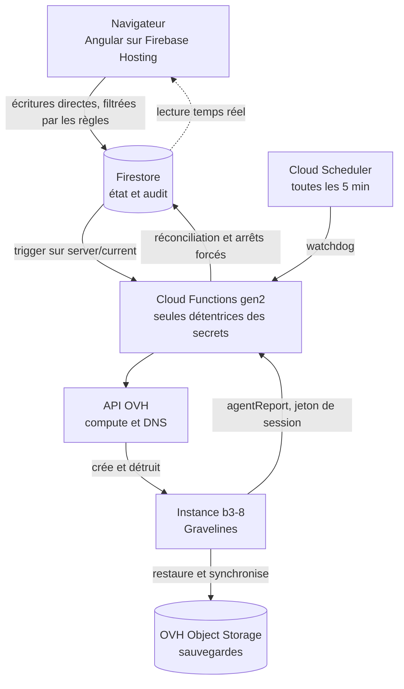
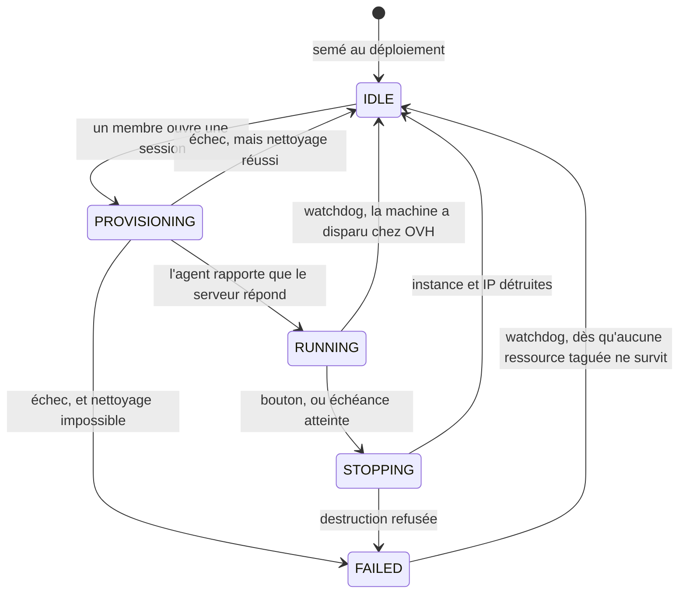

# Beacon — serveur Enshrouded à la demande

Date : 2026-09-02
Statut : en revue

Vérité produit : [`PRODUCT.md`](../../../PRODUCT.md). Ce document fait autorité
sur l'architecture ; PRODUCT.md fait autorité sur les utilisateurs, le but et
les contraintes durables.

## 1. Objectif

Remplacer un serveur Enshrouded dédié facturé 7,90 €/mois en continu par une
plateforme qui conserve les sauvegardes et crée un serveur dans le cloud
uniquement pendant les sessions de jeu.

Objectifs, par ordre de priorité :

1. **Coût.** Payer les heures jouées, pas le calendrier.
2. **Souveraineté.** L'hébergement du serveur de jeu et les sauvegardes restent
   en France, chez un fournisseur français.
3. **Simplicité d'usage.** Un ami non technique doit pouvoir lancer une partie
   en un clic et savoir quand le serveur s'arrêtera.

Groupe cible : 3 à 4 joueurs simultanés, quelques soirées par mois.

## 2. Contraintes et décisions actées

| Décision | Choix | Motif |
|---|---|---|
| Périmètre v1 | Enshrouded uniquement | Une frontière propre permettra d'extraire un adapter par jeu plus tard sans le payer aujourd'hui. |
| Cycle de vie | Démarrage manuel, échéance explicite | Une échéance supprime le besoin de détecter la présence des joueurs, qui était le composant le plus risqué du système. |
| Durée de session | 4 h par défaut | Choix du commanditaire. |
| Prolongation | +1 h, illimitée, seulement dans les 30 dernières minutes | Le garde-fou n'est pas une durée maximale mais l'obligation qu'un humain éveillé reclique : une machine oubliée s'arrête toujours dans l'heure. |
| Hébergement du jeu | OVH Public Cloud, région GRA (Gravelines) | Le moins cher (~0,047 €/h en `b3-8`), français, compte et domaine déjà en place. |
| Plan de contrôle | Firebase | Choix du commanditaire ; le free tier couvre entièrement l'usage. La contrainte France ne s'applique pas à l'app de gestion. |
| Frontière front / Functions | Le navigateur écrit directement dans Firestore ; une Function n'existe que là où un secret est indispensable | Choix du commanditaire. Interdire l'écriture au client ne protégeait rien — il n'a de toute façon aucun identifiant OVH — et ajoutait une couche de callables à maintenir. |
| Rôle des règles Firestore | Sécurité seule : identité, appartenance, rôle, propriété des champs. Aucune règle métier | Choix du commanditaire. Réécrire les durées et les transitions en langage de règles aurait dupliqué `libs/session` dans un second langage, avec une divergence garantie à terme. Le contrôle métier côté serveur est assuré par le watchdog, qui rejoue le même code. |
| Modèle de domaine | Un seul contexte délimité, `session`, dont `saves` est un module support. `libs/session` est un **noyau de décision partagé** : le navigateur et les Functions y calculent, le watchdog seul y fait autorité | La valeur du projet tient entièrement dans la session et son échéance ; la structure doit le dire plutôt que de ranger le code par couche. Parler d'un agrégat qui « porte ses invariants » aurait menti sur le mécanisme : ce code tourne aussi dans un navigateur qu'on ne contrôle pas. Où chaque invariant tient réellement est dit au §4. |
| Nom du produit | **Beacon** — app sur `beacon.charlouze.com`, serveurs de jeu sur `<jeu>.beacon.charlouze.com` | Un feu qu'on allume pour appeler les autres, éteint après : le nom raconte l'acte social plutôt que la machine. La forme du domaine accueille un deuxième jeu sans rien renommer. |
| Langue | Code et interface en anglais ; spec et documentation en français | L'expert du domaine lit lui-même le TypeScript, donc il n'y a pas de fossé de traduction à combler. Le glossaire de §4 fait le pont, et tout terme visible dans l'interface doit y figurer. |
| Stockage des saves | OVH Object Storage, GRA | Français, même région que l'instance, donc transferts internes. |
| Fichiers du serveur | Téléchargés par SteamCMD à chaque démarrage | Évite ~8 Go de stockage permanent et tout un chemin de code de cache, pour une durée de démarrage équivalente. Aligné sur la pratique des images communautaires. |
| DNS | OVH DynHost sur `enshrouded.beacon.charlouze.com` | Gratuit, inclus au domaine déjà possédé, et prévu exactement pour cet usage. |
| Conteneur du jeu | `mornedhels/enshrouded-server`, utilisée telle quelle | Gère déjà SteamCMD, Wine, supervisord, l'auto-update du jeu et des backups périodiques avec rotation. La forker nous priverait des mises à jour amont pour un bénéfice nul. |
| Conteneur compagnon | Image maison minimale (`rclone` + `curl`) | Restaure la save au démarrage, pousse les backups vers le stockage objet, dialogue avec le plan de contrôle. C'est la seule image que nous construisons. |
| Gabarit d'instance | `b3-8` (2 vCPU / 8 Go) par défaut, sélecteur réservé à l'admin | Enshrouded idle à ~4,4 Go et n'ajoute que ~100 Mo par joueur ; le doute porte sur les 2 vCPU, donc on veut pouvoir comparer en conditions réelles. |

### Fournisseurs écartés, et pourquoi

**GCP pour le serveur de jeu.** Enshrouded consomme environ 2 Mbit/s d'upload
par joueur, soit ~14 Go sortants pour une session de 4 h à 4 joueurs. GCP
facturant l'egress, cela représente ~1,10 € par session, soit ~9 €/mois pour
huit sessions — plus cher que la solution qu'on remplace. OVH et Scaleway ne
facturent pas le trafic sortant, ce qui élimine le problème.

**Scaleway.** Techniquement équivalent et français, avec un meilleur SDK
TypeScript, mais ~0,082 €/h à Paris contre ~0,047 €/h chez OVH, plus une IPv4
facturée séparément. Écart d'environ 1,25 €/mois. Reste le repli naturel si
l'API OpenStack d'OVH s'avère pénible.

**Cloudflare R2 pour les saves.** 10 Go gratuits en permanence et egress gratuit
illimité, donc le meilleur choix économique, mais Cloudflare est une société
américaine et les saves sont des données de jeu couvertes par la contrainte
de souveraineté.

### État de l'art

Trois familles de solutions existantes ont été examinées avant de décider de
construire. Aucune ne couvre le besoin, mais deux fournissent des briques qu'on
réutilise plutôt que de les réécrire.

**Les panels de gestion de serveurs de jeu** — Pterodactyl, son fork Pelican,
GameAP, FeatherPanel. Matures et open source, mais conçus pour piloter des
serveurs sur des machines allumées en permanence. Ils ne provisionnent ni ne
détruisent d'instance cloud. Dans notre architecture ils occuperaient la place
du conteneur, pas celle du plan de contrôle.

**L'hébergement facturé à l'heure** — ServerFlex est le seul hébergeur identifié
à proposer du pay-hourly multi-jeux, ce qui aurait été le besoin acheté plutôt
que construit. Vérifié auprès d'eux le 2026-09-02 : ni Enshrouded parmi les jeux
supportés, ni aucune formule à la consommation applicable. Piste close.

**Les projets Terraform de serveur de jeu à la demande** — il en existe pour
Palworld, CS:GO, Valheim. Ils créent et détruisent correctement, mais via
`terraform apply` en ligne de commande, sans interface ni échéance. Ils servent
de référence pour le `cloud-init`, pas de remplacement.

Conclusion : la valeur de ce projet réside entièrement dans l'interface
libre-service et l'échéance automatique. Tout le reste — conteneur du jeu,
cycle de vie de la VM, authentification, hébergement web — est emprunté.

Cet état de l'art repose sur une recherche limitée et mérite d'être refait si le
projet est repris plus tard.

## 3. Contrainte structurante : l'instance doit être détruite, pas éteinte

Chez OVH, une instance arrêtée continue d'être facturée, les ressources restant
réservées. Il n'existe donc pas d'état « serveur éteint mais conservé ».

Toute l'architecture en découle : la machine est strictement jetable, rien de
précieux n'y réside plus de quelques minutes, et le composant le plus critique
du système pour le budget est le processus qui garantit la destruction.

## 4. Architecture



**Le front écrit directement dans Firestore.** La frontière n'est pas « client
contre serveur » mais « ce qui exige un secret contre ce qui n'en exige pas ».
Interdire l'écriture au navigateur ne protégeait rien : il ne possède aucun
identifiant OVH et ne peut donc pas créer de machine, quoi qu'il écrive. Tout
ce qui ne demande ni identifiant cloud ni jeton d'agent est joué depuis le
navigateur, sous le contrôle des règles de sécurité Firestore. Le front
s'abonne par ailleurs en temps réel à l'état, donc le compte à rebours et les
changements d'état s'affichent simultanément chez tout le monde sans polling.

| Écriture | Auteur | Motif |
|---|---|---|
| Demander le démarrage (`IDLE` → `PROVISIONING`) | Navigateur | Aucun secret requis. Le verrou anti-double-clic est la transaction Firestore elle-même : lire l'état et écrire dans la même transaction. |
| Prolonger l'échéance | Navigateur | Aucun secret requis. Le calcul vient de `libs/session`. |
| Demander l'arrêt (`RUNNING` → `STOPPING`) | Navigateur | Aucun secret requis. |
| `config/settings`, `members/{uid}` | Navigateur (admin) | Les règles vérifient `role == 'admin'`. |
| `events/{id}` | Navigateur et Functions, en création seule | Journal d'audit ; les règles interdisent modification et suppression. |
| Créer et détruire l'instance et l'IP | Function | Identifiants OVH. |
| Mettre à jour DynHost | Function | Identifiants OVH. |
| `instanceId`, `ipId`, `ip`, et `agentTokens/{sessionId}` | Function | Valeurs que le client ne doit ni connaître ni forger. |
| `provisioning/{sessionId}`, `health/watchdog` | Function | Comptabilité interne : l'intention de création taguée et le battement de cœur. Aucun client n'y lit ni n'y écrit. |
| `saves/{id}` | Function, via `agentReport` | La VM n'a pas d'identité Firebase. |
| Arrêts forcés et réconciliation | Function, via le watchdog | Identifiants OVH. |

### Ce que les règles Firestore font, et ce qu'elles ne font pas

**Les règles sont de la sécurité, pas du code métier.** Elles répondent à *qui
peut toucher quoi* : l'auteur est-il authentifié, est-il membre, est-il admin,
écrit-il un champ dont il est propriétaire, n'efface-t-il pas une entrée
d'audit, et la valeur est-elle bien formée — `startedAt == request.time`
interdit l'antidatage, les types sont contrôlés, les chaînes bornées. Elles ne
répondent jamais à *combien de temps* ni à *dans quelle fenêtre* : aucune
arithmétique d'échéance, aucune lecture de `config/settings` depuis les règles,
aucune table de transitions légales.

La règle métier vit à un seul endroit, en TypeScript, dans `libs/session`.
Écrire la fenêtre de prolongation une seconde fois en langage de règles
Firestore n'aurait pas rendu le système plus sûr — les deux copies auraient
divergé, et l'interface aurait fini par proposer un bouton que la base refuse.

Le garde-fou de dernier recours n'est donc pas les règles mais le watchdog, qui
détient les secrets et rejoue le même `libs/session` sur ce qui a réellement été
écrit. C'est aussi le bon endroit : les rares écritures qui coûtent de l'argent
ne sont pas accessibles au navigateur — il demande, une Function décide. Où
chaque invariant tient exactement, et en combien de temps, est dit plus bas.

### Structure du monorepo

```
apps/
  web/                 Angular, déployé sur Firebase Hosting
  functions/           Firebase Functions gen2, TypeScript
libs/
  session/             CŒUR DE MÉTIER. Session, Deadline, SessionState,
                       événements de domaine. Ports ServerHost, DnsUpdater,
                       Clock, SaveStore. Ne connaît ni Firestore ni OVH
    saves/             module support : Save, plancher de taille
  session-record/      ACL Firestore du contexte session : server/current,
                       config/settings, events. Deux faces, client et admin
  membership-record/   ACL Firestore de members/. Ni libs/session ni apps/web
                       ne voient Firestore : tout passe par un module *-record
  agent-protocol/      format de fil entre la VM et le plan de contrôle —
                       une ACL, pas du métier
  ovh-compute/         adapter ServerHost   -> API OVH Public Cloud
  ovh-storage/         adapter SaveStore    -> Object Storage (S3)
  ovh-dns/             adapter DnsUpdater   -> DynHost
deploy/
  cloud-init/          génère le docker-compose.yml de l'instance
  companion/           image compagnon (rclone + curl) -> ghcr.io
firestore.rules        autorisations du front — sécurité seule, testée par ses refus
firestore.indexes.json
```

Aucune image de serveur de jeu n'est construite : `mornedhels/enshrouded-server`
est consommée telle quelle. La seule image maison est le compagnon, qui reste
minimal.

### Le modèle de domaine

Un seul contexte délimité : **`session`**. C'est là que réside toute la valeur
du projet : une partie s'ouvre, porte une échéance, se prolonge, se termine.
Tout le reste — provisionner une VM, télécharger un jeu, pointer un DNS — est
générique et emprunté.

`Session` est la racine, identifiée par `sessionId` :

| Membre | Nature | Rôle |
|---|---|---|
| `Session` | racine | seule porte d'entrée ; expose `extend(clock)`, `requestStop()`, `displayedDeadline(clock)`, `estimatedCost(tariff)` |
| `Deadline` | objet valeur | immuable ; sait dire `isWithinExtensionWindow(clock)` et produire la suivante |
| `SessionState` | objet valeur | `Idle`, `Provisioning`, `Running`, `Stopping`, `Failed` et les transitions légales |

`Session` ne voit jamais les champs réservés de `server/current`
(`instanceId`, `ipId`, `ip`, `provisionClaimedAt`, `lastError`) : ce sont des
faits d'infrastructure, que seul le watchdog confronte à ce que déclare
`ServerHost`. La traduction du document vers le modèle est le travail de
`libs/session-record`, décrit plus bas.

**`saves` — module support, pas contexte.** Aucun terme n'y change de sens par
rapport à `session`, son modèle tient en une ligne de métadonnées, et sa règle
d'or ne s'y applique pas : les sauvegardes ne s'écrivent physiquement que dans
le compagnon, sur la VM. En faire un contexte délimité aurait créé une frontière
à entretenir sans modèle derrière. C'est un module de `session`, qui garde son
port `SaveStore` — celui-là gagne sa place.

Où la règle d'or s'applique réellement est dit au §8 : dans le compagnon
d'abord, dans `agentReport` ensuite. `libs/session/saves` ne porte que le
plancher de taille — l'élagage des anciennes versions est une règle de cycle de
vie du bucket, jamais du code.

**Les événements sont des faits au passé** — `SessionStarted`,
`SessionExtended`, `SessionStopRequested`, `SessionStopped`, `DeadlineClamped`,
`ProvisioningFailed`, `CleanupFailed`, `SessionReclaimed`.

Deux d'entre eux se ressemblent et ne disent pas la même chose.
`SessionStopRequested` est écrit par le navigateur, dans la même écriture que le
passage à `STOPPING` : c'est le seul endroit qui garde **qui** a demandé
l'arrêt, sans quoi couper la soirée d'un autre serait le seul geste anonyme du
système. `SessionStopped` est écrit par la Function au passage à `IDLE`, quand
la machine est réellement détruite, et c'est lui qui porte le coût de la
session (§11).

`events` est un **journal d'audit**, et rien d'autre. Aucun code ne s'y abonne :
le seul déclencheur du système est le trigger sur `server/current`. Prétendre
que la collection sert aussi de découplage aurait décrit une architecture qui
n'existe pas.

Les noms sont en anglais, alors que la langue métier de ce projet est le
français. C'est un écart assumé au principe de langue omniprésente : ici
l'expert du domaine lit lui-même le TypeScript, donc il n'y a pas de fossé de
traduction à combler, et un vocabulaire unique évite de mêler deux langues dans
une même ligne. L'interface étant elle aussi en anglais, la colonne du milieu
porte le nom de code et, quand il en diffère, le libellé que les joueurs lisent
réellement ; la colonne de gauche ne sert qu'à ce spec et aux discussions. Ce
glossaire est la langue omniprésente :

| Métier (français) | Code (anglais) | Ce que c'est |
|---|---|---|
| session | `Session` | une partie ouverte, de son démarrage à sa destruction |
| échéance, *affichée* « heure de fermeture » | `Deadline`, libellé `Closing time` | l'instant auquel le serveur s'arrête |
| prolongation | `extend()` | repousser l'échéance d'un pas, dans la fenêtre |
| fenêtre de prolongation | `extensionWindow` | les 30 dernières minutes, seul moment où prolonger est possible |
| gabarit | `flavor` | le calibre d'instance OVH, `b3-8` par défaut |
| sauvegarde | `Save` | un état du monde de jeu déposé dans le stockage objet |
| membre | `Member` | une personne autorisée, `player` ou `admin` |
| l'ouvrant | `startedBy` | le membre qui a lancé la session |
| hors service | `Idle` | aucune machine ; on peut ouvrir une session |
| en préparation | `Provisioning` | la machine naît ; l'heure de disponibilité est annoncée |
| en service | `Running` | le serveur répond, l'échéance court |
| en fermeture | `Stopping` | la save part, la machine va être détruite |
| bloqué | `Failed` | le nettoyage n'a pas pu être garanti ; le watchdog y revient |

Tout terme apparaissant dans l'interface doit figurer dans ce tableau. Un mot
qu'on peine à nommer dans les deux colonnes est le signe que le modèle est
faux, pas que la traduction est difficile.

**La colonne du milieu porte aussi le libellé affiché** quand il diffère du nom
de code : les joueurs lisent « Closing time », le code manipule `Deadline`.
Échéance et heure de fermeture sont donc le même terme, le second habillant le
premier — deux mots pour une chose ne sont tolérés qu'à cette condition. Les
maquettes de `.impeccable/mocks/` affichent du texte français : contenu
provisoire, à traduire à l'implémentation.

### Les ports

Le front est le principal consommateur du domaine : il l'interroge pour savoir
quelle transition proposer et quelle échéance écrire, puis il écrit. Les
Functions consomment le même noyau pour ce qu'elles décident seules —
provisionnement, arrêt forcé, réconciliation. Le calcul n'existe donc qu'une
fois : c'est ce qui permet aux règles Firestore de rester de la sécurité.

Quatre ports constituent les seules frontières vers l'extérieur. Chacun est
déclaré par le contexte qui s'en sert, jamais par l'infrastructure qui
l'implémente :

| Port | Déclaré dans | Rôle |
|---|---|---|
| `ServerHost` | `session` | créer, détruire, décrire une instance et son IP |
| `DnsUpdater` | `session` | pointer un enregistrement A vers une IP |
| `Clock` | `session` | fournir l'instant courant |
| `SaveStore` | `session`, module `saves` | lister, lire, écrire les sauvegardes |

`Clock` est un port parce que tout le système tourne autour d'échéances :
sans lui, tester la fenêtre de prolongation demanderait d'attendre 3 h 30.

Les adapters `ovh-*` sont les couches anticorruption vers les fournisseurs : le
modèle OpenStack d'OVH, le format S3 et le protocole DynHost s'arrêtent à leur
frontière et n'entrent jamais dans `session`.

**Pourquoi trois libs `ovh-*` et non une seule.** Le nombre n'est pas un choix :
un adapter par port. Les fusionner ne supprimerait pas les trois ports, cela
produirait un module dont les dépendances sont l'union des trois — et comme les
secrets se lient par fonction chez gen2, chaque Function porterait les trois
jeux d'identifiants alors que le watchdog n'a besoin que du calcul.

| Lib | Protocole | Identifiants |
|---|---|---|
| `ovh-compute` | API OVH, signature à clé applicative | clé applicative, secret, consumer key |
| `ovh-storage` | S3 | access key et secret S3 |
| `ovh-dns` | un GET HTTP sur `ovh.com/nic/update` | user et mot de passe DynHost |

Leur seul point commun est la facture : grouper par fournisseur serait grouper
par relation commerciale, la même erreur que grouper par couche technique sur un
autre axe. Elles n'ont pas non plus les mêmes raisons de changer — le repli
Scaleway annoncé plus haut ne concernerait que le calcul, et scinderait la lib
unique exactement au moment où elle est sous tension.

### `session-record` : la frontière avec Firestore

Firestore n'est pas derrière un port unique, parce qu'il n'est pas au bout d'un
appel : il tient cinq rôles à la fois. Ce n'est pas une raison de le déclarer
irremplaçable — tout système externe se remplace — mais une raison de savoir
d'avance ce que le remplacement coûterait.

| Rôle tenu par Firestore | Ce qu'il faudrait à la place |
|---|---|
| support de l'état | n'importe quel stockage documentaire ou relationnel |
| verrou des transactions | des transactions, que tout le monde sait faire |
| bus des triggers | une file, un *outbox*, ou un `LISTEN/NOTIFY` — à condition de garder la livraison au moins une fois, dont dépend la réclamation transactionnelle du §8 |
| canal temps réel de l'interface | WebSocket, SSE, ou du polling assumé |
| moteur d'autorisation déclaratif | le point dur, voir ci-dessous |

Les cinq se remplacent, et par le même geste : on écrit un autre adapter. Le
cinquième est seulement le plus cher. Sans règles déclaratives, l'adapter n'est
plus un client de base de données mais le client d'un service qu'il faut aussi
écrire — un service qui rejoue `libs/session` et refait les contrôles que les
règles faisaient. Le domaine ne bouge pas, l'interface non plus : même
frontière, implémentation qui traîne un déployable avec elle.

Le critère de la §2 se relirait alors « une Function là où un secret **ou une
autorisation que le stockage ne sait pas rendre** est indispensable » : le même
principe appliqué à d'autres faits, pas une décision à rouvrir.

S'appuyer aujourd'hui sur ces cinq rôles est un choix assumé pour la
simplicité, pas une dette cachée — la facture est écrite au-dessus.

**`libs/session-record` est cette frontière**, sur les trois collections qui
portent le contexte `session` : `server/current`, `config/settings` et `events`.
Le journal en fait partie — `SessionStarted`, `SessionExtended` et
`SessionStopped` sont les événements de cette session, pas ceux d'un autre
domaine.

Il ne traduit donc pas seulement `server/current` vers `Session` et retour ; il
porte les opérations :

- sur l'état — lire, s'abonner, ouvrir une session en transaction, prolonger,
  demander l'arrêt, réclamer le provisionnement, poser les champs réservés,
  clamper, remettre d'équerre ;
- sur les réglages — lire, s'abonner (c'est par là qu'arrive `rulesVersion`),
  écrire côté admin ;
- sur le journal — écrire un événement dans la même écriture groupée que l'état,
  lire les événements de la session courante (§5), totaliser le coût du mois
  (§11).

**Il a deux faces**, parce que les deux processus ne parlent pas le même
dialecte : le navigateur passe par le SDK client, les Functions et le watchdog
par `firebase-admin`. Même traduction, mêmes noms de champs, deux transports.
Sans cette symétrie, le mapping s'écrirait deux fois et divergerait — le défaut
qu'on refuse aux règles.

Les champs réservés n'entrent pas dans `Session`, qui ne les voit jamais. Ils
ont leur propre vue, `ServerFacts` — un constat d'infrastructure et non un
modèle de domaine, dans le même document mais pas dans le même objet.

`ServerFacts` est **manipulée** par le watchdog et les Functions seuls, mais deux
de ses valeurs sont **affichées** : l'`ip`, que l'écran montre à côté du nom de
domaine, et `lastError`, qui dit qu'une tentative précédente a échoué. La face
client en expose donc une vue en lecture seule, réduite à ces deux champs. Le
reste — `instanceId`, `ipId`, `provisionClaimedAt` — ne quitte jamais le côté
serveur, où il n'a d'ailleurs de sens que pour la réconciliation.

**`members` n'appartient pas au contexte `session`.** C'est le registre des
personnes autorisées, et le navigateur y accède. Cet accès a sa propre ACL,
`libs/membership-record`, sœur de la précédente et de même facture — pas une
Function, le §5 dit pourquoi. Sa liste fermée : lire son propre rôle, lister les
membres (admin), ajouter, changer le rôle, retirer.

**Retirer, c'est supprimer le document** — pas poser un rôle « inactif ». Un
registre où l'appartenance se lit par la présence n'a qu'un seul état à tester,
et les règles comme leurs refus s'écrivent sur cette base. Le jour où il faudrait
garder une trace des départs, elle irait dans `events`, pas dans `members`.

La clôture qui rend tout cela vérifiable **ne prétend pas couvrir le dépôt
entier**, sinon elle serait fausse dès la première Function :

> Ni `libs/session`, ni `apps/web` n'importent un SDK Firestore, ni ne nomment
> un champ d'un document. Ils passent par les modules `*-record`.

Et la règle qui empêche cette clôture de mentir, qu'il faut relire à chaque
ajout de collection : **toute collection que le navigateur touche a son module
`*-record`.** Une collection qui n'en a pas rend la clôture fausse le jour où
un écran en a besoin — et ce jour-là, c'est la clôture qu'on contourne, pas la
liste qu'on complète.

Le domaine et l'interface restent donc propres, et c'est ce qui compte : ce sont
eux qu'un changement de stockage ne doit pas toucher. `apps/functions` connaît
Firestore, et c'est son rôle — c'est le bord du système, et sa comptabilité
interne (`provisioning`, `agentTokens`, `health`) est faite de documents qui
n'existent que parce que le stockage est Firestore. Les remplacer fait partie du
remplacement de l'adapter, pas d'une reprise du métier.

Ce n'est pas pour autant un dépôt de données au sens complet : pas de
`findAll`, pas de critères, pas d'abstraction de requête. La liste des
opérations est courte et fermée, et ne s'allonge que quand un flux du §6 ou un
affichage du §5 ou du §11 l'exige. Une lecture dont l'écran a besoin et qui n'y
figure pas est un défaut de cette liste, pas une raison de contourner la
clôture.

### Où chaque invariant tient réellement

`libs/session` est un **noyau de décision partagé**, pas un gardien. Le
navigateur l'exécute pour savoir quoi proposer et quoi écrire ; les Functions
l'exécutent pour ce qu'elles décident seules ; le watchdog l'exécute pour
constater ce qui a dérivé. Le calcul n'existe qu'une fois dans le dépôt, mais
il tourne dans un processus qu'on ne contrôle pas.

Le système n'est donc pas invariant à l'écriture, il **converge**. Pour chaque
invariant, où il tient et en combien de temps :

| Invariant | Où il tient | Délai |
|---|---|---|
| Seul un membre écrit ; personne ne s'octroie `admin` ; les champs réservés sont hors de portée | règles Firestore | immédiat, incontournable |
| Une seule session naît d'un double clic | transaction Firestore du navigateur, puis réclamation transactionnelle de la Function | immédiat |
| `RUNNING` implique qu'une machine existe | Functions seules — le navigateur ne peut pas écrire cet état | immédiat |
| Transition légale, pas de `IDLE` vers `STOPPING` | `libs/session` dans le navigateur — contournable | jusqu'à 5 min, puis watchdog |
| `deadline - maintenant ≤ durée de session` | `libs/session` dans le navigateur — contournable | jusqu'à 5 min, puis watchdog |
| Aucune ressource OVH ne survit à sa session | watchdog, par réconciliation sur le tag | jusqu'à 5 min |

Un invariant dont on sait dire où il tient et en combien de temps est protégé ;
un invariant « porté par l'agrégat » mais exécuté dans un navigateur hostile est
une phrase, pas une garantie.

**Le clampage ne doit jamais se voir.** Sans précaution, une échéance forgée
puis ramenée à la borne ferait reculer le décompte sous les yeux des joueurs,
sur un écran dont tout le principe est que l'heure de fermeture est un fait
annoncé. Le front n'affiche donc jamais `deadline` brut mais
`Session.displayedDeadline(clock)`, qui applique la même borne à la lecture :
la valeur affichée est déjà celle vers laquelle le watchdog converge.

### La dérive de version entre onglets

Le calcul n'existe qu'une fois dans le dépôt, mais il peut exister deux fois en
production : un onglet ouvert hier exécute le `libs/session` d'hier contre le
`config/settings` et le watchdog d'aujourd'hui. C'est la même divergence que
celle reprochée à une règle métier dupliquée dans les règles Firestore, décalée
dans le temps au lieu de l'être dans le langage.

Le symptôme serait le pire pour l'ami non technicien : un bouton qui marche,
puis un effet qui s'évapore. `config/settings` porte donc un champ
`rulesVersion`, auquel le front est déjà abonné en temps réel ; un écart avec la
version compilée dans le bundle force le rechargement de l'application.

**Ce champ est écrit par le déploiement, à chaque fusion**, avec la référence du
commit (§10). C'est la moitié qui compte : un `rulesVersion` posé une fois au
semis et jamais retouché rendrait le mécanisme inerte, et l'onglet d'hier ne se
rechargerait jamais. Il est réservé pour la même raison que les champs réservés
de `server/current` — un admin qui le modifierait à la main désynchroniserait
tout le monde sans le savoir.

## 5. Modèle de données

| Document | Contenu | Écrivain |
|---|---|---|
| `server/current` | champs *demandés* : `state`, `sessionId`, `startedBy`, `startedAt`, `deadline` | navigateur (membre) |
| `server/current` | `flavor` | navigateur (admin) ; à défaut, la Function applique le gabarit de `config/settings` |
| `server/current` | champs *réservés* : `instanceId`, `ipId`, `ip`, `provisionClaimedAt`, `lastError` | Functions |
| `provisioning/{sessionId}` | `tag`, `intendedAt`, `flavor`, puis `instanceId`, `ipId`, `closedAt` — l'intention de création ; ni lue ni écrite par un client | Functions |
| `agentTokens/{sessionId}` | `hash`, `createdAt` — document illisible par tout client | Functions |
| `config/settings` | gabarit par défaut, durée de session, pas de prolongation, largeur de la fenêtre de prolongation, `tariffPerHour` par gabarit | navigateur (admin) |
| `config/settings` | champ *réservé* : `rulesVersion` | le déploiement, via l'Admin SDK (§10) |
| `health/watchdog` | `lastRunAt` — battement de cœur du watchdog | Functions |
| `members/{uid}` | `email`, `role` : `admin` \| `player` | navigateur (admin) ; jamais par le sujet lui-même |
| `saves/{id}` | `createdAt`, `objectKey`, `sizeBytes`, `origin` : `auto` \| `manual` \| `pre-shutdown` | Functions |
| `events/{id}` | événement de domaine : type, `sessionId`, acteur — `uid` **et nom affiché** —, horodatage, et le coût estimé sur le seul `SessionStopped` (§11) | navigateur et Functions, en création seule |

### Qui a le droit de lire

Le tableau ci-dessus ne dit que l'écriture ; la lecture est l'autre moitié, et
elle se règle document par document — les règles Firestore ne savent pas filtrer
au champ.

| Document | Lecteur |
|---|---|
| `server/current` | tout membre |
| `config/settings` | tout membre — le front en a besoin pour calculer l'échéance |
| `events/{id}` | tout membre — le cumul du mois se totalise par requête (§11) |
| `saves/{id}` | personne, hors Functions — aucun écran de la v1 ne les liste (§13) ; à ouvrir aux membres le jour où l'interface les montrera |
| `members/{uid}` | un admin, ou le sujet lui-même |
| `provisioning`, `agentTokens`, `health` | personne, hors Functions |

**Aucune lecture n'est ouverte à un authentifié non membre.** Sans cette règle,
n'importe quel compte Google lirait les adresses e-mail de `members`, l'IP d'une
machine exposée sur Internet et les coûts — sur un produit dont la liste blanche
est une contrainte produit. Le §9 la teste par ses refus, collection par
collection.

`members` est le seul document dont la lecture est plus étroite que
l'appartenance, et ce qu'on y protège est précis : **les adresses e-mail**. Les
noms, eux, circulent — l'écran nomme l'ouvrant de la session, et l'audit serait
illisible s'il ne listait que des `uid`.

C'est donc l'événement qui porte le nom. `events` enregistre déjà l'acteur de
chaque fait ; il enregistre son `uid` **et** son nom affiché, parce qu'un
journal de `uid` ne se relit pas. L'interface y lit le nom de l'ouvrant, sans
jamais toucher `members`. Écrire ce nom une seconde fois dans `server/current`
aurait dupliqué un fait déjà stocké, pour économiser une requête.

Le coût est une requête : les événements de la session courante, filtrés sur le
seul `sessionId`, dont l'écran retient le `SessionStarted`. Une égalité simple,
donc l'index automatique de Firestore suffit — aucun index composite à déclarer,
et le tri se fait sur une poignée de documents côté client. C'est la seule
dépendance de l'écran principal envers la collection d'audit, acceptable parce
que l'état et son événement partent dans la même écriture groupée, donc atomique
(§8).

**`server/current` et `config/settings` ne sont jamais créés par un client.**
Les deux sont semés au déploiement. C'est la conséquence d'un piège des règles
Firestore : la restriction champ par champ s'écrit `diff(resource.data)`, or
`resource` est nul sur une création. Un document absent que le client pourrait
créer contournerait donc d'un coup toute la propriété des champs — il suffirait
de naître `RUNNING` avec une IP inventée. `create` est refusé aux clients sur
ces deux documents, et les tests de §9 le vérifient explicitement.

**Le rôle vit dans `members/{uid}`, et nulle part ailleurs.** Les règles le
lisent par un `get()` à l'évaluation. Ce n'est pas la solution la moins chère en
lectures facturées — un *custom claim* Auth serait gratuit — mais c'est la seule
qui garde le registre des rôles à un seul endroit, et elle vaut ses deux
avantages :

- **Aucune Function.** Poser un claim exige l'Admin SDK, donc une Function pour
  un geste qui ne demande aucun secret. Un admin qui promeut quelqu'un écrit
  directement `members/{uid}`, sous le contrôle des règles — conforme à la règle
  du §2 au lieu de lui faire une exception.
- **Effet immédiat.** Un claim traîne jusqu'à l'expiration du jeton, environ une
  heure : retirer les droits de quelqu'un ne prendrait effet qu'après. Un
  document est relu à chaque évaluation.

Le coût est un `get()` par écriture protégée. À quelques dizaines d'écritures
par soirée, il est invisible dans le free tier ; si le jour venait où il ne
l'était plus, c'est le nombre de joueurs qui aurait changé, pas le raisonnement.

**Ce `get()` ne contredit pas « les règles ne font que de la sécurité ».** La
ligne ne passe pas entre lire et ne pas lire, mais entre lire pour savoir *qui
tu es* et lire pour savoir *ce qui est métier-correct*. `members` répond à la
première question, donc les règles y accèdent. `config/settings` répond à la
seconde — durées, fenêtres, gabarit par défaut — donc elles n'y touchent jamais.

**Le premier admin est semé au déploiement**, avec `server/current` et
`config/settings` (§10). `members` n'étant écrit que par un admin, il n'y aurait
sinon aucun moyen d'en obtenir un premier. Le rôle vivant en base, ce semis est
une écriture Firestore ordinaire et non plus un geste hors bande.

**Toute chaîne écrite par un client est bornée en taille**, et `events` porte un
TTL Firestore de 400 jours. Sans borne ni TTL, la collection la plus ouverte du
système serait un moyen de faire gonfler la facture — un comble sur ce projet.

La valeur du TTL n'est pas arbitraire : `events` est la seule collection qui
porte un coût estimé, donc c'est d'elle que se calcule le cumul du mois (§11).
D'où la règle générale — **le TTL d'une collection ne descend jamais sous
l'horizon de ce qu'on affiche à partir d'elle.** À quelques dizaines d'entrées
par mois, totaliser par requête ne coûte rien et évite un compteur à tenir.

Le tarif horaire nécessaire à ce calcul — le `tariff` de `estimatedCost()` —
vit dans `config/settings`, par gabarit. Il ne peut pas être compilé dans le
bundle : OVH change ses prix, et un tarif faux fausserait silencieusement le
seul chiffre que l'interface affiche sur l'argent.

`server/current` est un document unique dont les champs ont deux propriétaires.
Les règles l'imposent champ par champ : une écriture du navigateur qui touche un
champ réservé est refusée en bloc, même si le reste de l'écriture est légitime.

Le hachage du jeton d'agent n'y figure pas, et c'est délibéré. Les règles
Firestore filtrent la lecture au niveau du document, pas du champ : posé dans
`server/current`, que tout membre lit en temps réel, il aurait été lisible par
tous. Il vit donc dans `agentTokens/{sessionId}`, qu'aucun client ne lit.

**`provisioning/{sessionId}` porte l'intention de création**, écrite avant tout
appel à OVH (§6, étape 4). C'est la pièce qui empêche une machine fantôme de
tourner à l'insu de tout le monde, donc la protection la plus directe du budget.

`tag` vaut `beacon:{sessionId}`, et cette même chaîne est posée en métadonnée
sur l'instance et sur l'IP au moment de leur création. La réconciliation du
watchdog est alors une simple comparaison : toute ressource OVH portant un tag
`beacon:` dont le `sessionId` n'a pas de document `provisioning` ouvert — soit
qu'il n'en ait jamais eu, soit qu'il porte un `closedAt` — est orpheline et se
détruit. Le document est fermé au passage à `IDLE`, jamais supprimé : c'est ce
qui distingue « session terminée proprement » de « ressource dont personne n'a
jamais entendu parler ».

Le `sessionId` est tiré par le navigateur, ce qui pose la question de sa
réutilisation. Elle est fermée par construction : la Function crée
`provisioning/{sessionId}` et `agentTokens/{sessionId}` en création stricte, et
un identifiant déjà vu fait échouer la transaction de réclamation. Un
`sessionId` rejoué n'obtient donc pas de machine.

Sur `state`, les règles ne connaissent pas la machine à états — ce serait du
métier. Elles se bornent à la propriété des assertions : trois valeurs affirment
un fait que seule une Function peut constater, donc le navigateur ne peut pas
les écrire.

| Valeur de `state` | Écrivain autorisé | Fait affirmé |
|---|---|---|
| `PROVISIONING`, `STOPPING` | navigateur et Functions | une intention de l'utilisateur |
| `RUNNING` | Functions seules | une machine existe et répond |
| `IDLE` | Functions seules | la machine et l'IP sont détruites |
| `FAILED` | Functions seules | une opération cloud a échoué **et** le nettoyage n'a pas pu être garanti |

L'ordre dans lequel ces états s'enchaînent — qu'on ne passe pas de `IDLE` à
`STOPPING`, par exemple — relève de `libs/session` et du watchdog, pas des
règles. Un membre qui contournerait l'interface pour écrire un état incohérent
n'obtiendrait rien : sans champ réservé il ne peut ni faire naître une machine
ni en cacher une, et le watchdog remet `server/current` d'équerre au tour
suivant.

`flavor` obéit à la même logique de propriété : le champ est réservé à l'admin,
donc un membre qui ne l'écrit pas hérite du gabarit par défaut appliqué par la
Function.

États possibles de `server/current.state` :



**`FAILED` n'est pas un état terminal, et l'échec ordinaire n'y passe pas.**
Une création d'instance refusée par OVH est un incident banal : la Function
nettoie ce qu'elle a pu créer, écrit `lastError` et repasse à `IDLE`. Le bouton
redevient immédiatement cliquable, l'interface disant simplement que la
tentative précédente a échoué.

`FAILED` est réservé au cas où le nettoyage lui-même n'a pas abouti — API OVH
injoignable, destruction refusée. C'est un état d'attente, pas un mur : le
watchdog y revient toutes les 5 minutes, retente la destruction, et rend l'état
à `IDLE` dès qu'aucune ressource taguée ne survit.

Sans cette sortie, un refus de provisionnement un vendredi soir laisserait le
produit mort jusqu'à une intervention en console Firebase — exactement la
dépendance à l'administrateur que `PRODUCT.md` interdit avec « personne n'est
jamais bloqué ».

## 6. Flux

### Démarrage

1. Le navigateur exécute une transaction Firestore qui fait passer
   `server/current` de `IDLE` à `PROVISIONING`, en y inscrivant `sessionId`,
   `startedBy`, `startedAt`, `deadline` — et `flavor` seulement s'il est admin,
   sinon la Function appliquera le gabarit par défaut — plus l'événement
   `SessionStarted` dans la même écriture, c'est lui qui porte le nom affiché.
   L'échéance est calculée par `libs/session` à partir de `config/settings`.
   Lire l'état et écrire dans la même transaction est le verrou contre deux
   personnes qui cliquent simultanément : la seconde transaction rejoue sa
   lecture, voit `PROVISIONING` et renonce.
2. Les règles vérifient seulement ce qui relève de l'autorisation : l'auteur
   figure dans `members`, `startedBy` est bien son propre `uid`, et l'écriture
   ne touche aucun champ réservé ni n'affirme un état réservé aux Functions.
3. Le passage à `PROVISIONING` déclenche la Function `onServerStateChange`,
   seule frontière vers les secrets. Elle **réclame le provisionnement dans une
   transaction** : elle abandonne si `provisionClaimedAt` est déjà posé. Les
   triggers Firestore sont livrés au moins une fois, et sans cette réclamation
   un double déclenchement créerait deux instances facturées.
4. Elle génère un jeton d'agent aléatoire de 32 octets, dont seul le hachage est
   stocké, dans `agentTokens/{sessionId}`, puis écrit l'**intention de
   création** dans `provisioning/{sessionId}` — tag `beacon:{sessionId}`,
   instant, gabarit — **avant** d'appeler OVH. Sans cela, un crash entre l'appel
   et l'enregistrement de l'`instanceId` laisserait une machine facturée dont
   plus personne ne connaît l'existence. Les deux documents sont créés en
   création stricte : un `sessionId` déjà vu fait échouer la transaction.
5. Création de l'instance et de l'IP, **toutes deux portant le tag**, avec un
   `cloud-init` contenant : le jeton, l'URL de l'endpoint, des identifiants S3
   restreints au seul préfixe des saves, la configuration serveur et l'échéance.
   `instanceId` et `ipId` sont inscrits dans `provisioning/{sessionId}` dès
   qu'OVH les retourne.
6. Au boot, `cloud-init` écrit un `docker-compose.yml` et lance deux conteneurs :
   `mornedhels/enshrouded-server`, qui télécharge le jeu via SteamCMD et prend sa
   configuration dans les variables d'environnement, et le compagnon, qui
   restaure la save depuis Object Storage **avant** que le serveur démarre, puis
   synchronise vers le bucket les backups produits par l'image amont.
7. L'agent appelle `agentReport({phase: 'ready', ip})`. La Function met à jour
   DynHost, recopie `instanceId`, `ipId`, `ip` et le `flavor` effectivement
   provisionné de `provisioning/{sessionId}` vers `server/current`, et fait
   passer l'état à `RUNNING`. Recopier le gabarit évite que l'estimation
   affichée dérive si un admin change le gabarit par défaut en cours de session. C'est ce recopiage qui donne au watchdog de quoi comparer l'état
   affiché à ce qu'OVH déclare, et à l'arrêt propre de quoi effacer.
8. L'UI affiche le nom de domaine, l'IP brute et le compte à rebours.

Durée attendue du clic au serveur jouable : environ 4 minutes, dont 2 à 3 pour
le téléchargement SteamCMD.

L'agent rapporte ensuite toutes les minutes. Cette cadence n'est pas un détail
d'implémentation : deux garanties chiffrées en dépendent — l'agent apprend une
prolongation ou un `STOPPING` en moins d'une minute, et le watchdog s'appuie sur
ce délai pour distinguer une machine lente d'une machine muette.

### Prolongation

Le bouton n'est actif que si l'état est `RUNNING` et qu'il reste 30 minutes ou
moins. Chaque clic écrit directement la nouvelle échéance dans Firestore, avec
l'entrée d'audit correspondante dans la même écriture groupée.

Une écriture groupée n'est pas une transaction, et c'est délibéré : si deux
personnes prolongent dans la même seconde, les deux écritures posent la même
valeur et la session gagne une heure, pas deux. C'est le comportement voulu —
prolonger est un acte collectif sur une ressource commune, pas un compteur que
chacun incrémente.

Aucune Function n'intervient : prolonger ne demande aucun secret. Le pas d'une
heure et la fenêtre de 30 minutes sont calculés par `libs/session` à partir de
`config/settings` ; les règles, elles, se contentent de vérifier que l'auteur
est membre et qu'il ne touche pas un champ réservé. Il n'y a pas de plafond : la
protection n'a jamais été une durée maximale mais l'obligation de recliquer.

Rien n'empêche donc techniquement un membre de contourner l'interface et
d'écrire une échéance lointaine. C'est assumé : il est déjà autorisé à dépenser
en cliquant, et le vrai plafond est ailleurs. Le watchdog fait respecter, toutes
les 5 minutes et côté serveur, l'invariant `deadline - maintenant ≤ durée de
session` — soit 4 h. Une échéance forgée est ramenée à cette borne en moins de
cinq minutes, et l'écart est journalisé dans `events`. C'est un invariant simple,
sans historique à reconstituer, qui borne la dépense quoi qu'écrive le client.

Ce clampage ne se voit jamais à l'écran, l'interface bornant déjà à la lecture
(§4).

L'agent relit l'échéance courante dans la réponse à chacun de ses rapports,
donc il apprend la prolongation en moins d'une minute.

### Arrêt propre

Déclenché par le bouton ou par l'atteinte de l'échéance.

1. L'état passe à `STOPPING` : écrit par le navigateur si quelqu'un clique, par
   le watchdog si l'échéance est atteinte.
2. L'agent arrête le serveur de jeu **puis** pousse la save finale — dans cet
   ordre, pour que la sauvegarde soit cohérente — et rapporte `saved`.
3. La Function détruit l'instance **et l'IP**.
4. L'état repasse à `IDLE`, et les champs réservés de `server/current` sont
   remis à vide par la Function.

### Watchdog

Cloud Scheduler, toutes les 5 minutes. C'est le composant le plus important du
système pour le budget.

| Condition | Action |
|---|---|
| Échéance dépassée de plus de 2 min, état encore `RUNNING` | Arrêt forcé |
| `deadline - maintenant` supérieur à la durée de session | Échéance ramenée à la borne, écart journalisé |
| État incohérent avec les champs réservés — `RUNNING` sans `instanceId`, `IDLE` avec une instance vivante | `server/current` remis d'équerre à partir de ce qu'OVH déclare réellement |
| `PROVISIONING` depuis plus de 15 min | Destruction, puis `IDLE` avec `lastError` — ou `FAILED` si la destruction échoue |
| `STOPPING` depuis plus de 10 min | Destruction sans attendre l'agent — la save de moins de 10 min est déjà en Object Storage |
| État `FAILED` | Nouvelle tentative de destruction ; retour à `IDLE` dès qu'aucune ressource taguée ne survit |
| Ressource taguée `beacon:` sans `provisioning/{sessionId}` ouvert | Destruction |

Chaque passage écrit `health/watchdog.lastRunAt`. La dernière ligne est la
réconciliation : elle rattrape toute instance ou IP orpheline, quelle qu'en soit
la cause, en confrontant les ressources qu'OVH déclare aux intentions de
création enregistrées.

### Qui surveille le watchdog

Le watchdog est déclaré composant le plus critique du système pour le budget,
et rien ne signalait son arrêt. Une alerte de budget OVH mesure le dégât une
fois qu'il est fait ; il faut aussi mesurer la panne.

**Le garde-fou est une alerte Cloud Monitoring** sur l'échec ou l'absence
d'exécution du job Scheduler, qui prévient l'administrateur par e-mail. C'est
elle, et elle seule, qui signale la panne.

`health/watchdog.lastRunAt`, écrit à chaque passage réussi, n'est pas un second
garde-fou : rien ne le lit automatiquement. C'est une trace de diagnostic — elle
répond à « depuis quand ? » une fois l'alerte reçue. Un marqueur que personne ne
surveille ne surveille rien, et le présenter autrement donnerait une fausse
impression de redondance.

Cette alerte est **destinée à l'administrateur, jamais affichée dans
l'interface**. Un bandeau « le surveillant ne répond plus » sur l'écran des
joueurs serait précisément la console cloud que le produit refuse, et
n'apprendrait rien d'actionnable à quelqu'un qui veut juste jouer.

## 7. Sécurité

**Les règles Firestore délimitent l'autorité, pas le comportement.** Puisque le
navigateur écrit en base, il faut raisonner en supposant qu'un membre écrit
directement dans Firestore sans passer par l'interface, avec son jeton Firebase
légitime.

Ce qu'il ne peut pas faire, parce que les règles le lui refusent : écrire quoi
que ce soit sans figurer dans `members`, se déclarer `RUNNING` ou `IDLE`, forger
une IP ou un `instanceId`, lire `agentTokens` ni `provisioning`, s'octroyer
`role: admin`, choisir un gabarit plus gros, modifier ou effacer une entrée
d'audit.

Ce qu'il peut faire, et qui est accepté : écrire une échéance incohérente, ou un
état incohérent. Aucune de ces écritures ne crée de machine — seule une Function
en crée — et le watchdog les rattrape en moins de cinq minutes. Le risque
résiduel se chiffre en centimes, contre un membre qui a de toute façon le droit
de lancer des sessions.

Il peut aussi créer des entrées `events` à volonté. Les règles y vérifient la
forme, la taille, et que l'acteur déclaré est bien l'auteur — mais rien de plus,
puisque le contenu d'un fait passé n'est pas vérifiable après coup. Un membre
peut donc fausser le cumul du mois affiché, gonfler la collection dans les
limites du TTL, ou écrire un `SessionStarted` plus récent pour que l'écran
affiche son nom comme celui de l'ouvrant.

C'est assumé, et les trois pour la même raison : ce sont des affichages, pas des
autorités. Le cumul est un indicateur, la vraie facture est chez OVH ; l'ouvrant
affiché est un confort, la vérité est le `startedBy` de `server/current`, que
les règles attachent à l'`uid` de l'auteur. Ce serait à revoir le jour où
`events` servirait à autre chose qu'à informer des amis.

Deux pièges propres à Firestore sont traités en §5 parce qu'ils sont
structurels : la création d'un document absent contourne toute restriction champ
par champ, et l'absence de borne sur les chaînes écrites par un client ouvre un
épuisement de ressource qui se paie en euros.

Un troisième se traite ici. `server/current` est écrit par n'importe quel
membre, sans contrôle de propriété : c'est délibéré, la ressource est commune et
chacun doit pouvoir arrêter la session d'un autre. Le seul champ attaché à une
personne est `startedBy`, que les règles exigent égal à l'`uid` de l'auteur.
Restreindre *quels* champs sont écrits sans restreindre *qui* les écrit serait un
défaut ailleurs ; ici c'est le comportement voulu.

Les règles se testent donc comme de la sécurité : par leurs refus (voir §9).

**Aucun identifiant d'API cloud ne réside sur la VM de jeu.** C'est une machine
exposée sur Internet qui exécute un binaire propriétaire sous Wine ; si elle est
compromise, l'attaquant ne doit rien obtenir de plus que des droits d'écriture
sur un préfixe de bucket. La conséquence assumée est que l'instance ne peut pas
s'auto-détruire : le watchdog est le seul réclamateur, complété par une alerte
de budget OVH comme garde-fou humain.

L'agent s'authentifie auprès d'un unique endpoint avec un jeton propre à la
session, qui meurt avec elle.

Les identifiants OVH (clé applicative, secret, consumer key) et ceux du bucket
sont stockés dans Secret Manager et lus par les Functions.

Une IP orpheline chez certains fournisseurs continue d'être facturée après la
destruction de l'instance. Le flux d'arrêt doit donc supprimer l'IP **et**
l'instance, et le watchdog balaie les IP non réclamées.

## 8. Pannes traitées

| Panne | Réponse |
|---|---|
| Deux démarrages simultanés | Transaction Firestore côté navigateur : la seconde relit `PROVISIONING` et renonce. Si les deux passent malgré tout, la réclamation transactionnelle de la Function ne laisse naître qu'une machine |
| Double livraison du trigger Firestore | `onServerStateChange` réclame le provisionnement dans une transaction et abandonne si `provisionClaimedAt` est déjà posé ; si deux instances naissent malgré tout, le tag unique permet au watchdog d'en détruire une |
| Membre qui écrit en base hors de l'interface | Les règles lui interdisent tout ce qui engage une ressource ou un privilège ; une échéance ou un état incohérents sont ramenés à la norme par le watchdog en moins de 5 min |
| Membre qui tente de recréer un document semé au déploiement | `create` refusé aux clients sur `server/current` et `config/settings` — sans quoi la restriction champ par champ, qui n'existe que sur `update`, serait contournée |
| Perte du dernier admin | Rejouer le semis du déploiement (§10), qui recrée `members/{uid}` s'il manque ; à défaut, la console Firebase écrit dans `members` comme n'importe quel document |
| Écriture d'état réussie mais entrée d'audit absente | L'état et l'événement partent dans la même écriture groupée, donc atomique ; une Function qui décide seule écrit son propre événement avec l'acteur `system` |
| Création d'instance refusée par le fournisseur | Nettoyage, puis `IDLE` avec `lastError` : le bouton est immédiatement recliquable |
| Nettoyage impossible après un échec | `FAILED`, que le watchdog retente toutes les 5 min jusqu'à `IDLE`. Aucun état du système n'est sans issue |
| Le watchdog cesse de tourner | Alerte Cloud Monitoring vers l'administrateur, avant que la facture ne le signale ; `health/watchdog` ne signale rien mais dit depuis quand |
| L'agent ne répond jamais | Timeout `PROVISIONING`, destruction |
| DynHost échoue | La session **n'est pas** interrompue : l'UI affiche l'IP brute |
| Restauration de save impossible | L'agent refuse de démarrer et remonte l'erreur. **Règle d'or : ne jamais écraser une save existante par une save vide** |
| Crash de la machine | Au pire 10 minutes de jeu perdues, soit la fréquence de synchronisation |

### Où la règle d'or s'applique vraiment

C'est le seul invariant du système dont la violation détruit une donnée
irremplaçable, et il ne s'applique pas là où on serait tenté de le ranger. Les
sauvegardes ne s'écrivent physiquement que dans le compagnon, sur la VM :
`libs/session/saves` ne voit que des métadonnées, et toujours après coup. Une
règle revendiquée par une bibliothèque TypeScript mais exécutée par un script
`rclone` n'est protégée que par la rigueur du script.

Trois lignes de défense, de la plus proche du disque à la plus lointaine :

1. **Le compagnon refuse de synchroniser une archive vide ou anormalement
   petite**, et n'emploie que des options `rclone` non destructives — jamais de
   miroir qui propage une suppression locale vers le bucket.
2. **Le stockage objet conserve un historique**, et l'élagage est une règle de
   cycle de vie du bucket, côté fournisseur. **Aucun code du projet ne supprime
   une sauvegarde** : le port `SaveStore` n'expose ni suppression ni élagage, et
   c'est délibéré — sur la seule donnée irremplaçable du système, la meilleure
   ligne de code est celle qui n'existe pas. Écraser reste réversible tant que la
   version précédente est dans la fenêtre de rétention.
3. **`agentReport` refuse d'enregistrer une `Save`** dont la taille passe sous
   un plancher, et journalise le refus. C'est le seul des trois qui vit dans du
   code TypeScript testable, et il arrive en dernier.

L'ordre compte : la protection réelle est en 1, pas en 3.

## 9. Stratégie de test

L'essentiel de l'effort porte sur `libs/session` : tests unitaires purs avec un
`Clock` bouchonné, couvrant les transitions de `Session`, la fenêtre de
prolongation portée par `Deadline` et le calcul de coût. Ces tests
n'instancient ni Firestore ni OVH — si l'un d'eux en a besoin, c'est que le
noyau de décision a laissé fuir une dépendance vers l'infrastructure.

**Les règles Firestore ont leur propre suite de tests**, écrite avec
`@firebase/rules-unit-testing` contre l'émulateur. C'est la couche
d'autorisation, donc elle se teste par ses refus : écriture par un `uid` absent
de `members`, `state` porté à `RUNNING` ou `IDLE` depuis le navigateur, écriture
d'un champ réservé, lecture de `agentTokens/{sessionId}` ou de
`provisioning/{sessionId}`, `flavor` écrit par un non-admin, promotion de
soi-même en admin, modification ou suppression d'une entrée d'audit.

**Les refus de lecture se testent au même titre que ceux d'écriture**, et
collection par collection : un compte authentifié absent de `members` ne lit
rien — ni `server/current`, ni `config/settings`, ni `events`, ni `saves`, ni
`members`. Un membre ordinaire ne lit pas le `members/{uid}` d'un autre. Une
suite qui ne teste que les écritures laisse la moitié de la surface ouverte, et
c'est la moitié silencieuse : une lecture de trop ne casse rien, elle fuit.

Trois refus comptent plus que les autres, parce qu'ils ferment des trous
identifiés à la conception plutôt que des cas théoriques : **création** de
`server/current` ou de `config/settings` par un client, `members/{uid}` modifié
par son propre sujet, et écriture d'une chaîne au-delà de la borne. Chacun est
testé sur `create` **et** sur `update` : une règle correcte en modification et
permissive en création ne protège rien.

Ces tests ne contiennent aucune date ni aucune durée. Une assertion sur une
fenêtre de 30 minutes dans un test de règles est le signe qu'une règle métier a
fui dans la couche sécurité, et elle est à remonter dans `libs/session`. Le
pendant statique : les règles font un `get()` sur `members` et sur rien d'autre
— un `get()` sur `config/settings` serait la même fuite, côté lecture.

Le watchdog est l'autre moitié de cette garantie, et se teste contre l'émulateur
avec un `ServerHost` en mémoire : échéance forgée au-delà de la durée de session
ramenée à la borne, état incohérent recollé sur ce que déclare `ServerHost`,
double livraison du trigger de provisionnement qui ne crée qu'une seule
instance, ressource taguée sans intention de création ouverte qui se fait
détruire, et **sortie de `FAILED` vers `IDLE` une fois la destruction réussie**.

Trois tests gardent chacun une frontière :

- **`session-record` fait l'aller-retour** `document → Session → patch` sans
  perte ni invention, et le fait pareil sur ses deux faces — le test tourne une
  fois par transport. La clôture, elle, se vérifie sans test, par une règle de
  lint : ni `libs/session` ni `apps/web` n'importent un SDK Firestore ni ne
  nomment un champ d'un document. C'est ce qui garde le remplacement au prix
  d'un adapter.
- **`displayedDeadline` borne à la lecture** ce que le watchdog bornerait à
  l'écriture. Test pur, avec un `Clock` bouchonné : une échéance forgée à
  +12 h s'affiche à +4 h, donc le décompte ne recule jamais.
- **Le plancher de taille de `Save`** refuse l'enregistrement d'une sauvegarde
  suspecte. Le chemin de restauration a par ailleurs ses propres tests dédiés.

L'adapter OVH dispose de tests de contrat lancés à la demande contre le compte
réel, jamais en intégration continue : c'est le seul moyen de vérifier que l'API
se comporte comme sa documentation le prétend.

Le `docker-compose` complet a un test de fumée en GitHub Actions : il démarre les
deux conteneurs, vérifie que le serveur écoute, et contrôle qu'une sauvegarde
survit à un aller-retour restauration puis synchronisation. Le refus de
synchroniser une archive vide y est testé nommément : c'est le seul endroit du
système où un bug détruit des données irremplaçables, et il est en shell.

## 10. Livraison

Quatre choix qui ne relèvent pas de la plomberie : ils décident si une session
peut être cassée par une écriture faite ailleurs. Le premier définit ce que le
§5 appelle « au déploiement ».

**Un seul projet Firebase.** Pas d'environnement de préproduction — le free
tier n'est pas la contrainte, c'est le coût d'entretien d'un second
environnement pour quatre joueurs. L'émulateur est la préproduction de ce
projet. Conséquence assumée : déployer les règles touche directement la base
que les joueurs utilisent.

**Le déploiement se fait à la fusion dans `main`**, par GitHub Actions. `main`
est donc toujours égal à ce qui tourne : aucun écart possible entre le dépôt et
la production, et personne ne peut oublier de déployer. Le workflow s'arrête à
la première étape rouge :

1. lint, tests unitaires de `libs/*`, build ;
2. **tests des règles Firestore contre l'émulateur** — c'est une barrière : les
   règles ne partent jamais si leurs refus ne sont pas verts (§9) ;
3. déploiement des règles, des index, des Functions et du Hosting ;
4. **semis idempotent** de `server/current`, `config/settings` et du premier
   `members/{uid}` s'ils n'existent pas. C'est cela, « au déploiement » : un
   script du dépôt, relançable sans effet de bord, qui ne touche jamais un
   document existant ;
5. **écriture de `config/settings.rulesVersion`** avec la référence du commit
   déployé. Écriture ciblée sur ce seul champ, qui ne touche pas le reste du
   document — donc distincte du semis, qui par construction ne modifie rien
   d'existant. Sans cette étape, le garde-fou contre la dérive entre onglets
   (§4) ne se déclencherait jamais.

**La décision de mettre en production est donc la fusion**, pas le déclenchement
d'un workflow. Avec un seul projet Firebase, fusionner touche la base où les
joueurs jouent : c'est la revue de la pull request qui porte le poids, et les
étapes 1 et 2 y sont des vérifications requises.

Ce qui suppose que `main` soit protégée, et il faut l'écrire plutôt que de le
supposer : **pas de poussée directe, pull request obligatoire, vérifications
requises**. Sans cette protection, la barrière décrite ci-dessus se contourne
d'un `git push`, et tout le raisonnement de cette section tombe. Restent deux
chemins qui n'ont pas de revue et qu'on assume : un `firebase deploy` lancé
depuis un poste, et la pose d'un tag git qui publie l'image du compagnon.

Elles tournent malgré tout deux fois — sur la pull request, puis sur le commit
de fusion avant de déployer. Ce n'est pas de la redondance : deux branches
vertes séparément peuvent produire une fusion rouge, et c'est le commit de
fusion qui part en production.

L'`uid` du premier admin est le seul paramètre d'installation. Il ne demande ni
Admin SDK ni console : le rôle vivant en base (§5), l'amorçage est une écriture
Firestore comme une autre.

**Les images sont référencées par un tag immuable, jamais `latest`.** Le
`cloud-init` est écrit au moment du provisionnement : avec un tag mobile, la
session de ce soir pourrait tirer une image différente de celle qui a été
testée, et personne ne saurait dire après coup laquelle a tourné. Cela vaut
pour les deux images — le compagnon que nous construisons comme
`mornedhels/enshrouded-server` que nous empruntons. Changer de version est
alors un commit, pas un effet de bord.

Le compagnon est construit et poussé sur ghcr.io par son propre workflow,
déclenché par un tag git ; le test de fumée `docker-compose` (§9) en est la
barrière.

**Les identifiants OVH n'entrent pas dans GitHub.** Les tests de contrat contre
le compte réel se lancent depuis la machine du développeur, jamais depuis un
runner. C'est la raison pour laquelle le §9 les exclut de l'intégration
continue, et elle est de sécurité : le §7 pose que les identifiants cloud
vivent dans Secret Manager, et une copie dans les secrets GitHub en ferait un
second dépôt à protéger, avec un modèle de menace différent et une surface plus
large.

Le déploiement, lui, doit bien s'authentifier auprès de Firebase : il utilise
l'identité fédérée GitHub (OIDC) vers un compte de service dédié, ce qui évite
d'entreposer une clé de longue durée.

**Sur une pull request, rien qui sorte du runner** : ni appel à OVH, ni test de
fumée Docker — ce dernier est trop lent pour une boucle de relecture et tourne
après fusion, ou à la demande.

## 11. Coûts attendus

| Poste | Mois sans jouer | Mois à 32 h |
|---|---|---|
| Instance `b3-8` (~0,047 €/h) | 0 € | ~1,50 € |
| IPv4 publique | 0 € | quelques centimes |
| Object Storage (saves, 2-3 Go) | ~0,03 € | ~0,03 € |
| Images Docker (amont + compagnon sur ghcr.io) | 0 € | 0 € |
| DNS (DynHost) | 0 € | 0 € |
| Firebase (Hosting, Auth, Firestore, Functions, Scheduler) | 0 € | 0 € |
| Artifact Registry (images des Functions) | ~0,05 € | ~0,05 € |
| **Total** | **~0,10 €** | **~1,75 €** |

Référence à battre : 7,90 €/mois. Point d'équilibre : environ 165 h de jeu par
mois.

L'UI affiche le coût estimé de la session en cours et le cumul du mois, calculés
à partir des heures écoulées et du `tariffPerHour` du gabarit lu dans
`config/settings`. Le cumul se totalise par requête sur `events`, dont le TTL
de 400 jours est dimensionné pour cet affichage (§5). C'est ce qui permettra de
vérifier le pari au bout de deux mois sans consulter la facture.

**Un seul type d'événement porte un coût : `SessionStopped`**, où la session est
close et sa durée connue. Les autres le laissent vide. Sans cette règle, une
session qui démarre, se prolonge deux fois et s'arrête produirait quatre
montants qu'une somme naïve compterait quatre fois.

Le cumul du mois est donc la somme des `SessionStopped` du mois, plus la session
en cours si elle est ouverte — celle-ci se calcule en direct, sans passer par le
journal. La requête filtre `type == 'SessionStopped'` côté serveur, égalité
simple donc index automatique, et ne trie le mois que sur les quelques dizaines
de documents ramenés. Sans ce filtre, elle rapatrierait jusqu'à 400 jours
d'événements pour n'en garder qu'une poignée.

## 12. À vérifier au démarrage de l'implémentation

- Les ports UDP du serveur Enshrouded — 15636 et 15637 de mémoire — et le
  comportement exact de l'image communautaire retenue, pour configurer le
  groupe de sécurité.
- Le tarif exact du `b3-8` après le 1er octobre 2026, date à laquelle OVH
  sépare le stockage local et l'IPv4 du prix de base des instances de
  génération 3.
- La facturation réelle du trafic sortant d'OVH Object Storage vers une
  instance de la même région.
- Le débit réel de SteamCMD depuis une instance OVH, qui détermine la durée de
  démarrage annoncée aux utilisateurs.
- Que les règles Firestore sachent restreindre l'écriture champ par champ, via
  `request.resource.data.diff(resource.data).affectedKeys().hasOnly([...])`. Si
  ce n'était pas exploitable, il faudrait scinder `server/current` en deux
  documents, l'un écrit par le navigateur et l'autre par les Functions.
- **Que l'API OVH accepte des métadonnées libres sur l'instance *et* sur l'IP
  flottante**, et qu'elle sache les lister. Toute la réconciliation repose sur
  ce tag ; s'il n'est pas portable par l'IP, il faudra rapprocher les IP par
  leur instance d'attachement, ou par leur seule présence dans
  `provisioning/{sessionId}`.
- Que Cloud Monitoring sache alerter sur l'absence d'exécution d'un job Cloud
  Scheduler, et à quel coût — le free tier doit couvrir une alerte unique.
- Que le déploiement Firebase depuis GitHub Actions accepte bien l'identité
  fédérée OIDC sans clé de compte de service à entreposer (§10).
- Le comportement exact de `mornedhels/enshrouded-server` : emplacement et
  format des backups, variables d'environnement disponibles, et surtout la
  possibilité de désactiver son auto-update pour qu'une mise à jour du jeu ne se
  déclenche pas en pleine session.

## 13. Hors périmètre v1

- Tout jeu autre qu'Enshrouded.
- Les notifications hors de l'interface web (Discord, e-mail).
- La restauration d'une ancienne sauvegarde depuis l'UI — les saves sont
  historisées et récupérables manuellement, l'interface viendra plus tard.
- Plusieurs serveurs simultanés : le modèle suppose une seule instance à la fois.
