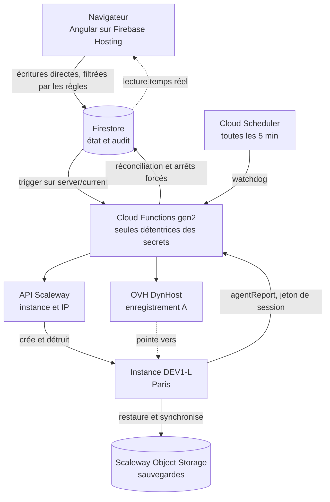
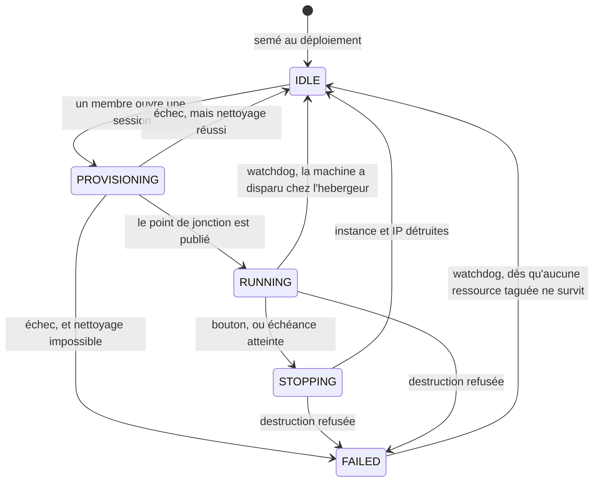

# Beacon — serveurs de jeu à la demande

Date : 2026-09-02
Statut : **validé par le commanditaire le 2026-09-03**, après quatre relectures
d'architecture (DDD et Clean Architecture) dont les corrections sont intégrées.
**Révisé le 2026-09-05** : Sunkenland rejoint le périmètre, ce que la première
rédaction excluait. La révision suit la sonde et non l'inverse — les faits qui
la fondent sont en section J de `probe/RESULTS.md`.

Vérité produit : [`PRODUCT.md`](../../../PRODUCT.md). Ce document fait autorité
sur l'architecture ; PRODUCT.md fait autorité sur les utilisateurs, le but et
les contraintes durables.

## 1. Objectif

Remplacer un serveur Enshrouded dédié facturé 7,90 €/mois en continu par une
plateforme qui conserve les sauvegardes et crée un serveur dans le cloud
uniquement pendant les sessions de jeu.

C'est ce serveur-là qui a fait naître le projet, et la référence de 7,90 €/mois
reste la sienne. La plateforme en héberge désormais deux — Sunkenland a rejoint
le périmètre le 2026-09-05 — mais un seul à la fois, et l'objectif n'a pas
changé de nature : c'est toujours le calendrier qu'on refuse de payer.

Objectifs, par ordre de priorité :

1. **Coût.** Payer les heures jouées, pas le calendrier.
2. **Souveraineté.** L'hébergement du serveur de jeu et les sauvegardes restent
   en France, chez un fournisseur français.
3. **Simplicité d'usage.** Un ami non technique doit pouvoir lancer une partie
   en un clic et savoir quand le serveur s'arrêtera.

Groupe cible : 3 à 4 joueurs simultanés, quelques soirées par mois.

## 2. Contraintes et décisions actées

| Décision | Choix | Motif |
|---|---|---|
| Périmètre v1 | **Enshrouded et Sunkenland**, un seul serveur à la fois. Le jeu se choisit à l'ouverture de la session, par n'importe quel membre | **Décision révisée le 2026-09-05**, la première disait « Enshrouded uniquement ». Le commanditaire joue au second et le veut. La frontière que la première rédaction gardait ouverte est donc payée maintenant, et elle coûte moins cher que prévu : `libs/session` n'apprend qu'un identifiant de jeu, tout le technique reste dans l'adapter. Le choix à l'ouverture plutôt qu'en réglage d'admin suit le principe « personne n'est jamais bloqué » — celui qui lance la soirée décide à quoi on joue. |
| Cycle de vie | Démarrage manuel, échéance explicite | Une échéance supprime le besoin de détecter la présence des joueurs, qui était le composant le plus risqué du système. |
| Durée de session | 4 h par défaut | Choix du commanditaire. |
| Prolongation | +1 h, illimitée, seulement dans les 30 dernières minutes | Le garde-fou n'est pas une durée maximale mais l'obligation qu'un humain éveillé reclique : une machine oubliée s'arrête toujours dans l'heure. |
| Hébergement du jeu | Scaleway, région `fr-par` (Paris) | **Décision révisée le 2026-09-03**, la première portait sur OVH. Scaleway sait étiqueter l'instance **et** l'IP flottante, et les filtrer par étiquette ; l'API OVH v1 ne sait ni l'un ni l'autre, et toute la réconciliation du §5 en dépend. Français, et moins cher depuis la hausse OVH du 1er octobre 2026. Le pourquoi du renversement est plus bas. |
| Plan de contrôle | Firebase | Choix du commanditaire ; le free tier couvre entièrement l'usage. La contrainte France ne s'applique pas à l'app de gestion. |
| Frontière front / Functions | Le navigateur écrit directement dans Firestore ; une Function n'existe que là où un secret est indispensable | Choix du commanditaire. Interdire l'écriture au client ne protégeait rien — il n'a de toute façon aucun identifiant d'hébergeur — et ajoutait une couche de callables à maintenir. |
| Rôle des règles Firestore | Sécurité seule : identité, appartenance, rôle, propriété des champs. Aucune règle métier | Choix du commanditaire. Réécrire les durées et les transitions en langage de règles aurait dupliqué `libs/session` dans un second langage, avec une divergence garantie à terme. Le contrôle métier côté serveur est assuré par le watchdog, qui rejoue le même code. |
| Modèle de domaine | Un seul contexte délimité, `session`, dont `saves` est un module support. `libs/session` est un **noyau de décision partagé** : le navigateur et les Functions y calculent, le watchdog seul y fait autorité | La valeur du projet tient entièrement dans la session et son échéance ; la structure doit le dire plutôt que de ranger le code par couche. Parler d'un agrégat qui « porte ses invariants » aurait menti sur le mécanisme : ce code tourne aussi dans un navigateur qu'on ne contrôle pas. Où chaque invariant tient réellement est dit au §4. |
| Nom du produit | **Beacon** — app sur `beacon.charlouze.com`, serveurs de jeu sur `<jeu>.beacon.charlouze.com` | Un feu qu'on allume pour appeler les autres, éteint après : le nom raconte l'acte social plutôt que la machine. La forme du domaine accueille un deuxième jeu sans rien renommer. |
| Langue | Code et interface en anglais ; spec et documentation en français | L'expert du domaine lit lui-même le TypeScript, donc il n'y a pas de fossé de traduction à combler. Le glossaire de §4 fait le pont, et tout terme visible dans l'interface doit y figurer. |
| Stockage des saves | Scaleway Object Storage, `fr-par` | Français, même région que l'instance, donc transferts internes. C'est cette justification qui l'a fait suivre l'instance : laissé chez OVH, il devenait un transfert entre fournisseurs. Du S3 dans les deux cas, l'adapter ne change que d'endpoint. |
| Fichiers du serveur | **Selon le jeu.** Enshrouded : téléchargés par SteamCMD à chaque démarrage. Sunkenland : déposés une fois dans le stockage objet, restaurés comme une sauvegarde | Le téléchargement à chaud évite ~8 Go de stockage permanent, et reste le bon choix tant que SteamCMD se connecte anonymement. **Le serveur dédié de Sunkenland exige un compte qui possède le jeu** — mesuré, `Missing configuration` en anonyme, et le manuel de l'éditeur le disait avant nous. Le télécharger à chaud imposerait un secret Steam sur la VM, que le §7 tient pour l'élément le moins fiable du système. Ses 2,3 Go passent donc par le seau, même région, par le chemin que `SaveStore` construit déjà. Une image privée sur un registre a été écartée sur le coût : 0,50 $/Go de transfert sortant chez GitHub, soit ~10 $/mois pour huit soirées — davantage que le serveur dédié qu'on remplace. |
| Amorçage d'un monde Sunkenland | Créé dans le client par un joueur, déposé une fois dans le seau par un administrateur, hors interface | Le serveur dédié **ne sait pas créer un monde** : sans un `-worldGuid` qui existe déjà, il s'arrête. Deux choix se figent à cet instant et ne se rattrapent pas — le GUID, auquel les personnages des joueurs restent attachés, et le nom du dossier, qui est ce que les joueurs lisent dans la liste des serveurs et donc leur recours si l'identifiant se perd. C'est le même geste hors interface que la restauration d'une ancienne sauvegarde (§13). |
| Dépôt des fichiers de jeu | Une commande d'administration, `tools/game-depot`, à trois gestes : `push`, `pull`, `purge` | Le dépôt, le rafraîchissement et la purge sont le même besoin vu à trois moments ; en faire trois scripts aurait multiplié les endroits où l'on peut se tromper de préfixe. **Elle ne connaît pas le préfixe des sauvegardes** — pas par prudence, par construction : la seule protection qui tienne contre l'effacement du seul actif irremplaçable du système est de ne pas lui donner l'adresse. La purge ne se justifie pas par l'économie, trois centimes par mois ; elle existe parce qu'un dépôt qu'on ne sait pas vider finit par être vidé à la main, dans une console, un soir. |
| Mise à jour du jeu Sunkenland | `tools/game-depot push`, lancée à la main par un administrateur. **La dérive est acceptée en v1** | Rafraîchir le dépôt demande le compte Steam, qui ne réside que sur la machine de l'administrateur (§7) ; l'automatiser reviendrait à le confier à un runner ou à une VM. Les clients se mettent à jour seuls, le dépôt non, et le décalage se découvre en tentant de rejoindre — le coût direct est une heure facturée et un quart d'heure de rafraîchissement. Ce qu'on accepte réellement n'est pas là : c'est que la corvée ne peut être faite que par qui détient le compte, ce qui rouvre une dépendance à l'administrateur que le produit refuse partout ailleurs. Assumé pour une v1, à rouvrir si ça mord. |
| DNS | OVH DynHost sur `enshrouded.beacon.charlouze.com`. **Rien pour Sunkenland** | Gratuit, inclus au domaine déjà possédé, et prévu exactement pour cet usage. **Reste chez OVH** quand le calcul et le stockage n'y sont plus : le domaine y est, et un enregistrement A pointe où l'on veut. Ce n'est pas un oubli de la bascule. En revanche **on ne rejoint pas un serveur Sunkenland par une adresse** — ni nom ni IP, le client ne propose que l'identifiant de serveur — donc `DnsUpdater` n'est pas appelé pour ce jeu. Un port n'a pas de sous-domaine à porter. |
| Conteneur du jeu | Enshrouded : `mornedhels/enshrouded-server`, telle quelle. Sunkenland : `melle2/sunkenland-ds`, **mais son script de démarrage ne suffit pas** | La première gère déjà SteamCMD, Wine, supervisord, l'auto-update et des backups avec rotation ; la forker nous priverait des mises à jour amont pour un bénéfice nul. La seconde apporte Wine, Xvfb et SteamCMD, mais son script ignore les options dont Beacon a besoin — `-autoSaveIntervalInSeconds`, `-adminSteamIDs` — et son `+login anonymous` ne peut pas fonctionner pour cette app. **La forme reste à trancher** : contribution en amont, ou image mince à nous portant le seul script. Question ouverte du §12. |
| Cadence de sauvegarde Sunkenland | `-autoSaveIntervalInSeconds 300` | **Rien ne permet à Beacon de provoquer une sauvegarde** : ni l'arrêt du conteneur, ni un `WM_CLOSE` poli, ni la déconnexion du dernier joueur. Mesuré six fois. Le seul levier est la cadence, et elle est réglable par une option que le manuel de l'éditeur ne mentionne pas. À 300 s, on perd au plus cinq minutes de jeu, ce que le §3 accepte déjà pour un crash. Le jeu ne garde que dix instantanés glissants, donc l'intervalle fixe aussi la profondeur d'historique sur la machine — 50 minutes ici ; la profondeur réelle vit dans le stockage objet. |
| Rôle d'administrateur dans le jeu | **Tous les membres**, via `-adminSteamIDs` | Le SteamID est demandé au membre à son premier passage dans l'app et rangé dans son profil. « La ressource est commune » : donner le rôle à tous suit le même principe que « n'importe qui démarre, prolonge et arrête ». Un admin du jeu peut déclencher une sauvegarde depuis la console, ce qui rend le pire cas meilleur que les 300 s pour qui y pense. Contrepartie assumée : il peut aussi exclure un autre joueur, ce qui est la seule autorité d'un membre sur un autre dans tout le système. |
| Conteneur compagnon | Image maison minimale (`rclone` + `curl`) | Restaure la save au démarrage, pousse les backups vers le stockage objet, dialogue avec le plan de contrôle. C'est la seule image que nous construisons. |
| Zone | `fr-par-1` | **Le catalogue n'est pas le même d'une zone à l'autre**, et c'est mesuré, pas supposé (`probe/RESULTS.md`, section T). `fr-par-1` est la seule des trois zones parisiennes à porter le gabarit retenu, aux meilleurs prix de la région. Ce n'était pas une décision : c'était une valeur par défaut posée sans vérifier, jusqu'à ce que la sonde montre qu'elle portait quelque chose. |
| Gabarit d'instance | **Libre**, sélecteur réservé à l'admin. `DEV1-L` (4 vCPU / 8 Gio, 80 Go locaux) en v1, **~0,0495 €/h disque compris** | Enshrouded brûle 2,6 cœurs **sans personne connecté** — mesuré — donc un calibre à 2 vCPU serait saturé avant le premier joueur, et 8 Gio est le plancher mémoire. `DEV1-L` est aussi, au 2026-09-03, le seul calibre à 8 Gio de la zone à la fois disponible et livré avec un disque local. **Son prix catalogue de 0,04284 €/h ne comprend pas ce disque** : les 80 Go se facturent à part, ~0,0067 €/h, ce que la facture réelle a montré et que le catalogue ne dit pas. |
| Modes de stockage | **Les deux**, disque local et volume bloc | Le gabarit ne serait pas vraiment libre si le système n'acceptait qu'une famille : à 8 Gio, tout calibre autre que `DEV1-L` demande un volume bloc attaché. La différence n'est d'ailleurs pas tarifaire — **aucun disque n'est compris dans un prix d'instance chez Scaleway**, local ou bloc — mais structurelle : un volume local naît et meurt avec son instance, un volume bloc est une ressource indépendante à créer, réconcilier et détruire. Le coût est contenu par le §4 : `ServerHost` ouvre et ferme *un serveur*, pas des ressources, et la fermeture se dit par le tag. **La v1 n'implémente que le disque local.** |

### Fournisseurs écartés, et pourquoi

**GCP pour le serveur de jeu.** Enshrouded consomme environ 2 Mbit/s d'upload
par joueur, soit ~14 Go sortants pour une session de 4 h à 4 joueurs. GCP
facturant l'egress, cela représente ~1,10 € par session, soit ~9 €/mois pour
huit sessions — plus cher que la solution qu'on remplace. OVH et Scaleway ne
facturent pas le trafic sortant, ce qui élimine le problème.

**OVH, écarté le 2026-09-03 après avoir été retenu.** La conception l'avait
choisi sur le prix, et écarté Scaleway pour ~1,25 €/mois d'écart en notant qu'il
resterait « le repli naturel si l'API OpenStack d'OVH s'avère pénible ». La
tranche 0 a mesuré les deux termes, et les deux sont tombés.

*Le tag.* `cloud.ProjectInstanceCreation` et `cloud.project.FloatingIp` n'ont
aucun champ de métadonnée, et aucun chemin de l'API v1 n'en porte. Même si un
`POST` acceptait un champ non documenté, **aucun modèle de lecture ne le
rendrait** : le mécanisme du §5 a besoin de *retrouver* le tag, pas de l'écrire.
Restait OpenStack, donc une seconde API et une seconde authentification par
jeton Keystone en plus de l'API v1 qu'il faut garder pour les gabarits. Chez
Scaleway, `tags` est un champ natif du serveur *et* de l'IP flottante, mutable,
et les listes se filtrent dessus côté serveur.

*Le prix.* Au 1er octobre 2026, OVH sort l'IPv4 et le stockage local du prix de
base : le `b3-8` passe de 37 à 45 €/mois, soit ~0,0616 €/h tout compris. Le
`DEV1-L` retenu revient à ~0,0495 €/h, disque compris. L'écart s'est non seulement
effacé, il s'est inversé.

Le détail des mesures est dans [`probe/RESULTS.md`](../../../probe/RESULTS.md),
sections T et D. Le domaine et son DynHost restent chez OVH : c'est un
enregistrement A, il pointe où l'on veut.

**Les hébergeurs non français ne sont pas comparés**, parce que la souveraineté
est une contrainte du commanditaire et non un critère à optimiser. La question
s'est posée le 2026-09-04 ; voici ce qu'elle a donné, pour ne pas la refaire.

Le candidat serait **Hetzner**. Son `CPX31` — 4 vCPU, 8 Go, **160 Go de NVMe
inclus**, zones Falkenstein, Nuremberg et Helsinki — est plus généreux que le
`DEV1-L` retenu, et son API a des `label_selector` avec un vrai langage
d'expression : y sélectionner par la seule présence d'une clé est possible, ce
qui **rendrait le schéma à deux tags du §5 inutile**. Sur les trois points qui
ont occupé la tranche 0 — prix, disque, réconciliation — il serait
techniquement meilleur.

**Et il est plus cher, relevé à la source le 2026-09-04 : 0,1211 €/h**, contre
~0,0495 €/h pour le `DEV1-L` disque compris. **Deux fois et demie le prix.** Sur
quarante heures facturées par mois, 4,84 € contre 1,98 €.

C'est l'inverse de ce que laissaient croire les agrégateurs tiers, qui
annonçaient 16,49 €/mois — des chiffres d'avant la hausse Hetzner de juin 2026.

Le catalogue affiche bien un `CX33` à **0,0173 €/h** pour les mêmes 4 vCPU et
8 Go, soit trois fois moins que Scaleway. Il est marqué **indisponible**. C'est
le second fournisseur de la journée à afficher un tarif alléchant sur un type
qu'on ne peut pas commander, après la famille `BASIC1` de Scaleway : **un prix
au catalogue n'est une option que si le type est disponible**, et les deux
informations ne se lisent pas au même endroit.

Enfin, les gammes ARM — les moins chères chez tous les fournisseurs — sont
**exclues par construction** : le serveur Enshrouded est un binaire Windows
x86-64 exécuté sous Wine, et l'image amont est `x86_64`. Aucune comparaison
future n'a besoin de les examiner. Le second jeu n'a pas rouvert la question —
le serveur dédié de Sunkenland est lui aussi un binaire Windows sous Wine, et
son image amont force `sSteamCmdForcePlatformType windows`.

L'explication tient au modèle : un tarif horaire élevé plafonné par un forfait
mensuel avantage ce qui tourne en permanence. **C'est exactement le contraire de
ce produit**, qui paie à l'heure une quarantaine d'heures par mois et
n'approchera jamais le plafond. Hetzner est optimisé pour la chose qu'on
remplace.

**La souveraineté ne coûte donc rien ici** — elle rapporte. La question est
close, et pas par principe : par la mesure. Elle ne mérite d'être rouverte que
si Scaleway déçoit, et il faudra alors comparer sur un usage horaire et non sur
des forfaits mensuels.

Lever la souveraineté rouvrirait en revanche Cloudflare R2 pour les saves, juste
en dessous — un poste bien plus petit, et le seul où le calcul reste favorable.

**Cloudflare R2 pour les saves.** 10 Go gratuits en permanence et egress gratuit
illimité, donc le meilleur choix économique, mais Cloudflare est une société
américaine et les saves sont des données de jeu couvertes par la contrainte
de souveraineté.

### État de l'art

Trois familles de solutions existantes ont été examinées avant de décider de
construire. Aucune ne couvre le besoin, mais deux fournissent des briques qu'on
réutilise plutôt que de les réécrire.

**Les panels de gestion de serveurs de jeu** — Pterodactyl, son fork Pelican,
GameAP, FeatherPanel. Matures et open source, mais conçus pour piloter des
serveurs sur des machines allumées en permanence. Ils ne provisionnent ni ne
détruisent d'instance cloud. Dans notre architecture ils occuperaient la place
du conteneur, pas celle du plan de contrôle.

**L'hébergement facturé à l'heure** — ServerFlex est le seul hébergeur identifié
à proposer du pay-hourly multi-jeux, ce qui aurait été le besoin acheté plutôt
que construit. Vérifié auprès d'eux le 2026-09-02 : ni Enshrouded parmi les jeux
supportés, ni aucune formule à la consommation applicable. Piste close.

**Les projets Terraform de serveur de jeu à la demande** — il en existe pour
Palworld, CS:GO, Valheim. Ils créent et détruisent correctement, mais via
`terraform apply` en ligne de commande, sans interface ni échéance. Ils servent
de référence pour le `cloud-init`, pas de remplacement.

Conclusion : la valeur de ce projet réside entièrement dans l'interface
libre-service et l'échéance automatique. Tout le reste — conteneur du jeu,
cycle de vie de la VM, authentification, hébergement web — est emprunté.

Cet état de l'art repose sur une recherche limitée et mérite d'être refait si le
projet est repris plus tard.

## 3. Contrainte structurante : l'instance doit être détruite, pas éteinte

**Il n'existe pas d'état arrêté à coût nul.** Une machine éteinte mais conservée
garde son volume et son IP flottante, tous deux facturés tant qu'ils existent —
et chez certains fournisseurs le calcul lui-même continue de l'être.

C'est la prémisse dont dépend tout ce qui suit, et elle est énoncée sous cette
forme à dessein. La première version disait « une instance arrêtée continue
d'être facturée », ce qui était vrai chez OVH et **ne l'est probablement pas
chez Scaleway**, où l'extinction arrête la facturation du calcul. La conclusion
survit à la nuance, la formulation d'origine non : ce qui porte l'architecture
n'est pas que l'arrêt coûte le prix plein, c'est qu'il coûte quelque chose sans
rien rendre.

Le détail est documenté par Scaleway : *« any attached storage or flexible IPv4s
continue to be billed even when powered off »*. Éteindre arrête le calcul et
**laisse courir le disque et l'adresse**. La conclusion tient donc, et par le
mécanisme annoncé : l'état « éteint mais conservé » coûte, sans rien rendre.

**Et l'heure entamée est due.** Les instances CPU se facturent à l'heure
d'*uptime*, minimum 60 minutes, **chaque ressource comptée séparément** —
l'instance, son disque, son IP. Une session ratée au bout de cinq minutes coûte
donc une heure pleine sur les trois lignes, et non cinq minutes. C'est une raison
de plus de détruire vite plutôt que d'attendre : ce qui traîne se paie à l'heure
ronde.

Toute l'architecture en découle : la machine est strictement jetable, rien de
précieux n'y réside plus de quelques minutes, et le composant le plus critique
du système pour le budget est le processus qui garantit la destruction.

## 4. Architecture



**Le front écrit directement dans Firestore.** La frontière n'est pas « client
contre serveur » mais « ce qui exige un secret contre ce qui n'en exige pas ».
Interdire l'écriture au navigateur ne protégeait rien : il ne possède aucun
identifiant d'hébergeur et ne peut donc pas créer de machine, quoi qu'il écrive. Tout
ce qui ne demande ni identifiant cloud ni jeton d'agent est joué depuis le
navigateur, sous le contrôle des règles de sécurité Firestore. Le front
s'abonne par ailleurs en temps réel à l'état, donc le compte à rebours et les
changements d'état s'affichent simultanément chez tout le monde sans polling.

| Écriture | Auteur | Motif |
|---|---|---|
| Demander le démarrage (`IDLE` → `PROVISIONING`) | Navigateur | Aucun secret requis. Le verrou anti-double-clic est la transaction Firestore elle-même : lire l'état et écrire dans la même transaction. |
| Prolonger l'échéance | Navigateur | Aucun secret requis. Le calcul vient de `libs/session`. |
| Demander l'arrêt (`RUNNING` → `STOPPING`) | Navigateur | Aucun secret requis. |
| `config/settings`, `members/{uid}` | Navigateur (admin) | Les règles vérifient `role == 'admin'`. |
| `events/{id}` | Navigateur et Functions, en création seule | Journal d'audit ; les règles interdisent modification et suppression. |
| Créer et détruire l'instance et l'IP | Function | Clé secrète Scaleway. |
| Mettre à jour DynHost | Function | Identifiants DynHost, chez OVH. |
| `instanceId`, `ipId`, `ip`, et `agentTokens/{sessionId}` | Function | Valeurs que le client ne doit ni connaître ni forger. |
| `provisioning/{sessionId}`, `health/watchdog` | Function | Comptabilité interne : l'intention de création taguée, le battement de cœur et les volumes orphelins déjà signalés. Aucun client n'y lit ni n'y écrit. |
| `saves/{id}` | Function, via `agentReport` | La VM n'a pas d'identité Firebase. |
| Arrêts forcés et réconciliation | Function, via le watchdog | Clé secrète Scaleway. |

### Ce que les règles Firestore font, et ce qu'elles ne font pas

**Les règles sont de la sécurité, pas du code métier.** Elles répondent à *qui
peut toucher quoi* : l'auteur est-il authentifié, est-il membre, est-il admin,
écrit-il un champ dont il est propriétaire, n'efface-t-il pas une entrée
d'audit, et la valeur est-elle bien formée — `startedAt == request.time`
interdit l'antidatage, les types sont contrôlés, les chaînes bornées. Elles ne
répondent jamais à *combien de temps* ni à *dans quelle fenêtre* : aucune
arithmétique d'échéance, aucune lecture de `config/settings` depuis les règles,
aucune table de transitions légales.

La règle métier vit à un seul endroit, en TypeScript, dans `libs/session`.
Écrire la fenêtre de prolongation une seconde fois en langage de règles
Firestore n'aurait pas rendu le système plus sûr — les deux copies auraient
divergé, et l'interface aurait fini par proposer un bouton que la base refuse.

Le garde-fou de dernier recours n'est donc pas les règles mais le watchdog, qui
détient les secrets et rejoue le même `libs/session` sur ce qui a réellement été
écrit. C'est aussi le bon endroit : les rares écritures qui coûtent de l'argent
ne sont pas accessibles au navigateur — il demande, une Function décide. Où
chaque invariant tient exactement, et en combien de temps, est dit plus bas.

### Structure du monorepo

```
apps/
  web/                 Angular, déployé sur Firebase Hosting
  functions/           Firebase Functions gen2, TypeScript
libs/
  session/             CŒUR DE MÉTIER. Session, Deadline, SessionState,
                       événements de domaine. Ports ServerHost, DnsUpdater,
                       Clock, SaveStore. Ne connaît ni Firestore ni l'hébergeur
    saves/             module support : Save, plancher de taille
  session-record/      ACL Firestore du contexte session : server/current,
                       config/settings, events. Deux faces, client et admin
  membership-record/   ACL Firestore de members/. Ni libs/session ni apps/web
                       ne voient Firestore : tout passe par un module *-record
  agent-protocol/      format de fil entre la VM et le plan de contrôle —
                       une ACL, pas du métier
  scaleway-compute/    adapter ServerHost   -> API Instance Scaleway
  scaleway-storage/    adapter SaveStore    -> Object Storage (S3)
  ovh-dns/             adapter DnsUpdater   -> DynHost
deploy/
  cloud-init/          génère le docker-compose.yml de l'instance
    games/             catalogue par jeu : image, ports, variables, options de
                       ligne de commande, chemin des sauvegardes dans le conteneur
  companion/           image compagnon (rclone + curl) -> ghcr.io
tools/
  game-depot/          commande d'administration : push, pull, purge des
                       fichiers de jeu dans le seau. NE CONNAÎT PAS le préfixe
                       des sauvegardes, et c'est sa principale caractéristique
firestore.rules        autorisations du front — sécurité seule, testée par ses refus
firestore.indexes.json
```

Aucune image de serveur de jeu n'est construite : `mornedhels/enshrouded-server`
et `melle2/sunkenland-ds` sont consommées telles quelles — sous réserve, pour la
seconde, de la question ouverte du §12 sur son script de démarrage. La seule
image maison est le compagnon, qui reste minimal.

**`libs/session` ne connaît des jeux que leur identifiant.** Le catalogue
`deploy/cloud-init/games/` est le seul endroit du dépôt qui sait qu'un serveur
Sunkenland écoute en UDP ou que son monde vit dans un dossier `Worlds`. Un numéro
de port n'a rien à faire dans un modèle qui parle de sessions et d'échéances,
et c'est la même frontière que celle du gabarit d'instance : le mot du
fournisseur s'arrête à l'adapter.

### Le modèle de domaine

Un seul contexte délimité : **`session`**. C'est là que réside toute la valeur
du projet : une partie s'ouvre, porte une échéance, se prolonge, se termine.
Tout le reste — provisionner une VM, télécharger un jeu, pointer un DNS — est
générique et emprunté.

`Session` est la racine, identifiée par `sessionId` :

| Membre | Nature | Rôle |
|---|---|---|
| `Session` | racine | seule porte d'entrée ; expose `extend(clock)`, `requestStop()`, `displayedDeadline(clock)`, `estimatedCost(tariff)` |
| `Deadline` | objet valeur | immuable ; sait dire `isWithinExtensionWindow(clock)` et produire la suivante |
| `SessionState` | objet valeur | `Idle`, `Provisioning`, `Running`, `Stopping`, `Failed` et les transitions légales |
| `Game` | objet valeur | quel jeu la session ouvre : `enshrouded` ou `sunkenland`. **Rien d'autre** — ni image, ni port, ni chemin de sauvegarde |
| `JoinInfo` | objet valeur | ce que le joueur copie pour rejoindre. Le domaine ne l'interprète jamais ; il sait seulement s'il existe |

`Session` ne voit jamais les champs réservés de `server/current`
(`instanceId`, `ipId`, `ip`, `provisionClaimedAt`, `lastError`) : ce sont des
faits d'infrastructure, que seul le watchdog confronte à ce que déclare
`ServerHost`. `joinInfo` est réservé lui aussi, mais **en écriture seule** :
c'est le seul que le domaine transporte, et `ServerFacts` dit pourquoi. La
traduction du document vers le modèle est le travail de `libs/session-record`,
décrit plus bas.

**Le jeu se fige à l'ouverture.** `game` est écrit avec le passage à
`PROVISIONING` et ne change plus jusqu'à la destruction. C'est un invariant et
non une commodité : le monde restauré, le conteneur lancé et le point de
jonction publié en dépendent tous, et il n'existe aucun geste qui puisse changer
de jeu sans détruire la machine — ce qui est précisément une nouvelle session.

**`JoinInfo` est du vocabulaire de domaine, pas un détail d'infrastructure**, et
c'est le second jeu qui l'a révélé. Tant qu'il n'y en avait qu'un, « rejoindre »
s'écrivait `ip` et personne ne voyait la confusion. Les deux jeux ne se
rejoignent pas de la même façon : Enshrouded par un nom de domaine, une IP brute
et un port ; Sunkenland par un identifiant de serveur, une région et le nom du
monde dans la liste — **jamais par une adresse**. Ce qu'ils ont en commun n'est
pas une adresse, c'est *ce que le joueur copie*, et c'est ce que le glossaire
doit nommer.

Le domaine n'interprète aucun de ces champs : il les transporte et l'interface
les affiche. Chaque jeu apporte sa forme, et **ajouter un jeu ajoute une forme**
— coût honnête, visible, préférable à une liste d'étiquettes et de valeurs qui
n'aurait fait que déplacer le problème dans l'écran.

Les deux formes partagent une propriété que `PRODUCT.md` exigeait déjà pour
Enshrouded : **un moyen principal et un recours.** L'IP brute quand le DNS
tombe ; le nom du monde dans la liste des serveurs quand l'identifiant se perd.
Ce n'était pas une lubie du commanditaire, c'était la bonne intuition.

**`RUNNING` veut dire « le point de jonction est publié ».** C'est la définition
qui unifie les deux jeux au lieu de les séparer : pour Enshrouded la Function
connaît le point de jonction dès que l'IP est réservée, pour Sunkenland l'agent
seul le découvre et le rapporte. Même règle, deux sources. La définition
concurrente — « la machine répond » — ferait afficher un serveur en service que
personne ne peut rejoindre.

**`saves` — module support, pas contexte.** Aucun terme n'y change de sens par
rapport à `session`, son modèle tient en une ligne de métadonnées, et sa règle
d'or ne s'y applique pas : les sauvegardes ne s'écrivent physiquement que dans
le compagnon, sur la VM. En faire un contexte délimité aurait créé une frontière
à entretenir sans modèle derrière. C'est un module de `session`, qui garde son
port `SaveStore` — celui-là gagne sa place.

Où la règle d'or s'applique réellement est dit au §8 : dans le compagnon
d'abord, dans `agentReport` ensuite. `libs/session/saves` ne porte que le
plancher de taille — l'élagage des anciennes versions est une règle de cycle de
vie du bucket, jamais du code.

**Les événements sont des faits au passé** — `SessionStarted`,
`SessionExtended`, `SessionStopRequested`, `SessionStopped`, `DeadlineClamped`,
`ProvisioningFailed`, `CleanupFailed`, `SessionReclaimed`, `ResourceStranded`.

Deux d'entre eux se ressemblent et ne disent pas la même chose.
`SessionStopRequested` est écrit par le navigateur, dans la même écriture que le
passage à `STOPPING` : c'est le seul endroit qui garde **qui** a demandé
l'arrêt, sans quoi couper la soirée d'un autre serait le seul geste anonyme du
système. `SessionStopped` est écrit par la Function au passage à `IDLE`, quand
la machine est réellement détruite, et c'est lui qui porte le coût de la
session (§11).

**Trois événements peuvent porter un `sessionId` nul, et ce sont les seuls.**
`SessionReclaimed` quand la ressource détruite portait le tag d'appartenance
sans tag de session : elle n'appartient à aucune session — c'est même ce qui la
condamne — mais sa destruction engage de l'argent et doit se lire dans l'audit.
`ResourceStranded` à l'apparition d'un volume détaché qui ne peut être rattaché
à personne — le seul des trois dont le sujet soit *toujours* nul : là, rien
n'est détruit, et le signalement *est* toute l'action. Ce qui est orphelin à
l'instant se lit dans `health/watchdog`, jamais dans le journal — un fait au
passé ne se réécrit pas toutes les cinq minutes (§5). `CleanupFailed` peut lui
aussi n'avoir aucun sujet, pour la même raison que le premier. Un événement dont
l'acteur est le système et le sujet « ce que personne ne réclamait » est plus
honnête qu'un `sessionId` inventé pour remplir la colonne.

`events` est un **journal d'audit**, et rien d'autre. Aucun code ne s'y abonne :
le seul déclencheur du système est le trigger sur `server/current`. Prétendre
que la collection sert aussi de découplage aurait décrit une architecture qui
n'existe pas.

Les noms sont en anglais, alors que la langue métier de ce projet est le
français. C'est un écart assumé au principe de langue omniprésente : ici
l'expert du domaine lit lui-même le TypeScript, donc il n'y a pas de fossé de
traduction à combler, et un vocabulaire unique évite de mêler deux langues dans
une même ligne. L'interface étant elle aussi en anglais, la colonne du milieu
porte le nom de code et, quand il en diffère, le libellé que les joueurs lisent
réellement ; la colonne de gauche ne sert qu'à ce spec et aux discussions. Ce
glossaire est la langue omniprésente :

| Métier (français) | Code (anglais) | Ce que c'est |
|---|---|---|
| session | `Session` | une partie ouverte, de son démarrage à sa destruction |
| échéance, *affichée* « heure de fermeture » | `Deadline`, libellé `Closing time` | l'instant auquel le serveur s'arrête |
| prolongation | `extend()` | repousser l'échéance d'un pas, dans la fenêtre |
| fenêtre de prolongation | `extensionWindow` | les 30 dernières minutes, seul moment où prolonger est possible |
| gabarit | `InstanceSize` | le calibre de la machine, `DEV1-L` par défaut. Le mot du fournisseur — `flavor` chez OpenStack, *commercial type* chez Scaleway — s'arrête à l'adapter et n'entre pas dans `session` |
| sauvegarde | `Save` | un état du monde de jeu déposé dans le stockage objet |
| jeu | `Game` | le jeu qu'une session ouvre, `enshrouded` ou `sunkenland` ; figé à l'ouverture |
| point de jonction, *affiché* « comment rejoindre » | `JoinInfo`, libellé `How to join` | ce que le joueur copie pour rejoindre. Nom de domaine, IP brute et port pour Enshrouded ; identifiant de serveur, région et nom du monde pour Sunkenland |
| identifiant Steam | `steamId` | le compte Steam d'un membre, demandé à son premier passage dans l'app. Sert à lui donner le rôle d'administrateur **dans le jeu**, à ne pas confondre avec le rôle `admin` de Beacon |
| membre | `Member` | une personne autorisée, `player` ou `admin` |
| l'ouvrant | `startedBy` | le membre qui a lancé la session |
| hors service | `Idle` | aucune machine ; on peut ouvrir une session |
| en préparation | `Provisioning` | la machine naît ; l'heure de disponibilité est annoncée |
| en service | `Running` | le point de jonction est publié, l'échéance court |
| en fermeture | `Stopping` | la save part, la machine va être détruite |
| bloqué | `Failed` | le nettoyage n'a pas pu être garanti ; le watchdog y revient |
| réclamation | `Reclamation` | la décision de détruire ce qu'une session ne peut plus justifier : aucune intention ouverte, un délai d'état dépassé, ou un nettoyage à retenter |
| remise d'équerre | `reconcile()` | ramener `server/current` à ce que le fournisseur déclare réellement |
| volume orphelin | `ResourceStranded` | un disque détaché dont aucun tag ne dit l'origine : signalé à son apparition, jamais détruit |

Tout terme apparaissant dans l'interface doit figurer dans ce tableau. Un mot
qu'on peine à nommer dans les deux colonnes est le signe que le modèle est
faux, pas que la traduction est difficile.

**La colonne du milieu porte aussi le libellé affiché** quand il diffère du nom
de code : les joueurs lisent « Closing time », le code manipule `Deadline`.
Échéance et heure de fermeture sont donc le même terme, le second habillant le
premier — deux mots pour une chose ne sont tolérés qu'à cette condition. Les
maquettes de `.impeccable/mocks/` affichent du texte français : contenu
provisoire, à traduire à l'implémentation.

### Les ports

Le front est le principal consommateur du domaine : il l'interroge pour savoir
quelle transition proposer et quelle échéance écrire, puis il écrit. Les
Functions consomment le même noyau pour ce qu'elles décident seules —
provisionnement, arrêt forcé, réconciliation. Le calcul n'existe donc qu'une
fois : c'est ce qui permet aux règles Firestore de rester de la sécurité.

Quatre ports constituent les seules frontières vers l'extérieur. Chacun est
déclaré par le contexte qui s'en sert, jamais par l'infrastructure qui
l'implémente :

| Port | Déclaré dans | Rôle |
|---|---|---|
| `ServerHost` | `session` | ouvrir, fermer et décrire **un serveur de jeu**, désigné par le tag de sa session |
| `DnsUpdater` | `session` | pointer un enregistrement A vers une IP |
| `Clock` | `session` | fournir l'instant courant |
| `SaveStore` | `session`, module `saves` | lister, lire, écrire les sauvegardes |

`Clock` est un port parce que tout le système tourne autour d'échéances :
sans lui, tester la fenêtre de prolongation demanderait d'attendre 3 h 30.

**`ServerHost` ouvre et ferme un serveur, pas des ressources.** C'est ce qui
laisse le gabarit libre. Selon le calibre choisi, ouvrir un serveur crée une
instance et une IP, ou une instance, une IP **et un volume** ; `session` n'en
sait rien et n'a pas à le savoir. Le port parle d'un serveur de jeu, l'adapter
sait combien d'objets cela représente chez le fournisseur.

**C'est aussi ce qui laisse le jeu libre.** `open()` reçoit le jeu et le
gabarit ; l'adapter va chercher dans `deploy/cloud-init/games/` quelle image
lancer, quels ports ouvrir et quelles options passer. Le second jeu n'a donc
rien coûté au port : la frontière était déjà à la bonne place, et c'est le seul
endroit de cette révision où le spec n'a pas eu à bouger.

**`DnsUpdater` n'est pas appelé pour tous les jeux.** Il ne l'est que si le point
de jonction porte une adresse — vrai pour Enshrouded, faux pour Sunkenland, où
il n'y a rien à pointer. Ce n'est pas une branche dans le domaine : `session`
demande la publication du point de jonction, et c'est l'adapter du jeu qui sait
si cela passe par un enregistrement A. Un port qu'on n'appelle pas est moins
coûteux qu'un port qu'on rend optionnel.

**Fermer se dit par le tag, jamais par une liste.** `ServerHost` détruit tout ce
qui porte `session:{sessionId}`, et c'est l'adapter qui sait descendre aux
dépendances muettes — un volume Scaleway ne porte aucune étiquette, il se
retrouve par l'instance à laquelle il est attaché, et seulement si l'instance
existe encore.

La différence n'est pas cosmétique. Si la fermeture consommait la liste des
identifiants enregistrés au §5, alors une panne entre la création d'une
ressource et son enregistrement laisserait cette ressource introuvable et
facturée. En interrogeant le fournisseur par le tag, **la destruction ne dépend
d'aucun enregistrement** : ce que le §5 note sert à décider *s'il faut*
détruire, jamais à savoir *quoi* détruire.

C'est cette séparation qui rend le gabarit configurable sans toucher au domaine.
Ajouter demain un calibre à stockage bloc coûte une branche dans
`scaleway-compute` et rien ailleurs — ni champ dans `server/current`, ni ligne
dans le watchdog, ni cas dans `libs/session`.

Les trois adapters sont les couches anticorruption vers les fournisseurs : le
modèle Scaleway, le format S3 et le protocole DynHost s'arrêtent à leur
frontière et n'entrent jamais dans `session`.

**Pourquoi trois libs et non une seule.** Le nombre n'est pas un choix : un
adapter par port. Les fusionner ne supprimerait pas les trois ports, cela
produirait un module dont les dépendances sont l'union des trois — et comme les
secrets se lient par fonction chez gen2, chaque Function porterait les trois
jeux d'identifiants alors que le watchdog n'a besoin que du calcul.

| Lib | Protocole | Identifiants |
|---|---|---|
| `scaleway-compute` | API Instance Scaleway, en-tête `X-Auth-Token` | une clé secrète |
| `scaleway-storage` | S3 | access key et secret S3 |
| `ovh-dns` | un GET HTTP sur `ovh.com/nic/update` | user et mot de passe DynHost |

Leur seul point commun serait la facture : grouper par fournisseur serait
grouper par relation commerciale, la même erreur que grouper par couche
technique sur un autre axe. Et elles n'ont pas les mêmes raisons de changer.

**C'est arrivé, et c'est la preuve.** La conception écrivait que « le repli
Scaleway ne concernerait que le calcul, et scinderait la lib unique exactement
au moment où elle est sous tension ». Le repli a eu lieu le 2026-09-03 : le
calcul a changé de fournisseur, le stockage l'a suivi pour une raison qui lui
est propre — rester dans la région de l'instance — et le DNS n'a pas bougé du
tout. Une lib unique par fournisseur aurait éclaté ; trois libs par port ont
absorbé le changement en changeant deux noms. Le découpage tient, la table
ci-dessus est le seul endroit du spec qui ait eu à bouger pour lui.

### `session-record` : la frontière avec Firestore

Firestore n'est pas derrière un port unique, parce qu'il n'est pas au bout d'un
appel : il tient cinq rôles à la fois. Ce n'est pas une raison de le déclarer
irremplaçable — tout système externe se remplace — mais une raison de savoir
d'avance ce que le remplacement coûterait.

| Rôle tenu par Firestore | Ce qu'il faudrait à la place |
|---|---|
| support de l'état | n'importe quel stockage documentaire ou relationnel |
| verrou des transactions | des transactions, que tout le monde sait faire |
| bus des triggers | une file, un *outbox*, ou un `LISTEN/NOTIFY` — à condition de garder la livraison au moins une fois, dont dépend la réclamation transactionnelle du §8 |
| canal temps réel de l'interface | WebSocket, SSE, ou du polling assumé |
| moteur d'autorisation déclaratif | le point dur, voir ci-dessous |

Les cinq se remplacent, et par le même geste : on écrit un autre adapter. Le
cinquième est seulement le plus cher. Sans règles déclaratives, l'adapter n'est
plus un client de base de données mais le client d'un service qu'il faut aussi
écrire — un service qui rejoue `libs/session` et refait les contrôles que les
règles faisaient. Le domaine ne bouge pas, l'interface non plus : même
frontière, implémentation qui traîne un déployable avec elle.

Le critère de la §2 se relirait alors « une Function là où un secret **ou une
autorisation que le stockage ne sait pas rendre** est indispensable » : le même
principe appliqué à d'autres faits, pas une décision à rouvrir.

S'appuyer aujourd'hui sur ces cinq rôles est un choix assumé pour la
simplicité, pas une dette cachée — la facture est écrite au-dessus.

**`libs/session-record` est cette frontière**, sur les trois collections qui
portent le contexte `session` : `server/current`, `config/settings` et `events`.
Le journal en fait partie — `SessionStarted`, `SessionExtended` et
`SessionStopped` sont les événements de cette session, pas ceux d'un autre
domaine.

Il ne traduit donc pas seulement `server/current` vers `Session` et retour ; il
porte les opérations :

- sur l'état — lire, s'abonner, ouvrir une session en transaction, prolonger,
  demander l'arrêt, réclamer le provisionnement, poser les champs réservés,
  clamper, remettre d'équerre ;
- sur les réglages — lire, s'abonner (c'est par là qu'arrive `rulesVersion`),
  écrire côté admin ;
- sur le journal — écrire un événement dans la même écriture groupée que l'état,
  lire les événements de la session courante (§5), totaliser le coût du mois
  (§11).

**Il a deux faces**, parce que les deux processus ne parlent pas le même
dialecte : le navigateur passe par le SDK client, les Functions et le watchdog
par `firebase-admin`. Même traduction, mêmes noms de champs, deux transports.
Sans cette symétrie, le mapping s'écrirait deux fois et divergerait — le défaut
qu'on refuse aux règles.

Les champs réservés n'entrent pas dans `Session` — `joinInfo` excepté, pour la
raison dite deux paragraphes plus bas — et elle ne voit jamais les autres.
Ceux-là ont leur propre vue, `ServerFacts` — un constat d'infrastructure et non
un modèle de domaine, dans le même document mais pas dans le même objet.

`ServerFacts` est **manipulée** par le watchdog et les Functions seuls, mais
trois de ses valeurs sont **affichées** : l'`ip`, que l'écran montre à côté du
nom de domaine, le `joinInfo`, que l'écran rend lisible et copiable (§6,
étape 8), et `lastError`, qui dit qu'une tentative précédente a échoué. La face
client en expose donc une vue en lecture seule, réduite à ces trois champs. Le
reste — `instanceId`, `ipId`, `provisionClaimedAt` — ne quitte jamais le côté
serveur, où il n'a d'ailleurs de sens que pour la réconciliation.

`joinInfo` est le seul champ réservé que le domaine transporte : réservé **en
écriture**, parce que seules les Functions et l'agent constatent qu'un serveur
est joignable, et affiché en lecture, parce que c'est exactement ce que le
joueur copie. Les deux ne se contredisent pas — c'est la même asymétrie que
`lastError`, poussée d'un cran.

**`members` n'appartient pas au contexte `session`.** C'est le registre des
personnes autorisées, et le navigateur y accède. Cet accès a sa propre ACL,
`libs/membership-record`, sœur de la précédente et de même facture — pas une
Function, le §5 dit pourquoi. Sa liste fermée : lire son propre rôle, lister les
membres (admin), ajouter, changer le rôle, retirer.

**Retirer, c'est supprimer le document** — pas poser un rôle « inactif ». Un
registre où l'appartenance se lit par la présence n'a qu'un seul état à tester,
et les règles comme leurs refus s'écrivent sur cette base. Le jour où il faudrait
garder une trace des départs, elle irait dans `events`, pas dans `members`.

La clôture qui rend tout cela vérifiable **ne prétend pas couvrir le dépôt
entier**, sinon elle serait fausse dès la première Function :

> Ni `libs/session`, ni `apps/web` n'importent un SDK Firestore, ni ne nomment
> un champ d'un document. Ils passent par les modules `*-record`.

Et la règle qui empêche cette clôture de mentir, qu'il faut relire à chaque
ajout de collection : **toute collection que le navigateur touche a son module
`*-record`.** Une collection qui n'en a pas rend la clôture fausse le jour où
un écran en a besoin — et ce jour-là, c'est la clôture qu'on contourne, pas la
liste qu'on complète.

Le domaine et l'interface restent donc propres, et c'est ce qui compte : ce sont
eux qu'un changement de stockage ne doit pas toucher. `apps/functions` connaît
Firestore, et c'est son rôle — c'est le bord du système, et sa comptabilité
interne (`provisioning`, `agentTokens`, `health`) est faite de documents qui
n'existent que parce que le stockage est Firestore. Les remplacer fait partie du
remplacement de l'adapter, pas d'une reprise du métier.

Ce n'est pas pour autant un dépôt de données au sens complet : pas de
`findAll`, pas de critères, pas d'abstraction de requête. La liste des
opérations est courte et fermée, et ne s'allonge que quand un flux du §6 ou un
affichage du §5 ou du §11 l'exige. Une lecture dont l'écran a besoin et qui n'y
figure pas est un défaut de cette liste, pas une raison de contourner la
clôture.

### Où chaque invariant tient réellement

`libs/session` est un **noyau de décision partagé**, pas un gardien. Le
navigateur l'exécute pour savoir quoi proposer et quoi écrire ; les Functions
l'exécutent pour ce qu'elles décident seules ; le watchdog l'exécute pour
constater ce qui a dérivé. Le calcul n'existe qu'une fois dans le dépôt, mais
il tourne dans un processus qu'on ne contrôle pas.

Le système n'est donc pas invariant à l'écriture, il **converge**. Pour chaque
invariant, où il tient et en combien de temps :

| Invariant | Où il tient | Délai |
|---|---|---|
| Seul un membre écrit ; personne ne s'octroie `admin` ; les champs réservés sont hors de portée | règles Firestore | immédiat, incontournable |
| Une seule session naît d'un double clic | transaction Firestore du navigateur, puis réclamation transactionnelle de la Function | immédiat |
| `RUNNING` implique qu'une machine existe et que son point de jonction est publié | Functions seules — le navigateur ne peut pas écrire cet état | immédiat |
| Transition légale, pas de `IDLE` vers `STOPPING` | `libs/session` dans le navigateur — contournable | jusqu'à 5 min, puis watchdog |
| `deadline - maintenant ≤ durée de session` | `libs/session` dans le navigateur — contournable | jusqu'à 5 min, puis watchdog |
| Aucune ressource Scaleway ne survit à sa session | watchdog, par réconciliation sur le tag | jusqu'à 5 min |

Un invariant dont on sait dire où il tient et en combien de temps est protégé ;
un invariant « porté par l'agrégat » mais exécuté dans un navigateur hostile est
une phrase, pas une garantie.

**Le clampage ne doit jamais se voir.** Sans précaution, une échéance forgée
puis ramenée à la borne ferait reculer le décompte sous les yeux des joueurs,
sur un écran dont tout le principe est que l'heure de fermeture est un fait
annoncé. Le front n'affiche donc jamais `deadline` brut mais
`Session.displayedDeadline(clock)`, qui applique la même borne à la lecture :
la valeur affichée est déjà celle vers laquelle le watchdog converge.

### La dérive de version entre onglets

Le calcul n'existe qu'une fois dans le dépôt, mais il peut exister deux fois en
production : un onglet ouvert hier exécute le `libs/session` d'hier contre le
`config/settings` et le watchdog d'aujourd'hui. C'est la même divergence que
celle reprochée à une règle métier dupliquée dans les règles Firestore, décalée
dans le temps au lieu de l'être dans le langage.

Le symptôme serait le pire pour l'ami non technicien : un bouton qui marche,
puis un effet qui s'évapore. `config/settings` porte donc un champ
`rulesVersion`, auquel le front est déjà abonné en temps réel ; un écart avec la
version compilée dans le bundle force le rechargement de l'application.

**Ce champ est écrit par le déploiement, à chaque fusion**, avec la référence du
commit (§10). C'est la moitié qui compte : un `rulesVersion` posé une fois au
semis et jamais retouché rendrait le mécanisme inerte, et l'onglet d'hier ne se
rechargerait jamais. Il est réservé pour la même raison que les champs réservés
de `server/current` — un admin qui le modifierait à la main désynchroniserait
tout le monde sans le savoir.

## 5. Modèle de données

| Document | Contenu | Écrivain |
|---|---|---|
| `server/current` | champs *demandés* : `state`, `stateSince`, `sessionId`, `startedBy`, `startedAt`, `deadline`, `game` | navigateur (membre) |
| `server/current` | `instanceSize` | navigateur (admin) ; à défaut, la Function applique le gabarit de `config/settings` |
| `server/current` | champs *réservés* : `instanceId`, `ipId`, `ip`, `joinInfo`, `provisionClaimedAt`, `lastError` | Functions |
| `provisioning/{sessionId}` | `tag`, `intendedAt`, `instanceSize`, `closedAt` — nul à la création —, puis `instanceId`, `ipId`, `ip` : l'intention de création ; ni lue ni écrite par un client | Functions |
| `agentTokens/{sessionId}` | `hash`, `createdAt` — document illisible par tout client | Functions |
| `config/settings` | gabarit par défaut, durée de session, pas de prolongation, largeur de la fenêtre de prolongation, `tariffPerHour` par gabarit | navigateur (admin) |
| `config/settings` | champ *réservé* : `rulesVersion` | le déploiement, via l'Admin SDK (§10) |
| `health/watchdog` | `lastRunAt` — battement de cœur du watchdog — et `stranded`, les volumes orphelins que le dernier passage a vus | Functions |
| `members/{uid}` | `email`, `role` : `admin` \| `player` | navigateur (admin) ; jamais par le sujet lui-même |
| `members/{uid}` | `steamId` | **le sujet lui-même**, et personne d'autre — seule écriture du système qu'un membre fait sur son propre document |
| `saves/{id}` | `createdAt`, `game`, `objectKey`, `sizeBytes`, `origin` : `auto` \| `manual` \| `pre-shutdown` | Functions |
| `events/{id}` | événement de domaine : type, `sessionId`, acteur — `uid` **et nom affiché** —, horodatage, et le coût estimé sur le seul `SessionStopped` (§11) | navigateur et Functions, en création seule |

### Qui a le droit de lire

Le tableau ci-dessus ne dit que l'écriture ; la lecture est l'autre moitié, et
elle se règle document par document — les règles Firestore ne savent pas filtrer
au champ.

| Document | Lecteur |
|---|---|
| `server/current` | tout membre |
| `config/settings` | tout membre — le front en a besoin pour calculer l'échéance |
| `events/{id}` | tout membre — le cumul du mois se totalise par requête (§11) |
| `saves/{id}` | personne, hors Functions — aucun écran de la v1 ne les liste (§13) ; à ouvrir aux membres le jour où l'interface les montrera |
| `members/{uid}` | un admin, ou le sujet lui-même |
| `provisioning`, `agentTokens`, `health` | personne, hors Functions |

**Aucune lecture n'est ouverte à un authentifié non membre.** Sans cette règle,
n'importe quel compte Google lirait les adresses e-mail de `members`, l'IP d'une
machine exposée sur Internet et les coûts — sur un produit dont la liste blanche
est une contrainte produit. Le §9 la teste par ses refus, collection par
collection.

**Les sauvegardes sont cloisonnées par jeu dans le seau**, et ce n'est pas du
rangement. Deux jeux qui partageraient un préfixe finiraient par se recouvrir,
et le §3 fait de la perte d'une sauvegarde le seul échec grave du système. Le
préfixe se dérive du `game` de la session, jamais d'un nom saisi.

**`steamId` est la seule écriture d'un membre sur son propre document**, et elle
force une règle que le reste du §5 n'avait pas besoin d'écrire : le sujet peut
modifier ce champ-là et lui seul. La tentation serait d'ouvrir `members/{uid}`
en écriture au sujet ; elle lui donnerait `role`, donc l'élévation de privilège
que le §7 interdit nommément. La restriction champ par champ est mesurée
(sonde, section R) : `hasOnly(['steamId'])` suffit, et un `{steamId, role}`
coule l'écriture entière.

Un `steamId` n'est ni secret ni vérifiable — c'est un entier public que
n'importe qui peut lire sur un profil Steam. Le déclarer n'accorde donc rien :
la seule conséquence d'un identifiant erroné est de ne pas recevoir le rôle
d'administrateur dans le jeu. Il n'y a rien à usurper.

`members` est le seul document dont la lecture est plus étroite que
l'appartenance, et ce qu'on y protège est précis : **les adresses e-mail**. Les
noms, eux, circulent — l'écran nomme l'ouvrant de la session, et l'audit serait
illisible s'il ne listait que des `uid`.

C'est donc l'événement qui porte le nom. `events` enregistre déjà l'acteur de
chaque fait ; il enregistre son `uid` **et** son nom affiché, parce qu'un
journal de `uid` ne se relit pas. L'interface y lit le nom de l'ouvrant, sans
jamais toucher `members`. Écrire ce nom une seconde fois dans `server/current`
aurait dupliqué un fait déjà stocké, pour économiser une requête.

Le coût est une requête : les événements de la session courante, filtrés sur le
seul `sessionId`, dont l'écran retient le `SessionStarted`. Une égalité simple,
donc l'index automatique de Firestore suffit — aucun index composite à déclarer,
et le tri se fait sur une poignée de documents côté client. C'est la seule
dépendance de l'écran principal envers la collection d'audit, acceptable parce
que l'état et son événement partent dans la même écriture groupée, donc atomique
(§8).

**`server/current` et `config/settings` ne sont jamais créés par un client.**
Les deux sont semés au déploiement. C'est la conséquence d'un piège des règles
Firestore : la restriction champ par champ s'écrit `diff(resource.data)`, or
`resource` est nul sur une création. Un document absent que le client pourrait
créer contournerait donc d'un coup toute la propriété des champs — il suffirait
de naître `RUNNING` avec une IP inventée. `create` est refusé aux clients sur
ces deux documents, et les tests de §9 le vérifient explicitement.

**Le rôle vit dans `members/{uid}`, et nulle part ailleurs.** Les règles le
lisent par un `get()` à l'évaluation. Ce n'est pas la solution la moins chère en
lectures facturées — un *custom claim* Auth serait gratuit — mais c'est la seule
qui garde le registre des rôles à un seul endroit, et elle vaut ses deux
avantages :

- **Aucune Function.** Poser un claim exige l'Admin SDK, donc une Function pour
  un geste qui ne demande aucun secret. Un admin qui promeut quelqu'un écrit
  directement `members/{uid}`, sous le contrôle des règles — conforme à la règle
  du §2 au lieu de lui faire une exception.
- **Effet immédiat.** Un claim traîne jusqu'à l'expiration du jeton, environ une
  heure : retirer les droits de quelqu'un ne prendrait effet qu'après. Un
  document est relu à chaque évaluation.

Le coût est un `get()` par écriture protégée. À quelques dizaines d'écritures
par soirée, il est invisible dans le free tier ; si le jour venait où il ne
l'était plus, c'est le nombre de joueurs qui aurait changé, pas le raisonnement.

**Ce `get()` ne contredit pas « les règles ne font que de la sécurité ».** La
ligne ne passe pas entre lire et ne pas lire, mais entre lire pour savoir *qui
tu es* et lire pour savoir *ce qui est métier-correct*. `members` répond à la
première question, donc les règles y accèdent. `config/settings` répond à la
seconde — durées, fenêtres, gabarit par défaut — donc elles n'y touchent jamais.

**Le premier admin est semé au déploiement**, avec `server/current` et
`config/settings` (§10). `members` n'étant écrit que par un admin, il n'y aurait
sinon aucun moyen d'en obtenir un premier. Le rôle vivant en base, ce semis est
une écriture Firestore ordinaire et non plus un geste hors bande.

**Toute chaîne écrite par un client est bornée en taille**, et `events` porte un
TTL Firestore de 400 jours. Sans borne ni TTL, la collection la plus ouverte du
système serait un moyen de faire gonfler la facture — un comble sur ce projet.

La valeur du TTL n'est pas arbitraire : `events` est la seule collection qui
porte un coût estimé, donc c'est d'elle que se calcule le cumul du mois (§11).
D'où la règle générale — **le TTL d'une collection ne descend jamais sous
l'horizon de ce qu'on affiche à partir d'elle.** À quelques dizaines d'entrées
par mois, totaliser par requête ne coûte rien et évite un compteur à tenir.

**`health/watchdog` porte aussi ce qu'un passage du watchdog doit retenir pour
le suivant** : `stranded`, les volumes orphelins que son dernier balayage a vus.
Ce n'est pas dans `events` parce que personne ne détruit un volume orphelin — il
l'est donc encore au passage d'après, et à tous les autres. Un événement toutes
les cinq minutes ferait 8 600 entrées par mois là où cette collection en attend
quelques dizaines : un seul disque abandonné suffirait à faire d'elle ce que le
paragraphe ci-dessus interdit, et à noyer le journal qu'on ouvre pour comprendre
un mois. Un événement est un fait au passé (§4) ; « ce qui est orphelin
maintenant » est un état, et un état vit dans un document. Le champ est réécrit
en entier à chaque passage et jamais fusionné : un disque que l'administrateur a
fini par supprimer doit en sortir.

Le tarif horaire nécessaire à ce calcul — le `tariff` de `estimatedCost()` —
vit dans `config/settings`, par gabarit. Il ne peut pas être compilé dans le
bundle : l'hébergeur change ses prix, et un tarif faux fausserait silencieusement le
seul chiffre que l'interface affiche sur l'argent.

`server/current` est un document unique dont les champs ont deux propriétaires.
Les règles l'imposent champ par champ : une écriture du navigateur qui touche un
champ réservé est refusée en bloc, même si le reste de l'écriture est légitime.

**`stateSince` dit quand l'état courant a commencé**, et il est réécrit à chaque
changement d'état, quel qu'en soit l'auteur. C'est ce qui rend mesurables les
délais du §6 — « `PROVISIONING` depuis plus de 15 min », « `STOPPING` depuis
plus de 10 min ». `startedAt` date la session entière et ne répond pas à cette
question ; `provisionClaimedAt` est un verrou, dont la présence est le mécanisme
et non une durée.

Il est *demandé* et non *réservé* parce que le navigateur écrit lui-même deux
états. Les règles le traitent comme `startedAt` : `stateSince == request.time`,
ce qui interdit l'antidatage sans rien connaître du métier. Un client qui
mentirait sur cette valeur n'obtiendrait qu'une destruction plus tôt ou plus
tard de quelques minutes, jamais une machine.

Le hachage du jeton d'agent n'y figure pas, et c'est délibéré. Les règles
Firestore filtrent la lecture au niveau du document, pas du champ : posé dans
`server/current`, que tout membre lit en temps réel, il aurait été lisible par
tous. Il vit donc dans `agentTokens/{sessionId}`, qu'aucun client ne lit.

**`provisioning/{sessionId}` porte l'intention de création**, écrite avant tout
appel à Scaleway (§6, étape 4). C'est la pièce qui empêche une machine fantôme de
tourner à l'insu de tout le monde, donc la protection la plus directe du budget.

**Deux tags, et non un.** L'instance et l'IP flottante portent, dès leur
création :

| Tag | Valeur | À quoi il sert |
|---|---|---|
| d'appartenance | `beacon` — constant | **énumérer** tout ce qui appartient au système |
| de session | `session:{sessionId}` | **apparier** une ressource à son document `provisioning` |

`tag` dans `provisioning/{sessionId}` porte le second.

Le premier n'est pas une redondance, et c'est une correction : le filtre `tags=`
de l'API Scaleway est un filtre **exact**, pas un filtre par préfixe. Or la
requête dont la réconciliation a besoin — *toute ressource du système dont la
session est inconnue* — porte précisément sur des `sessionId` que le watchdog
ne connaît pas. Sans tag constant, il n'y a rien à demander à l'API : il
faudrait tout rapatrier et trier côté client. Le tag d'appartenance est ce qui
rend la question posable.

La réconciliation est alors une comparaison en deux temps : lister par
`tags=beacon`, puis, pour chaque ressource, lire son `session:{id}` et vérifier
que `provisioning/{id}` existe et est ouvert. Une ressource dont le document
n'existe pas, dont le `closedAt` n'est plus nul, ou qui n'a pas de tag de session
du tout, est orpheline et se détruit. Le document est fermé au passage à `IDLE` —
`closedAt` reçoit un instant —, jamais supprimé : c'est ce qui distingue
« session terminée proprement » de « ressource dont personne n'a jamais entendu
parler ». **`closedAt` vaut `null` dès la création et non pas rien**, sans quoi
« les intentions ouvertes » ne serait pas une requête : Firestore n'interroge pas
l'absence d'un champ, et le watchdog devrait rapatrier la collection entière à
chaque passage.

`tags` est un champ natif de l'API Instance Scaleway, présent sur le serveur
**et** sur l'IP flottante, posable à la création et modifiable ensuite. C'est
cette capacité, et son absence de l'API OVH v1, qui a fait changer d'hébergeur
(§2). La sémantique du filtre est mesurée (§12) : il est **exact, pas par
préfixe**. Le premier temps de la réconciliation coûte donc une requête et non un
rapatriement — et c'est exactement ce qui rend le tag d'appartenance
indispensable, deux paragraphes plus haut.

Le `sessionId` est tiré par le navigateur, ce qui pose la question de sa
réutilisation. Elle est fermée par construction : la Function crée
`provisioning/{sessionId}` et `agentTokens/{sessionId}` en création stricte, et
un identifiant déjà vu fait échouer la transaction de réclamation. Un
`sessionId` rejoué n'obtient donc pas de machine.

Sur `state`, les règles ne connaissent pas la machine à états — ce serait du
métier. Elles se bornent à la propriété des assertions : trois valeurs affirment
un fait que seule une Function peut constater, donc le navigateur ne peut pas
les écrire.

| Valeur de `state` | Écrivain autorisé | Fait affirmé |
|---|---|---|
| `PROVISIONING`, `STOPPING` | navigateur et Functions | une intention de l'utilisateur |
| `RUNNING` | Functions seules | le point de jonction est publié |
| `IDLE` | Functions seules | la machine et l'IP sont détruites |
| `FAILED` | Functions seules | une opération cloud a échoué **et** le nettoyage n'a pas pu être garanti |

L'ordre dans lequel ces états s'enchaînent — qu'on ne passe pas de `IDLE` à
`STOPPING`, par exemple — relève de `libs/session` et du watchdog, pas des
règles. Un membre qui contournerait l'interface pour écrire un état incohérent
n'obtiendrait rien : sans champ réservé il ne peut ni faire naître une machine
ni en cacher une, et le watchdog remet `server/current` d'équerre au tour
suivant.

`instanceSize` obéit à la même logique de propriété : le champ est réservé à l'admin,
donc un membre qui ne l'écrit pas hérite du gabarit par défaut appliqué par la
Function.

États possibles de `server/current.state` :



**`FAILED` n'est pas un état terminal, et l'échec ordinaire n'y passe pas.**
Une création d'instance refusée par Scaleway est un incident banal : la Function
nettoie ce qu'elle a pu créer, écrit `lastError` et repasse à `IDLE`. Le bouton
redevient immédiatement cliquable, l'interface disant simplement que la
tentative précédente a échoué.

`FAILED` est réservé au cas où le nettoyage lui-même n'a pas abouti — API Scaleway
injoignable, destruction refusée. C'est un état d'attente, pas un mur : le
watchdog y revient toutes les 5 minutes, retente la destruction, et rend l'état
à `IDLE` dès qu'aucune ressource taguée ne survit.

Sans cette sortie, un refus de provisionnement un vendredi soir laisserait le
produit mort jusqu'à une intervention en console Firebase — exactement la
dépendance à l'administrateur que `PRODUCT.md` interdit avec « personne n'est
jamais bloqué ».

## 6. Flux

### Démarrage

1. Le navigateur exécute une transaction Firestore qui fait passer
   `server/current` de `IDLE` à `PROVISIONING`, en y inscrivant `sessionId`,
   `game`, `stateSince`, `startedBy`, `startedAt`, `deadline` — et `instanceSize`
   seulement s'il est admin, sinon la Function appliquera le gabarit par défaut —
   plus l'événement `SessionStarted` dans la même écriture, c'est lui qui porte
   le nom affiché.
   L'échéance est calculée par `libs/session` à partir de `config/settings`.
   Lire l'état et écrire dans la même transaction est le verrou contre deux
   personnes qui cliquent simultanément : la seconde transaction rejoue sa
   lecture, voit `PROVISIONING` et renonce.
2. Les règles vérifient seulement ce qui relève de l'autorisation : l'auteur
   figure dans `members`, `startedBy` est bien son propre `uid`, et l'écriture
   ne touche aucun champ réservé ni n'affirme un état réservé aux Functions.
3. Le passage à `PROVISIONING` déclenche la Function `onServerStateChange`,
   seule frontière vers les secrets. Elle **réclame le provisionnement dans une
   transaction** : elle abandonne si `provisionClaimedAt` est déjà posé. Les
   triggers Firestore sont livrés au moins une fois, et sans cette réclamation
   un double déclenchement créerait deux instances facturées.
4. Elle génère un jeton d'agent aléatoire de 32 octets, dont seul le hachage est
   stocké, dans `agentTokens/{sessionId}`, puis écrit l'**intention de
   création** dans `provisioning/{sessionId}` — tag `session:{sessionId}`,
   instant, gabarit, **`closedAt` à `null`** — **avant** d'appeler Scaleway. Sans
   cela, un crash entre l'appel et l'enregistrement de l'`instanceId` laisserait
   une machine facturée dont plus personne ne connaît l'existence. Les deux
   documents sont créés en création stricte : un `sessionId` déjà vu fait échouer
   la transaction.

   `closedAt` est écrit nul dès la création et non laissé absent : c'est ce qui
   fait des intentions ouvertes une requête d'égalité (§5). Une intention créée
   sans ce champ est invisible du watchdog, qui détruira la machine en plein
   provisionnement.
5. Création de l'IP puis de l'instance, **toutes deux portant les deux tags**,
   avec un `cloud-init` contenant : le jeton, l'URL de l'endpoint, des
   identifiants S3 restreints au seul préfixe des saves, la configuration
   serveur et l'échéance. `ipId`, `ip` et `instanceId` sont inscrits dans
   `provisioning/{sessionId}` dès que Scaleway les retourne. L'IP d'abord :
   c'est la Function qui connaît l'adresse, et elle la connaît avant que la
   machine existe.
6. Au boot, `cloud-init` écrit un `docker-compose.yml` **d'après le catalogue du
   jeu** et lance deux conteneurs : celui du jeu, qui prend sa configuration dans
   les variables d'environnement et les options de ligne de commande, et le
   compagnon, qui restaure la save depuis Object Storage **avant** que le serveur
   démarre, puis synchronise vers le bucket ce que le jeu écrit.

   Ce que le compagnon restaure diffère selon le jeu. Pour Enshrouded, la
   sauvegarde seule : le serveur télécharge ses 8,8 Go par SteamCMD. Pour
   Sunkenland, **la sauvegarde et les 2,3 Go du jeu**, puisque son téléchargement
   exigerait un compte Steam sur la machine (§2). Le second cas n'ajoute pas de
   chemin de code — c'est le même transfert depuis le même seau, vers un autre
   dossier.
7. **L'agent sait que le serveur est prêt, et il l'apprend différemment selon le
   jeu.** Pour Enshrouded, en l'interrogeant en A2S sur le port de requête toutes
   les 30 s : c'est le protocole que le client d'un joueur emploie, il teste ce
   qui compte — « quelqu'un peut-il se connecter » — et non un intermédiaire
   comme la présence du processus ou l'ouverture du port. La bibliothèque est
   déjà installée par le conteneur amont, qui s'en sert pour compter les joueurs
   avant une mise à jour.

   Pour Sunkenland, **en lisant la sortie standard du conteneur**, où le serveur
   annonce `Server Start Complete, Ready for Clients to Join. ServerID is '…'`.
   Ce n'est pas un pis-aller : l'identifiant de serveur n'existe nulle part
   ailleurs, ni dans l'API du fournisseur ni sur un port qu'on pourrait
   interroger. Il **change à chaque démarrage** — c'est le GUID du monde suivi de
   l'instant de démarrage — donc il ne peut pas être connu d'avance.

   Une mise en garde qui a coûté une mesure : **la ligne d'état périodique de ce
   jeu ne s'imprime que lorsqu'un joueur est connecté.** Le silence du journal ne
   dit pas que le serveur est mort. L'agent ne doit pas en faire un battement de
   cœur.

   **Prêt veut dire « le serveur répond *et* c'est le bon monde ».** Le serveur
   de jeu ne démarre qu'une fois la sauvegarde restaurée (étape 6), et c'est une
   protection avant d'être une commodité : un serveur qui répondrait avant la
   restauration laisserait quelqu'un se connecter, jouer dans un monde vierge,
   et **cette partie-là serait sauvegardée par-dessus la vraie**. Le §8 fait de
   la perte d'une sauvegarde le seul échec grave du système ; c'est ici qu'elle
   se produirait.

   L'ordre se tient donc dans le `docker-compose`, pas dans une convention : le
   conteneur de jeu attend que le compagnon ait fini sa restauration. Tant qu'il
   ne démarre pas, aucun client ne peut se connecter, et la fenêtre n'existe
   pas. C'est le travail de la tranche 3, et le `deploy/docker-compose.yml`
   d'aujourd'hui ne le fait pas — il n'a pas encore de compagnon à attendre.

   L'agent appelle alors `agentReport({phase: 'ready', ip})`. La Function met à jour
   DynHost **depuis l'`ip` de `provisioning/{sessionId}`, pas depuis celle que
   l'agent déclare** : c'est elle qui a réservé l'adresse à l'étape 5, et le §7
   fait de la VM l'élément le moins fiable du système. L'`ip` du rapport ne sert
   qu'à corroborer ; si les deux diffèrent, c'est un incident à journaliser, pas
   une valeur à suivre — sans quoi une VM compromise pointerait
   `enshrouded.beacon.charlouze.com` où elle veut. Elle recopie ensuite
   `instanceId`, `ipId`, `ip` et le gabarit `instanceSize` effectivement
   provisionné de `provisioning/{sessionId}` vers `server/current`, et fait
   passer l'état à `RUNNING`, `stateSince` avec lui. Recopier le gabarit évite
   que l'estimation affichée dérive si un admin change le gabarit par défaut en
   cours de session. C'est ce recopiage qui donne au watchdog de quoi comparer
   l'état affiché à ce que Scaleway déclare, et à l'arrêt propre de quoi
   effacer.

   **Pour Sunkenland, le rapport porte une valeur que la Function ne peut pas
   recalculer.** L'identifiant de serveur ne vient que de la VM, et le §7 tient
   la VM pour l'élément le moins fiable du système : le principe « ne jamais
   suivre ce que l'agent déclare » ne peut donc pas s'appliquer tel quel. Il se
   remplace par une vérification, et elle est gratuite. **L'identifiant vaut
   `<GUID du monde>~<instant de démarrage>`**, et le plan de contrôle connaît le
   GUID du monde — c'est lui qui l'a passé au conteneur. La Function rejette donc
   tout identifiant dont le préfixe ne correspond pas.

   Ce qu'une VM compromise peut encore faire, avec cette vérification en place,
   est envoyer les joueurs vers un autre serveur **portant le même monde**. Ce
   qu'elle ne peut plus faire est les envoyer n'importe où. C'est une réduction
   du dommage, pas une preuve, et c'est le maximum atteignable pour une donnée
   qui n'existe que sur la machine.
8. L'UI affiche le point de jonction et le compte à rebours. Ce qu'il contient
   dépend du jeu — nom de domaine, IP brute et port ici, identifiant de serveur,
   région et nom du monde là — mais l'écran n'a qu'une chose à faire dans les
   deux cas : le rendre lisible et copiable.

Durée attendue du clic au serveur jouable : environ 4 minutes, dont 2 à 3 pour
le téléchargement SteamCMD.

L'agent rapporte ensuite toutes les minutes. Cette cadence n'est pas un détail
d'implémentation : deux garanties chiffrées en dépendent — l'agent apprend une
prolongation ou un `STOPPING` en moins d'une minute, et le watchdog s'appuie sur
ce délai pour distinguer une machine lente d'une machine muette.

### Prolongation

Le bouton n'est actif que si l'état est `RUNNING` et qu'il reste 30 minutes ou
moins. Chaque clic écrit directement la nouvelle échéance dans Firestore, avec
l'entrée d'audit correspondante dans la même écriture groupée.

Une écriture groupée n'est pas une transaction, et c'est délibéré : si deux
personnes prolongent dans la même seconde, les deux écritures posent la même
valeur et la session gagne une heure, pas deux. C'est le comportement voulu —
prolonger est un acte collectif sur une ressource commune, pas un compteur que
chacun incrémente.

Aucune Function n'intervient : prolonger ne demande aucun secret. Le pas d'une
heure et la fenêtre de 30 minutes sont calculés par `libs/session` à partir de
`config/settings` ; les règles, elles, se contentent de vérifier que l'auteur
est membre et qu'il ne touche pas un champ réservé. Il n'y a pas de plafond : la
protection n'a jamais été une durée maximale mais l'obligation de recliquer.

Rien n'empêche donc techniquement un membre de contourner l'interface et
d'écrire une échéance lointaine. C'est assumé : il est déjà autorisé à dépenser
en cliquant, et le vrai plafond est ailleurs. Le watchdog fait respecter, toutes
les 5 minutes et côté serveur, l'invariant `deadline - maintenant ≤ durée de
session` — soit 4 h. Une échéance forgée est ramenée à cette borne en moins de
cinq minutes, et l'écart est journalisé dans `events`. C'est un invariant simple,
sans historique à reconstituer, qui borne la dépense quoi qu'écrive le client.

Ce clampage ne se voit jamais à l'écran, l'interface bornant déjà à la lecture
(§4).

L'agent relit l'échéance courante dans la réponse à chacun de ses rapports,
donc il apprend la prolongation en moins d'une minute.

### Arrêt propre

Déclenché par le bouton ou par l'atteinte de l'échéance.

1. L'état passe à `STOPPING`, `stateSince` avec lui : écrit par le navigateur si
   quelqu'un clique, par le watchdog si l'échéance est atteinte.
2. L'agent arrête le serveur de jeu **puis** pousse la save finale — dans cet
   ordre, pour que la sauvegarde soit cohérente — et rapporte `saved`.

   **Pour Sunkenland, il n'existe pas de sauvegarde finale à provoquer.** Ni
   l'arrêt du conteneur, ni une fermeture polie, ni le départ du dernier joueur
   n'en déclenche une ; c'est mesuré six fois, section J. L'agent pousse donc le
   dossier tel qu'il est, vieux d'au plus la cadence du §2. L'étape garde son
   ordre — arrêter avant de pousser — mais elle ne promet rien de plus que ce
   que le disque contient déjà. Le `pre-shutdown` du §5 n'a, pour ce jeu, pas
   d'autre sens que « la dernière que le jeu a bien voulu écrire ».
3. La Function détruit l'instance **et l'IP**.
4. L'état repasse à `IDLE`, `stateSince` avec lui, et les champs réservés de
   `server/current` sont remis à vide par la Function.

### Watchdog

Cloud Scheduler, toutes les 5 minutes. C'est le composant le plus important du
système pour le budget.

| Condition | Action |
|---|---|
| Échéance dépassée de plus de 2 min, état encore `RUNNING` | Arrêt forcé |
| `deadline - maintenant` supérieur à la durée de session | Échéance ramenée à la borne, écart journalisé |
| État incohérent avec les champs réservés — `RUNNING` sans `instanceId`, `IDLE` avec une instance vivante | `server/current` remis d'équerre à partir de ce que Scaleway déclare réellement |
| `PROVISIONING` depuis plus de 15 min | Destruction, puis `IDLE` avec `lastError` — ou `FAILED` si la destruction échoue |
| `STOPPING` depuis plus de 10 min | Destruction sans attendre l'agent — la save de moins de 10 min est déjà en Object Storage |
| État `FAILED` | Nouvelle tentative de destruction ; retour à `IDLE` dès qu'aucune ressource taguée ne survit |
| Ressource taguée `beacon` sans `provisioning/{sessionId}` ouvert | Destruction |

**Les deux délais se comptent sur `stateSince`**, jamais sur `startedAt` : c'est
la durée passée dans l'état courant qui dit qu'une opération est bloquée, pas
l'âge de la session. Un `stateSince` absent — un document semé avant que le
champ existe — ne déclenche aucun délai : le watchdog ne devine pas une durée
qu'on ne lui a pas donnée, et la ligne de réconciliation par tag rattrape de
toute façon toute ressource qu'aucune intention ouverte n'explique.

`FAILED` n'a pas de délai : il se retente à chaque passage.

Chaque passage écrit `health/watchdog` — `lastRunAt`, et les volumes orphelins
qu'il vient de voir (§5). La dernière ligne est la réconciliation : elle
rattrape toute ressource orpheline, quelle qu'en soit la cause, en confrontant
ce que Scaleway déclare aux intentions de création enregistrées. Elle énumère
par le tag d'appartenance et apparie par le tag de session (§5).

**Détruire une instance, c'est deux gestes différents selon son état, et le
watchdog doit connaître les deux.** Mesuré en tranche 0 :

| État de l'instance | Comment elle meurt | Ce qu'il reste |
|---|---|---|
| en marche | action `terminate` | rien, les volumes partent avec |
| arrêtée, jamais démarrée | `terminate` **est refusé** ; suppression simple | **le volume survit**, détaché et facturé |

C'est le cas dangereux, parce qu'il croise la ligne « `PROVISIONING` depuis plus
de 15 min » ci-dessus : une instance dont le boot a échoué est arrêtée, donc le
watchdog la supprime — et abandonne son disque. Le volume ne porte **aucun tag**,
les étiquettes posées sur l'instance ne descendant pas dessus ; il n'apparaît
donc ni dans la liste des instances, ni dans celle des IP, et rien ne le
rattache à une session.

La destruction d'une instance arrêtée supprime donc explicitement ses volumes, et
la réconciliation balaie **trois** listes et non deux.

Cette énumération est le travail de `scaleway-compute`, pas du watchdog. Le
watchdog demande la fermeture d'un serveur en donnant le tag de sa session ;
combien d'objets cela représente, et dans quel ordre les défaire, appartient à
l'adapter (§4). C'est ce qui permet au §2 de laisser le gabarit libre : un
calibre à volume bloc ajoutera une ressource à démonter dans l'adapter, et rien
ici.

Un volume détaché dont on ne sait pas prouver l'origine est signalé, jamais
détruit d'office : c'est la seule ressource du système qu'on ne peut pas
rattacher — elle ne porte aucun tag — et supprimer le disque d'autrui n'est pas
une erreur que le watchdog a le droit de commettre.

**Signalé une fois, à son apparition.** `ResourceStranded` n'est écrit que pour
un volume que le passage précédent n'avait pas vu. Puisque rien ne le détruit,
il est encore orphelin à tous les passages suivants : le signaler à chacun
d'eux écrirait 288 faits par jour dans une collection qui en attend quelques
dizaines par mois. Un événement est un fait au passé (§4) ; une condition qui
dure est un état, et l'état se lit dans `health/watchdog.stranded`, réécrit à
chaque passage (§5). Le journal dit donc *quand* un volume est apparu, le
document dit *ce qui est orphelin maintenant*. L'option écartée était de
continuer à l'écrire à chaque fois et de dédoublonner à la lecture : elle
laissait grossir sans fin la collection dont §11 totalise le mois, pour un
affichage.

### Qui surveille le watchdog

Le watchdog est déclaré composant le plus critique du système pour le budget,
et rien ne signalait son arrêt. Une alerte de budget Scaleway mesure le dégât une
fois qu'il est fait ; il faut aussi mesurer la panne.

**Le garde-fou est une alerte Cloud Monitoring** sur l'échec ou l'absence
d'exécution du job Scheduler, qui prévient l'administrateur par e-mail. C'est
elle, et elle seule, qui signale la panne.

**Et elle a une limite, mesurée en tranche 0.** Une condition d'absence de
métrique exige qu'au moins un point ait déjà été reçu : *« The condition won't
be met when the subsystem that writes metric data has never written a data
point. »* L'alerte détecte donc l'**arrêt** du watchdog, jamais son **absence de
départ** — un job supprimé, mal créé, ou qui n'a jamais tourné une seule fois ne
déclenche rien.

La conséquence est une tâche, pas une inquiétude : à la pose du job, sa première
exécution se vérifie à la main, une fois. Après quoi l'alerte couvre le reste.
La fenêtre d'absence est configurable jusqu'à 23,5 h.

`health/watchdog.lastRunAt`, écrit à chaque passage réussi, n'est pas un second
garde-fou : rien ne le lit automatiquement. C'est une trace de diagnostic — elle
répond à « depuis quand ? » une fois l'alerte reçue. Un marqueur que personne ne
surveille ne surveille rien, et le présenter autrement donnerait une fausse
impression de redondance. L'autre champ du document, `stranded`, est bien relu —
par le watchdog lui-même, au passage suivant (§5) — et il ne surveille rien non
plus.

Cette alerte est **destinée à l'administrateur, jamais affichée dans
l'interface**. Un bandeau « le surveillant ne répond plus » sur l'écran des
joueurs serait précisément la console cloud que le produit refuse, et
n'apprendrait rien d'actionnable à quelqu'un qui veut juste jouer.

## 7. Sécurité

**Les règles Firestore délimitent l'autorité, pas le comportement.** Puisque le
navigateur écrit en base, il faut raisonner en supposant qu'un membre écrit
directement dans Firestore sans passer par l'interface, avec son jeton Firebase
légitime.

Ce qu'il ne peut pas faire, parce que les règles le lui refusent : écrire quoi
que ce soit sans figurer dans `members`, se déclarer `RUNNING` ou `IDLE`, forger
une IP ou un `instanceId`, lire `agentTokens` ni `provisioning`, s'octroyer
`role: admin`, choisir un gabarit plus gros, modifier ou effacer une entrée
d'audit.

Ce qu'il peut faire, et qui est accepté : écrire une échéance incohérente, ou un
état incohérent. Aucune de ces écritures ne crée de machine — seule une Function
en crée — et le watchdog les rattrape en moins de cinq minutes. Le risque
résiduel se chiffre en centimes, contre un membre qui a de toute façon le droit
de lancer des sessions.

Il peut aussi créer des entrées `events` à volonté. Les règles y vérifient la
forme, la taille, et que l'acteur déclaré est bien l'auteur — mais rien de plus,
puisque le contenu d'un fait passé n'est pas vérifiable après coup. Un membre
peut donc fausser le cumul du mois affiché, gonfler la collection dans les
limites du TTL, ou écrire un `SessionStarted` plus récent pour que l'écran
affiche son nom comme celui de l'ouvrant.

C'est assumé, et les trois pour la même raison : ce sont des affichages, pas des
autorités. Le cumul est un indicateur, la vraie facture est chez l'hébergeur ; l'ouvrant
affiché est un confort, la vérité est le `startedBy` de `server/current`, que
les règles attachent à l'`uid` de l'auteur. Ce serait à revoir le jour où
`events` servirait à autre chose qu'à informer des amis.

Deux pièges propres à Firestore sont traités en §5 parce qu'ils sont
structurels : la création d'un document absent contourne toute restriction champ
par champ, et l'absence de borne sur les chaînes écrites par un client ouvre un
épuisement de ressource qui se paie en euros.

Un troisième se traite ici. `server/current` est écrit par n'importe quel
membre, sans contrôle de propriété : c'est délibéré, la ressource est commune et
chacun doit pouvoir arrêter la session d'un autre. Le seul champ attaché à une
personne est `startedBy`, que les règles exigent égal à l'`uid` de l'auteur.
Restreindre *quels* champs sont écrits sans restreindre *qui* les écrit serait un
défaut ailleurs ; ici c'est le comportement voulu.

Les règles se testent donc comme de la sécurité : par leurs refus (voir §9).

**Aucun identifiant d'API cloud ne réside sur la VM de jeu.** C'est une machine
exposée sur Internet qui exécute un binaire propriétaire sous Wine ; si elle est
compromise, l'attaquant ne doit rien obtenir de plus que des droits d'écriture
sur un préfixe de bucket. La conséquence assumée est que l'instance ne peut pas
s'auto-détruire : le watchdog est le seul réclamateur, complété par une alerte
de budget Scaleway comme garde-fou humain.

**Aucun identifiant Steam non plus.** C'est la raison profonde du choix du §2 de
faire venir les 2,3 Go de Sunkenland par le stockage objet plutôt que par
SteamCMD : télécharger à chaud imposerait de poser sur cette machine les
identifiants d'un compte Steam qui possède le jeu, c'est-à-dire un compte
personnel avec sa bibliothèque et ses moyens de paiement. Le gain de quelques
Go de stockage ne vaut pas cet échange. Le compte ne sert que sur la machine de
l'administrateur, au moment de déposer les fichiers dans le seau.

L'agent s'authentifie auprès d'un unique endpoint avec un jeton propre à la
session, qui meurt avec elle. **Ce jeton lui ouvre une écriture de plus depuis
qu'il existe deux jeux** : le point de jonction, quand le jeu ne le rend pas
déductible par la Function. C'est une extension réelle de la confiance accordée
à la VM, bornée par la vérification de préfixe du §8 — et signalée ici plutôt
que dissimulée dans une étape de séquence.

Un dernier détail d'exploitation, mesuré : **le journal du conteneur Sunkenland
contient le mot de passe de session en clair**, sur la ligne qui valide chaque
joueur entrant. L'agent lit ce journal pour y trouver l'identifiant de serveur ;
il n'en remonte rien d'autre, et aucun mécanisme de collecte de journaux ne doit
faire sortir ces lignes de la machine.

La clé secrète Scaleway, les identifiants S3 du bucket et ceux de DynHost sont
stockés dans Secret Manager et lus par les Functions. Le calcul n'en demande
qu'un seul : l'API Scaleway s'authentifie par un en-tête `X-Auth-Token`, là où
l'API OVH en réclamait trois et une signature à recalculer.

Une IP orpheline chez certains fournisseurs continue d'être facturée après la
destruction de l'instance. Le flux d'arrêt doit donc supprimer l'IP **et**
l'instance, et le watchdog balaie les IP non réclamées.

## 8. Pannes traitées

| Panne | Réponse |
|---|---|
| Deux démarrages simultanés | Transaction Firestore côté navigateur : la seconde relit `PROVISIONING` et renonce. Si les deux passent malgré tout, la réclamation transactionnelle de la Function ne laisse naître qu'une machine |
| Double livraison du trigger Firestore | `onServerStateChange` réclame le provisionnement dans une transaction et abandonne si `provisionClaimedAt` est déjà posé ; si deux instances naissent malgré tout, le tag unique permet au watchdog d'en détruire une |
| Membre qui écrit en base hors de l'interface | Les règles lui interdisent tout ce qui engage une ressource ou un privilège ; une échéance ou un état incohérents sont ramenés à la norme par le watchdog en moins de 5 min |
| Membre qui tente de recréer un document semé au déploiement | `create` refusé aux clients sur `server/current` et `config/settings` — sans quoi la restriction champ par champ, qui n'existe que sur `update`, serait contournée |
| Perte du dernier admin | Rejouer le semis du déploiement (§10), qui recrée `members/{uid}` s'il manque ; à défaut, la console Firebase écrit dans `members` comme n'importe quel document |
| Écriture d'état réussie mais entrée d'audit absente | L'état et l'événement partent dans la même écriture groupée, donc atomique ; une Function qui décide seule écrit son propre événement avec l'acteur `system` |
| Création d'instance refusée par le fournisseur | Nettoyage, puis `IDLE` avec `lastError` : le bouton est immédiatement recliquable |
| Nettoyage impossible après un échec | `FAILED`, que le watchdog retente toutes les 5 min jusqu'à `IDLE`. Aucun état du système n'est sans issue |
| Le watchdog cesse de tourner | Alerte Cloud Monitoring vers l'administrateur, avant que la facture ne le signale ; `health/watchdog` ne signale rien mais dit depuis quand |
| L'agent ne répond jamais | Timeout `PROVISIONING`, destruction |
| DynHost échoue | La session **n'est pas** interrompue : l'UI affiche l'IP brute |
| Restauration de save impossible | L'agent refuse de démarrer et remonte l'erreur. **Règle d'or : ne jamais écraser une save existante par une save vide** |
| Crash de la machine | Au pire la cadence de sauvegarde du jeu : 10 minutes pour Enshrouded, 5 pour Sunkenland (§2). **Pour Sunkenland, c'est aussi le pire cas d'une fin de session normale** — rien ne permet de provoquer une sauvegarde, donc l'arrêt propre ne fait pas mieux que le crash |

### Où la règle d'or s'applique vraiment

C'est le seul invariant du système dont la violation détruit une donnée
irremplaçable, et il ne s'applique pas là où on serait tenté de le ranger. Les
sauvegardes ne s'écrivent physiquement que dans le compagnon, sur la VM :
`libs/session/saves` ne voit que des métadonnées, et toujours après coup. Une
règle revendiquée par une bibliothèque TypeScript mais exécutée par un script
`rclone` n'est protégée que par la rigueur du script.

Trois lignes de défense, de la plus proche du disque à la plus lointaine :

1. **Le compagnon refuse de synchroniser une archive vide ou anormalement
   petite**, et n'emploie que des options `rclone` non destructives — jamais de
   miroir qui propage une suppression locale vers le bucket.
2. **Le stockage objet conserve un historique**, et l'élagage est une règle de
   cycle de vie du bucket, côté fournisseur. **Aucun code du projet ne supprime
   une sauvegarde** : le port `SaveStore` n'expose ni suppression ni élagage, et
   c'est délibéré — sur la seule donnée irremplaçable du système, la meilleure
   ligne de code est celle qui n'existe pas. Écraser reste réversible tant que la
   version précédente est dans la fenêtre de rétention.
3. **`agentReport` refuse d'enregistrer une `Save`** dont la taille passe sous
   un plancher, et journalise le refus. C'est le seul des trois qui vit dans du
   code TypeScript testable, et il arrive en dernier.

L'ordre compte : la protection réelle est en 1, pas en 3.

## 9. Stratégie de test

L'essentiel de l'effort porte sur `libs/session` : tests unitaires purs avec un
`Clock` bouchonné, couvrant les transitions de `Session`, la fenêtre de
prolongation portée par `Deadline` et le calcul de coût. Ces tests
n'instancient ni Firestore ni l'API de l'hébergeur — si l'un d'eux en a besoin, c'est que le
noyau de décision a laissé fuir une dépendance vers l'infrastructure.

**Les règles Firestore ont leur propre suite de tests**, écrite avec
`@firebase/rules-unit-testing` contre l'émulateur. C'est la couche
d'autorisation, donc elle se teste par ses refus : écriture par un `uid` absent
de `members`, `state` porté à `RUNNING` ou `IDLE` depuis le navigateur, écriture
d'un champ réservé, lecture de `agentTokens/{sessionId}` ou de
`provisioning/{sessionId}`, `instanceSize` écrit par un non-admin, promotion de
soi-même en admin, modification ou suppression d'une entrée d'audit.

**Les refus de lecture se testent au même titre que ceux d'écriture**, et
collection par collection : un compte authentifié absent de `members` ne lit
rien — ni `server/current`, ni `config/settings`, ni `events`, ni `saves`, ni
`members`. Un membre ordinaire ne lit pas le `members/{uid}` d'un autre. Une
suite qui ne teste que les écritures laisse la moitié de la surface ouverte, et
c'est la moitié silencieuse : une lecture de trop ne casse rien, elle fuit.

Trois refus comptent plus que les autres, parce qu'ils ferment des trous
identifiés à la conception plutôt que des cas théoriques : **création** de
`server/current` ou de `config/settings` par un client, `members/{uid}` modifié
par son propre sujet, et écriture d'une chaîne au-delà de la borne. Chacun est
testé sur `create` **et** sur `update` : une règle correcte en modification et
permissive en création ne protège rien.

Ces tests ne contiennent aucune date ni aucune durée. Une assertion sur une
fenêtre de 30 minutes dans un test de règles est le signe qu'une règle métier a
fui dans la couche sécurité, et elle est à remonter dans `libs/session`. Le
pendant statique : les règles font un `get()` sur `members` et sur rien d'autre
— un `get()` sur `config/settings` serait la même fuite, côté lecture.

Le watchdog est l'autre moitié de cette garantie, et se teste contre l'émulateur
avec un `ServerHost` en mémoire : échéance forgée au-delà de la durée de session
ramenée à la borne, état incohérent recollé sur ce que déclare `ServerHost`,
double livraison du trigger de provisionnement qui ne crée qu'une seule
instance, ressource taguée sans intention de création ouverte qui se fait
détruire, et **sortie de `FAILED` vers `IDLE` une fois la destruction réussie**.

Trois tests gardent chacun une frontière :

- **`session-record` fait l'aller-retour** `document → Session → patch` sans
  perte ni invention, et le fait pareil sur ses deux faces — le test tourne une
  fois par transport. La clôture, elle, se vérifie sans test, par une règle de
  lint : ni `libs/session` ni `apps/web` n'importent un SDK Firestore ni ne
  nomment un champ d'un document. C'est ce qui garde le remplacement au prix
  d'un adapter.
- **`displayedDeadline` borne à la lecture** ce que le watchdog bornerait à
  l'écriture. Test pur, avec un `Clock` bouchonné : une échéance forgée à
  +12 h s'affiche à +4 h, donc le décompte ne recule jamais.
- **Le plancher de taille de `Save`** refuse l'enregistrement d'une sauvegarde
  suspecte. Le chemin de restauration a par ailleurs ses propres tests dédiés.

L'adapter Scaleway dispose de tests de contrat lancés à la demande contre le compte
réel, jamais en intégration continue : c'est le seul moyen de vérifier que l'API
se comporte comme sa documentation le prétend.

Le `docker-compose` complet a un test de fumée en GitHub Actions : il démarre les
deux conteneurs, vérifie que le serveur écoute, et contrôle qu'une sauvegarde
survit à un aller-retour restauration puis synchronisation. Le refus de
synchroniser une archive vide y est testé nommément : c'est le seul endroit du
système où un bug détruit des données irremplaçables, et il est en shell.

## 10. Livraison

Quatre choix qui ne relèvent pas de la plomberie : ils décident si une session
peut être cassée par une écriture faite ailleurs. Le premier définit ce que le
§5 appelle « au déploiement ».

**Un seul projet Firebase.** Pas d'environnement de préproduction — le free
tier n'est pas la contrainte, c'est le coût d'entretien d'un second
environnement pour quatre joueurs. L'émulateur est la préproduction de ce
projet. Conséquence assumée : déployer les règles touche directement la base
que les joueurs utilisent.

**Le déploiement se fait à la fusion dans `main`**, par GitHub Actions. `main`
est donc toujours égal à ce qui tourne : aucun écart possible entre le dépôt et
la production, et personne ne peut oublier de déployer. Le workflow s'arrête à
la première étape rouge :

1. lint, tests unitaires de `libs/*`, build ;
2. **tests des règles Firestore contre l'émulateur** — c'est une barrière : les
   règles ne partent jamais si leurs refus ne sont pas verts (§9) ;
3. déploiement des règles, des index, des Functions et du Hosting ;
4. **semis idempotent** de `server/current`, `config/settings` et du premier
   `members/{uid}` s'ils n'existent pas. C'est cela, « au déploiement » : un
   script du dépôt, relançable sans effet de bord, qui ne touche jamais un
   document existant ;
5. **écriture de `config/settings.rulesVersion`** avec la référence du commit
   déployé. Écriture ciblée sur ce seul champ, qui ne touche pas le reste du
   document — donc distincte du semis, qui par construction ne modifie rien
   d'existant. Sans cette étape, le garde-fou contre la dérive entre onglets
   (§4) ne se déclencherait jamais.

**La décision de mettre en production est donc la fusion**, pas le déclenchement
d'un workflow. Avec un seul projet Firebase, fusionner touche la base où les
joueurs jouent : c'est la revue de la pull request qui porte le poids, et les
étapes 1 et 2 y sont des vérifications requises.

Ce qui suppose que `main` soit protégée, et il faut l'écrire plutôt que de le
supposer : **pas de poussée directe, pull request obligatoire, vérifications
requises**. Sans cette protection, la barrière décrite ci-dessus se contourne
d'un `git push`, et tout le raisonnement de cette section tombe. Restent deux
chemins qui n'ont pas de revue et qu'on assume : un `firebase deploy` lancé
depuis un poste, et la pose d'un tag git qui publie l'image du compagnon.

Elles tournent malgré tout deux fois — sur la pull request, puis sur le commit
de fusion avant de déployer. Ce n'est pas de la redondance : deux branches
vertes séparément peuvent produire une fusion rouge, et c'est le commit de
fusion qui part en production.

L'`uid` du premier admin est le seul paramètre d'installation. Il ne demande ni
Admin SDK ni console : le rôle vivant en base (§5), l'amorçage est une écriture
Firestore comme une autre.

**Les images sont référencées par un tag immuable, jamais `latest`.** Le
`cloud-init` est écrit au moment du provisionnement : avec un tag mobile, la
session de ce soir pourrait tirer une image différente de celle qui a été
testée, et personne ne saurait dire après coup laquelle a tourné. Cela vaut
pour les deux images — le compagnon que nous construisons comme
`mornedhels/enshrouded-server` que nous empruntons. Changer de version est
alors un commit, pas un effet de bord.

Le compagnon est construit et poussé sur ghcr.io par son propre workflow,
déclenché par un tag git ; le test de fumée `docker-compose` (§9) en est la
barrière.

**La clé secrète Scaleway n'entre pas dans GitHub.** Les tests de contrat contre
le compte réel se lancent depuis la machine du développeur, jamais depuis un
runner. C'est la raison pour laquelle le §9 les exclut de l'intégration
continue, et elle est de sécurité : le §7 pose que les identifiants cloud
vivent dans Secret Manager, et une copie dans les secrets GitHub en ferait un
second dépôt à protéger, avec un modèle de menace différent et une surface plus
large.

Le déploiement, lui, doit bien s'authentifier auprès de Firebase : il utilise
l'identité fédérée GitHub (OIDC) vers un compte de service dédié, ce qui évite
d'entreposer une clé de longue durée.

**Sur une pull request, rien qui sorte du runner** : ni appel à Scaleway, ni test de
fumée Docker — ce dernier est trop lent pour une boucle de relecture et tourne
après fusion, ou à la demande.

## 11. Coûts attendus

| Poste | Mois sans jouer | Mois à 32 h |
|---|---|---|
| Instance `DEV1-L` (0,04284 €/h) | 0 € | ~1,71 € |
| Ses 80 Go de disque local (~0,0067 €/h) | 0 € | ~0,27 € |
| IPv4 flexible (0,005 €/h, facturée même détachée) | 0 € | ~0,20 € |
| Object Storage (saves 2-3 Go, plus les 2,3 Go du jeu Sunkenland) | ~0,06 € | ~0,06 € |
| Images Docker (amont + compagnon sur ghcr.io) | 0 € | 0 € |
| DNS (DynHost) | 0 € | 0 € |
| Firebase (Hosting, Auth, Firestore, Functions, Scheduler) | 0 € | 0 € |
| Artifact Registry (images des Functions) | ~0,05 € | ~0,05 € |
| **Total** | **~0,11 €** | **~2,29 €** |

Référence à battre : 7,90 €/mois. Point d'équilibre : environ **143 h
facturées** par mois.

**Facturées, et non jouées** : l'heure entamée est due, chaque ressource ayant
son propre minimum de 60 minutes. Une soirée de 4 h plus ses cinq minutes de
démarrage se paie 5 h. Les 32 h de jeu de la colonne ci-dessus valent donc
**~40 h facturées** sur huit soirées, ce que le total reflète.

Une remarque sur ce tableau. Le disque y a sa ligne parce **qu'aucun disque
n'est compris dans un prix d'instance** chez Scaleway ; ce qui distingue le
disque local du volume bloc n'est donc pas le tarif mais le cycle de vie — le
local naît et meurt avec son instance, le bloc est une ressource indépendante à
créer, réconcilier et détruire (§2).

**Le tarif de l'instance est relevé sur le catalogue du projet**, le 2026-09-03,
donc c'est le prix appliqué et non celui d'une page publique — laquelle vend
d'ailleurs des gammes qu'aucune zone parisienne ne propose.

**Mais un prix d'instance ne comprend pas son disque**, et le catalogue ne le dit
pas. La première facture l'a montré : une ligne `LocalSSD` distincte de la ligne
d'instance. Le champ `per_volume_constraint.l_ssd` du catalogue décrit ce qu'un
gabarit *peut porter*, et se lit facilement comme « compris » — il ne l'est pas. La grille publique le disait pourtant : les prix « excluent le
stockage et les adresses IPv4 publiques ».

Les ~0,0067 €/h du disque sont **déduits d'une facture arrondie au centime**, pas
relevés sur un tarif publié. À reprendre sur la facture du mois, avec l'egress
objet et le prix du stockage — et avec la ligne IPv4, dont le montant observé
sur une soirée dépasse ce que 0,005 €/h expliquerait.

L'UI affiche le coût estimé de la session en cours et le cumul du mois, calculés
à partir des heures écoulées et du `tariffPerHour` du gabarit lu dans
`config/settings`. Le cumul se totalise par requête sur `events`, dont le TTL
de 400 jours est dimensionné pour cet affichage (§5). C'est ce qui permettra de
vérifier le pari au bout de deux mois sans consulter la facture.

**Un seul type d'événement porte un coût : `SessionStopped`**, où la session est
close et sa durée connue. Les autres le laissent vide. Sans cette règle, une
session qui démarre, se prolonge deux fois et s'arrête produirait quatre
montants qu'une somme naïve compterait quatre fois.

Le cumul du mois est donc la somme des `SessionStopped` du mois, plus la session
en cours si elle est ouverte — celle-ci se calcule en direct, sans passer par le
journal. La requête filtre `type == 'SessionStopped'` côté serveur, égalité
simple donc index automatique, et ne trie le mois que sur les quelques dizaines
de documents ramenés. Sans ce filtre, elle rapatrierait jusqu'à 400 jours
d'événements pour n'en garder qu'une poignée.

## 12. Ce qui est vérifié, et ce qui reste ouvert

La tranche 0 mesure les questions de la conception une par une. Le détail des
commandes et des observations est dans
[`probe/RESULTS.md`](../../../probe/RESULTS.md) ; ci-dessous les réponses et ce
qu'elles ont changé.

### Vérifié

| Question | Réponse, mesurée le 2026-09-03 |
|---|---|
| Les règles Firestore savent-elles restreindre champ par champ, via `affectedKeys().hasOnly([...])` ? | **Oui.** `{deadline, ip}` est refusé là où `{deadline}` passe. `server/current` reste un document unique et le §5 tient. Deux effets de bord pour la tranche 4 : une réécriture à valeur identique donne un `affectedKeys()` vide, et une suppression de champ s'y lit comme une modification. |
| L'API OVH accepte-t-elle des métadonnées libres sur l'instance et sur l'IP flottante ? | **Non, ni l'une ni l'autre, et aucun modèle de lecture n'en rend.** C'est ce qui a fait changer d'hébergeur (§2). Chez Scaleway, `tags` est natif sur les deux et filtrable **d'après la documentation** — la vérification en vivo est la première ligne d'« Encore ouvert », ci-dessous. |
| Tarif du `b3-8` après le 1er octobre 2026 | 45 €/mois tout compris, ~0,0616 €/h. Sans objet depuis la bascule, mais c'est le second motif du §2. |
| Cloud Monitoring alerte-t-il sur l'**absence** d'exécution d'un job Scheduler, et à quel coût ? | **Oui**, fenêtre configurable jusqu'à 23,5 h, sans surcoût. **Mais l'alerte exige qu'au moins un point ait déjà été reçu** : elle détecte l'arrêt du watchdog, jamais son absence de départ. Le §6 en fait le seul garde-fou ; la première exécution se vérifie donc à la main, à la pose du job. |
| Le déploiement Firebase accepte-t-il l'identité fédérée OIDC sans clé entreposée ? | **Oui**, via `google-github-actions/auth` et `GOOGLE_APPLICATION_CREDENTIALS` sur un fichier d'identifiants externes. |
| Quels gabarits sont commandables, avec quel disque, à quel prix, et **réellement disponibles** ? | Le catalogue seul ne suffit pas : un type peut être listé, tarifé, non obsolète, et refuser d'être créé faute de capacité. `getServerTypesAvailability` le dit — toute la famille `BASIC1` est en `shortage` en `fr-par-1`. **`DEV1-L` est le seul type à 8 Gio à la fois `available` et livré avec son disque**, à 0,04284 €/h. `PRO2` n'existe pas dans la zone. Aucun type de la zone n'est `endOfService`. |
| `tags` est-il rendu et filtrable en vivo, et avec quelle sémantique ? | **Oui sur l'instance comme sur l'IP flottante**, à la création et à la relecture. **Le filtre est exact, pas par préfixe** : `tags=session:` rend une liste vide là où `tags=session:probe0001` rend la ressource. C'est ce qui rend le tag d'appartenance du §5 nécessaire et non redondant. |
| La destruction d'une instance emporte-t-elle son volume ? | **Seulement si elle tourne**, et les deux cas sont vérifiés en vivo. `terminate` sur une instance en marche emporte le volume ; il est refusé sur une instance arrêtée, qui meurt par une suppression simple laissant son disque détaché et facturé. Le volume ne porte aucun tag. Voir §6, la réconciliation balaie trois listes. |
| Scaleway propose-t-il une alerte de budget ? | **Oui**, alerte de consommation posée à 5 €/mois le 2026-09-03, avant toute création facturée. Le garde-fou de dernier recours du §7 existe. |
| Le groupe de sécurité laisse-t-il passer `15637/udp` sans configuration ? | **Oui.** Scaleway attache un groupe par défaut, mais sa politique entrante est `accept` et ses seules règles bloquent le SMTP **sortant**. Il est `stateful`, donc le retour UDP est autorisé d'office. La tranche 2 n'a ni groupe à créer ni règle à poser. |
| Que reste-t-il facturé sur une instance éteinte, et à quelle granularité ? | **Le disque et l'IP continuent**, le calcul s'arrête. Et **l'heure entamée est due** : facturation à l'heure d'uptime, minimum 60 minutes, chaque ressource comptée à part. Une session ratée à cinq minutes coûte une heure sur trois lignes. Le §3 tient, et le §11 compte désormais en heures facturées. |
| Combien de temps du clic au serveur jouable ? | **Cinq à huit minutes, et c'est variable** — 4 min 49 et 7 min 58 sur deux sessions identiques à une heure d'écart. Aucun segment ne domine ; ce sont les deux postes réseau qui doublent. L'interface annonce donc une fourchette, jamais une heure. |
| Deux vCPU auraient-ils suffi ? | **Non.** Le serveur brûle 2,6 cœurs sur 4 **sans personne connecté** : Enshrouded simule son monde en permanence et Wine s'ajoute. Le doute du §2 est tranché sans avoir eu besoin de quatre joueurs, et par la négative. |
| Une sauvegarde se restaure-t-elle sur une machine neuve ? | **Oui**, vérifié de bout en bout : archive rapatriée, instance détruite, instance vierge, fichiers déposés — l'autel de flamme de la session précédente est là, et un monde généré à neuf ne contient aucune structure de joueur. Le gate de la tranche 3 ne repose plus sur un pari. |
| Ports UDP du serveur Enshrouded | **Un seul, `15637`.** `15636` n'est jamais lié par l'image. Le spec en supposait deux. |
| Comportement de `mornedhels/enshrouded-server` | Backups en `AAAA-MM-JJ_HH-MM-SS-3ad85aea.zip` sous `/opt/enshrouded/server/backups`, déclenchables à la demande par `supervisorctl start enshrouded-backup` — ce dont le compagnon a besoin. Auto-update **déjà désactivé par défaut**, `UPDATE_CRON` étant vide. Et un piège : `SERVER_PASSWORD` est dépréciée *et* tronque la configuration, le serveur démarrant alors avec un mot de passe aléatoire ; le mot de passe passe par `SERVER_ROLE_0_PASSWORD`. |

### Encore ouvert

Les deux premières sont nées de la bascule vers Scaleway et n'ont pas
d'équivalent dans la conception. Aucune ne se devine : la leçon de la question du
tag est qu'un fournisseur ne fait pas ce qu'on suppose.

- **Le trafic Object Storage vers une instance de la même région est-il
  facturé**, et à quel prix les 2-3 Go de saves — désormais 4 à 5 Go avec les
  fichiers de Sunkenland ?
- **La charge à quatre joueurs**, reportée faute de joueurs le soir de la sonde.
  Elle n'a plus d'enjeu de décision — les 2,6 cœurs mesurés à vide écartent déjà
  tout gabarit à 2 vCPU — mais elle affinera le dimensionnement.

Les suivantes viennent de l'arrivée du second jeu. La sonde qui les a produites
est la section J de `probe/RESULTS.md` ; ce qui suit est ce qu'elle n'a **pas**
tranché.

- **Qui porte le script de démarrage de Sunkenland ?** L'image amont ignore
  `-autoSaveIntervalInSeconds` et `-adminSteamIDs`, et son `+login anonymous` ne
  peut pas fonctionner. Deux formes : une contribution chez `melle2`, ou une
  image mince à nous ne portant que le script. La première ne coûte rien à
  maintenir mais dépend d'une acceptation ; la seconde est immédiate mais nous
  rend responsables d'un artefact de plus.
- **`-publicip`, `-publicport` et `-port` n'ont pas été testés.** Ils décident si
  l'IP flottante et le `DnsUpdater` servent à quelque chose pour ce jeu, donc une
  ligne du §11 et une branche de l'adapter. À mesurer sur une VM, pas en local :
  la question n'a de sens que derrière un vrai NAT.
- **`-steamID` n'a pas été testé.** Il devrait permettre au serveur de lire la
  disposition de dossiers du client, ce qui simplifierait l'amorçage d'un monde.
- **La cadence de 300 s n'a été vérifiée qu'à 60 s.** L'option est acceptée et la
  cadence tenue à cette valeur ; rien ne dit qu'il n'existe pas une borne plus
  haut.
- **Un décalage de version empêche-t-il réellement de rejoindre ?** C'est déduit
  de la sémantique de Photon, qui cloisonne le matchmaking par `AppVersion`, et
  non mesuré. Le §2 accepte la dérive en s'appuyant dessus ; si la déduction est
  fausse, la décision est plus confortable qu'écrit, pas moins.

## 13. Hors périmètre v1

- Tout jeu autre qu'Enshrouded et Sunkenland.
- Les notifications hors de l'interface web (Discord, e-mail).
- La restauration d'une ancienne sauvegarde depuis l'UI — les saves sont
  historisées et récupérables manuellement, l'interface viendra plus tard.
- **L'amorçage d'un monde Sunkenland depuis l'UI.** Il se crée dans le client du
  jeu et se dépose à la main dans le seau ; c'est un geste unique par monde.
- **Le rafraîchissement automatique des fichiers de Sunkenland.** Il demande le
  compte Steam, qui reste sur la machine de l'administrateur (§2, §7).
- **La détection d'un décalage de version avant une session.** L'identifiant de
  build de la branche publique est lisible sans compte, donc la comparaison est
  possible ; elle n'est simplement pas faite en v1.
- Plusieurs serveurs simultanés : le modèle suppose une seule instance à la fois,
  quel que soit le nombre de jeux disponibles.
